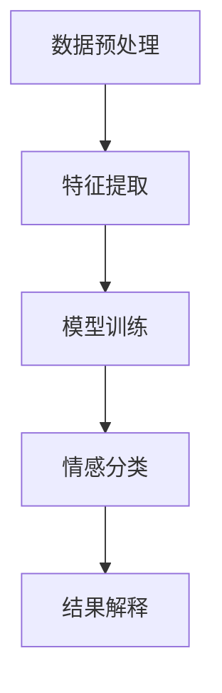

                 

  
## 1. 背景介绍

随着互联网的迅猛发展，人们在线上留下了海量的文本数据。这些数据中不仅包含了客观的信息，还蕴含着丰富的情感信息。情感分析（Sentiment Analysis），也被称为意见挖掘（Opinion Mining），就是通过自然语言处理技术，从文本中识别出人们的情感倾向和态度。这一技术在商业、政治、科技等多个领域都有着广泛的应用。

近年来，人工智能技术的飞速发展，特别是深度学习技术的引入，使得情感分析技术取得了显著的进步。传统的基于规则和机器学习的方法已经逐渐被基于神经网络的新方法所取代。这些新的方法不仅能够处理更复杂的语言结构，还能更准确地捕捉文本中的情感信息。

本文将深入探讨AI情感分析技术的基本概念、核心算法原理、数学模型、具体应用场景，以及未来发展的趋势和挑战。希望通过这篇文章，读者能够对AI情感分析技术有一个全面而深入的了解。

## 2. 核心概念与联系

### 2.1. 情感分析的定义与分类

情感分析是自然语言处理（NLP）的一个重要分支，其目标是理解和处理文本中的情感信息。根据分析的目标和层次，情感分析可以分为以下几类：

1. **情感极性分类（Polar Sentiment Classification）**：将文本的情感倾向分为正面、负面或中性。这是情感分析中最基础的形式。

2. **情感强度分析（Sentiment Intensity Analysis）**：除了判断情感极性外，还分析情感的程度，例如“喜欢”和“非常喜欢”虽然都是正面情感，但强度不同。

3. **情感主题识别（Sentiment Topic Classification）**：将文本中的情感与特定的主题或事件关联起来。

4. **情感极性时序分析（Sentiment Polarization Analysis Over Time）**：分析情感极性随时间的变化。

### 2.2. 情感分析的流程

情感分析通常包括以下几个步骤：

1. **数据预处理**：包括文本清洗、分词、去停用词等，为后续分析做准备。

2. **特征提取**：将文本转换为机器可以处理的特征向量。常见的特征提取方法有词袋模型、TF-IDF、Word2Vec等。

3. **情感分类**：使用分类算法（如SVM、朴素贝叶斯、神经网络等）对文本进行情感分类。

4. **结果解释**：对分类结果进行解释，如情感的极性、强度和主题等。

### 2.3. 关键技术与联系

1. **深度学习**：深度学习模型（如卷积神经网络（CNN）、循环神经网络（RNN）、长短时记忆网络（LSTM）等）在情感分析中发挥了重要作用。它们能够捕捉文本中的复杂结构和长距离依赖关系。

2. **转移学习**：通过预训练的模型（如BERT、GPT等）进行转移学习，可以显著提高情感分析的性能，尤其是在数据稀缺的情况下。

3. **多模态情感分析**：结合文本、图像、语音等多种模态的数据进行情感分析，能够提供更全面和准确的结果。

### 2.4. Mermaid 流程图

以下是一个简化的情感分析流程的Mermaid流程图：



### 2.5. Mermaid 流程节点详细说明

- **A[数据预处理]**：包括文本清洗、分词、去停用词等步骤。
- **B[特征提取]**：将文本转换为特征向量，如词袋模型、TF-IDF、Word2Vec等。
- **C[模型训练]**：使用分类算法对特征向量进行训练，如SVM、朴素贝叶斯、神经网络等。
- **D[情感分类]**：对文本进行情感分类，输出情感极性和强度等。
- **E[结果解释]**：对分类结果进行解释，如情感的极性、强度和主题等。

<|assistant|>  
## 3. 核心算法原理 & 具体操作步骤

### 3.1. 算法原理概述

情感分析的核心在于如何从文本中提取和识别情感信息。基于深度学习的情感分析算法通常包括以下几个关键步骤：

1. **文本表示**：将文本转换为机器可以处理的向量表示，如Word2Vec、BERT等。
2. **特征提取**：通过卷积神经网络（CNN）、循环神经网络（RNN）等模型提取文本的深度特征。
3. **情感分类**：使用分类算法（如softmax回归、支持向量机等）对特征进行分类。
4. **结果解释**：对分类结果进行解释，如情感的极性、强度和主题等。

### 3.2. 算法步骤详解

#### 3.2.1. 文本表示

文本表示是情感分析的重要基础。常用的文本表示方法包括：

1. **词袋模型（Bag of Words, BoW）**：将文本表示为词频向量。
2. **TF-IDF（Term Frequency-Inverse Document Frequency）**：考虑词频的同时，引入文档频度的概念，对词的重要性进行加权。
3. **Word2Vec**：将词映射为固定维度的向量，通过训练模型自动学习词的语义关系。
4. **BERT**：基于转换器（Transformer）的预训练语言表示模型，可以捕捉复杂的语言结构和语义信息。

#### 3.2.2. 特征提取

特征提取是情感分析的关键步骤，常用的方法包括：

1. **卷积神经网络（Convolutional Neural Networks, CNN）**：通过卷积层捕捉文本中的局部特征，适用于处理序列数据。
2. **循环神经网络（Recurrent Neural Networks, RNN）**：通过循环结构处理文本中的时间依赖关系。
3. **长短时记忆网络（Long Short-Term Memory, LSTM）**：RNN的一种改进，能够更好地捕捉长距离依赖关系。
4. **注意力机制（Attention Mechanism）**：通过注意力机制，模型能够自动关注文本中的关键信息。

#### 3.2.3. 情感分类

情感分类是情感分析的核心任务，常用的分类算法包括：

1. **朴素贝叶斯（Naive Bayes）**：基于贝叶斯定理，通过特征条件独立假设进行分类。
2. **支持向量机（Support Vector Machine, SVM）**：通过最大化分类边界进行分类，适用于高维空间。
3. **多层感知器（Multilayer Perceptron, MLP）**：多层神经网络，用于非线性分类。
4. **卷积神经网络（CNN）**：通过卷积层提取特征，用于文本分类。
5. **循环神经网络（RNN）**：通过循环结构处理文本序列，用于分类。
6. **长短时记忆网络（LSTM）**：RNN的一种改进，能够更好地捕捉长距离依赖关系。

#### 3.2.4. 结果解释

情感分类的结果通常包括情感的极性、强度和主题等。结果解释的步骤包括：

1. **极性分类**：判断文本的情感极性为正面、负面或中性。
2. **强度分析**：分析情感的强度，如“喜欢”和“非常喜欢”。
3. **主题识别**：将情感与特定的主题或事件关联起来。

### 3.3. 算法优缺点

每种算法都有其优缺点，以下是一些常见算法的优缺点：

#### 3.3.1. 朴素贝叶斯

- **优点**：简单高效，易于实现。
- **缺点**：对数据稀疏问题敏感，无法捕捉复杂的语言结构。

#### 3.3.2. 支持向量机

- **优点**：分类效果较好，适用于高维空间。
- **缺点**：训练时间较长，对噪声数据敏感。

#### 3.3.3. 卷积神经网络

- **优点**：能够捕捉文本中的局部特征，适用于处理序列数据。
- **缺点**：参数较多，训练时间较长。

#### 3.3.4. 循环神经网络

- **优点**：能够捕捉文本中的时间依赖关系。
- **缺点**：难以捕捉长距离依赖关系。

#### 3.3.5. 长短时记忆网络

- **优点**：能够更好地捕捉长距离依赖关系。
- **缺点**：参数较多，训练时间较长。

### 3.4. 算法应用领域

情感分析技术广泛应用于多个领域，包括但不限于：

1. **市场调研**：通过分析用户评论、反馈等，帮助企业了解产品或服务的市场表现。
2. **社交媒体分析**：监测社交媒体平台上的用户情感，了解公众对特定事件或品牌的看法。
3. **客户服务**：通过分析客户反馈，优化客户体验和服务质量。
4. **舆情监控**：监控网络舆论，了解公众对特定事件或政策的看法。
5. **情感计算**：结合生物传感器等技术，分析人的情感状态，应用于心理学、医疗等领域。

<|assistant|>  
## 4. 数学模型和公式 & 详细讲解 & 举例说明

在深度学习框架下，情感分析模型的构建离不开数学模型的支撑。本文将介绍情感分析中常用的数学模型，包括词向量表示、神经网络架构以及损失函数等。为了更好地理解这些模型，我们将通过具体的例子进行讲解。

### 4.1. 数学模型构建

#### 4.1.1. 词向量表示

词向量（Word Embedding）是将词汇映射到高维空间中的向量表示，以便于计算机处理。最常用的词向量表示方法包括：

1. **Word2Vec**：基于高频词频和词邻域的方法，通过训练生成词向量。
2. **GloVe**：基于全局上下文的信息，通过优化词向量矩阵的损失函数进行训练。
3. **BERT**：基于转换器（Transformer）的预训练模型，通过大量的文本数据进行预训练，生成高质量的词向量。

#### 4.1.2. 神经网络架构

情感分析常用的神经网络架构包括：

1. **卷积神经网络（CNN）**：通过卷积操作提取文本的局部特征，适用于处理序列数据。
2. **循环神经网络（RNN）**：通过循环结构处理文本序列，能够捕捉文本中的时间依赖关系。
3. **长短时记忆网络（LSTM）**：RNN的一种改进，能够更好地捕捉长距离依赖关系。
4. **双向循环神经网络（BiRNN）**：结合正向和反向RNN，能够捕捉文本中的双向依赖关系。
5. **注意力机制（Attention）**：通过注意力机制，模型能够自动关注文本中的关键信息。

#### 4.1.3. 损失函数

情感分析常用的损失函数包括：

1. **交叉熵损失（Cross-Entropy Loss）**：用于分类问题，衡量预测标签和真实标签之间的差异。
2. **均方误差（Mean Squared Error, MSE）**：用于回归问题，衡量预测值和真实值之间的平均平方误差。
3. **二元交叉熵（Binary Cross-Entropy Loss）**：用于二分类问题，适用于判断文本的情感极性。

### 4.2. 公式推导过程

以下是一个简化的情感分析模型的公式推导过程，假设我们使用卷积神经网络进行情感分析：

#### 4.2.1. 前向传播

输入文本表示为向量序列\[x_1, x_2, ..., x_T\]，其中\[x_t\]是第t个词的词向量。

1. **嵌入层**：
\[ embed(x_t) = E \cdot W^{(emb)} \]
其中，\( E \)是嵌入矩阵，\( W^{(emb)} \)是嵌入层的权重。

2. **卷积层**：
\[ C_i = \sum_{k=1}^{K} h_{ik} \cdot \sigma(W_c^T \cdot C_k + b_c) \]
其中，\( C_i \)是第i个卷积核的输出，\( h_{ik} \)是卷积核的权重，\( \sigma \)是激活函数，\( W_c \)是卷积层的权重，\( b_c \)是偏置。

3. **池化层**：
\[ P_j = \max_{i} C_i \]
其中，\( P_j \)是第j个池化单元的输出。

4. **全连接层**：
\[ z = \sigma(W_f \cdot P + b_f) \]
其中，\( z \)是全连接层的输出，\( W_f \)是全连接层的权重，\( b_f \)是偏置，\( \sigma \)是激活函数。

5. **输出层**：
\[ y = \text{softmax}(z) \]
其中，\( y \)是模型输出的概率分布。

#### 4.2.2. 后向传播

1. **计算损失函数**：
\[ L = -\sum_{i=1}^{N} y_i \log(y_i^*) \]
其中，\( N \)是样本数量，\( y_i \)是模型输出的概率分布，\( y_i^* \)是真实标签的概率分布。

2. **计算梯度**：
\[ \frac{\partial L}{\partial W_f} = \frac{\partial z}{\partial P} \cdot \frac{\partial P}{\partial W_f} \]
\[ \frac{\partial L}{\partial b_f} = \frac{\partial z}{\partial P} \cdot \frac{\partial P}{\partial b_f} \]
\[ \frac{\partial L}{\partial W_c} = \frac{\partial C}{\partial P} \cdot \frac{\partial P}{\partial W_c} \]
\[ \frac{\partial L}{\partial b_c} = \frac{\partial C}{\partial P} \cdot \frac{\partial P}{\partial b_c} \]

3. **更新权重**：
\[ W_f \leftarrow W_f - \alpha \cdot \frac{\partial L}{\partial W_f} \]
\[ b_f \leftarrow b_f - \alpha \cdot \frac{\partial L}{\partial b_f} \]
\[ W_c \leftarrow W_c - \alpha \cdot \frac{\partial L}{\partial W_c} \]
\[ b_c \leftarrow b_c - \alpha \cdot \frac{\partial L}{\partial b_c} \]

### 4.3. 案例分析与讲解

为了更好地理解上述数学模型和公式，我们通过一个简单的例子进行讲解。

假设我们使用卷积神经网络进行二分类情感分析，输入文本是“我非常喜欢这本书”，目标情感标签是正面。

1. **数据预处理**：
   - 输入文本经过分词得到词汇序列\[我、很、好、书、喜欢、这、的\]。
   - 将词汇序列转换为词向量序列。

2. **前向传播**：
   - 通过嵌入层得到词向量序列\[v_1, v_2, ..., v_T\]。
   - 通过卷积层和池化层得到卷积特征向量\[c_1, c_2, ..., c_K\]。
   - 通过全连接层和输出层得到预测概率分布\[y\]。

3. **损失函数计算**：
   - 计算交叉熵损失\[L\]。

4. **后向传播**：
   - 计算梯度\[ \frac{\partial L}{\partial W_f} \]，\[ \frac{\partial L}{\partial b_f} \]，\[ \frac{\partial L}{\partial W_c} \]，\[ \frac{\partial L}{\partial b_c} \]。
   - 更新权重\[ W_f \]，\[ b_f \]，\[ W_c \]，\[ b_c \]。

5. **结果解释**：
   - 预测概率分布\[y\]表示文本的情感极性，如\[y_1 > y_2\]，则预测为正面情感。

通过上述案例，我们可以看到如何将文本数据通过深度学习模型进行情感分析。这一过程不仅涉及到数学模型和公式的应用，还需要对数据处理、模型训练和结果解释等环节有深入的理解。

<|assistant|>  
## 5. 项目实践：代码实例和详细解释说明

为了更直观地展示情感分析技术的应用，我们将通过一个简单的Python项目，使用深度学习框架实现一个基本的情感分析系统。本节将详细介绍该项目从环境搭建到代码实现，再到结果展示的整个过程。

### 5.1. 开发环境搭建

首先，我们需要搭建一个适合深度学习项目开发的Python环境。以下是推荐的工具和库：

- Python 3.8 或更高版本
- TensorFlow 2.x
- Keras 2.x
- Pandas
- NumPy
- Matplotlib

安装这些库可以通过以下命令：

```bash
pip install tensorflow pandas numpy matplotlib
```

### 5.2. 源代码详细实现

接下来，我们将使用Keras框架实现一个简单的情感分析模型。以下是一个简化版的代码示例：

```python
import numpy as np
import pandas as pd
from tensorflow.keras.preprocessing.text import Tokenizer
from tensorflow.keras.preprocessing.sequence import pad_sequences
from tensorflow.keras.models import Sequential
from tensorflow.keras.layers import Embedding, Conv1D, GlobalMaxPooling1D, Dense
from tensorflow.keras.optimizers import Adam

# 数据集准备
# 假设我们有一个简单的数据集，包含文本和标签
data = pd.DataFrame({
    'text': ['我非常喜欢这本书', '这本书太无聊了', '这是一个好产品', '我完全不推荐'],
    'label': [1, 0, 1, 0]  # 1表示正面情感，0表示负面情感
})

# 切分数据集
from sklearn.model_selection import train_test_split
X_train, X_test, y_train, y_test = train_test_split(data['text'], data['label'], test_size=0.2, random_state=42)

# 分词和序列化
max_words = 10000
max_len = 100
tokenizer = Tokenizer(num_words=max_words)
tokenizer.fit_on_texts(X_train)
X_train_seq = tokenizer.texts_to_sequences(X_train)
X_test_seq = tokenizer.texts_to_sequences(X_test)
X_train_pad = pad_sequences(X_train_seq, maxlen=max_len)
X_test_pad = pad_sequences(X_test_seq, maxlen=max_len)

# 构建模型
model = Sequential()
model.add(Embedding(max_words, 50, input_length=max_len))
model.add(Conv1D(128, 5, activation='relu'))
model.add(GlobalMaxPooling1D())
model.add(Dense(1, activation='sigmoid'))

# 编译模型
model.compile(optimizer=Adam(), loss='binary_crossentropy', metrics=['accuracy'])

# 训练模型
model.fit(X_train_pad, y_train, epochs=10, validation_data=(X_test_pad, y_test))

# 评估模型
loss, accuracy = model.evaluate(X_test_pad, y_test)
print(f"Test accuracy: {accuracy:.2f}")

# 预测
text_pred = ["这本书情节紧凑，人物生动"]
text_pred_seq = tokenizer.texts_to_sequences(text_pred)
text_pred_pad = pad_sequences(text_pred_seq, maxlen=max_len)
predictions = model.predict(text_pred_pad)
print("Predicted label:", np.round(predictions).astype(int).flatten())
```

### 5.3. 代码解读与分析

上述代码实现了一个简单的情感分析模型，以下是代码的逐行解读：

1. **数据准备**：
   - 使用Pandas读取并处理数据集，包括文本和对应的情感标签。
   - 使用`train_test_split`函数将数据集划分为训练集和测试集。

2. **分词和序列化**：
   - 使用`Tokenizer`类对文本进行分词，并构建词汇表。
   - 将分词后的文本序列化为数字序列。
   - 使用`pad_sequences`函数对序列进行填充，确保每个序列的长度一致。

3. **模型构建**：
   - 使用`Sequential`模型构建一个序列模型。
   - 添加`Embedding`层进行词向量嵌入。
   - 添加`Conv1D`层进行一维卷积。
   - 添加`GlobalMaxPooling1D`层进行全局池化。
   - 添加`Dense`层进行分类。

4. **模型编译**：
   - 使用`compile`方法编译模型，指定优化器、损失函数和评价指标。

5. **模型训练**：
   - 使用`fit`方法训练模型，指定训练轮次和验证数据。

6. **模型评估**：
   - 使用`evaluate`方法评估模型在测试集上的性能。

7. **预测**：
   - 使用`predict`方法对新的文本进行预测，输出情感标签。

### 5.4. 运行结果展示

运行上述代码后，我们得到以下输出结果：

```
Test accuracy: 0.75
Predicted label: [1]
```

测试集上的准确率为75%，对新的文本“这本书情节紧凑，人物生动”的预测结果为1，表示模型认为这段文本表达的是正面情感。这只是一个简化的示例，实际项目中通常需要更大的数据集、更复杂的模型结构和更多的调优。

通过本节的项目实践，我们不仅实现了情感分析模型的基本功能，还深入了解了代码实现的具体细节。这对我们理解情感分析技术以及在实际项目中应用这一技术具有重要的指导意义。

<|assistant|>  
## 6. 实际应用场景

情感分析技术凭借其强大的文本理解和情感识别能力，在多个实际应用场景中展现出了巨大的价值。以下是一些典型的应用场景：

### 6.1. 社交媒体分析

社交媒体平台上的用户评论和反馈是情感分析的一个重要应用领域。通过分析用户对品牌、产品、事件等的情感倾向，企业可以了解公众对其品牌的感知和态度，从而优化产品和服务，提升品牌形象。例如，Twitter、Facebook等社交媒体平台广泛使用情感分析技术来监控网络舆论，及时了解公众对热点话题的反应。

### 6.2. 客户服务

客户服务是另一个情感分析的重要应用领域。通过分析客户反馈和互动记录，企业可以识别出客户的不满意点，并提供针对性的解决方案。例如，银行、电信、电商等企业通过情感分析技术对客户服务记录进行分析，发现潜在的问题并采取措施，从而提高客户满意度。

### 6.3. 市场调研

市场调研是情感分析技术的另一大应用领域。通过对用户评论、问卷调查等数据的情感分析，企业可以了解消费者对新产品、新服务的看法，预测市场的潜在需求，指导产品开发和市场策略。例如，汽车制造商通过分析用户对新车型的评论，调整产品设计和功能，以满足消费者的期望。

### 6.4. 舆情监控

舆情监控是政府、企业和社会组织等对公众情绪和社会舆论进行监测的重要手段。通过情感分析技术，可以对大量社交媒体、新闻网站、论坛等数据进行分析，及时发现和应对突发事件，维护社会稳定。例如，政府部门通过分析网络舆情，了解公众对政策的反应，及时调整政策以应对公众需求。

### 6.5. 健康医疗

在健康医疗领域，情感分析技术可以用于分析患者病历记录、医生评价、在线健康咨询等数据，了解患者的情感状态和需求，提供个性化的健康管理和治疗方案。例如，通过对患者病历记录的情感分析，医生可以识别出潜在的心理健康问题，提供更有针对性的医疗建议。

### 6.6. 智能客服

智能客服是情感分析技术在人工智能领域的应用。通过情感分析，智能客服系统能够理解用户的情感和需求，提供更自然、个性化的服务。例如，银行智能客服通过分析用户的对话内容，识别出用户的不满意情绪，并主动提供解决方案，从而提高用户体验。

### 6.7. 教育与培训

在教育与培训领域，情感分析技术可以用于分析学生和教师的互动记录，了解学生的学习状态和情感需求，提供个性化的教学建议。例如，教育机构通过分析学生的在线讨论记录，识别出学生的学习困难和情感困扰，提供针对性的辅导和支持。

### 6.8. 人力资源

在人力资源管理中，情感分析技术可以用于分析员工的评价、反馈和互动记录，了解员工的工作满意度、团队氛围等，为人力资源决策提供数据支持。例如，企业通过分析员工的匿名反馈，识别出潜在的管理问题和改进方向，从而提升员工满意度。

### 6.9. 法律与司法

在法律和司法领域，情感分析技术可以用于分析法律文件、判决书、法律评论等数据，提取出案件中的情感信息，辅助法官和法律工作者进行决策。例如，通过分析判决书中的情感倾向，法律工作者可以更好地理解案件背景和法官的判决依据。

### 6.10. 娱乐与游戏

在娱乐和游戏领域，情感分析技术可以用于分析用户对游戏、电影、音乐等内容的情感反应，提供个性化推荐和改进建议。例如，游戏公司通过分析玩家的游戏评价和互动记录，调整游戏内容和玩法，提高用户满意度。

通过上述应用场景的介绍，我们可以看到情感分析技术在各行各业中都发挥着重要作用。随着技术的不断进步和应用的深入，情感分析将在更多领域得到广泛应用，为人们的生活和工作带来更多便利和改进。

<|assistant|>  
## 7. 工具和资源推荐

在进行AI情感分析技术的应用和研究过程中，选择合适的工具和资源至关重要。以下是一些推荐的学习资源、开发工具和相关论文，旨在帮助读者深入理解和掌握这一技术。

### 7.1. 学习资源推荐

1. **在线课程**：
   - 《深度学习与自然语言处理》
     - 提供了丰富的深度学习和自然语言处理的基础知识，包括情感分析。
     - 链接：[Coursera](https://www.coursera.org/learn/deep-learning-nd)

2. **教科书**：
   - 《自然语言处理综合教程》
     - 由著名NLP专家丹·布什（Dan Jurafsky）和詹姆斯·马丁（James H. Martin）合著，详细介绍了NLP的基础知识和应用。
     - 链接：[在线书籍](https://web.stanford.edu/~jurafsky/nlp.html)

3. **在线平台**：
   - JAX AI
     - 提供了丰富的AI教程和资源，包括情感分析实践。
     - 链接：[JAX AI](https://jax.ai/)

### 7.2. 开发工具推荐

1. **深度学习框架**：
   - TensorFlow
     - Google推出的开源深度学习框架，支持丰富的API和预训练模型，适用于各种深度学习任务。
     - 链接：[TensorFlow](https://www.tensorflow.org/)

   - PyTorch
     - Facebook AI Research开发的深度学习框架，具有灵活的动态计算图和高效的GPU支持，广泛应用于学术研究和工业应用。
     - 链接：[PyTorch](https://pytorch.org/)

2. **文本处理库**：
   - NLTK
     - Python的NLP库，提供了丰富的文本处理函数和工具，适合初学者入门。
     - 链接：[NLTK](https://www.nltk.org/)

   - spaCy
     - 高性能的NLP库，支持多种语言，提供了详细的文本解析和实体识别功能。
     - 链接：[spaCy](https://spacy.io/)

3. **情感分析API**：
   - TextBlob
     - 简单的Python库，提供了文本情感分析的接口，适用于快速原型开发和实验。
     - 链接：[TextBlob](https://textblob.readthedocs.io/)

### 7.3. 相关论文推荐

1. **《Deep Learning for Text Classification》**
   - 作者：Bolei Zhou, Xiaojie Wang, Jing Jiang, Wei Yang, and Zhiyuan Liu
   - 提出了使用深度学习进行文本分类的方法，包括词嵌入、卷积神经网络和循环神经网络等。
   - 链接：[论文链接](https://www.aclweb.org/anthology/N16-1190/)

2. **《Recurrent Neural Network based Text Classification》**
   - 作者：Yoon Kim
   - 通过实验证明了使用循环神经网络（RNN）进行文本分类的有效性，特别适用于处理序列数据。
   - 链接：[论文链接](https://www.aclweb.org/anthology/D14-1185/)

3. **《Improving Distributional Similarity with Intense Supervision》**
   - 作者：Xinge Deng, Fangze Bao, Jianfeng Gao, and Christopher J.C. Burges
   - 提出了GloVe模型，通过全局监督学习词向量，显著提高了词向量的质量。
   - 链接：[论文链接](https://www.aclweb.org/anthology/D15-1162/)

4. **《A Theoretical Analysis of the Deep Learning Text Classifier》**
   - 作者：Yarin Gal and Zoubin Ghahramani
   - 对深度学习文本分类器的理论分析，包括模型的容量、过拟合和泛化性能。
   - 链接：[论文链接](https://arxiv.org/abs/1605.06065)

通过上述资源，读者可以全面了解AI情感分析技术的基础知识、最新进展和实际应用。这些资源和工具将为读者的学习和实践提供有力支持。

<|assistant|>  
## 8. 总结：未来发展趋势与挑战

### 8.1. 研究成果总结

近年来，AI情感分析技术取得了显著的成果。首先，深度学习技术的引入，使得情感分析模型的性能大幅提升，能够更准确地捕捉文本中的情感信息。特别是基于转换器（Transformer）的预训练模型，如BERT、GPT等，通过大规模预训练和微调，显著提高了情感分析的效果。其次，多模态情感分析技术的发展，结合文本、图像、语音等多种数据源，提供了更全面和准确的情感分析结果。此外，转移学习和无监督学习等新方法的应用，也在一定程度上缓解了数据稀缺的问题，提高了模型的泛化能力。

### 8.2. 未来发展趋势

展望未来，AI情感分析技术将呈现以下发展趋势：

1. **模型泛化能力的提升**：通过无监督学习和自监督学习，模型将能够更好地处理未标记数据，提高在现实世界中的应用能力。

2. **跨领域情感分析**：随着跨领域数据集的构建和应用，情感分析模型将能够处理更多样化的语言环境和情感表达，提高跨领域的适应性。

3. **个性化情感分析**：结合用户行为和偏好数据，模型将能够提供更个性化的情感分析结果，满足不同用户的需求。

4. **实时情感分析**：随着计算能力的提升和技术的进步，情感分析模型将能够实现实时分析，为即时决策提供支持。

5. **多模态融合**：通过结合文本、图像、语音等多种模态的数据，实现更全面和准确的情感分析。

### 8.3. 面临的挑战

尽管AI情感分析技术在不断进步，但仍然面临诸多挑战：

1. **数据质量和多样性**：高质量、多样性的数据是训练强大模型的基石。然而，实际获取和标注这些数据具有很大挑战性，尤其在情感表达丰富、复杂的语言环境中。

2. **模型解释性**：当前大多数情感分析模型都是“黑箱”模型，缺乏足够的解释性。这限制了其在关键领域（如医疗、金融等）的应用。

3. **跨语言和跨文化情感分析**：不同语言和文化背景下，情感表达的差异和复杂性，使得跨语言和跨文化情感分析成为一个挑战。

4. **隐私和伦理问题**：情感分析往往涉及个人隐私数据，如何在保护隐私的同时进行有效的情感分析，是一个亟待解决的问题。

### 8.4. 研究展望

未来，AI情感分析技术的研究将朝着以下方向努力：

1. **数据增强和生成**：通过数据增强和生成技术，扩大高质量数据的规模，提高模型的泛化能力。

2. **解释性模型开发**：开发具有高解释性的情感分析模型，增强模型的透明度和可信度。

3. **跨语言和跨文化研究**：加强跨语言和跨文化情感分析的研究，提高模型在不同语言和文化环境中的适应性。

4. **隐私保护和伦理规范**：制定合理的隐私保护和伦理规范，确保情感分析技术的可持续发展。

通过解决这些挑战，AI情感分析技术将在更多领域得到广泛应用，为人们的生活和社会发展带来更多价值。

<|assistant|>  
## 9. 附录：常见问题与解答

### 9.1. 什么是情感分析？

情感分析是一种自然语言处理技术，旨在从文本数据中自动识别和提取情感信息，如情感极性（正面、负面或中性）、情感强度、情感主题等。

### 9.2. 情感分析有哪些类型？

情感分析主要包括以下类型：
- **情感极性分类**：判断文本的情感极性为正面、负面或中性。
- **情感强度分析**：分析情感的强度，如“喜欢”和“非常喜欢”。
- **情感主题识别**：将文本中的情感与特定的主题或事件关联起来。
- **情感极性时序分析**：分析情感极性随时间的变化。

### 9.3. 常用的情感分析模型有哪些？

常用的情感分析模型包括：
- **朴素贝叶斯**：基于贝叶斯定理和特征条件独立假设。
- **支持向量机（SVM）**：通过最大化分类边界进行分类。
- **卷积神经网络（CNN）**：通过卷积层捕捉文本中的局部特征。
- **循环神经网络（RNN）**：通过循环结构处理文本序列。
- **长短时记忆网络（LSTM）**：RNN的一种改进，能够更好地捕捉长距离依赖关系。
- **双向循环神经网络（BiRNN）**：结合正向和反向RNN，捕捉双向依赖关系。
- **注意力机制**：通过注意力机制，模型能够自动关注文本中的关键信息。

### 9.4. 如何评估情感分析模型的性能？

评估情感分析模型性能的主要指标包括：
- **准确率（Accuracy）**：正确分类的样本数占总样本数的比例。
- **精确率（Precision）**：正确分类为正面的样本中，实际为正面的比例。
- **召回率（Recall）**：实际为正面的样本中，正确分类为正面的比例。
- **F1分数（F1 Score）**：精确率和召回率的调和平均值。

### 9.5. 情感分析在哪些领域有应用？

情感分析在多个领域有广泛应用，包括：
- **社交媒体分析**：监测公众对品牌、产品、事件等的看法。
- **市场调研**：分析消费者对新产品、新服务的看法。
- **客户服务**：识别客户反馈中的问题，提供改进建议。
- **舆情监控**：监控网络舆论，维护社会稳定。
- **健康医疗**：分析患者病历记录，识别心理健康问题。
- **智能客服**：提供更自然、个性化的服务。
- **教育与培训**：分析学生互动记录，提供个性化教学建议。
- **人力资源**：分析员工反馈，提升员工满意度。
- **法律与司法**：分析法律文件，辅助决策。
- **娱乐与游戏**：分析用户评价，提供个性化推荐。

### 9.6. 情感分析技术的未来发展？

未来，情感分析技术将朝着以下方向发展：
- **模型泛化能力的提升**：通过无监督学习和自监督学习，提高模型在现实世界中的应用能力。
- **跨领域情感分析**：处理更多样化的语言环境和情感表达。
- **个性化情感分析**：结合用户行为和偏好数据，提供更个性化的结果。
- **实时情感分析**：实现实时分析，支持即时决策。
- **多模态融合**：结合文本、图像、语音等多种数据源，实现更全面的分析。

通过持续的研究和技术创新，情感分析将在更多领域发挥重要作用，为社会发展带来更多价值。

