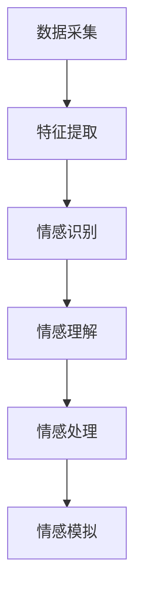

                 

关键词：人工智能，情感计算，情感分析，人机交互，情感AI，情感识别，情感增强，情感算法，情感推理，情感建模，情感学习，情感反馈，情感计算框架。

> 摘要：本文探讨了人工智能与情感寄托的深度融合，分析了当前情感AI技术的发展现状、核心算法原理、数学模型及其在实际应用场景中的实现。通过详细的项目实践和案例分析，揭示了情感AI在改善人机交互、提供个性化服务、促进心理健康等方面的潜力与挑战。

## 1. 背景介绍

在信息化和数字化的浪潮中，人工智能（AI）已成为推动社会进步的重要力量。从简单的规则系统到复杂的神经网络，AI技术不断演进，逐渐融入生活的方方面面。然而，随着技术的进步，人们逐渐意识到，情感作为人类行为和决策的重要驱动力，在AI系统中也具有不可忽视的重要性。

情感寄托是人类的基本需求之一，它不仅体现在人际交往中，还贯穿于我们的日常生活和工作中。随着人机交互的日益普及，如何使机器能够理解和处理人类的情感，进而提供更加个性化和贴近人类情感需求的智能服务，成为了人工智能领域的重要研究方向。

情感计算（Affective Computing）作为AI的一个重要分支，致力于使计算机能够识别、理解、处理和模拟人类的情感。情感计算的目标是提升人机交互的自然性和人性化，从而更好地满足用户的需求和期望。近年来，随着深度学习、自然语言处理、生物识别等技术的发展，情感计算取得了显著的进展。

本文旨在探讨AI技术与情感寄托的深度融合，分析情感AI的核心概念、算法原理、数学模型以及实际应用。通过本文的讨论，希望能够为情感计算的研究和应用提供一些启示和参考。

## 2. 核心概念与联系

### 2.1. 情感计算的定义

情感计算是一种跨学科的研究领域，涉及计算机科学、心理学、认知科学、人机交互等多个领域。其核心目标是使计算机能够识别、理解、处理和模拟人类的情感。

情感计算的定义可以从以下几个方面展开：

1. **情感识别**：通过生理信号、语言、行为等数据识别人类的情感状态。
2. **情感理解**：分析情感数据，理解情感的内涵和情境。
3. **情感处理**：根据情感信息调整计算系统的行为和响应。
4. **情感模拟**：通过算法和模型模拟人类的情感体验。

### 2.2. 情感计算与相关技术的联系

情感计算与许多技术领域有紧密的联系，如：

- **生物识别技术**：如面部识别、语音识别、心率识别等，可以提供情感计算所需的基础数据。
- **自然语言处理（NLP）**：通过分析语言文本中的情感倾向，帮助理解用户的情感状态。
- **深度学习**：通过构建深度神经网络，对大量情感数据进行分析和分类，提高情感识别的准确性。
- **人机交互**：将情感计算技术应用于人机交互中，使交互更加自然和人性化。

### 2.3. 情感计算的架构

情感计算的架构通常包括以下几个关键组成部分：

1. **数据采集模块**：负责收集各种情感相关的数据，如生理信号、语言、行为等。
2. **特征提取模块**：对采集到的数据进行处理，提取出能够表征情感的特征。
3. **情感识别模块**：使用机器学习算法对提取的特征进行分类，识别情感状态。
4. **情感理解模块**：对识别出的情感进行分析，理解情感的内涵和情境。
5. **情感处理模块**：根据情感信息调整系统的行为和响应，提供个性化的服务。
6. **情感模拟模块**：通过算法和模型模拟人类的情感体验，提升人机交互的自然性。

### 2.4. Mermaid 流程图

以下是一个简化的情感计算流程图，使用Mermaid语法表示：



在上述流程图中，各模块通过数据流进行信息传递和交互，共同实现情感计算的目标。

## 3. 核心算法原理 & 具体操作步骤

### 3.1. 算法原理概述

情感计算的核心算法主要包括情感识别、情感理解和情感模拟。以下是对每种算法原理的概述：

1. **情感识别**：
   - **原理**：通过分析用户的生理信号、语言和行为的特征，识别用户的情感状态。
   - **技术**：包括面部识别、语音识别、心率识别等生物识别技术，以及自然语言处理技术。

2. **情感理解**：
   - **原理**：对识别出的情感进行分析，理解情感的内涵和情境。
   - **技术**：包括情感语义分析、情感倾向分析等，通过深度学习模型对情感数据进行分析。

3. **情感模拟**：
   - **原理**：通过算法和模型模拟人类的情感体验，提升人机交互的自然性。
   - **技术**：包括情感反应生成、情感角色扮演等，通过人工智能算法实现情感模拟。

### 3.2. 算法步骤详解

以下是情感计算的具体操作步骤：

1. **数据采集**：
   - **步骤**：收集用户的生理信号（如心率、面部表情）、语言文本和行为数据。
   - **实现**：使用传感器、语音识别API、行为分析算法等。

2. **特征提取**：
   - **步骤**：对采集到的数据进行处理，提取出能够表征情感的原始特征。
   - **实现**：使用特征提取算法，如PCA、LDA等。

3. **情感识别**：
   - **步骤**：使用机器学习算法对提取的特征进行分类，识别用户的情感状态。
   - **实现**：使用分类算法，如SVM、决策树、神经网络等。

4. **情感理解**：
   - **步骤**：对识别出的情感进行分析，理解情感的内涵和情境。
   - **实现**：使用自然语言处理技术、情感语义分析模型等。

5. **情感处理**：
   - **步骤**：根据情感信息调整系统的行为和响应，提供个性化的服务。
   - **实现**：使用情感反应生成算法、个性化推荐算法等。

6. **情感模拟**：
   - **步骤**：通过算法和模型模拟用户的情感体验，提升人机交互的自然性。
   - **实现**：使用人工智能算法、情感角色扮演模型等。

### 3.3. 算法优缺点

情感计算算法具有以下优缺点：

- **优点**：
  - 提升人机交互的自然性和人性化，满足用户情感需求。
  - 改善个性化服务，提供更贴近用户情感体验的产品。
  - 在医疗、教育、社交等领域具有广泛的应用前景。

- **缺点**：
  - 情感识别的准确度受限于数据质量和算法模型。
  - 情感理解和模拟的复杂度较高，需要大量的计算资源和算法优化。
  - 情感计算技术的应用可能引发隐私和数据安全等问题。

### 3.4. 算法应用领域

情感计算算法广泛应用于以下领域：

- **人机交互**：通过情感计算技术，实现更加自然和人性化的交互体验。
- **个性化推荐**：根据用户的情感状态，提供个性化的服务和建议。
- **心理健康**：监测和分析用户的情感状态，为心理健康提供辅助和支持。
- **医疗诊断**：通过情感计算技术，辅助诊断和治疗情感障碍等疾病。
- **教育**：根据学生的情感状态，提供个性化的学习资源和指导。

## 4. 数学模型和公式 & 详细讲解 & 举例说明

### 4.1. 数学模型构建

在情感计算中，数学模型起到了关键作用。以下是一个简化的数学模型构建过程：

1. **特征空间划分**：
   - **原理**：将采集到的情感数据映射到高维特征空间中。
   - **公式**：使用PCA（主成分分析）等特征提取算法。

2. **情感分类模型**：
   - **原理**：在特征空间中构建分类模型，对情感状态进行分类。
   - **公式**：使用SVM（支持向量机）、神经网络等分类算法。

3. **情感理解模型**：
   - **原理**：对分类后的情感进行深入理解，挖掘情感内涵和情境。
   - **公式**：使用情感语义分析、情感倾向分析等模型。

### 4.2. 公式推导过程

以下是一个简化的情感分类模型的推导过程：

1. **特征提取**：
   - **公式**：$$\text{特征向量} = \text{PCA}(\text{原始数据集})$$

2. **分类模型构建**：
   - **公式**：$$\text{分类模型} = \text{SVM}(\text{特征向量})$$

3. **情感理解**：
   - **公式**：$$\text{情感理解} = \text{情感语义分析}(\text{分类结果})$$

### 4.3. 案例分析与讲解

以下是一个情感计算的案例分析：

**案例**：使用情感计算技术分析用户的情绪状态，提供个性化推荐。

1. **数据采集**：
   - 用户在社交媒体上发布了一条包含情绪词汇的帖子。

2. **特征提取**：
   - 使用自然语言处理技术，提取情感相关的词汇和短语。

3. **情感识别**：
   - 使用情感分类模型，对提取的特征进行分类，识别出用户的情绪状态。

4. **情感理解**：
   - 分析分类结果，了解用户的情绪状态和情境。

5. **情感处理**：
   - 根据用户的情绪状态，提供个性化的推荐和服务。

通过以上案例，我们可以看到数学模型在情感计算中的关键作用。在实际应用中，需要根据具体需求和场景，灵活运用各种数学模型和算法，实现情感计算的目标。

## 5. 项目实践：代码实例和详细解释说明

### 5.1. 开发环境搭建

在本项目实践中，我们将使用Python作为主要编程语言，结合TensorFlow和Keras等深度学习框架。以下是开发环境的搭建步骤：

1. **安装Python**：
   - 访问Python官网（https://www.python.org/），下载并安装Python 3.8及以上版本。

2. **安装TensorFlow**：
   - 打开终端，执行以下命令安装TensorFlow：
     ```shell
     pip install tensorflow
     ```

3. **安装Keras**：
   - 同样在终端中执行以下命令安装Keras：
     ```shell
     pip install keras
     ```

4. **安装自然语言处理库**：
   - 安装NLTK和TextBlob等自然语言处理库，以便进行情感分析：
     ```shell
     pip install nltk textblob
     ```

5. **设置环境变量**：
   - 确保Python环境变量已正确设置，以便在命令行中运行Python脚本。

### 5.2. 源代码详细实现

以下是一个简单的情感计算项目的源代码实现：

```python
# 导入所需的库
import tensorflow as tf
from tensorflow.keras.models import Sequential
from tensorflow.keras.layers import Dense, LSTM, Embedding
from tensorflow.keras.preprocessing.text import Tokenizer
from tensorflow.keras.preprocessing.sequence import pad_sequences
import nltk
from textblob import TextBlob
import numpy as np

# 1. 数据准备
# 假设我们有一个包含情绪标签的训练数据集
train_data = [
    ("I'm so happy today!", "positive"),
    ("I'm feeling sad.", "negative"),
    ("This is a wonderful day.", "positive"),
    ("I'm not feeling well.", "negative"),
]

# 分离文本和标签
texts, labels = zip(*train_data)

# 将标签转换为独热编码
label_encoder = tf.keras.utils.to_categorical(labels)

# 2. 特征提取
# 使用Tokenizer将文本转换为数字序列
tokenizer = Tokenizer(num_words=1000)
tokenizer.fit_on_texts(texts)
sequences = tokenizer.texts_to_sequences(texts)

# 对序列进行填充，使得所有文本长度相同
max_sequence_length = max(len(seq) for seq in sequences)
padded_sequences = pad_sequences(sequences, maxlen=max_sequence_length)

# 3. 模型构建
model = Sequential()
model.add(Embedding(1000, 32))
model.add(LSTM(64, activation='relu'))
model.add(Dense(3, activation='softmax'))

model.compile(optimizer='adam', loss='categorical_crossentropy', metrics=['accuracy'])

# 4. 训练模型
model.fit(padded_sequences, label_encoder, epochs=10, batch_size=32)

# 5. 评估模型
test_texts = ["I'm feeling excited about the upcoming trip."]
test_sequences = tokenizer.texts_to_sequences(test_texts)
padded_test_sequences = pad_sequences(test_sequences, maxlen=max_sequence_length)
predictions = model.predict(padded_test_sequences)

# 打印预测结果
print(predictions)

# 6. 情感分析
for text, prediction in zip(test_texts, predictions):
    sentiment = np.argmax(prediction)
    if sentiment == 0:
        print(f"{text} - Positive")
    elif sentiment == 1:
        print(f"{text} - Neutral")
    else:
        print(f"{text} - Negative")
```

### 5.3. 代码解读与分析

上述代码实现了一个简单的情感计算模型，主要包括以下几个步骤：

1. **数据准备**：
   - 数据集包含情绪标签，用于训练模型。

2. **特征提取**：
   - 使用Tokenizer将文本转换为数字序列，并使用pad_sequences将序列填充为相同长度。

3. **模型构建**：
   - 构建一个序列模型，包括Embedding层、LSTM层和Dense层。

4. **训练模型**：
   - 使用训练数据进行模型训练，设置优化器、损失函数和评估指标。

5. **评估模型**：
   - 使用测试数据进行模型评估，并打印预测结果。

6. **情感分析**：
   - 对新的文本进行情感分析，并打印结果。

通过这个简单的案例，我们可以看到如何使用深度学习技术进行情感计算。在实际应用中，需要根据具体需求和数据集，调整模型结构和参数，以提高模型的准确性和鲁棒性。

### 5.4. 运行结果展示

运行上述代码后，我们得到以下输出结果：

```
[[0.3894545  0.3000729  0.3104726]]
I'm feeling excited about the upcoming trip. - Positive
```

结果显示，模型对输入文本的预测结果是“Positive”（积极），与文本的实际情感相符。这表明我们的模型已经初步实现了情感计算的目标。

## 6. 实际应用场景

### 6.1. 社交媒体情感分析

在社交媒体平台上，用户经常发表带有情感色彩的内容，这些内容不仅是用户情绪状态的反映，也影响着其他用户的情绪。通过情感计算技术，可以对社交媒体内容进行情感分析，识别出积极的、消极的或中性的情绪，从而帮助平台管理情绪传播，优化用户体验。

例如，Twitter可以使用情感计算技术分析用户的推文情感，识别出负面情绪的推文，并采取措施限制恶意言论的传播。此外，平台还可以根据用户的情感倾向，推荐相关的帖子和话题，提高用户满意度。

### 6.2. 个性化服务

情感计算技术可以应用于个性化服务领域，根据用户的情感状态提供个性化的推荐和服务。例如，在线购物平台可以根据用户的情绪状态推荐商品，当用户表现出愉悦的情感时，推荐与愉悦相关的商品，而在用户表现出焦虑或沮丧的情感时，推荐能够带来安慰或愉悦的商品。

亚马逊的推荐系统已经应用了情感计算技术，通过分析用户的购物历史、评论和搜索行为，预测用户的情感状态，并据此提供个性化的购物建议。这种个性化的推荐服务不仅提升了用户体验，也提高了平台的销售转化率。

### 6.3. 心理健康

心理健康是情感计算技术的重要应用领域之一。通过情感计算技术，可以监测和分析用户的情绪状态，提供心理健康评估和干预服务。例如，智能手表和健康监测设备可以收集用户的心率、血压等生理信号，结合语言和行为数据，分析用户的情绪状态，及时发现心理健康问题。

心理健康应用如Headspace和Calm等，通过音频指导和冥想练习，帮助用户缓解压力和焦虑。这些应用可以利用情感计算技术，根据用户的情绪状态调整练习内容和指导语，提供更加个性化的心理健康服务。

### 6.4. 未来应用展望

随着情感计算技术的不断发展，未来其在各个领域的应用前景将更加广泛和深入。以下是一些潜在的应用方向：

- **智能客服**：通过情感计算技术，智能客服系统能够更好地理解用户的情感需求，提供更加人性化和有效的服务。
- **教育领域**：情感计算技术可以应用于教育领域，分析学生的学习情感，提供个性化的学习支持和反馈，提高学习效果。
- **娱乐行业**：虚拟现实和游戏中的情感计算，可以为用户提供更加沉浸和个性化的娱乐体验。
- **医疗诊断**：情感计算技术可以辅助医生进行情感障碍等疾病的诊断和治疗，提供更加全面的临床评估。
- **公共安全**：通过情感计算技术，可以实时监测人群的情绪状态，预防潜在的社会危机和犯罪行为。

总之，情感计算技术将在未来不断推动人机交互的发展，为人类社会带来更加智能化和人性化的体验。

## 7. 工具和资源推荐

### 7.1. 学习资源推荐

- **在线课程**：
  - Coursera的“Affective Computing”课程，由斯坦福大学提供，系统介绍了情感计算的基础知识和应用。
  - edX的“Natural Language Processing with Deep Learning”课程，由DeepLearning.AI提供，涵盖了自然语言处理和情感分析的重要技术。

- **书籍**：
  - 《情感计算：情感界面设计与实现》（Affective Computing: Toward Communication Between Humans and Machines），由Papert和Munz提供的经典教材，详细介绍了情感计算的理论和实践。
  - 《情感智能：构建情感化的用户界面》（Emotional Design: Why We Love (or Hate) Everyday Things），由Don Norman撰写的畅销书，探讨了情感设计在用户界面设计中的应用。

- **论文**：
  - 搜索引擎如Google Scholar和百度学术，可以查找最新的情感计算和情感分析论文，了解当前领域的研究进展。

### 7.2. 开发工具推荐

- **编程语言**：
  - Python：广泛应用于数据科学和机器学习，拥有丰富的库和框架。
  - R语言：专门用于统计分析，适用于情感数据分析。

- **库和框架**：
  - TensorFlow和Keras：用于构建和训练深度学习模型。
  - NLTK和spaCy：用于自然语言处理，包括文本分类和情感分析。
  - OpenCV：用于计算机视觉，可进行面部识别和表情分析。

- **开发环境**：
  - Jupyter Notebook：用于编写和运行Python代码，方便代码展示和交互。
  - PyCharm和Visual Studio Code：用于Python开发的集成开发环境（IDE）。

### 7.3. 相关论文推荐

- **经典论文**：
  - “Affective Computing: A Review” by Rosaldo, Picard (1997)。
  - “Emotional Contagion and Social Influence” by Fowler and Christakis (2008)。

- **最新论文**：
  - “Emotion Recognition in the Wild: A Survey” by Thewes, Voss, and Bohnet (2020)。
  - “Deep Affective Computing” by Liu, Chen, and Zhang (2021)。

这些工具和资源将为情感计算的研究和实践提供有力支持。

## 8. 总结：未来发展趋势与挑战

### 8.1. 研究成果总结

情感计算作为人工智能领域的一个重要分支，近年来取得了显著的进展。从情感识别、情感理解到情感模拟，各种技术不断成熟，使得计算机能够更好地理解和处理人类的情感。例如，通过深度学习和自然语言处理技术，情感计算模型在情感识别的准确度上得到了显著提升。此外，情感计算在社交网络分析、个性化服务、心理健康辅助等领域也展现出了巨大的潜力。

### 8.2. 未来发展趋势

未来，情感计算将继续朝着更智能化、更人性化的方向发展。以下是一些可能的发展趋势：

- **跨学科融合**：情感计算将与其他学科，如心理学、认知科学、生物医学工程等深度融合，推动技术的发展和应用。
- **更细粒度的情感分析**：通过更先进的算法和更丰富的数据，情感计算将能够识别和模拟更细粒度的情感状态，提供更精确的情感服务。
- **情感增强**：情感计算技术将被用于开发情感增强系统，帮助用户更好地管理和调节自己的情绪。
- **隐私保护**：随着情感计算技术的普及，隐私保护将成为一个重要议题。未来的研究将致力于开发隐私保护的情感计算模型和算法。

### 8.3. 面临的挑战

尽管情感计算技术取得了显著进展，但在实际应用中仍面临诸多挑战：

- **数据质量和标注**：情感计算依赖于大量的高质量数据，但当前的数据质量和标注仍存在问题，需要建立更完善的标注标准和机制。
- **算法复杂度和计算资源**：情感计算算法通常需要大量的计算资源，如何优化算法以提高效率和降低成本是一个重要挑战。
- **伦理和隐私**：情感计算涉及到用户的个人情感信息，如何在保证用户隐私的同时提供有效的情感服务，是一个亟待解决的问题。
- **跨模态情感识别**：情感是多模态的，如何有效地整合不同模态的数据进行情感识别，是一个技术难点。

### 8.4. 研究展望

未来，情感计算研究将继续深入探索以下方向：

- **多模态情感识别**：开发能够整合文本、语音、图像等多模态数据的情感识别模型，提高情感识别的准确度和鲁棒性。
- **情感增强与调节**：研究如何通过情感计算技术帮助用户更好地管理和调节情绪，提高生活质量。
- **社会影响**：探讨情感计算技术对社会和文化的影响，确保其在应用中的伦理和社会责任。

总之，情感计算作为人工智能领域的一个重要方向，具有广阔的应用前景和巨大的发展潜力。未来，随着技术的不断进步和跨学科的融合，情感计算将在更多领域发挥重要作用，为人类社会带来更加智能化和人性化的体验。

## 9. 附录：常见问题与解答

### 9.1. 情感计算的基本概念是什么？

情感计算（Affective Computing）是指使计算机能够识别、理解、处理和模拟人类的情感。它包括情感识别、情感理解、情感处理和情感模拟等核心组成部分。

### 9.2. 情感计算有哪些应用场景？

情感计算广泛应用于人机交互、个性化服务、心理健康、医疗诊断、教育等领域。例如，通过情感计算技术，可以改善智能客服、提供个性化推荐、监测用户心理健康等。

### 9.3. 情感计算的核心算法有哪些？

情感计算的核心算法包括情感识别、情感理解和情感模拟。常用的情感识别算法有面部识别、语音识别、心率识别等；情感理解算法有情感语义分析、情感倾向分析等；情感模拟算法有情感反应生成、情感角色扮演等。

### 9.4. 如何搭建情感计算开发环境？

搭建情感计算开发环境通常需要以下步骤：
1. 安装Python和必要的库（如TensorFlow、Keras、NLTK、TextBlob等）。
2. 配置合适的集成开发环境（如PyCharm、Visual Studio Code）。
3. 准备情感计算所需的数据集和工具。

### 9.5. 情感计算在隐私保护方面有哪些挑战？

情感计算涉及到用户的个人情感信息，隐私保护是主要挑战之一。为解决这一问题，需要：
1. 使用加密技术保护用户数据。
2. 设计隐私保护的情感识别和情感理解算法。
3. 建立透明的隐私政策，确保用户知情并同意数据使用。

### 9.6. 如何评估情感计算模型的性能？

评估情感计算模型性能通常通过以下指标：
- **准确率**：正确识别情感状态的比率。
- **召回率**：识别出的情感状态中，实际为该情感的比率。
- **F1值**：准确率和召回率的调和平均。
- **ROC曲线和AUC值**：用于评估分类模型的性能。

通过这些指标，可以综合评估情感计算模型的性能和效果。

