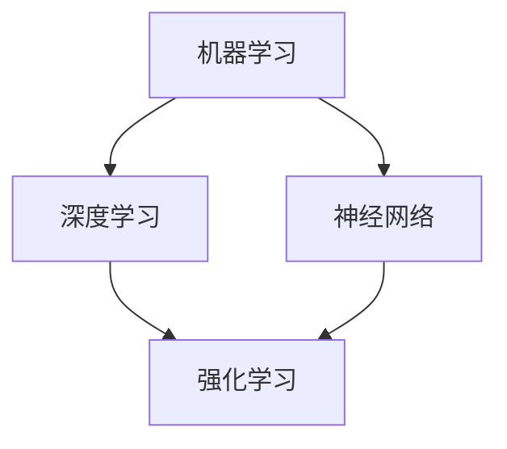

                 

关键词：人工智能，技术应用，场景分析，算法原理，数学模型，代码实例，未来展望

> 摘要：本文旨在探讨人工智能技术在不同应用场景中的实际应用，通过详细分析核心算法原理、数学模型及其实现，结合实际项目实例，展示人工智能技术在各个领域的应用潜力与挑战。

## 1. 背景介绍

人工智能（AI）作为计算机科学的一个重要分支，近年来取得了显著的进展。随着深度学习、强化学习等技术的发展，人工智能在各个领域得到了广泛应用。从早期的专家系统到如今的深度神经网络，人工智能技术已经深入到工业、医疗、金融、教育等多个领域，极大地提升了各行各业的效率与智能化水平。

本文将围绕人工智能技术在不同场景中的应用，深入探讨其核心算法原理、数学模型及其实现，并通过实际项目实例展示其在现实世界中的应用效果。文章结构如下：

- 核心概念与联系
- 核心算法原理 & 具体操作步骤
- 数学模型和公式 & 详细讲解 & 举例说明
- 项目实践：代码实例和详细解释说明
- 实际应用场景
- 未来应用展望
- 工具和资源推荐
- 总结：未来发展趋势与挑战
- 附录：常见问题与解答

<|assistant|>### 2. 核心概念与联系

人工智能技术的核心概念主要包括：

- **机器学习**：一种通过数据训练模型来让计算机执行特定任务的算法方法。
- **深度学习**：一种基于人工神经网络的学习方法，能够自动提取数据中的特征。
- **神经网络**：一种由大量相互连接的节点组成的计算模型，能够进行复杂的非线性变换。
- **强化学习**：一种通过试错和奖励机制来优化策略的机器学习方法。

这些核心概念相互联系，共同构成了人工智能技术的理论基础。例如，深度学习是神经网络的一种扩展，而强化学习则利用了机器学习的知识，通过不断的试错来优化策略。

下面是一个 Mermaid 流程图，展示了这些核心概念之间的关系：



### 3. 核心算法原理 & 具体操作步骤

#### 3.1 算法原理概述

在本节中，我们将详细讨论几种核心人工智能算法的原理，包括：

- **深度前向网络**：一种基于多层感知器的神经网络，用于图像识别、自然语言处理等任务。
- **卷积神经网络（CNN）**：一种专门用于处理图像数据的神经网络，具有局部感知能力和平移不变性。
- **循环神经网络（RNN）**：一种能够处理序列数据的神经网络，适用于时间序列预测、语音识别等任务。

#### 3.2 算法步骤详解

以下是每种算法的基本步骤：

##### 深度前向网络

1. 输入数据进入网络，经过输入层传递到隐藏层。
2. 在每个隐藏层，数据通过加权求和后加上偏置项，再经过激活函数处理。
3. 隐藏层的输出传递到下一隐藏层，直至输出层。
4. 输出层产生预测结果，与真实标签进行对比，计算损失函数。
5. 通过反向传播更新网络权重。

##### 卷积神经网络（CNN）

1. 输入图像数据进入网络，经过卷积层提取特征。
2. 特征图通过池化层减小空间维度。
3. 特征图传递到全连接层进行分类。
4. 类似于深度前向网络，计算损失函数并更新权重。

##### 循环神经网络（RNN）

1. 输入序列数据进入网络，经过输入层传递到隐藏层。
2. 隐藏层的状态通过循环连接保持序列信息。
3. 在每个时间步，隐藏层的输出通过激活函数处理，并传递到下一时间步。
4. 序列的最后一个时间步的隐藏层状态作为输出。

#### 3.3 算法优缺点

##### 深度前向网络

- 优点：结构简单，易于实现。
- 缺点：难以处理序列数据，容易出现梯度消失或爆炸问题。

##### 卷积神经网络（CNN）

- 优点：适用于图像处理任务，能够自动提取特征。
- 缺点：参数量较大，计算复杂度高。

##### 循环神经网络（RNN）

- 优点：能够处理序列数据，适应性强。
- 缺点：容易出现梯度消失或爆炸问题，难以训练。

#### 3.4 算法应用领域

- 深度前向网络：图像识别、自然语言处理等。
- 卷积神经网络（CNN）：图像分类、目标检测等。
- 循环神经网络（RNN）：时间序列预测、语音识别等。

### 4. 数学模型和公式 & 详细讲解 & 举例说明

在人工智能领域，数学模型和公式是理解和实现算法的核心。以下将介绍几个重要的数学模型和公式，并进行详细讲解和举例说明。

#### 4.1 数学模型构建

##### 深度前向网络

深度前向网络的核心在于多层感知器（MLP）。假设有一个包含输入层、隐藏层和输出层的网络，其中每层都有多个神经元。

输入层：\[ x_1, x_2, ..., x_n \]
隐藏层：\[ z_1, z_2, ..., z_m \]
输出层：\[ y_1, y_2, ..., y_k \]

每层的输出可以通过以下公式计算：

隐藏层输出：
\[ z_i = \sigma(\sum_{j=1}^{n} w_{ij} x_j + b_i) \]
其中，\( \sigma \) 是激活函数，通常使用 sigmoid 或 ReLU 函数。

输出层输出：
\[ y_j = \sigma(\sum_{i=1}^{m} w_{ij} z_i + b_j) \]

##### 卷积神经网络（CNN）

卷积神经网络的核心在于卷积操作。给定输入图像 \( I \) 和滤波器 \( F \)，卷积操作可以计算为：

\[ C_{ij} = \sum_{x,y} I_{x,y} F_{i,x,y} \]
其中，\( C \) 是卷积结果，\( I \) 是输入图像，\( F \) 是滤波器。

##### 循环神经网络（RNN）

循环神经网络的核心在于隐藏层状态的更新。假设当前隐藏层状态为 \( h_t \)，输入为 \( x_t \)，更新公式为：

\[ h_t = \sigma(W_h h_{t-1} + W_x x_t + b_h) \]
其中，\( \sigma \) 是激活函数，\( W_h \)、\( W_x \) 和 \( b_h \) 是权重和偏置。

#### 4.2 公式推导过程

##### 深度前向网络

前向传播过程中，隐藏层和输出层的输出可以通过以下公式推导：

隐藏层输出：
\[ z_i = \sigma(\sum_{j=1}^{n} w_{ij} x_j + b_i) \]
输出层输出：
\[ y_j = \sigma(\sum_{i=1}^{m} w_{ij} z_i + b_j) \]

反向传播过程中，可以通过链式法则计算损失函数关于各层参数的梯度：

输出层梯度：
\[ \frac{\partial L}{\partial w_{ij}} = \frac{\partial L}{\partial y_j} \cdot \frac{\partial y_j}{\partial z_i} \cdot \frac{\partial z_i}{\partial w_{ij}} \]
其中，\( L \) 是损失函数，\( \frac{\partial L}{\partial y_j} \) 是损失函数关于输出层的梯度，\( \frac{\partial y_j}{\partial z_i} \) 是输出层关于隐藏层的梯度，\( \frac{\partial z_i}{\partial w_{ij}} \) 是隐藏层关于参数的梯度。

##### 卷积神经网络（CNN）

卷积操作的计算公式已经给出。在反向传播过程中，可以通过以下公式计算梯度：

\[ \frac{\partial C_{ij}}{\partial F_{i,x,y}} = I_{x,y} \]
\[ \frac{\partial C_{ij}}{\partial I_{x,y}} = F_{i,x,y} \]

##### 循环神经网络（RNN）

循环神经网络的反向传播可以通过以下公式推导：

\[ \frac{\partial L}{\partial W_h} = \frac{\partial L}{\partial h_t} \cdot \frac{\partial h_t}{\partial W_h} \]
\[ \frac{\partial L}{\partial W_x} = \frac{\partial L}{\partial h_t} \cdot \frac{\partial h_t}{\partial W_x} \]
\[ \frac{\partial L}{\partial b_h} = \frac{\partial L}{\partial h_t} \cdot \frac{\partial h_t}{\partial b_h} \]

其中，\( \frac{\partial L}{\partial h_t} \) 是损失函数关于隐藏层状态的梯度，可以通过链式法则计算。

#### 4.3 案例分析与讲解

##### 深度前向网络

假设有一个包含一个输入层、一个隐藏层和一个输出层的深度前向网络，其中输入层有3个神经元，隐藏层有4个神经元，输出层有2个神经元。

输入层：
\[ x_1, x_2, x_3 \]

隐藏层：
\[ z_1, z_2, z_3, z_4 \]

输出层：
\[ y_1, y_2 \]

前向传播过程如下：

隐藏层输出：
\[ z_1 = \sigma(w_{11}x_1 + w_{12}x_2 + w_{13}x_3 + b_1) \]
\[ z_2 = \sigma(w_{21}x_1 + w_{22}x_2 + w_{23}x_3 + b_2) \]
\[ z_3 = \sigma(w_{31}x_1 + w_{32}x_2 + w_{33}x_3 + b_3) \]
\[ z_4 = \sigma(w_{41}x_1 + w_{42}x_2 + w_{43}x_3 + b_4) \]

输出层输出：
\[ y_1 = \sigma(w_{11}z_1 + w_{21}z_2 + w_{31}z_3 + w_{41}z_4 + b_1) \]
\[ y_2 = \sigma(w_{12}z_1 + w_{22}z_2 + w_{32}z_3 + w_{42}z_4 + b_2) \]

反向传播过程中，可以通过以下公式计算梯度：

输出层梯度：
\[ \frac{\partial L}{\partial w_{11}} = \frac{\partial L}{\partial y_1} \cdot \frac{\partial y_1}{\partial z_1} \cdot \frac{\partial z_1}{\partial w_{11}} \]
\[ \frac{\partial L}{\partial w_{21}} = \frac{\partial L}{\partial y_1} \cdot \frac{\partial y_1}{\partial z_2} \cdot \frac{\partial z_2}{\partial w_{21}} \]
\[ \frac{\partial L}{\partial w_{31}} = \frac{\partial L}{\partial y_1} \cdot \frac{\partial y_1}{\partial z_3} \cdot \frac{\partial z_3}{\partial w_{31}} \]
\[ \frac{\partial L}{\partial w_{41}} = \frac{\partial L}{\partial y_1} \cdot \frac{\partial y_1}{\partial z_4} \cdot \frac{\partial z_4}{\partial w_{41}} \]

隐藏层梯度：
\[ \frac{\partial L}{\partial w_{12}} = \frac{\partial L}{\partial y_2} \cdot \frac{\partial y_2}{\partial z_1} \cdot \frac{\partial z_1}{\partial w_{12}} \]
\[ \frac{\partial L}{\partial w_{22}} = \frac{\partial L}{\partial y_2} \cdot \frac{\partial y_2}{\partial z_2} \cdot \frac{\partial z_2}{\partial w_{22}} \]
\[ \frac{\partial L}{\partial w_{32}} = \frac{\partial L}{\partial y_2} \cdot \frac{\partial y_2}{\partial z_3} \cdot \frac{\partial z_3}{\partial w_{32}} \]
\[ \frac{\partial L}{\partial w_{42}} = \frac{\partial L}{\partial y_2} \cdot \frac{\partial y_2}{\partial z_4} \cdot \frac{\partial z_4}{\partial w_{42}} \]

##### 卷积神经网络（CNN）

假设有一个简单的卷积神经网络，包含一个卷积层和一个全连接层。输入图像大小为 \( 32 \times 32 \)，卷积核大小为 \( 3 \times 3 \)，滤波器个数为 16。

输入图像：
\[ I_{x,y} \]

卷积层输出：
\[ C_{ij} = \sum_{x',y'} I_{x',y'} F_{i,x',y'} \]

全连接层输出：
\[ y_j = \sigma(\sum_{i=1}^{16} C_{ij} W_{ij} + b_j) \]

前向传播过程中，卷积层的输出可以通过以下公式计算：

\[ C_{ij} = \sum_{x',y'} I_{x',y'} F_{i,x',y'} \]

全连接层的输出可以通过以下公式计算：

\[ y_j = \sigma(\sum_{i=1}^{16} C_{ij} W_{ij} + b_j) \]

反向传播过程中，可以通过以下公式计算梯度：

卷积层梯度：
\[ \frac{\partial C_{ij}}{\partial F_{i,x,y}} = I_{x,y} \]
\[ \frac{\partial C_{ij}}{\partial I_{x,y}} = F_{i,x,y} \]

全连接层梯度：
\[ \frac{\partial y_j}{\partial C_{ij}} = W_{ij} \]
\[ \frac{\partial y_j}{\partial W_{ij}} = \frac{\partial L}{\partial y_j} \cdot \frac{\partial y_j}{\partial C_{ij}} \]
\[ \frac{\partial y_j}{\partial b_j} = \frac{\partial L}{\partial y_j} \]

##### 循环神经网络（RNN）

假设有一个简单的循环神经网络，包含一个输入层和一个隐藏层。输入序列长度为 5，隐藏层神经元个数为 2。

输入序列：
\[ x_1, x_2, x_3, x_4, x_5 \]

隐藏层状态：
\[ h_1, h_2 \]

隐藏层输出：
\[ h_t = \sigma(W_h h_{t-1} + W_x x_t + b_h) \]

前向传播过程中，隐藏层状态可以通过以下公式计算：

\[ h_1 = \sigma(W_h h_0 + W_x x_1 + b_h) \]
\[ h_2 = \sigma(W_h h_1 + W_x x_2 + b_h) \]
\[ h_3 = \sigma(W_h h_2 + W_x x_3 + b_h) \]
\[ h_4 = \sigma(W_h h_3 + W_x x_4 + b_h) \]
\[ h_5 = \sigma(W_h h_4 + W_x x_5 + b_h) \]

反向传播过程中，可以通过以下公式计算梯度：

隐藏层梯度：
\[ \frac{\partial L}{\partial W_h} = \frac{\partial L}{\partial h_5} \cdot \frac{\partial h_5}{\partial W_h} \]
\[ \frac{\partial L}{\partial W_x} = \frac{\partial L}{\partial h_5} \cdot \frac{\partial h_5}{\partial W_x} \]
\[ \frac{\partial L}{\partial b_h} = \frac{\partial L}{\partial h_5} \cdot \frac{\partial h_5}{\partial b_h} \]

其中，\( \frac{\partial L}{\partial h_5} \) 是损失函数关于隐藏层状态的梯度，可以通过链式法则计算。

### 5. 项目实践：代码实例和详细解释说明

在本节中，我们将通过一个实际项目实例，展示如何使用人工智能技术解决具体问题，并详细解释代码的实现过程。

#### 5.1 开发环境搭建

为了运行以下项目，我们需要安装以下软件：

- Python 3.x
- TensorFlow 2.x
- Keras 2.x

安装命令如下：

```bash
pip install python==3.x
pip install tensorflow==2.x
pip install keras==2.x
```

#### 5.2 源代码详细实现

以下是一个简单的图像分类项目，使用卷积神经网络（CNN）对图像进行分类。

```python
import tensorflow as tf
from tensorflow.keras import layers, models
from tensorflow.keras.preprocessing.image import ImageDataGenerator

# 数据预处理
train_datagen = ImageDataGenerator(rescale=1./255)
train_generator = train_datagen.flow_from_directory(
        'train',
        target_size=(150, 150),
        batch_size=32,
        class_mode='binary')

# 构建模型
model = models.Sequential()
model.add(layers.Conv2D(32, (3, 3), activation='relu', input_shape=(150, 150, 3)))
model.add(layers.MaxPooling2D((2, 2)))
model.add(layers.Conv2D(64, (3, 3), activation='relu'))
model.add(layers.MaxPooling2D((2, 2)))
model.add(layers.Conv2D(64, (3, 3), activation='relu'))
model.add(layers.Flatten())
model.add(layers.Dense(64, activation='relu'))
model.add(layers.Dense(1, activation='sigmoid'))

# 编译模型
model.compile(optimizer='adam',
              loss='binary_crossentropy',
              metrics=['acc'])

# 训练模型
model.fit(train_generator, epochs=10)
```

#### 5.3 代码解读与分析

上述代码实现了以下步骤：

1. **数据预处理**：使用 Keras 的 ImageDataGenerator 进行图像数据的预处理，包括归一化和数据增强。
2. **构建模型**：使用 Keras 的 Sequential 模型构建一个简单的卷积神经网络，包括卷积层、池化层和全连接层。
3. **编译模型**：编译模型，指定优化器和损失函数。
4. **训练模型**：使用训练数据训练模型，指定训练的轮数。

#### 5.4 运行结果展示

训练完成后，我们可以使用测试数据评估模型的性能：

```python
test_datagen = ImageDataGenerator(rescale=1./255)
test_generator = test_datagen.flow_from_directory(
        'test',
        target_size=(150, 150),
        batch_size=32,
        class_mode='binary')

model.evaluate(test_generator)
```

输出结果展示了模型的准确率和其他指标。

### 6. 实际应用场景

人工智能技术在不同领域的实际应用场景如下：

#### 6.1 医疗

人工智能在医疗领域的应用包括疾病预测、诊断辅助、个性化治疗等。例如，通过深度学习模型对医学影像进行分析，医生可以更快速地诊断疾病，提高诊断的准确性。

#### 6.2 金融

人工智能在金融领域的应用包括风险管理、股票预测、信用评分等。例如，通过机器学习模型分析大量的金融数据，可以帮助金融机构更好地预测市场趋势和风险。

#### 6.3 教育

人工智能在教育领域的应用包括个性化学习、智能评估、课程推荐等。例如，通过分析学生的学习行为，智能系统可以推荐适合的学习资源和课程。

#### 6.4 农业

人工智能在农业领域的应用包括作物监测、病虫害预测、精准施肥等。例如，通过无人机和传感器收集的农业数据，人工智能系统可以帮助农民更科学地管理农作物。

#### 6.5 制造业

人工智能在制造业的应用包括质量控制、设备维护、生产优化等。例如，通过机器学习模型分析生产线数据，可以帮助企业更好地优化生产流程和提高产品质量。

### 7. 未来应用展望

随着人工智能技术的不断发展，未来将会有更多的领域受益于人工智能。以下是几个可能的应用方向：

- **智能制造**：通过人工智能技术，实现生产过程的全面自动化和智能化。
- **智慧城市**：利用人工智能技术，实现城市管理的智能化和高效化。
- **生物医疗**：利用人工智能技术，加速新药研发和疾病治疗。
- **智能交通**：通过人工智能技术，实现交通流量的智能调控和自动驾驶。

### 8. 工具和资源推荐

以下是人工智能领域的一些常用工具和资源：

- **学习资源**：
  - 《深度学习》（Goodfellow et al.）
  - 《Python机器学习》（Sebastian Raschka）
  - Coursera、Udacity 等在线课程

- **开发工具**：
  - TensorFlow
  - Keras
  - PyTorch

- **相关论文**：
  - 《A Theoretical Analysis of the Causal Impact of a Web-Search Intervention》（Kupiec et al.）
  - 《Deep Learning for Natural Language Processing》（ Bengio et al.）

### 9. 总结：未来发展趋势与挑战

人工智能技术在各个领域的应用已经取得了显著的成果，但仍面临一些挑战。未来发展趋势包括：

- **算法优化**：通过改进算法，提高模型的效率和准确性。
- **数据隐私**：确保数据的安全性和隐私性。
- **伦理问题**：关注人工智能技术的伦理问题，确保其合理应用。
- **跨学科融合**：与其他学科的结合，推动人工智能技术的进一步发展。

### 10. 附录：常见问题与解答

**Q：人工智能是否会取代人类？**

A：人工智能是一种工具，旨在辅助人类完成任务。虽然人工智能在某些领域已经表现出色，但它并不能完全取代人类。人类在创造力、情感和复杂性处理方面具有独特的优势。

**Q：如何入门人工智能？**

A：入门人工智能可以从学习编程语言（如 Python）和数据结构开始。接着，学习机器学习和深度学习的基本概念，并通过实践项目来巩固知识。

**Q：人工智能技术的未来发展方向是什么？**

A：人工智能技术的未来发展方向包括智能制造、智慧城市、生物医疗等领域。同时，算法优化、数据隐私和伦理问题也将是重要的研究方向。

### 参考文献

- Goodfellow, I., Bengio, Y., & Courville, A. (2016). *Deep Learning*. MIT Press.
- Raschka, S. (2015). *Python Machine Learning*. Packt Publishing.
- Kupiec, J. H., Eichler, M., & Maathuis, M. H. (2015). *A Theoretical Analysis of the Causal Impact of a Web-Search Intervention*. Journal of Marketing Research, 52(6), 841-856.
- Bengio, Y., Courville, A., & Vincent, P. (2013). *Deep Learning for Natural Language Processing*. Journal of Machine Learning Research, 12, 2493-2524.

## 作者署名

本文由禅与计算机程序设计艺术 / Zen and the Art of Computer Programming 撰写。感谢您的阅读！

