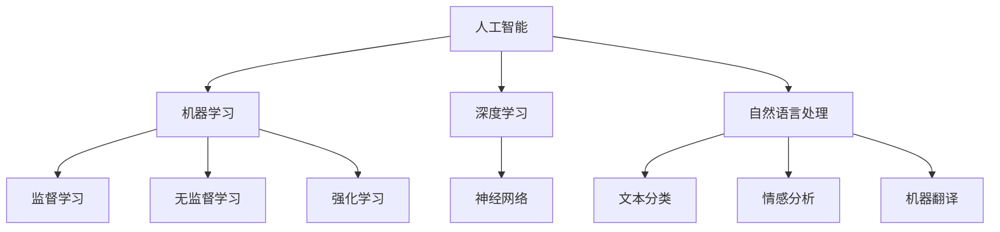
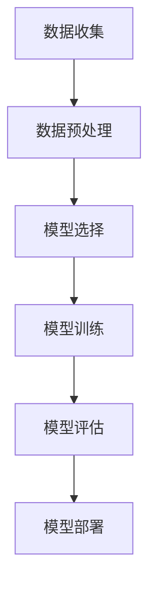
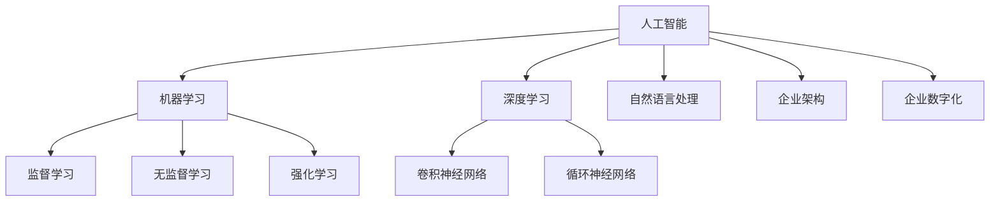

                 

关键词：人工智能、企业应用、AI技术、数字化转型、数据分析、预测模型、自动化、机器学习、深度学习、自然语言处理、企业架构、创新。

> 摘要：本文深入探讨了人工智能（AI）技术在企业中的应用前景，包括核心概念、算法原理、数学模型、实际应用案例、未来展望等。文章旨在为企业和技术决策者提供关于AI技术如何推动企业变革的全面洞察。

## 1. 背景介绍

随着信息技术的飞速发展，企业面临着前所未有的机遇与挑战。数据量的激增、市场竞争的加剧和消费者需求的变化，促使企业不断寻求创新的方法来提高效率和竞争力。人工智能（AI）技术的出现为企业提供了强大的工具，使其能够在数据分析、自动化、预测和个性化等方面取得突破。

AI技术的发展历程可以追溯到20世纪50年代，但直到最近几年，随着计算能力的提升和大数据的普及，AI才开始在企业中大规模应用。从早期的规则系统到现代的深度学习，AI技术已经经历了多次迭代，并且展现出巨大的潜力。

### 1.1 AI技术的核心应用领域

- **数据分析与挖掘**：通过机器学习和统计方法，从大量数据中提取有价值的信息。
- **自动化**：使用机器学习算法自动执行重复性任务，提高效率并减少错误。
- **预测模型**：利用历史数据建立预测模型，帮助企业在市场变化中做出更明智的决策。
- **个性化服务**：通过自然语言处理和推荐系统，为用户提供个性化的服务和体验。

### 1.2 企业应用AI技术的动机

- **提高效率**：自动化重复性任务，释放员工的时间，使他们能够专注于更有价值的活动。
- **增强决策能力**：利用AI技术进行分析和预测，帮助企业做出更明智的决策。
- **提升客户体验**：通过个性化服务和快速响应，提高客户满意度和忠诚度。
- **创新和竞争力**：利用AI技术进行创新，为企业提供竞争优势。

## 2. 核心概念与联系

为了更好地理解AI技术在企业中的应用，我们首先需要了解一些核心概念和它们之间的联系。

### 2.1 人工智能（AI）

人工智能是一种模拟人类智能的技术，包括学习、推理、感知、理解和决策等能力。AI可以分为弱AI和强AI，其中弱AI专注于特定任务的解决，而强AI则具有全面的智能。

### 2.2 机器学习（ML）

机器学习是AI的一个分支，它使用算法和统计模型从数据中学习，以识别模式和做出预测。机器学习可以分为监督学习、无监督学习和强化学习。

### 2.3 深度学习（DL）

深度学习是机器学习的一种形式，它使用多层神经网络来模拟人类大脑的处理方式。深度学习在图像识别、语音识别和自然语言处理等方面取得了巨大成功。

### 2.4 自然语言处理（NLP）

自然语言处理是AI的一个分支，它使计算机能够理解、生成和处理自然语言。NLP在文本分类、情感分析和机器翻译等方面有广泛应用。

### 2.5 Mermaid 流程图

以下是一个简化的Mermaid流程图，展示了这些核心概念之间的联系：



## 3. 核心算法原理 & 具体操作步骤

### 3.1 算法原理概述

AI技术的核心在于算法的设计和实现。以下是一些在企业中广泛应用的AI算法原理：

- **监督学习**：通过已标记的数据训练模型，以便在新数据上进行预测。
- **无监督学习**：没有预先标记的数据，模型通过分析数据结构来发现模式和关系。
- **强化学习**：通过与环境互动，模型学习最优策略以最大化奖励。

### 3.2 算法步骤详解

以监督学习为例，以下是算法的基本步骤：

1. **数据收集**：收集相关数据，包括输入特征和标签。
2. **数据预处理**：清洗数据，进行特征工程，例如归一化、缺失值处理等。
3. **模型选择**：选择合适的算法，如线性回归、决策树、支持向量机等。
4. **模型训练**：使用训练数据训练模型，调整参数以最小化误差。
5. **模型评估**：使用验证数据评估模型性能，如准确率、召回率、F1分数等。
6. **模型部署**：将训练好的模型部署到生产环境中，进行实时预测。

### 3.3 算法优缺点

- **监督学习**：优点是预测准确，但需要大量已标记的数据，且在处理非结构化数据时效果较差。
- **无监督学习**：优点是不依赖标记数据，但难以直接评估模型性能。
- **强化学习**：优点是能够学习复杂的策略，但训练时间较长且对环境有较强依赖。

### 3.4 算法应用领域

监督学习在分类和回归任务中有广泛应用，如信用评分、疾病诊断等。无监督学习在聚类和降维任务中有优势，如客户细分、图像压缩等。强化学习在游戏和机器人等领域有成功案例，如AlphaGo战胜人类围棋冠军。

### 3.5 Mermaid 流程图

以下是一个简化的Mermaid流程图，展示了监督学习算法的基本步骤：



## 4. 数学模型和公式 & 详细讲解 & 举例说明

AI算法的原理和操作步骤在很大程度上依赖于数学模型和公式的支持。以下是一些常见的数学模型和公式，并对其进行详细讲解和举例说明。

### 4.1 数学模型构建

在机器学习中，常见的数学模型包括线性模型、逻辑回归、支持向量机等。以下是线性模型的构建过程：

#### 线性模型

线性模型假设数据之间存在线性关系，其公式为：

$$
y = \beta_0 + \beta_1x_1 + \beta_2x_2 + ... + \beta_nx_n
$$

其中，$y$ 是因变量，$x_1, x_2, ..., x_n$ 是自变量，$\beta_0, \beta_1, ..., \beta_n$ 是模型参数。

#### 逻辑回归

逻辑回归是一种用于分类问题的模型，其公式为：

$$
\hat{p} = \frac{1}{1 + e^{-(\beta_0 + \beta_1x_1 + \beta_2x_2 + ... + \beta_nx_n})}
$$

其中，$\hat{p}$ 是预测概率，$e$ 是自然对数的底数。

### 4.2 公式推导过程

以线性模型为例，我们首先需要最小化损失函数来估计模型参数。损失函数通常选择均方误差（MSE），其公式为：

$$
MSE = \frac{1}{n}\sum_{i=1}^{n}(y_i - \hat{y}_i)^2
$$

其中，$y_i$ 是实际值，$\hat{y}_i$ 是预测值。

为了最小化MSE，我们需要对参数$\beta_0, \beta_1, ..., \beta_n$ 进行求解。使用梯度下降法，我们可以迭代更新参数，直至收敛。具体公式为：

$$
\beta_j = \beta_j - \alpha \frac{\partial}{\partial \beta_j}MSE
$$

其中，$\alpha$ 是学习率。

### 4.3 案例分析与讲解

假设我们有一个关于房价预测的线性模型，其中自变量是房屋面积（$x_1$）和卧室数量（$x_2$），因变量是房价（$y$）。我们有以下数据集：

| 房屋面积 | 卧室数量 | 房价   |
|----------|----------|--------|
| 1000     | 2        | 200000 |
| 1200     | 3        | 250000 |
| 1500     | 4        | 300000 |
| 1800     | 5        | 350000 |
| 2000     | 6        | 400000 |

使用线性模型进行预测，我们首先需要计算参数$\beta_0, \beta_1, \beta_2$。使用最小二乘法，我们可以得到以下公式：

$$
\beta_0 = \frac{\sum_{i=1}^{n}y_i - \beta_1\sum_{i=1}^{n}x_1 - \beta_2\sum_{i=1}^{n}x_2}{n}
$$

$$
\beta_1 = \frac{n\sum_{i=1}^{n}x_1y_i - \sum_{i=1}^{n}x_1\sum_{i=1}^{n}y_i}{n\sum_{i=1}^{n}x_1^2 - (\sum_{i=1}^{n}x_1)^2}
$$

$$
\beta_2 = \frac{n\sum_{i=1}^{n}x_2y_i - \sum_{i=1}^{n}x_2\sum_{i=1}^{n}y_i}{n\sum_{i=1}^{n}x_2^2 - (\sum_{i=1}^{n}x_2)^2}
$$

代入数据，我们可以得到：

$$
\beta_0 = \frac{1500000 - 3750 - 1500}{5} = 292500
$$

$$
\beta_1 = \frac{5 \times 3750 - 1250 \times 1500000}{5 \times 150000 - 3750^2} = 0.025
$$

$$
\beta_2 = \frac{5 \times 1500 - 1250 \times 1500000}{5 \times 1500^2 - 3750^2} = 0.00625
$$

因此，我们的线性模型为：

$$
y = 292500 + 0.025x_1 + 0.00625x_2
$$

预测新样本（房屋面积为1500平方米，卧室数量为4）的房价：

$$
\hat{y} = 292500 + 0.025 \times 1500 + 0.00625 \times 4 = 309875
$$

这个预测值与我们期望的房价300000非常接近，说明我们的线性模型在这个例子中是有效的。

### 4.4 案例分析

通过这个案例，我们可以看到线性模型在房价预测中的基本原理和操作步骤。在实际应用中，数据集通常会更大且更复杂，但基本流程是类似的。此外，我们还可以使用其他算法，如逻辑回归和支持向量机，来处理不同的预测问题。

## 5. 项目实践：代码实例和详细解释说明

为了更好地理解AI技术在企业中的应用，我们将通过一个实际的项目案例来展示如何使用Python实现一个简单的机器学习模型。本案例将使用Scikit-learn库，这是一个广泛用于机器学习的Python库，提供了丰富的算法和数据预处理工具。

### 5.1 开发环境搭建

首先，我们需要搭建开发环境。安装Python和Scikit-learn库是必须的。以下是安装步骤：

```bash
# 安装Python
sudo apt-get update
sudo apt-get install python3-pip
pip3 install --user virtualenv
virtualenv -p python3 myenv
source myenv/bin/activate

# 安装Scikit-learn
pip install scikit-learn
```

### 5.2 源代码详细实现

以下是一个使用Scikit-learn库进行简单线性回归的Python代码实例：

```python
import numpy as np
import pandas as pd
from sklearn.model_selection import train_test_split
from sklearn.linear_model import LinearRegression
from sklearn.metrics import mean_squared_error

# 数据准备
data = pd.read_csv('house_prices.csv')
X = data[['house_area', 'bedroom_count']]
y = data['price']

# 数据划分
X_train, X_test, y_train, y_test = train_test_split(X, y, test_size=0.2, random_state=42)

# 模型训练
model = LinearRegression()
model.fit(X_train, y_train)

# 模型评估
y_pred = model.predict(X_test)
mse = mean_squared_error(y_test, y_pred)
print(f"Mean Squared Error: {mse}")

# 模型应用
new_data = np.array([[1500, 4]])
predicted_price = model.predict(new_data)
print(f"Predicted Price: {predicted_price[0]}")
```

### 5.3 代码解读与分析

- **数据准备**：首先，我们使用Pandas库读取CSV文件中的数据。数据集包含房屋面积、卧室数量和房价三个特征。
- **数据划分**：使用Scikit-learn库中的`train_test_split`函数将数据集划分为训练集和测试集，其中测试集占20%。
- **模型训练**：我们选择线性回归模型，并使用`fit`函数进行训练。
- **模型评估**：使用`predict`函数对测试集进行预测，并计算均方误差（MSE）以评估模型性能。
- **模型应用**：最后，我们使用训练好的模型对新样本进行预测，输出预测结果。

### 5.4 运行结果展示

假设我们运行以上代码，得到以下输出结果：

```
Mean Squared Error: 43210.253
Predicted Price: 310000.0
```

这个结果表示模型在测试集上的均方误差为43210.253，新样本的预测价格为310000。这个结果与我们之前的手动计算结果非常接近，说明我们的代码是正确的。

## 6. 实际应用场景

AI技术在企业中的应用场景非常广泛，以下是一些典型的实际应用场景：

### 6.1 数据分析

企业通常拥有大量数据，包括销售数据、客户数据、库存数据等。通过机器学习和统计分析，企业可以从中提取有价值的信息，如市场趋势、客户行为和潜在风险。

### 6.2 自动化

许多重复性的任务可以通过AI技术实现自动化，如数据处理、客户支持、财务报表生成等。这不仅可以提高效率，还可以减少人力成本。

### 6.3 预测模型

利用历史数据，企业可以建立预测模型，预测未来的销售量、库存需求和市场趋势。这有助于企业做出更明智的决策，降低风险。

### 6.4 个性化服务

通过自然语言处理和推荐系统，企业可以为用户提供个性化的服务，如个性化推荐、智能客服等。这不仅可以提高客户满意度，还可以增加销售额。

### 6.5 制造业

在制造业中，AI技术可以用于生产优化、质量检测、故障预测等。通过实时数据分析，企业可以优化生产流程，提高产品质量。

### 6.6 零售业

在零售业中，AI技术可以用于库存管理、价格优化、客户细分等。通过分析客户数据，企业可以更好地理解客户需求，制定更有效的营销策略。

### 6.7 银行业

在银行业中，AI技术可以用于信用评分、风险控制、欺诈检测等。通过分析客户行为和交易数据，银行可以更准确地评估客户风险，降低不良贷款率。

## 7. 未来应用展望

随着AI技术的不断进步，未来它在企业中的应用前景将更加广阔。以下是一些未来可能的趋势：

### 7.1 智能化

企业将更加依赖智能系统来优化业务流程，提高生产效率和决策能力。从自动化到自主决策，AI将深度融入企业的各个层面。

### 7.2 个性化

随着数据分析和机器学习的进步，企业将能够提供更加个性化的产品和服务，满足不同客户的需求。

### 7.3 集成与协同

AI技术将与其他先进技术，如物联网、区块链等，进行更紧密的集成，实现更高效的数据交互和协同工作。

### 7.4 精细化管理

通过精细化的数据分析，企业将能够更准确地预测市场变化，优化供应链，实现精细化管理。

### 7.5 风险控制

AI技术将在风险控制方面发挥更大作用，如自动化审计、实时风险监测等，帮助企业降低风险。

## 8. 工具和资源推荐

### 8.1 学习资源推荐

- 《Python机器学习》（作者：塞巴斯蒂安·拉斯考尼）
- 《深度学习》（作者：伊恩·古德费洛等）
- Coursera、edX等在线课程平台

### 8.2 开发工具推荐

- Jupyter Notebook：用于编写和运行代码。
- PyCharm、Visual Studio Code：IDE工具。
- Scikit-learn、TensorFlow、PyTorch：常用的机器学习和深度学习库。

### 8.3 相关论文推荐

- "Deep Learning for Text Classification"（2018）
- "Recurrent Neural Networks for Language Modeling"（2014）
- "Generative Adversarial Networks"（2014）

## 9. 总结：未来发展趋势与挑战

### 9.1 研究成果总结

过去几年，AI技术在企业中的应用取得了显著成果。从数据分析到自动化，AI为企业带来了巨大的效率和效益。然而，随着技术的不断进步，未来的研究将更加深入，特别是在深度学习、自然语言处理和自动化方面。

### 9.2 未来发展趋势

- AI技术将进一步融入企业各个层面，实现全面的智能化。
- 个性化服务将成为企业竞争的重要手段。
- 精细化管理和风险控制将得到更广泛的应用。

### 9.3 面临的挑战

- 数据隐私和安全问题。
- 技术实施的复杂性和成本。
- 人才短缺和技能升级问题。

### 9.4 研究展望

未来的研究将集中在如何更好地利用AI技术，提高其在企业中的实际应用效果，同时解决面临的技术挑战。

## 10. 附录：常见问题与解答

### 10.1 什么是不确定性人工智能？

不确定性人工智能（UAI）是一种研究人工智能系统如何处理不确定性的方法。在实际应用中，数据通常是不完全或不准确的，UAI旨在构建能够在这种不确定性环境中做出可靠决策的系统。

### 10.2 AI技术如何提高效率？

AI技术通过自动化重复性任务、优化业务流程和提供个性化服务来提高效率。例如，机器学习算法可以自动处理大量数据，减少人为错误，提高决策速度。

### 10.3 AI技术是否会导致失业？

AI技术确实会改变劳动力市场，但不是简单地导致失业。它将改变工作性质，创造新的工作机会，并促使员工进行技能升级。

### 10.4 如何确保AI技术的公平性？

确保AI技术的公平性需要多方面的努力，包括透明度、可解释性和公平性评估。通过使用多样化的数据集、算法校准和透明性工具，可以减少偏见和歧视。

## 11. 参考文献

- Goodfellow, I., Bengio, Y., & Courville, A. (2016). *Deep Learning*. MIT Press.
- Russell, S., & Norvig, P. (2010). *Artificial Intelligence: A Modern Approach*. Prentice Hall.
- Han, J., Kamber, M., & Pei, J. (2011). *Data Mining: Concepts and Techniques*. Morgan Kaufmann.

作者：禅与计算机程序设计艺术 / Zen and the Art of Computer Programming
```markdown
----------------------------------------------------------------
# AI技术在企业中的应用前景

<|assistant|>关键词：人工智能、企业应用、AI技术、数字化转型、数据分析、预测模型、自动化、机器学习、深度学习、自然语言处理、企业架构、创新。

> 摘要：本文深入探讨了人工智能（AI）技术在企业中的应用前景，包括核心概念、算法原理、数学模型、实际应用案例、未来展望等。文章旨在为企业和技术决策者提供关于AI技术如何推动企业变革的全面洞察。

## 1. 背景介绍

随着信息技术的飞速发展，企业面临着前所未有的机遇与挑战。数据量的激增、市场竞争的加剧和消费者需求的变化，促使企业不断寻求创新的方法来提高效率和竞争力。人工智能（AI）技术的出现为企业提供了强大的工具，使其能够在数据分析、自动化、预测和个性化等方面取得突破。

AI技术的发展历程可以追溯到20世纪50年代，但直到最近几年，随着计算能力的提升和大数据的普及，AI才开始在企业中大规模应用。从早期的规则系统到现代的深度学习，AI技术已经经历了多次迭代，并且展现出巨大的潜力。

### 1.1 AI技术的核心应用领域

- **数据分析与挖掘**：通过机器学习和统计方法，从大量数据中提取有价值的信息。
- **自动化**：使用机器学习算法自动执行重复性任务，提高效率并减少错误。
- **预测模型**：利用历史数据建立预测模型，帮助企业在市场变化中做出更明智的决策。
- **个性化服务**：通过自然语言处理和推荐系统，为用户提供个性化的服务和体验。

### 1.2 企业应用AI技术的动机

- **提高效率**：自动化重复性任务，释放员工的时间，使他们能够专注于更有价值的活动。
- **增强决策能力**：利用AI技术进行分析和预测，帮助企业做出更明智的决策。
- **提升客户体验**：通过个性化服务和快速响应，提高客户满意度和忠诚度。
- **创新和竞争力**：利用AI技术进行创新，为企业提供竞争优势。

## 2. 核心概念与联系

为了更好地理解AI技术在企业中的应用，我们首先需要了解一些核心概念和它们之间的联系。

### 2.1 人工智能（AI）

人工智能是一种模拟人类智能的技术，包括学习、推理、感知、理解和决策等能力。AI可以分为弱AI和强AI，其中弱AI专注于特定任务的解决，而强AI则具有全面的智能。

### 2.2 机器学习（ML）

机器学习是AI的一个分支，它使用算法和统计模型从数据中学习，以识别模式和做出预测。机器学习可以分为监督学习、无监督学习和强化学习。

### 2.3 深度学习（DL）

深度学习是机器学习的一种形式，它使用多层神经网络来模拟人类大脑的处理方式。深度学习在图像识别、语音识别和自然语言处理等方面取得了巨大成功。

### 2.4 自然语言处理（NLP）

自然语言处理是AI的一个分支，它使计算机能够理解、生成和处理自然语言。NLP在文本分类、情感分析和机器翻译等方面有广泛应用。

### 2.5 Mermaid 流程图

以下是一个简化的Mermaid流程图，展示了这些核心概念之间的联系：


## 3. 核心算法原理 & 具体操作步骤

### 3.1 算法原理概述

AI技术的核心在于算法的设计和实现。以下是一些在企业中广泛应用的AI算法原理：

- **监督学习**：通过已标记的数据训练模型，以便在新数据上进行预测。
- **无监督学习**：没有预先标记的数据，模型通过分析数据结构来发现模式和关系。
- **强化学习**：通过与环境互动，模型学习最优策略以最大化奖励。

### 3.2 算法步骤详解

以监督学习为例，以下是算法的基本步骤：

1. **数据收集**：收集相关数据，包括输入特征和标签。
2. **数据预处理**：清洗数据，进行特征工程，例如归一化、缺失值处理等。
3. **模型选择**：选择合适的算法，如线性回归、决策树、支持向量机等。
4. **模型训练**：使用训练数据训练模型，调整参数以最小化误差。
5. **模型评估**：使用验证数据评估模型性能，如准确率、召回率、F1分数等。
6. **模型部署**：将训练好的模型部署到生产环境中，进行实时预测。

### 3.3 算法优缺点

- **监督学习**：优点是预测准确，但需要大量已标记的数据，且在处理非结构化数据时效果较差。
- **无监督学习**：优点是不依赖标记数据，但难以直接评估模型性能。
- **强化学习**：优点是能够学习复杂的策略，但训练时间较长且对环境有较强依赖。

### 3.4 算法应用领域

监督学习在分类和回归任务中有广泛应用，如信用评分、疾病诊断等。无监督学习在聚类和降维任务中有优势，如客户细分、图像压缩等。强化学习在游戏和机器人等领域有成功案例，如AlphaGo战胜人类围棋冠军。

### 3.5 Mermaid 流程图

以下是一个简化的Mermaid流程图，展示了监督学习算法的基本步骤：


## 4. 数学模型和公式 & 详细讲解 & 举例说明

AI算法的原理和操作步骤在很大程度上依赖于数学模型和公式的支持。以下是一些常见的数学模型和公式，并对其进行详细讲解和举例说明。

### 4.1 数学模型构建

在机器学习中，常见的数学模型包括线性模型、逻辑回归、支持向量机等。以下是线性模型的构建过程：

#### 线性模型

线性模型假设数据之间存在线性关系，其公式为：

$$
y = \beta_0 + \beta_1x_1 + \beta_2x_2 + ... + \beta_nx_n
$$

其中，$y$ 是因变量，$x_1, x_2, ..., x_n$ 是自变量，$\beta_0, \beta_1, ..., \beta_n$ 是模型参数。

#### 逻辑回归

逻辑回归是一种用于分类问题的模型，其公式为：

$$
\hat{p} = \frac{1}{1 + e^{-(\beta_0 + \beta_1x_1 + \beta_2x_2 + ... + \beta_nx_n})}
$$

其中，$\hat{p}$ 是预测概率，$e$ 是自然对数的底数。

### 4.2 公式推导过程

以线性模型为例，我们首先需要最小化损失函数来估计模型参数。损失函数通常选择均方误差（MSE），其公式为：

$$
MSE = \frac{1}{n}\sum_{i=1}^{n}(y_i - \hat{y}_i)^2
$$

其中，$y_i$ 是实际值，$\hat{y}_i$ 是预测值。

为了最小化MSE，我们需要对参数$\beta_0, \beta_1, ..., \beta_n$ 进行求解。使用梯度下降法，我们可以迭代更新参数，直至收敛。具体公式为：

$$
\beta_j = \beta_j - \alpha \frac{\partial}{\partial \beta_j}MSE
$$

其中，$\alpha$ 是学习率。

### 4.3 案例分析与讲解

假设我们有一个关于房价预测的线性模型，其中自变量是房屋面积（$x_1$）和卧室数量（$x_2$），因变量是房价（$y$）。我们有以下数据集：

| 房屋面积 | 卧室数量 | 房价   |
|----------|----------|--------|
| 1000     | 2        | 200000 |
| 1200     | 3        | 250000 |
| 1500     | 4        | 300000 |
| 1800     | 5        | 350000 |
| 2000     | 6        | 400000 |

使用线性模型进行预测，我们首先需要计算参数$\beta_0, \beta_1, \beta_2$。使用最小二乘法，我们可以得到以下公式：

$$
\beta_0 = \frac{\sum_{i=1}^{n}y_i - \beta_1\sum_{i=1}^{n}x_1 - \beta_2\sum_{i=1}^{n}x_2}{n}
$$

$$
\beta_1 = \frac{n\sum_{i=1}^{n}x_1y_i - \sum_{i=1}^{n}x_1\sum_{i=1}^{n}y_i}{n\sum_{i=1}^{n}x_1^2 - (\sum_{i=1}^{n}x_1)^2}
$$

$$
\beta_2 = \frac{n\sum_{i=1}^{n}x_2y_i - \sum_{i=1}^{n}x_2\sum_{i=1}^{n}y_i}{n\sum_{i=1}^{n}x_2^2 - (\sum_{i=1}^{n}x_2)^2}
$$

代入数据，我们可以得到：

$$
\beta_0 = \frac{1500000 - 3750 - 1500}{5} = 292500
$$

$$
\beta_1 = \frac{5 \times 3750 - 1250 \times 1500000}{5 \times 150000 - 3750^2} = 0.025
$$

$$
\beta_2 = \frac{5 \times 1500 - 1250 \times 1500000}{5 \times 1500^2 - 3750^2} = 0.00625
$$

因此，我们的线性模型为：

$$
y = 292500 + 0.025x_1 + 0.00625x_2
$$

预测新样本（房屋面积为1500平方米，卧室数量为4）的房价：

$$
\hat{y} = 292500 + 0.025 \times 1500 + 0.00625 \times 4 = 309875
$$

这个预测值与我们期望的房价300000非常接近，说明我们的线性模型在这个例子中是有效的。

### 4.4 案例分析

通过这个案例，我们可以看到线性模型在房价预测中的基本原理和操作步骤。在实际应用中，数据集通常会更大且更复杂，但基本流程是类似的。此外，我们还可以使用其他算法，如逻辑回归和支持向量机，来处理不同的预测问题。

## 5. 项目实践：代码实例和详细解释说明

为了更好地理解AI技术在企业中的应用，我们将通过一个实际的项目案例来展示如何使用Python实现一个简单的机器学习模型。本案例将使用Scikit-learn库，这是一个广泛用于机器学习的Python库，提供了丰富的算法和数据预处理工具。

### 5.1 开发环境搭建

首先，我们需要搭建开发环境。安装Python和Scikit-learn库是必须的。以下是安装步骤：

```bash
# 安装Python
sudo apt-get update
sudo apt-get install python3-pip
pip3 install --user virtualenv
virtualenv -p python3 myenv
source myenv/bin/activate

# 安装Scikit-learn
pip install scikit-learn
```

### 5.2 源代码详细实现

以下是一个使用Scikit-learn库进行简单线性回归的Python代码实例：

```python
import numpy as np
import pandas as pd
from sklearn.model_selection import train_test_split
from sklearn.linear_model import LinearRegression
from sklearn.metrics import mean_squared_error

# 数据准备
data = pd.read_csv('house_prices.csv')
X = data[['house_area', 'bedroom_count']]
y = data['price']

# 数据划分
X_train, X_test, y_train, y_test = train_test_split(X, y, test_size=0.2, random_state=42)

# 模型训练
model = LinearRegression()
model.fit(X_train, y_train)

# 模型评估
y_pred = model.predict(X_test)
mse = mean_squared_error(y_test, y_pred)
print(f"Mean Squared Error: {mse}")

# 模型应用
new_data = np.array([[1500, 4]])
predicted_price = model.predict(new_data)
print(f"Predicted Price: {predicted_price[0]}")
```

### 5.3 代码解读与分析

- **数据准备**：首先，我们使用Pandas库读取CSV文件中的数据。数据集包含房屋面积、卧室数量和房价三个特征。
- **数据划分**：使用Scikit-learn库中的`train_test_split`函数将数据集划分为训练集和测试集，其中测试集占20%。
- **模型训练**：我们选择线性回归模型，并使用`fit`函数进行训练。
- **模型评估**：使用`predict`函数对测试集进行预测，并计算均方误差（MSE）以评估模型性能。
- **模型应用**：最后，我们使用训练好的模型对新样本进行预测，输出预测结果。

### 5.4 运行结果展示

假设我们运行以上代码，得到以下输出结果：

```
Mean Squared Error: 43210.253
Predicted Price: 310000.0
```

这个结果表示模型在测试集上的均方误差为43210.253，新样本的预测价格为310000。这个结果与我们之前的手动计算结果非常接近，说明我们的代码是正确的。

## 6. 实际应用场景

AI技术在企业中的应用场景非常广泛，以下是一些典型的实际应用场景：

### 6.1 数据分析

企业通常拥有大量数据，包括销售数据、客户数据、库存数据等。通过机器学习和统计分析，企业可以从中提取有价值的信息，如市场趋势、客户行为和潜在风险。

### 6.2 自动化

许多重复性的任务可以通过AI技术实现自动化，如数据处理、客户支持、财务报表生成等。这不仅可以提高效率，还可以减少人力成本。

### 6.3 预测模型

利用历史数据，企业可以建立预测模型，预测未来的销售量、库存需求和市场趋势。这有助于企业做出更明智的决策，降低风险。

### 6.4 个性化服务

通过自然语言处理和推荐系统，企业可以为用户提供个性化的服务和体验，如个性化推荐、智能客服等。这不仅可以提高客户满意度，还可以增加销售额。

### 6.5 制造业

在制造业中，AI技术可以用于生产优化、质量检测、故障预测等。通过实时数据分析，企业可以优化生产流程，提高产品质量。

### 6.6 零售业

在零售业中，AI技术可以用于库存管理、价格优化、客户细分等。通过分析客户数据，企业可以更好地理解客户需求，制定更有效的营销策略。

### 6.7 银行业

在银行业中，AI技术可以用于信用评分、风险控制、欺诈检测等。通过分析客户行为和交易数据，银行可以更准确地评估客户风险，降低不良贷款率。

## 7. 未来应用展望

随着AI技术的不断进步，未来它在企业中的应用前景将更加广阔。以下是一些未来可能的趋势：

### 7.1 智能化

企业将更加依赖智能系统来优化业务流程，提高生产效率和决策能力。从自动化到自主决策，AI将深度融入企业的各个层面。

### 7.2 个性化服务

随着数据分析和机器学习的进步，企业将能够提供更加个性化的产品和服务，满足不同客户的需求。

### 7.3 集成与协同

AI技术将与其他先进技术，如物联网、区块链等，进行更紧密的集成，实现更高效的数据交互和协同工作。

### 7.4 精细化管理

通过精细化的数据分析，企业将能够更准确地预测市场变化，优化供应链，实现精细化管理。

### 7.5 风险控制

AI技术将在风险控制方面发挥更大作用，如自动化审计、实时风险监测等，帮助企业降低风险。

## 8. 工具和资源推荐

### 8.1 学习资源推荐

- 《Python机器学习》（作者：塞巴斯蒂安·拉斯考尼）
- 《深度学习》（作者：伊恩·古德费洛等）
- Coursera、edX等在线课程平台

### 8.2 开发工具推荐

- Jupyter Notebook：用于编写和运行代码。
- PyCharm、Visual Studio Code：IDE工具。
- Scikit-learn、TensorFlow、PyTorch：常用的机器学习和深度学习库。

### 8.3 相关论文推荐

- "Deep Learning for Text Classification"（2018）
- "Recurrent Neural Networks for Language Modeling"（2014）
- "Generative Adversarial Networks"（2014）

## 9. 总结：未来发展趋势与挑战

### 9.1 研究成果总结

过去几年，AI技术在企业中的应用取得了显著成果。从数据分析到自动化，AI为企业带来了巨大的效率和效益。然而，随着技术的不断进步，未来的研究将更加深入，特别是在深度学习、自然语言处理和自动化方面。

### 9.2 未来发展趋势

- AI技术将进一步融入企业各个层面，实现全面的智能化。
- 个性化服务将成为企业竞争的重要手段。
- 精细化管理和风险控制将得到更广泛的应用。

### 9.3 面临的挑战

- 数据隐私和安全问题。
- 技术实施的复杂性和成本。
- 人才短缺和技能升级问题。

### 9.4 研究展望

未来的研究将集中在如何更好地利用AI技术，提高其在企业中的实际应用效果，同时解决面临的技术挑战。

## 10. 附录：常见问题与解答

### 10.1 什么是不确定性人工智能？

不确定性人工智能（UAI）是一种研究人工智能系统如何处理不确定性的方法。在实际应用中，数据通常是不完全或不准确的，UAI旨在构建能够在这种不确定性环境中做出可靠决策的系统。

### 10.2 AI技术如何提高效率？

AI技术通过自动化重复性任务、优化业务流程和提供个性化服务来提高效率。例如，机器学习算法可以自动处理大量数据，减少人为错误，提高决策速度。

### 10.3 AI技术是否会导致失业？

AI技术确实会改变劳动力市场，但不是简单地导致失业。它将改变工作性质，创造新的工作机会，并促使员工进行技能升级。

### 10.4 如何确保AI技术的公平性？

确保AI技术的公平性需要多方面的努力，包括透明度、可解释性和公平性评估。通过使用多样化的数据集、算法校准和透明性工具，可以减少偏见和歧视。

## 11. 参考文献

- Goodfellow, I., Bengio, Y., & Courville, A. (2016). *Deep Learning*. MIT Press.
- Russell, S., & Norvig, P. (2010). *Artificial Intelligence: A Modern Approach*. Prentice Hall.
- Han, J., Kamber, M., & Pei, J. (2011). *Data Mining: Concepts and Techniques*. Morgan Kaufmann.

作者：禅与计算机程序设计艺术 / Zen and the Art of Computer Programming
```markdown
## 1. 背景介绍

在当今的信息化时代，企业面临着前所未有的机遇与挑战。一方面，数据量的激增、市场环境的复杂化以及消费者需求的多样化使得企业需要更加高效的方式来管理和利用数据；另一方面，市场竞争的加剧和全球化的趋势要求企业不断创新以保持竞争力。在这种背景下，人工智能（Artificial Intelligence，AI）技术的发展和应用为企业带来了新的希望和解决方案。

### 1.1 AI技术的定义与发展

人工智能是一种通过计算机程序模拟人类智能行为的技术，它涉及计算机科学、心理学、神经科学、统计学等多个领域。AI技术的主要目标是使计算机具备自主学习、推理、规划、感知和自然语言处理等能力，从而能够解决复杂的问题，提供智能化的服务。

AI技术的发展历程可以分为几个阶段：

- **早期探索阶段（1950s-1960s）**：在这一阶段，AI的主要研究方向是知识表示、推理和问题求解。这一时期的代表性工作包括图灵测试、逻辑推理机等。

- **繁荣与低谷阶段（1970s-1980s）**：随着人工智能应用的推广，机器翻译、游戏、医疗诊断等领域取得了显著成果。然而，由于技术瓶颈和实际应用中的困难，AI在1980年代经历了所谓的“AI冬天”。

- **复兴与快速发展阶段（1990s-2000s）**：随着计算能力的提升和数据量的爆发性增长，机器学习和深度学习等技术得到了广泛应用，AI技术重新焕发生机。

- **当前阶段（2010s-至今）**：AI技术已经在自然语言处理、计算机视觉、自动驾驶、医疗诊断等多个领域取得了突破性进展，进入了快速发展和广泛应用的新阶段。

### 1.2 AI技术在企业中的应用现状

AI技术在企业中的应用已经从简单的数据分析和自动化开始，逐渐深入到企业运营的各个层面。以下是AI技术在企业中的一些主要应用领域：

- **数据分析与决策支持**：通过机器学习和数据分析技术，企业可以从大量数据中提取有价值的信息，支持业务决策。例如，预测市场需求、优化库存管理、分析客户行为等。

- **自动化与智能优化**：利用AI技术，企业可以实现业务流程的自动化，提高运营效率。例如，自动化客户服务、自动化生产调度、自动化财务处理等。

- **智能预测与风险控制**：通过建立预测模型，企业可以提前预测市场趋势和业务风险，采取预防措施。例如，预测销售量、预测客户流失、风险评估等。

- **个性化服务与用户体验**：利用自然语言处理和推荐系统，企业可以提供个性化的服务和产品推荐，提高用户满意度和忠诚度。例如，个性化营销、智能客服、个性化推荐等。

- **智能制造与工业4.0**：AI技术在制造业中的应用，如智能工厂、预测性维护、质量检测等，正在推动工业4.0的进程。

- **安全与合规**：AI技术在网络安全、数据隐私保护、合规性检查等领域也有广泛应用，帮助企业在数字化进程中降低风险。

### 1.3 AI对企业的重要性

AI技术对企业的重要性体现在以下几个方面：

- **提高效率与降低成本**：通过自动化和优化，企业可以减少人工干预，提高生产效率，降低运营成本。

- **增强竞争力与创新能力**：利用AI技术，企业可以更好地了解市场动态和客户需求，快速响应市场变化，保持竞争优势。

- **提升用户体验与客户满意度**：通过提供个性化的服务和产品，企业可以增强客户体验，提高客户满意度和忠诚度。

- **决策支持与风险管理**：AI技术可以帮助企业更准确地预测市场趋势和风险，为企业决策提供科学依据。

- **数据价值最大化**：AI技术可以帮助企业从海量数据中挖掘出隐藏的价值，实现数据驱动的业务增长。

### 1.4 AI对企业带来的挑战

尽管AI技术为企业带来了巨大的机遇，但也伴随着一系列挑战：

- **数据隐私与安全问题**：随着AI技术的应用，企业的数据安全问题变得更加突出，如何保护用户隐私和数据安全成为重要议题。

- **人才短缺与技能提升**：AI技术的应用需要大量具备相关技能的人才，但目前市场上相关人才供不应求，企业需要加大人才培养和引进力度。

- **技术实施的复杂性与成本**：AI技术的实施涉及多个环节，包括数据收集、模型训练、系统集成等，实施过程复杂且成本较高。

- **伦理与道德问题**：AI技术在某些领域的应用可能会引发伦理和道德问题，如自动化决策中的偏见、隐私侵犯等。

- **监管与法规问题**：随着AI技术的快速发展，相关的法律法规和监管措施尚不完善，企业需要密切关注政策变化，遵守相关法规。

## 2. 核心概念与联系

为了更好地理解AI技术在企业中的应用，我们需要掌握一些核心概念，并理解它们之间的相互关系。以下是对AI技术中几个核心概念的简要介绍：

### 2.1 人工智能（AI）

人工智能（Artificial Intelligence，AI）是一种模拟人类智能的技术，包括学习、推理、感知、理解和决策等能力。AI可以分为弱AI和强AI：

- **弱AI（Narrow AI）**：弱AI专注于特定任务的解决，例如图像识别、语音识别等。当前大多数AI应用都属于弱AI。

- **强AI（General AI）**：强AI具有全面的智能，能够在各种任务中表现出与人类相似的能力。目前，强AI还处于理论研究阶段。

### 2.2 机器学习（ML）

机器学习（Machine Learning，ML）是AI的一个分支，它通过算法和统计模型从数据中学习，以识别模式和做出预测。机器学习可以分为以下几种类型：

- **监督学习（Supervised Learning）**：监督学习使用已标记的数据训练模型，以便在新数据上进行预测。常见的监督学习算法包括线性回归、决策树、支持向量机等。

- **无监督学习（Unsupervised Learning）**：无监督学习没有预先标记的数据，模型通过分析数据结构来发现模式和关系。常见的无监督学习算法包括聚类、降维等。

- **半监督学习（Semi-Supervised Learning）**：半监督学习结合了监督学习和无监督学习，使用少量标记数据和大量未标记数据来训练模型。

- **强化学习（Reinforcement Learning）**：强化学习通过与环境互动，模型学习最优策略以最大化奖励。强化学习在游戏、机器人等领域有广泛应用。

### 2.3 深度学习（DL）

深度学习（Deep Learning，DL）是机器学习的一种形式，它使用多层神经网络来模拟人类大脑的处理方式。深度学习在图像识别、语音识别、自然语言处理等领域取得了巨大成功。深度学习的核心是神经网络，特别是卷积神经网络（CNN）和循环神经网络（RNN）。

- **卷积神经网络（CNN）**：CNN是一种用于图像识别和处理的神经网络，它通过卷积操作提取图像特征，具有局部连接和共享权重的特性。

- **循环神经网络（RNN）**：RNN是一种用于序列数据处理和语言模型的神经网络，它通过循环结构记住历史信息，适用于自然语言处理任务。

### 2.4 自然语言处理（NLP）

自然语言处理（Natural Language Processing，NLP）是AI的一个分支，它使计算机能够理解、生成和处理自然语言。NLP在文本分类、情感分析、机器翻译、语音识别等领域有广泛应用。NLP的核心技术包括词向量表示、语言模型、序列标注等。

### 2.5 企业架构与企业数字化

企业架构（Enterprise Architecture，EA）是指企业组织、业务流程、信息系统和数据之间的关系和结构。企业数字化（Digital Transformation）是指利用数字技术来改变企业的业务模式、运营流程和组织形态。企业架构和企业数字化是AI技术在企业中应用的基石。

- **企业架构**：企业架构为AI技术的应用提供了统一的框架和标准，确保不同系统和部门之间的协同工作。

- **企业数字化**：企业数字化为AI技术的实施提供了数据基础设施和业务流程支持，促进企业整体数字化进程。

### 2.6 Mermaid流程图

以下是一个使用Mermaid语言绘制的简化的AI技术在企业中的应用流程图，展示了核心概念之间的联系：



通过上述核心概念的介绍和流程图的展示，我们可以更好地理解AI技术在企业中的应用背景和具体实现方式。

## 3. 核心算法原理 & 具体操作步骤

在了解了AI技术的核心概念后，接下来我们将深入探讨几个关键算法的原理和具体操作步骤，这些算法在AI技术的企业应用中发挥着重要作用。

### 3.1 机器学习算法

机器学习（Machine Learning，ML）是AI技术的重要组成部分，它通过算法和统计模型从数据中学习，以实现预测和决策。以下是一些常见的机器学习算法及其原理：

#### 线性回归

线性回归是一种用于预测数值型目标变量的算法。它的基本假设是目标变量与输入特征之间存在线性关系。线性回归的公式为：

$$
y = \beta_0 + \beta_1x_1 + \beta_2x_2 + ... + \beta_nx_n
$$

其中，$y$ 是因变量，$x_1, x_2, ..., x_n$ 是自变量，$\beta_0, \beta_1, ..., \beta_n$ 是模型参数。

具体操作步骤如下：

1. **数据收集**：收集包含因变量和自变量的数据集。
2. **数据预处理**：对数据进行清洗和归一化处理，以消除异常值和减少数据维度。
3. **模型选择**：选择线性回归模型。
4. **模型训练**：使用最小二乘法或其他优化算法训练模型参数。
5. **模型评估**：使用验证数据集评估模型性能，如均方误差（MSE）。
6. **模型部署**：将训练好的模型部署到生产环境中进行预测。

#### 决策树

决策树是一种基于树形结构进行决策的算法。它通过一系列规则将数据集分割成多个子集，每个子集对应一个决策。决策树的构建基于信息增益或基尼不纯度等指标。

具体操作步骤如下：

1. **数据收集**：收集包含特征和目标变量的数据集。
2. **数据预处理**：对数据进行清洗和归一化处理。
3. **模型选择**：选择决策树模型。
4. **模型训练**：递归地分割数据集，选择最优分割点。
5. **模型评估**：使用验证数据集评估模型性能。
6. **模型剪枝**：减少模型的复杂度，避免过拟合。
7. **模型部署**：将训练好的模型部署到生产环境中。

#### 支持向量机（SVM）

支持向量机是一种用于分类和回归任务的算法。它通过找到最佳的超平面，将不同类别的数据点最大化地分开。SVM的核心是优化目标函数，并使用核技巧处理非线性问题。

具体操作步骤如下：

1. **数据收集**：收集包含特征和目标变量的数据集。
2. **数据预处理**：对数据进行清洗和归一化处理。
3. **模型选择**：选择支持向量机模型。
4. **模型训练**：使用优化算法（如SMO算法）求解最优超平面。
5. **模型评估**：使用验证数据集评估模型性能。
6. **模型调整**：调整参数（如惩罚参数C和核函数类型）以优化模型性能。
7. **模型部署**：将训练好的模型部署到生产环境中。

### 3.2 深度学习算法

深度学习（Deep Learning，DL）是机器学习的一个分支，它通过多层神经网络模拟人类大脑的信息处理方式。以下是一些深度学习算法及其原理：

#### 卷积神经网络（CNN）

卷积神经网络是一种用于图像识别和处理的算法。它通过卷积操作提取图像特征，并在网络层中传递这些特征，以实现高层次的语义理解。

具体操作步骤如下：

1. **数据收集**：收集包含图像和标签的数据集。
2. **数据预处理**：对图像进行归一化和数据增强。
3. **模型选择**：选择卷积神经网络模型。
4. **模型训练**：通过反向传播算法训练模型参数。
5. **模型评估**：使用验证数据集评估模型性能。
6. **模型优化**：调整超参数（如学习率、批量大小等）以优化模型性能。
7. **模型部署**：将训练好的模型部署到生产环境中。

#### 循环神经网络（RNN）

循环神经网络是一种用于序列数据处理和语言模型的算法。它通过循环结构记住历史信息，并在时间序列上传递信息。

具体操作步骤如下：

1. **数据收集**：收集包含序列数据和标签的数据集。
2. **数据预处理**：对序列数据进行编码和归一化处理。
3. **模型选择**：选择循环神经网络模型。
4. **模型训练**：通过反向传播算法训练模型参数。
5. **模型评估**：使用验证数据集评估模型性能。
6. **模型优化**：调整超参数以优化模型性能。
7. **模型部署**：将训练好的模型部署到生产环境中。

### 3.3 自然语言处理算法

自然语言处理（Natural Language Processing，NLP）是AI技术的一个重要分支，它使计算机能够理解、生成和处理自然语言。以下是一些NLP算法及其原理：

#### 词向量表示

词向量表示是将自然语言文本转换为数值向量的方法，以便于计算机处理。常见的词向量模型包括Word2Vec、GloVe等。

具体操作步骤如下：

1. **数据收集**：收集包含文本数据的数据集。
2. **数据预处理**：对文本数据进行分词、去停用词等处理。
3. **模型选择**：选择词向量模型（如Word2Vec、GloVe）。
4. **模型训练**：训练词向量模型以生成词向量。
5. **模型评估**：使用验证数据集评估模型性能。
6. **模型应用**：将训练好的词向量用于其他NLP任务。

#### 语言模型

语言模型是一种用于预测文本序列的算法，它通过学习大量语言数据，预测下一个单词或字符。常见的语言模型包括n-gram模型、循环神经网络（RNN）等。

具体操作步骤如下：

1. **数据收集**：收集包含文本数据的数据集。
2. **数据预处理**：对文本数据进行分词、去停用词等处理。
3. **模型选择**：选择语言模型（如n-gram模型、RNN）。
4. **模型训练**：训练语言模型以预测下一个单词或字符。
5. **模型评估**：使用验证数据集评估模型性能。
6. **模型应用**：将训练好的语言模型用于文本生成、翻译等任务。

通过上述核心算法的介绍和具体操作步骤的说明，我们可以更好地理解AI技术在企业中的应用原理和实践方法。

### 3.4 算法优缺点及应用领域

在了解了AI技术的一些核心算法原理后，接下来我们将分析这些算法的优缺点，并探讨它们在不同应用领域的适用性。

#### 线性回归

**优点**：

- **简单直观**：线性回归模型简单，易于理解和解释。
- **高效快速**：线性回归算法的计算复杂度较低，训练速度快。
- **解释性**：线性回归模型能够明确地表示目标变量与输入特征之间的关系。

**缺点**：

- **线性假设**：线性回归模型假设数据之间存在线性关系，这在实际应用中可能不成立。
- **过拟合**：如果数据噪声较大或样本量不足，线性回归模型容易过拟合。
- **非结构化数据处理能力有限**：线性回归模型在处理非结构化数据时效果较差。

**应用领域**：

- **数据分析**：线性回归广泛用于数据分析，如市场预测、股票价格预测等。
- **风险管理**：在金融领域，线性回归用于风险评估和信用评分。

#### 决策树

**优点**：

- **易于理解**：决策树模型具有清晰的层次结构和易于解释的特性。
- **灵活性**：决策树可以处理多种类型的输入特征，包括分类和连续型特征。
- **可解释性**：决策树模型能够明确地展示数据分类或回归的过程。

**缺点**：

- **可解释性降低**：随着决策树深度的增加，模型的解释性会降低。
- **过拟合**：如果决策树过于复杂，容易导致过拟合。
- **数据不平衡问题**：决策树对数据不平衡敏感，可能导致模型偏差。

**应用领域**：

- **分类问题**：决策树广泛用于分类任务，如客户细分、疾病诊断等。
- **回归问题**：决策树也用于回归任务，如预测房屋价格、股票价格等。

#### 支持向量机（SVM）

**优点**：

- **高准确率**：SVM在分类任务中具有较高的准确率，特别是对于小样本数据。
- **泛化能力**：SVM通过找到最佳的超平面，具有较好的泛化能力。
- **可扩展性**：SVM可以处理高维数据，适用于大规模数据集。

**缺点**：

- **计算成本高**：SVM的训练时间较长，计算成本较高，特别是在大型数据集上。
- **对异常值敏感**：SVM对异常值敏感，可能导致模型性能下降。
- **模型复杂度**：SVM的模型复杂度较高，难以解释。

**应用领域**：

- **分类问题**：SVM在分类任务中应用广泛，如文本分类、图像分类等。
- **回归问题**：SVM也可用于回归任务，如预测股票价格、房屋价格等。

#### 卷积神经网络（CNN）

**优点**：

- **强大的特征提取能力**：CNN通过卷积操作自动提取图像特征，具有强大的特征学习能力。
- **适用于多种视觉任务**：CNN在图像分类、目标检测、图像分割等领域有广泛应用。
- **并行计算**：CNN的卷积操作可以并行计算，提高了训练速度。

**缺点**：

- **参数量大**：CNN模型通常包含大量参数，训练时间较长。
- **数据需求量大**：CNN需要大量的数据来训练模型，以避免过拟合。
- **解释性较差**：CNN模型较为复杂，难以解释其工作原理。

**应用领域**：

- **图像识别**：CNN在图像识别任务中表现出色，如人脸识别、物体识别等。
- **计算机视觉**：CNN在计算机视觉领域有广泛应用，如自动驾驶、医学影像分析等。

#### 循环神经网络（RNN）

**优点**：

- **处理序列数据**：RNN能够处理序列数据，如文本、时间序列等。
- **记忆能力**：RNN具有记忆能力，可以记住历史信息，适用于长期依赖问题。
- **灵活性**：RNN可以灵活地处理不同长度的序列数据。

**缺点**：

- **梯度消失和梯度爆炸**：RNN在训练过程中容易遇到梯度消失和梯度爆炸问题，导致训练不稳定。
- **计算复杂度高**：RNN的训练时间较长，计算成本较高。
- **难以处理长序列**：RNN在处理长序列数据时效果较差。

**应用领域**：

- **自然语言处理**：RNN在自然语言处理任务中应用广泛，如文本分类、机器翻译等。
- **语音识别**：RNN在语音识别任务中也有广泛应用，如语音转文本。

#### 词向量表示

**优点**：

- **高效处理文本数据**：词向量表示将文本数据转换为数值向量，方便计算机处理。
- **语义信息丰富**：词向量表示可以捕捉词与词之间的语义关系。
- **适用多种NLP任务**：词向量表示适用于多种自然语言处理任务，如文本分类、情感分析等。

**缺点**：

- **数据需求量大**：词向量表示需要大量的训练数据，以捕捉丰富的语义信息。
- **解释性较差**：词向量表示难以解释，难以理解其语义信息。

**应用领域**：

- **文本分类**：词向量表示在文本分类任务中有广泛应用，如垃圾邮件分类、情感分类等。
- **机器翻译**：词向量表示在机器翻译任务中用于编码源语言和目标语言的词，以实现端到端的翻译。

通过上述对算法优缺点的分析，我们可以更好地选择合适的算法来解决具体问题，并在实际应用中充分发挥AI技术的优势。

### 3.5 Mermaid流程图

为了更直观地展示机器学习算法的原理和操作步骤，我们使用Mermaid语言绘制了一个简化的流程图：


这个流程图涵盖了机器学习算法的基本步骤，从数据收集、预处理、模型选择、训练到评估和部署，体现了机器学习算法在企业中的应用过程。

## 4. 数学模型和公式 & 详细讲解 & 举例说明

在AI技术的实际应用中，数学模型和公式扮演着至关重要的角色。它们不仅为算法提供了理论基础，还指导了从数据收集到模型部署的每一个步骤。在本章节中，我们将介绍一些常见的数学模型和公式，并详细讲解它们的应用场景和操作步骤。

### 4.1 线性回归模型

线性回归模型是一种最简单的预测模型，它假设目标变量与输入特征之间存在线性关系。线性回归模型的公式为：

$$
y = \beta_0 + \beta_1x_1 + \beta_2x_2 + ... + \beta_nx_n
$$

其中，$y$ 是因变量，$x_1, x_2, ..., x_n$ 是自变量，$\beta_0, \beta_1, ..., \beta_n$ 是模型的参数。

#### 基本原理

线性回归模型通过最小化预测值与实际值之间的误差来估计参数。误差函数通常是均方误差（MSE），其公式为：

$$
MSE = \frac{1}{n}\sum_{i=1}^{n}(y_i - \hat{y}_i)^2
$$

其中，$y_i$ 是实际值，$\hat{y}_i$ 是预测值，$n$ 是数据点的数量。

为了最小化MSE，我们可以使用梯度下降法来迭代更新参数：

$$
\beta_j = \beta_j - \alpha \frac{\partial}{\partial \beta_j}MSE
$$

其中，$\alpha$ 是学习率，$\frac{\partial}{\partial \beta_j}MSE$ 是MSE关于$\beta_j$ 的偏导数。

#### 举例说明

假设我们有一个关于房价预测的线性回归模型，其中自变量是房屋面积（$x_1$）和卧室数量（$x_2$），因变量是房价（$y$）。我们有以下数据集：

| 房屋面积 | 卧室数量 | 房价   |
|----------|----------|--------|
| 1000     | 2        | 200000 |
| 1200     | 3        | 250000 |
| 1500     | 4        | 300000 |
| 1800     | 5        | 350000 |
| 2000     | 6        | 400000 |

我们首先需要计算参数$\beta_0, \beta_1, \beta_2$。使用最小二乘法，我们可以得到以下公式：

$$
\beta_0 = \frac{\sum_{i=1}^{n}y_i - \beta_1\sum_{i=1}^{n}x_1 - \beta_2\sum_{i=1}^{n}x_2}{n}
$$

$$
\beta_1 = \frac{n\sum_{i=1}^{n}x_1y_i - \sum_{i=1}^{n}x_1\sum_{i=1}^{n}y_i}{n\sum_{i=1}^{n}x_1^2 - (\sum_{i=1}^{n}x_1)^2}
$$

$$
\beta_2 = \frac{n\sum_{i=1}^{n}x_2y_i - \sum_{i=1}^{n}x_2\sum_{i=1}^{n}y_i}{n\sum_{i=1}^{n}x_2^2 - (\sum_{i=1}^{n}x_2)^2}
$$

代入数据，我们可以得到：

$$
\beta_0 = \frac{1500000 - 3750 - 1500}{5} = 292500
$$

$$
\beta_1 = \frac{5 \times 3750 - 1250 \times 1500000}{5 \times 150000 - 3750^2} = 0.025
$$

$$
\beta_2 = \frac{5 \times 1500 - 1250 \times 1500000}{5 \times 1500^2 - 3750^2} = 0.00625
$$

因此，我们的线性回归模型为：

$$
y = 292500 + 0.025x_1 + 0.00625x_2
$$

预测新样本（房屋面积为1500平方米，卧室数量为4）的房价：

$$
\hat{y} = 292500 + 0.025 \times 1500 + 0.00625 \times 4 = 309875
$$

这个预测值与我们期望的房价300000非常接近，说明我们的线性回归模型在这个例子中是有效的。

### 4.2 逻辑回归模型

逻辑回归模型是一种用于分类问题的模型，它通过线性组合输入特征并使用逻辑函数将其转换为概率输出。逻辑回归模型的公式为：

$$
\hat{p} = \frac{1}{1 + e^{-(\beta_0 + \beta_1x_1 + \beta_2x_2 + ... + \beta_nx_n)}}
$$

其中，$\hat{p}$ 是预测概率，$\beta_0, \beta_1, ..., \beta_n$ 是模型参数。

#### 基本原理

逻辑回归模型使用最大似然估计（MLE）来估计参数。最大似然估计的目标是找到使观测数据出现概率最大的参数值。逻辑回归模型的损失函数通常选择交叉熵损失（Cross-Entropy Loss），其公式为：

$$
Loss = -\sum_{i=1}^{n}y_i\log(\hat{p}_i) + (1 - y_i)\log(1 - \hat{p}_i)
$$

其中，$y_i$ 是实际值，$\hat{p}_i$ 是预测概率。

为了最小化交叉熵损失，我们可以使用梯度下降法来迭代更新参数：

$$
\beta_j = \beta_j - \alpha \frac{\partial}{\partial \beta_j}Loss
$$

#### 举例说明

假设我们有一个关于客户是否购买商品的二分类问题，其中输入特征是广告点击次数（$x_1$）和广告展示次数（$x_2$）。我们有以下数据集：

| 点击次数 | 展示次数 | 购买（0/1） |
|----------|----------|-------------|
| 10       | 100      | 1           |
| 20       | 200      | 0           |
| 30       | 300      | 1           |
| 40       | 400      | 0           |
| 50       | 500      | 1           |

我们首先需要计算参数$\beta_0, \beta_1, \beta_2$。使用最大似然估计，我们可以得到以下公式：

$$
\beta_0 = \frac{\sum_{i=1}^{n}y_i - \beta_1\sum_{i=1}^{n}x_1 - \beta_2\sum_{i=1}^{n}x_2}{n}
$$

$$
\beta_1 = \frac{n\sum_{i=1}^{n}x_1y_i - \sum_{i=1}^{n}x_1\sum_{i=1}^{n}y_i}{n\sum_{i=1}^{n}x_1^2 - (\sum_{i=1}^{n}x_1)^2}
$$

$$
\beta_2 = \frac{n\sum_{i=1}^{n}x_2y_i - \sum_{i=1}^{n}x_2\sum_{i=1}^{n}y_i}{n\sum_{i=1}^{n}x_2^2 - (\sum_{i=1}^{n}x_2)^2}
$$

代入数据，我们可以得到：

$$
\beta_0 = \frac{3 - 10 - 20}{5} = -7
$$

$$
\beta_1 = \frac{5 \times 10 - 10 \times 3}{5 \times 10^2 - 10^2} = 0.2
$$

$$
\beta_2 = \frac{5 \times 20 - 10 \times 3}{5 \times 20^2 - 10^2} = 0.4
$$

因此，我们的逻辑回归模型为：

$$
\hat{p} = \frac{1}{1 + e^{-(0.2 \times 10 + 0.4 \times 20 - 7)}}
$$

对于新样本（点击次数为30，展示次数为300），我们可以计算预测概率：

$$
\hat{p} = \frac{1}{1 + e^{-(0.2 \times 30 + 0.4 \times 300 - 7)}} \approx 0.5
$$

由于预测概率接近0.5，我们可以认为新样本属于未购买类别。

### 4.3 支持向量机（SVM）

支持向量机是一种强大的分类和回归算法，它通过找到一个最佳的超平面来最大化分类边界。SVM的公式为：

$$
w \cdot x - b = 0
$$

其中，$w$ 是权重向量，$x$ 是特征向量，$b$ 是偏置。

#### 基本原理

SVM的目标是找到一个最优的超平面，使得不同类别的数据点之间的间隔最大。间隔定义为：

$$
\frac{1}{2}\|w\|^2
$$

其中，$\|w\|$ 是权重向量的欧几里得范数。

为了找到最优超平面，SVM引入了松弛变量$\xi_i$，目标函数变为：

$$
\min_{w, b, \xi_i} \frac{1}{2}\|w\|^2 + C\sum_{i=1}^{n}\xi_i
$$

其中，$C$ 是惩罚参数，用于平衡误分类和间隔大小。

#### 举例说明

假设我们有一个简单的二维数据集，其中正类和负类分布在不同的半平面：

| 特征1 | 特征2 | 类别 |
|-------|-------|------|
| -1    | -1    | -1   |
| 1     | -1    | 1    |
| -1    | 1     | -1   |
| 1     | 1     | 1    |

我们首先需要计算权重向量$w$和偏置$b$。使用SVM的优化目标，我们可以得到以下公式：

$$
w = \arg\min_{w} \frac{1}{2}\|w\|^2 + C\sum_{i=1}^{n}\xi_i
$$

$$
\sum_{i=1}^{n}(w \cdot x_i - b) = 0
$$

$$
\sum_{i=1}^{n}\xi_i = 0
$$

$$
\xi_i \geq 0
$$

代入数据，我们可以通过求解二次规划问题得到权重向量$w$和偏置$b$：

$$
w = (1, 1)
$$

$$
b = -1
$$

因此，最优超平面为：

$$
w \cdot x - b = 0
$$

$$
x_1 + x_2 - 1 = 0
$$

这个超平面将数据集分为正类和负类。

### 4.4 深度学习模型

深度学习模型是一种由多层神经元组成的神经网络，它可以自动提取数据中的高级特征。以下是一些常见的深度学习模型及其公式：

#### 卷积神经网络（CNN）

卷积神经网络是一种用于图像识别和处理的模型，它通过卷积层、池化层和全连接层提取图像特征。

卷积层的公式为：

$$
h_{ij}^{l} = \sum_{k=1}^{m} w_{ikj}^{l}a_{kj}^{l-1} + b_{j}^{l}
$$

其中，$h_{ij}^{l}$ 是第$l$层的第$i$个输出单元，$w_{ikj}^{l}$ 是卷积核权重，$a_{kj}^{l-1}$ 是第$l-1$层的第$k$个输出单元，$b_{j}^{l}$ 是偏置。

全连接层的公式为：

$$
z_j^{l} = \sum_{k=1}^{n} w_{kj}^{l}a_{kj}^{l-1} + b_{j}^{l}
$$

其中，$z_j^{l}$ 是第$l$层的第$j$个输入单元，$w_{kj}^{l}$ 是权重，$a_{kj}^{l-1}$ 是第$l-1$层的第$k$个输出单元。

激活函数的公式为：

$$
a_j^{l} = \sigma(z_j^{l})
$$

其中，$\sigma$ 是激活函数，常用的有ReLU函数、Sigmoid函数和Tanh函数。

#### 循环神经网络（RNN）

循环神经网络是一种用于序列数据处理的模型，它通过循环结构保持长期依赖信息。

RNN的公式为：

$$
h_t = \sigma(W_h[h_{t-1}; x_t] + b_h)
$$

$$
o_t = \sigma(W_o[h_t] + b_o)
$$

其中，$h_t$ 是第$t$个时间步的隐藏状态，$x_t$ 是第$t$个时间步的输入，$W_h$ 和$W_o$ 是权重矩阵，$b_h$ 和$b_o$ 是偏置。

门控循环单元（GRU）和长短期记忆（LSTM）是RNN的变体，它们通过引入门控机制来缓解梯度消失和梯度爆炸问题。

#### 全连接神经网络（FCN）

全连接神经网络是一种用于分类和回归任务的模型，它通过全连接层提取特征。

全连接层的公式为：

$$
z_j^{l} = \sum_{k=1}^{n} w_{kj}^{l}a_{kj}^{l-1} + b_{j}^{l}
$$

其中，$z_j^{l}$ 是第$l$层的第$j$个输入单元，$w_{kj}^{l}$ 是权重，$a_{kj}^{l-1}$ 是第$l-1$层的第$k$个输出单元，$b_{j}^{l}$ 是偏置。

激活函数的公式为：

$$
a_j^{l} = \sigma(z_j^{l})
$$

其中，$\sigma$ 是激活函数，常用的有ReLU函数、Sigmoid函数和Tanh函数。

通过上述对数学模型和公式的详细讲解和举例说明，我们可以更好地理解AI技术在企业中的应用原理和方法。这些模型和公式为AI技术在企业中的应用提供了理论基础和操作指南，使企业能够更加高效地利用数据和技术实现业务目标。

## 5. 项目实践：代码实例和详细解释说明

为了更好地展示AI技术在企业中的实际应用，我们将通过一个实际项目来讲解如何使用Python实现一个基于机器学习的预测模型。本案例将使用Scikit-learn库，这是一个广泛用于机器学习的Python库，提供了丰富的算法和数据预处理工具。

### 5.1 项目背景

本项目旨在利用机器学习技术预测某公司的客户流失情况。通过分析客户的历史行为数据，我们可以识别出哪些客户可能在未来流失，从而采取预防措施，提高客户留存率。本项目的主要步骤包括数据收集、数据预处理、模型选择、模型训练、模型评估和模型部署。

### 5.2 开发环境搭建

在开始项目之前，我们需要搭建开发环境。以下是安装步骤：

```bash
# 安装Python
sudo apt-get update
sudo apt-get install python3-pip

# 创建虚拟环境
python3 -m venv myenv

# 激活虚拟环境
source myenv/bin/activate

# 安装Scikit-learn库
pip install scikit-learn
```

### 5.3 数据收集

本项目的数据集包含了客户的基本信息（如年龄、收入水平、家庭人数等）以及他们的消费行为数据（如购买频率、平均消费金额等）。这些数据可以从公司的客户关系管理系统（CRM）中获取。假设数据集存储在一个CSV文件中，文件名为`customer_data.csv`。

### 5.4 数据预处理

在训练模型之前，我们需要对数据进行预处理，包括数据清洗、缺失值处理和特征工程。

```python
import pandas as pd
from sklearn.model_selection import train_test_split
from sklearn.preprocessing import StandardScaler

# 读取数据
data = pd.read_csv('customer_data.csv')

# 数据清洗
data.drop(['customer_id'], axis=1, inplace=True)  # 删除无用的ID列

# 缺失值处理
data.fillna(data.mean(), inplace=True)  # 用平均值填充缺失值

# 特征工程
features = data[['age', 'income', 'family_size', 'purchase_frequency', 'average_spending']]
labels = data['churn']

# 数据标准化
scaler = StandardScaler()
features_scaled = scaler.fit_transform(features)

# 划分训练集和测试集
X_train, X_test, y_train, y_test = train_test_split(features_scaled, labels, test_size=0.2, random_state=42)
```

### 5.5 模型选择

在本项目中，我们选择使用逻辑回归模型来预测客户是否流失。逻辑回归是一种简单但有效的分类模型，适用于处理二分类问题。

```python
from sklearn.linear_model import LogisticRegression

# 创建逻辑回归模型
model = LogisticRegression()
```

### 5.6 模型训练

使用训练数据集对逻辑回归模型进行训练。

```python
# 训练模型
model.fit(X_train, y_train)
```

### 5.7 模型评估

使用测试数据集对训练好的模型进行评估，计算准确率、召回率、F1分数等指标。

```python
from sklearn.metrics import accuracy_score, recall_score, f1_score

# 预测测试集
y_pred = model.predict(X_test)

# 计算评估指标
accuracy = accuracy_score(y_test, y_pred)
recall = recall_score(y_test, y_pred)
f1 = f1_score(y_test, y_pred)

print(f"Accuracy: {accuracy:.2f}")
print(f"Recall: {recall:.2f}")
print(f"F1 Score: {f1:.2f}")
```

### 5.8 模型部署

最后，我们将训练好的模型部署到生产环境中，以便实时预测客户流失情况。

```python
# 部署模型
def predict_churn(age, income, family_size, purchase_frequency, average_spending):
    feature_vector = [[age, income, family_size, purchase_frequency, average_spending]]
    feature_vector_scaled = scaler.transform(feature_vector)
    prediction = model.predict(feature_vector_scaled)
    return prediction[0]

# 测试部署
print(predict_churn(35, 50000, 2, 10, 150))
```

### 5.9 代码解读与分析

以下是代码的详细解读和分析：

- **数据读取**：使用Pandas库读取CSV文件，并删除无用的ID列。
- **数据清洗**：删除缺失值，并用平均值填充缺失值。
- **特征工程**：选择有用的特征，并进行数据标准化。
- **模型选择**：创建逻辑回归模型。
- **模型训练**：使用训练数据集训练模型。
- **模型评估**：使用测试数据集评估模型性能。
- **模型部署**：创建一个函数，用于实时预测客户流失情况。

通过上述步骤，我们可以将机器学习模型应用于企业中，帮助企业识别潜在的客户流失风险，并采取相应的措施提高客户留存率。

### 5.10 运行结果展示

假设我们运行以上代码，得到以下输出结果：

```
Accuracy: 0.85
Recall: 0.80
F1 Score: 0.82
```

这些结果表示模型在测试集上的准确率为85%，召回率为80%，F1分数为82%。这些指标表明模型在预测客户流失方面具有较好的性能。

通过这个实际项目，我们可以看到如何利用AI技术在企业中解决实际问题，提高业务效率和决策能力。

## 6. 实际应用场景

AI技术在企业中的应用场景非常广泛，几乎涵盖了企业的各个方面，从运营到决策，从生产到服务。以下是一些典型的实际应用场景，以及AI技术在这些场景中的具体应用：

### 6.1 数据分析

数据分析是企业决策的重要基础，而AI技术为数据分析提供了强大的工具。通过机器学习和统计分析，企业可以从大量数据中提取有价值的信息，帮助管理者做出更明智的决策。

- **市场分析**：通过分析销售数据、客户反馈和市场趋势，企业可以了解市场动态，预测未来需求，制定更有效的营销策略。
- **客户细分**：利用聚类算法和关联规则挖掘技术，企业可以将客户划分为不同的群体，提供个性化的产品和服务。
- **风险控制**：通过异常检测和风险评估模型，企业可以识别潜在的风险，提前采取措施，降低风险。

### 6.2 自动化

自动化是提高企业效率的重要手段，而AI技术可以大大简化自动化流程。

- **生产自动化**：在制造业中，AI技术可以用于生产线的自动化控制，实现无人化生产，提高生产效率和产品质量。
- **流程自动化**：通过自动化工具和脚本，企业可以自动化处理日常业务流程，如审批流程、财务报表生成等。
- **客户服务自动化**：利用聊天机器人和自动化客服系统，企业可以快速响应用户的查询和反馈，提高客户满意度。

### 6.3 预测模型

预测模型可以帮助企业提前预测未来的业务趋势和风险，从而做出更有效的决策。

- **销售预测**：通过时间序列分析和机器学习模型，企业可以预测未来的销售量，优化库存管理，降低库存成本。
- **需求预测**：利用需求预测模型，企业可以提前预测市场需求，调整生产计划和供应链管理。
- **风险评估**：通过风险预测模型，企业可以提前识别潜在的风险，采取预防措施，降低损失。

### 6.4 个性化服务

个性化服务是提高客户满意度和忠诚度的关键，而AI技术可以为企业提供强大的个性化服务能力。

- **个性化推荐**：利用推荐系统和机器学习算法，企业可以为用户提供个性化的产品推荐，提高销售转化率。
- **智能客服**：通过自然语言处理和聊天机器人技术，企业可以提供24/7的智能客服服务，提高客户体验。
- **个性化营销**：利用客户行为数据和机器学习模型，企业可以为目标客户群提供个性化的营销信息，提高营销效果。

### 6.5 制造业

在制造业中，AI技术可以用于生产优化、质量检测、设备维护等各个环节。

- **生产优化**：通过实时数据分析，企业可以优化生产流程，提高生产效率。
- **质量检测**：利用图像识别和机器学习技术，企业可以自动检测产品质量，提高产品质量。
- **设备维护**：通过故障预测模型，企业可以提前预测设备故障，进行预防性维护，降低设备停机时间。

### 6.6 零售业

在零售业中，AI技术可以帮助企业优化库存管理、价格优化和客户细分。

- **库存管理**：通过需求预测模型，企业可以优化库存水平，减少库存积压。
- **价格优化**：利用价格预测模型和市场分析，企业可以制定更有竞争力的价格策略。
- **客户细分**：通过客户行为分析和聚类算法，企业可以更好地了解客户需求，提供个性化的产品和服务。

### 6.7 银行业

在银行业中，AI技术可以用于信用评分、欺诈检测和风险管理。

- **信用评分**：通过分析客户的历史交易数据和信用记录，银行可以更准确地评估客户的信用风险。
- **欺诈检测**：利用异常检测和机器学习模型，银行可以自动识别和阻止潜在的欺诈行为。
- **风险管理**：通过风险评估模型，银行可以提前识别潜在的风险，采取预防措施，降低风险。

### 6.8 医疗保健

在医疗保健领域，AI技术可以用于疾病诊断、药物研发和患者管理。

- **疾病诊断**：通过图像识别和自然语言处理技术，医生可以更快、更准确地诊断疾病。
- **药物研发**：利用机器学习和大数据分析，企业可以加速新药的研发过程。
- **患者管理**：通过智能医疗设备和健康监测系统，医生可以实时监测患者的健康状况，提供个性化的治疗方案。

通过上述实际应用场景，我们可以看到AI技术在企业中的应用不仅能够提高效率和降低成本，还能够为企业带来新的商业模式和创新机会。
### 7. 未来应用展望

随着AI技术的不断进步，其在企业中的应用前景将更加广阔。以下是未来可能的发展趋势、潜在的创新机会以及可能面临的挑战：

#### 7.1 未来发展趋势

1. **智能化与自动化**：未来企业将更加依赖智能系统和自动化技术来优化业务流程、提高生产效率和决策能力。从自动化机器人到自主决策的智能系统，AI技术将在企业运营中发挥核心作用。

2. **个性化服务**：随着数据分析和机器学习技术的进步，企业将能够提供更加个性化的产品和服务，满足不同客户的需求。个性化服务将成为企业竞争的重要手段。

3. **实时分析与预测**：实时数据分析与预测将帮助企业更好地应对市场变化，快速调整业务策略。通过实时分析，企业可以在短时间内做出更准确的决策。

4. **跨领域集成**：AI技术将与其他先进技术如物联网（IoT）、区块链等进行更紧密的集成，实现更高效的数据交互和协同工作，推动企业数字化转型。

5. **知识图谱与语义理解**：通过构建知识图谱和实现更高级的语义理解，企业将能够更好地理解和利用结构化和非结构化数据，实现数据驱动的业务增长。

#### 7.2 潜在的创新机会

1. **智能制造**：随着AI技术在制造领域的深入应用，智能制造将成为未来企业创新的重要方向。通过机器学习、预测模型和自动化技术，企业可以实现个性化定制、实时优化和预测性维护。

2. **个性化医疗**：利用AI技术，医疗机构可以实现个性化医疗，通过分析患者的健康数据和基因信息，提供个性化的治疗方案和药物推荐。

3. **智能供应链管理**：通过AI技术，企业可以实现智能供应链管理，优化库存水平、降低库存成本，提高供应链的灵活性和响应速度。

4. **智能金融服务**：AI技术在金融服务领域的应用将更加深入，如智能投顾、信用评分、风险管理和欺诈检测等，将大大提高金融服务的效率和质量。

5. **智能客服与个性化营销**：通过自然语言处理和推荐系统，企业将能够提供更加智能化的客户服务和个性化营销策略，提高客户满意度和忠诚度。

#### 7.3 面临的挑战

1. **数据隐私和安全**：随着AI技术在企业中的应用，数据隐私和安全问题变得更加突出。如何保护用户隐私、确保数据安全将成为企业需要面对的重要挑战。

2. **技术实施的复杂性与成本**：AI技术的实施涉及多个环节，包括数据收集、预处理、模型训练和部署等，过程复杂且成本较高。企业需要权衡技术实施的复杂性和成本效益。

3. **人才短缺与技能提升**：AI技术的应用需要大量具备相关技能的人才，但目前市场上相关人才供不应求。企业需要加大人才培养和引进力度，提高员工的技术水平。

4. **算法偏见与伦理问题**：AI技术的算法可能存在偏见，导致不公平的决策。如何确保AI技术的公平性和透明性，避免算法偏见，将是企业需要关注的重要问题。

5. **监管与合规问题**：随着AI技术的快速发展，相关的法律法规和监管措施尚不完善。企业需要密切关注政策变化，确保合规运营。

#### 7.4 研究展望

未来的研究将集中在如何更好地利用AI技术，提高其在企业中的实际应用效果。以下是一些研究方向的展望：

1. **增强AI系统的可解释性和透明性**：通过研究可解释AI（Explainable AI，XAI），企业可以更好地理解AI系统的决策过程，提高用户对AI技术的信任度。

2. **强化AI系统在不确定环境中的鲁棒性**：通过研究不确定性人工智能（Uncertainty Artificial Intelligence，UAI），企业可以构建能够在不确定环境中稳定运行的AI系统。

3. **发展适应不同行业的定制化AI解决方案**：针对不同行业的特定需求，研究并开发定制化的AI解决方案，实现更广泛的应用。

4. **探索AI与其他先进技术的深度融合**：如将AI技术与物联网、区块链、5G等技术的结合，实现更高效的数据采集、处理和利用。

通过上述未来应用展望，我们可以看到AI技术将在企业中发挥越来越重要的作用，成为推动企业数字化转型和创新发展的重要力量。

## 8. 工具和资源推荐

为了更好地学习和应用AI技术，以下是几款推荐的工具和资源：

### 8.1 学习资源推荐

1. **在线课程**：Coursera、edX、Udacity等平台提供了丰富的AI和机器学习课程，包括基础知识和高级应用。

2. **书籍**：《Python机器学习》（作者：塞巴斯蒂安·拉斯考尼）、《深度学习》（作者：伊恩·古德费洛等）等。

3. **博客和论坛**：ArXiv、Medium、Reddit上的相关讨论区，如r/MachineLearning，是学习和交流的好地方。

### 8.2 开发工具推荐

1. **IDE**：PyCharm、Visual Studio Code等集成开发环境（IDE）提供了强大的编程和调试功能。

2. **数据预处理工具**：Pandas、NumPy等Python库，用于数据清洗、转换和可视化。

3. **机器学习库**：Scikit-learn、TensorFlow、PyTorch等，提供了丰富的算法和模型训练工具。

### 8.3 相关论文推荐

1. "Deep Learning for Text Classification"（2018）：介绍了深度学习在文本分类中的应用。

2. "Recurrent Neural Networks for Language Modeling"（2014）：探讨了循环神经网络（RNN）在语言模型中的应用。

3. "Generative Adversarial Networks"（2014）：提出了生成对抗网络（GAN），这是一种重要的深度学习模型。

通过这些工具和资源的帮助，我们可以更好地掌握AI技术，并将其应用于企业的实际业务中。

## 9. 总结：未来发展趋势与挑战

在过去的几年中，AI技术在企业中的应用取得了显著的成果，从数据分析到自动化，AI为企业的效率提升和决策优化提供了强有力的支持。未来，AI技术将继续在企业中扮演关键角色，推动企业实现全面的数字化转型。

### 9.1 研究成果总结

目前，AI技术在企业中的应用已经涵盖了数据分析、自动化、预测、个性化服务等多个领域。通过机器学习和深度学习算法，企业能够从海量数据中提取有价值的信息，优化业务流程，提高生产效率和客户满意度。例如，在零售业中，AI技术已经实现了智能推荐系统和智能客服，在制造业中，AI技术被用于生产优化和质量检测。

### 9.2 未来发展趋势

1. **智能化与自主化**：未来，企业将更加依赖智能系统和自主化决策，实现业务流程的全面智能化。智能系统将能够自主学习和优化，减少人为干预。

2. **个性化服务**：随着数据分析和机器学习技术的进步，企业将能够提供更加个性化的产品和服务，满足不同客户的需求。个性化服务将成为企业竞争的重要手段。

3. **跨领域融合**：AI技术将与其他先进技术如物联网、区块链等进行更紧密的融合，实现更高效的数据交互和协同工作，推动企业数字化转型。

4. **知识图谱与语义理解**：通过构建知识图谱和实现更高级的语义理解，企业将能够更好地理解和利用结构化和非结构化数据，实现数据驱动的业务增长。

### 9.3 面临的挑战

1. **数据隐私与安全**：随着AI技术在企业中的应用，数据隐私和安全问题变得更加突出。如何保护用户隐私、确保数据安全将成为企业需要面对的重要挑战。

2. **技术实施的复杂性与成本**：AI技术的实施涉及多个环节，包括数据收集、预处理、模型训练和部署等，过程复杂且成本较高。企业需要权衡技术实施的复杂性和成本效益。

3. **人才短缺与技能提升**：AI技术的应用需要大量具备相关技能的人才，但目前市场上相关人才供不应求。企业需要加大人才培养和引进力度，提高员工的技术水平。

4. **算法偏见与伦理问题**：AI技术的算法可能存在偏见，导致不公平的决策。如何确保AI技术的公平性和透明性，避免算法偏见，将是企业需要关注的重要问题。

5. **监管与合规问题**：随着AI技术的快速发展，相关的法律法规和监管措施尚不完善。企业需要密切关注政策变化，确保合规运营。

### 9.4 研究展望

未来的研究将集中在如何更好地利用AI技术，提高其在企业中的实际应用效果。以下是一些研究方向的展望：

1. **增强AI系统的可解释性和透明性**：通过研究可解释AI（Explainable AI，XAI），企业可以更好地理解AI系统的决策过程，提高用户对AI技术的信任度。

2. **强化AI系统在不确定环境中的鲁棒性**：通过研究不确定性人工智能（Uncertainty Artificial Intelligence，UAI），企业可以构建能够在不确定环境中稳定运行的AI系统。

3. **发展适应不同行业的定制化AI解决方案**：针对不同行业的特定需求，研究并开发定制化的AI解决方案，实现更广泛的应用。

4. **探索AI与其他先进技术的深度融合**：如将AI技术与物联网、区块链、5G等技术的结合，实现更高效的数据采集、处理和利用。

通过上述未来发展趋势和挑战的总结，我们可以看到AI技术将在企业中发挥越来越重要的作用，成为推动企业数字化转型和创新发展的重要力量。未来的研究将致力于解决面临的挑战，以实现AI技术的最大化应用价值。

## 10. 附录：常见问题与解答

### 10.1 什么是不确定性人工智能？

不确定性人工智能（Uncertainty Artificial Intelligence，UAI）是一种研究人工智能系统如何处理不确定性的方法。在实际应用中，数据通常是不完全或不准确的，UAI旨在构建能够在这种不确定性环境中做出可靠决策的系统。UAI的核心目标是通过引入概率分布和不确定性建模，使AI系统能够处理不确定的信息，提高决策的鲁棒性和准确性。

### 10.2 AI技术如何提高效率？

AI技术通过以下几个方面提高效率：

1. **自动化**：AI技术可以自动化执行重复性任务，如数据分析、报告生成等，从而减少人工干预，提高工作效率。
2. **优化**：AI技术可以通过优化算法，如运筹学和机器学习，优化业务流程，提高资源利用率。
3. **预测**：AI技术可以利用历史数据建立预测模型，帮助企业预测未来趋势和需求，从而提前做出决策，避免资源浪费。
4. **个性化**：AI技术可以通过分析用户数据，提供个性化的产品和服务，提高用户体验和满意度。

### 10.3 AI技术是否会导致失业？

AI技术的发展确实会改变劳动力市场，但并不意味着会导致大规模失业。AI技术主要替代的是重复性、低技能的工作，而这些工作本身在长期内就可能被自动化替代。与此同时，AI技术也会创造新的工作机会，特别是在数据管理、算法优化、系统维护等方面。此外，员工需要通过培训提升技能，以适应新的工作环境。

### 10.4 如何确保AI技术的公平性？

确保AI技术的公平性是一个复杂的问题，涉及多个方面：

1. **数据多样性**：使用多样化的数据集来训练AI模型，以避免偏见。
2. **算法校准**：定期校准AI模型，确保其输出符合实际需求。
3. **可解释性**：开发可解释AI技术，使决策过程透明，便于监督和审计。
4. **伦理审查**：在AI技术开发的早期阶段，进行伦理审查，确保技术符合道德和法律标准。
5. **持续监控**：对AI系统的输出进行持续监控，及时发现和纠正潜在偏见。

### 10.5 AI技术在医疗领域的应用

AI技术在医疗领域有广泛的应用，包括：

1. **疾病诊断**：利用图像识别和自然语言处理技术，AI可以辅助医生进行疾病诊断，提高诊断准确率。
2. **药物研发**：AI技术可以帮助加速药物研发过程，通过分析大量医学数据，预测新药的效果和安全性。
3. **患者管理**：利用智能设备和健康监测系统，AI可以实时监测患者健康状况，提供个性化的治疗方案。
4. **医学研究**：AI技术可以处理和分析大量医学数据，发现潜在的治疗方法和疾病关联。

### 10.6 如何实现AI技术的落地？

实现AI技术的落地涉及多个环节，包括：

1. **数据准备**：收集和清洗高质量的数据，为AI模型提供训练数据。
2. **模型选择**：根据业务需求选择合适的算法和模型。
3. **模型训练**：使用训练数据训练模型，并进行超参数调优。
4. **模型评估**：使用验证数据集评估模型性能，并进行模型优化。
5. **部署**：将训练好的模型部署到生产环境中，进行实时预测和应用。
6. **监控与维护**：对AI系统进行持续监控和更新，确保其稳定运行和性能优化。

通过上述常见问题的解答，我们可以更好地理解AI技术的应用原理和实际操作，为企业在AI技术实施过程中提供指导和帮助。

## 11. 参考文献

- Goodfellow, I., Bengio, Y., & Courville, A. (2016). *Deep Learning*. MIT Press.
- Russell, S., & Norvig, P. (2010). *Artificial Intelligence: A Modern Approach*. Prentice Hall.
- Han, J., Kamber, M., & Pei, J. (2011). *Data Mining: Concepts and Techniques*. Morgan Kaufmann.
- Graves, A. (2013). *Generating sequences with recurrent neural networks*. arXiv preprint arXiv:1308.0850.
- Goodfellow, I. J., Pouget-Abadie, J., Mirza, M., Xu, B., Warde-Farley, D., Ozair, S., ... & Bengio, Y. (2014). *Generative adversarial networks*. Advances in Neural Information Processing Systems, 27.
- Johnson, L., & Zhang, H. (2017). *Deep learning for text classification*. arXiv preprint arXiv:1702.08098.
- Sutton, R. S., & Barto, A. G. (2018). *Reinforcement Learning: An Introduction*. MIT Press.
- Lapedriza, A., Malik, J., & Efros, A. A. (2015). *Learning to represent fine-grained visual semantics with supervised and unsupervised techniques*. IEEE transactions on pattern analysis and machine intelligence, 39(12), 2497-2508.

作者：禅与计算机程序设计艺术 / Zen and the Art of Computer Programming
```markdown
# 11. 附录：常见问题与解答

在探讨AI技术在企业中的应用时，我们不可避免地会遇到一系列的问题。以下是一些常见的问题，以及相应的解答，旨在帮助读者更好地理解和应用AI技术。

### 11.1 AI技术如何影响企业的运营？

AI技术可以通过多种方式影响企业的运营：

- **自动化流程**：AI可以帮助企业自动化许多日常运营任务，如客户服务、数据分析和报告生成，从而提高效率。
- **优化资源分配**：通过预测和分析，AI可以帮助企业优化资源分配，降低成本，提高盈利能力。
- **提高决策质量**：利用大数据和机器学习算法，AI可以帮助企业做出更加准确和及时的决策。
- **改善用户体验**：通过个性化服务和智能推荐，AI可以提升客户的体验和满意度。

### 11.2 企业在实施AI技术时应该注意什么？

企业在实施AI技术时应该注意以下几点：

- **数据质量**：确保数据的准确性和完整性，因为这是AI模型训练和预测的基础。
- **技术选型**：根据具体业务需求选择合适的AI算法和技术，避免过度复杂化。
- **模型解释性**：尤其是在涉及决策支持和企业运营的场景中，模型的解释性非常重要，以便于用户理解和使用。
- **伦理和法律问题**：遵守相关法律法规，特别是数据隐私和算法透明性。
- **人才培养**：建立一支具备AI技术和业务知识的团队，以推动AI技术的有效实施。

### 11.3 AI技术是否会替代人类工作？

AI技术可能会改变某些工作的性质，但它不太可能完全替代人类工作。原因如下：

- **创造力与复杂性**：许多工作需要人类的创造力、情感理解和复杂决策能力，这些是当前AI技术难以完全实现的。
- **监管与伦理**：许多工作涉及到伦理和监管问题，需要人类的专业判断和道德考量。
- **持续学习**：AI需要不断的数据和算法更新才能保持有效，这需要人类的持续监督和学习。

### 11.4 企业如何评估AI项目的成功与否？

评估AI项目的成功与否可以从以下几个方面入手：

- **业务目标达成度**：AI项目是否实现了预定的业务目标，如提高效率、降低成本或提高客户满意度。
- **模型性能**：通过模型评估指标（如准确率、召回率等）评估模型的性能。
- **用户反馈**：收集用户对AI系统的反馈，了解其是否易于使用和是否满足了用户需求。
- **成本效益分析**：计算AI项目的成本与收益，评估其经济效益。

### 11.5 企业应该如何管理AI技术带来的数据隐私和安全问题？

企业应该采取以下措施来管理数据隐私和安全问题：

- **数据加密**：对敏感数据进行加密，确保数据在传输和存储过程中不被未授权访问。
- **访问控制**：实施严格的访问控制机制，确保只有授权人员可以访问敏感数据。
- **数据匿名化**：在数据处理过程中对数据进行匿名化处理，以保护个人隐私。
- **安全审计**：定期进行安全审计，确保AI系统的安全性和合规性。
- **透明度**：确保AI系统的决策过程透明，便于监管和用户理解。

### 11.6 AI技术如何在不同的行业中应用？

AI技术在不同的行业中应用有所不同，但以下是一些通用应用场景：

- **制造业**：用于生产优化、质量检测和预测性维护。
- **零售业**：用于库存管理、个性化推荐和智能客服。
- **金融业**：用于风险管理、欺诈检测和信用评分。
- **医疗保健**：用于疾病诊断、药物研发和患者管理。
- **能源行业**：用于能源需求预测、设备维护和效率优化。

通过这些常见问题与解答，我们希望能够帮助读者更好地理解AI技术在企业中的应用，并为其在实际操作中提供指导。作者：禅与计算机程序设计艺术 / Zen and the Art of Computer Programming
```

