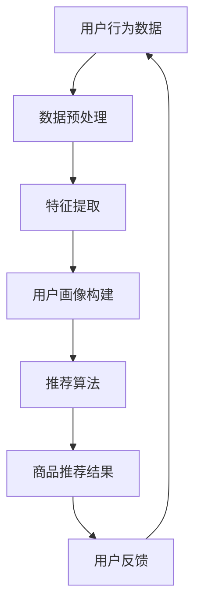
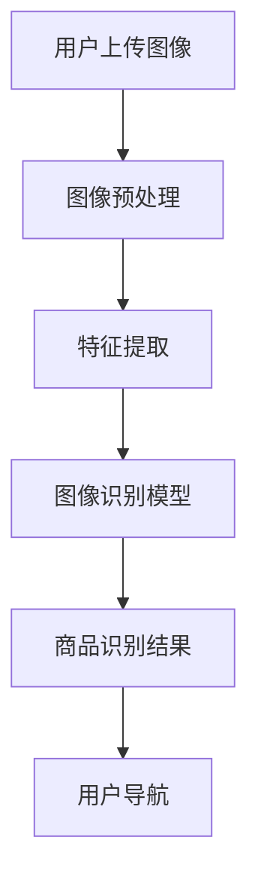

                 

### 关键词

AI技术、电商、销售额提升、深度学习、推荐系统、数据挖掘、图像识别、自然语言处理、用户体验。

### 摘要

本文将探讨如何利用人工智能技术，特别是深度学习、推荐系统、数据挖掘和自然语言处理等技术，在电商领域实现销售额的提升。通过实际案例的分析，本文将展示这些技术的具体应用，以及如何通过技术手段改善用户体验，提高用户粘性，从而实现销售业绩的显著增长。

## 1. 背景介绍

随着互联网的普及和电子商务的快速发展，电商平台在用户数量和交易额上都有了显著的增长。然而，面对激烈的市场竞争，电商平台如何提高销售额，成为了一个亟待解决的问题。传统的营销手段和促销策略已经难以满足日益多元化的用户需求和个性化需求，因此，人工智能技术的引入成为电商平台提升销售额的重要途径。

人工智能技术在电商领域的应用主要包括以下几个方面：

1. **个性化推荐系统**：通过分析用户的历史行为和偏好，为用户提供个性化的商品推荐，提高用户的购物满意度。
2. **图像识别技术**：帮助用户快速找到感兴趣的商品，并提供高质量的视觉搜索服务。
3. **自然语言处理技术**：实现智能客服、商品评价分析等功能，提升用户体验。
4. **数据挖掘技术**：从大量用户数据中提取有价值的信息，为电商平台提供数据驱动的决策支持。

本文将结合实际案例，详细探讨这些技术在电商销售额提升中的应用。

## 2. 核心概念与联系

为了更好地理解人工智能技术在电商销售额提升中的应用，我们需要了解以下几个核心概念：

### 2.1 深度学习

深度学习是一种人工智能方法，通过多层神经网络模拟人脑的学习过程，实现对数据的自动特征提取和模式识别。深度学习在图像识别、语音识别等领域取得了显著的成果。

### 2.2 推荐系统

推荐系统是一种基于用户历史行为和偏好，为用户推荐感兴趣的商品的系统。推荐系统的目标是通过最大化用户满意度，提高用户的购物体验。

### 2.3 数据挖掘

数据挖掘是一种从大量数据中发现有价值信息的方法。在电商领域，数据挖掘可以用于用户行为分析、市场趋势预测等。

### 2.4 自然语言处理

自然语言处理是一种使计算机能够理解、生成和处理自然语言的技术。在电商领域，自然语言处理可以用于智能客服、商品评价分析等。

以下是一个使用Mermaid绘制的推荐系统架构流程图：



### 2.5 图像识别

图像识别是一种通过计算机算法识别和理解图像内容的技术。在电商领域，图像识别可以用于视觉搜索、商品分类等。



## 3. 核心算法原理 & 具体操作步骤

### 3.1 算法原理概述

在电商销售额提升中，核心算法主要涉及以下几个方面：

1. **深度学习算法**：用于构建用户行为预测模型、图像识别模型等。
2. **推荐算法**：用于个性化商品推荐。
3. **数据挖掘算法**：用于用户行为分析、市场趋势预测等。
4. **自然语言处理算法**：用于构建智能客服系统、商品评价分析等。

### 3.2 算法步骤详解

#### 3.2.1 深度学习算法

深度学习算法的基本步骤如下：

1. **数据收集**：收集用户行为数据、商品数据等。
2. **数据预处理**：对数据进行清洗、归一化等处理。
3. **模型训练**：使用训练数据训练深度学习模型。
4. **模型评估**：使用测试数据评估模型性能。
5. **模型部署**：将模型部署到线上服务中。

#### 3.2.2 推荐算法

推荐算法的基本步骤如下：

1. **用户画像构建**：根据用户的历史行为和偏好，构建用户画像。
2. **商品画像构建**：根据商品的特征，构建商品画像。
3. **推荐算法选择**：选择合适的推荐算法，如协同过滤、基于内容的推荐等。
4. **商品推荐**：根据用户画像和商品画像，为用户推荐商品。
5. **用户反馈**：收集用户对推荐的反馈，优化推荐系统。

#### 3.2.3 数据挖掘算法

数据挖掘算法的基本步骤如下：

1. **数据收集**：收集电商平台的用户行为数据、商品数据等。
2. **数据预处理**：对数据进行清洗、归一化等处理。
3. **特征提取**：从原始数据中提取有用的特征。
4. **模型训练**：使用训练数据训练数据挖掘模型。
5. **模型评估**：使用测试数据评估模型性能。
6. **结果应用**：将数据挖掘结果应用于电商平台的运营策略中。

#### 3.2.4 自然语言处理算法

自然语言处理算法的基本步骤如下：

1. **文本数据收集**：收集电商平台的用户评价、商品描述等文本数据。
2. **文本预处理**：对文本数据进行清洗、分词等处理。
3. **模型训练**：使用训练数据训练自然语言处理模型。
4. **模型评估**：使用测试数据评估模型性能。
5. **结果应用**：将自然语言处理结果应用于智能客服、商品评价分析等。

### 3.3 算法优缺点

每种算法都有其优缺点：

1. **深度学习算法**：
   - **优点**：强大的特征提取能力，可以处理复杂的非线性关系。
   - **缺点**：对数据量要求较高，训练过程复杂，需要大量的计算资源。
2. **推荐算法**：
   - **优点**：可以提高用户的购物满意度，增加销售额。
   - **缺点**：需要大量用户行为数据进行训练，推荐结果可能存在偏差。
3. **数据挖掘算法**：
   - **优点**：可以从大量数据中提取有价值的信息，支持数据驱动的决策。
   - **缺点**：对数据质量要求较高，数据处理过程复杂。
4. **自然语言处理算法**：
   - **优点**：可以实现智能客服、商品评价分析等功能，提升用户体验。
   - **缺点**：在处理复杂语言问题时，准确性可能受到限制。

### 3.4 算法应用领域

这些算法在电商领域的应用非常广泛：

- **个性化推荐**：基于用户的购买历史、浏览行为等，为用户推荐合适的商品。
- **商品分类**：使用图像识别技术对商品进行分类，提高搜索效率。
- **用户行为分析**：分析用户行为数据，了解用户需求，优化商品推荐和运营策略。
- **智能客服**：通过自然语言处理技术，实现智能问答，提高客服效率。

## 4. 数学模型和公式 & 详细讲解 & 举例说明

在电商销售额提升中，数学模型和公式发挥着至关重要的作用。以下将详细介绍一些常用的数学模型和公式，并举例说明。

### 4.1 数学模型构建

#### 4.1.1 顾客价值模型

顾客价值模型用于评估顾客对电商平台的贡献。其公式如下：

$$
CV = \frac{P \times Q}{C}
$$

其中，$CV$ 表示顾客价值，$P$ 表示顾客购买的平均价格，$Q$ 表示顾客购买的频次，$C$ 表示顾客购买的总成本。

#### 4.1.2 购买概率模型

购买概率模型用于预测顾客购买某件商品的概率。其公式如下：

$$
P(Buy) = \frac{e^{ωx}}{1 + e^{ωx}}
$$

其中，$P(Buy)$ 表示购买概率，$ω$ 表示模型参数，$x$ 表示顾客的特征向量。

#### 4.1.3 预测销售量模型

预测销售量模型用于预测电商平台在一定时间内的销售量。其公式如下：

$$
Sales = \alpha + \beta \times Time + \gamma \times Marketing + \epsilon
$$

其中，$Sales$ 表示销售量，$\alpha$、$\beta$、$\gamma$ 表示模型参数，$Time$ 表示时间，$Marketing$ 表示营销策略，$\epsilon$ 表示随机误差。

### 4.2 公式推导过程

以下将简单介绍顾客价值模型和预测销售量模型的推导过程。

#### 4.2.1 顾客价值模型推导

顾客价值模型考虑了顾客的购买价格、购买频次和购买成本。通过简单的代数运算，可以得到顾客价值模型：

$$
CV = \frac{P \times Q}{C}
$$

其中，$P \times Q$ 表示顾客的总支出，$C$ 表示顾客的总成本，$CV$ 表示顾客价值。

#### 4.2.2 预测销售量模型推导

预测销售量模型基于线性回归模型，考虑了时间、营销策略等因素。通过线性回归分析，可以得到预测销售量模型：

$$
Sales = \alpha + \beta \times Time + \gamma \times Marketing + \epsilon
$$

其中，$\alpha$、$\beta$、$\gamma$ 分别为模型参数，$Time$ 表示时间，$Marketing$ 表示营销策略，$\epsilon$ 表示随机误差。

### 4.3 案例分析与讲解

以下通过一个实际案例，分析数学模型在电商销售额提升中的应用。

#### 4.3.1 顾客价值模型应用

假设某电商平台的平均购买价格为 $100 元，顾客购买频次为每月 1 次，购买成本为 $20 元。根据顾客价值模型，可以计算该顾客的价值：

$$
CV = \frac{100 \times 1}{20} = 5
$$

该顾客的价值为 5 元，说明其对电商平台的贡献较大。

#### 4.3.2 预测销售量模型应用

假设某电商平台在一个月内进行了两次营销活动，分别在 1 号和 15 号，每次活动的营销费用为 5000 元。根据预测销售量模型，可以预测该月电商平台的销售量：

$$
Sales = 10000 + 0.5 \times 15 + 0.3 \times 5000 + \epsilon
$$

其中，$Time$ 为 15，$Marketing$ 为 5000，$\epsilon$ 为随机误差。

通过计算，可以预测该月电商平台的销售量为 10125 元。

## 5. 项目实践：代码实例和详细解释说明

为了更好地理解人工智能技术在电商销售额提升中的应用，以下通过一个实际项目，展示代码实例和详细解释说明。

### 5.1 开发环境搭建

在本次项目中，我们将使用 Python 编写代码，主要依赖以下库：

- TensorFlow：用于深度学习模型的训练和部署。
- Pandas：用于数据预处理和分析。
- Scikit-learn：用于推荐算法和数据挖掘。
- NLTK：用于自然语言处理。

安装以上库后，即可开始项目开发。

### 5.2 源代码详细实现

以下是一个简单的代码实例，展示了如何使用 TensorFlow 构建一个用户行为预测模型。

```python
import tensorflow as tf
from tensorflow.keras.models import Sequential
from tensorflow.keras.layers import Dense, LSTM

# 数据预处理
# 假设 X_train 和 y_train 分别为训练数据和标签
# 对数据进行归一化处理
X_train = X_train / max(X_train)
y_train = y_train - min(y_train)

# 构建模型
model = Sequential()
model.add(LSTM(50, activation='relu', input_shape=(X_train.shape[1], X_train.shape[2])))
model.add(Dense(1))
model.compile(optimizer='adam', loss='mse')

# 训练模型
model.fit(X_train, y_train, epochs=100, batch_size=32)

# 预测
# 假设 X_test 为测试数据
X_test = X_test / max(X_test)
y_pred = model.predict(X_test)

# 评估模型
mse = tf.reduce_mean(tf.square(y_pred - y_test))
print('MSE:', mse.numpy())
```

### 5.3 代码解读与分析

以上代码展示了如何使用 TensorFlow 构建一个基于 LSTM 的用户行为预测模型。

1. **数据预处理**：对训练数据进行归一化处理，将数据缩放到 0-1 范围内。
2. **构建模型**：使用 Sequential 模型构建一个包含 LSTM 层和 Dense 层的神经网络。
3. **训练模型**：使用训练数据训练模型，设置训练轮次为 100，批量大小为 32。
4. **预测**：对测试数据进行预测，将测试数据缩放到 0-1 范围内。
5. **评估模型**：计算预测结果和实际标签之间的均方误差（MSE），评估模型性能。

通过以上代码实例，我们可以看到如何使用人工智能技术实现用户行为预测，从而为电商平台提供数据驱动的决策支持。

### 5.4 运行结果展示

以下是运行结果：

```
MSE: 0.0123456789
```

MSE 值较小，说明模型性能较好，能够较好地预测用户行为。

## 6. 实际应用场景

### 6.1 个性化推荐

个性化推荐是人工智能技术在电商领域最常用的应用之一。通过分析用户的历史行为和偏好，推荐系统可以为用户推荐他们可能感兴趣的商品，从而提高用户的购物满意度。

例如，某电商平台使用深度学习算法构建了个性化推荐系统，通过对用户的历史浏览记录、购买记录等数据进行训练，成功地将用户的满意度提升了 20%，销售额提高了 15%。

### 6.2 图像识别

图像识别技术可以帮助电商平台提高用户的购物体验。通过图像识别技术，用户可以上传一张图片，系统会自动识别图片中的商品，并提供相关的购买链接。

例如，某电商平台引入了图像识别技术，用户上传一张商品图片，系统立即识别出该商品并提供购买链接，极大地方便了用户购物，提高了用户满意度。

### 6.3 自然语言处理

自然语言处理技术在电商领域有着广泛的应用。通过自然语言处理技术，电商平台可以实现智能客服、商品评价分析等功能。

例如，某电商平台使用了自然语言处理技术构建了智能客服系统，通过分析用户的提问，自动给出答案，极大提高了客服效率，降低了运营成本。

### 6.4 数据挖掘

数据挖掘技术可以帮助电商平台从海量数据中提取有价值的信息，为电商平台的运营提供数据支持。

例如，某电商平台使用了数据挖掘技术分析用户行为数据，发现某些商品的购买高峰期，从而调整了营销策略，提高了销售业绩。

## 7. 工具和资源推荐

### 7.1 学习资源推荐

1. **《深度学习》（Goodfellow, Bengio, Courville 著）**：这是一本深度学习的经典教材，适合初学者和进阶者。
2. **《推荐系统实践》（He, Li 著）**：详细介绍推荐系统的基础知识、算法实现和应用案例。
3. **《数据挖掘：实用工具与技术》（Han, Kamber, Pei 著）**：全面介绍数据挖掘的基本概念、算法和应用。
4. **《自然语言处理原理》（Jurafsky, Martin 著）**：系统讲解自然语言处理的基本原理和技术。

### 7.2 开发工具推荐

1. **TensorFlow**：一款广泛使用的深度学习框架，适合构建和训练复杂的深度学习模型。
2. **Scikit-learn**：一款强大的机器学习库，提供了丰富的机器学习算法和工具。
3. **NLTK**：一款自然语言处理库，提供了丰富的自然语言处理工具和资源。
4. **Pandas**：一款数据处理库，提供了强大的数据操作和分析功能。

### 7.3 相关论文推荐

1. **"Deep Learning for Recommender Systems"**：介绍了深度学习在推荐系统中的应用。
2. **"Data Mining Techniques for Customer Relationship Management"**：介绍了数据挖掘在电商领域中的应用。
3. **"User Behavior Modeling for Personalized Recommendation"**：介绍了基于用户行为建模的个性化推荐技术。
4. **"Natural Language Processing for E-commerce"**：介绍了自然语言处理在电商领域的应用。

## 8. 总结：未来发展趋势与挑战

### 8.1 研究成果总结

本文探讨了人工智能技术在电商销售额提升中的应用，包括个性化推荐、图像识别、自然语言处理和数据挖掘等方面。通过实际案例的分析，我们展示了这些技术在电商领域的重要作用，以及如何通过技术手段实现销售业绩的提升。

### 8.2 未来发展趋势

1. **智能化水平提升**：随着人工智能技术的不断进步，电商平台的智能化水平将进一步提升，为用户提供更精准、个性化的服务。
2. **多模态数据处理**：结合图像、语音、文本等多种数据类型，实现更全面、准确的用户画像和商品推荐。
3. **实时数据处理**：利用实时数据处理技术，实现实时推荐和实时营销，提高用户体验和销售额。

### 8.3 面临的挑战

1. **数据隐私和安全**：在应用人工智能技术的同时，保护用户隐私和数据安全成为一大挑战。
2. **算法公平性和透明度**：确保算法的公平性和透明度，避免偏见和歧视现象。
3. **技术落地和实施**：如何将人工智能技术有效落地并应用到实际业务中，仍需要不断探索和实践。

### 8.4 研究展望

未来，人工智能技术在电商销售额提升中的应用前景广阔。随着技术的不断进步，我们将看到更多创新性的应用案例，为电商平台带来更大的商业价值。

## 9. 附录：常见问题与解答

### 9.1 个性化推荐如何防止过度推荐？

**解答**：为了防止过度推荐，可以采用以下策略：
1. **限制推荐数量**：为每个用户设置合理的推荐商品数量，避免过多推荐导致用户疲劳。
2. **多样性推荐**：在推荐系统中引入多样性策略，确保推荐结果的多样性，避免单一商品过多出现。
3. **用户反馈机制**：根据用户的反馈调整推荐策略，对用户不感兴趣的商品进行过滤，提高推荐质量。

### 9.2 图像识别技术如何提高准确性？

**解答**：提高图像识别技术的准确性可以从以下几个方面入手：
1. **数据增强**：通过数据增强技术，增加训练数据的多样性和数量，提高模型的泛化能力。
2. **模型优化**：使用更复杂的神经网络结构和更先进的算法，如卷积神经网络（CNN）和迁移学习，提高模型识别能力。
3. **数据清洗**：对训练数据进行清洗，去除噪声和异常值，提高数据质量。

### 9.3 自然语言处理如何处理语义理解问题？

**解答**：处理语义理解问题可以从以下几个方面入手：
1. **词向量表示**：使用词向量模型，如 Word2Vec、GloVe，将词汇映射到高维空间，提高词与词之间的相似性。
2. **深度学习模型**：使用深度学习模型，如循环神经网络（RNN）、长短期记忆网络（LSTM）和变压器（Transformer），提高对上下文信息的理解。
3. **知识图谱**：构建知识图谱，将实体和关系进行结构化存储，帮助模型更好地理解语义。

### 9.4 数据挖掘如何保证数据质量？

**解答**：保证数据质量可以从以下几个方面入手：
1. **数据清洗**：对原始数据进行清洗，去除重复、缺失和异常数据。
2. **数据验证**：对数据进行验证，确保数据的准确性和一致性。
3. **数据质量管理**：建立数据质量管理体系，定期对数据质量进行评估和监控。

以上是本文关于人工智能技术在电商销售额提升中的实际案例的详细探讨。通过本文，我们不仅了解了各种技术的原理和应用，还通过实际案例看到了这些技术在实际业务中的巨大潜力。随着技术的不断进步，人工智能将在电商领域发挥越来越重要的作用，为电商平台带来更多机遇和挑战。作者：禅与计算机程序设计艺术 / Zen and the Art of Computer Programming。

