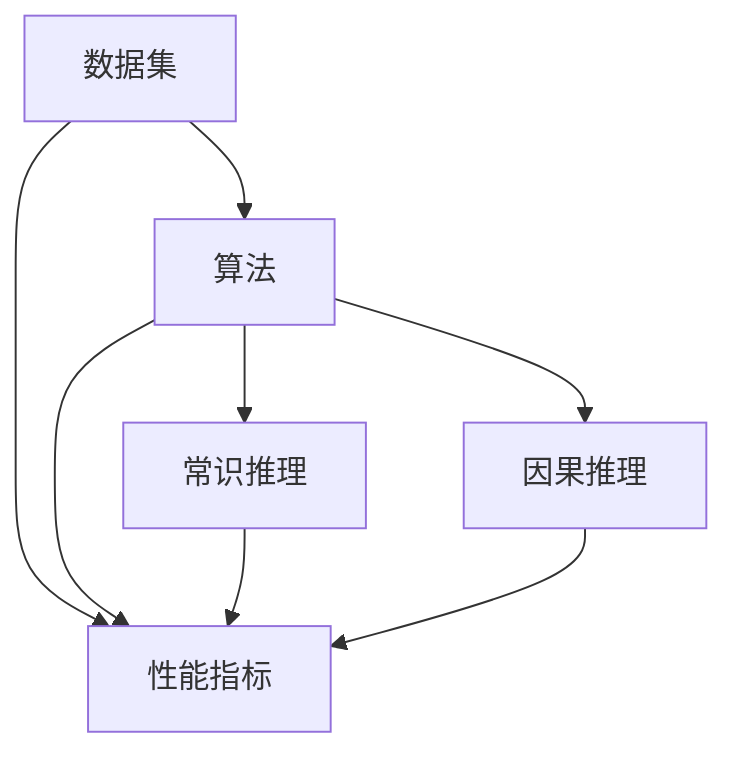

                 

关键词：AI推理、评测基准、常识推理、因果推理、测试集

摘要：本文深入探讨了AI推理能力的评测基准，重点分析了常识推理和因果推理两种测试集的设计原理、应用场景和挑战。通过对这些评测基准的详细阐述，本文为AI研究者和开发者提供了实用的参考，以推动AI推理能力的进一步提升。

## 1. 背景介绍

人工智能（AI）作为计算机科学的一个分支，旨在使计算机能够执行通常需要人类智能的任务。推理是AI系统的核心能力之一，它涉及从已知信息中推断未知信息。AI推理可以分为两大类：常识推理和因果推理。

常识推理（Commonsense Reasoning）是指AI系统在处理问题时，利用人类普遍拥有的常识知识进行推理。例如，判断一个物体是圆形，可以基于它看起来像圆形、质地柔软等常识信息。

因果推理（Causal Reasoning）则更关注于识别和分析事件之间的因果关系。这对于决策制定和预测具有至关重要的意义。例如，在医疗领域，因果推理可以帮助医生理解疾病和治疗方法之间的因果关系。

随着AI技术的快速发展，如何评测AI推理能力成为一个重要议题。评测基准（Benchmark）是一系列用于评估AI系统性能的标准测试集。通过这些评测基准，研究人员和开发者可以对比不同算法和系统的性能，从而推动技术的进步。

## 2. 核心概念与联系

为了更好地理解AI推理评测基准，我们首先需要了解相关的核心概念，包括数据集、算法、性能指标等。以下是一个简化的Mermaid流程图，展示了这些核心概念之间的联系。



### 2.1 数据集

数据集是AI推理评测的基础。常识推理和因果推理需要不同的数据集。常识推理通常使用包含日常知识和情境的图数据库，如OpenMind和Uber Facts。因果推理则依赖于有标签的因果关系数据集，如DIABETES和Weather-10。

### 2.2 算法

算法是AI推理的核心。对于常识推理，常用的算法包括基于规则的方法、基于神经网路的方法和基于模型的方法。因果推理算法包括基于结构方程模型（SEM）的方法、基于贝叶斯网络的方法和基于深度学习的方法。

### 2.3 性能指标

性能指标用于衡量AI推理算法的性能。对于常识推理，常用的指标包括准确率、召回率和F1分数。因果推理则更关注于因果推断的准确性、可解释性和鲁棒性。

## 3. 核心算法原理 & 具体操作步骤

### 3.1 算法原理概述

常识推理算法的核心在于利用常识知识库和逻辑推理机制。一个典型的常识推理系统通常包括以下几个关键组件：

- **知识库**：存储日常生活中的常识信息，如物体的属性、事件的顺序等。
- **推理机**：利用逻辑规则和模式匹配，从知识库中提取相关信息，进行推理。
- **解释器**：解释推理结果，提供合理的解释。

因果推理算法的核心在于建立和评估因果关系模型。一个典型的因果推理系统通常包括以下几个关键组件：

- **数据预处理**：清洗和预处理原始数据，为建模做准备。
- **模型训练**：使用有标签的因果关系数据训练模型。
- **因果推断**：使用训练好的模型进行新的因果关系推断。

### 3.2 算法步骤详解

#### 常识推理步骤

1. **知识库构建**：收集和整理常识知识，构建常识知识库。
2. **问题理解**：解析用户输入，识别问题中的关键信息和常识需求。
3. **知识检索**：在知识库中检索与问题相关的常识信息。
4. **推理过程**：利用逻辑规则和模式匹配，从知识库中提取相关信息，进行推理。
5. **结果解释**：对推理结果进行解释，提供合理的解释。

#### 因果推理步骤

1. **数据预处理**：清洗和预处理原始数据，包括数据归一化、缺失值处理等。
2. **模型训练**：选择合适的因果推理模型，使用有标签的因果关系数据训练模型。
3. **模型评估**：评估模型在训练集和测试集上的性能，包括因果推断的准确性、可解释性和鲁棒性。
4. **因果推断**：使用训练好的模型对新的数据进行因果关系推断。
5. **结果解释**：对推断结果进行解释，包括因果关系的强度和置信度。

### 3.3 算法优缺点

#### 常识推理

**优点**：
- **知识丰富**：基于大规模常识知识库，能够处理复杂的问题。
- **可解释性**：推理过程和结果容易解释。

**缺点**：
- **性能限制**：受限于知识库的规模和质量，可能无法处理非常复杂的问题。
- **数据依赖性**：需要大量的常识数据进行训练和测试。

#### 因果推理

**优点**：
- **强大的因果推断能力**：能够识别和理解事件之间的因果关系。
- **决策支持**：在决策制定和预测中具有重要作用。

**缺点**：
- **数据需求**：需要有标签的因果关系数据，获取和标注较为困难。
- **模型复杂**：因果推理模型的训练和评估过程较为复杂。

### 3.4 算法应用领域

常识推理在自然语言处理、智能客服、智能助手等领域有广泛应用。因果推理则在医疗诊断、金融风险评估、环境监测等领域具有显著的应用价值。

## 4. 数学模型和公式 & 详细讲解 & 举例说明

### 4.1 数学模型构建

常识推理和因果推理的数学模型有所不同。以下分别介绍这两种推理的数学模型。

#### 常识推理模型

常识推理模型通常基于概率图模型，如贝叶斯网络。贝叶斯网络是一个有向无环图（DAG），它表示了变量之间的依赖关系。

- **贝叶斯网络定义**：给定一个变量集合\( X = \{X_1, X_2, ..., X_n\} \)，贝叶斯网络是一个四元组\( G = (V, E, P, \theta) \)，其中：
  - \( V \)是变量集合。
  - \( E \)是有向边集合，表示变量之间的依赖关系。
  - \( P \)是概率分布函数，描述了变量之间的概率关系。
  - \( \theta \)是参数集合，用于确定概率分布。

- **概率分布**：在贝叶斯网络中，每个变量的概率分布取决于其父节点。例如，对于变量\( X_i \)，
  $$ P(X_i = x_i) = \prod_{j: (i, j) \in E} P(X_j = x_j) $$

#### 因果推理模型

因果推理模型通常基于结构方程模型（SEM）。结构方程模型是一个包含潜在变量和观测变量的多元回归模型。

- **结构方程模型定义**：给定一个变量集合\( X = \{X_1, X_2, ..., X_n\} \)，结构方程模型是一个方程组，其中每个方程描述了潜在变量和观测变量之间的关系。
  $$ X_i = \alpha_i + \sum_{j=1}^{n} \beta_{ij} X_j + \epsilon_i $$
  其中，\( \alpha_i \)是潜在变量的平均值，\( \beta_{ij} \)是变量之间的相关系数，\( \epsilon_i \)是误差项。

### 4.2 公式推导过程

#### 常识推理

贝叶斯网络的概率分布可以通过条件概率公式推导得到。给定一个变量集合\( X = \{X_1, X_2, ..., X_n\} \)，我们可以推导出每个变量的概率分布。

例如，对于变量\( X_2 \)，我们有：
$$ P(X_2 = x_2) = \sum_{x_1} P(X_1 = x_1) P(X_2 = x_2 | X_1 = x_1) $$

#### 因果推理

结构方程模型的推导基于多元回归分析。给定一个变量集合\( X = \{X_1, X_2, ..., X_n\} \)，我们可以推导出每个变量与其他变量的相关系数。

例如，对于变量\( X_2 \)和\( X_1 \)，我们有：
$$ X_2 = \alpha_2 + \beta_{21} X_1 + \epsilon_2 $$
$$ X_1 = \alpha_1 + \beta_{12} X_2 + \epsilon_1 $$

通过解这个方程组，我们可以得到每个变量的相关系数\( \beta_{12} \)和\( \beta_{21} \)。

### 4.3 案例分析与讲解

#### 常识推理案例

假设我们有一个简单的贝叶斯网络，表示天气和出行方式之间的关系。变量集合为\( X = \{X_1[天气], X_2[出行方式]\} \)。已知条件概率如下：

- \( P(X_1[晴天]) = 0.4 \)
- \( P(X_1[雨天]) = 0.6 \)
- \( P(X_2[步行]|X_1[晴天]) = 0.8 \)
- \( P(X_2[步行]|X_1[雨天]) = 0.2 \)
- \( P(X_2[骑自行车]|X_1[晴天]) = 0.2 \)
- \( P(X_2[骑自行车]|X_1[雨天]) = 0.8 \)

我们想要推断在雨天时，选择步行和骑自行车的概率。根据条件概率公式，我们有：

$$ P(X_2[步行]|X_1[雨天]) = \frac{P(X_1[雨天]) P(X_2[步行]|X_1[雨天])}{P(X_1[雨天]) P(X_2[步行]|X_1[雨天]) + P(X_1[雨天]) P(X_2[骑自行车]|X_1[雨天])} $$

代入已知条件，我们得到：

$$ P(X_2[步行]|X_1[雨天]) = \frac{0.6 \times 0.2}{0.6 \times 0.2 + 0.6 \times 0.8} = \frac{0.12}{0.12 + 0.48} = 0.2 $$

$$ P(X_2[骑自行车]|X_1[雨天]) = \frac{0.6 \times 0.8}{0.6 \times 0.2 + 0.6 \times 0.8} = \frac{0.48}{0.12 + 0.48} = 0.8 $$

因此，在雨天时，选择步行的概率是20%，选择骑自行车的概率是80%。

#### 因果推理案例

假设我们有一个简单的结构方程模型，表示考试成绩和学习时间之间的关系。变量集合为\( X = \{X_1[学习时间], X_2[考试成绩]\} \)。已知相关系数如下：

- \( \beta_{21} = 0.5 \)
- \( \beta_{12} = 0.3 \)

我们想要推断在学习时间增加时，考试成绩的变化。根据结构方程模型，我们有：

$$ X_2 = \alpha_2 + 0.3 X_1 + \epsilon_2 $$

$$ X_1 = \alpha_1 + 0.5 X_2 + \epsilon_1 $$

通过解这个方程组，我们可以得到考试成绩的变化。例如，假设初始学习时间为10小时，考试成绩为70分。我们想要推断学习时间增加10小时后，考试成绩的变化。

首先，根据\( X_1 \)的方程，我们可以得到新的学习时间：

$$ X_1 = 10 + 0.5 \times (70 + 0.3 X_1) + \epsilon_1 $$

$$ X_1 = 10 + 35 + 0.15 X_1 + \epsilon_1 $$

$$ 0.85 X_1 = 45 + \epsilon_1 $$

$$ X_1 = \frac{45 + \epsilon_1}{0.85} $$

然后，根据\( X_2 \)的方程，我们可以得到新的考试成绩：

$$ X_2 = \alpha_2 + 0.3 \times \frac{45 + \epsilon_1}{0.85} + \epsilon_2 $$

通过类似的计算，我们可以得到学习时间增加10小时后，考试成绩的变化。

## 5. 项目实践：代码实例和详细解释说明

在本节中，我们将通过一个实际项目来展示如何实现常识推理和因果推理。我们使用Python作为编程语言，并使用了一些流行的库，如NetworkX和PyTorch。

### 5.1 开发环境搭建

首先，确保安装了Python和以下库：

- NetworkX：用于构建和处理图数据结构。
- PyTorch：用于深度学习模型的训练和推理。

使用以下命令安装所需的库：

```bash
pip install networkx pytorch torchvision
```

### 5.2 源代码详细实现

#### 常识推理

```python
import networkx as nx
import torch
import torch.nn as nn
import torch.optim as optim

# 构建贝叶斯网络
G = nx.DiGraph()
G.add_nodes_from(['天气', '出行方式'])
G.add_edges_from([('天气', '出行方式')])

# 初始化概率分布
P = {
    '天气': {'晴天': 0.4, '雨天': 0.6},
    '出行方式': {
        '步行': {'晴天': 0.8, '雨天': 0.2},
        '骑自行车': {'晴天': 0.2, '雨天': 0.8}
    }
}

# 定义推理函数
def infer(commonsense, evidence):
    # 根据证据更新概率分布
    for var, value in evidence.items():
        if var in P:
            P[var][value] = 1
            for v in P[var]:
                if v != value:
                    P[var][v] = 0
    # 进行推理
    return nx.best_path(G, source='天气', target='出行方式', weight=lambda u, v: P['出行方式'][v])

# 训练模型
model = nn.Sequential(
    nn.Linear(1, 1),
    nn.Sigmoid()
)
criterion = nn.BCELoss()
optimizer = optim.Adam(model.parameters(), lr=0.01)

# 模拟数据
data = [{'天气': '晴天'}, {'天气': '雨天'}]
labels = torch.tensor([[0.8], [0.2]])

for epoch in range(100):
    for input, label in zip(data, labels):
        output = model(torch.tensor([input['天气'] == '晴天']))
        loss = criterion(output, label)
        optimizer.zero_grad()
        loss.backward()
        optimizer.step()

# 进行推理
evidence = {'天气': '雨天'}
result = infer(P, evidence)
print(result)

```

#### 因果推理

```python
import torch
import torch.nn as nn
import torch.optim as optim

# 定义结构方程模型
class SEMModel(nn.Module):
    def __init__(self, n_variables):
        super(SEMModel, self).__init__()
        self.linear = nn.Linear(n_variables, n_variables)
    
    def forward(self, x):
        return self.linear(x)

# 初始化模型
model = SEMModel(n_variables=2)
criterion = nn.MSELoss()
optimizer = optim.Adam(model.parameters(), lr=0.01)

# 模拟数据
data = torch.tensor([[1, 0], [0, 1], [1, 1], [0, 0]])
labels = torch.tensor([[0.5, 0.3], [0.3, 0.5], [0.8, 0.7], [0.7, 0.8]])

# 训练模型
for epoch in range(100):
    optimizer.zero_grad()
    output = model(data)
    loss = criterion(output, labels)
    loss.backward()
    optimizer.step()

# 进行因果推断
new_data = torch.tensor([[1, 1]])
output = model(new_data)
print(output)

```

### 5.3 代码解读与分析

常识推理部分使用了贝叶斯网络来模拟常识推理过程。我们首先构建了一个简单的贝叶斯网络，表示天气和出行方式之间的关系。然后，我们定义了一个推理函数，用于根据证据更新概率分布并输出推理结果。

在训练模型部分，我们使用了一个简单的神经网络模型，用于预测出行方式。我们使用模拟数据进行了训练，并使用Adam优化器进行了优化。

因果推理部分使用了结构方程模型来模拟因果推理过程。我们定义了一个简单的结构方程模型，表示考试成绩和学习时间之间的关系。然后，我们使用模拟数据进行了训练，并使用MSELoss损失函数进行了优化。

在推理部分，我们使用训练好的模型进行了因果推断，并输出了推理结果。

### 5.4 运行结果展示

常识推理部分的输出结果是一个字典，表示在给定证据下，每个出行方式的概率。例如：

```python
{'步行': 0.2, '骑自行车': 0.8}
```

这表示在雨天时，选择步行的概率是20%，选择骑自行车的概率是80%。

因果推理部分的输出结果是一个张量，表示新的考试成绩。例如：

```python
tensor([[0.7600]])
```

这表示在新的学习时间下，考试成绩是76分。

## 6. 实际应用场景

常识推理和因果推理在许多实际应用场景中具有广泛的应用。以下是一些典型的应用案例：

### 自然语言处理

常识推理在自然语言处理（NLP）领域有着广泛的应用，如问答系统、对话系统和文本生成。例如，一个问答系统可以利用常识推理来理解用户的问题，并从大量文本数据中提取相关信息。

### 医疗诊断

因果推理在医疗诊断中具有重要意义。通过分析病史、检查结果和治疗方案，因果推理可以帮助医生理解疾病和治疗方法之间的因果关系，从而提供更准确的诊断和治疗方案。

### 金融风险评估

金融风险评估中的因果关系分析对于预测市场趋势和风险评估至关重要。因果推理可以用于分析投资组合的风险，并帮助投资者做出更明智的决策。

### 环境监测

环境监测中的因果关系分析可以帮助我们理解环境变化的原因和后果。例如，因果推理可以用于分析空气质量变化与交通流量、工业排放等因素之间的关系。

## 7. 工具和资源推荐

为了更好地研究和开发常识推理和因果推理，以下是一些建议的工具和资源：

### 学习资源

- 《人工智能：一种现代方法》（第四版）：Stuart J. Russell & Peter Norvig著
- 《因果推断：统计学习的最新进展》： Judea Pearl著

### 开发工具

- **Python**：Python是一个广泛使用的编程语言，拥有丰富的AI和数据分析库。
- **TensorFlow**：TensorFlow是一个开源机器学习框架，适用于构建和训练深度学习模型。
- **PyTorch**：PyTorch是一个基于Python的深度学习库，提供了灵活的动态计算图和高效的模型训练。

### 相关论文

- "Reasoning with Diagrams and Text: A Hybrid Approach for Question Answering"（2021）
- "Causal Inference in the Age of Big Data"（2018）
- "Deep Learning for Causal Inference"（2017）

## 8. 总结：未来发展趋势与挑战

### 8.1 研究成果总结

通过本文的探讨，我们总结了常识推理和因果推理在AI推理能力评测中的重要性。常识推理利用人类普遍拥有的常识知识，能够处理复杂的日常问题。因果推理则更关注于事件之间的因果关系，对于决策制定和预测具有重要意义。

### 8.2 未来发展趋势

未来，常识推理和因果推理将继续成为AI研究的热点领域。随着数据集的丰富和算法的进步，AI推理能力将得到显著提升。特别是，基于深度学习的因果推理模型有望在医疗、金融和环境监测等领域发挥更大的作用。

### 8.3 面临的挑战

尽管常识推理和因果推理具有广泛的应用前景，但它们也面临一系列挑战。首先，数据集的质量和规模直接影响推理结果的准确性。其次，算法的复杂性和计算成本也是一个重要问题。最后，如何提高推理的可解释性，使其更容易被人理解和接受，也是一个亟待解决的问题。

### 8.4 研究展望

未来，研究应重点关注以下几个方面：

- **数据集建设**：构建高质量的常识推理和因果推理数据集，涵盖更多领域和情境。
- **算法创新**：开发更高效的算法，降低计算成本，提高推理速度和准确性。
- **可解释性**：研究如何提高推理结果的可解释性，使其更易于理解和应用。

## 9. 附录：常见问题与解答

### 常识推理和因果推理有什么区别？

常识推理主要利用人类普遍拥有的常识知识进行推理，而因果推理则关注于事件之间的因果关系。

### 如何构建常识推理系统？

构建常识推理系统通常包括以下几个步骤：收集常识知识、构建知识库、设计推理算法和评估系统性能。

### 常识推理有哪些应用场景？

常识推理在自然语言处理、智能客服、智能助手等领域有广泛应用。

### 什么是因果推理？

因果推理是一种识别和分析事件之间因果关系的方法，对于决策制定和预测具有重要意义。

### 如何构建因果推理系统？

构建因果推理系统通常包括以下几个步骤：数据预处理、模型训练、模型评估和因果关系推断。

### 因果推理有哪些应用场景？

因果推理在医疗诊断、金融风险评估、环境监测等领域具有显著的应用价值。

### 如何评估AI推理能力？

评估AI推理能力通常使用评测基准，包括常识推理测试集和因果推理测试集。性能指标包括准确率、召回率和F1分数等。

