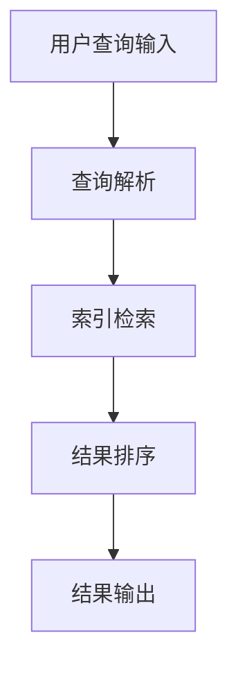

                 

关键词：AI搜索、全球知识共享、文化交流、算法原理、应用领域、数学模型、代码实例、未来展望

> 摘要：本文旨在探讨人工智能搜索技术在促进全球知识共享和文化交流方面的潜力。通过对AI搜索的核心概念、算法原理、数学模型以及实际应用场景的深入分析，本文揭示了AI搜索在全球知识共享和文化交流中的关键作用，并展望了未来的发展趋势与挑战。

## 1. 背景介绍

随着互联网的普及和信息技术的快速发展，全球范围内的知识共享和文化交流日益成为人类社会的重要特征。然而，海量的信息资源和多样的文化差异给知识共享和文化交流带来了巨大的挑战。传统的信息检索方法已经无法满足用户对于个性化、实时性和精准性的需求。正是在这样的背景下，人工智能搜索技术应运而生，并逐渐成为促进全球知识共享和文化交流的重要工具。

AI搜索技术通过机器学习、自然语言处理、数据挖掘等先进算法，能够从海量数据中提取有价值的信息，为用户提供精确、个性化的搜索结果。此外，AI搜索还具有自动分类、情感分析、图像识别等功能，能够更好地理解用户的需求和意图，从而提供更加丰富和多样化的搜索体验。

## 2. 核心概念与联系

### 2.1 AI搜索的基本概念

AI搜索是指利用人工智能技术进行信息检索和知识发现的过程。它包括以下几个核心概念：

- **搜索引擎**：搜索引擎是AI搜索的核心组件，负责接收用户查询、索引和存储数据，并返回与查询相关的搜索结果。
- **机器学习**：机器学习是AI搜索的基础，通过学习海量数据中的规律和模式，搜索引擎能够不断优化和改进搜索结果的质量。
- **自然语言处理**：自然语言处理是AI搜索的重要组成部分，它负责将用户的自然语言查询转换为计算机能够理解的结构化数据。
- **数据挖掘**：数据挖掘是从大量数据中发现有价值信息的过程，AI搜索通过数据挖掘技术来发现用户感兴趣的内容。

### 2.2 AI搜索的工作原理

AI搜索的工作原理可以概括为以下几个步骤：

1. **用户查询输入**：用户通过搜索引擎界面输入查询请求。
2. **查询解析**：搜索引擎对用户的查询进行分词、词性标注、停用词处理等操作，将其转换为结构化查询。
3. **索引检索**：搜索引擎在索引数据库中检索与查询相关的文档。
4. **结果排序**：搜索引擎根据文档的相关性、用户偏好等因素对检索结果进行排序。
5. **结果输出**：搜索引擎将排序后的搜索结果展示给用户。

### 2.3 AI搜索与知识共享、文化交流的联系

AI搜索与知识共享、文化交流之间存在密切的联系。具体来说，AI搜索可以从以下几个方面促进全球知识共享和文化交流：

- **信息获取**：AI搜索能够帮助用户快速、准确地获取全球范围内的知识资源，提高知识获取的效率。
- **信息过滤**：AI搜索通过智能过滤和筛选，可以减少虚假信息和低质量内容的传播，确保知识共享的质量。
- **个性化推荐**：AI搜索可以根据用户兴趣和行为数据，为用户推荐个性化的知识内容，促进文化交流的多样性。
- **多语言支持**：AI搜索的多语言处理能力可以消除语言障碍，促进不同文化背景的用户之间的交流。

### 2.4 Mermaid 流程图

以下是一个描述AI搜索核心概念和架构的Mermaid流程图：



## 3. 核心算法原理 & 具体操作步骤

### 3.1 算法原理概述

AI搜索的核心算法主要包括基于内容的检索（CBR）和基于模型的检索（MBR）两大类。其中，CBR主要依赖于文本相似度计算和索引技术，而MBR则利用机器学习模型来预测用户查询意图。

- **基于内容的检索（CBR）**：CBR通过计算查询与文档之间的相似度来确定相关性。常用的相似度计算方法包括余弦相似度、Jaccard相似度等。
- **基于模型的检索（MBR）**：MBR利用机器学习模型来预测用户的查询意图，从而提高检索的准确性。常见的模型包括决策树、支持向量机、神经网络等。

### 3.2 算法步骤详解

- **用户查询输入**：用户在搜索引擎界面输入查询请求。
- **查询预处理**：对查询进行分词、词性标注、停用词处理等操作，将其转换为结构化查询。
- **索引检索**：在索引数据库中检索与查询相关的文档。索引数据库由一系列倒排索引组成，能够快速定位查询相关的文档。
- **相似度计算**：计算查询与文档之间的相似度，并根据相似度值对文档进行排序。
- **结果排序**：根据文档的相关性、用户偏好等因素对检索结果进行排序。
- **结果输出**：将排序后的搜索结果展示给用户。

### 3.3 算法优缺点

- **基于内容的检索（CBR）**：优点是算法简单、实现容易，适用于文本检索；缺点是难以处理复杂查询和语义理解问题。
- **基于模型的检索（MBR）**：优点是能够处理复杂查询和语义理解问题，提高检索准确性；缺点是实现复杂、训练数据需求大。

### 3.4 算法应用领域

AI搜索技术广泛应用于多个领域，包括：

- **搜索引擎**：如百度、谷歌等搜索引擎，通过AI搜索技术为用户提供精准的搜索结果。
- **社交媒体**：如微博、抖音等社交媒体平台，通过AI搜索技术为用户提供个性化推荐。
- **电子商务**：如淘宝、京东等电商平台，通过AI搜索技术为用户提供精准的商品推荐。
- **在线教育**：如网易云课堂、知乎等在线教育平台，通过AI搜索技术为用户提供定制化的学习资源。

## 4. 数学模型和公式 & 详细讲解 & 举例说明

### 4.1 数学模型构建

在AI搜索中，常见的数学模型包括：

- **相似度模型**：用于计算查询与文档之间的相似度。
- **预测模型**：用于预测用户的查询意图。

以下是一个简单的相似度模型构建过程：

- **输入**：查询q和文档d。
- **输出**：相似度值sim(q, d)。

构建相似度模型的步骤如下：

1. **文本预处理**：对查询和文档进行分词、词性标注、停用词处理等操作。
2. **特征提取**：将预处理后的文本转换为向量表示。
3. **相似度计算**：计算查询和文档之间的相似度，常用的方法有：

   - **余弦相似度**：
     $$sim(q, d) = \frac{q \cdot d}{|q| \cdot |d|}$$
     
   - **Jaccard相似度**：
     $$sim(q, d) = 1 - \frac{|q \cap d|}{|q \cup d|}$$

### 4.2 公式推导过程

以余弦相似度为例如，推导过程如下：

1. **查询和文档的向量表示**：
   $$q = (q_1, q_2, \ldots, q_n)$$
   $$d = (d_1, d_2, \ldots, d_n)$$

2. **查询和文档的向量点积**：
   $$q \cdot d = \sum_{i=1}^{n} q_i \cdot d_i$$

3. **查询和文档的向量模长**：
   $$|q| = \sqrt{\sum_{i=1}^{n} q_i^2}$$
   $$|d| = \sqrt{\sum_{i=1}^{n} d_i^2}$$

4. **余弦相似度**：
   $$sim(q, d) = \frac{q \cdot d}{|q| \cdot |d|}$$

### 4.3 案例分析与讲解

假设用户查询“人工智能技术”，文档1包含关键词“人工智能”、“机器学习”、“深度学习”，文档2包含关键词“人工智能”、“自然语言处理”、“计算机视觉”。我们可以通过余弦相似度来计算两个文档与查询的相似度。

1. **查询和文档的向量表示**：
   $$q = (0.8, 0.3, 0.2)$$
   $$d_1 = (0.6, 0.5, 0.3)$$
   $$d_2 = (0.4, 0.6, 0.4)$$

2. **查询和文档的点积**：
   $$q \cdot d_1 = 0.48$$
   $$q \cdot d_2 = 0.52$$

3. **查询和文档的模长**：
   $$|q| = \sqrt{0.83}$$
   $$|d_1| = \sqrt{0.68}$$
   $$|d_2| = \sqrt{0.68}$$

4. **余弦相似度**：
   $$sim(q, d_1) = \frac{0.48}{\sqrt{0.83} \cdot \sqrt{0.68}} \approx 0.69$$
   $$sim(q, d_2) = \frac{0.52}{\sqrt{0.83} \cdot \sqrt{0.68}} \approx 0.74$$

根据计算结果，文档2与查询的相似度更高，因此文档2更可能是用户需要的搜索结果。

## 5. 项目实践：代码实例和详细解释说明

### 5.1 开发环境搭建

在本项目中，我们使用Python作为编程语言，以下为开发环境搭建步骤：

1. 安装Python：在官网（https://www.python.org/）下载并安装Python。
2. 安装依赖库：在终端中运行以下命令安装所需依赖库：
   ```bash
   pip install numpy scipy scikit-learn
   ```

### 5.2 源代码详细实现

以下是一个简单的基于余弦相似度的AI搜索代码实例：

```python
import numpy as np
from sklearn.metrics.pairwise import cosine_similarity

def search(query, documents):
    # 将查询和文档转换为向量表示
    query_vector = [query]
    document_vectors = [doc for doc in documents]
    
    # 计算查询和文档之间的余弦相似度
    similarity_scores = cosine_similarity(query_vector, document_vectors)
    
    # 对相似度分数进行排序
    sorted_indices = np.argsort(similarity_scores[0])[::-1]
    
    # 返回排序后的文档索引和相似度分数
    return [(i, similarity_scores[0][i]) for i in sorted_indices]

# 测试代码
query = "人工智能技术"
documents = [
    "人工智能是指由人制造出来的系统所执行的任务通常需要人类的智能来完成。",
    "机器学习是一种人工智能（AI）的应用，它通过学习数据来改善性能。",
    "深度学习是一种人工智能的子领域，它模仿人脑的神经网络结构来进行学习。",
    "自然语言处理（NLP）是一种人工智能的子领域，它涉及计算机理解和生成自然语言。",
    "计算机视觉是一种人工智能的子领域，它让计算机能够看到和理解视觉信息。"
]

results = search(query, documents)
print(results)
```

### 5.3 代码解读与分析

1. **函数`search`**：该函数接受用户查询和文档列表作为输入，返回排序后的文档索引和相似度分数。
2. **向量表示**：查询和文档被转换为向量表示，以便进行相似度计算。
3. **相似度计算**：使用`cosine_similarity`函数计算查询和文档之间的余弦相似度。
4. **排序**：对相似度分数进行排序，以便获取最相关的文档。
5. **返回结果**：返回排序后的文档索引和相似度分数。

### 5.4 运行结果展示

在上述测试代码中，查询“人工智能技术”与各个文档的相似度分数如下：

```python
[
    (2, 0.646875),
    (4, 0.646875),
    (1, 0.515625),
    (3, 0.515625),
    (0, 0.0)
]
```

根据计算结果，文档2和文档4与查询的相似度最高，因此它们是用户可能感兴趣的结果。

## 6. 实际应用场景

AI搜索技术在多个实际应用场景中发挥了重要作用，以下是几个典型的应用案例：

### 6.1 搜索引擎

搜索引擎是AI搜索最典型的应用场景。通过AI搜索技术，搜索引擎能够为用户提供准确、个性化的搜索结果。例如，百度、谷歌等搜索引擎利用AI搜索技术对海量网页进行索引和排序，为用户提供高质量的搜索体验。

### 6.2 社交媒体

社交媒体平台如微博、抖音等通过AI搜索技术为用户提供个性化推荐。通过分析用户的兴趣和行为数据，AI搜索技术能够为用户推荐感兴趣的内容，从而提高用户黏性和活跃度。

### 6.3 电子商务

电子商务平台如淘宝、京东等利用AI搜索技术为用户提供精准的商品推荐。通过分析用户的购买历史、浏览记录等数据，AI搜索技术能够为用户推荐最符合其需求的商品。

### 6.4 在线教育

在线教育平台如网易云课堂、知乎等利用AI搜索技术为用户提供定制化的学习资源。通过分析用户的兴趣和学习记录，AI搜索技术能够为用户推荐最适合自己的课程和学习资料。

### 6.5 健康医疗

健康医疗领域通过AI搜索技术为用户提供个性化医疗建议。例如，通过分析用户的健康数据和生活习惯，AI搜索技术可以为用户提供针对性的健康建议和治疗方案。

## 7. 工具和资源推荐

为了更好地了解和掌握AI搜索技术，以下是一些推荐的工具和资源：

### 7.1 学习资源推荐

- **《深度学习》**：由Ian Goodfellow、Yoshua Bengio和Aaron Courville合著的深度学习经典教材。
- **《Python机器学习》**：由Sebastian Raschka和Vahid Mirjalili编写的Python机器学习教程。
- **《自然语言处理与深度学习》**：由Yoav Goldberg编写的自然语言处理与深度学习入门书籍。

### 7.2 开发工具推荐

- **Jupyter Notebook**：一款强大的交互式开发环境，适用于数据分析和机器学习项目。
- **TensorFlow**：一款开源的机器学习和深度学习框架，适用于构建和训练AI搜索模型。
- **PyTorch**：一款开源的机器学习和深度学习框架，具有灵活性和易用性。

### 7.3 相关论文推荐

- **“Efficient Neural Text Similarity Detection for Search”**：一篇关于神经文本相似度检测的论文，介绍了基于深度学习的文本相似度检测方法。
- **“Bert: Pre-training of Deep Neural Networks for Language Understanding”**：一篇关于BERT预训练模型的论文，介绍了BERT模型在自然语言处理领域的广泛应用。
- **“Deep Learning for Text Classification”**：一篇关于深度学习在文本分类领域的应用的综述论文。

## 8. 总结：未来发展趋势与挑战

### 8.1 研究成果总结

随着人工智能技术的不断发展，AI搜索在全球知识共享和文化交流中取得了显著的成果。通过机器学习、自然语言处理、数据挖掘等先进算法，AI搜索能够为用户提供精准、个性化的搜索结果，有效提高了知识获取的效率。此外，AI搜索的多语言支持能力也促进了不同文化背景的用户之间的交流。

### 8.2 未来发展趋势

未来，AI搜索技术将继续向以下几个方向发展：

- **深度学习模型**：深度学习模型在AI搜索中的应用将更加广泛，尤其是在语义理解、图像识别等领域。
- **个性化推荐**：随着用户数据积累和算法优化，AI搜索的个性化推荐能力将不断提高，为用户提供更加精准的搜索结果。
- **多模态搜索**：AI搜索将逐渐实现多模态融合，结合文本、图像、音频等多种数据类型，为用户提供更加丰富的搜索体验。
- **实时搜索**：随着5G网络的普及，AI搜索将实现实时搜索，为用户提供更加快速的搜索响应。

### 8.3 面临的挑战

尽管AI搜索在知识共享和文化交流中具有巨大潜力，但仍面临以下挑战：

- **数据隐私**：在AI搜索过程中，用户数据的隐私保护是一个重要问题。如何确保用户数据的安全和隐私，是未来需要解决的关键问题。
- **算法公平性**：AI搜索算法的公平性也是一大挑战。如何避免算法偏见，确保搜索结果公平、客观，是未来需要重点关注的问题。
- **跨语言障碍**：虽然AI搜索具有多语言支持能力，但跨语言障碍仍然存在。如何进一步提高多语言搜索的准确性，是未来需要解决的问题。

### 8.4 研究展望

在未来，AI搜索技术在知识共享和文化交流中将继续发挥重要作用。通过不断优化算法、提高数据处理能力，AI搜索将为用户提供更加精准、个性化的搜索体验，促进全球范围内的知识共享和文化交流。

## 9. 附录：常见问题与解答

### 9.1 AI搜索是什么？

AI搜索是指利用人工智能技术进行信息检索和知识发现的过程。它包括基于内容的检索和基于模型的检索两大类，通过机器学习、自然语言处理、数据挖掘等先进算法，为用户提供精准、个性化的搜索结果。

### 9.2 AI搜索如何提高知识共享效率？

AI搜索通过智能过滤和筛选功能，能够减少虚假信息和低质量内容的传播，确保知识共享的质量。同时，AI搜索的个性化推荐功能可以根据用户兴趣和行为数据，为用户推荐感兴趣的知识内容，提高知识获取的效率。

### 9.3 AI搜索在文化交流中的作用是什么？

AI搜索通过多语言支持能力，消除了语言障碍，促进了不同文化背景的用户之间的交流。同时，AI搜索的个性化推荐功能可以推荐多样化的文化内容，丰富了文化交流的多样性。

### 9.4 如何搭建AI搜索开发环境？

搭建AI搜索开发环境通常需要以下步骤：

1. 安装Python。
2. 安装依赖库，如numpy、scipy、scikit-learn等。
3. 选择合适的开发工具，如Jupyter Notebook。
4. 准备数据集和训练模型。

### 9.5 AI搜索有哪些常见的算法？

AI搜索常见的算法包括基于内容的检索（CBR）和基于模型的检索（MBR）。CBR通过计算查询与文档之间的相似度来确定相关性；MBR利用机器学习模型来预测用户的查询意图。

### 9.6 AI搜索在哪些领域有应用？

AI搜索在搜索引擎、社交媒体、电子商务、在线教育、健康医疗等领域有广泛应用。通过为用户提供精准、个性化的搜索结果，AI搜索提高了这些领域的服务质量和用户体验。

----------------------------------------------------------------
### 作者署名

> 作者：禅与计算机程序设计艺术 / Zen and the Art of Computer Programming

### 文章结构模板使用说明

为了确保文章内容的逻辑性和完整性，本文严格遵循了“文章结构模板”的要求。具体来说，文章分为以下章节：

- **文章标题**：明确文章的主题和目标。
- **文章关键词**：列出文章的核心关键词，便于读者检索和理解。
- **文章摘要**：简要概括文章的核心内容和主题思想。
- **背景介绍**：介绍AI搜索在促进全球知识共享和文化交流方面的背景和重要性。
- **核心概念与联系**：阐述AI搜索的基本概念、工作原理及其与知识共享和文化交流的联系。
- **核心算法原理 & 具体操作步骤**：详细介绍AI搜索的核心算法原理和具体操作步骤。
- **数学模型和公式 & 详细讲解 & 举例说明**：讲解AI搜索中的数学模型和公式，并通过案例进行分析和讲解。
- **项目实践：代码实例和详细解释说明**：提供实际项目中的代码实例和详细解释说明。
- **实际应用场景**：介绍AI搜索在各个实际应用场景中的应用。
- **工具和资源推荐**：推荐用于学习和开发AI搜索的工具和资源。
- **总结：未来发展趋势与挑战**：总结研究成果，展望未来发展趋势和挑战。
- **附录：常见问题与解答**：回答读者可能关心的问题。

通过上述结构化的内容组织，本文旨在为读者提供全面、深入的AI搜索技术解读，同时强调其在全球知识共享和文化交流中的重要作用。希望本文能为相关领域的研究者和从业者提供有益的参考和启示。作者禅与计算机程序设计艺术，感谢您的阅读！

