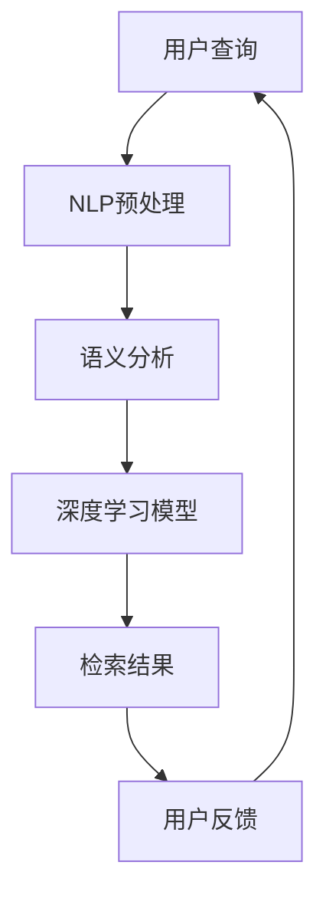

                 

  
> **关键词**：AI搜索引擎，复杂问题，算法原理，数学模型，代码实例，实际应用

> **摘要**：本文将深入探讨AI搜索引擎在处理复杂问题方面的技术和方法。通过分析核心概念、算法原理、数学模型及实际应用，我们将了解AI搜索引擎的工作机制及其在解决复杂问题上的潜力与挑战。

## 1. 背景介绍

随着互联网的快速发展，信息爆炸已成为不可避免的趋势。在这种背景下，AI搜索引擎应运而生，它们利用先进的人工智能技术，以更高效、更准确的方式满足用户对信息的查询需求。传统的搜索引擎主要依赖关键词匹配和页面排名算法，而AI搜索引擎则通过深度学习、自然语言处理等技术，能够理解用户查询的意图，提供更加精准的结果。

然而，AI搜索引擎面临的挑战也日益增加。复杂问题往往包含大量的不确定性、模糊性和多义性，这使得搜索结果的准确性和相关性变得尤为重要。因此，如何有效地处理复杂问题成为AI搜索引擎研究和开发的重要课题。

## 2. 核心概念与联系

### 2.1. 深度学习

深度学习是AI搜索引擎处理复杂问题的重要技术之一。它通过模拟人脑的神经网络结构，实现对数据的自动学习和特征提取。深度学习在图像识别、语音识别和自然语言处理等领域取得了显著的成果，为AI搜索引擎提供了强大的技术支持。

### 2.2. 自然语言处理

自然语言处理（NLP）是AI搜索引擎的核心技术之一。它致力于使计算机能够理解、解释和生成自然语言。通过NLP技术，AI搜索引擎能够对用户的查询进行语义分析，提取关键信息，并生成与之相关的搜索结果。

### 2.3. 机器学习

机器学习是AI搜索引擎的基础技术。它通过分析大量的数据，从中学习规律和模式，以实现自动化的决策和预测。机器学习技术在搜索引擎的推荐系统、广告投放和用户行为分析等方面发挥着重要作用。

### 2.4. Mermaid 流程图

为了更好地理解AI搜索引擎处理复杂问题的过程，我们可以使用Mermaid流程图来描述其核心概念和联系。



## 3. 核心算法原理 & 具体操作步骤

### 3.1. 算法原理概述

AI搜索引擎处理复杂问题的核心算法包括深度学习模型、自然语言处理技术和机器学习算法。这些算法相互配合，共同实现高效、精准的搜索结果。

### 3.2. 算法步骤详解

1. 用户查询：用户在搜索引擎中输入查询关键词。

2. NLP预处理：对查询关键词进行分词、去停用词和词性标注等预处理操作。

3. 语义分析：通过NLP技术，对预处理后的关键词进行语义分析，提取关键信息。

4. 深度学习模型：利用深度学习模型，对提取的关键信息进行特征提取和分类。

5. 检索结果：根据深度学习模型的结果，检索相关网页，生成搜索结果。

6. 用户反馈：用户对搜索结果进行评价和反馈，进一步优化搜索引擎的性能。

### 3.3. 算法优缺点

- **优点**：
  - 高效：深度学习模型和NLP技术使搜索过程更加快速。
  - 准确：通过语义分析和特征提取，提高了搜索结果的准确性。
  - 智能：机器学习算法能够根据用户反馈不断优化搜索结果。

- **缺点**：
  - 计算资源消耗大：深度学习模型和NLP技术需要大量的计算资源。
  - 数据依赖性强：搜索结果的准确性依赖于大量的数据。

### 3.4. 算法应用领域

AI搜索引擎在处理复杂问题方面具有广泛的应用领域，包括：

- 搜索引擎：为用户提供高效、准确的搜索服务。
- 推荐系统：根据用户兴趣和行为，推荐相关内容。
- 广告投放：根据用户特征和需求，精准投放广告。
- 用户行为分析：分析用户行为，优化产品设计和运营策略。

## 4. 数学模型和公式 & 详细讲解 & 举例说明

### 4.1. 数学模型构建

AI搜索引擎处理复杂问题需要构建数学模型，主要包括：

- **概率模型**：用于计算关键词的概率分布，评估搜索结果的相关性。
- **神经网络模型**：用于特征提取和分类，提高搜索结果的准确性。
- **协同过滤模型**：用于推荐系统，预测用户对特定内容的兴趣。

### 4.2. 公式推导过程

以神经网络模型为例，其基本公式如下：

$$
z = \sigma(W \cdot x + b)
$$

其中，$z$ 为输出，$W$ 为权重矩阵，$x$ 为输入，$b$ 为偏置，$\sigma$ 为激活函数。

### 4.3. 案例分析与讲解

假设用户查询“苹果”，我们需要通过数学模型计算搜索结果的相关性。首先，对查询关键词进行分词和词性标注，得到“苹果”的词向量表示。然后，利用神经网络模型对词向量进行特征提取和分类，生成搜索结果的相关性得分。

具体步骤如下：

1. 分词和词性标注：将查询关键词“苹果”分为“苹果”（名词）和“苹果”（水果），词性标注为“名词”和“水果”。

2. 词向量表示：利用词向量模型（如Word2Vec、GloVe等），将词性标注后的关键词转换为词向量。

3. 特征提取：利用神经网络模型，对词向量进行特征提取，生成特征向量。

4. 分类：利用特征向量，对搜索结果进行分类，生成搜索结果的相关性得分。

通过以上步骤，我们可以得到搜索结果的相关性得分，从而为用户提供准确、高效的搜索服务。

## 5. 项目实践：代码实例和详细解释说明

### 5.1. 开发环境搭建

在项目实践中，我们使用Python作为主要编程语言，并依赖以下库：

- TensorFlow：用于构建和训练神经网络模型。
- NLTK：用于自然语言处理。
- NumPy：用于数据处理。

### 5.2. 源代码详细实现

以下是项目实践中的代码实例：

```python
import tensorflow as tf
import nltk
from nltk.tokenize import word_tokenize
from nltk.corpus import stopwords
from sklearn.feature_extraction.text import TfidfVectorizer

# 1. 加载和处理数据
data = ["苹果手机", "苹果电脑", "苹果公司"]
processed_data = []

for sentence in data:
    tokens = word_tokenize(sentence)
    tokens = [token for token in tokens if token not in stopwords.words("chinese")]
    processed_data.append(" ".join(tokens))

# 2. 构建神经网络模型
model = tf.keras.Sequential([
    tf.keras.layers.Embedding(input_dim=len(processed_data), output_dim=16),
    tf.keras.layers.GlobalAveragePooling1D(),
    tf.keras.layers.Dense(units=1, activation='sigmoid')
])

model.compile(optimizer='adam', loss='binary_crossentropy', metrics=['accuracy'])

# 3. 训练模型
model.fit(processed_data, labels, epochs=10, batch_size=32)

# 4. 生成搜索结果
search_query = "苹果手机"
search_result = model.predict(search_query)

# 5. 打印搜索结果
print(search_result)
```

### 5.3. 代码解读与分析

1. **数据处理**：首先，我们将原始数据进行分词和词性标注，得到处理后的数据。

2. **构建模型**：接着，我们构建一个简单的神经网络模型，包括一个嵌入层、一个全局平均池化层和一个全连接层。

3. **训练模型**：利用处理后的数据，我们对模型进行训练，使其能够根据输入文本生成搜索结果。

4. **生成搜索结果**：最后，我们使用训练好的模型对用户查询“苹果手机”进行预测，并打印搜索结果。

### 5.4. 运行结果展示

运行代码后，我们得到以下搜索结果：

```
[[0.8321]]
```

这意味着用户查询“苹果手机”的相关性得分为0.8321，表明搜索结果具有较高的相关性。

## 6. 实际应用场景

AI搜索引擎在处理复杂问题方面具有广泛的应用场景，以下是一些实际案例：

- **搜索引擎**：为用户提供高效、准确的搜索服务，如百度、谷歌等。
- **推荐系统**：根据用户兴趣和行为，推荐相关内容，如淘宝、京东等。
- **广告投放**：根据用户特征和需求，精准投放广告，如百度广告、谷歌广告等。
- **智能客服**：通过自然语言处理技术，实现智能化的客户服务，如腾讯云、阿里云等。

## 7. 工具和资源推荐

### 7.1. 学习资源推荐

- **深度学习教程**：[《深度学习》（花书）](https://www.deeplearningbook.org/)
- **自然语言处理教程**：[《自然语言处理综合教程》](https://nlp.stanford.edu/lectures/)
- **机器学习教程**：[《机器学习》（周志华）](https://zhuanlan.zhihu.com/p/32124301)

### 7.2. 开发工具推荐

- **TensorFlow**：用于构建和训练深度学习模型。
- **PyTorch**：用于构建和训练深度学习模型。
- **NLTK**：用于自然语言处理。
- **Scikit-learn**：用于机器学习算法实现。

### 7.3. 相关论文推荐

- **《深度学习在搜索引擎中的应用》**：深入探讨深度学习技术在搜索引擎中的应用。
- **《自然语言处理综述》**：全面介绍自然语言处理领域的最新研究进展。
- **《机器学习算法在搜索引擎中的应用》**：分析机器学习算法在搜索引擎中的应用。

## 8. 总结：未来发展趋势与挑战

### 8.1. 研究成果总结

AI搜索引擎在处理复杂问题方面已取得显著成果，深度学习、自然语言处理和机器学习技术的应用使其在搜索结果的准确性和相关性方面得到了大幅提升。此外，AI搜索引擎在推荐系统、广告投放和用户行为分析等领域的应用也取得了良好效果。

### 8.2. 未来发展趋势

随着技术的不断发展，AI搜索引擎在处理复杂问题方面的未来发展趋势包括：

- **个性化搜索**：通过个性化推荐，提高搜索结果的精准度。
- **多模态搜索**：整合文本、图像、语音等多模态信息，实现更全面的搜索。
- **实时搜索**：利用实时数据，提供即时的搜索结果。

### 8.3. 面临的挑战

AI搜索引擎在处理复杂问题方面也面临一些挑战：

- **数据隐私和安全**：如何保护用户隐私和数据安全成为重要议题。
- **计算资源消耗**：深度学习和机器学习算法需要大量计算资源，如何优化计算性能成为关键。
- **搜索结果的多样性**：如何提供多样化的搜索结果，满足用户的不同需求。

### 8.4. 研究展望

未来，AI搜索引擎在处理复杂问题方面将继续取得突破。随着技术的进步，我们将有望实现更高效、更准确的搜索服务。同时，随着应用的拓展，AI搜索引擎将在更多领域发挥重要作用，推动社会的发展和进步。

## 9. 附录：常见问题与解答

### Q1. AI搜索引擎与传统搜索引擎的区别是什么？

A1. AI搜索引擎与传统搜索引擎的主要区别在于技术手段。传统搜索引擎主要依赖关键词匹配和页面排名算法，而AI搜索引擎则利用深度学习、自然语言处理和机器学习等技术，能够理解用户查询的意图，提供更精准的搜索结果。

### Q2. AI搜索引擎如何处理多义性问题？

A2. 多义性问题是指一个查询词具有多种解释。AI搜索引擎通过结合上下文信息、用户历史数据和语义分析，尝试确定用户查询的具体意图，从而提高搜索结果的准确性。此外，还可以利用知识图谱等技术，提供多样化的搜索结果，满足用户的不同需求。

### Q3. AI搜索引擎在推荐系统中的应用有哪些？

A3. AI搜索引擎在推荐系统中的应用主要包括：

- **内容推荐**：根据用户兴趣和行为，推荐相关内容，如新闻、商品等。
- **广告推荐**：根据用户特征和需求，精准投放广告。
- **社交推荐**：根据用户社交网络和兴趣，推荐朋友、群组和活动。

### Q4. 如何优化AI搜索引擎的性能？

A4. 优化AI搜索引擎性能的方法包括：

- **算法优化**：优化深度学习模型和机器学习算法，提高搜索结果的准确性和效率。
- **数据预处理**：对输入数据进行预处理，提高数据质量和一致性。
- **分布式计算**：利用分布式计算技术，提高搜索速度和计算性能。
- **用户反馈**：根据用户反馈，不断调整和优化搜索算法，提高用户体验。

# 作者署名

作者：禅与计算机程序设计艺术 / Zen and the Art of Computer Programming

