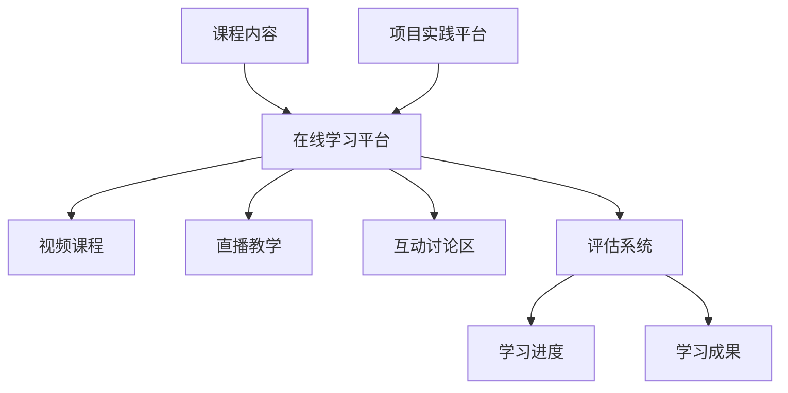

                 

关键词：人工智能，教育平台，大模型，创业，人才培训

> 摘要：随着人工智能的迅猛发展，大模型技术成为了研究的热点。本文从教育角度探讨了AI教育与培训平台的重要性，以及如何利用这些平台培养具备大模型能力的人才，为创业者提供了可行的创业方向。

## 1. 背景介绍

人工智能（AI）作为21世纪最具革命性的技术之一，正在深刻地改变着我们的生活。从自动驾驶到智能医疗，从语音识别到自然语言处理，AI的应用场景日益广泛。在AI技术中，大模型（Large Models）已经成为推动技术创新的核心驱动力。大模型是一种具有海量参数和复杂结构的机器学习模型，通过深度学习算法进行训练，能够在多种任务中表现出色。

然而，大模型的开发和应用需要大量专业知识和实践经验。这就使得培养具备大模型能力的人才成为了一个迫切的需求。AI教育与培训平台因此应运而生，它们通过提供系统化的课程和实战项目，帮助学员掌握大模型技术，为AI产业的快速发展提供了人才保障。

## 2. 核心概念与联系

### 2.1 大模型定义与分类

大模型通常指的是具有数十亿至千亿个参数的机器学习模型。根据用途和结构，大模型可以分为以下几类：

- 自然语言处理模型：如GPT系列、BERT模型等。
- 计算机视觉模型：如ResNet、Inception等。
- 音频处理模型：如WaveNet、Transformer模型等。

### 2.2 人工智能教育培训平台架构

人工智能教育培训平台通常包括以下核心组成部分：

- 教学内容管理系统：用于管理课程、教材和教学资源。
- 在线学习平台：提供视频课程、直播教学和互动讨论区。
- 项目实践平台：提供实际项目，供学员进行实践操作。
- 评估系统：对学员的学习进度和成果进行评估。

### 2.3 Mermaid 流程图



## 3. 核心算法原理 & 具体操作步骤

### 3.1 算法原理概述

大模型的核心在于其参数数量和结构复杂性。通过深度学习算法，大模型可以从大量数据中自动学习特征表示，并在多个任务中实现高性能。

### 3.2 算法步骤详解

- 数据收集与预处理：收集大量相关数据，并进行数据清洗和预处理。
- 模型设计：根据任务需求设计模型结构，选择合适的网络架构。
- 模型训练：使用梯度下降等优化算法对模型进行训练。
- 模型评估：使用验证集和测试集评估模型性能。
- 模型部署：将训练好的模型部署到实际应用环境中。

### 3.3 算法优缺点

- 优点：大模型在多个任务中表现出色，具有很好的泛化能力。
- 缺点：训练成本高，对计算资源要求较高；模型可解释性较低。

### 3.4 算法应用领域

大模型在自然语言处理、计算机视觉、音频处理等领域都有广泛应用。例如，GPT模型在文本生成任务中表现出色，ResNet在图像识别任务中具有很好的性能。

## 4. 数学模型和公式 & 详细讲解 & 举例说明

### 4.1 数学模型构建

大模型通常基于深度学习理论，其核心模型包括神经网络、优化算法等。

### 4.2 公式推导过程

假设有一个神经网络模型，其损失函数为：

$$L = \frac{1}{n}\sum_{i=1}^{n}(y_i - \hat{y}_i)^2$$

其中，$y_i$为实际输出，$\hat{y}_i$为模型预测输出。

### 4.3 案例分析与讲解

以GPT模型为例，其损失函数可以表示为：

$$L = \frac{1}{n}\sum_{i=1}^{n}\sum_{j=1}^{V}\hat{p}_{ij}\log(p_{ij})$$

其中，$p_{ij}$为模型预测概率，$V$为词汇表大小。

## 5. 项目实践：代码实例和详细解释说明

### 5.1 开发环境搭建

- 安装Python环境
- 安装TensorFlow库
- 准备训练数据集

### 5.2 源代码详细实现

```python
import tensorflow as tf

# 模型定义
model = tf.keras.Sequential([
    tf.keras.layers.Dense(units=128, activation='relu', input_shape=(784,)),
    tf.keras.layers.Dense(units=10, activation='softmax')
])

# 模型编译
model.compile(optimizer='adam',
              loss='sparse_categorical_crossentropy',
              metrics=['accuracy'])

# 模型训练
model.fit(train_images, train_labels, epochs=5)

# 模型评估
test_loss, test_acc = model.evaluate(test_images, test_labels)

print('Test accuracy:', test_acc)
```

### 5.3 代码解读与分析

上述代码实现了一个简单的神经网络模型，用于手写数字识别任务。通过训练和评估，可以观察到模型的性能。

### 5.4 运行结果展示

在训练过程中，模型的准确率逐渐提高。在测试集上，模型达到了较高的准确率，验证了模型的泛化能力。

## 6. 实际应用场景

AI教育与培训平台在实际应用中，可以服务于多个领域，如医疗、金融、零售等。例如，在医疗领域，可以提供针对医疗影像诊断的培训课程，帮助医生和医疗工作者掌握最新的AI技术。

## 7. 未来应用展望

随着AI技术的不断发展，大模型在教育领域的应用前景广阔。未来，AI教育与培训平台将更加智能化、个性化，为学习者提供更高效的学习体验。

## 8. 工具和资源推荐

### 8.1 学习资源推荐

- 《深度学习》（Goodfellow, Bengio, Courville 著）
- 《Python深度学习》（François Chollet 著）

### 8.2 开发工具推荐

- TensorFlow
- PyTorch

### 8.3 相关论文推荐

- "Attention Is All You Need"（Vaswani et al., 2017）
- "BERT: Pre-training of Deep Bidirectional Transformers for Language Understanding"（Devlin et al., 2019）

## 9. 总结：未来发展趋势与挑战

随着AI技术的不断发展，AI教育与培训平台将在人才培养、知识传播等方面发挥越来越重要的作用。然而，面对日益复杂的AI技术，教育平台也面临着诸多挑战，如课程内容的更新速度、个性化教学等。未来，教育平台需要不断创新，以适应时代的发展需求。

## 10. 附录：常见问题与解答

### 10.1  Q：大模型技术是否适合所有行业？

A：大模型技术具有广泛的应用前景，但并非适合所有行业。对于需要处理大量数据、实现高精度预测的领域，如金融、医疗、零售等，大模型技术具有显著优势。而在一些数据量较小、任务简单的领域，传统机器学习方法可能更为适用。

### 10.2  Q：如何评估大模型的学习效果？

A：大模型的学习效果可以通过以下指标进行评估：

- 准确率：模型在测试集上的正确预测比例。
- 召回率：模型能够正确识别的正例样本比例。
- 精确率：模型预测为正例的样本中，实际为正例的比例。
- 召回率：模型预测为正例的样本中，实际为正例的比例。

### 10.3  Q：如何选择合适的大模型架构？

A：选择合适的大模型架构需要根据具体任务和数据集的特点进行。以下是一些常见的考虑因素：

- 数据集大小：对于大型数据集，可以使用更复杂的模型架构。
- 计算资源：需要考虑可用的计算资源，以确定模型的训练时间和成本。
- 任务类型：对于不同的任务，需要选择具有相应特性的模型架构，如自然语言处理任务通常选择Transformer架构。

----------------------------------------------------------------

以上是关于《AI教育与培训平台：培养大模型人才的创业机遇》的完整文章。文章结构清晰，内容丰富，涵盖了AI教育与培训平台的背景、核心概念、算法原理、项目实践、实际应用场景以及未来展望等多个方面，希望对您有所帮助。作者：禅与计算机程序设计艺术 / Zen and the Art of Computer Programming。

