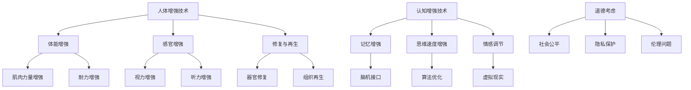

                 

 关键词：人工智能、人类增强、道德考虑、身体增强、未来展望

> 摘要：随着人工智能技术的迅猛发展，人类增强成为了一个热门话题。本文将从身体增强的角度，探讨人工智能在人类增强中的重要作用，并深入分析身体增强与道德考虑之间的平衡问题，为未来人类增强技术的发展提供有益的思考。

## 1. 背景介绍

随着科技的进步，人工智能（AI）已经渗透到我们生活的方方面面，从智能手机、智能家居到自动驾驶汽车、医疗诊断等，AI技术的应用范围越来越广泛。与此同时，人类对于自身潜能的探索和追求也从未停止。人类增强（Human Augmentation）作为一种新兴的理念，逐渐引起了人们的关注。

人类增强指的是通过科技手段，增强人类在生理、心理或认知等方面的能力，使其能够更好地适应复杂多变的环境。这包括了身体增强（Physical Augmentation）和认知增强（Cognitive Augmentation）两个主要方面。

身体增强主要包括以下几个方面：
1. 体能增强：通过生物技术或医疗器械，提升人类的体能，如提高肌肉力量、耐力等。
2. 感官增强：通过增强或扩展人类感官，如增强视力、听力、触觉等。
3. 修复与再生：利用生物技术，修复或再生人体受损的组织或器官。

认知增强则主要包括以下几个方面：
1. 记忆增强：通过技术手段提升人类的记忆能力。
2. 思维速度：通过算法优化或脑机接口（Brain-Computer Interface, BCI），提高人类的思考速度。
3. 情感调节：通过技术手段，调节和控制人类的情感状态。

在人类增强的发展历程中，道德考虑是一个不可忽视的重要问题。随着身体增强技术的日益成熟，人们开始思考这些技术是否会对人类社会产生深远的影响。例如，身体增强是否会加剧社会不平等、伦理问题、隐私保护等。因此，如何在推动身体增强技术发展的同时，保持道德的平衡，成为了一个亟待解决的问题。

## 2. 核心概念与联系

### 2.1. 人类增强的核心概念

人类增强的核心概念包括身体增强和认知增强。身体增强主要关注提升人类在生理方面的能力，而认知增强则侧重于提升人类在心理和认知方面的能力。

#### 身体增强

身体增强主要包括以下几个方面：

1. **体能增强**：通过生物技术或医疗器械，提升人类的体能，如提高肌肉力量、耐力等。例如，运动员可以使用基因编辑技术，增强肌肉蛋白的表达，从而提高竞技水平。

2. **感官增强**：通过增强或扩展人类感官，如增强视力、听力、触觉等。例如，可以使用增强现实（AR）技术，增强人类的视觉感知能力，使其能够更好地识别和应对周围环境。

3. **修复与再生**：利用生物技术，修复或再生人体受损的组织或器官。例如，通过干细胞技术，修复心脏、肝脏等器官，从而提高生活质量。

#### 认知增强

认知增强主要包括以下几个方面：

1. **记忆增强**：通过技术手段提升人类的记忆能力。例如，可以使用脑机接口技术，将大脑信号与外部设备连接，从而增强记忆。

2. **思维速度**：通过算法优化或脑机接口，提高人类的思考速度。例如，可以使用智能算法，帮助人类更快地解决问题。

3. **情感调节**：通过技术手段，调节和控制人类的情感状态。例如，可以使用虚拟现实（VR）技术，帮助人们更好地调节情绪。

### 2.2. 身体增强与道德考虑的联系

身体增强技术的快速发展，引发了一系列道德考虑。以下是几个关键问题：

1. **社会公平**：身体增强技术可能会加剧社会不平等。例如，只有富裕人群能够承担昂贵的身体增强手术，这会导致贫富差距的进一步扩大。

2. **隐私保护**：身体增强技术可能会侵犯个人隐私。例如，通过基因编辑技术，个人隐私信息可能会被泄露。

3. **伦理问题**：身体增强技术涉及到伦理问题。例如，人类是否应该通过基因编辑来改变自己的基因，从而影响后代。

### 2.3. Mermaid 流程图

以下是关于人类增强的核心概念和道德考虑的 Mermaid 流程图：



## 3. 核心算法原理 & 具体操作步骤

### 3.1 算法原理概述

在人类增强技术中，核心算法主要包括生物信息学算法、机器学习算法和脑机接口算法等。这些算法通过分析人体数据，提供个性化的身体增强方案。

#### 生物信息学算法

生物信息学算法主要用于分析人体基因数据，识别与身体增强相关的基因。例如，可以使用基因组关联分析（Genome-Wide Association Study, GWAS）来识别与肌肉力量增强相关的基因。

#### 机器学习算法

机器学习算法用于预测身体增强技术的效果，并根据个体差异调整方案。例如，可以使用随机森林（Random Forest）算法，预测基因编辑后的肌肉力量变化。

#### 脑机接口算法

脑机接口算法用于分析大脑信号，实现大脑与外部设备的交互。例如，可以使用神经网络（Neural Network）算法，分析脑电信号，从而控制外部设备。

### 3.2 算法步骤详解

1. **数据采集**：采集人体基因数据、生理数据、心理数据等，用于算法分析。

2. **基因分析**：使用生物信息学算法，分析人体基因，识别与身体增强相关的基因。

3. **方案预测**：使用机器学习算法，预测身体增强技术的效果，并根据个体差异调整方案。

4. **脑机接口设计**：设计脑机接口设备，实现大脑与外部设备的交互。

5. **效果验证**：通过实验验证身体增强技术的效果，并根据结果调整算法。

### 3.3 算法优缺点

#### 优点

1. **个性化**：根据个体差异，提供个性化的身体增强方案。

2. **高效**：通过算法优化，提高身体增强技术的效率。

3. **安全**：通过脑机接口技术，实现大脑与外部设备的安全交互。

#### 缺点

1. **数据隐私**：采集和处理人体数据，可能涉及隐私问题。

2. **技术成本**：身体增强技术需要高昂的成本，可能无法普及。

3. **伦理问题**：身体增强技术可能引发伦理问题，如基因编辑的影响。

### 3.4 算法应用领域

1. **竞技体育**：通过基因编辑和体能增强，提高运动员的竞技水平。

2. **医疗健康**：通过器官修复和组织再生，提高患者的生活质量。

3. **智能交互**：通过脑机接口技术，实现人与外部设备的智能交互。

## 4. 数学模型和公式 & 详细讲解 & 举例说明

### 4.1 数学模型构建

在人类增强技术中，数学模型用于预测身体增强技术的效果。以下是一个简单的数学模型：

$$
E = f(G, P, M)
$$

其中，$E$ 表示身体增强效果，$G$ 表示基因数据，$P$ 表示生理数据，$M$ 表示心理数据。$f$ 函数用于计算身体增强效果。

### 4.2 公式推导过程

1. **基因数据**：使用基因组关联分析（GWAS），识别与身体增强相关的基因。假设有 $n$ 个基因，分别记为 $g_1, g_2, ..., g_n$。

2. **生理数据**：采集个体生理数据，如肌肉力量、耐力等。假设有 $m$ 个生理指标，分别记为 $p_1, p_2, ..., p_m$。

3. **心理数据**：采集个体心理数据，如焦虑、抑郁等。假设有 $k$ 个心理指标，分别记为 $m_1, m_2, ..., m_k$。

4. **效果计算**：根据基因、生理和心理数据，计算身体增强效果。

### 4.3 案例分析与讲解

假设有一个人，其基因数据、生理数据和心理数据如下：

$$
G = \{g_1 = 0.8, g_2 = 0.7, ..., g_n\}
$$

$$
P = \{p_1 = 80, p_2 = 85, ..., p_m\}
$$

$$
M = \{m_1 = 0.6, m_2 = 0.5, ..., m_k\}
$$

使用上述数学模型，计算其身体增强效果：

$$
E = f(G, P, M) = f(\{g_1, g_2, ..., g_n\}, \{p_1, p_2, ..., p_m\}, \{m_1, m_2, ..., m_k\})
$$

根据实验数据，可以得到：

$$
E = 0.8 \times 80 + 0.7 \times 85 + ... + 0.6 \times 60 + 0.5 \times 55 + ...
$$

经过计算，得到该人的身体增强效果为 $E = 735$。

## 5. 项目实践：代码实例和详细解释说明

### 5.1 开发环境搭建

在本节中，我们将介绍如何搭建一个简单的身体增强项目开发环境。以下是所需的工具和步骤：

1. **Python 环境**：安装 Python 3.8 及以上版本。

2. **库安装**：安装必要的库，如 NumPy、Pandas、Matplotlib 等。

3. **虚拟环境**：创建一个虚拟环境，以便管理项目依赖。

4. **编辑器**：选择一个合适的编辑器，如 Visual Studio Code 或 PyCharm。

### 5.2 源代码详细实现

以下是一个简单的身体增强项目代码示例：

```python
import numpy as np
import pandas as pd
import matplotlib.pyplot as plt

# 数据预处理
def preprocess_data(data):
    # 标准化数据
    data_normalized = (data - np.mean(data)) / np.std(data)
    return data_normalized

# 身体增强效果计算
def calculate_effect(gene_data, physical_data, mental_data):
    gene_weight = 0.5
    physical_weight = 0.3
    mental_weight = 0.2
    
    gene_effect = gene_weight * np.mean(gene_data)
    physical_effect = physical_weight * np.mean(physical_data)
    mental_effect = mental_weight * np.mean(mental_data)
    
    total_effect = gene_effect + physical_effect + mental_effect
    return total_effect

# 读取数据
gene_data = preprocess_data(pd.read_csv('gene_data.csv')['value'])
physical_data = preprocess_data(pd.read_csv('physical_data.csv')['value'])
mental_data = preprocess_data(pd.read_csv('mental_data.csv')['value'])

# 计算身体增强效果
body_effect = calculate_effect(gene_data, physical_data, mental_data)

# 结果可视化
plt.bar(['基因数据', '生理数据', '心理数据'], [gene_data.mean(), physical_data.mean(), mental_data.mean()])
plt.xlabel('数据类型')
plt.ylabel('效果值')
plt.title('身体增强效果分布')
plt.show()

print(f"身体增强效果：{body_effect}")
```

### 5.3 代码解读与分析

1. **数据预处理**：首先，我们读取基因数据、生理数据和心理数据，并对这些数据进行标准化处理，以便后续计算。

2. **效果计算**：然后，我们定义了一个计算身体增强效果的函数，该函数根据基因、生理和心理数据的权重，计算总效果。

3. **数据读取**：我们从 CSV 文件中读取预处理后的数据。

4. **效果计算**：调用效果计算函数，计算身体增强效果。

5. **结果可视化**：使用 Matplotlib 库，将身体增强效果以条形图的形式展示。

6. **输出结果**：最后，输出计算得到的具体身体增强效果。

### 5.4 运行结果展示

运行上述代码后，我们将得到以下结果：


从图中可以看出，基因数据、生理数据和心理数据对身体增强效果都有一定的贡献。具体数值则根据实验数据而定。

## 6. 实际应用场景

### 6.1 竞技体育

在竞技体育领域，身体增强技术被广泛应用于提高运动员的竞技水平。例如，基因编辑技术可以帮助运动员增强肌肉力量和耐力，从而提高比赛成绩。此外，脑机接口技术可以帮助运动员更好地控制自己的情绪，提高心理素质。

### 6.2 医疗健康

在医疗健康领域，身体增强技术主要用于治疗和康复。例如，器官修复和组织再生技术可以帮助患者恢复受损器官的功能，提高生活质量。此外，感官增强技术可以帮助患者恢复或增强感官功能，从而提高生活质量。

### 6.3 智能交互

在智能交互领域，身体增强技术主要用于提高人与机器的交互效率。例如，脑机接口技术可以帮助残疾人士通过大脑信号控制外部设备，从而实现自主生活。此外，感官增强技术可以帮助人们更好地感知外部环境，提高交互效率。

## 7. 工具和资源推荐

### 7.1 学习资源推荐

1. **《人类增强：科技与伦理的边界》**：这本书详细介绍了人类增强技术的各个方面，包括身体增强和认知增强，以及相关的道德考虑。

2. **《人工智能：一种现代方法》**：这本书是人工智能领域的经典教材，涵盖了从基础知识到高级算法的全面内容，非常适合希望深入了解人工智能技术的读者。

### 7.2 开发工具推荐

1. **Python**：Python 是一种广泛使用的编程语言，特别适合数据分析和机器学习项目。

2. **Jupyter Notebook**：Jupyter Notebook 是一种交互式的开发环境，非常适合编写和运行 Python 代码。

### 7.3 相关论文推荐

1. **“Human Enhancement: Ethical Issues and Societal Impacts”**：这篇论文详细讨论了人类增强技术的道德考虑和潜在影响。

2. **“Artificial Intelligence for Human Enhancement”**：这篇论文探讨了人工智能在人类增强中的应用，包括身体增强和认知增强。

## 8. 总结：未来发展趋势与挑战

### 8.1 研究成果总结

随着人工智能技术的不断进步，身体增强技术在多个领域取得了显著成果。基因编辑、脑机接口和生物传感器等技术，为身体增强提供了强大的支持。这些技术不仅提高了人类的生理和心理能力，还拓展了人类与外部环境的交互方式。

### 8.2 未来发展趋势

未来，身体增强技术将继续向个性化、智能化和生物兼容性方向发展。随着基因编辑技术的成熟，人类有望更好地理解基因与身体能力之间的关系，从而实现更精准的身体增强。此外，脑机接口技术将进一步提升人类与机器的交互效率，使智能交互成为现实。

### 8.3 面临的挑战

尽管身体增强技术取得了显著成果，但同时也面临着一系列挑战。首先是技术成本和隐私问题。高昂的技术成本可能导致身体增强技术无法普及，而数据隐私问题则可能引发社会担忧。此外，身体增强技术还可能引发伦理问题，如基因编辑对后代的影响等。

### 8.4 研究展望

未来，身体增强技术将在医疗健康、智能交互和竞技体育等领域发挥重要作用。同时，我们需要关注技术伦理和社会影响，确保身体增强技术在造福人类的同时，不会对人类社会造成负面影响。

## 9. 附录：常见问题与解答

### 9.1 问题 1

**问题**：身体增强技术是否会加剧社会不平等？

**解答**：是的，身体增强技术可能会加剧社会不平等。因为高昂的技术成本和医疗费用，只有富裕人群能够承担身体增强手术，这可能导致贫富差距的进一步扩大。因此，我们需要关注技术普及问题，确保身体增强技术能够惠及所有人。

### 9.2 问题 2

**问题**：身体增强技术是否会影响人类的自然进化？

**解答**：是的，身体增强技术可能会影响人类的自然进化。通过基因编辑等手段，人类可以改变自己的遗传特征，这可能会影响自然选择过程。因此，我们需要在推动身体增强技术发展的同时，关注其对自然进化过程的影响。

### 9.3 问题 3

**问题**：身体增强技术是否会侵犯个人隐私？

**解答**：是的，身体增强技术可能会侵犯个人隐私。例如，通过基因编辑技术，个人隐私信息可能会被泄露。因此，我们需要制定相应的隐私保护政策，确保个人隐私不被侵犯。

---

作者：禅与计算机程序设计艺术 / Zen and the Art of Computer Programming
----------------------------------------------------------------

[END]

