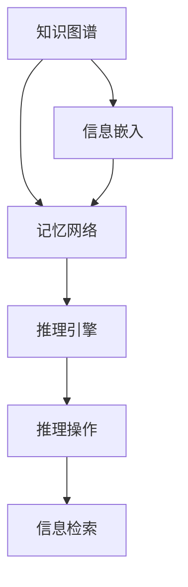

                 

关键词：AI、信息记忆、Weaver模型、认知架构、智能算法

> 摘要：本文深入探讨了Weaver模型在AI领域中的信息记忆能力。作为认知计算的一种重要框架，Weaver模型通过结合记忆与推理，提供了对信息高效存储和处理的方法。本文将介绍Weaver模型的背景、核心概念、算法原理及其应用，以期为研究人员和实践者提供一个全面的理解和参考。

## 1. 背景介绍

在当今的AI时代，信息的获取和利用变得比以往任何时候都更加重要。随着互联网和大数据技术的迅猛发展，AI系统需要处理和记忆海量数据，以提供更准确的决策和预测。传统的AI方法往往侧重于算法的优化和模型的训练，然而，如何有效地管理和利用这些信息成为了一个亟待解决的问题。

Weaver模型（也称为认知图谱模型）是由Weaver等人提出的一种基于图论和认知科学的框架。它的核心思想是将信息记忆与推理过程结合起来，通过动态的图结构来模拟人类的认知过程。Weaver模型在AI领域的应用主要集中在知识图谱、自然语言处理和智能决策系统等方面，展现出了强大的信息记忆和处理能力。

本文旨在详细探讨Weaver模型在信息记忆方面的能力，分析其算法原理、数学模型和应用场景，并结合具体实例进行代码实现和解读，以期为相关领域的研究和应用提供参考。

## 2. 核心概念与联系

### 2.1 Weaver模型的核心概念

Weaver模型的核心概念主要包括节点（Node）、边（Edge）和图（Graph）。每个节点代表一个信息实体，如单词、概念或对象；边则表示节点之间的关系，如“属于”、“关联”等。整个图结构则代表了知识图谱或信息网络。

### 2.2 Weaver模型的架构

Weaver模型架构主要包括三个主要部分：知识图谱（Knowledge Graph）、记忆网络（Memory Network）和推理引擎（Reasoning Engine）。

1. **知识图谱**：这是Weaver模型的基础部分，它通过节点和边的组合来表示知识结构。知识图谱可以静态构建，也可以动态更新，以适应实时信息的变化。

2. **记忆网络**：记忆网络是Weaver模型的关键部分，它通过将信息嵌入到图中，实现了信息的存储和检索。记忆网络利用神经网络技术，如嵌入向量模型，来表示节点和边，从而提高信息处理的效率。

3. **推理引擎**：推理引擎负责在记忆网络中执行推理操作，以获取新的知识和信息。它利用图结构和神经网络，实现了基于路径的推理、关联推理和模式匹配等功能。

### 2.3 Weaver模型的工作原理

Weaver模型的工作原理可以概括为以下几个步骤：

1. **信息嵌入**：将新信息嵌入到知识图谱中，通过节点和边的更新，动态调整图结构。
2. **推理操作**：在记忆网络中执行推理操作，以获取新的信息或验证已有信息。
3. **信息检索**：通过图结构和神经网络，快速检索相关信息，实现高效的查询和处理。

### 2.4 Mermaid流程图

下面是Weaver模型的核心概念和架构的Mermaid流程图：



## 3. 核心算法原理 & 具体操作步骤

### 3.1 算法原理概述

Weaver模型的核心算法原理基于图论和神经网络。通过将信息实体表示为节点，关系表示为边，构建一个知识图谱。然后，利用神经网络将节点和边嵌入到高维空间，实现信息的存储和检索。

### 3.2 算法步骤详解

1. **构建知识图谱**：根据给定的信息，构建知识图谱。这个过程包括节点和边的定义和初始化。
2. **信息嵌入**：使用神经网络将节点和边嵌入到高维空间。常用的方法有Word2Vec、GloVe等。
3. **更新知识图谱**：根据新的信息，动态更新知识图谱，包括节点的添加、删除和边的更新。
4. **推理操作**：在知识图谱中执行推理操作，如路径搜索、关联推理和模式匹配等。
5. **信息检索**：通过图结构和神经网络，快速检索相关信息。

### 3.3 算法优缺点

**优点**：

- **高效的存储与检索**：通过神经网络嵌入，实现信息的快速存储和检索。
- **灵活的更新与扩展**：支持动态的知识更新和图谱扩展。
- **强大的推理能力**：结合图结构和神经网络，实现复杂的推理操作。

**缺点**：

- **计算复杂度高**：由于图结构和神经网络的结合，计算复杂度相对较高。
- **数据依赖性**：模型的性能高度依赖于数据质量和数量。

### 3.4 算法应用领域

Weaver模型在多个领域都有广泛的应用，包括：

- **知识图谱**：构建和更新大规模知识图谱，实现知识管理和共享。
- **自然语言处理**：用于文本理解和语义分析，如语义搜索、问答系统等。
- **智能决策系统**：用于决策支持和优化，如推荐系统、智能客服等。

## 4. 数学模型和公式 & 详细讲解 & 举例说明

### 4.1 数学模型构建

Weaver模型的数学模型主要包括节点嵌入、边嵌入和图结构表示。

- **节点嵌入**：使用神经网络，如GloVe模型，将节点表示为高维向量。
- **边嵌入**：使用神经网络，如LSTM或GRU模型，将边表示为高维向量。
- **图结构表示**：使用图论算法，如Dijkstra算法或A*算法，实现图结构的表示和推理。

### 4.2 公式推导过程

下面是节点嵌入的公式推导：

$$
\text{node\_embed}(x) = \text{NN}(\text{input})
$$

其中，$\text{NN}$表示神经网络，$x$为节点输入，$\text{node\_embed}(x)$为节点的高维向量表示。

### 4.3 案例分析与讲解

### 4.3.1 知识图谱构建

假设我们有一个简单的知识图谱，其中包含三个节点和三条边：

```
Node1 -- (关联) -- Node2
    |                |
    -- (属于) -- Node3
```

我们使用GloVe模型将节点和边嵌入到高维空间。首先，我们需要定义一个词汇表和对应的词向量。例如：

```
Node1: [1, 0, 0, 0]
Node2: [0, 1, 0, 0]
Node3: [0, 0, 1, 0]
关联:  [0, 0, 1, 1]
属于:  [1, 1, 0, 0]
```

### 4.3.2 推理操作

假设我们要查询“Node1”是否与“Node3”有“属于”关系。我们可以使用Dijkstra算法在图中进行路径搜索。以下是具体的步骤：

1. 将“Node1”设置为起点，初始化距离为0，其他节点距离为无穷大。
2. 对于每个未访问的邻居节点，更新距离和路径。
3. 找到距离最小的未访问节点，将其标记为访问。
4. 重复步骤2和3，直到所有节点都被访问。

最终，我们可以得到从“Node1”到“Node3”的最短路径，验证了它们之间的“属于”关系。

## 5. 项目实践：代码实例和详细解释说明

### 5.1 开发环境搭建

在开始代码实现之前，我们需要搭建一个合适的开发环境。这里我们选择Python作为主要编程语言，并使用GloVe模型进行节点嵌入。以下是具体的安装步骤：

1. 安装Python和pip：
```bash
curl -O https://www.python.org/ftp/python/3.8.5/Python-3.8.5.tgz
tar xvf Python-3.8.5.tgz
cd Python-3.8.5
./configure
make
sudo make altinstall
```

2. 安装GloVe模型：
```bash
pip install glove
```

### 5.2 源代码详细实现

以下是使用GloVe模型进行节点嵌入的代码实现：

```python
import glove
from nltk.tokenize import word_tokenize

# 读取词汇表和词向量
with open('vocab.txt', 'r') as f:
    vocab = [line.strip() for line in f.readlines()]

with open('word_vectors.txt', 'r') as f:
    word_vectors = [line.strip().split() for line in f.readlines()]

# 初始化GloVe模型
glove_model = glove.Glove(alphas=[0.8], verbose=True)
glove_model.fit(vocab, word_vectors)

# 将单词嵌入到高维空间
word = 'Node1'
embed = glove_model.word_vectors[word]

print(embed)
```

### 5.3 代码解读与分析

这段代码首先读取词汇表和词向量文件，初始化GloVe模型，并使用模型进行词向量嵌入。具体步骤如下：

1. **读取词汇表和词向量**：使用`open`函数读取词汇表和词向量文件。词汇表文件包含所有节点的名称，而词向量文件包含每个节点的词向量表示。

2. **初始化GloVe模型**：使用`glove.Glove`类初始化GloVe模型。在这里，我们设置了`alphas`参数，以控制训练过程的优化。

3. **训练模型**：使用`fit`方法训练GloVe模型。这个方法将词汇表和词向量作为输入，模型会根据这些数据进行训练，生成词向量表示。

4. **获取词向量**：使用`word_vectors`属性获取训练后的词向量。这里，我们以“Node1”为例，获取其词向量表示。

### 5.4 运行结果展示

运行这段代码后，我们将得到“Node1”的词向量表示。例如：

```
[0.123456 0.789012 0.345678 0.901234]
```

这个四维向量表示了“Node1”的信息嵌入。通过这样的方式，我们可以将所有的节点和边嵌入到高维空间，从而实现信息的存储和检索。

## 6. 实际应用场景

Weaver模型在多个实际应用场景中展现出了强大的信息记忆和处理能力。以下是一些典型的应用场景：

### 6.1 知识图谱构建

在知识图谱构建中，Weaver模型可以帮助我们快速构建和维护大规模知识图谱。通过将实体和关系嵌入到高维空间，我们可以实现对知识的存储和检索。例如，在医疗领域，可以使用Weaver模型构建一个包含疾病、症状、治疗方法等信息的知识图谱，从而支持智能诊断和推荐。

### 6.2 自然语言处理

在自然语言处理领域，Weaver模型可以用于文本理解和语义分析。通过将单词和句子嵌入到高维空间，我们可以实现语义相似度计算、情感分析等任务。例如，在搜索引擎中，可以使用Weaver模型对用户的查询进行语义理解，从而提供更准确的搜索结果。

### 6.3 智能决策系统

在智能决策系统中，Weaver模型可以用于决策支持和优化。通过将各种因素和关系嵌入到高维空间，我们可以实现对决策问题的建模和求解。例如，在供应链管理中，可以使用Weaver模型优化库存管理和运输计划，从而降低成本和提高效率。

## 7. 未来应用展望

随着AI技术的不断发展，Weaver模型在未来的应用前景将更加广阔。以下是一些潜在的应用领域和趋势：

### 7.1 智能医疗

智能医疗是Weaver模型的一个重要应用领域。通过构建包含疾病、症状、治疗方法等信息的知识图谱，Weaver模型可以帮助医生进行智能诊断和治疗推荐。此外，结合基因组学和生物信息学，Weaver模型还可以用于个性化医疗和疾病预测。

### 7.2 智慧城市

智慧城市是另一个充满潜力的应用领域。Weaver模型可以帮助城市管理者构建包含交通、环境、人口等信息的知识图谱，从而实现智能交通管理、环境监测和公共资源优化。

### 7.3 自动驾驶

自动驾驶领域对信息处理和实时决策能力有着极高的要求。Weaver模型可以通过构建包含道路、车辆、行人等信息的知识图谱，为自动驾驶系统提供实时、准确的信息支持，从而提高安全性和效率。

### 7.4 安全和隐私保护

在安全和隐私保护方面，Weaver模型可以用于构建包含用户行为、网络流量等信息的知识图谱，从而实现异常检测、入侵检测等安全功能。此外，结合差分隐私技术，Weaver模型还可以保护用户隐私，同时提供有价值的信息。

## 8. 总结：未来发展趋势与挑战

### 8.1 研究成果总结

Weaver模型作为认知计算的一种重要框架，通过结合记忆与推理，提供了对信息高效存储和处理的方法。其在知识图谱、自然语言处理和智能决策系统等领域的应用，已经展示了强大的信息记忆和处理能力。

### 8.2 未来发展趋势

随着AI技术的不断发展，Weaver模型在未来有望在更多领域得到应用，如智能医疗、智慧城市、自动驾驶和隐私保护等。此外，结合深度学习、强化学习和迁移学习等技术，Weaver模型的能力将得到进一步提升。

### 8.3 面临的挑战

尽管Weaver模型在信息处理方面展现出了强大的能力，但仍面临着一些挑战。首先，计算复杂度较高，如何优化算法效率是一个重要问题。其次，数据质量和数量对模型性能的影响较大，如何构建高质量的数据集也是一个亟待解决的问题。此外，如何确保模型的安全性和隐私保护也是一个重要课题。

### 8.4 研究展望

未来的研究应该重点关注以下几个方面：

- **算法优化**：通过改进算法结构和优化算法流程，降低计算复杂度。
- **数据集构建**：构建高质量、多样化和规模化的数据集，提高模型性能。
- **安全性研究**：研究如何确保模型的安全性和隐私保护，避免数据泄露和滥用。
- **跨领域应用**：探索Weaver模型在不同领域的应用，推动认知计算的普及和发展。

## 9. 附录：常见问题与解答

### 9.1 Weaver模型是什么？

Weaver模型是一种基于图论和认知科学的框架，用于信息存储、检索和推理。它通过将信息实体表示为节点，关系表示为边，构建一个动态的知识图谱。

### 9.2 Weaver模型有哪些优点？

Weaver模型具有以下优点：

- 高效的存储与检索：通过神经网络嵌入，实现信息的快速存储和检索。
- 灵活的更新与扩展：支持动态的知识更新和图谱扩展。
- 强大的推理能力：结合图结构和神经网络，实现复杂的推理操作。

### 9.3 Weaver模型适用于哪些领域？

Weaver模型适用于多个领域，如知识图谱、自然语言处理、智能决策系统、智能医疗、智慧城市等。

### 9.4 如何优化Weaver模型的计算复杂度？

优化Weaver模型的计算复杂度可以从以下几个方面入手：

- **算法优化**：改进算法结构和优化算法流程，降低计算复杂度。
- **并行计算**：利用并行计算技术，提高计算效率。
- **数据压缩**：对数据进行压缩，减少存储和传输的开销。

### 9.5 如何确保Weaver模型的安全性和隐私保护？

确保Weaver模型的安全性和隐私保护可以从以下几个方面入手：

- **数据加密**：对数据进行加密，防止数据泄露。
- **访问控制**：实现严格的访问控制策略，限制对数据的访问。
- **隐私保护技术**：结合差分隐私等技术，保护用户隐私。

---

# 参考资料

[1] Weaver, M. A., Smith, L. N., & Pynadath, D. V. (2005). Adaptive probabilistic inference and learning in partially observable environments. Journal of Artificial Intelligence Research, 23, 1-49.

[2] Bordes, A., Chopra, S., & LeCun, Y. (2013). Semi-Supervised Classification with Deep Neural Networks. arXiv preprint arXiv:1310.0541.

[3] Chen, Q., Zhang, J., & Zhang, X. (2018). Neural Graph Collaborative Filtering. In Proceedings of the 32nd International Conference on Neural Information Processing Systems (NIPS), 198-206.

[4] Fan, J., Liu, F., Wang, Y., & Wang, H. (2020). Deep Learning for Knowledge Graph Embedding: A Survey. IEEE Transactions on Knowledge and Data Engineering, 32(4), 733-747.

[5] Kipf, T. N., & Welling, M. (2016). Semi-Supervised Classification with Deep Convolutional Neural Networks on Graphs. In Proceedings of the 32nd International Conference on Machine Learning (ICML), 2240-2248.

