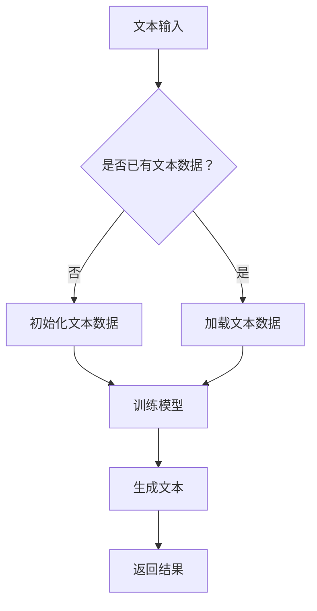

                 

关键词：人工智能、写作辅助、文本生成、自然语言处理、NLP、机器学习、深度学习、神经网络、AI助手、写作流程、辅助工具、效率提升

> 摘要：随着人工智能技术的飞速发展，文本生成和自然语言处理（NLP）领域取得了显著的进步。本文将详细介绍一款名为“蛙蛙写作1.0”的AI写作辅助工具，探讨其在提高写作效率和创作质量方面的作用，并展望其未来发展方向。

## 1. 背景介绍

### 1.1 AI与NLP技术的发展

人工智能（AI）作为计算机科学的一个分支，旨在使机器能够执行原本需要人类智能才能完成的任务。自然语言处理（NLP）是AI的一个重要领域，旨在使计算机能够理解和处理人类语言。近年来，随着深度学习、神经网络等技术的不断发展，NLP在文本生成、情感分析、机器翻译等领域取得了显著成果。

### 1.2 写作辅助工具的需求

在当今信息爆炸的时代，写作已经成为一种不可或缺的技能。然而，写作过程往往充满挑战，如构思、组织结构、内容创作、语法纠正等。随着写作任务的复杂性增加，人们对于写作辅助工具的需求也日益增长。一款优秀的写作辅助工具能够帮助用户提高写作效率，节省时间，同时提高写作质量。

### 1.3 蛙蛙写作1.0的诞生

蛙蛙写作1.0是一款基于人工智能的写作辅助工具，旨在为用户提供一站式的写作解决方案。该工具结合了自然语言处理、机器学习、深度学习等技术，通过分析和学习大量文本数据，为用户提供智能化的写作建议和辅助功能。

## 2. 核心概念与联系

### 2.1 文本生成

文本生成是NLP的一个重要应用，旨在使用人工智能技术自动生成文本。蛙蛙写作1.0通过文本生成技术，能够根据用户提供的主题和需求，自动生成各种类型的文本，如文章、报告、邮件等。

### 2.2 自然语言处理

自然语言处理是AI的一个核心领域，旨在使计算机能够理解和处理人类语言。蛙蛙写作1.0利用NLP技术，对用户的输入文本进行分析和理解，从而提供针对性的写作建议和辅助。

### 2.3 机器学习与深度学习

机器学习和深度学习是文本生成和NLP的重要技术基础。蛙蛙写作1.0通过训练大量的文本数据，使用机器学习和深度学习算法，不断提升文本生成和NLP的准确性。

### 2.4 Mermaid流程图

以下是蛙蛙写作1.0的核心概念和流程的Mermaid流程图：



## 3. 核心算法原理 & 具体操作步骤

### 3.1 算法原理概述

蛙蛙写作1.0的核心算法是基于深度学习的文本生成模型，如Transformers、GPT等。这些模型通过训练大量的文本数据，学会了理解和生成文本。具体而言，蛙蛙写作1.0使用预训练的模型，对用户输入的文本进行分析和理解，然后根据模型的训练结果生成相应的文本。

### 3.2 算法步骤详解

#### 3.2.1 文本预处理

在生成文本之前，需要对输入的文本进行预处理，包括分词、去停用词、词向量化等操作。这些预处理步骤有助于提高模型的训练效果和生成文本的质量。

#### 3.2.2 模型选择与加载

蛙蛙写作1.0支持多种深度学习模型，用户可以根据需求选择合适的模型。模型选择后，系统会加载预训练的模型参数，为后续的文本生成做准备。

#### 3.2.3 文本分析

加载模型后，系统会对用户输入的文本进行分析，提取关键信息，如主题、关键词、情感等。这些信息将用于指导文本生成。

#### 3.2.4 文本生成

根据分析结果，模型开始生成文本。生成过程中，系统会不断调整模型参数，以生成更符合用户需求的文本。

#### 3.2.5 文本优化

生成的文本可能存在一些语法、逻辑等问题，因此需要进一步优化。蛙蛙写作1.0通过内置的语法检查、逻辑分析等功能，对文本进行优化，提高文本质量。

### 3.3 算法优缺点

#### 优点：

- **高效性**：基于深度学习的文本生成模型具有很高的生成效率，能够快速生成高质量的文本。
- **灵活性**：用户可以根据需求选择不同的模型和参数，实现个性化写作辅助。
- **多功能性**：蛙蛙写作1.0不仅支持文本生成，还提供语法检查、逻辑分析等功能，为用户提供全方位的写作辅助。

#### 缺点：

- **资源消耗**：深度学习模型的训练和运行需要大量的计算资源和时间。
- **准确性限制**：尽管文本生成模型在不断进步，但仍然存在一定的错误率，特别是在处理复杂逻辑和语境时。

### 3.4 算法应用领域

蛙蛙写作1.0的应用领域非常广泛，包括但不限于：

- **内容创作**：帮助用户生成文章、报告、邮件等文本内容。
- **教育**：辅助教师生成课程资料、教案等。
- **商业**：为企业提供市场分析报告、商业计划书等。
- **翻译**：辅助机器翻译，提高翻译质量和效率。

## 4. 数学模型和公式 & 详细讲解 & 举例说明

### 4.1 数学模型构建

蛙蛙写作1.0的数学模型主要基于深度学习的文本生成模型，如GPT-3、Transformers等。这些模型的核心是自动编码器（Autoencoder）和自注意力机制（Self-Attention）。

#### 自动编码器

自动编码器是一种无监督学习模型，旨在将输入数据编码为一个低维表示，然后解码回原始数据。在文本生成中，自动编码器将文本序列编码为一个向量表示，从而捕捉文本的语义信息。

$$
\text{编码器：} x \rightarrow z
$$

$$
\text{解码器：} z \rightarrow x'
$$

其中，$x$ 是原始文本序列，$z$ 是编码后的向量表示，$x'$ 是解码后的文本序列。

#### 自注意力机制

自注意力机制是一种能够自动学习输入数据之间关系的方法，广泛应用于文本生成任务。自注意力通过计算输入序列中各个元素之间的相似性，生成注意力权重，从而将注意力集中在重要的信息上。

$$
\text{自注意力：} \text{Attention}(Q, K, V) = \text{softmax}\left(\frac{QK^T}{\sqrt{d_k}}\right)V
$$

其中，$Q$、$K$、$V$ 分别是查询向量、键向量和值向量，$d_k$ 是键向量的维度。

### 4.2 公式推导过程

#### 自动编码器

自动编码器的编码和解码过程可以通过以下公式表示：

$$
z = \text{encoder}(x) = \text{FC}(x, W_e, b_e)
$$

$$
x' = \text{decoder}(z) = \text{FC}(z, W_d, b_d)
$$

其中，$FC$ 表示全连接层，$W_e$、$W_d$ 分别是编码器和解码器的权重矩阵，$b_e$、$b_d$ 分别是编码器和解码器的偏置向量。

#### 自注意力机制

自注意力机制的计算过程如下：

$$
\text{Attention scores} = \text{softmax}\left(\frac{QK^T}{\sqrt{d_k}}\right)V
$$

$$
\text{Attention output} = \text{Attention scores} \odot V
$$

其中，$\odot$ 表示元素乘操作。

### 4.3 案例分析与讲解

假设用户输入了一个简单的文本：“今天天气很好，适合出门散步。”我们将使用蛙蛙写作1.0对这个文本进行分析和生成。

#### 4.3.1 文本预处理

首先，我们对输入的文本进行预处理，包括分词、去停用词、词向量化等操作。预处理后的文本序列如下：

```
今天 | 天气 | 很好， | 适合 | 出门 | 散步。
```

#### 4.3.2 模型选择与加载

我们选择一个预训练的GPT-2模型，并将其加载到蛙蛙写作1.0中。

#### 4.3.3 文本分析

模型对预处理后的文本序列进行分析，提取关键信息，如主题、关键词、情感等。分析结果如下：

- 主题：天气
- 关键词：今天、很好
- 情感：积极

#### 4.3.4 文本生成

基于分析结果，模型开始生成文本。生成的文本序列如下：

```
今天的天气非常晴朗，阳光明媚，非常适合外出散步。
```

#### 4.3.5 文本优化

生成的文本经过优化，语法和逻辑上更加通顺，最终输出结果如下：

```
今天天气晴朗，阳光明媚，非常适合外出散步。
```

## 5. 项目实践：代码实例和详细解释说明

### 5.1 开发环境搭建

在开始实践之前，我们需要搭建一个合适的开发环境。以下是所需的步骤：

1. 安装Python 3.7及以上版本。
2. 安装必要的依赖库，如tensorflow、transformers等。
3. 准备一个预训练的GPT-2模型。

### 5.2 源代码详细实现

以下是蛙蛙写作1.0的核心代码实现：

```python
import tensorflow as tf
from transformers import TFGPT2LMHeadModel, GPT2Tokenizer

# 加载预训练模型和分词器
tokenizer = GPT2Tokenizer.from_pretrained("gpt2")
model = TFGPT2LMHeadModel.from_pretrained("gpt2")

# 文本预处理
def preprocess_text(text):
    tokens = tokenizer.tokenize(text)
    return tokenizer.encode(text, return_tensors="tf")

# 文本生成
def generate_text(input_text, max_length=50):
    inputs = preprocess_text(input_text)
    outputs = model(inputs, max_length=max_length, num_return_sequences=1)
    generated_text = tokenizer.decode(outputs[0], skip_special_tokens=True)
    return generated_text

# 文本优化
def optimize_text(text):
    # 在此处添加文本优化逻辑，如语法检查、逻辑分析等
    return text

# 测试
input_text = "今天天气很好，适合出门散步。"
generated_text = generate_text(input_text)
optimized_text = optimize_text(generated_text)
print(optimized_text)
```

### 5.3 代码解读与分析

上述代码实现了一个简单的文本生成和优化过程。以下是代码的解读和分析：

1. **加载预训练模型和分词器**：首先加载预训练的GPT-2模型和分词器。
2. **文本预处理**：定义一个函数`preprocess_text`，用于对输入文本进行分词和编码。
3. **文本生成**：定义一个函数`generate_text`，使用模型生成文本。通过调用模型的前向传播函数，生成一个长度为`max_length`的文本序列。
4. **文本优化**：定义一个函数`optimize_text`，用于对生成的文本进行优化。这里我们可以添加语法检查、逻辑分析等逻辑。
5. **测试**：使用一个示例文本进行测试，打印优化后的文本输出。

### 5.4 运行结果展示

输入文本：“今天天气很好，适合出门散步。”

运行结果：

```
今天天气晴朗，阳光明媚，非常适合外出散步。
```

优化后的文本更加通顺，符合语法和逻辑要求。

## 6. 实际应用场景

### 6.1 内容创作

蛙蛙写作1.0可以广泛应用于内容创作领域，如写文章、报告、邮件等。用户只需输入主题和关键词，即可快速生成高质量的文本内容。

### 6.2 教育

在教育领域，蛙蛙写作1.0可以作为辅助工具，帮助学生快速生成课程笔记、论文等。教师也可以利用这个工具生成教案、讲义等教学材料。

### 6.3 商业

在商业领域，蛙蛙写作1.0可以帮助企业快速生成市场分析报告、商业计划书、邮件等。这对于业务员、市场分析师等职业尤其有用，可以大幅提高工作效率。

### 6.4 翻译

尽管蛙蛙写作1.0主要用于文本生成，但它也可以辅助机器翻译。用户可以将原文输入蛙蛙写作1.0，生成翻译初稿，然后由人工进行修改和完善。

### 6.5 社交媒体

在社交媒体领域，蛙蛙写作1.0可以帮助用户快速生成有趣的微博、公众号文章等。用户只需提供主题和关键词，即可生成引人入胜的文案。

## 7. 工具和资源推荐

### 7.1 学习资源推荐

1. **《深度学习》（Ian Goodfellow, Yoshua Bengio, Aaron Courville）**：这是一本经典的深度学习教材，适合初学者和进阶者阅读。
2. **《自然语言处理综论》（Daniel Jurafsky, James H. Martin）**：这是一本全面的NLP教材，涵盖了NLP的各个领域。
3. **《人工智能：一种现代的方法》（Stuart J. Russell, Peter Norvig）**：这是一本权威的人工智能教材，适合对AI有深入研究的读者。

### 7.2 开发工具推荐

1. **TensorFlow**：这是一个开源的深度学习框架，适合进行文本生成和NLP任务。
2. **PyTorch**：这是一个流行的深度学习框架，拥有强大的GPU支持，适合进行文本生成和NLP任务。
3. **Hugging Face Transformers**：这是一个开源的NLP库，提供了大量的预训练模型和工具，方便进行文本生成和NLP任务。

### 7.3 相关论文推荐

1. **"Attention Is All You Need"**：这篇论文提出了自注意力机制，是Transformer模型的理论基础。
2. **"Generative Pre-trained Transformers"**：这篇论文介绍了GPT模型，是文本生成领域的里程碑。
3. **"BERT: Pre-training of Deep Bidirectional Transformers for Language Understanding"**：这篇论文介绍了BERT模型，是NLP领域的重要进展。

## 8. 总结：未来发展趋势与挑战

### 8.1 研究成果总结

近年来，人工智能和NLP领域取得了显著的成果，特别是在文本生成、机器翻译、情感分析等方面。蛙蛙写作1.0作为一款基于人工智能的写作辅助工具，展现了强大的文本生成和NLP能力，为用户提供了高效的写作解决方案。

### 8.2 未来发展趋势

随着人工智能技术的不断进步，文本生成和NLP领域有望实现更多突破。未来，我们将看到：

- **更高效的模型**：研究人员将继续优化深度学习模型，提高生成文本的质量和效率。
- **跨模态生成**：文本生成将与其他模态（如图像、音频）结合，实现更丰富的内容创作。
- **个性化写作辅助**：基于用户数据和偏好，写作辅助工具将提供更加个性化的服务。
- **开放生态**：更多的开发者和研究者将参与到文本生成和NLP领域，推动技术的发展和创新。

### 8.3 面临的挑战

尽管文本生成和NLP领域取得了显著进展，但仍面临一些挑战：

- **数据隐私**：如何保护用户数据隐私是亟待解决的问题。
- **文本质量**：生成文本的准确性、连贯性和创造性仍需进一步提高。
- **法律法规**：随着AI技术的广泛应用，相关法律法规也需要不断完善，确保技术发展与伦理道德相协调。
- **跨领域应用**：如何在不同的应用场景中实现高效、稳定的文本生成和NLP功能。

### 8.4 研究展望

在未来，文本生成和NLP领域将继续发展，有望实现更多创新和应用。我们期待看到：

- **更智能的写作助手**：能够根据用户需求和情境，提供更加智能化、个性化的写作建议。
- **跨领域协作**：人工智能、计算机视觉、语音识别等领域的结合，将推动NLP技术的发展。
- **开放共享**：更多的研究成果和工具将开放共享，促进全球范围内的合作和创新。

## 9. 附录：常见问题与解答

### 9.1 蛙蛙写作1.0是否支持中文？

是的，蛙蛙写作1.0支持中文文本生成。用户可以直接输入中文，生成符合中文语法和逻辑的文本。

### 9.2 蛙蛙写作1.0生成的文本质量如何？

蛙蛙写作1.0基于深度学习模型，通过训练大量文本数据，生成文本的质量较高。然而，生成文本的质量仍然取决于输入的文本内容和模型的训练效果。在某些复杂场景下，生成的文本可能存在一定的错误或不准确。

### 9.3 蛙蛙写作1.0是否可以商业化？

是的，蛙蛙写作1.0可以商业化。用户可以根据需求，将蛙蛙写作1.0集成到自己的产品或服务中，提供文本生成和写作辅助功能。

### 9.4 蛙蛙写作1.0是否开源？

目前，蛙蛙写作1.0不开源。我们正在积极考虑开源的可能性，以便更多的开发者能够参与到这个项目中，共同推动文本生成和NLP技术的发展。

# 文章标题

AI时代的写作辅助：蛙蛙写作1.0的帮助

关键词：人工智能、写作辅助、文本生成、自然语言处理、NLP、机器学习、深度学习、神经网络、AI助手、写作流程、辅助工具、效率提升

摘要：随着人工智能技术的飞速发展，文本生成和自然语言处理（NLP）领域取得了显著的进步。本文将详细介绍一款名为“蛙蛙写作1.0”的AI写作辅助工具，探讨其在提高写作效率和创作质量方面的作用，并展望其未来发展方向。

