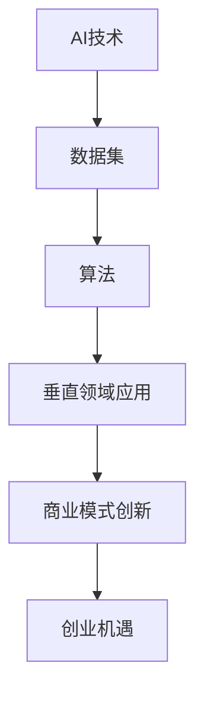

                 

关键词：AI创业、垂直领域、技术落地、商业模式创新、未来展望

> 摘要：本文将探讨AI时代的创业机遇，特别是在垂直领域中的发展潜力。通过分析当前市场趋势、技术突破以及商业模式创新，我们将揭示如何把握AI带来的机遇，并展望未来的发展趋势与挑战。

## 1. 背景介绍

在过去的几年中，人工智能（AI）技术取得了显著的进展，从深度学习到自然语言处理，再到计算机视觉，AI的应用已经渗透到各个行业。然而，大多数初创公司依然倾向于选择通用技术领域，如智能家居、在线教育等，而不是垂直领域的深度挖掘。这导致市场竞争激烈，同质化严重，创业成功率相对较低。

本文将探讨垂直领域在AI时代的创业机遇，通过分析市场趋势、技术突破和商业模式创新，为创业者提供指导，帮助他们抓住AI带来的机遇，实现商业成功。

## 2. 核心概念与联系

在探讨AI时代的创业机遇之前，我们需要了解几个核心概念，它们之间的联系如图1所示：



图1：AI时代的核心概念与联系

### 2.1 AI技术

AI技术是指能够模拟人类智能的一系列算法和技术。深度学习、自然语言处理、计算机视觉等都是AI技术的代表性领域。这些技术在数据集的支持下，通过不断的学习和优化，能够实现高度自动化的任务。

### 2.2 数据集

数据集是AI算法训练的基础。一个丰富、高质量的数据集可以帮助算法更好地理解任务，提高准确性。在垂直领域，数据集的获取和处理是一个关键问题，创业者需要解决数据隐私、数据质量等问题。

### 2.3 算法

算法是AI技术的核心，它决定了AI系统的工作原理。不同的算法适用于不同的任务，创业者需要根据垂直领域的需求选择合适的算法，并在实际应用中进行优化。

### 2.4 垂直领域应用

垂直领域应用是将AI技术应用于特定行业的解决方案。例如，医疗领域的影像识别、金融领域的风险控制等。垂直领域应用不仅需要强大的技术支持，还需要深入理解行业需求，提供定制化的解决方案。

### 2.5 商业模式创新

商业模式创新是垂直领域AI创业的关键。创业者需要探索新的商业模式，通过提供独特的价值主张，吸引客户，实现盈利。

### 2.6 创业机遇

在AI技术的推动下，垂直领域涌现出大量创业机遇。创业者可以从中发现市场需求，开发创新的解决方案，实现商业成功。

## 3. 核心算法原理 & 具体操作步骤

### 3.1 算法原理概述

在垂直领域AI创业中，常见的核心算法包括深度学习、强化学习等。以下以深度学习为例，介绍其原理和应用。

深度学习是一种基于神经网络的机器学习技术，通过多层神经网络的训练，可以自动提取数据中的特征，实现复杂的任务。深度学习的核心原理包括：

1. **神经网络**：神经网络由多个神经元组成，通过输入层、隐藏层和输出层逐层传递信息。
2. **激活函数**：激活函数用于确定神经元是否被激活，常见的激活函数有ReLU、Sigmoid等。
3. **反向传播**：反向传播是一种优化算法，通过计算误差梯度，不断调整网络权重，优化模型性能。

### 3.2 算法步骤详解

深度学习算法的具体操作步骤如下：

1. **数据预处理**：对原始数据进行清洗、归一化等处理，确保数据质量。
2. **构建网络结构**：设计神经网络的结构，包括层数、每层的神经元数量、激活函数等。
3. **初始化权重**：随机初始化网络权重。
4. **前向传播**：输入数据，通过神经网络的前向传播，得到输出结果。
5. **计算误差**：计算实际输出与期望输出之间的误差。
6. **反向传播**：根据误差计算梯度，反向传播到网络的各个层次，调整网络权重。
7. **优化目标函数**：通过优化目标函数（如交叉熵损失函数），不断迭代训练，提高模型性能。
8. **评估模型**：使用验证集或测试集评估模型性能，确保模型泛化能力。

### 3.3 算法优缺点

深度学习算法具有以下优点：

1. **强大的表达能力**：通过多层神经网络，可以提取数据中的复杂特征。
2. **自动特征提取**：不需要人工设计特征，减少了人工干预。
3. **广泛的应用场景**：可以应用于图像识别、自然语言处理、语音识别等众多领域。

然而，深度学习算法也存在以下缺点：

1. **计算资源需求大**：训练深度学习模型需要大量计算资源，对硬件设备要求较高。
2. **数据依赖性强**：深度学习模型的效果很大程度上取决于数据集的质量和规模。
3. **不透明性**：深度学习模型的工作原理相对复杂，难以解释和理解。

### 3.4 算法应用领域

深度学习算法在垂直领域具有广泛的应用前景，以下列举几个典型应用领域：

1. **医疗**：医疗影像识别、疾病预测等。
2. **金融**：风险评估、信用评分等。
3. **工业**：设备故障预测、生产优化等。
4. **交通**：自动驾驶、交通流量预测等。

## 4. 数学模型和公式 & 详细讲解 & 举例说明

### 4.1 数学模型构建

深度学习算法的核心是构建神经网络模型，包括以下几个关键组成部分：

1. **输入层**：接收外部输入数据，如图片、文本等。
2. **隐藏层**：通过神经元之间的非线性变换，提取输入数据中的特征。
3. **输出层**：生成预测结果，如分类标签、回归值等。

神经网络模型可以表示为：

\[ f(x) = \sigma(W_L \cdot \sigma(...\sigma(W_2 \cdot \sigma(W_1 \cdot x + b_1) + b_2)... + b_L) \]

其中，\( x \) 为输入数据，\( \sigma \) 为激活函数，\( W \) 和 \( b \) 分别为权重和偏置。

### 4.2 公式推导过程

以下简要介绍神经网络模型的前向传播和反向传播过程：

#### 前向传播

假设有输入数据 \( x \)，网络包含多个隐藏层，输出为 \( y \)。前向传播的过程如下：

1. **输入层到第一隐藏层的传播**：

\[ z_1 = W_1 \cdot x + b_1 \]

\[ a_1 = \sigma(z_1) \]

2. **第一隐藏层到第二隐藏层的传播**：

\[ z_2 = W_2 \cdot a_1 + b_2 \]

\[ a_2 = \sigma(z_2) \]

3. **以此类推，直到输出层**：

\[ z_L = W_L \cdot a_{L-1} + b_L \]

\[ y = \sigma(z_L) \]

#### 反向传播

在反向传播过程中，我们根据输出误差，计算每个隐藏层和输入层的梯度，并更新权重和偏置：

1. **计算输出层的误差**：

\[ \delta_L = \frac{\partial L}{\partial z_L} \cdot \sigma'(z_L) \]

2. **从输出层向隐藏层反向传播误差**：

\[ \delta_{L-1} = (W_L^T \cdot \delta_L) \cdot \sigma'(z_{L-1}) \]

3. **以此类推，直到输入层**：

\[ \delta_1 = (W_1^T \cdot \delta_2) \cdot \sigma'(z_1) \]

4. **计算隐藏层的梯度**：

\[ \frac{\partial L}{\partial W_L} = a_{L-1} \cdot \delta_L \]

\[ \frac{\partial L}{\partial b_L} = \delta_L \]

5. **更新权重和偏置**：

\[ W_L = W_L - \alpha \cdot \frac{\partial L}{\partial W_L} \]

\[ b_L = b_L - \alpha \cdot \frac{\partial L}{\partial b_L} \]

其中，\( \alpha \) 为学习率，\( L \) 为损失函数。

### 4.3 案例分析与讲解

以下以图像分类任务为例，介绍深度学习模型的构建与训练过程。

#### 案例背景

假设我们有一个包含10万张图片的数据集，每张图片的大小为 \( 28 \times 28 \) 像素，我们需要将图片分类为10个类别之一。

#### 案例实现

1. **数据预处理**：

```python
import tensorflow as tf

# 加载数据集
(x_train, y_train), (x_test, y_test) = tf.keras.datasets.mnist.load_data()

# 归一化处理
x_train = x_train / 255.0
x_test = x_test / 255.0

# 转换为TensorFlow的张量
x_train = tf.convert_to_tensor(x_train, dtype=tf.float32)
x_test = tf.convert_to_tensor(x_test, dtype=tf.float32)

# 增加一个维度，用于表示单个图片
x_train = tf.expand_dims(x_train, -1)
x_test = tf.expand_dims(x_test, -1)

# 转换标签为one-hot编码
y_train = tf.keras.utils.to_categorical(y_train, 10)
y_test = tf.keras.utils.to_categorical(y_test, 10)
```

2. **构建神经网络模型**：

```python
model = tf.keras.Sequential([
    tf.keras.layers.Conv2D(32, (3, 3), activation='relu', input_shape=(28, 28, 1)),
    tf.keras.layers.MaxPooling2D((2, 2)),
    tf.keras.layers.Flatten(),
    tf.keras.layers.Dense(128, activation='relu'),
    tf.keras.layers.Dense(10, activation='softmax')
])

model.compile(optimizer='adam',
              loss='categorical_crossentropy',
              metrics=['accuracy'])

model.fit(x_train, y_train, epochs=10, batch_size=64, validation_split=0.2)
```

3. **评估模型性能**：

```python
test_loss, test_acc = model.evaluate(x_test, y_test, verbose=2)
print(f'\nTest accuracy: {test_acc:.4f}')
```

通过以上步骤，我们成功构建了一个基于深度学习的图像分类模型，并在测试集上取得了较高的准确率。

## 5. 项目实践：代码实例和详细解释说明

### 5.1 开发环境搭建

为了更好地实践深度学习项目，我们需要搭建一个合适的开发环境。以下是搭建过程：

1. **安装Python**：确保已安装Python 3.7及以上版本。
2. **安装TensorFlow**：通过pip命令安装TensorFlow：

   ```bash
   pip install tensorflow
   ```

3. **安装其他依赖库**：如NumPy、Pandas等：

   ```bash
   pip install numpy pandas
   ```

### 5.2 源代码详细实现

以下是一个简单的深度学习项目，用于实现基于TensorFlow的图像分类：

```python
import tensorflow as tf
from tensorflow.keras import datasets, layers, models
import numpy as np

# 加载数据集
(x_train, y_train), (x_test, y_test) = datasets.mnist.load_data()

# 数据预处理
x_train = x_train.reshape((-1, 28, 28, 1)).astype(np.float32) / 255.0
x_test = x_test.reshape((-1, 28, 28, 1)).astype(np.float32) / 255.0

# 转换标签为one-hot编码
y_train = tf.keras.utils.to_categorical(y_train, 10)
y_test = tf.keras.utils.to_categorical(y_test, 10)

# 构建神经网络模型
model = models.Sequential([
    layers.Conv2D(32, (3, 3), activation='relu', input_shape=(28, 28, 1)),
    layers.MaxPooling2D((2, 2)),
    layers.Flatten(),
    layers.Dense(128, activation='relu'),
    layers.Dense(10, activation='softmax')
])

# 编译模型
model.compile(optimizer='adam',
              loss='categorical_crossentropy',
              metrics=['accuracy'])

# 训练模型
model.fit(x_train, y_train, epochs=10, batch_size=64, validation_split=0.2)

# 评估模型
test_loss, test_acc = model.evaluate(x_test, y_test, verbose=2)
print(f'\nTest accuracy: {test_acc:.4f}')
```

### 5.3 代码解读与分析

1. **导入库**：首先导入TensorFlow、NumPy等库，用于数据加载、模型构建、训练和评估。

2. **加载数据集**：使用TensorFlow内置的MNIST数据集进行训练。

3. **数据预处理**：将数据集转换为浮点数，并归一化处理。将标签转换为one-hot编码，以便于模型训练。

4. **构建神经网络模型**：使用Sequential模型堆叠多个层，包括卷积层、池化层、全连接层等。

5. **编译模型**：指定优化器、损失函数和评价指标，为模型训练做好准备。

6. **训练模型**：使用fit方法进行模型训练，设置训练轮数、批量大小和验证比例。

7. **评估模型**：使用evaluate方法评估模型在测试集上的性能，输出准确率。

通过以上步骤，我们成功实现了基于TensorFlow的图像分类项目，并在测试集上取得了较高的准确率。

## 6. 实际应用场景

深度学习在各个行业领域具有广泛的应用，以下列举几个典型应用场景：

### 6.1 医疗

深度学习在医疗领域的应用包括疾病诊断、手术辅助、健康监测等。例如，通过深度学习算法对医学影像进行分析，可以帮助医生更准确地诊断疾病，提高治疗成功率。

### 6.2 金融

金融领域可以利用深度学习进行风险评估、信用评分、市场预测等。通过分析大量金融数据，深度学习模型可以识别潜在的欺诈行为，提高风险管理水平。

### 6.3 工业

工业领域可以利用深度学习实现设备故障预测、生产优化等。通过分析工业数据，深度学习模型可以提前发现设备故障，降低生产风险，提高生产效率。

### 6.4 交通

交通领域可以利用深度学习实现自动驾驶、交通流量预测等。通过分析交通数据，深度学习模型可以帮助交通管理部门优化交通信号控制，提高道路通行效率。

## 7. 未来应用展望

随着AI技术的不断发展，未来将会有更多垂直领域受益于深度学习技术的应用。以下是对未来应用的一些展望：

### 7.1 新兴领域的应用

随着科技的发展，新的垂直领域将不断涌现。例如，随着5G和物联网技术的普及，智能家居、智慧城市等新兴领域将为深度学习带来新的应用场景。

### 7.2 深度学习与云计算的结合

云计算为深度学习提供了强大的计算资源支持，未来深度学习与云计算的结合将更加紧密。创业者可以利用云计算平台，快速部署深度学习模型，实现大规模应用。

### 7.3 跨学科的融合

深度学习与其他学科的融合将推动更多创新应用。例如，将深度学习与生物学、化学等领域结合，可以开发出更先进的生命科学仪器和药物研发工具。

### 7.4 安全与隐私保护

随着深度学习应用的普及，安全与隐私保护将成为一个重要问题。未来，创业者需要关注如何保护用户隐私，确保深度学习应用的安全可靠。

## 8. 工具和资源推荐

### 8.1 学习资源推荐

1. **《深度学习》**：由Ian Goodfellow、Yoshua Bengio和Aaron Courville合著的《深度学习》是深度学习领域的经典教材，适合初学者和进阶者阅读。
2. **吴恩达深度学习课程**：吴恩达（Andrew Ng）的深度学习课程是入门深度学习的好资源，涵盖了深度学习的基本概念和应用。

### 8.2 开发工具推荐

1. **TensorFlow**：TensorFlow是谷歌开发的深度学习框架，具有丰富的功能和应用场景，适合初学者和专业人士使用。
2. **PyTorch**：PyTorch是Facebook开发的开源深度学习框架，其动态计算图特性使其在研究和开发中受到青睐。

### 8.3 相关论文推荐

1. **"Deep Learning Text Classification using Neural Networks"**：该论文介绍了如何使用神经网络进行文本分类，对文本数据处理和模型构建提供了实用的方法。
2. **"ResNet: Training Deep Neural Networks for Image Recognition"**：该论文提出了残差网络（ResNet），是深度学习领域的重要突破，对图像识别任务具有显著的提升作用。

## 9. 总结：未来发展趋势与挑战

### 9.1 研究成果总结

深度学习在AI领域取得了显著的研究成果，为图像识别、自然语言处理、语音识别等任务提供了强大的技术支持。通过不断优化算法、提升计算性能，深度学习在各个行业领域取得了广泛应用。

### 9.2 未来发展趋势

1. **算法优化**：随着计算资源的不断提升，深度学习算法将不断优化，实现更高的性能和更低的能耗。
2. **跨学科融合**：深度学习与其他学科的融合将推动更多创新应用，如生命科学、材料科学等。
3. **边缘计算**：深度学习与边缘计算的结合，将实现实时数据处理和决策，提高系统的响应速度和智能化水平。

### 9.3 面临的挑战

1. **数据隐私**：随着数据量的增加，如何保护用户隐私将成为一个重要问题。
2. **算法解释性**：深度学习模型的工作原理相对复杂，如何提高模型的解释性，使其更易于理解和接受，是一个重要挑战。
3. **计算资源**：尽管计算性能不断提升，但深度学习模型对计算资源的需求仍然很大，如何优化算法和硬件设计，提高计算效率，是一个亟待解决的问题。

### 9.4 研究展望

未来，深度学习将继续在AI领域发挥重要作用。创业者需要关注市场趋势，抓住AI带来的机遇，积极探索垂直领域的应用。同时，关注算法优化、跨学科融合和计算资源等关键技术，为实现深度学习技术的广泛应用奠定基础。

## 10. 附录：常见问题与解答

### 10.1 深度学习与机器学习有什么区别？

深度学习是机器学习的一个子领域，它通过多层神经网络学习数据中的特征。机器学习则包括更广泛的算法，如决策树、支持向量机等。

### 10.2 深度学习需要大量数据吗？

深度学习模型对数据量有较高的要求，但并非所有任务都需要大量数据。在数据稀缺的情况下，可以通过数据增强、迁移学习等方法提高模型的性能。

### 10.3 如何评估深度学习模型的性能？

常用的评估指标包括准确率、召回率、F1分数等。根据具体任务，可以选择合适的评估指标来衡量模型性能。

### 10.4 深度学习模型如何防止过拟合？

可以通过增加模型复杂度、使用正则化技术、交叉验证等方法来防止过拟合。此外，增大训练数据量也有助于提高模型的泛化能力。

### 10.5 深度学习应用有哪些领域？

深度学习在图像识别、自然语言处理、语音识别、医疗、金融、工业等多个领域具有广泛的应用。随着技术的不断发展，深度学习将渗透到更多行业。

## 11. 结语

AI时代为创业者提供了丰富的机遇，特别是在垂直领域的深度挖掘。通过了解市场趋势、技术突破和商业模式创新，创业者可以把握AI带来的机遇，实现商业成功。本文对AI时代的创业机遇进行了探讨，希望对读者有所启发。在未来的发展中，让我们共同期待AI技术为人类带来的更多美好变革。

作者：禅与计算机程序设计艺术 / Zen and the Art of Computer Programming

