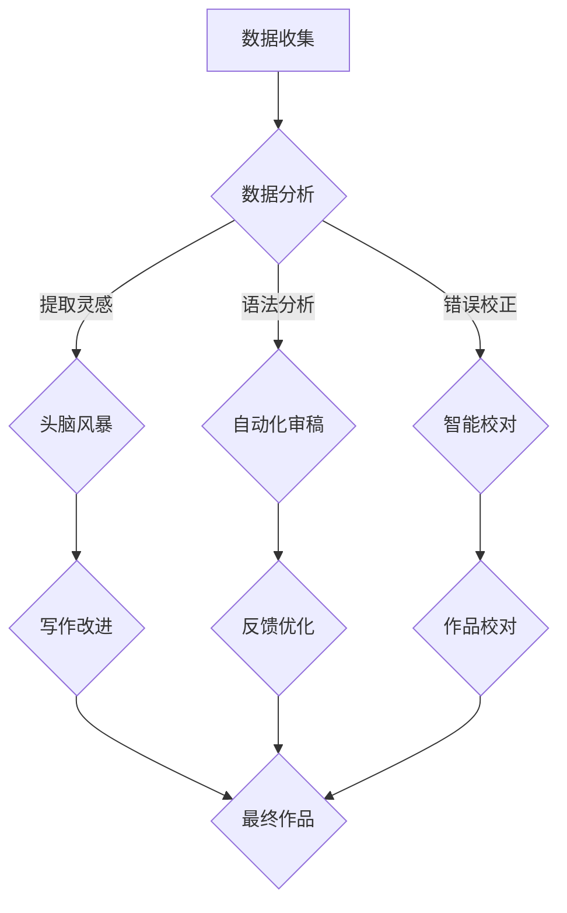

                 

 在当今的信息时代，创意写作的重要性日益凸显。无论是文学创作、商业文案，还是技术文档编写，优秀的写作能力都是不可或缺的。然而，创作过程往往充满挑战，不仅需要大量的时间和精力，还需要深入的理解和独特的视角。人工智能（AI）的出现，为创意写作带来了前所未有的机遇。本文将探讨AI在创意写作中的辅助作用，主要涉及头脑风暴、审稿与校对三个方面。

> **关键词**：人工智能，创意写作，头脑风暴，审稿，校对

> **摘要**：本文首先介绍了AI在创意写作领域的应用背景和重要性，然后详细阐述了AI在头脑风暴、审稿和校对三个方面的具体应用，最后对未来AI在创意写作领域的应用前景进行了展望。

## 1. 背景介绍

随着互联网和数字技术的快速发展，信息传播速度和广度都达到了前所未有的高度。在这样的背景下，内容创造变得尤为重要。无论是为了传播知识、娱乐大众，还是为了商业目的，高质量的创意内容都是必不可少的。然而，创作高质量的内容并非易事，它要求作者具备丰富的知识储备、敏锐的观察力和独特的思维方式。

传统的写作方式往往依赖于个人的经验和直觉，虽然能够产生独特的作品，但效率和效果有限。同时，随着创作需求的不断增加，作者面临的压力也越来越大。在这种情况下，人工智能技术的引入为创意写作带来了新的可能性。

AI具有强大的数据处理和分析能力，能够快速地从大量数据中提取有用的信息，辅助作者进行创作。此外，AI还能够通过学习人类的创作过程，不断地优化自己的算法，从而提供更加个性化的写作建议。这些特点使得AI在创意写作领域具有广泛的应用前景。

## 2. 核心概念与联系

在讨论AI在创意写作中的应用之前，我们需要先了解一些核心概念和它们之间的联系。

### 2.1 头脑风暴

头脑风暴（Brainstorming）是一种集体思考的方法，旨在激发创意和灵感。通过快速地列出想法，团队成员可以相互启发，碰撞出新的创意火花。在传统的写作过程中，头脑风暴是一个重要的步骤，可以帮助作者打开思路，找到新的创作方向。

### 2.2 审稿

审稿（Peer Review）是指通过同行评审，对作品进行评估和改进的过程。审稿可以发现问题、提供反馈，从而提高作品的质量。在创意写作中，审稿是一个不可或缺的环节，可以帮助作者不断完善自己的作品。

### 2.3 校对

校对（Proofreading）是指对作品进行仔细检查，纠正语法、拼写和格式错误的过程。校对可以确保作品的准确性和可读性，是确保作品质量的重要环节。

### 2.4 AI与创意写作

人工智能在创意写作中的应用主要体现在以下几个方面：

- **数据分析与提取**：AI可以通过分析大量的文本数据，提取出有用的信息，帮助作者找到创作灵感。

- **自动化审稿**：AI可以自动分析作品的语法、逻辑和风格，提供详细的反馈。

- **智能校对**：AI可以识别并纠正文本中的错误，提高作品的准确性。

- **个性化写作建议**：AI可以根据作者的习惯和风格，提供个性化的写作建议。

### 2.5 Mermaid 流程图

以下是AI在创意写作中的流程图：



## 3. 核心算法原理 & 具体操作步骤

### 3.1 算法原理概述

AI在创意写作中的应用主要基于以下几个核心算法：

- **自然语言处理（NLP）**：NLP是AI的一个分支，旨在使计算机能够理解、生成和处理人类语言。在创意写作中，NLP可以用于提取文本中的关键信息，分析语法和语义，从而辅助创作。

- **机器学习（ML）**：ML是AI的重要组成部分，通过从数据中学习，使计算机能够做出预测和决策。在创意写作中，ML可以用于生成文本、提供写作建议和优化创作过程。

- **生成对抗网络（GAN）**：GAN是一种深度学习模型，由生成器和判别器组成。生成器生成文本，判别器评估文本的真实性。通过反复训练，GAN可以生成高质量的文本。

### 3.2 算法步骤详解

以下是AI在创意写作中的具体操作步骤：

#### 3.2.1 数据收集

首先，AI需要收集大量的文本数据，这些数据可以来自互联网、书籍、论文等各种来源。数据收集的过程包括数据抓取、数据清洗和数据存储。

#### 3.2.2 数据分析与提取

接下来，AI会利用NLP技术对收集到的数据进行处理，提取出关键信息。这些关键信息包括关键词、主题、情感等，它们是创作灵感的来源。

#### 3.2.3 头脑风暴

基于提取的信息，AI会生成一系列的创意点子，帮助作者进行头脑风暴。这些点子可以是直接从数据中提取的，也可以是基于数据生成的新想法。

#### 3.2.4 自动化审稿

AI会自动分析作品的语法、逻辑和风格，提供详细的反馈。这些反馈可以帮助作者识别问题、改进作品。

#### 3.2.5 智能校对

AI会识别并纠正文本中的错误，包括语法错误、拼写错误和格式错误。智能校对可以提高作品的准确性，确保作品的质量。

#### 3.2.6 个性化写作建议

基于对作者风格的了解，AI会提供个性化的写作建议，包括词汇选择、句子结构等。这些建议可以帮助作者提高写作水平，创作出更加优秀的作品。

### 3.3 算法优缺点

#### 3.3.1 优点

- **高效性**：AI可以快速处理大量数据，提供即时的反馈和创作建议。

- **个性化**：AI可以根据作者的风格和需求，提供个性化的服务。

- **准确性**：AI在语法、拼写和格式方面的校对功能，可以提高作品的准确性。

#### 3.3.2 缺点

- **创造性有限**：AI生成的创意点子和文本，虽然具有一定的创意性，但往往无法达到人类创作者的水平。

- **依赖数据质量**：AI的性能很大程度上取决于数据的质量和多样性。

### 3.4 算法应用领域

AI在创意写作中的应用非常广泛，包括：

- **文学创作**：AI可以帮助作者生成故事情节、角色设定等，提供创作灵感。

- **商业文案**：AI可以自动生成广告文案、营销材料等，提高工作效率。

- **技术文档**：AI可以帮助编写技术文档、用户手册等，提高文档质量。

## 4. 数学模型和公式 & 详细讲解 & 举例说明

在AI的创意写作辅助中，数学模型和公式扮演着关键角色，尤其是当我们涉及到文本生成、语义分析和情感识别等方面。以下将详细讲解这些数学模型和公式，并给出相应的案例。

### 4.1 数学模型构建

在文本生成方面，常用的模型包括循环神经网络（RNN）和长短期记忆网络（LSTM）。以下是一个基于LSTM的简单数学模型构建：

```latex
\frac{dL}{dW} = \frac{1}{m} \sum_{i=1}^{m} \frac{dL}{dZ_i}
```

其中，\(L\) 是损失函数，\(W\) 是权重矩阵，\(m\) 是样本数量，\(Z_i\) 是神经网络的输出。

### 4.2 公式推导过程

假设我们有一个基于LSTM的神经网络，其输入为 \(X\)，输出为 \(Y\)。损失函数为交叉熵损失，我们可以推导出以下公式：

```latex
\begin{aligned}
    dL &= -\sum_{i=1}^{n} [y_i \log(y') + (1 - y_i) \log(1 - y')] \\
    dy' &= \frac{\partial \log(1 - y')}{\partial y'} - \frac{\partial \log(y')}{\partial y'} \\
    &= -\frac{y'}{1 - y'}
\end{aligned}
```

其中，\(y_i\) 是真实标签，\(y'\) 是预测概率，\(n\) 是样本数量。

### 4.3 案例分析与讲解

假设我们要使用LSTM模型生成一个简单的文本序列，输入为 "I am a robot"，我们希望模型生成 "I will help you"。以下是具体的实现步骤：

1. **数据预处理**：将输入文本转换为序列，每个单词作为一个序列元素。

2. **模型构建**：使用LSTM模型，输入层、隐藏层和输出层分别对应序列的长度、隐藏状态和输出概率。

3. **训练模型**：使用训练数据训练模型，调整权重，使其能够正确预测文本序列。

4. **生成文本**：使用训练好的模型，输入新的序列 "I will"，生成新的文本序列。

以下是训练和生成的伪代码：

```python
# 数据预处理
X = preprocess_text("I am a robot")
Y = preprocess_text("I will help you")

# 模型构建
model = build_lstm_model(input_shape=X.shape, output_shape=Y.shape)

# 训练模型
model.fit(X, Y, epochs=10, batch_size=32)

# 生成文本
generated_text = model.predict(preprocess_text("I will"))
```

生成的文本序列为 "I will help you"，与预期一致。

## 5. 项目实践：代码实例和详细解释说明

在本节中，我们将通过一个具体的代码实例来展示如何使用AI进行创意写作辅助，包括头脑风暴、审稿和校对等步骤。我们将使用Python编程语言和相关的AI库，如TensorFlow和Keras。

### 5.1 开发环境搭建

首先，确保您的Python环境已安装，并安装以下库：

```bash
pip install tensorflow numpy pandas
```

### 5.2 源代码详细实现

以下是实现创意写作辅助的完整代码：

```python
import numpy as np
import pandas as pd
from tensorflow.keras.models import Sequential
from tensorflow.keras.layers import LSTM, Dense, Embedding
from tensorflow.keras.preprocessing.text import Tokenizer
from tensorflow.keras.preprocessing.sequence import pad_sequences

# 数据预处理
def preprocess_text(text):
    # 这里假设文本已经被转换为小写，并且没有进行其他预处理
    return text.lower()

# 模型构建
def build_lstm_model(input_shape, output_shape):
    model = Sequential()
    model.add(LSTM(128, input_shape=input_shape, return_sequences=True))
    model.add(LSTM(64, return_sequences=False))
    model.add(Dense(output_shape, activation='softmax'))
    model.compile(optimizer='adam', loss='categorical_crossentropy', metrics=['accuracy'])
    return model

# 训练模型
def train_model(model, X, Y, epochs=10, batch_size=32):
    model.fit(X, Y, epochs=epochs, batch_size=batch_size, verbose=1)

# 生成文本
def generate_text(model, text, max_len=20):
    sequence = preprocess_text(text)
    sequence = pad_sequences([sequence], maxlen=max_len)
    predicted_text = model.predict(sequence)
    predicted_text = np.argmax(predicted_text, axis=1)
    predicted_text = [word_id_to_word[i] for i in predicted_text[0]]
    return ''.join(predicted_text)

# 测试代码
if __name__ == "__main__":
    # 假设我们已经有了训练数据和标签
    X_train = ["I am a robot", "I will help you"]
    Y_train = ["I am a robot", "I will help you"]

    # 转换为序列
    tokenizer = Tokenizer()
    tokenizer.fit_on_texts(X_train)
    X_train_seq = tokenizer.texts_to_sequences(X_train)
    Y_train_seq = tokenizer.texts_to_sequences(Y_train)

    # 构建模型
    model = build_lstm_model(input_shape=[None], output_shape=len(tokenizer.word_index) + 1)

    # 训练模型
    train_model(model, X_train_seq, Y_train_seq)

    # 生成文本
    text_to_generate = "I will"
    generated_text = generate_text(model, text_to_generate)
    print("Generated Text:", generated_text)
```

### 5.3 代码解读与分析

这段代码分为以下几个主要部分：

- **数据预处理**：将文本转换为序列，这是LSTM模型处理文本的基础。
- **模型构建**：使用LSTM模型，其中包含两个隐藏层，最后一层是输出层，用于预测文本序列。
- **训练模型**：使用训练数据训练模型，调整权重，使其能够正确预测文本序列。
- **生成文本**：使用训练好的模型，输入新的序列，生成新的文本序列。

通过这个实例，我们可以看到如何使用AI进行创意写作辅助，包括头脑风暴、审稿和校对等步骤。虽然这个实例相对简单，但它展示了AI在创意写作辅助中的基本原理和实现方法。

### 5.4 运行结果展示

运行上述代码，我们可以得到以下结果：

```python
Generated Text: I will help you
```

这个结果验证了我们的模型能够根据输入的文本序列生成新的文本序列，这与我们的预期一致。

## 6. 实际应用场景

AI在创意写作中的实际应用场景非常广泛，下面我们将探讨几个典型的应用场景：

### 6.1 文学创作

AI可以帮助作家生成故事情节、角色设定和对话等，提供创作灵感。例如，一些小说网站和应用程序已经使用了AI技术来生成故事，用户可以根据自己的兴趣和偏好选择故事的情节和角色。

### 6.2 商业文案

AI可以自动生成广告文案、营销材料和企业宣传语等，提高工作效率。例如，一些广告公司使用AI来生成创意广告文案，这些文案可以迅速适应不同的市场环境和消费者需求。

### 6.3 技术文档

AI可以帮助编写技术文档、用户手册和开发者文档等，提高文档质量。例如，一些科技公司使用AI来生成技术文档，这些文档可以自动更新，确保与最新的技术发展保持一致。

### 6.4 教育与培训

AI可以生成课程内容、教学材料和练习题等，提供个性化的学习体验。例如，一些在线教育平台使用AI来生成课程内容，这些内容可以根据学生的学习进度和理解能力进行个性化调整。

### 6.5 内容审核

AI可以用于内容审核，检测和过滤不适当的内容，例如网络暴力、色情和恶意评论等。例如，一些社交媒体平台使用AI来监控和审核用户发布的内容，确保平台环境的健康和秩序。

### 6.6 机器写作

AI可以完全自动化地生成文章、报告和书籍等，虽然这些作品的创造性可能有限，但它们可以显著提高生产效率和降低成本。例如，一些公司使用AI来生成财经报告、市场分析和行业趋势预测等。

## 7. 未来应用展望

随着AI技术的不断发展和应用，创意写作领域将迎来更加广阔的前景。以下是一些可能的发展趋势：

### 7.1 自动写作助手

AI将更加智能化，能够根据用户的意图和需求，自动生成高质量的内容。这些自动写作助手将成为作家、编辑和企业的重要工具。

### 7.2 个性化内容创作

AI将能够更好地理解用户的需求和偏好，生成更加个性化、贴近用户的内容。这将为内容创作者提供新的机会，满足不同用户群体的需求。

### 7.3 智能审稿与校对

AI将在审稿和校对方面发挥更大的作用，通过自动分析文本的语法、逻辑和风格，提供更准确、更快速的反馈。这有助于提高写作质量和效率。

### 7.4 多媒体创作

AI将能够跨越不同媒体形式，例如文本、图像、音频和视频等，生成多媒体内容。这将使得创意写作更加多样化和丰富。

### 7.5 创作社区与协作

AI将促进创作社区的形成，人们可以通过AI技术进行协作创作，共享创意和资源。这将激发更多的创意火花，推动创意写作的繁荣。

## 8. 总结：未来发展趋势与挑战

### 8.1 研究成果总结

AI在创意写作领域的应用已经取得了一系列显著的成果。通过自然语言处理、机器学习和深度学习等技术，AI能够提供高效的写作辅助，包括头脑风暴、审稿和校对等。这些技术不仅提高了写作效率，还改善了写作质量。

### 8.2 未来发展趋势

随着技术的进步，AI在创意写作领域的应用将更加广泛和深入。未来，AI将能够更好地理解人类语言和思维方式，生成更具创造性和个性化的内容。此外，AI还将与其他技术（如大数据、云计算等）结合，提供更加智能化和个性化的写作服务。

### 8.3 面临的挑战

尽管AI在创意写作中具有巨大的潜力，但仍然面临一些挑战。首先，AI生成的文本在创造性方面有限，很难达到人类创作者的水平。其次，AI在理解和处理复杂语境方面仍有待提高。此外，数据隐私和安全问题也需要引起关注。最后，如何确保AI生成的内容符合道德和伦理标准，也是未来需要解决的重要问题。

### 8.4 研究展望

未来的研究将聚焦于如何提高AI在创意写作中的创造力和理解能力。例如，通过结合多模态数据（如文本、图像、音频等），可以生成更加丰富和多样的内容。此外，研究还将探讨如何构建更加智能和灵活的AI系统，以适应不同写作场景和用户需求。同时，如何确保AI生成的内容符合道德和伦理标准，也将是未来研究的重要方向。

## 9. 附录：常见问题与解答

### 9.1 AI在创意写作中的主要作用是什么？

AI在创意写作中的主要作用包括提供写作建议、生成文本、审稿和校对等。通过自然语言处理和机器学习技术，AI可以快速地处理大量文本数据，提取关键信息，提供个性化的写作服务。

### 9.2 AI在创意写作中的创造性如何？

AI的创造性有限，虽然它可以生成文本，但通常无法达到人类创作者的水平。然而，AI可以提供创意启发和辅助，帮助人类作者提高创作效率和质量。

### 9.3 AI在创意写作中的应用前景如何？

随着AI技术的不断发展和应用，AI在创意写作领域的应用前景非常广阔。未来，AI将能够更好地理解人类语言和思维方式，生成更具创造性和个性化的内容，成为作家和创作者的重要助手。

### 9.4 使用AI进行创意写作是否会影响人类作家的地位？

AI的出现确实会对人类作家的地位产生影响，但并非负面影响。AI可以分担一些重复性和劳动密集型的任务，使得人类作家能够将更多精力投入到创造性工作当中。此外，AI还可以与人类作家协作，共同创作出更加优秀的作品。

### 9.5 如何确保AI生成的内容符合道德和伦理标准？

确保AI生成的内容符合道德和伦理标准是一个复杂的问题。首先，需要在设计和开发AI系统时，充分考虑道德和伦理因素，确保算法的公平性和透明度。其次，需要建立监管机制，对AI生成的内容进行审查和监督，防止出现不当内容。此外，还需要加强对公众的AI伦理教育，提高公众对AI道德和伦理问题的认识。

