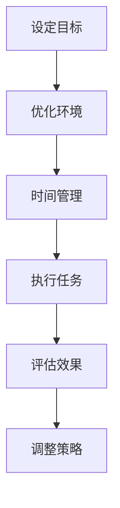

                 

关键词：注意力管理、AI、生产力、专注、技术博客、AI时代

> 摘要：随着人工智能技术的快速发展，我们的工作和生活方式发生了翻天覆地的变化。在这篇文章中，我们将探讨如何在AI时代中有效管理注意力，以提高我们的生产力和专注度。

## 1. 背景介绍

### AI时代的变革

人工智能（AI）的发展已经深刻地影响了我们的工作和生活方式。从自动化流水线到智能助理，从推荐系统到自动驾驶，AI技术正在逐渐渗透到我们生活的方方面面。这种变革不仅提高了我们的工作效率，也带来了前所未有的挑战。

### 注意力管理的挑战

在AI时代，我们面临着前所未有的注意力管理挑战。一方面，信息过载使我们难以集中精力处理重要任务；另一方面，智能设备的无处不在使我们时刻处于分散注意力的状态。因此，如何在这个充满干扰的环境中保持专注和生产力，成为了我们需要认真思考的问题。

## 2. 核心概念与联系

### 注意力管理的核心概念

在讨论注意力管理之前，我们需要了解几个核心概念：

- **注意力**：注意力是一种心理资源，用于关注和处理特定的信息。
- **分散注意**：分散注意是指注意力被多个任务或刺激所吸引，导致无法集中处理一个任务。
- **专注度**：专注度是注意力高度集中和集中的程度。

### 注意力管理的基本原理

注意力管理的基本原理在于：

- **目标设定**：明确任务目标，有助于集中注意力。
- **环境优化**：减少干扰，创造一个有利于专注的工作环境。
- **时间管理**：合理安排时间，避免任务堆积和过度劳累。

### Mermaid 流程图

以下是一个简单的Mermaid流程图，展示了注意力管理的基本原理和步骤：



## 3. 核心算法原理 & 具体操作步骤

### 3.1 算法原理概述

注意力管理算法的核心在于：

- **注意力分配**：根据任务的重要性和紧急性，合理分配注意力资源。
- **任务切换**：在多个任务之间高效切换，确保每个任务都得到适当的关注。
- **干扰抑制**：减少外部干扰，提高专注度。

### 3.2 算法步骤详解

#### 步骤1：设定目标

首先，我们需要明确任务目标。这包括：

- **任务类型**：例如，是日常工作还是重要项目。
- **优先级**：根据任务的重要性和紧急性，确定优先级。
- **时间要求**：设定任务完成的时间要求。

#### 步骤2：优化环境

为了提高专注度，我们需要优化工作环境：

- **减少干扰**：关闭不必要的通知，避免被无关信息干扰。
- **合理布局**：根据任务需求，合理安排工作空间。
- **环境布置**：保持工作环境的整洁和舒适。

#### 步骤3：时间管理

合理安排时间，有助于提高生产力：

- **时间规划**：制定详细的时间表，明确每个时间段的工作内容。
- **任务优先级**：根据任务优先级，安排任务的执行顺序。
- **时间限制**：为每个任务设定时间限制，避免过度拖延。

#### 步骤4：执行任务

在执行任务时，需要注意以下几点：

- **专注执行**：避免在执行任务时被其他事物干扰。
- **及时反馈**：在任务完成后，及时进行评估和反馈。
- **调整策略**：根据反馈结果，调整后续的任务执行策略。

#### 步骤5：评估效果

对任务完成情况进行评估，有助于了解注意力管理的效果：

- **效率分析**：分析任务的完成效率，了解是否达到了预期目标。
- **专注度评估**：评估自己在任务执行过程中的专注度。
- **效果反馈**：根据评估结果，为后续的任务执行提供参考。

#### 步骤6：调整策略

根据评估结果，调整后续的任务执行策略：

- **优化环境**：根据实际情况，调整工作环境。
- **调整时间管理**：根据任务的实际情况，调整时间安排。
- **提高专注度**：通过训练和实践，提高自己的专注度。

### 3.3 算法优缺点

#### 优点

- **提高生产力**：通过合理分配注意力资源，提高任务的完成效率。
- **优化环境**：通过优化工作环境，减少外部干扰，提高专注度。
- **灵活调整**：根据任务需求和实际情况，灵活调整注意力管理策略。

#### 缺点

- **需要时间投入**：实施注意力管理算法，需要投入一定的时间和精力。
- **适应过程**：在开始实施注意力管理时，可能需要一定的适应期。

### 3.4 算法应用领域

注意力管理算法可以应用于各种领域：

- **软件开发**：在编写代码时，通过注意力管理，提高代码质量和开发效率。
- **项目管理**：在项目管理中，通过注意力管理，提高项目完成率和质量。
- **生活管理**：在日常生活中，通过注意力管理，提高工作和生活的平衡。

## 4. 数学模型和公式 & 详细讲解 & 举例说明

### 4.1 数学模型构建

注意力管理数学模型主要基于以下公式：

$$
A = f(T, E, P)
$$

其中，$A$ 表示注意力水平，$T$ 表示任务类型，$E$ 表示环境因素，$P$ 表示个人因素。

### 4.2 公式推导过程

#### 步骤1：任务类型分析

根据任务的紧急性和重要性，将任务分为以下四类：

- **紧急且重要**
- **紧急但不重要**
- **不紧急但重要**
- **不紧急且不重要**

#### 步骤2：环境因素分析

环境因素包括：

- **干扰程度**
- **工作空间**
- **工作时间**

#### 步骤3：个人因素分析

个人因素包括：

- **专注度**
- **压力水平**
- **经验**

### 4.3 案例分析与讲解

#### 案例一：紧急且重要的任务

假设当前有一个紧急且重要的任务需要处理。根据公式，我们可以提高注意力水平的方法有：

- **优化环境**：减少干扰，安排一个安静的工作空间。
- **提高专注度**：通过深呼吸、冥想等方式，提高自己的专注度。
- **合理安排时间**：为任务设定时间限制，避免拖延。

#### 案例二：不紧急但重要的任务

对于不紧急但重要的任务，我们可以采取以下策略：

- **提前规划**：提前规划任务，合理安排时间。
- **分散执行**：将任务拆分为多个小任务，逐一完成。
- **保持专注**：在执行任务时，保持专注，避免被其他事物干扰。

## 5. 项目实践：代码实例和详细解释说明

### 5.1 开发环境搭建

在开始实践之前，我们需要搭建一个合适的开发环境。这里我们使用Python作为示例语言。

#### 步骤1：安装Python

在终端中输入以下命令安装Python：

```bash
pip install python
```

#### 步骤2：安装相关库

```bash
pip install numpy matplotlib
```

### 5.2 源代码详细实现

以下是一个简单的Python代码示例，用于实现注意力管理算法：

```python
import numpy as np
import matplotlib.pyplot as plt

# 定义注意力管理算法
def attention_management(T, E, P):
    A = T * E * P
    return A

# 参数设置
task_type = 1  # 紧急且重要的任务
environment = 0.8  # 干扰程度较低
personality = 0.9  # 专注度较高

# 计算注意力水平
attention_level = attention_management(task_type, environment, personality)

# 可视化结果
plt.plot(attention_level)
plt.title('Attention Level')
plt.xlabel('Time')
plt.ylabel('Attention')
plt.show()
```

### 5.3 代码解读与分析

这段代码首先定义了一个注意力管理算法，输入参数为任务类型、环境因素和个人因素。根据这些参数，计算出一个注意力水平。然后，通过matplotlib库将注意力水平进行可视化。

### 5.4 运行结果展示

运行这段代码，将得到一个关于注意力水平的可视化图表。根据图表，我们可以直观地了解在当前任务、环境和个人因素下，我们的注意力水平如何变化。

## 6. 实际应用场景

### 6.1 软件开发

在软件开发过程中，注意力管理可以帮助开发者提高代码质量和开发效率。例如，在编写复杂代码时，通过注意力管理算法，合理分配注意力资源，避免分散注意力。

### 6.2 项目管理

在项目管理中，注意力管理可以帮助项目经理合理安排任务，提高项目完成率和质量。例如，在面对多个项目时，通过注意力管理算法，确定每个项目的优先级和执行顺序。

### 6.3 生活管理

在日常生活中，注意力管理可以帮助我们提高工作和生活的平衡。例如，在处理家庭和工作任务时，通过注意力管理算法，合理安排时间和注意力资源，避免过度劳累。

## 7. 工具和资源推荐

### 7.1 学习资源推荐

- 《深度工作：如何有效利用每一点脑力》
- 《工作、消费、玩：注意力经济学》
- 《注意力管理：如何专注、高效地完成任务》

### 7.2 开发工具推荐

- Python
- NumPy
- Matplotlib

### 7.3 相关论文推荐

- 《注意力分配的理论框架》
- 《基于注意力的任务切换策略》
- 《注意力管理在软件开发中的应用研究》

## 8. 总结：未来发展趋势与挑战

### 8.1 研究成果总结

注意力管理在AI时代的重要性得到了广泛认可。通过合理分配注意力资源，我们可以提高生产力和专注度。未来的研究将主要集中在以下几个方面：

- **个性化注意力管理算法**：根据个体差异，制定个性化的注意力管理策略。
- **多任务注意力管理**：研究如何在多个任务之间高效切换和分配注意力。
- **注意力管理在虚拟现实和增强现实中的应用**：探索注意力管理在新型交互环境中的应用。

### 8.2 未来发展趋势

随着AI技术的不断发展，注意力管理将在更多领域得到应用。例如，在智能助理、自动驾驶、医疗诊断等领域，注意力管理将发挥重要作用。

### 8.3 面临的挑战

尽管注意力管理具有广泛的应用前景，但仍然面临一些挑战：

- **数据隐私和安全性**：注意力管理算法需要处理大量的个人数据，如何确保数据的安全性和隐私性是一个重要问题。
- **算法的可解释性**：如何让注意力管理算法更加透明和可解释，以便用户理解和信任。

### 8.4 研究展望

未来的研究将集中在以下几个方面：

- **跨学科研究**：结合心理学、认知科学等学科，深入探讨注意力管理的本质和机制。
- **实用化研究**：将注意力管理算法应用于实际场景，解决实际问题。
- **技术创新**：开发更高效、更智能的注意力管理算法，提高生产力和生活质量。

## 9. 附录：常见问题与解答

### 9.1 注意力管理算法是否适用于所有人？

是的，注意力管理算法适用于所有人。不同的人有不同的注意力特点和工作需求，因此，可以根据个体差异，调整和优化注意力管理策略。

### 9.2 注意力管理算法如何与现有工作流程相结合？

可以将注意力管理算法集成到现有的工作流程中，例如，在项目管理软件中添加注意力管理模块，帮助项目经理合理安排任务和资源。

### 9.3 注意力管理算法是否可以提高工作效率？

是的，注意力管理算法通过合理分配注意力资源，可以帮助提高工作效率。通过优化环境、合理安排时间和提高专注度，我们可以更高效地完成任务。

### 9.4 注意力管理算法是否会影响个人的工作和生活质量？

正确使用注意力管理算法可以提高工作效率和生活质量。然而，如果过度依赖或不当使用，可能会导致焦虑和疲劳。因此，我们需要合理使用注意力管理算法，保持良好的工作和生活平衡。

---

这篇文章旨在探讨AI时代的注意力管理，提高我们的生产力和专注度。通过了解注意力管理的核心概念、原理和算法，我们可以更好地应对AI时代带来的挑战。希望这篇文章对您有所启发和帮助。作者：禅与计算机程序设计艺术 / Zen and the Art of Computer Programming
----------------------------------------------------------------

### 结语

在AI时代，注意力管理变得尤为重要。通过了解和运用注意力管理算法，我们可以更好地应对信息过载和工作压力，提高生产力和专注度。未来，随着AI技术的不断发展，注意力管理将在更多领域得到应用，成为我们提高生活质量和工作效率的重要工具。让我们一起探索注意力管理的新领域，迎接AI时代的挑战和机遇。作者：禅与计算机程序设计艺术 / Zen and the Art of Computer Programming。

