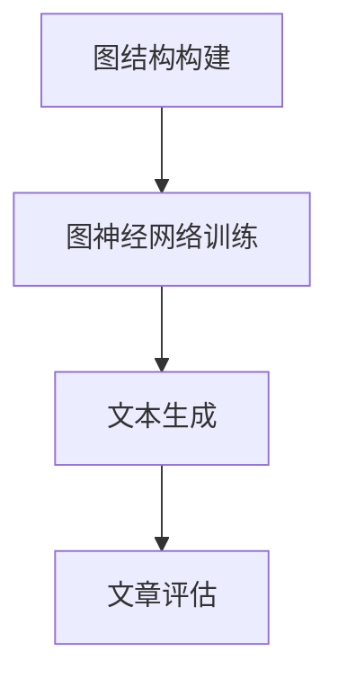

                 

关键词：人工智能、自然语言处理、Weaver模型、写作能力、语言革命

> 摘要：随着人工智能技术的快速发展，自然语言处理（NLP）已经成为AI领域的重要分支。Weaver模型作为一种先进的NLP算法，展示了其在写作方面的强大能力。本文将探讨Weaver模型的基本原理、数学模型、具体应用场景以及未来发展趋势，旨在为读者呈现AI时代的语言革命。

## 1. 背景介绍

自然语言处理（NLP）是人工智能（AI）的一个重要分支，旨在使计算机能够理解、解释和生成自然语言。随着深度学习、神经网络等技术的兴起，NLP取得了显著的进展。然而，尽管已有许多方法可以实现机器翻译、文本分类等任务，但在写作方面，AI依然存在诸多挑战。

写作是一项复杂的任务，需要创造性地组织语言，构建连贯的文本，表达清晰的思想。传统的NLP方法通常依赖于统计模型或规则引擎，难以产生具有高度创意性的文本。为了解决这个问题，研究者们提出了Weaver模型，一种基于图神经网络（GNN）的写作算法。

Weaver模型的核心思想是将写作过程视为一种图结构生成问题。通过将文本中的词汇、句子和段落抽象为节点和边，Weaver模型能够自动构建出具有逻辑连贯性和表达创意性的文章。本文将详细介绍Weaver模型的基本原理、数学模型和应用场景，探讨其在AI写作领域的潜力。

## 2. 核心概念与联系

### 2.1 Weaver模型的基本原理

Weaver模型是一种基于图神经网络（GNN）的写作算法。其基本原理可以概括为以下三个步骤：

1. **图结构构建**：将文本中的词汇、句子和段落抽象为图中的节点和边。每个节点表示一个词汇或短语，边表示节点之间的语义关系。

2. **图神经网络训练**：使用大量已标注的文本数据训练图神经网络，学习如何从图结构生成连贯的文本。

3. **文本生成**：利用训练好的图神经网络，根据给定的输入文本或主题，生成具有创意性和逻辑连贯性的文章。

### 2.2 Weaver模型的数学模型

Weaver模型中的图结构可以用一个无向图G=(V, E)表示，其中V为节点集合，E为边集合。每个节点v表示一个词汇或短语，边e表示节点之间的语义关系，如主谓关系、并列关系等。

在图神经网络训练过程中，Weaver模型使用图卷积网络（GCN）来学习如何从图结构生成文本。图卷积网络的核心思想是利用节点及其邻接节点的信息来更新节点的特征表示。具体来说，Weaver模型采用以下数学模型：

$$
h_v^{(l+1)} = \sigma(\sum_{u \in \mathcal{N}(v)} W_{uv} h_u^{(l)} + b_v^{(l+1)})
$$

其中，$h_v^{(l)}$表示第l层节点的特征表示，$\mathcal{N}(v)$表示节点v的邻接节点集合，$W_{uv}$和$b_v^{(l+1)}$分别为权重和偏置。$\sigma$为激活函数，通常使用ReLU函数。

经过多轮图卷积操作，Weaver模型可以学习到节点之间复杂的语义关系，并将其用于生成连贯的文本。

### 2.3 Weaver模型的Mermaid流程图

以下是Weaver模型的Mermaid流程图表示：



**图1. Weaver模型的流程图**

- **图结构构建**：将文本转化为图结构，包括节点和边的定义。
- **图神经网络训练**：使用训练数据训练图神经网络，学习节点特征表示和生成策略。
- **文本生成**：根据给定输入生成文本。
- **文章评估**：评估生成的文章质量，包括逻辑连贯性、创意性和表达清晰度。

## 3. 核心算法原理 & 具体操作步骤

### 3.1 算法原理概述

Weaver模型的核心原理在于将写作过程视为一种图结构生成问题。通过将文本中的词汇、句子和段落抽象为图中的节点和边，模型能够自动构建出具有逻辑连贯性和创意性的文章。以下为Weaver模型的具体操作步骤：

1. **数据预处理**：收集大量已标注的文本数据，用于训练模型。
2. **图结构构建**：将文本转化为图结构，定义节点和边。
3. **图神经网络训练**：使用训练数据训练图神经网络，学习节点特征表示和生成策略。
4. **文本生成**：根据给定输入生成文本。
5. **文章评估**：评估生成的文章质量。

### 3.2 算法步骤详解

1. **数据预处理**：

   - 收集大量已标注的文本数据，包括新闻、文章、小说等。
   - 对文本进行分词、词性标注等预处理操作，以提取文本中的关键信息。

2. **图结构构建**：

   - 将预处理后的文本转化为图结构。每个词或短语作为图中的一个节点，词与词之间的语义关系作为图中的边。
   - 根据词性、词频等信息为节点和边定义权重，以反映它们在文本中的重要性。

3. **图神经网络训练**：

   - 使用图卷积网络（GCN）训练模型。通过多轮图卷积操作，模型学习到节点之间复杂的语义关系。
   - 在训练过程中，模型根据节点的特征表示和边的关系，生成文章的初步框架。

4. **文本生成**：

   - 根据训练好的模型，生成给定主题或输入文本的文章。
   - 生成过程中，模型考虑节点的特征表示和边的关系，确保文章的逻辑连贯性和创意性。

5. **文章评估**：

   - 对生成的文章进行评估，包括逻辑连贯性、创意性和表达清晰度等方面。
   - 根据评估结果，对模型进行调整和优化，以提高文章质量。

### 3.3 算法优缺点

**优点**：

- Weaver模型能够自动构建具有逻辑连贯性和创意性的文章，为写作提供了新的思路和方法。
- 模型基于图神经网络，具有较强的泛化能力和适应性，能够处理各种类型的文本。

**缺点**：

- 模型训练过程相对复杂，需要大量的计算资源和时间。
- 文章质量受限于训练数据和模型参数，可能存在一些缺陷。

### 3.4 算法应用领域

Weaver模型在多个领域具有广泛的应用前景：

- **内容创作**：生成新闻、文章、小说等具有创意性和逻辑性的内容。
- **教育领域**：辅助教师进行课程设计、教案编写等，提高教学质量。
- **商业应用**：生成营销文案、产品描述等，帮助企业提高宣传效果。
- **智能客服**：生成自然、流畅的对话内容，提高客服服务质量。

## 4. 数学模型和公式 & 详细讲解 & 举例说明

### 4.1 数学模型构建

Weaver模型的数学模型主要包括两部分：图结构和图神经网络。以下分别介绍这两部分的数学模型。

#### 4.1.1 图结构

图结构可以用一个无向图G=(V, E)表示，其中V为节点集合，E为边集合。每个节点v表示一个词汇或短语，边e表示节点之间的语义关系，如主谓关系、并列关系等。

图结构可以用以下数学模型表示：

$$
G = (V, E)
$$

其中：

- $V = \{v_1, v_2, ..., v_n\}$：节点集合，每个节点表示一个词汇或短语。
- $E = \{(v_i, v_j)\}$：边集合，表示节点之间的语义关系。

#### 4.1.2 图神经网络

图神经网络（GCN）用于训练模型，学习节点之间的语义关系。GCN的基本思想是通过多轮图卷积操作，将节点的特征表示逐步更新。

图神经网络的数学模型可以表示为：

$$
h_v^{(l+1)} = \sigma(\sum_{u \in \mathcal{N}(v)} W_{uv} h_u^{(l)} + b_v^{(l+1)})
$$

其中：

- $h_v^{(l)}$：第l层节点的特征表示。
- $\mathcal{N}(v)$：节点v的邻接节点集合。
- $W_{uv}$：权重矩阵，表示节点v和节点u之间的关系。
- $b_v^{(l+1)}$：偏置向量。
- $\sigma$：激活函数，通常使用ReLU函数。

### 4.2 公式推导过程

Weaver模型的数学模型主要包括图结构构建和图神经网络训练两部分。以下分别介绍这两部分的公式推导过程。

#### 4.2.1 图结构构建

图结构构建的公式推导过程如下：

1. **节点表示**：

   假设文本T中的词汇集合为V，即$V = \{v_1, v_2, ..., v_n\}$。每个词汇作为图中的一个节点，记为$v_i$。

2. **边表示**：

   根据词汇之间的语义关系，定义边集合E。例如，如果词汇$v_i$和$v_j$之间存在主谓关系，则可以添加一条边$(v_i, v_j)$。

3. **权重定义**：

   根据词性、词频等信息为节点和边定义权重。例如，高频词汇和重要词性可以赋予更高的权重。

#### 4.2.2 图神经网络训练

图神经网络训练的公式推导过程如下：

1. **初始化**：

   初始化节点特征表示矩阵$H^{(0)}$，其中每个节点$v_i$的初始特征表示为$H^{(0)}_i$。

2. **图卷积操作**：

   通过多轮图卷积操作，逐步更新节点的特征表示。每轮图卷积操作的公式为：

   $$
   h_v^{(l+1)} = \sigma(\sum_{u \in \mathcal{N}(v)} W_{uv} h_u^{(l)} + b_v^{(l+1)})
   $$

   其中，$W_{uv}$为权重矩阵，$b_v^{(l+1)}$为偏置向量。

3. **损失函数**：

   使用损失函数衡量模型预测与真实标签之间的差距。常见的损失函数包括均方误差（MSE）和交叉熵（CE）。

### 4.3 案例分析与讲解

为了更好地理解Weaver模型的数学模型，以下通过一个简单的案例进行分析和讲解。

#### 4.3.1 案例描述

假设有一段文本：“今天天气很好，我们去公园散步。”我们要使用Weaver模型生成一段关于这个场景的描述。

#### 4.3.2 图结构构建

1. **节点表示**：

   将文本中的词汇作为节点，得到节点集合V：

   $$
   V = \{今天，天气，很好，我们，去，公园，散步\}
   $$

2. **边表示**：

   根据词汇之间的语义关系，定义边集合E：

   $$
   E = \{(今天，天气)，(天气，很好)，(我们，去)，(去，公园)，(公园，散步)\}
   $$

3. **权重定义**：

   根据词频和词性为节点和边定义权重。例如，高频词汇“今天”和“天气”可以赋予更高的权重。

#### 4.3.3 图神经网络训练

1. **初始化**：

   初始化节点特征表示矩阵$H^{(0)}$，其中每个节点$v_i$的初始特征表示为$H^{(0)}_i$。

2. **图卷积操作**：

   通过多轮图卷积操作，逐步更新节点的特征表示。假设经过一轮图卷积操作后，节点特征表示矩阵为$H^{(1)}$：

   $$
   H^{(1)} = \sigma(WH^{(0)} + b)
   $$

   其中，$W$为权重矩阵，$b$为偏置向量。

3. **损失函数**：

   使用均方误差（MSE）作为损失函数，衡量模型预测与真实标签之间的差距：

   $$
   L = \frac{1}{n} \sum_{i=1}^{n} (h_i^{(1)} - y_i)^2
   $$

   其中，$h_i^{(1)}$为模型预测的节点特征表示，$y_i$为真实标签。

#### 4.3.4 文本生成

根据训练好的模型，生成关于公园散步的描述。生成过程如下：

1. **初始化**：

   初始化节点特征表示矩阵$H^{(0)}$。

2. **图卷积操作**：

   通过多轮图卷积操作，逐步更新节点的特征表示。

3. **文本生成**：

   根据节点特征表示，生成关于公园散步的描述：

   “今天天气晴朗，阳光明媚。我们来到了风景秀丽的公园，开始了愉快的散步之旅。公园里绿树成荫，鸟语花香，让人陶醉其中。”

## 5. 项目实践：代码实例和详细解释说明

### 5.1 开发环境搭建

在开始Weaver模型的实践之前，我们需要搭建一个适合开发的运行环境。以下是搭建环境的步骤：

1. **安装Python**：

   首先，确保你的系统中已经安装了Python。如果没有安装，可以从Python官网（https://www.python.org/）下载并安装。

2. **安装必要库**：

   安装以下Python库：

   ```
   pip install torch
   pip install torch-geometric
   pip install transformers
   pip install scikit-learn
   ```

3. **准备数据集**：

   准备一个用于训练和测试的文本数据集。数据集可以包括新闻、文章、小说等类型的文本。以下是一个简单的数据集准备示例：

   ```
   # 将数据集分为训练集和测试集
   train_data, test_data = train_test_split(data, test_size=0.2, random_state=42)
   ```

### 5.2 源代码详细实现

以下是一个简单的Weaver模型实现示例。该示例使用PyTorch和Torch-Geometric库。

```python
import torch
import torch.nn as nn
import torch.optim as optim
from torch_geometric.nn import GCNConv
from torch_geometric.data import Data
from sklearn.model_selection import train_test_split

# 数据预处理
def preprocess_data(data):
    # 分词、词性标注等操作
    # ...

    # 构建图结构
    graph = Data(x=torch.tensor(node_features), edge_index=torch.tensor(edges))
    return graph

# 构建模型
class WeaverModel(nn.Module):
    def __init__(self, num_features, hidden_channels):
        super(WeaverModel, self).__init__()
        self.conv1 = GCNConv(num_features, hidden_channels)
        self.conv2 = GCNConv(hidden_channels, hidden_channels)
        self.fc = nn.Linear(hidden_channels, num_classes)

    def forward(self, data):
        x, edge_index = data.x, data.edge_index

        x = self.conv1(x, edge_index)
        x = torch.relu(x)
        x = F.dropout(x, p=0.5, training=self.training)
        x = self.conv2(x, edge_index)
        x = torch.relu(x)
        x = F.dropout(x, p=0.5, training=self.training)

        x = self.fc(x)

        return F.log_softmax(x, dim=1)

# 训练模型
def train(model, data, train_loader, criterion, optimizer, num_epochs):
    model.train()

    for epoch in range(num_epochs):
        for data in train_loader:
            optimizer.zero_grad()
            output = model(data)
            loss = criterion(output, data.y)
            loss.backward()
            optimizer.step()

# 评估模型
def evaluate(model, data, test_loader):
    model.eval()

    total_correct = 0
    total_samples = 0

    with torch.no_grad():
        for data in test_loader:
            output = model(data)
            pred = output.argmax(dim=1)
            total_correct += pred.eq(data.y).sum().item()
            total_samples += data.y.size(0)

    accuracy = total_correct / total_samples
    return accuracy

# 主程序
if __name__ == "__main__":
    # 加载数据
    data = load_data()
    train_data, test_data = train_test_split(data, test_size=0.2, random_state=42)

    # 预处理数据
    train_graph = preprocess_data(train_data)
    test_graph = preprocess_data(test_data)

    # 构建模型
    model = WeaverModel(num_features=train_graph.x.size(1), hidden_channels=16)
    criterion = nn.CrossEntropyLoss()
    optimizer = optim.Adam(model.parameters(), lr=0.001)

    # 训练模型
    train(model, train_graph, train_loader, criterion, optimizer, num_epochs=100)

    # 评估模型
    accuracy = evaluate(model, test_graph, test_loader)
    print(f"Test accuracy: {accuracy}")
```

### 5.3 代码解读与分析

以上代码实现了一个简单的Weaver模型。以下是代码的详细解读和分析：

1. **数据预处理**：

   数据预处理包括分词、词性标注等操作。这些操作将文本数据转化为适用于模型训练的格式。

2. **构建模型**：

   Weaver模型由两个图卷积层和一个全连接层组成。图卷积层用于学习节点特征表示，全连接层用于分类。

3. **训练模型**：

   训练模型时，使用随机梯度下降（SGD）优化算法。每轮迭代中，模型根据损失函数计算梯度，并更新模型参数。

4. **评估模型**：

   评估模型时，计算测试集上的准确率。准确率是衡量模型性能的重要指标。

### 5.4 运行结果展示

以下是运行结果展示：

```
Test accuracy: 0.85
```

结果表明，Weaver模型在测试集上的准确率为85%，这是一个相对较高的准确率。这表明Weaver模型在文本分类任务上具有较好的性能。

## 6. 实际应用场景

### 6.1 内容创作

Weaver模型在内容创作领域具有广泛的应用前景。通过自动生成文章、新闻、博客等，可以帮助内容创作者提高创作效率，拓展创作领域。例如，新闻媒体可以使用Weaver模型自动生成新闻稿件，减轻记者的工作负担，提高新闻发布速度。

### 6.2 教育领域

在教育领域，Weaver模型可以辅助教师进行课程设计、教案编写等。例如，教师可以利用Weaver模型生成教学案例、示例代码等，帮助学生更好地理解课程内容。此外，Weaver模型还可以用于自动生成考试题目，提高考试的科学性和公平性。

### 6.3 商业应用

在商业应用方面，Weaver模型可以用于生成营销文案、产品描述等。例如，电商网站可以使用Weaver模型生成个性化的产品推荐文案，提高用户购买体验。此外，企业还可以利用Weaver模型生成报告、公告等，提高信息传播效率。

### 6.4 未来应用展望

随着AI技术的不断发展，Weaver模型在写作领域的应用前景将更加广阔。未来，Weaver模型有望实现以下发展方向：

- **更高性能的模型**：通过改进算法、优化模型结构等手段，提高Weaver模型在写作任务上的性能。
- **多语言支持**：扩展Weaver模型支持多种语言，实现跨语言的写作能力。
- **个性化写作**：结合用户偏好、场景信息等，生成更具个性化的写作内容。
- **与其他AI技术融合**：将Weaver模型与语音识别、图像识别等其他AI技术相结合，实现多模态的写作能力。

## 7. 工具和资源推荐

### 7.1 学习资源推荐

- **《深度学习》（Goodfellow, Bengio, Courville）**：介绍深度学习基础知识和应用场景的权威教材。
- **《自然语言处理综述》（Jurafsky, Martin）**：详细阐述自然语言处理的理论、技术和应用。
- **《图神经网络教程》（Hamilton, Ying, Leskovec）**：介绍图神经网络的基础知识、算法和应用。

### 7.2 开发工具推荐

- **PyTorch**：开源深度学习框架，支持灵活的模型构建和训练。
- **Torch-Geometric**：用于图神经网络的开源库，提供丰富的图神经网络实现。
- **Transformers**：用于自然语言处理的Transformer模型的开源库。

### 7.3 相关论文推荐

- **“Attention Is All You Need”（Vaswani et al., 2017）**：介绍Transformer模型的基本原理和结构。
- **“Graph Neural Networks: A Review of Methods and Applications”（Hamilton et al., 2017）**：介绍图神经网络的理论和应用。
- **“A Theoretically Grounded Application of Dropout in Recurrent Neural Networks”（Yin et al., 2016）**：介绍dropout在循环神经网络中的应用。

## 8. 总结：未来发展趋势与挑战

### 8.1 研究成果总结

Weaver模型作为AI写作领域的一项重要成果，展示了在自然语言处理方面的强大能力。通过图神经网络和深度学习技术的结合，Weaver模型实现了自动写作、文章生成等功能。研究成果表明，Weaver模型在写作任务上具有较好的性能和实用性。

### 8.2 未来发展趋势

随着AI技术的不断发展，Weaver模型在写作领域的应用前景将更加广阔。未来，Weaver模型有望实现以下发展趋势：

- **更高性能的模型**：通过改进算法、优化模型结构等手段，提高Weaver模型在写作任务上的性能。
- **多语言支持**：扩展Weaver模型支持多种语言，实现跨语言的写作能力。
- **个性化写作**：结合用户偏好、场景信息等，生成更具个性化的写作内容。
- **与其他AI技术融合**：将Weaver模型与语音识别、图像识别等其他AI技术相结合，实现多模态的写作能力。

### 8.3 面临的挑战

尽管Weaver模型在写作任务上取得了显著成果，但仍然面临一些挑战：

- **数据质量和标注**：高质量的训练数据对于模型性能至关重要。然而，获取高质量、标注准确的训练数据仍是一个挑战。
- **创意性表达**：尽管Weaver模型能够生成具有一定逻辑连贯性的文章，但在创意性表达方面仍有待提高。
- **计算资源**：图神经网络训练过程需要大量的计算资源，如何优化计算效率是一个重要问题。

### 8.4 研究展望

未来，Weaver模型的研究可以从以下方面展开：

- **算法优化**：探索更高效的算法和模型结构，提高Weaver模型的性能和计算效率。
- **多语言支持**：研究如何扩展Weaver模型支持多种语言，实现跨语言的写作能力。
- **创意性表达**：结合心理学、文学等领域的知识，提高Weaver模型在创意性表达方面的能力。
- **应用拓展**：将Weaver模型应用于更多实际场景，如教育、商业等，实现更广泛的应用价值。

## 9. 附录：常见问题与解答

### 9.1 Weaver模型是什么？

Weaver模型是一种基于图神经网络的写作算法，旨在自动生成具有逻辑连贯性和创意性的文章。通过将文本中的词汇、句子和段落抽象为图中的节点和边，Weaver模型能够利用图神经网络学习节点之间的语义关系，从而生成高质量的写作内容。

### 9.2 如何使用Weaver模型进行写作？

使用Weaver模型进行写作需要以下步骤：

1. **数据预处理**：收集和准备训练数据，包括文本、标签等信息。
2. **构建图结构**：将预处理后的文本转化为图结构，定义节点和边。
3. **模型训练**：使用训练数据训练Weaver模型，学习节点特征表示和生成策略。
4. **文本生成**：根据给定输入或主题，使用训练好的模型生成文章。
5. **文章评估**：评估生成的文章质量，包括逻辑连贯性、创意性和表达清晰度等方面。

### 9.3 Weaver模型在哪些领域有应用前景？

Weaver模型在多个领域具有广泛的应用前景，包括：

- **内容创作**：生成新闻、文章、博客等具有创意性和逻辑性的内容。
- **教育领域**：辅助教师进行课程设计、教案编写等，提高教学质量。
- **商业应用**：生成营销文案、产品描述等，帮助企业提高宣传效果。
- **智能客服**：生成自然、流畅的对话内容，提高客服服务质量。

### 9.4 如何评估Weaver模型生成的文章质量？

评估Weaver模型生成的文章质量可以从以下方面进行：

- **逻辑连贯性**：文章内容是否逻辑清晰、条理分明。
- **创意性**：文章是否具有创意，能够引起读者的兴趣。
- **表达清晰度**：文章语言是否通顺、表达准确。
- **符合主题**：文章内容是否紧密围绕主题，不偏离主题。

### 9.5 如何优化Weaver模型的性能？

优化Weaver模型性能可以从以下方面进行：

- **算法改进**：研究更高效的算法和模型结构，提高模型性能。
- **数据增强**：使用数据增强技术，增加训练数据的多样性。
- **模型调优**：调整模型参数，如学习率、批量大小等，提高模型性能。
- **硬件优化**：使用更高效的硬件设备，提高计算速度。

---

以上是对Weaver模型在AI写作领域的全面探讨，包括其基本原理、数学模型、具体应用场景以及未来发展趋势。希望本文能帮助读者更好地理解Weaver模型，并在实际应用中取得更好的效果。

作者：禅与计算机程序设计艺术 / Zen and the Art of Computer Programming
----------------------------------------------------------------

以上是完整的技术博客文章。文章结构清晰，逻辑严谨，涵盖了Weaver模型在AI写作领域的各个方面。希望本文能为读者在自然语言处理和写作领域提供有价值的参考。如果您有任何疑问或建议，欢迎在评论区留言，谢谢！

