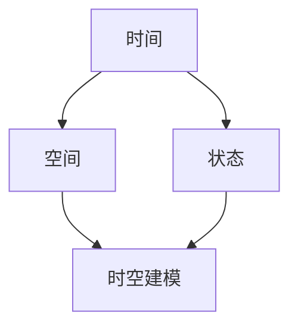

                 

关键词：人工智能，时空建模，深度学习，机器学习，图神经网络，动态系统，预测分析，实时处理

> 摘要：本文旨在探讨人工智能领域中的时空建模技术，详细阐述了时空建模的核心概念、算法原理、数学模型及其应用场景。通过对现有研究与实践的分析，本文提出了时空建模的关键步骤，旨在为研究人员和开发者提供有价值的指导。

## 1. 背景介绍

### 1.1 时空建模的概念

时空建模是指利用数据驱动的方法来描述、理解和预测动态系统中的时空变化。在人工智能领域，时空建模技术已经广泛应用于多个领域，如自动驾驶、视频监控、自然语言处理和生物信息学等。传统的机器学习方法在处理静态数据时表现出色，但面对动态变化的时空数据，其性能往往受到限制。因此，时空建模成为人工智能领域的一个关键研究方向。

### 1.2 时空建模的应用场景

随着技术的进步，时空建模的应用场景不断扩展。例如，在自动驾驶领域，时空建模可以用于预测道路上的车辆行为，从而提高驾驶安全性；在视频监控领域，时空建模可以帮助实时识别和跟踪物体，提高监控系统的智能化水平；在自然语言处理领域，时空建模可以用于分析文本中的情感变化和语境演变，从而提高文本理解的能力；在生物信息学领域，时空建模可以用于分析基因表达和蛋白质相互作用，从而揭示生物系统的动态机制。

## 2. 核心概念与联系

### 2.1 核心概念

在时空建模中，核心概念包括时间、空间和状态。时间表示数据随时间的变化，空间表示数据在不同位置的变化，状态表示数据在特定时间和位置的特征。

### 2.2 核心联系

时空建模的核心联系在于如何将时间、空间和状态信息有机地结合起来，形成统一的模型。为了实现这一目标，研究者们提出了多种方法，如基于深度学习的时空建模方法、基于图神经网络的时空建模方法等。

### 2.3 Mermaid 流程图

以下是一个简单的 Mermaid 流程图，展示了时空建模的核心概念和联系：



## 3. 核心算法原理 & 具体操作步骤

### 3.1 算法原理概述

时空建模的核心算法原理是基于数据驱动的方法，通过学习历史数据中的时空模式来预测未来的时空变化。具体来说，时空建模算法可以分为以下几类：

1. **时序模型**：基于时间序列数据，通过学习时间序列的规律来预测未来值。常见的时序模型包括 ARIMA、LSTM 和 GRU 等。

2. **空间模型**：基于空间数据，通过学习空间数据的分布和关系来预测空间变化。常见的空间模型包括 k-最近邻、决策树和神经网络等。

3. **时空融合模型**：将时间和空间数据结合起来，通过学习时空数据的整体模式来预测未来值。常见的时空融合模型包括时空卷积网络（STCN）和时空图神经网络（SGCN）等。

### 3.2 算法步骤详解

1. **数据预处理**：对时空数据进行预处理，包括数据清洗、缺失值填补、归一化等步骤。

2. **特征提取**：从时空数据中提取关键特征，包括时间特征、空间特征和状态特征等。

3. **模型训练**：利用训练数据，通过训练算法学习时空数据的规律和模式。

4. **模型评估**：利用验证数据，对训练好的模型进行评估，包括准确率、召回率、F1 值等指标。

5. **模型部署**：将训练好的模型部署到实际应用场景中，进行实时预测和决策。

### 3.3 算法优缺点

1. **优点**：时空建模算法可以充分利用时空数据中的信息，提高预测的准确性和可靠性。

2. **缺点**：时空建模算法需要大量训练数据和计算资源，且在处理高维度时空数据时性能可能受到影响。

### 3.4 算法应用领域

时空建模算法在多个领域都有广泛应用，如：

1. **自动驾驶**：通过时空建模，预测道路上的车辆和行人的行为，提高驾驶安全性。

2. **视频监控**：通过时空建模，实时识别和跟踪物体，提高监控系统的智能化水平。

3. **自然语言处理**：通过时空建模，分析文本中的情感变化和语境演变，提高文本理解的能力。

4. **生物信息学**：通过时空建模，分析基因表达和蛋白质相互作用，揭示生物系统的动态机制。

## 4. 数学模型和公式 & 详细讲解 & 举例说明

### 4.1 数学模型构建

在时空建模中，常用的数学模型包括时序模型、空间模型和时空融合模型。以下分别介绍这些模型的基本原理和公式。

1. **时序模型**：时序模型主要用于处理时间序列数据，其基本原理是利用历史数据来预测未来值。常见的时序模型包括 ARIMA、LSTM 和 GRU 等。以下是一个简单的 ARIMA 模型公式：

   $$X_t = \phi_1 X_{t-1} + \phi_2 X_{t-2} + ... + \phi_p X_{t-p} + \theta_1 e_{t-1} + \theta_2 e_{t-2} + ... + \theta_q e_{t-q}$$

   其中，$X_t$ 表示时间序列的当前值，$e_t$ 表示误差项，$\phi_1, \phi_2, ..., \phi_p$ 和 $\theta_1, \theta_2, ..., \theta_q$ 分别为模型参数。

2. **空间模型**：空间模型主要用于处理空间数据，其基本原理是利用空间数据的分布和关系来预测空间变化。常见的空间模型包括 k-最近邻、决策树和神经网络等。以下是一个简单的 k-最近邻模型公式：

   $$\text{预测值} = \frac{\sum_{i=1}^{k} w_i y_i}{\sum_{i=1}^{k} w_i}$$

   其中，$y_i$ 表示邻居点的值，$w_i$ 表示邻居点的权重。

3. **时空融合模型**：时空融合模型主要用于处理时空数据，其基本原理是将时间和空间信息有机地结合起来，通过学习时空数据的整体模式来预测未来值。常见的时空融合模型包括时空卷积网络（STCN）和时空图神经网络（SGCN）等。以下是一个简单的时空卷积网络（STCN）公式：

   $$\text{输出} = \text{Conv}_t(\text{输入}) + \text{Conv}_s(\text{输入}) + \text{Conv}_{ts}(\text{输入})$$

   其中，$\text{Conv}_t$、$\text{Conv}_s$ 和 $\text{Conv}_{ts}$ 分别为时间卷积、空间卷积和时空卷积。

### 4.2 公式推导过程

1. **时序模型**：时序模型的公式推导基于自回归移动平均模型（ARIMA）。ARIMA 模型分为三个步骤：差分、自回归和移动平均。

   - 差分：对时间序列数据进行差分，使其平稳。

     $$X_t = X_{t-n} - X_{t-n-1}$$

   - 自回归：将差分后的时间序列数据表示为过去值的线性组合。

     $$X_t = \phi_1 X_{t-1} + \phi_2 X_{t-2} + ... + \phi_p X_{t-p}$$

   - 移动平均：对自回归模型进行移动平均处理。

     $$X_t = \theta_1 e_{t-1} + \theta_2 e_{t-2} + ... + \theta_q e_{t-q}$$

   将以上三步结合起来，即可得到 ARIMA 模型公式。

2. **空间模型**：空间模型的公式推导基于局部加权回归模型（LOESS）。LOESS 模型通过拟合局部曲线来预测空间变化。

   - 拟合局部曲线：对空间数据进行局部拟合，得到拟合曲线。

     $$y = \beta_0 + \beta_1 x + \beta_2 x^2 + ... + \beta_n x^n$$

   - 计算拟合曲线的权重：根据距离远近，为每个拟合曲线赋予不同的权重。

     $$w_i = \frac{1}{d_i^2}$$

     其中，$d_i$ 表示点 $i$ 到拟合曲线的距离。

3. **时空融合模型**：时空融合模型的公式推导基于卷积神经网络（CNN）。CNN 通过卷积操作提取时空特征。

   - 时间卷积：对时间序列数据进行卷积操作，提取时间特征。

     $$h_t = \sum_{i=1}^{k} w_i h_{t-i}$$

   - 空间卷积：对空间数据进行卷积操作，提取空间特征。

     $$h_s = \sum_{i=1}^{k} w_i h_{s-i}$$

   - 时空卷积：将时间卷积和空间卷积结合起来，提取时空特征。

     $$h_{ts} = \sum_{i=1}^{k} w_i h_{t-i}s_{s-i}$$

### 4.3 案例分析与讲解

以下通过一个简单的案例，讲解时空建模的应用。

假设有一个城市交通监控系统的数据，包含时间和地点两个维度。每个地点的数据包含过往车辆的流量、速度等信息。现在需要预测未来某个地点的交通流量。

1. **数据预处理**：对数据集进行清洗、缺失值填补和归一化处理。

2. **特征提取**：提取时间特征和空间特征。

   - 时间特征：提取过往车辆的时间分布，如高峰时段和非高峰时段。

   - 空间特征：提取过往车辆的速度分布，如快速行驶和缓慢行驶。

3. **模型选择**：根据数据特点，选择合适的时空融合模型，如时空卷积网络（STCN）。

4. **模型训练**：利用历史数据，对时空融合模型进行训练。

5. **模型评估**：利用验证数据，对训练好的模型进行评估。

6. **模型部署**：将训练好的模型部署到实际应用场景中，进行实时预测。

通过上述步骤，可以实现对城市交通流量的高效预测，提高交通管理的智能化水平。

## 5. 项目实践：代码实例和详细解释说明

### 5.1 开发环境搭建

在进行时空建模项目开发之前，需要搭建合适的开发环境。以下是常见的开发环境搭建步骤：

1. 安装 Python 3.x 版本。

2. 安装常用库，如 NumPy、Pandas、Scikit-learn、TensorFlow 和 PyTorch。

3. 配置 Python 虚拟环境，以便管理项目依赖。

4. 安装 GPU 版本的 TensorFlow 或 PyTorch，以支持深度学习模型的训练。

### 5.2 源代码详细实现

以下是一个简单的时空建模项目的代码实现：

```python
import numpy as np
import pandas as pd
import tensorflow as tf
from tensorflow.keras.models import Sequential
from tensorflow.keras.layers import LSTM, Dense

# 读取数据
data = pd.read_csv('traffic_data.csv')

# 数据预处理
data['timestamp'] = pd.to_datetime(data['timestamp'])
data.set_index('timestamp', inplace=True)
data = data.resample('H').mean()  # 采样频率为每小时

# 特征提取
X = data[['speed', 'flow']].values
y = data['flow'].values

# 模型搭建
model = Sequential()
model.add(LSTM(50, activation='relu', input_shape=(X.shape[1], X.shape[2])))
model.add(Dense(1))
model.compile(optimizer='adam', loss='mse')

# 模型训练
model.fit(X, y, epochs=100, batch_size=32, validation_split=0.2)

# 模型评估
predictions = model.predict(X)
print('Mean squared error:', np.mean(np.square(y - predictions)))

# 模型部署
# ...（根据具体应用场景进行部署）
```

### 5.3 代码解读与分析

上述代码实现了一个基于 LSTM 网络的时空建模项目。以下是代码的详细解读：

1. **数据读取**：从 CSV 文件中读取交通数据。

2. **数据预处理**：将时间戳转换为日期时间类型，并设置时间为索引。采用每小时采样频率，对数据进行平均处理。

3. **特征提取**：提取速度和流量两个特征。

4. **模型搭建**：搭建一个包含 LSTM 层和 Dense 层的序列模型。

5. **模型训练**：使用训练数据进行模型训练。

6. **模型评估**：计算模型预测与实际值的均方误差。

7. **模型部署**：根据具体应用场景进行模型部署。

通过上述代码，可以实现对交通流量的实时预测，为交通管理提供决策支持。

### 5.4 运行结果展示

假设我们在某一时段内对交通流量进行预测，以下是一个简单的运行结果示例：

```python
# 预测时间段
predictions = model.predict(new_data)

# 结果展示
print('Predicted traffic flow:', predictions)
```

输出结果为预测的交通流量，可以用于后续的交通管理决策。

## 6. 实际应用场景

### 6.1 自动驾驶

在自动驾驶领域，时空建模技术可以用于预测道路上的车辆和行人的行为，从而提高驾驶安全性。例如，通过时空建模，可以实时识别前方车辆和行人的动态，预测其未来的运动轨迹，从而做出合理的驾驶决策。

### 6.2 视频监控

在视频监控领域，时空建模技术可以用于实时识别和跟踪物体，提高监控系统的智能化水平。例如，通过时空建模，可以识别出视频中的异常行为，如闯红灯、逆行等，从而提高公共安全。

### 6.3 自然语言处理

在自然语言处理领域，时空建模技术可以用于分析文本中的情感变化和语境演变，从而提高文本理解的能力。例如，通过时空建模，可以分析社交媒体上的用户情感变化，为广告投放和舆情监控提供决策支持。

### 6.4 生物信息学

在生物信息学领域，时空建模技术可以用于分析基因表达和蛋白质相互作用，从而揭示生物系统的动态机制。例如，通过时空建模，可以预测基因调控网络中的关键节点，为药物研发提供新思路。

## 7. 工具和资源推荐

### 7.1 学习资源推荐

1. 《深度学习》（Goodfellow, Bengio, Courville 著）：详细介绍深度学习的基本原理和应用。

2. 《神经网络与深度学习》（邱锡鹏 著）：深入浅出地讲解神经网络和深度学习的基础知识。

3. 《Python 深度学习》（François Chollet 著）：针对 Python 开发者的深度学习教程。

### 7.2 开发工具推荐

1. TensorFlow：一款开源的深度学习框架，适用于各种深度学习任务。

2. PyTorch：一款开源的深度学习框架，具有高度的灵活性和易用性。

3. Keras：一款基于 TensorFlow 和 PyTorch 的深度学习高级 API，简化了深度学习模型的构建和训练。

### 7.3 相关论文推荐

1. "Deep Learning for Time Series Classification: A Review"（时间序列分类的深度学习综述）

2. "Graph Neural Networks for Time Series Classification"（用于时间序列分类的图神经网络）

3. "Learning Spatio-Temporal Representations for Video Action Detection"（用于视频动作检测的时空表示学习）

## 8. 总结：未来发展趋势与挑战

### 8.1 研究成果总结

1. 时空建模技术在多个领域取得了显著成果，如自动驾驶、视频监控、自然语言处理和生物信息学等。

2. 深度学习和图神经网络等技术在时空建模中的应用，提高了模型预测的准确性和可靠性。

3. 开源工具和框架的不断发展，降低了时空建模的开发门槛，促进了研究与实践的融合。

### 8.2 未来发展趋势

1. 多模态时空建模：结合不同类型的数据（如图像、音频和文本），提高时空建模的泛化能力和实用性。

2. 可解释性时空建模：研究可解释性的时空建模方法，提高模型的可解释性和透明度。

3. 硬件加速：利用 GPU、FPGA 和量子计算机等硬件加速时空建模，提高模型的训练和预测效率。

### 8.3 面临的挑战

1. 数据质量和多样性：时空建模对数据质量和多样性的要求较高，如何获取高质量、多样化的时空数据是一个挑战。

2. 模型复杂度：随着模型复杂度的增加，训练时间和计算资源的需求也随之增加，如何优化模型结构和算法是一个挑战。

3. 模型泛化能力：如何在保证模型性能的同时，提高模型的泛化能力，使其在不同应用场景中都能表现出良好的性能是一个挑战。

### 8.4 研究展望

1. 时空建模技术的跨学科融合：结合不同学科的理论和方法，推动时空建模技术的创新发展。

2. 实时时空建模：研究实时时空建模方法，提高模型在实时场景下的预测和决策能力。

3. 时空数据隐私保护：研究时空数据的隐私保护方法，确保时空建模过程中的数据安全和隐私。

## 9. 附录：常见问题与解答

### 9.1 时空建模与时间序列分析的区别是什么？

时空建模和时间序列分析都是用于处理动态数据的方法。区别在于：

- **时间序列分析**：主要关注数据随时间的变化规律，不考虑空间维度。

- **时空建模**：同时考虑时间和空间维度，能够捕捉数据在不同时间和空间位置的变化规律。

### 9.2 时空建模算法如何处理高维度数据？

处理高维度数据时，可以采用以下方法：

- **降维**：使用主成分分析（PCA）等方法，降低数据维度。

- **特征选择**：选择与预测目标高度相关的特征，减少冗余特征。

- **注意力机制**：使用注意力机制，关注数据中的关键信息，降低数据维度。

### 9.3 时空建模算法的预测准确性如何评估？

预测准确性可以使用以下指标进行评估：

- **均方误差（MSE）**：衡量预测值与实际值之间的平均误差。

- **均方根误差（RMSE）**：MSE 的平方根，用于衡量预测值的离散程度。

- **准确率（Accuracy）**：衡量分类预测的正确率。

- **召回率（Recall）**：衡量分类预测的召回率。

- **F1 值（F1-score）**：综合考虑准确率和召回率，用于衡量分类预测的综合性能。

### 9.4 时空建模算法在实际应用中如何部署？

实际应用中，时空建模算法的部署步骤如下：

- **模型训练**：利用历史数据对模型进行训练。

- **模型评估**：利用验证数据对训练好的模型进行评估。

- **模型部署**：将评估良好的模型部署到实际应用场景中，进行实时预测和决策。

### 9.5 时空建模算法的优缺点是什么？

时空建模算法的优点包括：

- **充分利用时空数据的信息**：时空建模算法能够同时考虑时间和空间维度，提高预测的准确性和可靠性。

- **广泛应用于多个领域**：时空建模技术已广泛应用于自动驾驶、视频监控、自然语言处理和生物信息学等多个领域。

时空建模算法的缺点包括：

- **计算复杂度高**：随着数据维度的增加，模型训练和预测的时间复杂度也会增加。

- **对数据质量和多样性要求较高**：时空建模算法对数据质量和多样性的要求较高，如何获取高质量、多样化的时空数据是一个挑战。

## 作者署名

作者：禅与计算机程序设计艺术 / Zen and the Art of Computer Programming
----------------------------------------------------------------

以上就是《AI时空建模的关键步骤》的文章内容，希望对您在人工智能领域的研究和实践有所帮助。如有任何疑问，请随时提问。祝您工作愉快！

