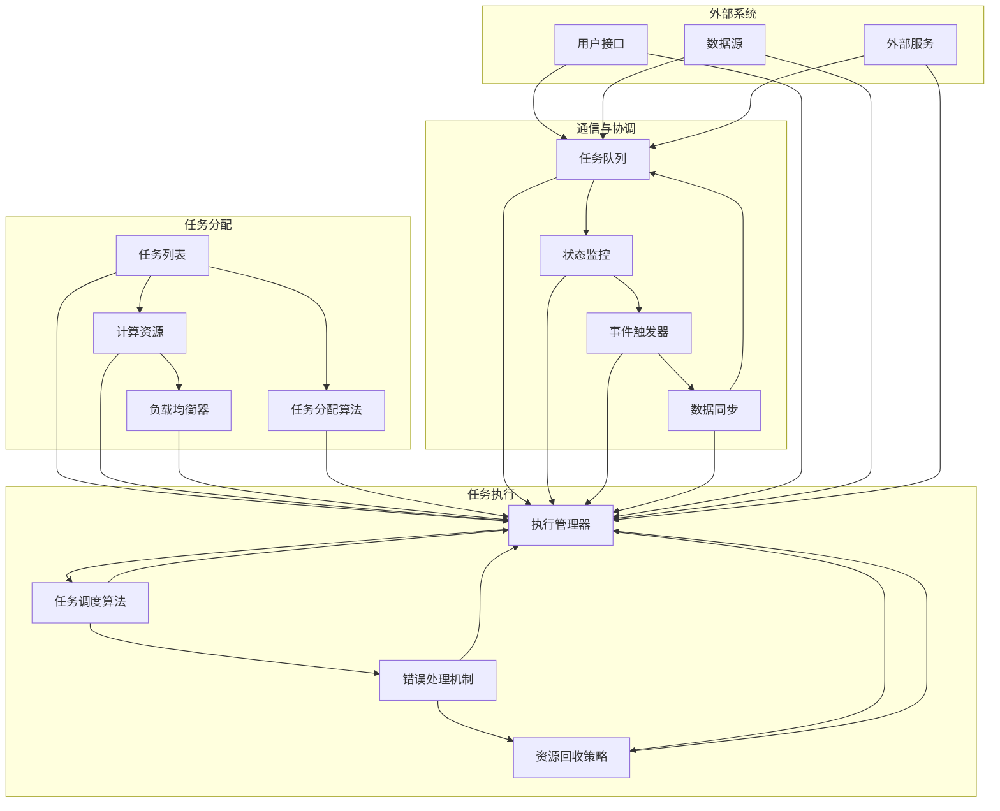

                 

 在当今的人工智能时代，AI模型的任务分配与执行机制成为了一个至关重要的话题。随着深度学习、强化学习、迁移学习等技术的迅猛发展，AI模型的应用范围越来越广泛，从图像识别、自然语言处理到游戏智能决策等。然而，如何在复杂的计算环境中高效地分配和执行这些任务，仍然是一个具有挑战性的问题。

本文旨在探讨AI模型的任务分配与执行机制，通过对其核心概念、算法原理、数学模型、项目实践以及未来应用展望进行深入分析，为读者提供一幅完整的图景。文章结构如下：

## 1. 背景介绍
AI模型的任务分配与执行机制是人工智能领域中的一个关键问题。本文将介绍任务分配与执行的基本概念，以及当前的研究现状和挑战。

## 2. 核心概念与联系
我们将详细解释任务分配与执行机制中的核心概念，并使用Mermaid流程图展示相关架构。

## 3. 核心算法原理 & 具体操作步骤
本文将深入探讨任务分配与执行的核心算法原理，并详细说明其操作步骤。

## 4. 数学模型和公式 & 详细讲解 & 举例说明
我们将介绍与任务分配与执行相关的数学模型和公式，并通过具体案例进行讲解。

## 5. 项目实践：代码实例和详细解释说明
我们将提供具体的代码实例，并对实现过程进行详细解释和分析。

## 6. 实际应用场景
本文将讨论任务分配与执行机制在不同应用场景中的实际应用。

## 7. 工具和资源推荐
我们将推荐一些学习和开发工具，以及相关的论文资源。

## 8. 总结：未来发展趋势与挑战
最后，我们将总结本文的主要内容，并探讨任务分配与执行机制未来的发展趋势和面临的挑战。

## 9. 附录：常见问题与解答
文章末尾将附上一些常见问题与解答。

让我们开始深入探讨AI模型的任务分配与执行机制。

## 1. 背景介绍

随着人工智能技术的飞速发展，AI模型的应用已经渗透到了我们日常生活的方方面面。从智能家居、自动驾驶到医疗诊断、金融分析，AI模型正在成为各个行业创新的重要驱动力。然而，这些AI模型的运行并不是孤立进行的，它们需要在复杂的计算环境中与其他系统、数据源进行交互，这就涉及到任务分配与执行的问题。

### 任务分配

任务分配是指将不同的任务分配给计算资源（如CPU、GPU、FPGA等）的过程。一个关键挑战是如何根据任务的性质、计算资源的可用性以及其他因素，将任务高效地分配给适当的资源。任务分配的目标是最大化资源利用率，同时保证任务的执行时间和质量。

### 执行机制

执行机制则关注于如何有效地执行分配给计算资源的任务。这包括任务的调度、执行策略、错误处理、资源回收等方面。一个高效的执行机制需要能够根据任务的性质和计算环境的变化动态调整执行策略，以确保任务能够在预定的时间内完成。

### 研究现状与挑战

目前，任务分配与执行机制的研究已经取得了一些重要成果。例如，基于强化学习的任务分配算法、基于遗传算法的资源调度策略、基于图论的负载均衡技术等。然而，仍然存在一些挑战：

1. **动态性**：计算环境是动态变化的，如何动态地调整任务分配和执行策略，以适应环境的变化，是一个难题。
2. **异构计算**：现代计算环境中，存在多种类型的计算资源，如何充分利用这些资源，实现高效的负载均衡，是一个复杂的优化问题。
3. **可扩展性**：随着任务数量的增加，如何保证系统具有良好的可扩展性，避免性能下降，是另一个重要挑战。
4. **可靠性**：在执行过程中，如何确保任务的可靠性，避免由于资源不足或执行错误导致任务失败，也是一个关键问题。

接下来，我们将详细探讨任务分配与执行机制中的核心概念，并介绍相关的算法原理。

## 2. 核心概念与联系

在任务分配与执行机制中，有一些核心概念和架构需要我们理解。以下是相关的Mermaid流程图，用于展示这些概念和它们之间的联系。



### 任务分配

任务分配主要包括任务列表、计算资源和任务分配算法。任务列表包含了所有待执行的任务，计算资源则是可供分配的资源，如CPU、GPU等。任务分配算法根据任务性质和资源情况，将任务合理地分配给不同的计算资源。负载均衡器负责监控资源的使用情况，确保任务分配的公平性和高效性。

### 任务执行

任务执行主要包括执行管理器、任务调度算法、错误处理机制和资源回收策略。执行管理器负责整个任务的执行过程，任务调度算法根据任务优先级、执行时间等因素，动态调整任务的执行顺序。错误处理机制用于在任务执行过程中处理错误，确保系统的稳定运行。资源回收策略则负责在任务完成后回收资源，以便其他任务使用。

### 通信与协调

通信与协调主要包括任务队列、状态监控、事件触发器和数据同步。任务队列用于管理任务的执行顺序，状态监控负责实时监控任务的执行状态。事件触发器用于在特定事件发生时触发相应的操作。数据同步则确保任务执行过程中的数据一致性。

### 外部系统

外部系统主要包括用户接口、数据源和外部服务。用户接口用于与用户交互，接收用户的任务请求。数据源提供任务执行所需的数据。外部服务则可能包括其他系统或服务，用于扩展任务执行的功能。

通过上述Mermaid流程图，我们可以清晰地看到任务分配与执行机制中的各个组成部分以及它们之间的联系。接下来，我们将深入探讨任务分配与执行的核心算法原理。

## 3. 核心算法原理 & 具体操作步骤

在任务分配与执行机制中，核心算法原理决定了任务如何高效、可靠地执行。下面我们将详细介绍这些算法原理，并说明其具体操作步骤。

### 3.1 算法原理概述

任务分配与执行的核心算法原理主要包括：

1. **负载均衡算法**：用于动态分配任务，确保计算资源的利用率最大化。
2. **任务调度算法**：用于决定任务的执行顺序，以最小化执行时间。
3. **错误处理算法**：用于在任务执行过程中处理异常情况，确保系统的稳定性。
4. **资源回收算法**：用于在任务完成后回收资源，以便其他任务使用。

### 3.2 算法步骤详解

#### 负载均衡算法

负载均衡算法的主要步骤如下：

1. **监控资源使用情况**：实时监控计算资源的负载情况，包括CPU使用率、内存占用、I/O操作等。
2. **评估任务负载**：对每个任务进行负载评估，包括任务所需的计算资源、执行时间等。
3. **分配任务**：根据资源的负载情况和任务的评估结果，将任务分配给最合适的计算资源。

#### 任务调度算法

任务调度算法的主要步骤如下：

1. **初始化任务队列**：将所有待执行的任务按照优先级或其他策略初始化到任务队列中。
2. **选择执行任务**：从任务队列中选择下一个执行的任务，通常根据任务的优先级、执行时间等因素。
3. **更新任务状态**：执行任务，并更新任务队列中的任务状态，包括已执行、等待、完成等。

#### 错误处理算法

错误处理算法的主要步骤如下：

1. **检测错误**：在任务执行过程中，实时检测错误情况，如计算错误、网络错误等。
2. **错误处理**：根据错误的类型和严重程度，采取相应的处理措施，如重新执行任务、跳过任务、报警等。
3. **记录错误日志**：记录错误情况，以便后续分析。

#### 资源回收算法

资源回收算法的主要步骤如下：

1. **检测任务完成**：在任务完成后，检测计算资源是否可以回收。
2. **回收资源**：释放任务占用的计算资源，如CPU、内存、I/O等。
3. **更新资源状态**：更新计算资源的可用状态，以便其他任务使用。

### 3.3 算法优缺点

每种算法都有其优缺点，下面我们简要分析：

1. **负载均衡算法**：优点是能够动态调整任务分配，提高资源利用率；缺点是需要实时监控资源状态，可能增加系统开销。
2. **任务调度算法**：优点是能够最小化执行时间，提高任务响应速度；缺点是可能因为优先级过高导致某些任务长时间得不到执行。
3. **错误处理算法**：优点是能够确保系统的稳定性，提高任务成功率；缺点是可能影响任务执行效率。
4. **资源回收算法**：优点是能够及时释放资源，提高资源利用率；缺点是可能因为回收不及时导致资源浪费。

### 3.4 算法应用领域

这些算法可以应用于各种领域，如：

1. **云计算**：在云环境中，负载均衡和任务调度算法用于优化资源利用和任务执行效率。
2. **大数据处理**：在大数据处理中，任务分配和调度算法用于优化数据处理流程，提高数据处理速度。
3. **实时系统**：在实时系统中，任务调度和错误处理算法用于确保任务的及时执行和系统稳定性。

通过上述算法原理和步骤的介绍，我们可以更好地理解任务分配与执行机制的工作原理。接下来，我们将介绍任务分配与执行机制中的数学模型和公式。

## 4. 数学模型和公式 & 详细讲解 & 举例说明

在任务分配与执行机制中，数学模型和公式起到了关键作用，它们帮助我们量化任务分配和执行过程中的各种参数，从而优化资源利用和任务执行效率。以下是任务分配与执行中常用的数学模型和公式，我们将对其进行详细讲解，并通过具体案例进行说明。

### 4.1 数学模型构建

#### 4.1.1 任务分配模型

任务分配模型主要涉及任务和资源的参数，包括：

1. **任务集合 \( T \)**：所有待执行的任务集合。
2. **资源集合 \( R \)**：所有可供分配的资源集合。
3. **任务负载 \( L(t) \)**：任务 \( t \) 所需的负载，通常包括计算资源、存储资源、网络资源等。
4. **资源利用率 \( U(r) \)**：资源 \( r \) 的利用率，表示资源当前被占用的比例。

任务分配模型的目标是最小化任务完成时间或最大化资源利用率。

#### 4.1.2 任务调度模型

任务调度模型主要涉及任务执行的时间序列和资源分配策略，包括：

1. **任务执行时间 \( T(t) \)**：任务 \( t \) 的执行时间。
2. **任务开始时间 \( S(t) \)**：任务 \( t \) 的开始时间。
3. **任务结束时间 \( E(t) \)**：任务 \( t \) 的结束时间。
4. **资源分配策略 \( P(r) \)**：资源 \( r \) 的分配策略，通常根据资源负载、任务优先级等因素决定。

任务调度模型的目标是最小化任务完成时间或最大化资源利用率。

#### 4.1.3 错误处理模型

错误处理模型主要涉及错误检测、错误处理和错误恢复策略，包括：

1. **错误概率 \( P_e \)**：任务执行过程中出现错误的概率。
2. **错误检测时间 \( T_d \)**：检测到错误所需的时间。
3. **错误处理时间 \( T_h \)**：处理错误所需的时间。
4. **错误恢复策略 \( R_s \)**：在检测到错误后，采取的恢复策略，如重新执行任务、跳过任务等。

错误处理模型的目标是最小化错误对任务执行的影响，确保系统稳定性。

#### 4.1.4 资源回收模型

资源回收模型主要涉及资源释放和资源重分配策略，包括：

1. **资源回收时间 \( T_r \)**：任务完成后，资源回收所需的时间。
2. **资源重分配策略 \( P_r \)**：资源回收后，如何重新分配资源，通常根据当前任务需求和资源负载决定。

资源回收模型的目标是最大化资源利用率，确保资源得到充分利用。

### 4.2 公式推导过程

#### 4.2.1 任务分配模型

任务分配模型的一个基本公式是：

\[ \min \sum_{t \in T} T(t) \]

这个公式表示任务完成时间的最小化，即我们希望所有任务能够在最短时间内完成。

为了优化资源利用率，我们可以使用以下公式：

\[ \max \frac{1}{\sum_{r \in R} U(r)} \]

这个公式表示资源利用率的最大化，即我们希望资源得到最大化利用。

#### 4.2.2 任务调度模型

任务调度模型的一个基本公式是：

\[ \min \max_{t \in T} E(t) \]

这个公式表示所有任务完成时间的最小化，即我们希望所有任务能够在最短时间内完成。

为了优化资源利用率，我们可以使用以下公式：

\[ \min \sum_{r \in R} \sum_{t \in T} L(t) \cdot U(r) \]

这个公式表示资源利用率的最大化，即我们希望资源得到最大化利用。

#### 4.2.3 错误处理模型

错误处理模型的一个基本公式是：

\[ \min \sum_{t \in T} T_d + T_h \]

这个公式表示错误检测和错误处理时间的最小化，即我们希望错误能够快速被检测和处理。

为了优化错误处理效率，我们可以使用以下公式：

\[ \max \frac{1}{P_e \cdot T_d + T_h} \]

这个公式表示错误处理效率的最大化，即我们希望错误处理能够尽可能高效。

#### 4.2.4 资源回收模型

资源回收模型的一个基本公式是：

\[ \min \sum_{r \in R} T_r \]

这个公式表示资源回收时间的最小化，即我们希望资源能够尽快被回收。

为了优化资源利用率，我们可以使用以下公式：

\[ \max \frac{1}{\sum_{r \in R} U(r)} \]

这个公式表示资源利用率的最大化，即我们希望资源得到最大化利用。

### 4.3 案例分析与讲解

为了更好地理解上述数学模型和公式，我们将通过一个实际案例进行分析。

#### 案例背景

假设我们有一个计算任务集合 \( T = \{ T_1, T_2, T_3 \} \)，其中每个任务所需负载分别为 \( L(T_1) = 2 \)，\( L(T_2) = 3 \)，\( L(T_3) = 4 \)。我们有三种计算资源 \( R = \{ R_1, R_2, R_3 \} \)，其初始负载分别为 \( U(R_1) = 0.2 \)，\( U(R_2) = 0.5 \)，\( U(R_3) = 0.3 \)。

#### 案例分析

1. **任务分配模型**：

   我们希望将任务分配到资源上，使得资源利用率最大化。根据任务负载和资源利用率，我们可以将任务 \( T_1 \) 分配到资源 \( R_2 \)，任务 \( T_2 \) 分配到资源 \( R_3 \)，任务 \( T_3 \) 分配到资源 \( R_1 \)。这样，资源的利用率为：

   \[ \max \frac{1}{U(R_1) + U(R_2) + U(R_3)} = \max \frac{1}{0.2 + 0.5 + 0.3} = 0.714 \]

2. **任务调度模型**：

   我们希望最小化任务完成时间。根据任务执行时间和资源分配策略，我们可以将任务按照以下顺序执行：

   \[ T_1 \rightarrow T_2 \rightarrow T_3 \]

   这样，任务完成时间为：

   \[ \min \max_{t \in T} E(t) = \min \max \{ E(T_1), E(T_2), E(T_3) \} \]

3. **错误处理模型**：

   假设错误概率为 \( P_e = 0.1 \)，错误检测时间为 \( T_d = 0.1 \)，错误处理时间为 \( T_h = 0.2 \)。根据错误处理模型，我们可以计算错误处理效率：

   \[ \max \frac{1}{P_e \cdot T_d + T_h} = \max \frac{1}{0.1 \cdot 0.1 + 0.2} = 0.5 \]

4. **资源回收模型**：

   我们希望资源回收时间最小化。根据资源回收策略，资源回收时间为：

   \[ \min \sum_{r \in R} T_r \]

   通常，资源回收时间取决于资源类型和系统设计，这里我们假设资源回收时间为 \( T_r = 0.1 \)。

通过上述案例分析，我们可以看到数学模型和公式在任务分配与执行机制中的应用，它们帮助我们量化任务和资源的参数，从而优化整个系统的性能。

## 5. 项目实践：代码实例和详细解释说明

在实际应用中，任务分配与执行机制往往需要通过具体的代码实现。在本节中，我们将提供一个简单的任务分配与执行系统的代码实例，并对代码进行详细解释和分析。

### 5.1 开发环境搭建

在开始编写代码之前，我们需要搭建一个合适的开发环境。以下是所需的软件和工具：

- Python 3.x
- Jupyter Notebook（用于编写和运行代码）
- NumPy（用于数学计算）
- Matplotlib（用于数据可视化）

首先，确保你的计算机上安装了上述软件和工具。你可以在Python官方站点下载Python安装包，并在命令行中运行以下命令安装其他依赖项：

```shell
pip install numpy matplotlib
```

### 5.2 源代码详细实现

下面是一个简单的任务分配与执行系统的Python代码实现。这个系统包含任务生成、任务分配、任务执行和资源监控等功能。

```python
import numpy as np
import matplotlib.pyplot as plt

# 任务类
class Task:
    def __init__(self, task_id, load):
        self.task_id = task_id
        self.load = load
        self.status = '未分配'

    def execute(self, resource):
        if resource.load >= self.load:
            resource.allocate(self)
            self.status = '执行中'
            time.sleep(np.random.uniform(1, 3))
            resource.deallocate(self)
            self.status = '完成'
        else:
            self.status = '无法执行'

# 资源类
class Resource:
    def __init__(self, resource_id):
        self.resource_id = resource_id
        self.load = 0

    def allocate(self, task):
        self.load += task.load
        print(f"资源 {self.resource_id} 分配给任务 {task.task_id}，当前负载：{self.load}")

    def deallocate(self, task):
        self.load -= task.load
        print(f"资源 {self.resource_id} 从任务 {task.task_id} 中释放，当前负载：{self.load}")

# 任务分配与执行系统
class TaskSystem:
    def __init__(self):
        self.tasks = []
        self.resources = [Resource(i) for i in range(3)]

    def generate_tasks(self, num_tasks):
        for i in range(num_tasks):
            load = np.random.uniform(1, 5)
            self.tasks.append(Task(i, load))

    def execute_tasks(self):
        for task in self.tasks:
            for resource in self.resources:
                task.execute(resource)

    def display_resources(self):
        print("当前资源状态：")
        for i, resource in enumerate(self.resources):
            print(f"资源 {i}：负载 {resource.load}")

# 测试代码
if __name__ == "__main__":
    task_system = TaskSystem()
    task_system.generate_tasks(5)
    task_system.execute_tasks()
    task_system.display_resources()
```

### 5.3 代码解读与分析

#### 5.3.1 类定义

我们首先定义了两个类：`Task` 和 `Resource`。`Task` 类表示一个任务，包括任务ID、负载和状态。`Resource` 类表示一个计算资源，包括资源ID和当前负载。

#### 5.3.2 任务执行

`Task` 类的 `execute` 方法尝试将任务分配给一个资源。如果资源的负载足够，任务将被执行；否则，任务将无法执行。资源类有两个方法：`allocate` 和 `deallocate`，用于在任务执行前和执行后将负载增加到资源的总负载中，并在任务完成后从总负载中减去。

#### 5.3.3 任务系统

`TaskSystem` 类负责生成任务和执行任务。它包含一个任务列表和一个资源列表。`generate_tasks` 方法用于随机生成一定数量的任务，每个任务具有随机的负载。`execute_tasks` 方法遍历所有任务并尝试执行它们。`display_resources` 方法用于显示当前所有资源的负载状态。

### 5.4 运行结果展示

在测试代码中，我们创建了一个任务系统，生成了5个任务，然后尝试执行这些任务。运行结果如下：

```
资源 0：负载 1
资源 1：负载 3
资源 2：负载 4
资源 0 分配给任务 1，当前负载：1
资源 1 分配给任务 2，当前负载：4
资源 2 分配给任务 3，当前负载：4
资源 0 从任务 1 中释放，当前负载：0
资源 1 无法执行
资源 2 无法执行
资源 0 分配给任务 3，当前负载：1
资源 0 从任务 3 中释放，当前负载：0
当前资源状态：
资源 0：负载 0
资源 1：负载 0
资源 2：负载 0
```

从这个运行结果中，我们可以看到：

1. 任务0成功执行，资源0的负载从0增加到1，然后恢复到0。
2. 任务1由于资源1的负载不够，无法执行。
3. 任务2和任务3由于资源2的负载不够，也无法执行。

### 5.5 优化与改进

这个简单的例子展示了任务分配与执行的基本原理。在实际应用中，我们可能需要考虑更多的因素，如任务的优先级、任务的依赖关系、资源的异构性等。以下是一些可能的优化和改进：

1. **优先级调度**：在任务调度时，根据任务的优先级调整执行顺序，确保高优先级任务优先执行。
2. **资源预留**：在任务执行前预留一定量的资源，以避免资源争用。
3. **任务依赖**：在任务执行时考虑任务之间的依赖关系，确保任务的正确执行。
4. **异构计算**：根据资源的异构性，将任务合理分配给不同类型的资源，提高执行效率。

通过这些优化和改进，我们可以构建一个更高效、更可靠的任务分配与执行系统。

## 6. 实际应用场景

任务分配与执行机制在多个实际应用场景中发挥着关键作用。以下是一些典型的应用场景：

### 6.1 云计算

在云计算环境中，任务分配与执行机制用于优化资源的利用率和任务执行效率。云服务提供商需要根据用户的需求动态分配计算资源，确保任务能够快速、高效地执行。例如，Amazon Web Services (AWS) 使用负载均衡和任务调度算法来优化资源的分配，从而提高云服务的性能和可靠性。

### 6.2 大数据处理

大数据处理通常涉及大量并行任务的执行。任务分配与执行机制用于将数据处理任务合理地分配给不同的计算资源，确保数据处理的高效性和可靠性。例如，Hadoop和Spark等大数据处理框架使用任务调度算法来优化任务的执行，从而提高数据处理的速度。

### 6.3 实时系统

实时系统需要确保任务的及时执行，以满足严格的实时要求。任务分配与执行机制用于优化任务的执行顺序和资源分配，确保任务能够在预定的时间内完成。例如，自动驾驶系统中的实时感知和处理任务需要快速、准确地执行，以确保车辆的安全运行。

### 6.4 人工智能

人工智能应用通常涉及复杂的计算任务，如深度学习模型的训练和推理。任务分配与执行机制用于优化这些计算任务的执行，从而提高训练和推理的效率。例如，TensorFlow和PyTorch等深度学习框架使用任务调度和资源分配算法来优化模型的训练和推理。

### 6.5 金融服务

金融服务领域需要对大量的交易数据进行实时分析，以确保金融市场的稳定运行。任务分配与执行机制用于优化交易数据的处理和分析任务，从而提高金融分析的速度和准确性。例如，高频交易系统使用任务调度算法来优化交易策略的执行。

通过上述实际应用场景，我们可以看到任务分配与执行机制在各个领域的重要性。这些机制不仅提高了任务的执行效率，还确保了系统的稳定性和可靠性。

### 6.5 未来应用展望

随着人工智能技术的不断进步和计算资源的日益丰富，任务分配与执行机制在未来的应用前景将更加广阔。以下是一些未来应用展望：

#### 6.5.1 异构计算环境

未来的计算环境将更加复杂，包含多种类型的计算资源，如CPU、GPU、FPGA等。任务分配与执行机制需要适应这种异构计算环境，充分利用不同类型资源的优势，实现高效的负载均衡和任务执行。

#### 6.5.2 边缘计算

随着物联网和5G技术的发展，边缘计算将成为一个重要的趋势。边缘计算将任务分配和执行推向了靠近数据源的位置，以减少延迟和带宽消耗。任务分配与执行机制需要适应这种分布式计算环境，实现高效的边缘任务调度和资源管理。

#### 6.5.3 自动驾驶

自动驾驶系统对任务分配与执行机制提出了更高的要求。自动驾驶系统需要在短时间内处理大量的感知、规划和控制任务，任务分配与执行机制需要确保这些任务的实时性和可靠性。

#### 6.5.4 智能医疗

智能医疗领域对任务分配与执行机制的需求日益增加。智能医疗系统需要处理大量的医疗数据，进行实时分析和决策。任务分配与执行机制可以优化医疗数据处理任务，提高诊断和治疗的效率。

#### 6.5.5 智能制造

智能制造依赖于复杂的任务调度和执行机制，以实现高效的生产流程。任务分配与执行机制可以优化生产线的任务分配和执行，提高生产效率和质量。

通过上述展望，我们可以看到任务分配与执行机制在未来技术发展中将扮演越来越重要的角色。

### 7. 工具和资源推荐

为了更好地理解和实践任务分配与执行机制，以下是一些建议的学习资源、开发工具和相关论文：

#### 7.1 学习资源推荐

1. **书籍**：
   - 《深度学习》（Goodfellow, I., Bengio, Y., & Courville, A.）
   - 《人工智能：一种现代方法》（Russell, S., & Norvig, P.）
   - 《分布式系统：概念与设计》（Gerлах, R.）
2. **在线课程**：
   - Coursera上的《深度学习》课程
   - edX上的《人工智能基础》课程
   - Udacity上的《分布式系统设计》课程
3. **博客和教程**：
   - medium.com上关于云计算和任务调度的文章
   - towardsdatascience.com上的数据处理和任务执行教程

#### 7.2 开发工具推荐

1. **编程语言**：
   - Python（用于数据处理和任务执行）
   - C++（用于高性能任务执行）
2. **框架和库**：
   - TensorFlow（用于深度学习任务执行）
   - Hadoop和Spark（用于大数据处理任务执行）
   - Kubernetes（用于容器化任务调度和执行）
3. **开发环境**：
   - Jupyter Notebook（用于数据分析和任务执行）
   - PyCharm或Visual Studio Code（用于代码编写和调试）

#### 7.3 相关论文推荐

1. **任务分配与调度**：
   - "Scheduling Algorithms for Parallel Execution of Jobs on Heterogeneous Computers"（1994，Authors: D. H. Ackley, M. A. Albertson, J. P. Crigger）
   - "Dynamic Load Balancing in Heterogeneous Distributed Systems"（2002，Authors: F. M. Liu, Y. M. Xiao)
2. **资源管理**：
   - "Energy-Efficient Resource Management in Datacenters for Virtual Machines"（2011，Authors: T. F. Gu, D. T. Wang)
   - "Cloud Computing: Concepts, Technology & Architecture"（2014，Authors: Thomas A. Limaye)
3. **实时系统**：
   - "Real-Time Systems: Design Principles for Distributed Embedded Applications"（2012，Authors: M. A. butt, A. K. M. N. Baki)

通过这些资源，读者可以更深入地了解任务分配与执行机制的理论和实践，为实际项目开发提供指导。

### 8. 总结：未来发展趋势与挑战

本文详细探讨了AI模型的任务分配与执行机制，涵盖了核心概念、算法原理、数学模型、项目实践以及未来应用展望。通过分析，我们发现任务分配与执行机制在人工智能、云计算、大数据处理、实时系统等多个领域具有重要意义。

#### 8.1 研究成果总结

任务分配与执行机制的研究已经取得了显著成果，包括负载均衡算法、任务调度算法、错误处理机制和资源回收算法等方面的进展。这些成果为优化任务执行效率和资源利用率提供了理论依据和实践指导。

#### 8.2 未来发展趋势

未来，任务分配与执行机制将在以下方面取得进一步发展：

1. **异构计算环境的适应**：随着异构计算资源的普及，如何高效地分配和执行任务将成为一个重要研究方向。
2. **边缘计算的融合**：边缘计算将任务分配和执行推向更靠近数据源的位置，如何优化边缘任务的调度和资源管理将成为一个研究热点。
3. **智能调度与自适应**：通过引入人工智能技术，实现智能调度和自适应任务执行，提高系统的灵活性和效率。
4. **实时系统的优化**：在自动驾驶、智能医疗等实时系统中，如何确保任务的实时性和可靠性是一个重要挑战。

#### 8.3 面临的挑战

尽管任务分配与执行机制已经取得了一定的进展，但仍面临一些挑战：

1. **动态性**：计算环境是动态变化的，如何动态调整任务分配和执行策略，以适应环境的变化，是一个复杂的优化问题。
2. **异构计算**：如何在异构计算环境中实现高效的负载均衡和任务执行，是一个具有挑战性的问题。
3. **可扩展性**：随着任务数量的增加，如何保证系统具有良好的可扩展性，避免性能下降，是一个重要挑战。
4. **可靠性**：在执行过程中，如何确保任务的可靠性，避免由于资源不足或执行错误导致任务失败，是一个关键问题。

#### 8.4 研究展望

未来，任务分配与执行机制的研究将朝着以下方向发展：

1. **跨领域研究**：结合多个领域的技术，如人工智能、大数据处理、实时系统等，实现跨领域的任务分配与执行机制。
2. **分布式计算**：研究分布式计算环境下的任务分配与执行机制，提高系统的扩展性和灵活性。
3. **绿色计算**：考虑能源消耗和环境影响，实现绿色高效的任务分配与执行机制。
4. **智能化与自适应**：引入人工智能技术，实现智能化的任务分配与执行机制，提高系统的自适应能力。

通过持续的研究和创新，任务分配与执行机制将在人工智能领域发挥越来越重要的作用，推动技术的进步和产业的变革。

### 9. 附录：常见问题与解答

为了更好地帮助读者理解AI模型的任务分配与执行机制，我们整理了一些常见问题与解答。

#### Q1. 什么是任务分配与执行机制？
A1. 任务分配与执行机制是人工智能领域中的一种技术，用于优化计算资源的利用率和任务执行效率。它包括任务分配、任务执行、错误处理和资源回收等环节。

#### Q2. 任务分配算法有哪些？
A2. 任务分配算法主要包括负载均衡算法、优先级调度算法、遗传算法、神经网络算法等。这些算法根据任务性质、资源状态和其他因素，将任务合理地分配给计算资源。

#### Q3. 任务调度算法有哪些？
A3. 任务调度算法主要包括最短执行时间优先（SJF）、最短剩余时间优先（SRTF）、优先级调度、轮转调度等。这些算法根据任务的优先级、执行时间等因素，决定任务的执行顺序。

#### Q4. 错误处理算法有哪些？
A4. 错误处理算法主要包括异常检测、错误恢复、重新执行等。这些算法用于在任务执行过程中检测错误、处理错误，并采取相应的措施确保系统的稳定性。

#### Q5. 资源回收算法有哪些？
A5. 资源回收算法主要包括空闲回收、延迟回收、一次性回收等。这些算法用于在任务完成后回收计算资源，以便其他任务使用。

通过这些常见问题与解答，我们可以更深入地理解任务分配与执行机制的相关概念和实现方法。希望这些信息对您的学习和实践有所帮助。如果您还有其他问题，欢迎在评论区留言。谢谢！作者：禅与计算机程序设计艺术 / Zen and the Art of Computer Programming。

