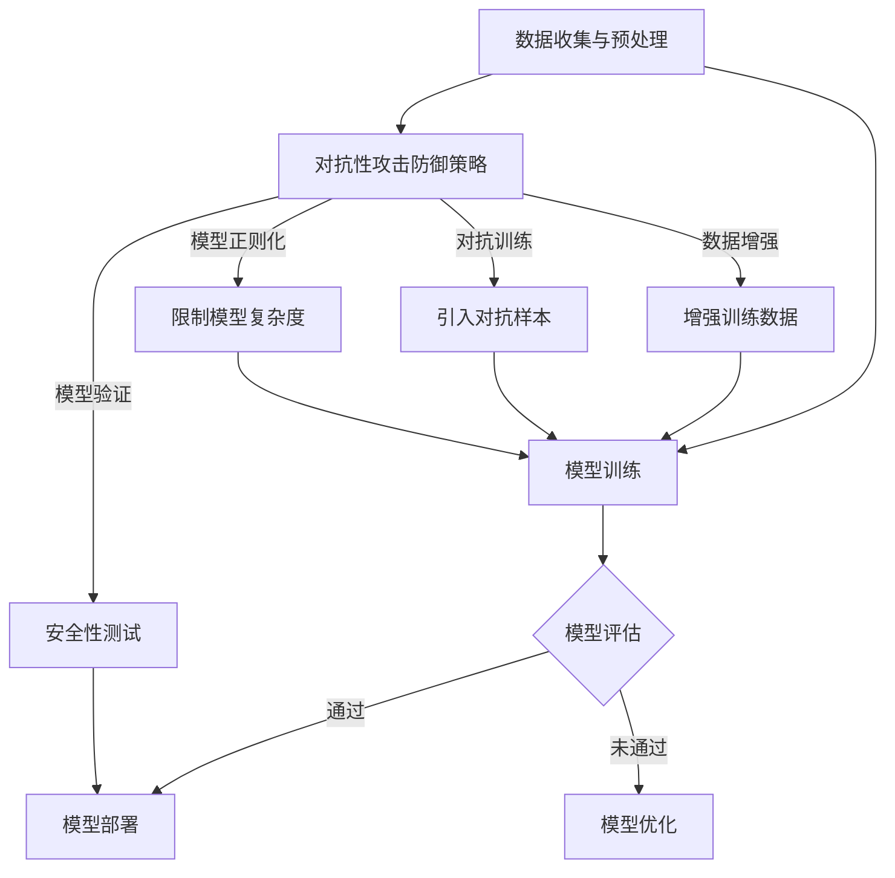

                 

关键词：AI模型安全性、对抗性攻击、防御策略、深度学习、神经网络、模型安全性测试

> 摘要：随着人工智能技术的发展，AI模型在各个领域的应用越来越广泛。然而，AI模型的安全性问题也日益突出，特别是对抗性攻击（Adversarial Attack）的威胁。本文将深入探讨AI模型的安全性，分析对抗性攻击的原理、类型和防御策略，并提出一些实用的防御方法，以期为提高AI模型的安全性提供参考。

## 1. 背景介绍

人工智能（AI）技术已经成为当今科技发展的重要驱动力。从机器学习、深度学习到自然语言处理、计算机视觉，AI技术在各个领域都取得了显著的成果。然而，随着AI技术的广泛应用，AI模型的安全性也成为一个不可忽视的问题。特别是在深度学习和神经网络领域，对抗性攻击（Adversarial Attack）的威胁日益严重，对AI模型的安全性和可靠性构成了严重挑战。

对抗性攻击是指通过在输入数据中添加微小的、难以察觉的扰动，使得原本正确的预测结果发生错误。这些扰动通常是不可察觉的，但足以欺骗AI模型，导致模型输出错误的结论。对抗性攻击不仅威胁到AI模型的安全性和可靠性，还可能对现实世界的安全、隐私和财产造成严重的影响。

本文旨在分析AI模型的安全性，特别是对抗性攻击的原理、类型和防御策略，以期为提高AI模型的安全性提供参考。文章结构如下：

1. 背景介绍
2. 核心概念与联系
3. 核心算法原理与具体操作步骤
4. 数学模型和公式及详细讲解
5. 项目实践：代码实例和详细解释说明
6. 实际应用场景
7. 工具和资源推荐
8. 总结：未来发展趋势与挑战
9. 附录：常见问题与解答

## 2. 核心概念与联系

### 2.1 AI模型的安全性

AI模型的安全性是指AI模型在执行预测任务时，能够抵御各种攻击（如对抗性攻击）的能力。一个安全的AI模型应该具备以下特点：

- **鲁棒性**：能够抵御外部扰动，如噪声、缺失值和异常值等，确保模型输出的正确性。
- **透明性**：模型的结构和参数应当清晰透明，以便理解和调试。
- **隐私保护**：保护用户数据的隐私，防止数据泄露或滥用。

### 2.2 对抗性攻击

对抗性攻击（Adversarial Attack）是指通过在输入数据中添加微小的、难以察觉的扰动，使得原本正确的预测结果发生错误。对抗性攻击的主要目标是欺骗AI模型，使其输出错误的结论。

### 2.3 防御策略

防御策略是指针对对抗性攻击采取的一系列措施，以提高AI模型的安全性。常见的防御策略包括：

- **数据增强**：通过在训练数据中添加噪声、扭曲等扰动，提高模型的鲁棒性。
- **对抗训练**：在训练过程中，引入对抗性样本，使模型适应对抗性扰动。
- **模型正则化**：通过添加正则化项，限制模型的复杂度，减少过拟合。
- **模型验证**：在模型部署前，对模型进行安全性和鲁棒性测试，确保模型能够抵御对抗性攻击。

### 2.4 Mermaid 流程图

以下是AI模型安全性的 Mermaid 流程图：



## 3. 核心算法原理与具体操作步骤

### 3.1 算法原理概述

防御对抗性攻击的核心算法主要包括数据增强、对抗训练、模型正则化和模型验证等。这些算法的基本原理如下：

- **数据增强**：通过在训练数据中添加噪声、扭曲等扰动，提高模型的鲁棒性。
- **对抗训练**：在训练过程中，引入对抗性样本，使模型适应对抗性扰动。
- **模型正则化**：通过添加正则化项，限制模型的复杂度，减少过拟合。
- **模型验证**：对模型进行安全性和鲁棒性测试，确保模型能够抵御对抗性攻击。

### 3.2 算法步骤详解

以下是防御对抗性攻击的详细步骤：

#### 3.2.1 数据增强

1. **噪声添加**：在训练数据中添加高斯噪声、椒盐噪声等。
2. **图像扭曲**：对图像进行旋转、缩放、剪切等操作。
3. **数据重采样**：对训练数据进行重复采样，增加训练样本的多样性。

#### 3.2.2 对抗训练

1. **生成对抗性样本**：使用生成对抗网络（GAN）等方法生成对抗性样本。
2. **更新模型参数**：在训练过程中，交替更新模型参数和对抗性样本，使模型适应对抗性扰动。

#### 3.2.3 模型正则化

1. **L1正则化**：在损失函数中添加L1范数项。
2. **L2正则化**：在损失函数中添加L2范数项。
3. **Dropout**：在训练过程中，随机丢弃部分神经元，防止过拟合。

#### 3.2.4 模型验证

1. **交叉验证**：使用交叉验证方法对模型进行评估，确保模型在不同数据集上的表现一致。
2. **对抗性测试**：在测试数据中引入对抗性样本，评估模型的鲁棒性和安全性。

### 3.3 算法优缺点

#### 优点

- **提高模型鲁棒性**：通过数据增强和对抗训练，模型能够更好地适应外部扰动，提高鲁棒性。
- **减少过拟合**：通过模型正则化，限制模型复杂度，减少过拟合。
- **安全性测试**：通过模型验证，确保模型在真实场景中能够抵御对抗性攻击。

#### 缺点

- **计算成本**：对抗训练和模型验证需要大量计算资源，可能增加训练时间和成本。
- **训练难度**：对抗训练和模型验证对模型设计者和使用者有较高的要求，需要具备一定的专业知识和技能。

### 3.4 算法应用领域

防御对抗性攻击算法可以应用于各种领域，如：

- **计算机视觉**：如图像分类、目标检测等。
- **自然语言处理**：如文本分类、情感分析等。
- **医疗诊断**：如疾病预测、医学图像分析等。
- **金融领域**：如风险评估、欺诈检测等。

## 4. 数学模型和公式及详细讲解

### 4.1 数学模型构建

对抗性攻击和防御算法的数学模型主要包括损失函数、优化算法等。以下是一些常用的数学模型：

#### 4.1.1 损失函数

- **交叉熵损失函数**：用于分类任务，公式如下：
  $$ L_{CE} = -\sum_{i=1}^{n} y_{i} \log (p_{i}) $$
  其中，$y_{i}$ 是标签，$p_{i}$ 是模型输出的概率。

- **对抗性损失函数**：用于对抗训练，公式如下：
  $$ L_{AA} = \sum_{i=1}^{n} \lambda (L_{CE}(x_i, \hat{y}_i) - L_{CE}(x_i + \epsilon, \hat{y}_i)) $$
  其中，$\epsilon$ 是对抗性扰动，$\lambda$ 是平衡参数。

#### 4.1.2 优化算法

- **梯度下降**：用于模型训练，公式如下：
  $$ \theta_{t+1} = \theta_{t} - \alpha \nabla_{\theta} L(\theta) $$
  其中，$\theta$ 是模型参数，$\alpha$ 是学习率。

- **动量梯度下降**：用于提高梯度下降的收敛速度，公式如下：
  $$ \theta_{t+1} = \theta_{t} - \alpha \nabla_{\theta} L(\theta) + \beta (\theta_{t} - \theta_{t-1}) $$
  其中，$\beta$ 是动量参数。

### 4.2 公式推导过程

以下是对抗性损失函数的推导过程：

1. **对抗性扰动**：对于输入样本 $x_i$，添加对抗性扰动 $\epsilon$，得到新的输入样本 $x_i + \epsilon$。

2. **模型输出**：对于原始输入样本 $x_i$ 和新的输入样本 $x_i + \epsilon$，模型分别输出预测结果 $\hat{y}_i$ 和 $\hat{y}_i'$。

3. **交叉熵损失函数**：分别计算原始输入样本和新的输入样本的交叉熵损失函数：
   $$ L_{CE}(x_i, \hat{y}_i) = -\sum_{i=1}^{n} y_{i} \log (p_{i}) $$
   $$ L_{CE}(x_i + \epsilon, \hat{y}_i') = -\sum_{i=1}^{n} y_{i} \log (p_{i}') $$

4. **对抗性损失函数**：计算对抗性损失函数，公式如下：
   $$ L_{AA} = \sum_{i=1}^{n} \lambda (L_{CE}(x_i, \hat{y}_i) - L_{CE}(x_i + \epsilon, \hat{y}_i')) $$
   其中，$\lambda$ 是平衡参数，用于调整对抗性损失和交叉熵损失的比例。

### 4.3 案例分析与讲解

以下是一个简单的对抗性攻击和防御的案例：

#### 4.3.1 对抗性攻击

1. **数据集**：使用MNIST数据集，包含0到9的手写数字图像。
2. **模型**：使用卷积神经网络（CNN）进行图像分类。
3. **对抗性样本**：对于每个原始图像，添加椒盐噪声，生成对抗性样本。

#### 4.3.2 对抗性防御

1. **数据增强**：在训练数据中添加噪声和扭曲，提高模型的鲁棒性。
2. **对抗训练**：在训练过程中，引入对抗性样本，使模型适应对抗性扰动。
3. **模型验证**：在测试数据中引入对抗性样本，评估模型的鲁棒性和安全性。

#### 4.3.3 结果分析

1. **对抗性攻击**：在测试数据中，对抗性样本的分类错误率较高。
2. **对抗性防御**：通过数据增强和对抗训练，模型在对抗性样本上的分类错误率显著降低。

## 5. 项目实践：代码实例和详细解释说明

### 5.1 开发环境搭建

1. **安装Python**：下载并安装Python 3.8及以上版本。
2. **安装TensorFlow**：在终端执行以下命令：
   ```bash
   pip install tensorflow
   ```
3. **安装其他依赖**：在终端执行以下命令：
   ```bash
   pip install numpy matplotlib scikit-learn
   ```

### 5.2 源代码详细实现

以下是一个简单的对抗性攻击和防御的代码实例：

```python
import tensorflow as tf
from tensorflow import keras
import numpy as np
import matplotlib.pyplot as plt
from tensorflow.keras.datasets import mnist

# 5.2.1 加载MNIST数据集
(train_images, train_labels), (test_images, test_labels) = mnist.load_data()

# 5.2.2 数据预处理
train_images = train_images.reshape((60000, 28, 28, 1)).astype('float32') / 255
test_images = test_images.reshape((10000, 28, 28, 1)).astype('float32') / 255

# 5.2.3 构建卷积神经网络
model = keras.Sequential([
    keras.layers.Conv2D(32, (3, 3), activation='relu', input_shape=(28, 28, 1)),
    keras.layers.MaxPooling2D((2, 2)),
    keras.layers.Conv2D(64, (3, 3), activation='relu'),
    keras.layers.MaxPooling2D((2, 2)),
    keras.layers.Conv2D(64, (3, 3), activation='relu'),
    keras.layers.Flatten(),
    keras.layers.Dense(64, activation='relu'),
    keras.layers.Dense(10, activation='softmax')
])

# 5.2.4 编译模型
model.compile(optimizer='adam',
              loss='sparse_categorical_crossentropy',
              metrics=['accuracy'])

# 5.2.5 训练模型
model.fit(train_images, train_labels, epochs=5)

# 5.2.6 对抗性攻击
def adversarial_attack(model, image, epsilon):
    original_image = image
    image = tf.convert_to_tensor(image.reshape(1, 28, 28, 1), dtype=tf.float32)
    with tf.GradientTape() as tape:
        tape.watch(image)
        prediction = model(image)
        loss = tf.keras.losses.SparseCategoricalCrossentropy(from_logits=True)(image, prediction)
    gradient = tape.gradient(loss, image)
    signed_grad = tf.sign(gradient)
    perturbed_image = image + epsilon * signed_grad
    perturbed_image = tf.clip_by_value(perturbed_image, 0, 1)
    return original_image, perturbed_image

# 5.2.7 对抗性防御
def adversarial_defense(model, image, epsilon):
    original_image = image
    image = tf.convert_to_tensor(image.reshape(1, 28, 28, 1), dtype=tf.float32)
    with tf.GradientTape() as tape:
        tape.watch(image)
        prediction = model(image)
        loss = tf.keras.losses.SparseCategoricalCrossentropy(from_logits=True)(image, prediction)
    gradient = tape.gradient(loss, image)
    signed_grad = tf.sign(gradient)
    perturbed_image = image - epsilon * signed_grad
    perturbed_image = tf.clip_by_value(perturbed_image, 0, 1)
    return original_image, perturbed_image

# 5.2.8 测试对抗性攻击与防御
epsilon = 0.15
test_image = test_images[0]
original_image, perturbed_image = adversarial_attack(model, test_image, epsilon)
original_prediction = model.predict(original_image)
perturbed_prediction = model.predict(perturbed_image)

original_label = np.argmax(original_prediction)
perturbed_label = np.argmax(perturbed_prediction)

print(f"Original prediction: {original_label}, Perturbed prediction: {perturbed_label}")

# 5.2.9 可视化对抗性攻击与防御
plt.figure(figsize=(10, 5))
plt.subplot(1, 2, 1)
plt.imshow(original_image[0, :, :, 0], cmap=plt.cm.binary)
plt.title("Original Image")
plt.subplot(1, 2, 2)
plt.imshow(perturbed_image[0, :, :, 0], cmap=plt.cm.binary)
plt.title("Perturbed Image")
plt.show()
```

### 5.3 代码解读与分析

1. **数据预处理**：首先加载MNIST数据集，并对数据集进行预处理，将图像数据转换为浮点数并归一化。
2. **模型构建**：构建一个简单的卷积神经网络模型，包括卷积层、池化层和全连接层。
3. **模型编译**：编译模型，选择Adam优化器和稀疏分类交叉熵损失函数。
4. **模型训练**：训练模型，使用训练数据集进行5个周期的训练。
5. **对抗性攻击**：定义对抗性攻击函数，通过梯度上升方法生成对抗性样本。
6. **对抗性防御**：定义对抗性防御函数，通过梯度下降方法生成防御样本。
7. **测试对抗性攻击与防御**：对测试数据进行攻击和防御，并打印输出结果。
8. **可视化**：将原始图像和对抗性图像进行可视化展示。

通过这个代码实例，我们可以看到对抗性攻击和防御的基本原理和实现方法。在实际应用中，我们可以根据具体需求和场景，调整参数和算法，以提高AI模型的安全性。

## 6. 实际应用场景

对抗性攻击和防御在多个领域都有重要的实际应用场景：

### 6.1 计算机视觉

在计算机视觉领域，对抗性攻击和防御算法广泛应用于图像分类、目标检测和图像生成等任务。例如，在图像分类任务中，攻击者可以通过在图像中添加微小的扰动，使得原本正确的分类结果变为错误。防御算法可以通过数据增强和对抗训练等方法提高模型的鲁棒性，从而抵御对抗性攻击。

### 6.2 自然语言处理

在自然语言处理领域，对抗性攻击和防御算法被用于文本分类、情感分析和机器翻译等任务。例如，攻击者可以通过在文本中添加特定的单词或句子，使得模型输出的结果与真实意图不符。防御算法可以通过对抗训练和模型正则化等方法提高模型的鲁棒性，从而抵御对抗性攻击。

### 6.3 金融领域

在金融领域，对抗性攻击和防御算法被用于风险评估、欺诈检测和股票预测等任务。例如，攻击者可以通过在数据中添加微小的扰动，使得模型对风险估计不准确。防御算法可以通过对抗训练和模型验证等方法提高模型的鲁棒性，从而抵御对抗性攻击。

### 6.4 医疗诊断

在医疗诊断领域，对抗性攻击和防御算法被用于疾病预测、医学图像分析和药物研发等任务。例如，攻击者可以通过在医学图像中添加微小的扰动，使得模型对疾病的诊断结果不准确。防御算法可以通过对抗训练和模型验证等方法提高模型的鲁棒性，从而抵御对抗性攻击。

## 7. 工具和资源推荐

为了更好地学习和研究对抗性攻击和防御，以下是一些推荐的工具和资源：

### 7.1 学习资源推荐

- **《深度学习》（Goodfellow et al.）**：这本书是深度学习领域的经典教材，详细介绍了深度学习的理论和实践。
- **《对抗性机器学习》（Christofer M. Klose）**：这本书专门介绍了对抗性机器学习的理论、方法和应用。
- **[Kaggle对抗性攻击和防御比赛](https://www.kaggle.com/competitions)**：Kaggle提供了多个对抗性攻击和防御的比赛，可以帮助学习者实践和验证自己的算法。

### 7.2 开发工具推荐

- **TensorFlow**：TensorFlow是谷歌开发的开源深度学习框架，支持多种深度学习算法的实现。
- **PyTorch**：PyTorch是另一个流行的开源深度学习框架，具有灵活的动态计算图和丰富的API。

### 7.3 相关论文推荐

- **“Adversarial Examples for Evaluating Neural Networks”**（Goodfellow et al., 2014）：这篇论文首次提出了对抗性攻击的概念，并分析了对抗性攻击对神经网络的影响。
- **“Defense against adversarial attacks for deep neural networks”**（Ng et al., 2017）：这篇论文总结了多种防御对抗性攻击的方法，包括数据增强、对抗训练和模型正则化等。
- **“L2-Adversarial Examples for Practical Black-Box Attacks”**（Shalev-Shwartz et al., 2017）：这篇论文提出了一种针对黑盒攻击的防御方法，使用L2范数约束对抗性扰动。

## 8. 总结：未来发展趋势与挑战

### 8.1 研究成果总结

随着对抗性攻击和防御技术的发展，研究人员已经提出了多种防御策略，如数据增强、对抗训练、模型正则化和模型验证等。这些方法在一定程度上提高了AI模型的安全性，但仍然存在一些挑战和不足。

### 8.2 未来发展趋势

未来，对抗性攻击和防御技术将在以下方面继续发展：

- **自动化防御**：开发自动化防御工具，实现对抗性攻击的自动检测和防御。
- **迁移学习**：利用迁移学习技术，将对抗性防御策略应用于不同领域和任务。
- **模型压缩**：研究模型压缩技术，降低对抗性攻击对模型性能的影响。
- **联邦学习**：结合联邦学习技术，提高模型的安全性和隐私保护能力。

### 8.3 面临的挑战

对抗性攻击和防御技术在发展过程中面临以下挑战：

- **计算资源**：对抗性攻击和防御算法通常需要大量计算资源，如何优化算法以提高计算效率是一个重要问题。
- **模型可解释性**：防御策略可能会降低模型的可解释性，如何平衡安全性和可解释性是一个挑战。
- **适应性攻击**：攻击者可能会开发新的攻击方法，对抗性攻击和防御技术需要不断更新和迭代。

### 8.4 研究展望

未来，对抗性攻击和防御技术将在多个领域得到广泛应用，如自动驾驶、智能医疗和金融安全等。通过不断创新和优化，对抗性攻击和防御技术将进一步提高AI模型的安全性，为人工智能的发展提供有力支持。

## 9. 附录：常见问题与解答

### 9.1 什么是对抗性攻击？

对抗性攻击（Adversarial Attack）是指通过在输入数据中添加微小的、难以察觉的扰动，使得原本正确的预测结果发生错误。这种扰动通常是不可察觉的，但足以欺骗AI模型，导致模型输出错误的结论。

### 9.2 如何防御对抗性攻击？

防御对抗性攻击的方法主要包括数据增强、对抗训练、模型正则化和模型验证等。数据增强通过在训练数据中添加噪声、扭曲等扰动，提高模型的鲁棒性。对抗训练通过在训练过程中引入对抗性样本，使模型适应对抗性扰动。模型正则化通过添加正则化项，限制模型的复杂度，减少过拟合。模型验证通过对模型进行安全性和鲁棒性测试，确保模型能够抵御对抗性攻击。

### 9.3 对抗性攻击会对AI模型造成哪些影响？

对抗性攻击会对AI模型造成以下影响：

- **降低模型准确性**：对抗性攻击可能导致模型输出错误的结论，降低模型的准确性。
- **损害模型可靠性**：对抗性攻击可能导致模型在特定情况下失效，损害模型的可靠性。
- **影响模型安全性**：对抗性攻击可能导致模型泄露敏感信息，影响模型的安全性。
- **降低模型可解释性**：防御策略可能会降低模型的可解释性，使得模型变得难以理解和解释。

### 9.4 如何评估模型的对抗性鲁棒性？

评估模型的对抗性鲁棒性可以通过以下方法：

- **对抗性测试**：在测试数据中引入对抗性样本，评估模型在对抗性样本上的性能。
- **鲁棒性指标**：计算模型在对抗性样本上的准确率、召回率、F1分数等指标，评估模型的鲁棒性。
- **自动化工具**：使用自动化工具，如对抗性攻击生成器和鲁棒性评估器，对模型进行自动化评估。

### 9.5 对抗性攻击的防御策略有哪些局限性？

对抗性攻击的防御策略存在以下局限性：

- **计算资源**：防御策略通常需要大量计算资源，可能增加训练时间和成本。
- **模型可解释性**：防御策略可能会降低模型的可解释性，使得模型变得难以理解和解释。
- **适应性攻击**：攻击者可能会开发新的攻击方法，对抗性攻击和防御技术需要不断更新和迭代。

### 9.6 对抗性攻击与数据隐私保护有何关联？

对抗性攻击与数据隐私保护有密切关联。对抗性攻击可能导致模型泄露敏感信息，从而威胁数据隐私。因此，在防御对抗性攻击的同时，也需要关注数据隐私保护，采取适当的措施确保数据安全。例如，可以使用差分隐私技术、同态加密等技术来保护数据隐私。

### 9.7 如何在实际项目中应用对抗性攻击和防御技术？

在实际项目中应用对抗性攻击和防御技术，可以按照以下步骤进行：

1. **需求分析**：明确项目的需求和目标，确定是否需要关注对抗性攻击和防御。
2. **模型设计**：根据项目需求，设计和实现模型，考虑对抗性攻击和防御的需求。
3. **数据准备**：准备训练数据集和测试数据集，进行数据增强和预处理。
4. **模型训练**：使用对抗训练和模型正则化等方法，提高模型的鲁棒性和安全性。
5. **模型评估**：对模型进行安全性和鲁棒性测试，评估模型的性能。
6. **模型部署**：将模型部署到实际场景中，持续监控和优化模型的性能。

## 作者署名

作者：禅与计算机程序设计艺术 / Zen and the Art of Computer Programming

