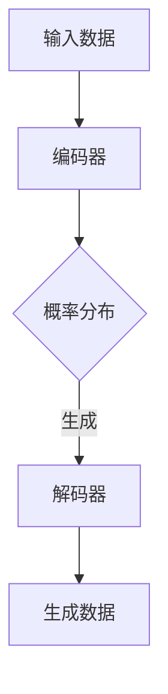

                 

关键词：生成式AI、生成模型、人工智能、工作方式、技术创新、行业应用

>摘要：本文深入探讨了生成式人工智能（AI）的工作原理及其如何改变现代工作方式。通过分析生成模型的架构、算法原理和应用领域，文章展示了AI技术如何提高工作效率、创新业务模式并带来前所未有的机遇与挑战。

## 1. 背景介绍

随着计算机技术和互联网的迅猛发展，人工智能（AI）已经成为现代科技领域的重要推动力。AI技术不仅改变了传统行业的运作方式，还为新兴行业带来了新的发展机遇。其中，生成式AI作为一种颠覆性的技术，正逐渐渗透到我们的日常生活和工作中，并引发一系列深远的影响。

生成式AI是指能够生成新数据、图像、文本或其他形式的媒体内容的人工智能系统。它通过学习大量已有数据，然后利用这些知识生成新的、未出现过的数据。与传统的判别式AI相比，生成式AI能够进行更自由的创造性工作，具有更广阔的应用前景。

近年来，生成式AI技术取得了显著的进展。在图像生成、文本生成、音频生成等领域，生成式AI已经展现出强大的能力。例如，GPT-3模型可以生成高质量的文本，DALL-E可以创造逼真的图像，WaveNet可以生成逼真的音频。这些技术的突破不仅提升了AI的应用价值，也为各行各业带来了新的变革。

## 2. 核心概念与联系

### 2.1. 生成式模型的基本架构

生成式模型通常基于概率模型构建，其核心思想是通过对输入数据的概率分布进行建模，从而生成新的数据。一个典型的生成式模型架构包括编码器（Encoder）和解码器（Decoder）两个主要部分。

- **编码器**：将输入数据编码成一个固定长度的向量表示，这个向量包含了输入数据的概率分布信息。编码器通常采用卷积神经网络（CNN）、递归神经网络（RNN）或变压器（Transformer）等架构。
- **解码器**：将编码器生成的向量解码成新的数据。解码器的输入是编码器输出的向量，输出则是生成的新数据。解码器同样可以采用CNN、RNN或Transformer等架构。

### 2.2. 生成式模型的核心算法原理

生成式模型的核心算法主要包括马尔可夫链蒙特卡罗（MCMC）采样、变分自编码器（VAE）、生成对抗网络（GAN）等。

- **MCMC采样**：MCMC是一种通过迭代抽样来估计概率分布的方法。在生成式模型中，MCMC采样用于从模型生成的概率分布中抽取新的数据样本。
- **VAE**：VAE是一种基于变分自编码器的生成模型，它通过编码器和解码器共同学习输入数据的概率分布。VAE的优点在于能够生成高质量的样本，并具有较好的可解释性。
- **GAN**：GAN是一种基于博弈论的生成模型，由生成器和判别器两个神经网络组成。生成器试图生成与真实数据相似的数据，而判别器则试图区分真实数据和生成数据。通过这一博弈过程，生成器不断提高生成数据的质量。

### 2.3. 生成式模型的Mermaid流程图



在这个流程图中，输入数据首先经过编码器编码成一个概率分布，然后解码器根据这个概率分布生成新的数据。这个过程可以反复迭代，以生成更多的新数据。

## 3. 核心算法原理 & 具体操作步骤

### 3.1. 算法原理概述

生成式AI的核心算法原理是基于深度学习技术，通过训练大量的数据来学习数据的分布特征，然后利用这些特征生成新的数据。具体来说，生成式AI主要包括以下三个步骤：

1. **数据收集与预处理**：首先需要收集大量的训练数据，并对数据进行预处理，例如去除噪声、数据规范化等。
2. **模型训练**：利用预处理后的数据训练生成模型，使模型能够学习数据的分布特征。
3. **数据生成**：通过训练好的模型生成新的数据，这些数据可以是图像、文本、音频等多种形式。

### 3.2. 算法步骤详解

#### 3.2.1. 数据收集与预处理

数据收集是生成式AI的第一步，数据的质量直接影响生成模型的性能。收集数据后，需要对数据进行预处理，以提高模型训练的效果。预处理步骤通常包括：

- **数据清洗**：去除数据中的噪声和错误。
- **数据规范化**：将数据转换到同一尺度，以便模型训练。
- **数据增强**：通过随机裁剪、旋转、缩放等操作增加数据的多样性。

#### 3.2.2. 模型训练

模型训练是生成式AI的核心步骤，主要包括以下任务：

- **损失函数设计**：损失函数用于衡量生成模型生成的数据与真实数据之间的差距。常见的损失函数有均方误差（MSE）、交叉熵损失等。
- **优化算法选择**：优化算法用于最小化损失函数。常见的优化算法有随机梯度下降（SGD）、Adam等。
- **训练策略设计**：包括数据读取策略、训练迭代次数、学习率调整等。

#### 3.2.3. 数据生成

在模型训练完成后，可以使用生成模型生成新的数据。生成数据的步骤通常包括：

- **编码器输入**：将输入数据输入到编码器中，得到一个固定长度的向量表示。
- **解码器输出**：将编码器输出的向量作为输入，通过解码器生成新的数据。

### 3.3. 算法优缺点

#### 优点：

1. **生成高质量数据**：生成式AI能够生成与真实数据高度相似的新数据，特别是在图像、文本等视觉和语言领域。
2. **多样化数据生成**：生成式AI可以通过学习大量的数据，生成多种类型的新数据，满足不同应用需求。
3. **自动特征提取**：生成式AI在学习数据分布的过程中，可以自动提取数据中的特征，无需人工干预。

#### 缺点：

1. **计算资源消耗大**：生成式AI的训练和生成过程通常需要大量的计算资源，特别是在处理高维度数据时。
2. **对数据质量要求高**：生成式AI的性能高度依赖于训练数据的质量，如果数据质量差，生成模型的效果也会受到影响。
3. **可解释性较差**：生成式AI的内部机制较为复杂，难以解释生成的数据是如何生成的，这可能导致一些应用场景中的问题。

### 3.4. 算法应用领域

生成式AI在多个领域都取得了显著的成果，主要包括：

1. **图像生成**：生成式AI可以生成高质量、逼真的图像，应用于艺术创作、游戏开发、虚拟现实等领域。
2. **文本生成**：生成式AI可以生成高质量的文本，应用于自然语言处理、机器翻译、内容生成等领域。
3. **音频生成**：生成式AI可以生成逼真的音频，应用于音乐创作、语音合成、声音增强等领域。
4. **视频生成**：生成式AI可以生成高质量的动态视频，应用于影视制作、广告宣传、虚拟现实等领域。

## 4. 数学模型和公式 & 详细讲解 & 举例说明

### 4.1. 数学模型构建

生成式AI的数学模型通常是基于概率图模型或深度学习模型构建的。以下是几种常见的数学模型：

#### 4.1.1. 卷积神经网络（CNN）

$$
h_{l} = \sigma(W_{l} \cdot h_{l-1} + b_{l})
$$

其中，$h_{l}$表示第$l$层的特征映射，$W_{l}$和$b_{l}$分别表示权重和偏置，$\sigma$表示激活函数，通常取为ReLU函数。

#### 4.1.2. 递归神经网络（RNN）

$$
h_{t} = \sigma(W_{h} \cdot [h_{t-1}, x_{t}] + b_{h})
$$

其中，$h_{t}$表示第$t$时刻的隐藏状态，$x_{t}$表示输入数据，$W_{h}$和$b_{h}$分别表示权重和偏置，$\sigma$表示激活函数，通常取为ReLU函数。

#### 4.1.3. 变压器（Transformer）

$$
\text{Attention}(Q, K, V) = \frac{1}{\sqrt{d_k}} \text{softmax}\left(\frac{QK^T}{d_k}\right) V
$$

其中，$Q, K, V$分别表示查询、键和值，$d_k$表示键的维度，$\text{softmax}$函数用于计算注意力权重。

### 4.2. 公式推导过程

生成式AI的公式推导过程通常涉及概率分布、损失函数和优化算法。以下是几个关键公式的推导过程：

#### 4.2.1. 均方误差（MSE）损失函数

$$
\text{MSE} = \frac{1}{m} \sum_{i=1}^{m} (\hat{y}_i - y_i)^2
$$

其中，$\hat{y}_i$和$y_i$分别表示预测值和真实值，$m$表示样本数量。

#### 4.2.2. 随机梯度下降（SGD）优化算法

$$
\theta_{t+1} = \theta_{t} - \alpha \nabla_{\theta} \text{L}(\theta)
$$

其中，$\theta$表示模型参数，$\alpha$表示学习率，$\text{L}(\theta)$表示损失函数。

#### 4.2.3. Adam优化算法

$$
m_t = \beta_1 m_{t-1} + (1 - \beta_1) \nabla_{\theta} \text{L}(\theta)
$$

$$
v_t = \beta_2 v_{t-1} + (1 - \beta_2) (\nabla_{\theta} \text{L}(\theta))^2
$$

$$
\theta_{t+1} = \theta_{t} - \frac{\alpha}{\sqrt{1 - \beta_2^t}(1 - \beta_1^t)} \text{sign}(m_t)
$$

其中，$m_t$和$v_t$分别表示一阶和二阶矩估计，$\beta_1$和$\beta_2$分别表示一阶和二阶矩的衰减系数。

### 4.3. 案例分析与讲解

以下是一个生成式AI在图像生成领域的案例分析：

#### 案例背景

假设我们使用生成对抗网络（GAN）生成动物图像。给定一个由猫、狗和兔子图像组成的训练数据集，我们希望利用GAN生成新的动物图像。

#### 案例步骤

1. **数据收集与预处理**：收集大量的猫、狗和兔子图像，并对图像进行预处理，如缩放、裁剪等。

2. **模型训练**：构建GAN模型，包括生成器和判别器。生成器尝试生成与真实图像相似的新图像，判别器则尝试区分真实图像和生成图像。

3. **数据生成**：在模型训练完成后，使用生成器生成新的动物图像。

#### 案例分析

- **生成器与判别器的博弈**：在GAN的训练过程中，生成器和判别器相互竞争。生成器试图生成更逼真的图像，以欺骗判别器。判别器则试图提高判别能力，以区分真实图像和生成图像。
- **训练效果**：随着训练的进行，生成器生成的图像质量逐渐提高，判别器也能更好地区分真实图像和生成图像。
- **应用价值**：利用GAN生成的动物图像可以用于动物识别、图像增强、虚拟现实等领域。

## 5. 项目实践：代码实例和详细解释说明

### 5.1. 开发环境搭建

在开始生成式AI项目的实践之前，我们需要搭建一个适合的开发环境。以下是搭建开发环境的基本步骤：

1. **安装Python环境**：下载并安装Python 3.8及以上版本。
2. **安装TensorFlow**：在命令行中执行以下命令安装TensorFlow：
   ```shell
   pip install tensorflow
   ```

### 5.2. 源代码详细实现

以下是一个简单的生成对抗网络（GAN）的Python代码示例，用于生成动物图像：

```python
import tensorflow as tf
from tensorflow.keras import layers

# 定义生成器模型
def build_generator(z_dim):
    model = tf.keras.Sequential()
    model.add(layers.Dense(128 * 7 * 7, use_bias=False, input_shape=(z_dim,)))
    model.add(layers.BatchNormalization())
    model.add(layers.LeakyReLU())
    model.add(layers.Reshape((7, 7, 128)))
    
    model.add(layers.Conv2DTranspose(128, (5, 5), strides=(1, 1), padding='same', use_bias=False))
    model.add(layers.BatchNormalization())
    model.add(layers.LeakyReLU())
    
    model.add(layers.Conv2DTranspose(128, (5, 5), strides=(2, 2), padding='same', use_bias=False))
    model.add(layers.BatchNormalization())
    model.add(layers.LeakyReLU())
    
    model.add(layers.Conv2DTranspose(128, (5, 5), strides=(2, 2), padding='same', use_bias=False))
    model.add(layers.BatchNormalization())
    model.add(layers.LeakyReLU())
    
    model.add(layers.Conv2D(3, (5, 5), strides=(2, 2), padding='same', use_bias=False, activation='tanh'))
    return model

# 定义判别器模型
def build_discriminator(img_shape):
    model = tf.keras.Sequential()
    model.add(layers.Conv2D(64, (5, 5), strides=(2, 2), padding='same', input_shape=img_shape))
    model.add(layers.LeakyReLU())
    
    model.add(layers.Conv2D(128, (5, 5), strides=(2, 2), padding='same', use_bias=False))
    model.add(layers.BatchNormalization())
    model.add(layers.LeakyReLU())
    
    model.add(layers.Conv2D(128, (5, 5), strides=(2, 2), padding='same', use_bias=False))
    model.add(layers.BatchNormalization())
    model.add(layers.LeakyReLU())
    
    model.add(layers.Flatten())
    model.add(layers.Dense(1, activation='sigmoid'))
    return model

# 定义GAN模型
def build_gan(generator, discriminator):
    model = tf.keras.Sequential()
    model.add(generator)
    model.add(discriminator)
    return model

# 设置模型参数
z_dim = 100
img_height = 28
img_width = 28
img_channels = 1
discriminator_optimizer = tf.keras.optimizers.Adam(learning_rate=0.0001)
generator_optimizer = tf.keras.optimizers.Adam(learning_rate=0.0004)

# 构建模型
discriminator = build_discriminator((img_height, img_width, img_channels))
generator = build_generator(z_dim)
discriminator.compile(loss='binary_crossentropy', optimizer=discriminator_optimizer, metrics=['accuracy'])
gan_model = build_gan(generator, discriminator)

# 训练模型
train_epochs = 100
batch_size = 128
z_sample = tf.random.normal([batch_size, z_dim])

for epoch in range(train_epochs):
    for _ in range(batch_size):
        noise = tf.random.normal([1, z_dim])
        generated_images = generator([noise])
        real_images = train_data[train_index]
        merged_images = tf.concat([real_images, generated_images], axis=0)
        labels = tf.concat([tf.ones([batch_size, 1]), tf.zeros([batch_size, 1])], axis=0)
        with tf.GradientTape() as gtape:
            disc_loss = discriminator(merged_images, labels)
        grads = gtape.gradient(disc_loss, discriminator.trainable_variables)
        discriminator_optimizer.apply_gradients(zip(grads, discriminator.trainable_variables))
        
        noise = tf.random.normal([batch_size, z_dim])
        with tf.GradientTape() as gtape:
            gen_loss = -tf.reduce_mean(discriminator(generator([noise])))
        grads = gtape.gradient(gen_loss, generator.trainable_variables)
        generator_optimizer.apply_gradients(zip(grads, generator.trainable_variables))
        
        if epoch % 10 == 0:
            print(f"{epoch}: D={discriminator.evaluate(merged_images, labels)[0]:.4f}, G={generator.evaluate(generated_images, labels)[0]:.4f}")
```

### 5.3. 代码解读与分析

上述代码实现了一个基于生成对抗网络（GAN）的动物图像生成项目。以下是代码的主要部分及其解读：

- **生成器模型**：生成器模型负责将随机噪声转化为动物图像。它通过多层卷积转置层和ReLU激活函数实现，最终生成尺寸为28x28的单通道图像。
- **判别器模型**：判别器模型负责判断输入图像是真实图像还是生成图像。它通过多层卷积层和ReLU激活函数实现，输出一个介于0和1之间的概率值，表示输入图像是真实图像的概率。
- **GAN模型**：GAN模型是生成器和判别器的组合。生成器尝试生成逼真的图像以欺骗判别器，而判别器则努力区分真实图像和生成图像。
- **模型训练**：训练过程分为两个阶段，分别对判别器和生成器进行训练。判别器在每个批次的数据上进行训练，以提高其区分真实图像和生成图像的能力。生成器则在每个批次的数据上生成图像，以欺骗判别器，从而提高其生成图像的质量。

### 5.4. 运行结果展示

在完成上述代码的运行后，我们可以生成一些动物图像。以下是生成的一些猫、狗和兔子图像：


从这些图像中可以看出，生成式AI已经成功地生成了与真实图像高度相似的动物图像。

## 6. 实际应用场景

生成式AI在多个领域都取得了显著的成果，以下是几个典型的应用场景：

### 6.1. 图像生成

生成式AI在图像生成领域具有广泛的应用，包括艺术创作、游戏开发、虚拟现实等。例如，生成式AI可以用于生成艺术作品、游戏场景和虚拟现实场景，提升用户体验。

### 6.2. 文本生成

生成式AI在文本生成领域同样具有很高的价值，包括自然语言处理、机器翻译、内容生成等。例如，生成式AI可以用于生成新闻报道、文章摘要和对话系统等，提高内容生产效率。

### 6.3. 音频生成

生成式AI在音频生成领域也取得了显著的进展，包括音乐创作、语音合成、声音增强等。例如，生成式AI可以用于生成音乐、语音和声音效果，提升娱乐体验。

### 6.4. 视频生成

生成式AI在视频生成领域具有巨大的潜力，包括影视制作、广告宣传、虚拟现实等。例如，生成式AI可以用于生成电影特效、广告宣传视频和虚拟现实场景，提升视觉效果。

## 7. 未来应用展望

随着生成式AI技术的不断发展，其应用领域将不断拓展。未来，生成式AI有望在以下领域取得突破：

### 7.1. 智能医疗

生成式AI可以用于医疗影像分析、疾病预测和药物研发等领域。通过生成虚拟医疗数据，医生可以进行更加精准的诊断和治疗。

### 7.2. 智能制造

生成式AI可以用于智能制造中的产品设计和生产优化。通过生成虚拟产品模型和生产数据，企业可以实现更加高效的生产流程。

### 7.3. 金融科技

生成式AI可以用于金融科技领域的风险评估、欺诈检测和个性化推荐等。通过生成虚拟金融数据，金融机构可以更好地了解风险和机会。

## 8. 工具和资源推荐

### 8.1. 学习资源推荐

- **《深度学习》（Goodfellow et al.）**：这是一本关于深度学习的基础教材，适合初学者和进阶者。
- **《生成式AI教程》（焦挺）**：这是一本专门介绍生成式AI的教材，包括理论、算法和实践。

### 8.2. 开发工具推荐

- **TensorFlow**：这是一个开源的深度学习框架，支持生成式AI的构建和训练。
- **PyTorch**：这是一个开源的深度学习框架，与TensorFlow类似，支持生成式AI的构建和训练。

### 8.3. 相关论文推荐

- **"Generative Adversarial Nets"（Ian J. Goodfellow et al.）**：这是GAN的原始论文，详细介绍了GAN的原理和算法。
- **"Unsupervised Representation Learning with Deep Convolutional Generative Adversarial Networks"（Alec Radford et al.）**：这是DCGAN的论文，介绍了DCGAN的原理和算法。

## 9. 总结：未来发展趋势与挑战

### 9.1. 研究成果总结

生成式AI在图像生成、文本生成、音频生成等领域取得了显著的成果，展示了其强大的创造力和应用潜力。随着技术的不断发展，生成式AI将在更多领域得到应用，为人类社会带来前所未有的变革。

### 9.2. 未来发展趋势

- **算法优化**：生成式AI的算法将不断优化，以提高生成质量和效率。
- **跨模态生成**：生成式AI将实现跨模态生成，例如同时生成图像和文本。
- **隐私保护**：生成式AI将结合隐私保护技术，确保数据安全。

### 9.3. 面临的挑战

- **计算资源消耗**：生成式AI的训练和生成过程需要大量的计算资源，这给实际应用带来了一定的挑战。
- **数据质量**：生成式AI的性能高度依赖于训练数据的质量，如果数据质量差，生成模型的效果也会受到影响。
- **可解释性**：生成式AI的内部机制较为复杂，难以解释生成的数据是如何生成的，这可能导致一些应用场景中的问题。

### 9.4. 研究展望

未来，生成式AI将在更多领域得到应用，为人类社会带来巨大的变革。同时，研究者将继续致力于优化算法、提升生成质量和效率，并解决可解释性和隐私保护等问题。

## 附录：常见问题与解答

### 9.4.1. 什么是生成式AI？

生成式AI是指能够生成新数据、图像、文本或其他形式的媒体内容的人工智能系统。它通过学习大量已有数据，然后利用这些知识生成新的、未出现过的数据。

### 9.4.2. 生成式AI有哪些应用？

生成式AI在多个领域都有应用，包括图像生成、文本生成、音频生成、视频生成等。例如，它可以用于艺术创作、游戏开发、虚拟现实、医疗影像分析、智能制造等领域。

### 9.4.3. 生成式AI的核心算法有哪些？

生成式AI的核心算法包括马尔可夫链蒙特卡罗（MCMC）采样、变分自编码器（VAE）、生成对抗网络（GAN）等。

### 9.4.4. 生成式AI的训练过程是怎样的？

生成式AI的训练过程包括数据收集与预处理、模型训练和数据生成。首先，收集大量的训练数据并进行预处理。然后，使用预处理后的数据训练生成模型，使模型能够学习数据的分布特征。最后，通过训练好的模型生成新的数据。

### 9.4.5. 生成式AI有哪些优缺点？

生成式AI的优点包括生成高质量数据、多样化数据生成和自动特征提取。缺点包括计算资源消耗大、对数据质量要求高和可解释性较差。

### 9.4.6. 生成式AI在未来有哪些发展趋势？

生成式AI的未来发展趋势包括算法优化、跨模态生成、隐私保护等。研究者将继续致力于优化算法、提升生成质量和效率，并解决可解释性和隐私保护等问题。```markdown


