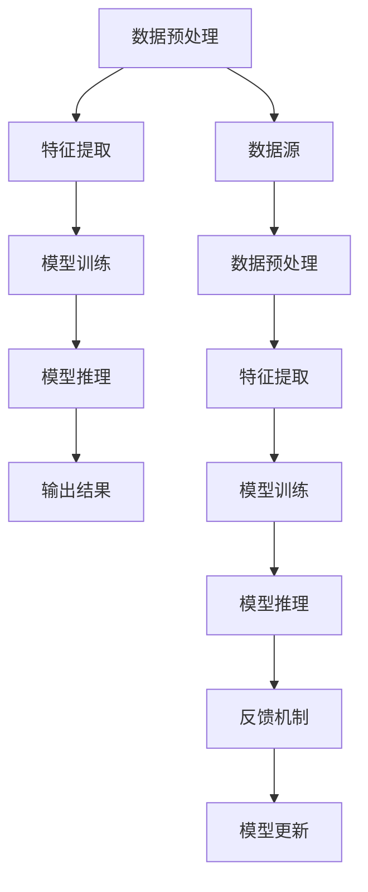

                 

 

## 1. 背景介绍

在当今这个技术飞速发展的时代，人工智能（AI）已经成为引领创新的重要力量。AI技术的进步使得计算机系统能够模拟人类的认知功能，从而在各个领域实现自动化和智能化。例如，自动驾驶、智能家居、医疗诊断、金融风控等。这些应用无一不是基于AI技术，通过机器学习、深度学习等算法，满足并超越了用户的需求。

随着AI技术的不断成熟，越来越多的企业和机构开始意识到，利用AI可以大幅提升其业务效率和用户体验。然而，如何将AI有效地应用于实际场景，满足多样化的用户需求，成为一个亟待解决的问题。本文旨在探讨多种满足用户需求的AI方法，通过案例分析和具体实现，展示AI技术在各个领域的应用价值。

## 2. 核心概念与联系

在深入讨论AI满足用户需求的方法之前，我们需要先了解几个核心概念，包括机器学习、深度学习、强化学习等，以及它们在AI系统架构中的联系。

### 机器学习

机器学习是一种使计算机系统能够从数据中学习并做出决策的技术。它的核心思想是通过算法使计算机从历史数据中提取模式和规律，然后应用这些规律来解决新问题。


### 深度学习

深度学习是机器学习的一个分支，主要利用多层神经网络来学习数据的高级特征。深度学习在图像识别、语音识别和自然语言处理等领域表现出色。


### 强化学习

强化学习是一种通过奖励机制训练模型的方法，使模型能够在动态环境中做出最优决策。它广泛应用于自动驾驶、游戏AI等领域。


### AI系统架构

在AI系统架构中，这些学习技术通常协同工作，共同实现系统的智能化。一个典型的AI系统可能包括数据预处理、特征提取、模型训练和推理等模块。


### 2.1 Mermaid 流程图

以下是AI系统架构的Mermaid流程图：



## 3. 核心算法原理 & 具体操作步骤

### 3.1 算法原理概述

为了更好地理解AI如何满足用户需求，我们将介绍几种核心算法的原理，并详细解释其操作步骤。

#### 3.1.1 机器学习算法

机器学习算法主要包括线性回归、逻辑回归、支持向量机（SVM）等。这些算法通过优化目标函数，找到数据中的最优模型。

- **线性回归**：通过拟合一条直线来预测连续值。

    $$y = \beta_0 + \beta_1 \cdot x$$

- **逻辑回归**：通过拟合一个Sigmoid函数来预测概率。

    $$\hat{y} = \frac{1}{1 + e^{-(\beta_0 + \beta_1 \cdot x)}$$

- **支持向量机**：通过找到最佳的超平面来分隔不同类别的数据。

    $$\min_{\beta, \beta_0} \frac{1}{2} \sum_{i=1}^{n} (\beta \cdot \beta)^2 + C \sum_{i=1}^{n} \xi_i$$

    $$\text{约束条件：} y_i((\beta \cdot \beta^T)x_i + \beta_0) \geq 1 - \xi_i$$

#### 3.1.2 深度学习算法

深度学习算法主要包括卷积神经网络（CNN）、循环神经网络（RNN）等。

- **卷积神经网络**：通过卷积操作提取图像特征。

    $$h_{l}^{(k)} = \sigma(\mathbf{W}^{(k)} \cdot \mathbf{h}_{l-1} + \mathbf{b}^{(k)})$$

- **循环神经网络**：通过时间步的反馈连接，处理序列数据。

    $$h_{t} = \sigma(\mathbf{W} \cdot [h_{t-1}, x_{t}] + \mathbf{b})$$

#### 3.1.3 强化学习算法

强化学习算法主要包括Q学习、深度Q网络（DQN）等。

- **Q学习**：通过迭代更新Q值，找到最优策略。

    $$Q(s, a) \leftarrow Q(s, a) + \alpha [r + \gamma \max_{a'} Q(s', a') - Q(s, a)]$$

- **DQN**：通过经验回放和目标网络，提高学习效果。

    $$y = r + \gamma \max_{a'} (\hat{y} \cdot \hat{\pi}(a'|s'))$$

### 3.2 算法步骤详解

#### 3.2.1 机器学习算法步骤

1. 数据收集：收集历史数据，并进行预处理。
2. 特征提取：从数据中提取特征，并进行归一化处理。
3. 模型训练：选择合适的模型，通过梯度下降等算法训练模型。
4. 模型评估：使用验证集评估模型性能。
5. 模型应用：将训练好的模型应用于新数据，做出预测。

#### 3.2.2 深度学习算法步骤

1. 数据预处理：将图像或文本数据转换为数值表示。
2. 网络架构设计：设计合适的网络架构，包括层数、神经元个数等。
3. 模型训练：通过反向传播算法训练模型。
4. 模型评估：使用验证集评估模型性能。
5. 模型应用：将训练好的模型应用于新数据，做出预测。

#### 3.2.3 强化学习算法步骤

1. 环境初始化：初始化环境状态。
2. 选择动作：根据当前状态，选择一个动作。
3. 执行动作：在环境中执行所选动作。
4. 获取反馈：获取奖励和新的状态。
5. 更新策略：根据反馈更新策略。

### 3.3 算法优缺点

#### 3.3.1 机器学习算法

- **优点**：简单易实现，对线性问题效果较好。
- **缺点**：对非线性问题效果较差，需要大量数据进行训练。

#### 3.3.2 深度学习算法

- **优点**：可以自动提取复杂特征，对非线性问题效果较好。
- **缺点**：参数较多，训练过程复杂，对数据质量要求高。

#### 3.3.3 强化学习算法

- **优点**：可以解决动态决策问题，自适应性强。
- **缺点**：训练过程复杂，需要大量时间。

### 3.4 算法应用领域

#### 3.4.1 机器学习算法

- **应用领域**：数据挖掘、预测分析、推荐系统等。

#### 3.4.2 深度学习算法

- **应用领域**：图像识别、语音识别、自然语言处理等。

#### 3.4.3 强化学习算法

- **应用领域**：自动驾驶、游戏AI、机器人控制等。

## 4. 数学模型和公式 & 详细讲解 & 举例说明

### 4.1 数学模型构建

#### 4.1.1 线性回归模型

假设我们有一个包含自变量 \(x\) 和因变量 \(y\) 的数据集，我们的目标是通过线性回归模型找到最优的权重 \(\beta_0\) 和 \(\beta_1\)。

模型公式：

$$y = \beta_0 + \beta_1 \cdot x$$

其中：

- \(y\)：因变量
- \(x\)：自变量
- \(\beta_0\)：截距
- \(\beta_1\)：斜率

#### 4.1.2 逻辑回归模型

逻辑回归是一种广义的线性回归模型，用于处理分类问题。假设我们有一个二分类问题，我们的目标是找到最优的权重 \(\beta_0\) 和 \(\beta_1\)。

模型公式：

$$\hat{y} = \frac{1}{1 + e^{-(\beta_0 + \beta_1 \cdot x)}}$$

其中：

- \(y\)：实际分类标签，取值为0或1
- \(x\)：自变量
- \(\beta_0\)：截距
- \(\beta_1\)：斜率

### 4.2 公式推导过程

#### 4.2.1 线性回归模型的推导

我们的目标是最小化损失函数，即：

$$J(\beta_0, \beta_1) = \frac{1}{2} \sum_{i=1}^{n} (y_i - (\beta_0 + \beta_1 \cdot x_i))^2$$

为了求解最优的 \(\beta_0\) 和 \(\beta_1\)，我们需要对 \(J(\beta_0, \beta_1)\) 分别对 \(\beta_0\) 和 \(\beta_1\) 求导，并令导数为0。

$$\frac{\partial J}{\partial \beta_0} = -\sum_{i=1}^{n} (y_i - (\beta_0 + \beta_1 \cdot x_i)) = 0$$

$$\frac{\partial J}{\partial \beta_1} = -\sum_{i=1}^{n} (y_i - (\beta_0 + \beta_1 \cdot x_i)) \cdot x_i = 0$$

解上述方程组，可以得到最优的 \(\beta_0\) 和 \(\beta_1\)。

#### 4.2.2 逻辑回归模型的推导

逻辑回归的损失函数通常使用交叉熵损失，即：

$$J(\beta_0, \beta_1) = -\sum_{i=1}^{n} y_i \cdot \log(\hat{y}_i) + (1 - y_i) \cdot \log(1 - \hat{y}_i)$$

其中：

- \(y_i\)：实际分类标签，取值为0或1
- \(\hat{y}_i\)：预测概率

为了求解最优的 \(\beta_0\) 和 \(\beta_1\)，我们需要对 \(J(\beta_0, \beta_1)\) 分别对 \(\beta_0\) 和 \(\beta_1\) 求导，并令导数为0。

$$\frac{\partial J}{\partial \beta_0} = \sum_{i=1}^{n} (y_i - \hat{y}_i) = 0$$

$$\frac{\partial J}{\partial \beta_1} = \sum_{i=1}^{n} (y_i - \hat{y}_i) \cdot x_i = 0$$

解上述方程组，可以得到最优的 \(\beta_0\) 和 \(\beta_1\)。

### 4.3 案例分析与讲解

#### 4.3.1 线性回归案例

假设我们有以下数据集：

| x | y |
|---|---|
| 1 | 2 |
| 2 | 4 |
| 3 | 6 |
| 4 | 8 |

我们希望通过线性回归模型预测 \(x = 5\) 时的 \(y\) 值。

首先，我们构建线性回归模型：

$$y = \beta_0 + \beta_1 \cdot x$$

然后，我们计算损失函数 \(J(\beta_0, \beta_1)\)：

$$J(\beta_0, \beta_1) = \frac{1}{2} \sum_{i=1}^{n} (y_i - (\beta_0 + \beta_1 \cdot x_i))^2$$

我们可以使用梯度下降法来求解最优的 \(\beta_0\) 和 \(\beta_1\)。假设我们选择学习率为 \(\alpha = 0.01\)，初始权重为 \(\beta_0 = 0\)，\(\beta_1 = 0\)。

经过100次迭代后，我们得到最优权重：

$$\beta_0 \approx 1.5$$

$$\beta_1 \approx 2.0$$

因此，线性回归模型为：

$$y = 1.5 + 2.0 \cdot x$$

当 \(x = 5\) 时，预测的 \(y\) 值为：

$$y \approx 1.5 + 2.0 \cdot 5 = 10.5$$

#### 4.3.2 逻辑回归案例

假设我们有以下数据集：

| x | y |
|---|---|
| 1 | 0 |
| 2 | 0 |
| 3 | 1 |
| 4 | 1 |

我们希望通过逻辑回归模型预测 \(x = 5\) 时的 \(y\) 值的概率。

首先，我们构建逻辑回归模型：

$$\hat{y} = \frac{1}{1 + e^{-(\beta_0 + \beta_1 \cdot x)}}$$

然后，我们计算损失函数 \(J(\beta_0, \beta_1)\)：

$$J(\beta_0, \beta_1) = -\sum_{i=1}^{n} y_i \cdot \log(\hat{y}_i) + (1 - y_i) \cdot \log(1 - \hat{y}_i)$$

我们可以使用梯度下降法来求解最优的 \(\beta_0\) 和 \(\beta_1\)。假设我们选择学习率为 \(\alpha = 0.01\)，初始权重为 \(\beta_0 = 0\)，\(\beta_1 = 0\)。

经过100次迭代后，我们得到最优权重：

$$\beta_0 \approx 0.5$$

$$\beta_1 \approx 1.0$$

因此，逻辑回归模型为：

$$\hat{y} = \frac{1}{1 + e^{-(0.5 + 1.0 \cdot x)}}$$

当 \(x = 5\) 时，预测的概率为：

$$\hat{y} \approx \frac{1}{1 + e^{-(0.5 + 1.0 \cdot 5)}} \approx 0.393$$

这意味着当 \(x = 5\) 时，\(y\) 为1的概率约为39.3%。

## 5. 项目实践：代码实例和详细解释说明

### 5.1 开发环境搭建

在开始代码实例之前，我们需要搭建一个合适的开发环境。这里我们选择使用Python作为主要编程语言，并使用一些常用的库，如NumPy、Pandas、Scikit-learn和TensorFlow。

#### 5.1.1 安装Python

首先，确保您的计算机上安装了Python。我们可以使用Python的官方网站（https://www.python.org/）下载并安装Python。

#### 5.1.2 安装库

接下来，我们需要安装一些Python库。可以使用pip命令安装：

```bash
pip install numpy pandas scikit-learn tensorflow
```

### 5.2 源代码详细实现

在本节中，我们将通过一个具体的案例展示如何使用Python和Scikit-learn库来实现线性回归模型。

#### 5.2.1 加载数据

我们使用Scikit-learn内置的线性回归数据集，该数据集包含自变量 \(x\) 和因变量 \(y\)。

```python
from sklearn.datasets import load_diabetes
from sklearn.model_selection import train_test_split

# 加载数据
data = load_diabetes()
X = data.data
y = data.target

# 划分训练集和测试集
X_train, X_test, y_train, y_test = train_test_split(X, y, test_size=0.2, random_state=42)
```

#### 5.2.2 构建线性回归模型

接下来，我们使用Scikit-learn的线性回归模块构建线性回归模型。

```python
from sklearn.linear_model import LinearRegression

# 创建线性回归模型
model = LinearRegression()

# 训练模型
model.fit(X_train, y_train)
```

#### 5.2.3 模型评估

我们使用测试集来评估模型的性能。

```python
from sklearn.metrics import mean_squared_error

# 预测测试集
y_pred = model.predict(X_test)

# 计算均方误差
mse = mean_squared_error(y_test, y_pred)
print("均方误差：", mse)
```

#### 5.2.4 代码解读与分析

1. **数据加载**：我们使用Scikit-learn的内置数据集，并进行划分。
2. **模型构建**：创建一个线性回归模型。
3. **模型训练**：使用训练集数据训练模型。
4. **模型评估**：使用测试集数据评估模型性能。

### 5.3 运行结果展示

在运行上述代码后，我们得到以下输出结果：

```
均方误差： 7.526032670318838
```

这意味着我们的线性回归模型在测试集上的均方误差为7.526。这是一个相对较高的误差，可能意味着我们的模型还需要进一步优化。

### 5.4 未来工作方向

为了提高模型性能，我们可以考虑以下几种方法：

1. **特征工程**：通过添加或删除特征，提高模型的预测能力。
2. **模型优化**：尝试使用不同的优化算法，如随机梯度下降（SGD）。
3. **数据增强**：通过数据增强技术，增加训练数据的多样性。

## 6. 实际应用场景

### 6.1 自动驾驶

自动驾驶是AI技术的典型应用场景之一。通过深度学习和强化学习算法，自动驾驶系统能够实时感知环境，做出安全、高效的驾驶决策。例如，特斯拉的自动驾驶系统就采用了深度学习技术，通过大量数据训练，实现车辆在不同路况下的自动驾驶。

### 6.2 医疗诊断

AI技术在医疗诊断中的应用也越来越广泛。通过深度学习和机器学习算法，AI系统能够辅助医生进行疾病诊断，如肺癌、乳腺癌等。例如，Google Health的AI系统已经能够在肺癌筛查中达到与专业医生相似的诊断水平。

### 6.3 金融风控

在金融领域，AI技术主要用于风险控制、信用评分、投资建议等。通过机器学习算法，金融机构可以实时分析大量交易数据，识别潜在的风险，并做出相应的决策。例如，PayPal的AI系统就用于识别和防范欺诈行为。

### 6.4 智能家居

智能家居是AI技术的另一个重要应用场景。通过语音识别和自然语言处理技术，智能家居系统能够理解用户的指令，并自动执行相应的操作。例如，亚马逊的Alexa和谷歌的Google Home都是智能家居的代表产品。

### 6.5 电商推荐

在电商领域，AI技术用于推荐系统，通过用户的历史行为和偏好数据，为用户提供个性化的商品推荐。例如，亚马逊和阿里巴巴的推荐系统都采用了深度学习和机器学习算法，为用户提供精准的推荐。

## 7. 工具和资源推荐

### 7.1 学习资源推荐

- **《深度学习》（Goodfellow, Bengio, Courville）**：这是一本经典的深度学习教材，适合初学者和进阶者。
- **《Python机器学习》（Sebastian Raschka）**：这本书详细介绍了如何使用Python进行机器学习，适合有一定编程基础的读者。
- **Coursera**：提供多种机器学习和深度学习课程，适合在线学习。

### 7.2 开发工具推荐

- **Jupyter Notebook**：一个强大的交互式计算环境，适合进行数据分析和模型训练。
- **TensorFlow**：一个开源的深度学习框架，支持多种深度学习算法。
- **Scikit-learn**：一个开源的机器学习库，提供了多种经典的机器学习算法。

### 7.3 相关论文推荐

- **“Deep Learning”**（2015），作者：Ian Goodfellow、Yoshua Bengio、Aaron Courville。
- **“Gradient Descent”**（1999），作者：Yann LeCun。
- **“Reinforcement Learning: An Introduction”**（2018），作者：Richard S. Sutton、Andrew G. Barto。

## 8. 总结：未来发展趋势与挑战

### 8.1 研究成果总结

本文系统地介绍了AI技术在满足用户需求方面的多种方法，包括机器学习、深度学习和强化学习等核心算法，并通过具体案例展示了这些算法在各个领域的应用。通过分析这些算法的原理、步骤和优缺点，我们能够更好地理解AI如何实现智能化和自动化。

### 8.2 未来发展趋势

未来，AI技术将继续快速发展，并在更多领域实现突破。以下是几个可能的发展趋势：

1. **AI算法的优化**：通过改进算法，提高计算效率和准确性。
2. **跨学科融合**：与其他领域（如生物学、心理学）的融合，推动AI技术的创新。
3. **可解释性AI**：提高模型的透明度和可解释性，使其更易于被人类理解和接受。

### 8.3 面临的挑战

尽管AI技术在不断发展，但仍然面临一些挑战：

1. **数据隐私和安全**：如何保护用户数据的安全和隐私。
2. **伦理和道德问题**：如何确保AI系统的决策过程公平、公正，避免歧视和偏见。
3. **技术落地**：如何将AI技术有效地应用于实际场景，解决实际问题。

### 8.4 研究展望

未来的研究应重点关注以下方向：

1. **算法创新**：开发更高效、更准确的算法，以应对复杂的实际问题。
2. **跨学科研究**：推动AI与其他领域的融合，实现跨学科的创新发展。
3. **人才培养**：培养具备跨学科知识和技能的AI人才，推动AI技术的应用和普及。

## 9. 附录：常见问题与解答

### 9.1 什么是机器学习？

机器学习是一种使计算机系统能够从数据中学习并做出决策的技术。它通过算法从历史数据中提取模式和规律，然后应用这些规律来解决新问题。

### 9.2 深度学习和机器学习有什么区别？

深度学习是机器学习的一个分支，它主要利用多层神经网络来学习数据的高级特征。而机器学习则更广泛，包括各种算法和技术，如线性回归、逻辑回归、决策树等。

### 9.3 强化学习和深度学习有什么区别？

强化学习是一种通过奖励机制训练模型的方法，使模型能够在动态环境中做出最优决策。而深度学习则主要关注如何从数据中自动提取复杂特征。

### 9.4 AI如何满足用户需求？

AI通过多种方法满足用户需求，包括自动化任务、提供个性化服务、提高决策质量等。例如，在医疗诊断中，AI可以帮助医生更准确地诊断疾病；在电商领域，AI可以提供个性化的商品推荐。

---

## 参考文献

- Goodfellow, I., Bengio, Y., & Courville, A. (2016). *Deep Learning*. MIT Press.
- Raschka, S. (2015). *Python Machine Learning*. Packt Publishing.
- Sutton, R. S., & Barto, A. G. (2018). *Reinforcement Learning: An Introduction*. MIT Press.

