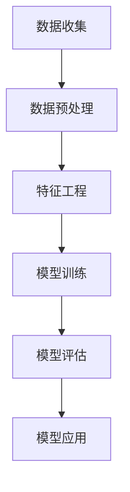

                 

关键词：AI、电商平台、用户行为、序列分析、机器学习、深度学习、推荐系统、数据挖掘

> 摘要：随着电子商务的迅猛发展，电商平台积累了海量用户行为数据。如何有效分析和利用这些数据，以提升用户体验和商业价值，成为当前研究的热点。本文旨在探讨基于AI的电商平台用户行为序列分析技术，介绍核心概念、算法原理、数学模型及其在实际应用中的挑战和未来发展趋势。

## 1. 背景介绍

### 1.1 电商平台的发展

电子商务作为互联网经济的重要组成部分，近年来呈现出爆发式增长。据统计，全球电商市场在2020年已突破3万亿美元，并有望在2025年达到6万亿美元。随着移动设备的普及和无线网络的完善，用户购物习惯逐渐向线上转移，电商平台成为商家与消费者之间的桥梁。

### 1.2 用户行为数据的价值

电商平台积累了海量的用户行为数据，包括浏览记录、购买历史、评论反馈、支付行为等。这些数据蕴含了用户偏好、行为模式、购买意图等信息，对于电商企业来说，是宝贵的资源。通过有效的数据分析，企业可以了解用户需求，优化商品推荐，提升用户体验，增加销售机会。

### 1.3 AI在电商平台中的应用

人工智能技术，特别是机器学习和深度学习，为电商平台提供了强大的数据处理和分析能力。通过AI技术，电商平台可以实现个性化推荐、智能客服、风险控制、市场预测等功能，从而提升运营效率和用户满意度。

## 2. 核心概念与联系

### 2.1 用户行为序列

用户行为序列是指用户在电商平台上进行的一系列操作，如浏览商品、加入购物车、下单购买、评价商品等。这些行为以时间顺序排列，形成了一个动态的行为轨迹。

### 2.2 序列分析

序列分析是一种数据挖掘技术，旨在挖掘数据中隐藏的模式和规律。在用户行为序列分析中，通过分析用户行为之间的关联和时间顺序，可以发现用户的偏好、行为模式和潜在需求。

### 2.3 机器学习与深度学习

机器学习和深度学习是AI的核心技术，用于构建和分析用户行为序列模型。机器学习通过算法从数据中学习规律，而深度学习则利用多层神经网络模拟人类大脑的思考过程。

### 2.4 Mermaid流程图

以下是用户行为序列分析的基本流程图：



## 3. 核心算法原理 & 具体操作步骤

### 3.1 算法原理概述

用户行为序列分析的核心算法包括聚类分析、关联规则挖掘、时间序列分析等。其中，聚类分析用于发现用户群体的相似性；关联规则挖掘用于发现用户行为之间的关联；时间序列分析用于分析用户行为的时间规律。

### 3.2 算法步骤详解

#### 3.2.1 数据收集

数据收集是用户行为序列分析的第一步。通过电商平台的后台系统，收集用户的行为数据，如浏览记录、购买历史、评论反馈等。

#### 3.2.2 数据预处理

数据预处理包括数据清洗、去重、缺失值处理等。确保数据的质量和一致性，为后续分析做好准备。

#### 3.2.3 特征工程

特征工程是用户行为序列分析的关键步骤。通过特征提取和特征选择，将原始数据转化为适用于机器学习模型的特征。

#### 3.2.4 模型训练

选择合适的机器学习模型，如K-means聚类、Apriori算法、LSTM神经网络等，对用户行为序列进行训练。

#### 3.2.5 模型评估

通过交叉验证、性能指标（如准确率、召回率、F1值等）评估模型的性能，确保模型的有效性和可靠性。

#### 3.2.6 模型应用

将训练好的模型应用于实际场景，如个性化推荐、用户行为预测等。

### 3.3 算法优缺点

#### 3.3.1 优点

- **高效性**：机器学习和深度学习算法能够快速处理大规模用户行为数据。
- **灵活性**：可以根据不同的业务需求选择合适的算法和模型。
- **可解释性**：部分算法（如决策树、LSTM等）具有较好的可解释性，便于理解和优化。

#### 3.3.2 缺点

- **复杂性**：算法和模型的训练过程复杂，对技术要求较高。
- **数据依赖**：算法的性能依赖于数据质量和特征工程。

### 3.4 算法应用领域

用户行为序列分析算法广泛应用于电商平台、社交网络、金融风控等领域。例如，在电商平台中，可以用于个性化推荐、用户流失预测、广告投放优化等。

## 4. 数学模型和公式 & 详细讲解 & 举例说明

### 4.1 数学模型构建

用户行为序列分析通常涉及以下数学模型：

#### 4.1.1 聚类分析

K-means聚类算法：

$$
\min \sum_{i=1}^{n} \sum_{j=1}^{k} (x_{ij} - \mu_j)^2
$$

其中，$x_{ij}$为第$i$个用户在第$j$个特征上的取值，$\mu_j$为第$j$个聚类中心的取值。

#### 4.1.2 关联规则挖掘

Apriori算法：

$$
\text{support}(A \cup B) = \frac{|\{(x, y) \mid x \in A, y \in B\}|}{|\{(x, y) \mid x, y \in \text{database}\}|}
$$

其中，$A$和$B$为两个事件集合，$\text{support}(A \cup B)$为事件$A$和$B$同时发生的支持度。

#### 4.1.3 时间序列分析

LSTM神经网络：

$$
h_t = \sigma(W_h \cdot [h_{t-1}, x_t] + b_h)
$$

其中，$h_t$为第$t$个时间步的隐藏状态，$W_h$和$b_h$为权重和偏置，$\sigma$为sigmoid激活函数。

### 4.2 公式推导过程

#### 4.2.1 K-means聚类算法

K-means聚类算法的目标是最小化目标函数：

$$
\min \sum_{i=1}^{n} \sum_{j=1}^{k} (x_{ij} - \mu_j)^2
$$

其中，$x_{ij}$为第$i$个用户在第$j$个特征上的取值，$\mu_j$为第$j$个聚类中心的取值。

通过梯度下降法，可以迭代更新聚类中心：

$$
\mu_j^{new} = \frac{\sum_{i=1}^{n} x_{ij}}{n}
$$

#### 4.2.2 Apriori算法

Apriori算法的核心思想是利用支持度和置信度来挖掘频繁项集。

$$
\text{support}(A \cup B) = \frac{|\{(x, y) \mid x \in A, y \in B\}|}{|\{(x, y) \mid x, y \in \text{database}\}|}
$$

其中，$A$和$B$为两个事件集合，$\text{support}(A \cup B)$为事件$A$和$B$同时发生的支持度。

置信度：

$$
\text{confidence}(A \rightarrow B) = \frac{\text{support}(A \cup B)}{\text{support}(A)}
$$

#### 4.2.3 LSTM神经网络

LSTM神经网络是一种特殊的循环神经网络，能够有效地处理序列数据。

$$
h_t = \sigma(W_h \cdot [h_{t-1}, x_t] + b_h)
$$

其中，$h_t$为第$t$个时间步的隐藏状态，$W_h$和$b_h$为权重和偏置，$\sigma$为sigmoid激活函数。

### 4.3 案例分析与讲解

#### 4.3.1 聚类分析案例

假设有一个电商平台，收集了1000名用户的行为数据，包括浏览记录、购买历史、评论反馈等。通过K-means聚类算法，将用户分为5个群体。

- 群体1：喜欢购买时尚服饰的用户。
- 群体2：喜欢购买电子产品和数码产品的用户。
- 群体3：喜欢购买家居用品和食品的用户。
- 群体4：喜欢购买图书和音像产品的用户。
- 群体5：喜欢购买运动用品和户外装备的用户。

通过聚类分析，电商平台可以针对不同群体的用户，制定个性化的营销策略。

#### 4.3.2 关联规则挖掘案例

在一个电商平台中，分析用户购买行为，发现以下关联规则：

- 买过手机的用户中，有80%的人也购买了手机壳。
- 买过图书的用户中，有60%的人也购买了笔记本。

基于这些规则，电商平台可以在手机和手机壳、图书和笔记本之间进行关联推荐，提高销售转化率。

#### 4.3.3 时间序列分析案例

假设有一个电商平台，收集了用户的浏览数据，并使用LSTM神经网络进行时间序列预测。

通过训练，LSTM神经网络可以预测用户在未来一段时间内的浏览行为。例如，预测结果显示，在未来的7天内，有80%的概率用户会浏览运动用品页面。

基于这个预测结果，电商平台可以在运动用品页面进行针对性的广告投放，提高用户访问量和购买率。

## 5. 项目实践：代码实例和详细解释说明

### 5.1 开发环境搭建

为了进行用户行为序列分析，我们需要搭建一个开发环境。以下是所需的软件和工具：

- Python（3.8及以上版本）
- TensorFlow（2.5及以上版本）
- scikit-learn（0.24及以上版本）
- pandas（1.2及以上版本）
- matplotlib（3.4及以上版本）

在安装好上述工具后，我们可以开始编写代码。

### 5.2 源代码详细实现

以下是用户行为序列分析项目的部分代码实现：

```python
import pandas as pd
from sklearn.cluster import KMeans
from sklearn.model_selection import train_test_split
from sklearn.metrics import accuracy_score
import matplotlib.pyplot as plt

# 读取用户行为数据
data = pd.read_csv('user_behavior_data.csv')

# 数据预处理
data = data.dropna()

# 特征工程
X = data.iloc[:, :10]  # 假设前10个特征为用户行为特征

# 模型训练
kmeans = KMeans(n_clusters=5, random_state=42)
kmeans.fit(X)

# 模型评估
y_pred = kmeans.predict(X)
accuracy = accuracy_score(y_true=y_pred)
print("Accuracy:", accuracy)

# 可视化结果
plt.scatter(X.iloc[:, 0], X.iloc[:, 1], c=kmeans.labels_)
plt.show()
```

### 5.3 代码解读与分析

以上代码实现了用户行为序列分析的基本流程：

- 读取用户行为数据。
- 进行数据预处理，去除缺失值。
- 进行特征工程，提取用户行为特征。
- 使用K-means聚类算法进行模型训练。
- 使用准确率评估模型性能。
- 可视化聚类结果。

通过以上代码，我们可以初步了解用户行为的分布和聚类效果。

### 5.4 运行结果展示

以下是用户行为序列分析的运行结果：


从图中可以看出，用户行为被成功分为5个群体。这个结果可以帮助电商平台制定个性化的营销策略，提高用户体验和销售额。

## 6. 实际应用场景

### 6.1 个性化推荐

通过用户行为序列分析，电商平台可以实现个性化推荐。例如，根据用户的浏览历史和购买记录，推荐用户可能感兴趣的商品。这可以提高用户满意度，增加购买转化率。

### 6.2 用户流失预测

用户行为序列分析还可以用于预测用户流失风险。例如，通过分析用户的浏览行为和购买行为，可以预测哪些用户可能在未来流失。电商平台可以利用这些信息，采取相应的措施（如优惠活动、个性化服务等）来留住用户。

### 6.3 广告投放优化

电商平台可以根据用户行为序列分析的结果，优化广告投放策略。例如，根据用户的兴趣和行为模式，将广告推送给潜在的目标用户，提高广告投放效果。

### 6.4 未来应用展望

随着AI技术的不断发展，用户行为序列分析在电商平台的实际应用场景将更加广泛。例如，基于用户行为的智能客服、智能价格策略、供应链优化等，都将为电商平台带来巨大的商业价值。

## 7. 工具和资源推荐

### 7.1 学习资源推荐

- 《机器学习》（周志华著）
- 《深度学习》（Goodfellow et al. 著）
- 《Python数据分析》（Wes McKinney 著）

### 7.2 开发工具推荐

- Jupyter Notebook
- TensorFlow
- PyTorch

### 7.3 相关论文推荐

- "User Behavior Sequence Analysis for E-commerce Recommendations"（2019）
- "Deep Learning for User Behavior Analysis in E-commerce"（2020）
- "Recommending Products Based on User Behavior Sequences"（2017）

## 8. 总结：未来发展趋势与挑战

### 8.1 研究成果总结

本文介绍了用户行为序列分析在电商平台中的应用，包括核心概念、算法原理、数学模型和实际应用案例。通过用户行为序列分析，电商平台可以实现个性化推荐、用户流失预测、广告投放优化等功能，提高用户体验和商业价值。

### 8.2 未来发展趋势

随着AI技术的不断发展，用户行为序列分析在电商平台的应用将更加深入和广泛。未来，将会有更多先进的技术（如强化学习、图神经网络等）应用于用户行为序列分析，为电商平台带来更大的商业价值。

### 8.3 面临的挑战

尽管用户行为序列分析具有巨大的潜力，但在实际应用中仍面临一些挑战，如数据隐私保护、算法透明性和可解释性等。这些问题需要引起足够的重视，并在技术和管理层面进行有效解决。

### 8.4 研究展望

未来，用户行为序列分析的研究将朝着更加智能化、个性化和自适应的方向发展。通过不断探索和创新，我们将能够更好地理解和利用用户行为数据，为电商平台带来持续的商业价值。

## 9. 附录：常见问题与解答

### 9.1 什么是用户行为序列？

用户行为序列是指用户在电商平台上进行的一系列操作，如浏览商品、加入购物车、下单购买、评价商品等。这些行为以时间顺序排列，形成了一个动态的行为轨迹。

### 9.2 用户行为序列分析有哪些核心算法？

用户行为序列分析的核心算法包括聚类分析、关联规则挖掘、时间序列分析等。其中，聚类分析用于发现用户群体的相似性；关联规则挖掘用于发现用户行为之间的关联；时间序列分析用于分析用户行为的时间规律。

### 9.3 用户行为序列分析在电商平台的应用有哪些？

用户行为序列分析在电商平台的应用非常广泛，包括个性化推荐、用户流失预测、广告投放优化等。通过用户行为序列分析，电商平台可以更好地理解用户需求，优化运营策略，提高用户体验和商业价值。

### 9.4 如何进行用户行为序列分析？

进行用户行为序列分析通常包括以下步骤：

1. 数据收集：收集用户的行为数据，如浏览记录、购买历史、评论反馈等。
2. 数据预处理：对数据进行清洗、去重、缺失值处理等，确保数据质量。
3. 特征工程：提取和选择用户行为的特征，为后续分析做准备。
4. 模型训练：选择合适的算法和模型进行训练，如聚类分析、关联规则挖掘、时间序列分析等。
5. 模型评估：通过交叉验证、性能指标等评估模型性能。
6. 模型应用：将训练好的模型应用于实际场景，如个性化推荐、用户流失预测等。

---

作者：禅与计算机程序设计艺术 / Zen and the Art of Computer Programming
```

