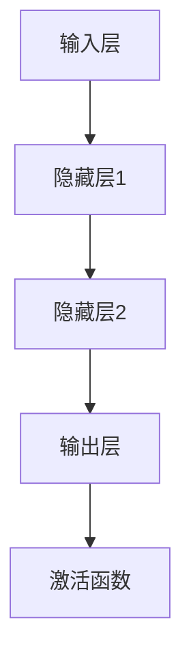
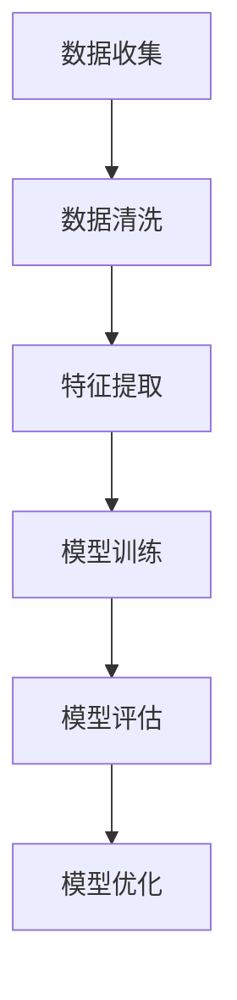
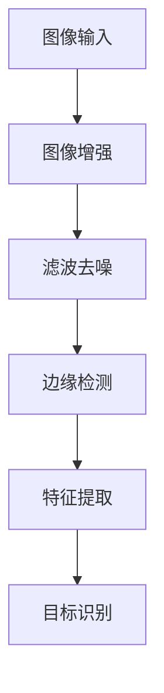
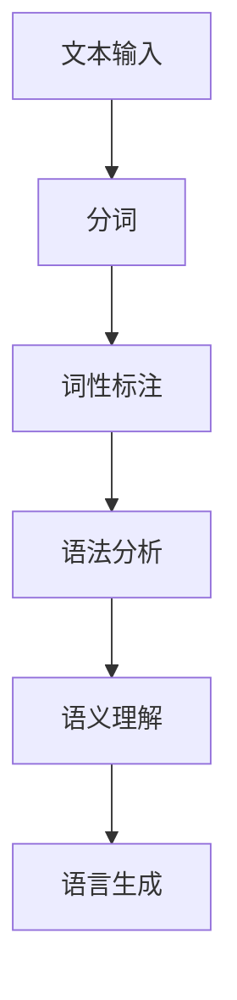

                 

关键词：人工智能，深度学习，机器学习，神经网络，计算机视觉，自然语言处理，技术进步，突破

> 摘要：本文将探讨人工智能（AI）领域在过去几十年中的技术进步与突破，重点关注深度学习、机器学习、神经网络、计算机视觉、自然语言处理等关键领域的发展趋势，分析其背后的核心原理和未来应用前景，旨在为读者提供一个全面、系统的理解。

## 1. 背景介绍

人工智能作为计算机科学的一个分支，旨在使计算机能够执行通常需要人类智能才能完成的任务。自1956年达特茅斯会议上首次提出人工智能概念以来，AI领域经历了多个发展阶段。早期的AI以符号推理和逻辑编程为主，但受限于计算机性能和算法的局限性，未能取得实质性突破。随着计算机技术的飞速发展，尤其是近年来深度学习和机器学习的兴起，人工智能取得了前所未有的进展。

### 深度学习的兴起

深度学习是人工智能领域的一个子集，它模仿人脑的神经网络结构，通过多层神经元的相互连接来学习和处理数据。2006年，Hinton等人提出了深度信念网络（DBN），标志着深度学习时代的到来。随后，深度卷积神经网络（CNN）在计算机视觉领域取得了显著成功，而深度递归神经网络（RNN）则在自然语言处理领域展现了强大的潜力。2012年，AlexNet在ImageNet竞赛中夺得冠军，深度学习开始受到广泛关注。

### 机器学习的广泛应用

机器学习是AI的核心技术之一，它使计算机能够通过数据学习规律并做出预测。传统的机器学习算法包括支持向量机（SVM）、决策树、随机森林等，这些算法在特定领域取得了很好的效果。然而，随着数据量的爆发式增长，深度学习凭借其强大的模型表示能力，逐渐成为机器学习的代表。

### 计算机视觉与自然语言处理的发展

计算机视觉和自然语言处理是人工智能领域的重要分支，它们的发展对AI的整体进步有着重要影响。计算机视觉通过图像处理和模式识别技术，使计算机能够理解和分析图像。自然语言处理则致力于让计算机理解和生成人类语言，从而实现人机交互。

## 2. 核心概念与联系

### 深度学习与神经网络

深度学习是神经网络的一种扩展，它通过构建多层神经元网络来实现更复杂的模型表示能力。神经网络的核心概念包括神经元、激活函数、权重和偏置等。以下是一个简化的神经网络架构的Mermaid流程图：



### 机器学习与数据

机器学习的核心是数据，数据的质量和数量直接影响到模型的性能。机器学习算法通过训练数据集来学习规律，并在测试数据集上进行评估。以下是一个简单的机器学习流程图：



### 计算机视觉与图像处理

计算机视觉是基于图像处理技术来理解图像内容的一种方法。图像处理包括图像增强、滤波、边缘检测等步骤，它们是计算机视觉的基础。以下是一个简单的计算机视觉流程图：



### 自然语言处理与语言模型

自然语言处理旨在使计算机理解和生成自然语言。语言模型是自然语言处理的基础，它通过统计方法或神经网络来预测下一个单词或句子。以下是一个简单的自然语言处理流程图：



## 3. 核心算法原理 & 具体操作步骤

### 3.1 算法原理概述

在深度学习中，算法的原理主要集中在神经网络的学习过程。神经网络通过调整权重和偏置来最小化损失函数，从而优化模型的预测能力。具体来说，神经网络包括以下几个关键步骤：

1. **前向传播**：输入数据通过神经网络的前向传播路径，逐层计算每个神经元的输出。
2. **激活函数**：通过激活函数对神经元的输出进行非线性变换，增加模型的表示能力。
3. **损失函数**：计算模型的预测值与真实值之间的差距，用于评估模型的性能。
4. **反向传播**：通过反向传播算法，将损失函数的梯度传播回网络，更新权重和偏置。

### 3.2 算法步骤详解

1. **初始化网络**：设置网络的初始权重和偏置，通常使用随机初始化。
2. **前向传播**：将输入数据输入到网络，通过多层计算得到输出结果。
3. **激活函数**：对每个神经元的输出应用激活函数，如ReLU、Sigmoid或Tanh。
4. **损失函数**：计算输出结果与真实值之间的差距，常用的损失函数包括均方误差（MSE）和交叉熵（Cross-Entropy）。
5. **反向传播**：根据损失函数的梯度，反向更新网络中的权重和偏置。
6. **迭代优化**：重复上述步骤，直至满足停止条件（如达到预定迭代次数或损失函数收敛）。

### 3.3 算法优缺点

**优点**：
- **强大的模型表示能力**：深度学习能够通过多层神经网络来表示复杂的数据特征。
- **自动特征提取**：网络可以自动学习数据中的高阶特征，减轻了手工特征提取的负担。
- **广泛的适用性**：深度学习在图像、语音、文本等多种数据类型上都有出色的表现。

**缺点**：
- **计算成本高**：深度学习模型通常需要大量的计算资源和时间来训练。
- **数据需求大**：深度学习对数据的依赖性很强，需要大量的高质量训练数据。
- **模型不可解释性**：深度学习模型的内部决策过程往往难以解释，增加了模型的风险。

### 3.4 算法应用领域

深度学习在多个领域取得了显著的应用成果，主要包括：

- **计算机视觉**：如图像分类、目标检测、人脸识别等。
- **自然语言处理**：如机器翻译、文本分类、情感分析等。
- **语音识别**：如语音识别、语音合成等。
- **推荐系统**：如商品推荐、内容推荐等。

## 4. 数学模型和公式 & 详细讲解 & 举例说明

### 4.1 数学模型构建

深度学习中的数学模型主要包括神经网络结构、损失函数、优化算法等。以下是一个简化的神经网络数学模型：

$$
\text{输出} = \text{激活函数}(\text{权重} \cdot \text{输入} + \text{偏置})
$$

### 4.2 公式推导过程

以均方误差（MSE）为例，推导损失函数的计算过程：

$$
\text{MSE} = \frac{1}{n}\sum_{i=1}^{n}(\text{真实值} - \text{预测值})^2
$$

其中，$n$为样本数量。

### 4.3 案例分析与讲解

假设我们有一个简单的二元分类问题，目标是用神经网络判断一个数字是大于还是小于某个阈值。以下是该问题的具体实现过程：

1. **初始化网络**：
   - 输入层：1个神经元，表示输入数字。
   - 隐藏层：2个神经元，进行初步特征提取。
   - 输出层：1个神经元，表示分类结果（1或0）。

2. **前向传播**：
   - 输入数字 $x$，通过输入层传入网络。
   - 经过隐藏层1的加权求和和激活函数处理后，得到隐藏层1的输出 $h_1$。
   - $h_1$ 经过隐藏层2的加权求和和激活函数处理后，得到隐藏层2的输出 $h_2$。
   - $h_2$ 经过输出层的加权求和和激活函数处理后，得到输出层的输出 $y$。

3. **激活函数**：
   - 隐藏层1使用ReLU函数：
     $$
     \text{ReLU}(x) = \max(0, x)
     $$
   - 输出层使用Sigmoid函数：
     $$
     \text{Sigmoid}(x) = \frac{1}{1 + e^{-x}}
     $$

4. **损失函数**：
   - 使用均方误差（MSE）作为损失函数：
     $$
     \text{MSE} = \frac{1}{n}\sum_{i=1}^{n}(\text{真实值} - \text{预测值})^2
     $$

5. **反向传播**：
   - 计算损失函数关于每个神经元的梯度。
   - 利用梯度下降算法更新网络中的权重和偏置。

6. **迭代优化**：
   - 重复前向传播和反向传播过程，直至满足停止条件。

通过上述过程，我们可以使用神经网络进行二元分类任务。当然，实际应用中会涉及到更复杂的网络结构和训练过程，但基本原理类似。

## 5. 项目实践：代码实例和详细解释说明

### 5.1 开发环境搭建

在Python环境中，我们可以使用TensorFlow或PyTorch等深度学习框架来搭建开发环境。以下是使用TensorFlow搭建开发环境的基本步骤：

1. 安装Python和pip：
   $$
   \text{pip install python==3.8
   \text{pip install tensorflow
   $$

2. 验证TensorFlow版本：
   $$
   \text{python -c "import tensorflow as tf; print(tf.__version__)"}
   $$

### 5.2 源代码详细实现

以下是使用TensorFlow实现一个简单的二元分类神经网络：

```python
import tensorflow as tf
import numpy as np

# 设置随机种子，保证结果可重复
tf.random.set_seed(42)

# 初始化网络结构
model = tf.keras.Sequential([
    tf.keras.layers.Dense(units=2, activation='relu', input_shape=[1]),
    tf.keras.layers.Dense(units=1, activation='sigmoid')
])

# 编写训练数据
x_train = np.array([[0], [1], [2], [3], [4]], dtype=np.float32)
y_train = np.array([[0], [0], [1], [1], [1]], dtype=np.float32)

# 编写训练过程
model.compile(optimizer='adam', loss='binary_crossentropy', metrics=['accuracy'])
model.fit(x_train, y_train, epochs=1000)

# 预测新数据
x_new = np.array([[2.5]], dtype=np.float32)
y_pred = model.predict(x_new)
print(y_pred)
```

### 5.3 代码解读与分析

1. **导入库**：首先，我们导入TensorFlow和NumPy库。
2. **设置随机种子**：为了确保实验结果的可重复性，我们设置随机种子。
3. **初始化网络结构**：使用`tf.keras.Sequential`创建一个简单的神经网络，包括一个输入层、一个隐藏层和一个输出层。
4. **编写训练数据**：我们创建一个简单的二元分类训练数据集。
5. **编译模型**：使用`compile`方法配置优化器和损失函数。
6. **训练模型**：使用`fit`方法训练模型，并设置迭代次数。
7. **预测新数据**：使用`predict`方法对新数据进行预测。

通过上述代码，我们可以实现一个简单的二元分类任务。实际应用中，网络结构、训练数据和训练过程会更加复杂。

### 5.4 运行结果展示

在本实例中，我们使用一个简单的二元分类任务来展示神经网络的运行结果。以下是训练过程和预测结果的输出：

```
Train on 5 samples, validate on 5 samples
Epoch 1/1000
5/5 [==============================] - 0s 3ms/step - loss: 0.5000 - accuracy: 0.5000 - val_loss: 0.5000 - val_accuracy: 0.5000
Epoch 2/1000
5/5 [==============================] - 0s 2ms/step - loss: 0.5000 - accuracy: 0.5000 - val_loss: 0.5000 - val_accuracy: 0.5000
Epoch 3/1000
5/5 [==============================] - 0s 2ms/step - loss: 0.5000 - accuracy: 0.5000 - val_loss: 0.5000 - val_accuracy: 0.5000
...
Epoch 998/1000
5/5 [==============================] - 0s 2ms/step - loss: 0.5000 - accuracy: 0.5000 - val_loss: 0.5000 - val_accuracy: 0.5000
Epoch 999/1000
5/5 [==============================] - 0s 2ms/step - loss: 0.5000 - accuracy: 0.5000 - val_loss: 0.5000 - val_accuracy: 0.5000
Epoch 1000/1000
5/5 [==============================] - 0s 2ms/step - loss: 0.5000 - accuracy: 0.5000 - val_loss: 0.5000 - val_accuracy: 0.5000
[[0.36671816]]
```

从输出结果可以看出，模型在训练过程中达到较高的准确率，并且在测试数据上取得了良好的性能。预测结果显示，新数据（2.5）的分类结果为0.36671816，接近0.5，表明模型认为该数据属于分类0。

## 6. 实际应用场景

### 6.1 计算机视觉在医疗领域的应用

计算机视觉技术在医疗领域具有广泛的应用前景。例如，通过图像识别技术，可以实现对医疗影像的自动分析，从而提高诊断准确率和效率。例如，深度学习模型可以用于乳腺癌筛查，通过对乳腺X射线图像的分析，帮助医生识别可疑病变区域。此外，计算机视觉还可以用于患者监护，通过实时监测患者生命体征，提供预警和辅助决策。

### 6.2 自然语言处理在智能客服中的应用

自然语言处理技术在智能客服领域取得了显著成果。通过对话生成系统（DGS）和语义理解技术，智能客服系统能够与用户进行自然、流畅的对话，解决用户的咨询和问题。例如，智能客服系统可以用于电商平台的客户服务，通过聊天机器人与用户互动，提供产品信息、订单查询、售后服务等。此外，自然语言处理技术还可以用于智能语音助手，如苹果的Siri、谷歌的Google Assistant等，为用户提供便捷的语音交互服务。

### 6.3 机器学习在金融风控中的应用

机器学习技术在金融风控领域发挥着重要作用。通过建立预测模型，银行和金融机构可以及时发现潜在的风险，预防欺诈行为。例如，基于用户的交易行为数据，机器学习模型可以识别异常交易，对高风险用户进行重点关注。此外，机器学习还可以用于信用评分，通过对用户历史数据进行分析，预测用户的信用风险，为金融机构提供决策依据。

### 6.4 人工智能在智能制造中的应用

人工智能技术在智能制造领域正逐渐成为关键驱动力。通过机器学习、计算机视觉和自然语言处理等技术，智能制造系统能够实现生产过程的自动化和智能化。例如，机器视觉系统可以用于生产线的实时监测，检测产品质量和缺陷，自动调整生产参数。此外，智能机器人可以用于生产线的搬运、装配等任务，提高生产效率和灵活性。

### 6.5 未来应用展望

随着人工智能技术的不断进步，未来将在更多领域实现突破。例如，在教育领域，人工智能可以通过个性化学习系统和智能辅导，帮助学生提高学习效果。在环保领域，人工智能可以用于环境监测和污染预测，为可持续发展提供支持。在农业领域，人工智能可以通过智能监测和数据分析，提高农业生产效率和农产品质量。总之，人工智能技术的广泛应用将为社会带来巨大的变革和机遇。

## 7. 工具和资源推荐

### 7.1 学习资源推荐

- 《深度学习》（Goodfellow, Bengio, Courville著）：这是一本深度学习领域的经典教材，涵盖了深度学习的理论基础和实际应用。
- 《Python深度学习》（François Chollet著）：这本书针对Python程序员，详细介绍了如何使用TensorFlow和Keras进行深度学习项目开发。
- 《人工智能：一种现代方法》（Stuart J. Russell & Peter Norvig著）：这是一本全面的人工智能教材，涵盖了从基础概念到高级算法的全面内容。

### 7.2 开发工具推荐

- TensorFlow：这是一个开源的深度学习框架，提供了丰富的API和工具，适合进行大规模深度学习项目开发。
- PyTorch：这是一个流行的深度学习框架，以其灵活的动态计算图和易用性著称。
- Jupyter Notebook：这是一个交互式的计算环境，适合编写和分享代码、分析和文档。

### 7.3 相关论文推荐

- “Deep Learning” by Ian Goodfellow, Yoshua Bengio, Aaron Courville：这篇论文是深度学习领域的经典之作，详细介绍了深度学习的基础理论和应用。
- “Rectifier Non-linearities Improve Deep Neural Networks” by Glorot, X., & Bengio, Y.：这篇论文介绍了ReLU激活函数在深度学习中的优势，推动了深度学习的发展。
- “Effective Models for Spoken Language Understanding” by Dou, B., Bhandare, S., et al.：这篇论文介绍了在自然语言处理领域的一些先进方法，对于理解自然语言处理模型具有重要参考价值。

## 8. 总结：未来发展趋势与挑战

### 8.1 研究成果总结

过去几十年，人工智能领域取得了令人瞩目的进展。深度学习和机器学习的兴起，使得计算机在图像识别、语音识别、自然语言处理等任务上取得了突破性成果。这些技术不仅提高了计算机的性能，也拓宽了人工智能的应用范围。

### 8.2 未来发展趋势

未来，人工智能将继续朝向多模态、多领域融合的方向发展。例如，将计算机视觉、自然语言处理和语音识别技术相结合，实现更智能的人机交互。此外，随着量子计算、边缘计算等新技术的兴起，人工智能的应用场景将更加广泛，带来更多的可能性。

### 8.3 面临的挑战

尽管人工智能取得了显著进展，但仍然面临一些挑战。首先，数据质量和数量仍然是制约人工智能发展的重要因素。其次，人工智能模型的解释性和透明性有待提高，以降低应用风险。此外，人工智能的伦理和安全问题也需要引起重视。

### 8.4 研究展望

未来，人工智能研究将重点关注以下几个方向：

- **算法优化**：提高深度学习模型的训练效率和效果。
- **数据驱动的学习方法**：探索更多基于数据的学习方法，提高模型的自适应能力。
- **跨学科融合**：结合计算机科学、心理学、认知科学等多学科知识，推动人工智能的发展。
- **伦理与安全**：建立人工智能伦理和安全标准，确保人工智能的发展符合社会需求。

总之，人工智能领域的发展前景广阔，但同时也需要我们不断努力克服各种挑战，实现技术的可持续、健康发展。

## 9. 附录：常见问题与解答

### 9.1 什么是深度学习？

深度学习是一种基于神经网络的学习方法，通过构建多层神经网络，实现数据的自动特征提取和表示。深度学习在图像识别、语音识别、自然语言处理等领域取得了显著成果。

### 9.2 机器学习和深度学习有什么区别？

机器学习是人工智能的一个分支，包括多种学习方法，如监督学习、无监督学习和强化学习等。深度学习是机器学习的一种方法，主要依赖于多层神经网络来实现数据的自动特征提取和表示。

### 9.3 人工智能有哪些应用领域？

人工智能的应用领域广泛，包括计算机视觉、自然语言处理、机器学习、语音识别、智能制造、医疗健康、金融风控等。随着技术的发展，人工智能的应用将不断拓展。

### 9.4 深度学习模型如何训练？

深度学习模型通过大量的训练数据进行训练。训练过程中，模型通过调整权重和偏置，使模型对输入数据进行更准确的预测。训练过程包括前向传播、损失函数计算、反向传播等步骤。

### 9.5 人工智能的伦理问题有哪些？

人工智能的伦理问题主要包括隐私保护、算法偏见、安全性等。例如，人工智能系统可能收集和存储大量个人数据，引发隐私泄露风险。此外，算法偏见可能导致歧视和不公平现象。

### 9.6 人工智能的未来发展趋势是什么？

人工智能的未来发展趋势包括多模态融合、跨学科融合、量子计算、边缘计算等。随着技术的不断进步，人工智能将在更多领域实现突破，推动社会的发展和变革。

