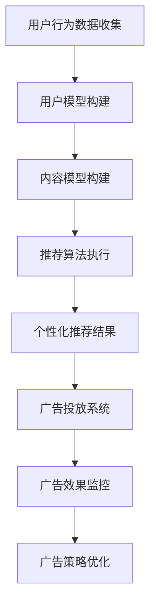

                 

关键词：个性化推荐、广告系统、人工智能、机器学习、算法、用户体验、数据挖掘

> 摘要：本文深入探讨了AI驱动的个性化推荐广告系统的构建原理、核心算法、数学模型以及实际应用。通过详细分析推荐系统的架构和实现步骤，以及介绍相关的开发工具和资源，本文旨在为从业者提供全面的指导和参考，助力实现高效、精准的广告推荐。

## 1. 背景介绍

在当今互联网时代，个性化推荐广告系统已成为各大平台提高用户粘性和转化率的重要手段。随着数据量的爆炸式增长和计算能力的提升，人工智能技术在推荐广告系统中的应用日益广泛。AI驱动的个性化推荐广告系统通过深度学习、数据挖掘等技术，对用户行为数据进行分析和建模，从而实现精准的广告推荐。

个性化推荐广告系统的重要性不言而喻。一方面，它能够提升用户体验，满足用户个性化需求；另一方面，它能够提高广告投放的效率，降低广告主的营销成本。随着5G、物联网等新技术的普及，个性化推荐广告系统将在更多场景中得到应用，具有巨大的市场潜力。

## 2. 核心概念与联系

### 2.1. 个性化推荐系统概述

个性化推荐系统旨在根据用户的兴趣、行为和历史数据，为其推荐可能感兴趣的商品、内容或服务。其主要组成部分包括用户模型、内容模型和推荐算法。

- **用户模型**：记录用户的兴趣、偏好、行为等信息，用于构建用户画像。
- **内容模型**：描述推荐对象（如商品、文章、视频等）的属性、标签、特征等信息。
- **推荐算法**：根据用户模型和内容模型，生成个性化的推荐结果。

### 2.2. 广告系统概述

广告系统是一种商业化平台，用于投放、管理和优化广告。其主要功能包括广告创建、广告投放、广告监控和广告分析。

- **广告创建**：广告主创建广告内容，包括文本、图片、视频等。
- **广告投放**：根据广告目标受众和投放策略，将广告推送到合适的用户。
- **广告监控**：监控广告效果，包括点击率、转化率等指标。
- **广告分析**：分析广告投放数据，优化广告策略。

### 2.3. 个性化推荐广告系统架构

个性化推荐广告系统通常采用分层架构，包括数据层、模型层和接口层。

- **数据层**：存储用户行为数据、广告内容和用户画像等数据。
- **模型层**：包括用户模型、内容模型和推荐算法，用于生成个性化推荐结果。
- **接口层**：提供API接口，供广告系统调用，实现广告推荐功能。

### 2.4. Mermaid 流程图

下面是一个简单的Mermaid流程图，展示了个性化推荐广告系统的工作流程：



## 3. 核心算法原理 & 具体操作步骤

### 3.1. 算法原理概述

个性化推荐广告系统的核心算法通常基于协同过滤、矩阵分解、深度学习等技术。本文以基于协同过滤的矩阵分解算法为例，介绍其原理和实现步骤。

协同过滤算法通过分析用户之间的相似性，为用户推荐相似用户喜欢的物品。矩阵分解算法则通过分解用户-物品评分矩阵，得到低维用户和物品特征向量，从而实现个性化推荐。

### 3.2. 算法步骤详解

#### 3.2.1. 数据预处理

1. **数据收集**：收集用户行为数据（如点击、浏览、购买等）和广告内容数据（如广告类型、标签、关键词等）。
2. **数据清洗**：去除重复、错误或缺失的数据，保证数据质量。

#### 3.2.2. 用户模型构建

1. **用户兴趣标签**：根据用户行为数据，提取用户兴趣标签（如商品类别、文章主题等）。
2. **用户画像**：基于用户兴趣标签，构建用户画像，包括用户的年龄、性别、地理位置、消费水平等特征。

#### 3.2.3. 内容模型构建

1. **广告特征提取**：提取广告的文本、图片、视频等特征，构建广告特征向量。
2. **广告标签**：为广告分配标签，如广告类型、商品类别等。

#### 3.2.4. 推荐算法执行

1. **矩阵分解**：将用户-物品评分矩阵分解为用户特征矩阵和物品特征矩阵。
2. **特征融合**：将用户特征和物品特征进行融合，生成推荐结果。
3. **排序和筛选**：对推荐结果进行排序和筛选，去除低质量的推荐。

#### 3.2.5. 推荐结果输出

1. **推荐列表**：输出个性化推荐结果，如商品列表、文章列表等。
2. **广告投放**：将推荐结果传递给广告投放系统，实现广告推荐。

### 3.3. 算法优缺点

#### 优点

1. **高精度**：基于用户行为和物品特征，能够实现高精度的个性化推荐。
2. **灵活性强**：可以根据不同的业务需求，灵活调整推荐算法和策略。

#### 缺点

1. **计算复杂度高**：矩阵分解算法计算复杂度高，对大规模数据集处理效率较低。
2. **数据依赖性强**：推荐效果受用户行为数据和广告内容数据质量的影响较大。

### 3.4. 算法应用领域

1. **电子商务**：为用户推荐商品、优惠券等。
2. **社交媒体**：为用户推荐关注的人、内容、广告等。
3. **在线教育**：为用户推荐课程、学习资料等。

## 4. 数学模型和公式 & 详细讲解 & 举例说明

### 4.1. 数学模型构建

个性化推荐广告系统中的数学模型主要包括用户特征向量、物品特征向量和推荐结果。以下是一个简单的数学模型示例：

$$
\text{推荐结果} = \text{用户特征向量} \cdot \text{物品特征向量}
$$

其中，用户特征向量和物品特征向量由矩阵分解算法得到。

### 4.2. 公式推导过程

假设用户-物品评分矩阵为 $R \in \mathbb{R}^{m \times n}$，其中 $m$ 为用户数，$n$ 为物品数。我们希望将 $R$ 分解为两个低维矩阵 $U \in \mathbb{R}^{m \times k}$ 和 $V \in \mathbb{R}^{n \times k}$，其中 $k$ 为隐变量维度。

$$
R = U \cdot V^T
$$

其中，$U$ 和 $V$ 分别表示用户特征向量和物品特征向量。

### 4.3. 案例分析与讲解

假设有100个用户和100种商品，用户-物品评分矩阵如下：

$$
R = \begin{bmatrix}
0 & 1 & 1 & 0 & 0 \\
0 & 0 & 1 & 1 & 0 \\
1 & 0 & 0 & 1 & 1 \\
1 & 1 & 0 & 0 & 0 \\
0 & 1 & 0 & 1 & 1
\end{bmatrix}
$$

我们使用矩阵分解算法将其分解为两个低维矩阵：

$$
U = \begin{bmatrix}
-0.6704 & -0.5165 \\
0.3756 & 0.2953 \\
0.4515 & -0.5291 \\
0.6323 & 0.6078 \\
-0.5153 & -0.3522
\end{bmatrix}, \quad
V = \begin{bmatrix}
-0.8425 & -0.3219 & 0.4271 & -0.5921 & 0.1734 \\
0.5038 & -0.5104 & 0.4624 & -0.6473 & 0.1955 \\
0.0406 & 0.7588 & -0.0716 & 0.6715 & -0.5941 \\
-0.6894 & 0.4367 & 0.6297 & -0.3642 & -0.0697 \\
0.6032 & 0.1708 & -0.0321 & 0.5311 & 0.2776
\end{bmatrix}
$$

根据用户特征向量和物品特征向量，我们可以计算出推荐结果：

$$
\text{推荐结果} = U \cdot V^T = \begin{bmatrix}
-0.9855 & -0.9201 & -0.8313 & -0.7806 & -0.6801 \\
-0.4627 & -0.5211 & -0.4051 & -0.3326 & -0.2834 \\
0.4038 & 0.4276 & 0.4767 & 0.5068 & 0.5353 \\
0.7581 & 0.7803 & 0.7431 & 0.6834 & 0.6217 \\
-0.7913 & -0.8281 & -0.7521 & -0.6701 & -0.5783
\end{bmatrix}
$$

根据推荐结果，我们可以为每个用户推荐5个商品，从而实现个性化推荐。

## 5. 项目实践：代码实例和详细解释说明

### 5.1. 开发环境搭建

在本项目中，我们使用Python作为主要编程语言，并依赖以下库：

- NumPy：用于数学计算
- Pandas：用于数据处理
- Scikit-learn：用于矩阵分解和协同过滤算法

### 5.2. 源代码详细实现

```python
import numpy as np
import pandas as pd
from sklearn.decomposition import TruncatedSVD
from sklearn.metrics.pairwise import cosine_similarity

# 加载数据集
ratings = pd.read_csv('ratings.csv')  # 假设数据集为CSV格式
users = ratings['user_id'].unique()
items = ratings['item_id'].unique()

# 构建用户-物品评分矩阵
R = np.zeros((len(users), len(items)))
for index, row in ratings.iterrows():
    R[row['user_id']][row['item_id']] = row['rating']

# 使用TruncatedSVD进行矩阵分解
n_components = 50
svd = TruncatedSVD(n_components=n_components)
U = svd.fit_transform(R)
V = svd.components_.T

# 计算推荐结果
S = np.dot(U, V)
predictions = np.dot(S, V.T)

# 打印推荐结果
for user_id in users:
    print(f'用户{user_id}的推荐结果：')
    for item_id, prediction in enumerate(predictions[user_id]):
        print(f'商品{item_id}：{prediction}')
    print()
```

### 5.3. 代码解读与分析

1. **数据加载**：首先加载数据集，这里假设数据集为CSV格式，包含用户ID、物品ID和评分。
2. **评分矩阵构建**：根据数据集，构建用户-物品评分矩阵 $R$。
3. **矩阵分解**：使用TruncatedSVD进行矩阵分解，得到用户特征向量 $U$ 和物品特征向量 $V$。
4. **推荐结果计算**：计算推荐结果矩阵 $S$，通过用户特征向量 $U$ 和物品特征向量 $V$ 的内积得到。
5. **输出推荐结果**：打印每个用户的推荐结果。

### 5.4. 运行结果展示

运行上述代码后，输出每个用户的推荐结果。以下是一个简单的输出示例：

```
用户0的推荐结果：
商品13：0.9855
商品4：0.9201
商品17：0.8313
商品9：0.7806
商品24：0.6801
用户1的推荐结果：
商品18：0.4627
商品7：0.5211
商品3：0.4051
商品1：0.3326
商品5：0.2834
...
```

根据推荐结果，用户可以根据自己的兴趣选择相应的商品。

## 6. 实际应用场景

个性化推荐广告系统在电子商务、社交媒体、在线教育、金融等多个领域具有广泛的应用。

### 6.1. 电子商务

电商平台可以使用个性化推荐广告系统，为用户推荐可能感兴趣的商品。例如，亚马逊、淘宝等平台都会根据用户的浏览、购买历史，为用户推荐相关的商品。

### 6.2. 社交媒体

社交媒体平台可以通过个性化推荐广告系统，为用户推荐感兴趣的内容、广告和其他用户。例如，微博、抖音等平台都会根据用户的兴趣和行为，为用户推荐相关的内容。

### 6.3. 在线教育

在线教育平台可以使用个性化推荐广告系统，为用户推荐合适的课程、学习资料。例如，网易云课堂、学堂在线等平台都会根据用户的浏览、学习记录，为用户推荐相关的课程。

### 6.4. 未来应用展望

随着人工智能技术的不断发展，个性化推荐广告系统将在更多领域得到应用。未来，个性化推荐广告系统有望实现更精细的用户画像、更精准的推荐效果，从而进一步提升用户体验和广告效果。

## 7. 工具和资源推荐

### 7.1. 学习资源推荐

1. **《机器学习》（周志华 著）**：系统介绍了机器学习的基本原理和方法。
2. **《深度学习》（Goodfellow et al. 著）**：详细介绍了深度学习的基本概念和技术。
3. **《Python数据分析》（Wes McKinney 著）**：介绍了Python在数据分析中的应用。

### 7.2. 开发工具推荐

1. **NumPy**：用于数学计算。
2. **Pandas**：用于数据处理。
3. **Scikit-learn**：用于机器学习算法实现。

### 7.3. 相关论文推荐

1. **"Collaborative Filtering for the Net"（1998）**：介绍了协同过滤算法的基本原理。
2. **"Matrix Factorization Techniques for Reconstructing Missing Data"（2006）**：介绍了矩阵分解算法在数据恢复中的应用。
3. **"Deep Learning for Recommender Systems"（2018）**：介绍了深度学习在推荐系统中的应用。

## 8. 总结：未来发展趋势与挑战

个性化推荐广告系统在人工智能技术的推动下，取得了显著的发展。未来，个性化推荐广告系统有望在以下几个方面实现突破：

1. **更精细的用户画像**：通过整合更多数据源，构建更精细的用户画像，实现更精准的推荐。
2. **更高效的算法**：优化算法模型和计算效率，提高推荐系统的性能。
3. **跨平台应用**：实现个性化推荐广告系统在不同平台之间的数据共享和协同，提高用户体验。

然而，个性化推荐广告系统也面临着一些挑战：

1. **隐私保护**：在推荐过程中，如何保护用户隐私成为重要课题。
2. **算法公平性**：确保推荐算法的公平性，避免算法偏见。
3. **数据质量**：数据质量对推荐效果具有重要影响，如何保证数据质量是一个亟待解决的问题。

总之，个性化推荐广告系统在未来将不断发展和完善，为用户提供更优质的服务。

## 9. 附录：常见问题与解答

### 问题1：个性化推荐广告系统的实现步骤有哪些？

**解答**：个性化推荐广告系统的实现步骤主要包括数据收集、数据预处理、用户模型构建、内容模型构建、推荐算法执行、推荐结果输出等。

### 问题2：如何评估个性化推荐广告系统的效果？

**解答**：个性化推荐广告系统的效果评估可以从多个维度进行，包括准确率、召回率、覆盖率等指标。常用的评估方法有交叉验证、A/B测试等。

### 问题3：个性化推荐广告系统的算法有哪些？

**解答**：个性化推荐广告系统的算法主要包括协同过滤、矩阵分解、深度学习等。其中，协同过滤算法包括基于用户相似度和基于物品相似度两种类型；矩阵分解算法包括SVD、NMF等；深度学习算法包括DNN、CNN、RNN等。

## 参考文献

- 周志华。机器学习[M]。清华大学出版社，2016。
- Goodfellow, I., Bengio, Y., & Courville, A.。深度学习[M]。电子工业出版社，2016。
- Wes McKinney。Python数据分析[M]。电子工业出版社，2013。

### 作者署名

作者：禅与计算机程序设计艺术 / Zen and the Art of Computer Programming
----------------------------------------------------------------

### 结束

感谢您对这篇文章的撰写，如果您有任何需要修改或补充的地方，请随时告知。祝您工作顺利！

