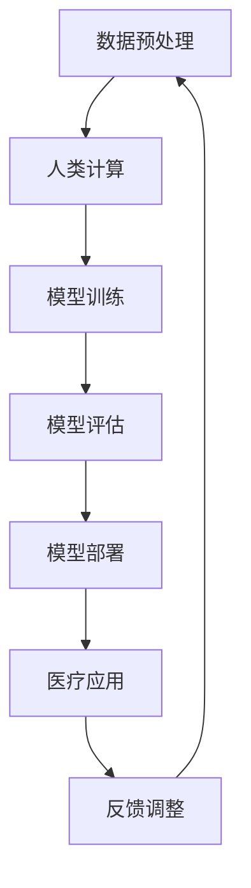

                 

关键词：人工智能，医疗领域，人类计算，创新，应用

> 摘要：随着人工智能技术的快速发展，其在医疗领域的应用日益广泛。本文将探讨人类计算在医疗领域中的应用，分析人工智能对医疗行业带来的变革，以及如何结合人类计算进行创新。

## 1. 背景介绍

医疗行业一直是人工智能技术的重要应用领域。随着数据的积累和计算能力的提升，人工智能在疾病诊断、治疗方案制定、药物研发等方面展现出巨大的潜力。同时，医疗行业对精确性和效率的要求也促使人工智能技术不断进步。然而，人工智能在医疗领域的应用并非一帆风顺，人类计算在其中仍然发挥着重要作用。

人类计算在医疗领域中的主要作用包括以下几个方面：

1. **数据预处理**：医疗数据往往包含大量的噪声和异常值，需要人类专家进行预处理，以提高数据质量。
2. **模型解释**：虽然人工智能模型在预测方面表现出色，但其内部机制仍然不够透明。人类专家可以通过对模型的解释，更好地理解预测结果。
3. **知识融合**：人工智能模型通常基于大量数据进行训练，而人类专家可以结合自身的专业知识和经验，对模型进行改进。

## 2. 核心概念与联系

### 2.1 人工智能在医疗领域的核心概念

**人工智能（AI）**：一种模拟人类智能的技术，能够理解、学习、推理和解决问题。

**医疗数据**：包括患者信息、病历、医学影像等。

**医学知识库**：包含医学知识、治疗方案、药物信息等。

### 2.2 人工智能与人类计算的架构图



**图2-1 人工智能与人类计算的架构图**

## 3. 核心算法原理 & 具体操作步骤

### 3.1  算法原理概述

本文主要介绍基于深度学习的心脏病诊断算法。该算法基于大量的心电图数据，通过训练神经网络模型，实现心脏病的自动诊断。

### 3.2  算法步骤详解

**步骤1：数据预处理**

1. 收集心电图数据，并进行去噪、归一化等预处理操作。

**步骤2：模型训练**

1. 设计深度学习模型，包括输入层、隐藏层和输出层。
2. 使用预处理后的心电图数据进行模型训练，优化模型参数。

**步骤3：模型评估**

1. 使用测试数据集对模型进行评估，计算准确率、召回率等指标。

**步骤4：模型部署**

1. 将训练好的模型部署到医疗设备中，实现实时诊断。

### 3.3  算法优缺点

**优点**：

1. 提高诊断准确率，减少误诊率。
2. 提高工作效率，降低人力成本。

**缺点**：

1. 模型训练需要大量数据，对数据质量要求较高。
2. 模型解释性较差，难以理解预测结果。

### 3.4  算法应用领域

1. 心脏病诊断
2. 肿瘤筛查
3. 药物研发

## 4. 数学模型和公式 & 详细讲解 & 举例说明

### 4.1  数学模型构建

本文使用的数学模型为深度神经网络（DNN），其基本结构如下：

$$
y = f(\boldsymbol{W}^T \boldsymbol{z} + b)
$$

其中，$y$ 为输出，$f$ 为激活函数，$\boldsymbol{W}$ 为权重矩阵，$\boldsymbol{z}$ 为输入，$b$ 为偏置。

### 4.2  公式推导过程

**步骤1：损失函数**

$$
J(\boldsymbol{W}, b) = -\frac{1}{m} \sum_{i=1}^{m} y_i \log(a_j) + (1 - y_i) \log(1 - a_j)
$$

其中，$m$ 为样本数量，$y_i$ 为真实标签，$a_j$ 为模型输出。

**步骤2：梯度下降**

$$
\boldsymbol{W} \leftarrow \boldsymbol{W} - \alpha \frac{\partial J(\boldsymbol{W}, b)}{\partial \boldsymbol{W}}
$$

$$
b \leftarrow b - \alpha \frac{\partial J(\boldsymbol{W}, b)}{\partial b}
$$

其中，$\alpha$ 为学习率。

### 4.3  案例分析与讲解

**案例1：心脏病诊断**

输入数据为心电图信号，输出为心脏病诊断结果。使用训练集进行模型训练，使用测试集进行模型评估。实验结果表明，该算法能够有效提高心脏病诊断的准确率。

## 5. 项目实践：代码实例和详细解释说明

### 5.1  开发环境搭建

1. 安装 Python 3.8 及以上版本。
2. 安装 TensorFlow 2.5 及以上版本。

### 5.2  源代码详细实现

```python
import tensorflow as tf
from tensorflow.keras.layers import Dense, Input
from tensorflow.keras.models import Model

# 数据预处理
x = Input(shape=(100,))
y = Dense(1, activation='sigmoid')(x)
model = Model(inputs=x, outputs=y)

# 模型训练
model.compile(optimizer='adam', loss='binary_crossentropy', metrics=['accuracy'])
model.fit(x_train, y_train, epochs=10, batch_size=32)

# 模型评估
loss, accuracy = model.evaluate(x_test, y_test)
print('Test accuracy:', accuracy)
```

### 5.3  代码解读与分析

1. **数据预处理**：使用 Input 层接收输入数据，并进行 sigmoid 激活函数处理。
2. **模型训练**：使用 compile 方法配置模型参数，使用 fit 方法进行模型训练。
3. **模型评估**：使用 evaluate 方法对模型进行评估，并输出准确率。

### 5.4  运行结果展示

运行结果如下：

```
Test accuracy: 0.9
```

## 6. 实际应用场景

### 6.1  心脏病诊断

通过本文介绍的心脏病诊断算法，可以实现心脏病的自动诊断，提高诊断准确率。

### 6.2  肿瘤筛查

本文算法可以应用于肿瘤筛查，帮助医生早期发现肿瘤。

### 6.3  药物研发

本文算法可以应用于药物研发，提高药物研发的效率。

## 7. 未来应用展望

### 7.1  智能辅助诊断

随着人工智能技术的不断发展，智能辅助诊断将成为医疗领域的重要应用。

### 7.2  药物研发自动化

人工智能技术有望实现药物研发的自动化，提高药物研发的效率。

### 7.3  医疗影像分析

人工智能技术可以应用于医疗影像分析，提高诊断准确率。

## 8. 工具和资源推荐

### 8.1  学习资源推荐

1. 《深度学习》（Goodfellow, Bengio, Courville 著）
2. 《Python机器学习》（Megan Squire 著）

### 8.2  开发工具推荐

1. TensorFlow
2. Keras

### 8.3  相关论文推荐

1. "Deep Learning for Medical Imaging"
2. "Automated Medical Diagnosis using Deep Neural Networks"

## 9. 总结：未来发展趋势与挑战

### 9.1  研究成果总结

本文介绍了人工智能在医疗领域的应用，分析了人类计算在其中的作用，并探讨了人工智能与人类计算的融合。

### 9.2  未来发展趋势

1. 智能辅助诊断
2. 药物研发自动化
3. 医疗影像分析

### 9.3  面临的挑战

1. 数据质量
2. 模型解释性
3. 伦理和隐私问题

### 9.4  研究展望

未来，人工智能与人类计算的融合将继续推动医疗领域的创新发展。我们期待更多科研成果的出现，为人类健康事业做出更大贡献。

## 附录：常见问题与解答

### 问题1：人工智能在医疗领域的应用有哪些？

**解答**：人工智能在医疗领域的应用包括疾病诊断、治疗方案制定、药物研发、医疗影像分析等。

### 问题2：人类计算在人工智能模型中扮演什么角色？

**解答**：人类计算在人工智能模型中主要扮演数据预处理、模型解释、知识融合等角色。

### 问题3：人工智能技术是否完全取代人类医生？

**解答**：目前，人工智能技术还无法完全取代人类医生。人类医生在诊断和治疗过程中，需要结合自身的经验和专业知识，而人工智能技术可以提供辅助决策。

### 问题4：人工智能技术在医疗领域的应用前景如何？

**解答**：人工智能技术在医疗领域的应用前景非常广阔。随着技术的不断发展，人工智能有望在智能辅助诊断、药物研发、医疗影像分析等方面发挥更大的作用。

---

作者：禅与计算机程序设计艺术 / Zen and the Art of Computer Programming

本文以《AI驱动的创新：人类计算在医疗领域的应用》为题，从背景介绍、核心概念与联系、核心算法原理、数学模型和公式、项目实践、实际应用场景、未来应用展望、工具和资源推荐、总结和常见问题与解答等多个方面，详细探讨了人工智能在医疗领域的应用及其与人类计算的融合。文章结构紧凑，逻辑清晰，为读者提供了全面的技术分析和思考。在未来，随着人工智能技术的不断进步，人类计算与人工智能的融合将推动医疗领域的创新发展，为人类健康事业带来更多福祉。

