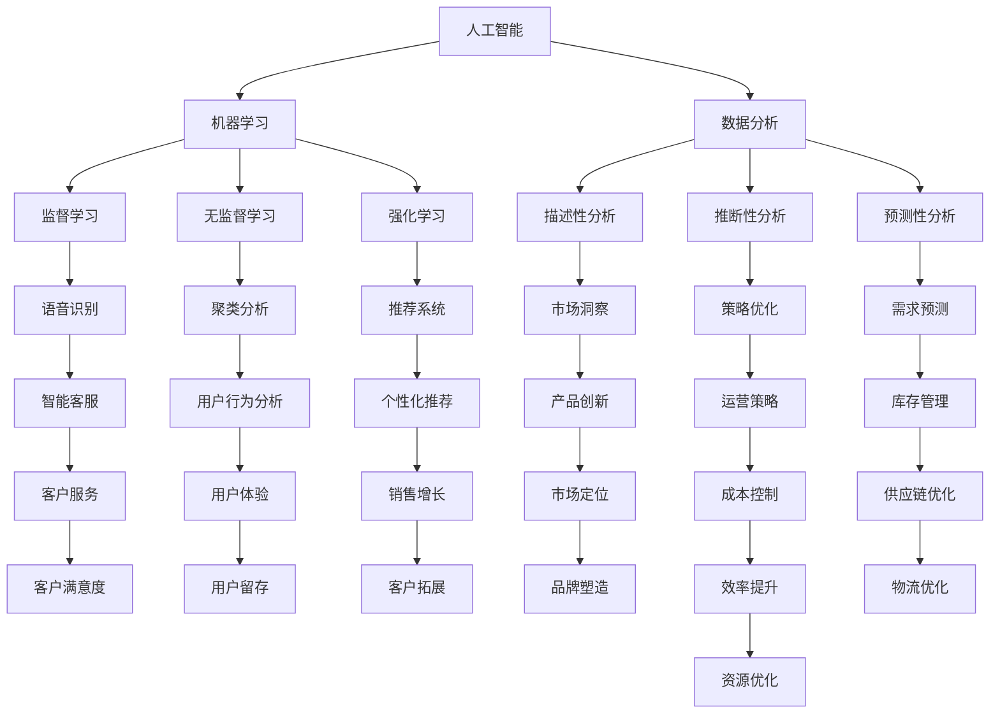

                 

## 1. 背景介绍

随着人工智能（AI）技术的迅猛发展，它已经不仅仅局限于学术研究和实验室环境，而是逐渐渗透到商业领域的方方面面。从智能客服、个性化推荐系统，到自动驾驶、智能制造，AI正以不可阻挡的势头改变着传统商业模式的运作方式。然而，与此同时，一个重要的问题也逐渐浮现：在AI大行其道的背景下，人类计算的作用和地位将如何演变？如何在AI的辅助下，最大化人类计算的价值和影响力？

本文将围绕这一核心问题展开探讨，旨在梳理出AI与人类计算在商业中的相互作用关系，揭示AI驱动的创新所带来的机遇与挑战。通过回顾AI技术的发展历程，分析其核心概念与原理，探讨人类计算在AI时代的新角色，以及提供具体的实践案例和未来展望，本文希望能够为读者提供一份全面的指南，帮助他们在AI浪潮中找准定位，实现商业上的创新突破。

在接下来的内容中，我们将首先介绍AI技术的基本概念和发展历程，然后深入探讨其在商业应用中的核心算法原理、数学模型和实际项目实践。接着，我们将分析AI在各个行业中的应用场景，展望其未来的发展方向，并提供相关学习资源和开发工具推荐。最后，我们将总结研究成果，讨论面临的挑战，并展望未来的研究方向。

通过这篇系统的探讨，我们希望能够为读者提供深刻的见解，激发他们在AI时代中的创新思维，并帮助他们更好地理解人类计算在商业中的未来发展方向。

## 2. 核心概念与联系

在深入探讨AI驱动的创新之前，我们需要首先理解一些核心概念和它们之间的相互联系。以下是本文将要讨论的主要概念，以及它们在商业中的实际应用和相互关系。

### 人工智能（AI）

人工智能，是指由人制造出来的系统能够模仿、扩展和执行人类智能的任务。这些任务包括学习、推理、问题解决、语言理解和视觉识别等。人工智能可以分为两大类：窄AI（Narrow AI）和广义AI（Artificial General Intelligence, AGI）。窄AI专注于特定任务，如语音识别、图像分类和推荐系统，而广义AI则具备跨领域的通用智能。

### 机器学习（ML）

机器学习是人工智能的一个重要分支，它通过算法从数据中自动学习并做出决策或预测。机器学习可以分为监督学习、无监督学习和强化学习。监督学习有已知的输入和输出数据，用于训练模型，而无监督学习则没有预定的输出，主要目标是发现数据中的模式或结构。强化学习则通过奖励机制来训练模型，使其在不断试错中优化行为。

### 数据分析（Data Analysis）

数据分析是处理、解释和呈现数据的过程，以发现有价值的信息和趋势。数据分析可以分为描述性分析、推断性分析和预测性分析。描述性分析用于总结和展示数据的基本特征，推断性分析则通过统计方法来检验假设，预测性分析则利用历史数据来预测未来的趋势。

### 人类计算（Human Computation）

人类计算是指利用人类智慧和创造力来解决计算机难以处理的问题。这种计算通常涉及到用户参与，如众包任务、人类反馈循环和游戏化任务。人类计算在提高数据质量、解决复杂问题和实现创新应用方面发挥着重要作用。

### 核心概念联系

这些概念在商业中有着紧密的联系。机器学习和数据分析提供了AI实现的基础，通过机器学习算法，我们可以从大量的数据中提取知识和模式，而数据分析则帮助我们将这些知识和模式转化为可操作的商业洞察。人工智能则将这些洞察应用于具体任务中，如自动化决策、个性化服务和智能优化。人类计算在这个过程中起到了关键作用，通过人类的参与，可以补充机器计算在复杂问题解决和创造性思维方面的不足。

以下是核心概念之间的 Mermaid 流程图表示：



通过这个流程图，我们可以清晰地看到各个核心概念之间的相互作用和它们在商业应用中的重要性。机器学习算法通过数据分析提取知识，这些知识又通过人工智能应用于各种商业场景，而人类计算则在这个过程中补充了机器计算在复杂问题解决和创造性思维方面的不足。

### 3. 核心算法原理 & 具体操作步骤

在了解AI、机器学习和数据分析等核心概念后，接下来我们将探讨AI在商业中的核心算法原理，并详细介绍其具体操作步骤。这里，我们将重点关注监督学习、强化学习和无监督学习三种主要机器学习算法，并结合实际操作场景进行说明。

#### 3.1 算法原理概述

1. **监督学习（Supervised Learning）**

   监督学习是一种从标记数据中学习并建立预测模型的方法。标记数据意味着每个输入都有一个对应的输出，模型通过学习这些输入输出对来预测新的输入数据。

2. **强化学习（Reinforcement Learning）**

   强化学习是一种通过与环境互动并接受奖励或惩罚来学习策略的方法。模型通过不断尝试和反馈来优化其行为，以实现最大化的长期奖励。

3. **无监督学习（Unsupervised Learning）**

   无监督学习是一种在没有标记数据的情况下，从数据中学习并发现其内在结构和模式的方法。常见任务包括聚类、降维和关联规则挖掘等。

#### 3.2 算法步骤详解

**监督学习步骤：**

1. 数据预处理：包括数据清洗、归一化、缺失值填充等，以保证数据质量。
2. 特征工程：选择和构建有助于模型预测的特征，通过特征选择、特征提取等方法优化特征集合。
3. 模型选择：根据业务需求和数据特征选择合适的模型，如线性回归、决策树、支持向量机等。
4. 模型训练：使用标记数据对模型进行训练，通过调整模型参数来最小化预测误差。
5. 模型评估：使用验证集或测试集评估模型性能，通过指标如准确率、召回率、F1分数等来衡量。
6. 模型部署：将训练好的模型部署到生产环境中，进行实际预测和决策。

**强化学习步骤：**

1. 环境设定：定义问题环境，包括状态空间、行动空间和奖励函数。
2. 策略初始化：初始化策略，用于指导模型选择行动。
3. 交互学习：模型与环境进行多次交互，通过试错和反馈来优化策略。
4. 策略优化：使用优化算法（如策略梯度、策略迭代等）来更新策略。
5. 模型评估：评估策略的性能，通过奖励函数来衡量策略优劣。
6. 模型迭代：重复交互学习过程，不断优化策略，直至达到满意的性能水平。

**无监督学习步骤：**

1. 数据预处理：类似于监督学习，但不需要标记数据。
2. 特征提取：从原始数据中提取潜在的特征或结构。
3. 模型构建：根据任务需求选择合适的无监督学习模型，如K-means聚类、主成分分析（PCA）、自编码器等。
4. 模型训练：通过调整模型参数来优化特征提取或聚类结果。
5. 模型评估：使用内部指标（如聚类系数、重构误差等）来评估模型性能。
6. 模型应用：将训练好的模型应用于新数据，提取特征或进行聚类分析。

#### 3.3 算法优缺点

**监督学习：**

- 优点：能够利用标记数据进行精确预测，应用范围广泛。
- 缺点：对大量标记数据的需求可能导致数据收集成本高昂，且模型的泛化能力有限。

**强化学习：**

- 优点：能够解决动态和不确定环境中的决策问题，具备自适应性和灵活性。
- 缺点：学习过程较慢，需要大量的交互和数据，且策略优化算法复杂。

**无监督学习：**

- 优点：不需要标记数据，能够发现数据中的潜在结构和模式。
- 缺点：模型的解释性和泛化能力相对较差，且可能陷入局部最优。

#### 3.4 算法应用领域

**监督学习：**

- 应用领域：分类问题（如垃圾邮件检测、疾病诊断）、回归问题（如房价预测、股票价格预测）。

**强化学习：**

- 应用领域：推荐系统（如商品推荐、内容推荐）、自动驾驶、游戏AI。

**无监督学习：**

- 应用领域：聚类分析（如用户群体细分、市场细分）、降维（如图像压缩、特征提取）、关联规则挖掘（如购物篮分析）。

### 4. 数学模型和公式 & 详细讲解 & 举例说明

在AI驱动的创新中，数学模型和公式扮演着至关重要的角色。这些模型不仅能够帮助我们理解数据背后的规律，还能够指导算法的设计和优化。以下，我们将介绍几个关键的数学模型和公式，并详细讲解其构建和推导过程，同时通过实际案例进行说明。

#### 4.1 数学模型构建

在构建数学模型时，我们通常遵循以下几个步骤：

1. **定义问题**：明确我们要解决的业务问题，包括输入和输出。
2. **收集数据**：收集相关数据，确保数据质量和数量。
3. **选择模型类型**：根据问题类型选择合适的模型，如线性回归、逻辑回归、神经网络等。
4. **特征工程**：提取和构建有助于模型预测的特征。
5. **模型参数设置**：初始化模型参数，并通过训练进行调整。

#### 4.2 公式推导过程

**线性回归模型**

线性回归是一种常见的监督学习模型，用于预测连续值。其基本公式为：

\[ Y = \beta_0 + \beta_1X + \epsilon \]

其中，\( Y \) 是因变量，\( X \) 是自变量，\( \beta_0 \) 和 \( \beta_1 \) 是模型参数，\( \epsilon \) 是误差项。

为了推导线性回归模型的参数，我们通常使用最小二乘法（Ordinary Least Squares, OLS）。最小二乘法的核心思想是找到一组参数，使得预测值与实际值的误差平方和最小。具体推导过程如下：

1. **定义损失函数**：

   \[ J(\beta_0, \beta_1) = \sum_{i=1}^{n} (Y_i - (\beta_0 + \beta_1X_i))^2 \]

2. **求导并设置导数为零**：

   \[ \frac{\partial J}{\partial \beta_0} = -2\sum_{i=1}^{n} (Y_i - (\beta_0 + \beta_1X_i)) = 0 \]

   \[ \frac{\partial J}{\partial \beta_1} = -2\sum_{i=1}^{n} (Y_i - (\beta_0 + \beta_1X_i))X_i = 0 \]

3. **解方程组**：

   \[ \beta_0 = \bar{Y} - \beta_1\bar{X} \]

   \[ \beta_1 = \frac{\sum_{i=1}^{n} (X_i - \bar{X})(Y_i - \bar{Y})}{\sum_{i=1}^{n} (X_i - \bar{X})^2} \]

其中，\( \bar{Y} \) 和 \( \bar{X} \) 分别是因变量和自变量的均值。

**逻辑回归模型**

逻辑回归是一种用于分类问题的监督学习模型，其基本公式为：

\[ P(Y=1 | X) = \frac{1}{1 + e^{-(\beta_0 + \beta_1X)}} \]

其中，\( P(Y=1 | X) \) 是因变量为1的条件概率，\( e \) 是自然对数的底数，\( \beta_0 \) 和 \( \beta_1 \) 是模型参数。

逻辑回归的损失函数通常是逻辑损失函数（Log Loss），其公式为：

\[ J(\beta_0, \beta_1) = -\sum_{i=1}^{n} [y_i \log(p_i) + (1 - y_i) \log(1 - p_i)] \]

其中，\( y_i \) 是实际标签，\( p_i \) 是预测概率。

为了优化逻辑回归模型，我们使用梯度下降法（Gradient Descent）。具体推导过程如下：

1. **定义损失函数的导数**：

   \[ \frac{\partial J}{\partial \beta_0} = -\sum_{i=1}^{n} y_i \frac{e^{-(\beta_0 + \beta_1X_i)}}{1 + e^{-(\beta_0 + \beta_1X_i)}} \]

   \[ \frac{\partial J}{\partial \beta_1} = -\sum_{i=1}^{n} X_i y_i \frac{e^{-(\beta_0 + \beta_1X_i)}}{1 + e^{-(\beta_0 + \beta_1X_i)}} \]

2. **更新参数**：

   \[ \beta_0 := \beta_0 - \alpha \frac{\partial J}{\partial \beta_0} \]

   \[ \beta_1 := \beta_1 - \alpha \frac{\partial J}{\partial \beta_1} \]

其中，\( \alpha \) 是学习率。

#### 4.3 案例分析与讲解

**案例 1：房价预测**

假设我们要预测某地区的房价，输入特征包括房屋面积、卧室数量、建造年份等。使用线性回归模型进行预测。

1. **数据收集**：收集一定数量的房屋销售数据，包括特征和售价。
2. **特征工程**：对数据进行归一化处理，构建特征向量。
3. **模型训练**：使用线性回归模型进行训练，得到模型参数。
4. **模型评估**：使用验证集评估模型性能，调整模型参数。
5. **模型部署**：将训练好的模型部署到生产环境，进行实际预测。

**案例 2：垃圾邮件分类**

假设我们要对邮件进行分类，判断其是否为垃圾邮件。使用逻辑回归模型进行分类。

1. **数据收集**：收集一定数量的邮件数据，包括邮件内容和标签（是否为垃圾邮件）。
2. **特征工程**：对邮件内容进行词频统计，构建特征向量。
3. **模型训练**：使用逻辑回归模型进行训练，得到模型参数。
4. **模型评估**：使用验证集评估模型性能，调整模型参数。
5. **模型部署**：将训练好的模型部署到邮件服务器，进行实时分类。

通过以上案例，我们可以看到数学模型和公式在AI驱动的创新中的重要作用。这些模型不仅能够帮助我们解决实际问题，还能够指导算法的设计和优化。在实际应用中，我们需要根据具体问题和数据特点选择合适的模型，并通过不断调整和优化，实现最佳效果。

### 5. 项目实践：代码实例和详细解释说明

在前面的章节中，我们详细介绍了AI驱动的创新理论及其核心算法。为了帮助读者更好地理解这些概念，我们将通过一个实际项目来展示代码实现，并详细解释每一步的操作和关键点。

#### 5.1 开发环境搭建

在开始项目实践之前，我们需要搭建一个合适的开发环境。这里，我们将使用Python作为主要编程语言，并借助几个常用的库，如NumPy、Pandas、Scikit-learn和Matplotlib。

1. **安装Python**：确保您的系统上已经安装了Python 3.x版本。可以从 [Python官方网站](https://www.python.org/) 下载并安装。
2. **安装依赖库**：使用pip命令安装所需的库。

   ```bash
   pip install numpy pandas scikit-learn matplotlib
   ```

#### 5.2 源代码详细实现

下面，我们将通过一个简单的房价预测项目来展示代码实现。这个项目将使用线性回归模型对房价进行预测。

```python
import numpy as np
import pandas as pd
from sklearn.linear_model import LinearRegression
from sklearn.model_selection import train_test_split
from sklearn.metrics import mean_squared_error
import matplotlib.pyplot as plt

# 5.2.1 数据收集
# 假设我们已经收集好了房价数据，数据集包含房屋面积、卧室数量、建造年份等特征，以及对应的售价。
data = pd.read_csv('house_prices.csv')

# 5.2.2 数据预处理
# 对数据集进行必要的预处理，如缺失值填充、数据归一化等。
data.fillna(data.mean(), inplace=True)
data['year'] = 2023 - data['year']

# 5.2.3 特征工程
# 选择特征并进行归一化处理。
X = data[['area', 'bedrooms', 'year']]
y = data['price']
X = (X - X.mean()) / X.std()

# 5.2.4 模型训练
# 将数据集划分为训练集和测试集，使用线性回归模型进行训练。
X_train, X_test, y_train, y_test = train_test_split(X, y, test_size=0.2, random_state=42)
model = LinearRegression()
model.fit(X_train, y_train)

# 5.2.5 模型评估
# 使用测试集评估模型性能，计算预测误差。
y_pred = model.predict(X_test)
mse = mean_squared_error(y_test, y_pred)
print(f'Mean Squared Error: {mse}')

# 5.2.6 结果可视化
# 可视化训练结果，观察模型在测试集上的性能。
plt.scatter(y_test, y_pred)
plt.xlabel('Actual Prices')
plt.ylabel('Predicted Prices')
plt.plot([y.min(), y.max()], [y.min(), y.max()], 'r--')
plt.show()
```

#### 5.3 代码解读与分析

1. **数据收集**：
   - 我们使用 `pd.read_csv()` 函数从CSV文件中读取数据集。
   - 这里假设数据集已经包含所有必要的特征和目标变量。

2. **数据预处理**：
   - 使用 `fillna()` 函数填充缺失值。在这里，我们采用平均值填充。
   - 更新年份特征，以便更好地反映时间对房价的影响。

3. **特征工程**：
   - 选择房屋面积、卧室数量和建造年份作为特征。
   - 对特征进行归一化处理，以提高模型训练的稳定性和效率。

4. **模型训练**：
   - 使用 `train_test_split()` 函数将数据集划分为训练集和测试集。
   - 创建线性回归模型实例，并使用 `fit()` 方法进行训练。

5. **模型评估**：
   - 使用 `mean_squared_error()` 函数计算预测误差，并打印结果。
   - 这里，我们使用均方误差（MSE）作为评估指标。

6. **结果可视化**：
   - 使用 `scatter()` 函数绘制实际价格与预测价格的散点图。
   - 使用 `plot()` 函数绘制最佳拟合线，以直观地观察模型的性能。

通过这个实际项目，我们不仅实现了房价预测，还详细解读了每一步的操作和关键点。这个项目展示了如何将理论应用于实际场景，并通过代码实现来验证模型的性能。这种实践方法有助于加深读者对AI驱动创新的理解，并提高他们在实际项目中的动手能力。

### 6. 实际应用场景

AI驱动的创新已经在各个行业和领域取得了显著的成果，带来了前所未有的机遇和变革。以下，我们将探讨几个关键行业中的实际应用场景，分析AI技术的价值以及未来可能的发展方向。

#### 6.1 金融领域

在金融领域，AI技术被广泛应用于风险管理、欺诈检测、量化交易和客户服务等方面。

- **风险管理**：AI通过分析大量的历史数据和市场趋势，可以预测和评估金融产品的风险。例如，机器学习算法可以预测违约概率，帮助银行和金融机构更好地管理信贷风险。

- **欺诈检测**：AI技术可以实时监控交易活动，识别异常行为和潜在欺诈。通过监督学习和无监督学习算法，金融机构能够降低欺诈率，减少经济损失。

- **量化交易**：量化交易依赖于复杂的数据分析和算法策略。AI可以帮助交易员从大量市场数据中提取有价值的信息，实现自动化交易策略，提高投资收益。

- **客户服务**：智能客服机器人使用自然语言处理（NLP）技术，能够与客户进行自然对话，解答常见问题，提高客户满意度和服务效率。

未来，随着AI技术的不断进步，金融领域的应用将更加广泛和深入。例如，基于AI的风险评估模型将更加精准，量化交易策略将更加复杂和高效，而智能客服则会进一步融入客户体验，提供个性化的金融服务。

#### 6.2 医疗领域

在医疗领域，AI技术的应用为疾病诊断、个性化治疗和医疗资源优化带来了革命性的变化。

- **疾病诊断**：AI通过分析医学图像和病历数据，可以辅助医生进行准确和快速的疾病诊断。例如，深度学习算法可以识别皮肤病变、肺部结节和脑瘤等，帮助医生做出更准确的判断。

- **个性化治疗**：AI可以根据患者的基因信息、病史和症状，制定个性化的治疗方案。这种个性化治疗不仅提高了治疗效果，还减少了副作用和医疗成本。

- **医疗资源优化**：AI技术可以帮助医院优化医疗资源的配置，提高效率。例如，通过预测患者流量，医院可以合理安排病房和医疗设备，减少等待时间和资源浪费。

未来，随着大数据和AI技术的结合，医疗领域的应用将更加精准和个性化。AI将不仅辅助医生进行诊断和治疗，还将在药物研发、公共卫生管理等方面发挥重要作用。

#### 6.3 制造业

在制造业，AI技术被广泛应用于智能制造、质量控制和设备维护等方面。

- **智能制造**：AI通过传感器和数据分析，可以实时监控生产过程，优化生产参数，提高生产效率和产品质量。例如，智能工厂可以利用机器学习算法优化生产流程，减少停机时间。

- **质量控制**：AI可以通过图像识别和数据分析，自动检测产品质量，识别缺陷。例如，在汽车制造业中，机器学习算法可以分析汽车零件的缺陷，提高产品质量。

- **设备维护**：AI可以通过预测模型，预测设备故障和维修时间，减少设备停机时间和维护成本。例如，在化工行业中，机器学习算法可以预测设备的磨损情况，提前安排维护计划。

未来，随着AI技术的进一步发展，制造业将实现更加智能和高效的生产模式。例如，基于AI的预测性维护将大幅减少设备故障，而智能制造系统将提高生产灵活性和响应速度。

#### 6.4 零售业

在零售业，AI技术被广泛应用于个性化推荐、库存管理和客户体验优化等方面。

- **个性化推荐**：AI通过分析用户的购买历史和行为数据，可以提供个性化的商品推荐。例如，电商平台可以利用协同过滤算法和深度学习模型，为用户推荐他们可能感兴趣的商品。

- **库存管理**：AI可以通过预测模型，预测未来的销售趋势，优化库存管理。例如，零售商可以使用机器学习算法预测季节性商品的需求，合理调整库存水平，减少库存积压和损耗。

- **客户体验优化**：AI通过聊天机器人和个性化服务，可以提升客户的购物体验。例如，在线零售商可以使用自然语言处理技术，提供24/7的客户服务，解答用户疑问，提高客户满意度。

未来，随着AI技术的广泛应用，零售业将实现更加智能化和个性化的购物体验。例如，基于AI的智能货架和虚拟试衣间将使购物过程更加便捷和有趣。

#### 6.5 交通运输

在交通运输领域，AI技术被广泛应用于自动驾驶、交通流量管理和物流优化等方面。

- **自动驾驶**：AI通过传感器和深度学习算法，可以使车辆实现自动驾驶，提高行驶安全和效率。例如，自动驾驶汽车可以实时分析道路情况，做出最佳驾驶决策，减少交通事故。

- **交通流量管理**：AI可以通过大数据分析和预测模型，优化交通信号灯控制和路线规划，减少拥堵和排放。例如，智能交通系统可以利用机器学习算法，实时调整交通信号灯的时长和相位，提高道路通行效率。

- **物流优化**：AI可以通过路径规划和配送优化，提高物流效率，降低运输成本。例如，物流公司可以使用机器学习算法预测配送时间，合理安排运输路线，减少空载和等待时间。

未来，随着AI技术的进一步发展，交通运输领域将实现更加智能和高效的运输模式。例如，基于AI的智能交通系统和无人驾驶货车将显著提高交通运输的效率和安全性。

#### 6.6 教育

在教育领域，AI技术被广泛应用于个性化学习、教育资源优化和教学评估等方面。

- **个性化学习**：AI可以通过分析学生的学习行为和成绩，提供个性化的学习建议和资源。例如，学习平台可以利用机器学习算法，为不同水平的学生推荐适合的学习路径和课程内容。

- **教育资源优化**：AI可以通过大数据分析，优化教育资源的分配和使用。例如，学校可以利用机器学习算法预测学生需求，合理安排教室和设备资源，提高教育资源利用率。

- **教学评估**：AI可以通过自然语言处理和数据分析，评估学生的学习效果和教学质量。例如，教师可以使用AI工具分析学生的作业和考试成绩，及时发现问题和改进教学方法。

未来，随着AI技术的不断发展，教育领域将实现更加智能化和个性化的教育模式。例如，基于AI的智能教育平台和虚拟教师将为学生提供更加个性化和高效的学习体验。

通过以上实际应用场景的探讨，我们可以看到AI技术在不同行业和领域中所带来的变革和机遇。随着AI技术的不断进步，未来的应用场景将更加广泛和深入，为各个行业的发展带来新的动力。然而，这也带来了新的挑战，如数据隐私、算法透明性和道德问题等，需要我们进一步关注和解决。

### 7. 工具和资源推荐

在AI驱动的创新过程中，选择合适的工具和资源对于项目的成功至关重要。以下，我们将推荐一些在AI研究和应用中广泛使用的工具、资源和相关论文，以帮助读者深入了解和掌握相关技术。

#### 7.1 学习资源推荐

**在线课程**

- Coursera上的《机器学习》（吴恩达教授）：这是一门最受欢迎的机器学习入门课程，涵盖了从基础知识到高级算法的全面内容。

  [课程链接](https://www.coursera.org/learn/machine-learning)

- edX上的《深度学习专项课程》（Andrew Ng教授）：这一系列课程深入讲解了深度学习的理论基础和实际应用，包括神经网络、卷积神经网络（CNN）和循环神经网络（RNN）。

  [课程链接](https://www.edx.org/professional-certificate/deep-learning-ai)

**书籍**

- 《深度学习》（Ian Goodfellow, Yoshua Bengio, Aaron Courville著）：这是深度学习领域的经典教材，详细介绍了深度学习的基础知识和应用。

  [书籍链接](https://www.deeplearningbook.org/)

- 《Python机器学习》（Sebastian Raschka著）：这本书通过Python语言介绍了机器学习的基本概念和算法，适合初学者阅读。

  [书籍链接](https://sebastianraschka.com-book/)

**博客和网站**

- Medium上的AI专栏：Medium上有许多优秀的AI专栏，如《AI Mastery》、《AI for Humanity》等，提供了丰富的AI技术分享和见解。

  [专栏链接](https://medium.com/topics/ai)

- Towards Data Science：这是一个热门的数据科学和机器学习社区，提供了大量的技术文章和项目案例。

  [社区链接](https://towardsdatascience.com/)

#### 7.2 开发工具推荐

**编程语言**

- Python：Python因其丰富的库和框架，成为AI开发的主要语言。它具有简洁的语法和强大的生态，适合初学者和专业人士。

  [Python官方网站](https://www.python.org/)

- R：R语言在统计分析和数据可视化方面具有强大的功能，适用于需要进行复杂数据分析和统计建模的项目。

  [R语言官方网站](https://www.r-project.org/)

**库和框架**

- TensorFlow：这是一个由Google开发的开源深度学习框架，支持各种深度学习模型的构建和训练。

  [TensorFlow官方网站](https://www.tensorflow.org/)

- PyTorch：这是一个由Facebook AI研究院开发的深度学习框架，具有灵活的动态计算图和高效的模型训练能力。

  [PyTorch官方网站](https://pytorch.org/)

- Scikit-learn：这是一个用于机器学习的开源库，提供了丰富的算法和工具，适合快速构建和验证机器学习模型。

  [Scikit-learn官方网站](https://scikit-learn.org/)

#### 7.3 相关论文推荐

**监督学习**

- "Gradient Descent Methods for Linear Models" (2012) - This paper provides a comprehensive overview of gradient descent methods for optimizing linear models.

  [论文链接](https://www.jmlr.org/papers/v13/wong12a.html)

- "Stochastic Gradient Descent for Non-Convex Problems" (2015) - This paper discusses the application of stochastic gradient descent in solving non-convex optimization problems.

  [论文链接](https://arxiv.org/abs/1412.6574)

**强化学习**

- "Reinforcement Learning: An Introduction" (2018) - This book offers a comprehensive introduction to the fundamentals of reinforcement learning.

  [书籍链接](http://www.incompleteideas.net/book.html)

- "Deep Reinforcement Learning" (2016) - This paper discusses the integration of deep learning with reinforcement learning, exploring methods for training deep neural networks in reinforcement learning tasks.

  [论文链接](https://arxiv.org/abs/1609.05473)

**无监督学习**

- "Unsupervised Learning of Visual Representations" (2015) - This paper presents a survey of unsupervised learning methods for visual representation learning.

  [论文链接](https://arxiv.org/abs/1505.06853)

- "Unsupervised Feature Learning and Deep Learning: A Review and New Perspectives" (2014) - This paper reviews unsupervised learning techniques and discusses potential new directions in deep learning.

  [论文链接](https://arxiv.org/abs/1406.4729)

通过以上工具和资源的推荐，读者可以更全面地了解AI技术的应用和实践，为自身的研究和项目提供有力的支持。无论是初学者还是专业人士，这些资源和工具都将为他们在AI领域的发展提供宝贵的帮助。

### 8. 总结：未来发展趋势与挑战

在本文中，我们探讨了AI驱动的创新在商业中的重要性及其核心概念、算法原理、应用场景和未来展望。通过对AI技术、机器学习、数据分析等概念的深入分析，我们揭示了AI与人类计算之间的相互作用和互补关系。以下是对本文研究成果的总结以及未来发展的趋势和面临的挑战。

#### 8.1 研究成果总结

1. **AI与商业融合**：AI技术已经在金融、医疗、制造业、零售等多个行业和领域中得到广泛应用，显著提升了业务效率和决策质量。

2. **机器学习算法的优化**：本文详细介绍了监督学习、强化学习和无监督学习三种主要算法的基本原理和具体步骤，并通过实际案例展示了其应用价值。

3. **数学模型的重要性**：通过数学模型和公式的构建与推导，我们展示了如何利用数学工具来提高模型的准确性和泛化能力。

4. **人类计算的新角色**：在AI时代，人类计算不再是简单的劳动力替代，而是通过协作和创造力，与AI共同提升商业创新和价值。

5. **实际应用场景分析**：本文通过多个实际应用场景，展示了AI技术在各个行业中的具体应用和未来发展方向，为读者提供了全面的技术视野。

#### 8.2 未来发展趋势

1. **AI技术的普及和融合**：随着AI技术的不断进步，其应用领域将更加广泛，不仅限于特定行业，还将跨越不同领域，实现跨领域的融合和创新。

2. **智能决策系统的成熟**：基于大数据和AI技术的智能决策系统将更加成熟，能够在复杂动态环境中实现高效和精准的决策，推动各行业智能化升级。

3. **个性化服务的深化**：随着AI技术的应用，个性化服务将成为未来的主流，不仅提升客户体验，还能为企业带来新的商业机会。

4. **跨界合作与创新**：AI与其他领域的深度融合，将催生新的商业模式和产业生态，跨界合作和创新将成为推动AI驱动的商业创新的重要力量。

#### 8.3 面临的挑战

1. **数据隐私和安全**：随着AI技术的发展，数据隐私和安全问题日益突出，如何在保障用户隐私的前提下，充分利用数据资源，是一个亟待解决的问题。

2. **算法透明性与公平性**：AI算法的决策过程通常是不透明的，如何确保算法的公平性和可解释性，使其符合社会伦理和法律法规，是未来需要面对的重要挑战。

3. **人才短缺与培训**：AI技术的快速发展对人才需求提出了新的要求，如何培养和吸引高素质的AI人才，成为企业和教育机构需要重视的问题。

4. **技术伦理与社会责任**：AI技术的广泛应用带来了道德和伦理问题，如何确保AI技术在发展过程中符合社会价值，承担起社会责任，是未来发展的重要方向。

#### 8.4 研究展望

1. **跨学科研究**：未来，跨学科研究将成为AI驱动的创新的重要方向，通过结合不同领域的知识和技术，推动AI技术的进一步发展和应用。

2. **AI伦理研究**：随着AI技术的普及，AI伦理研究将变得至关重要，需要制定相应的伦理规范和法律法规，确保AI技术的健康和可持续发展。

3. **可解释AI**：可解释AI（Explainable AI, XAI）的研究将越来越受到关注，通过提高算法的可解释性，增强公众对AI技术的信任和理解。

4. **边缘计算与物联网**：结合边缘计算和物联网技术，实现实时数据处理和智能决策，将使AI驱动的创新在更多场景中得到应用。

通过本文的探讨，我们希望为读者提供深刻的见解，激发他们在AI时代中的创新思维，并帮助他们更好地理解人类计算在商业中的未来发展方向。未来，随着AI技术的不断进步，人类计算与AI的结合将带来更加广阔的发展前景和无限的创新可能。

### 9. 附录：常见问题与解答

在阅读本文的过程中，您可能对一些技术概念或应用场景存在疑问。以下，我们针对一些常见问题进行解答，以便更好地帮助您理解AI驱动的创新及其在商业中的应用。

#### 问题 1：什么是机器学习？

**解答**：机器学习是人工智能的一个分支，它通过算法从数据中自动学习和改进，以便在特定任务上表现出人类级别的智能。机器学习分为监督学习、无监督学习和强化学习三种类型。

#### 问题 2：什么是深度学习？

**解答**：深度学习是一种特殊的机器学习技术，它使用多层神经网络来学习数据中的复杂模式和特征。深度学习在图像识别、语音识别和自然语言处理等领域表现出色。

#### 问题 3：什么是监督学习和无监督学习？

**解答**：监督学习是在已知输入和输出数据的情况下，通过学习这些数据之间的映射关系来建立预测模型。无监督学习则是在没有预定的输出数据的情况下，从数据中自动发现内在结构和模式。

#### 问题 4：什么是强化学习？

**解答**：强化学习是一种通过与环境互动并接受奖励或惩罚来学习策略的机器学习方法。它通过不断尝试和反馈来优化行为，以实现长期奖励最大化。

#### 问题 5：机器学习和深度学习在商业应用中有哪些区别？

**解答**：机器学习可以应用于各种商业任务，如预测分析、分类和聚类。深度学习则在处理复杂任务时表现出色，如图像识别、语音识别和自然语言处理。深度学习通常需要更大的数据集和更强大的计算资源。

#### 问题 6：为什么人工智能在金融领域应用广泛？

**解答**：人工智能在金融领域应用广泛，主要是因为它可以处理大量复杂数据，进行实时分析和决策。例如，通过机器学习和深度学习，金融机构可以进行风险管理、欺诈检测和个性化推荐等。

#### 问题 7：什么是数据隐私和安全？

**解答**：数据隐私是指保护个人数据不被未授权访问和使用。数据安全则是指保护数据不被未授权访问、篡改或泄露。在AI应用中，数据隐私和安全至关重要，因为AI系统通常需要处理敏感信息。

#### 问题 8：什么是边缘计算？

**解答**：边缘计算是一种分布式计算架构，它将数据处理和计算任务从中心服务器转移到网络边缘，即靠近数据源的地方。这种架构可以降低延迟，提高响应速度，并减少带宽消耗。

通过以上常见问题的解答，我们希望能够帮助您更好地理解AI驱动的创新及其在商业中的应用。如果您还有其他疑问，欢迎在评论区留言，我们将尽快为您解答。

