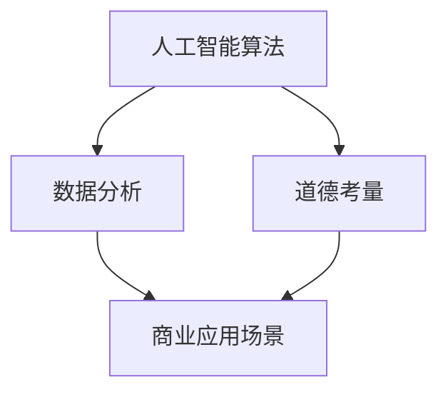

                 

关键词：人工智能、商业应用、道德考量、创新趋势、技术发展

> 摘要：随着人工智能技术在商业领域的广泛应用，如何平衡技术创新与道德考量成为了一个亟待解决的问题。本文将探讨人工智能在商业中的道德考虑因素，分析其应用趋势，并探讨未来可能面临的挑战和机遇。

## 1. 背景介绍

### 1.1 人工智能的发展历程

人工智能（AI）作为计算机科学的一个重要分支，自20世纪50年代以来经历了快速的发展。早期的人工智能研究主要集中在符号主义和逻辑推理上，以专家系统和自然语言处理为代表。随着深度学习等先进算法的出现，人工智能技术迎来了新的发展机遇。如今，人工智能已经渗透到各个行业，成为推动商业创新的重要力量。

### 1.2 人工智能在商业中的应用

人工智能在商业领域具有广泛的应用前景，包括但不限于以下几个方面：

- **自动化**：通过机器学习算法实现自动化决策和自动化流程，提高工作效率。
- **个性化推荐**：利用数据分析技术为用户提供个性化的产品推荐，提升用户体验。
- **风险管理**：通过大数据分析和人工智能算法预测市场风险，制定有效的风险管理策略。
- **客户服务**：利用聊天机器人等人工智能技术提供24小时在线客户服务，提高客户满意度。
- **供应链管理**：利用人工智能技术优化供应链管理，降低成本，提高响应速度。

## 2. 核心概念与联系

为了更好地理解人工智能在商业中的应用，我们需要明确以下几个核心概念：

### 2.1 人工智能算法

人工智能算法是人工智能技术的核心组成部分，包括但不限于深度学习、强化学习、遗传算法等。这些算法通过训练和学习实现对数据的处理和模式识别。

### 2.2 数据分析

数据分析是人工智能在商业应用中的基础，通过对海量数据的挖掘和分析，可以发现潜在的商业机会和优化方向。

### 2.3 道德考量

道德考量是指在人工智能应用过程中，如何确保技术的公正性、透明性和对人类的影响。道德考量对于人工智能技术的可持续发展具有重要意义。

### 2.4 商业应用场景

商业应用场景是指人工智能在各个行业中的具体应用案例，包括但不限于金融、医疗、零售、物流等。

下面是一个用Mermaid绘制的流程图，展示了人工智能算法、数据分析、道德考量以及商业应用场景之间的联系：



## 3. 核心算法原理 & 具体操作步骤

### 3.1 算法原理概述

在人工智能技术中，深度学习是一种重要的算法。深度学习通过构建多层神经网络模型，实现对数据的自动特征提取和分类。具体来说，深度学习算法包括以下几个关键组成部分：

- **输入层**：接收外部数据输入。
- **隐藏层**：对输入数据进行特征提取和变换。
- **输出层**：输出预测结果或分类结果。

### 3.2 算法步骤详解

下面是深度学习算法的基本步骤：

1. **数据预处理**：对原始数据进行清洗、归一化和特征提取。
2. **构建神经网络模型**：根据业务需求设计合适的神经网络结构。
3. **训练神经网络模型**：通过大量训练数据调整模型参数，优化模型性能。
4. **评估模型性能**：使用测试数据集评估模型的准确性和泛化能力。
5. **应用模型**：将训练好的模型应用到实际业务场景中。

### 3.3 算法优缺点

深度学习算法具有以下优点：

- **强大的特征提取能力**：能够自动从数据中提取有用的特征，减少人工干预。
- **适用于大规模数据**：可以处理海量数据，提高数据处理效率。

但深度学习算法也存在一些缺点：

- **对数据依赖性强**：需要大量高质量的训练数据。
- **模型解释性差**：模型内部结构复杂，难以解释和理解。

### 3.4 算法应用领域

深度学习算法在商业应用中具有广泛的应用前景，包括但不限于以下几个方面：

- **图像识别**：应用于安防监控、医疗影像诊断等。
- **自然语言处理**：应用于智能客服、智能推荐等。
- **金融风险管理**：应用于信用评估、风险预测等。

## 4. 数学模型和公式 & 详细讲解 & 举例说明

### 4.1 数学模型构建

在深度学习中，常用的数学模型是多层感知机（MLP）。MLP由输入层、隐藏层和输出层组成。每个层由多个神经元组成，神经元之间的连接通过权重矩阵表示。

假设输入数据为\(x \in \mathbb{R}^n\)，隐藏层神经元个数为\(m\)，输出层神经元个数为\(k\)。则MLP的数学模型可以表示为：

$$
y = \sigma(W_k \sigma(W_{k-1} \sigma(... \sigma(W_2 \sigma(W_1 x) ... ) ...) )
$$

其中，\(W_1, W_2, ..., W_k\)为权重矩阵，\(\sigma\)为激活函数，通常采用Sigmoid函数或ReLU函数。

### 4.2 公式推导过程

以Sigmoid函数为例，其公式为：

$$
\sigma(z) = \frac{1}{1 + e^{-z}}
$$

推导过程如下：

1. 定义误差函数：

$$
E = -\sum_{i=1}^m y_i \log(\hat{y}_i) - (1 - y_i) \log(1 - \hat{y}_i)
$$

其中，\(y_i\)为实际输出，\(\hat{y}_i\)为预测输出。

2. 对误差函数求导，得到：

$$
\frac{\partial E}{\partial z} = \frac{1}{1 + e^{-z}} - y
$$

3. 为了使导数更加直观，将Sigmoid函数改写为：

$$
\sigma(z) = \frac{1}{1 + e^{-z}} = 1 - \frac{1}{1 + e^{-z}}
$$

则导数为：

$$
\frac{\partial \sigma(z)}{\partial z} = -\frac{e^{-z}}{(1 + e^{-z})^2}
$$

### 4.3 案例分析与讲解

假设我们有一个二分类问题，输入数据为\(x \in \mathbb{R}^2\)，隐藏层神经元个数为2，输出层神经元个数为1。我们使用ReLU函数作为激活函数。

1. **数据预处理**：

首先，对输入数据进行归一化处理：

$$
x' = \frac{x - \mu}{\sigma}
$$

其中，\(\mu\)为均值，\(\sigma\)为标准差。

2. **构建神经网络模型**：

根据需求，我们构建一个包含一个隐藏层的神经网络模型，隐藏层神经元个数为2。

3. **训练神经网络模型**：

使用训练数据集对神经网络模型进行训练，通过调整权重矩阵和偏置项，使模型达到最优性能。

4. **评估模型性能**：

使用测试数据集对训练好的模型进行评估，计算模型的准确率、召回率等指标。

5. **应用模型**：

将训练好的模型应用到实际业务场景中，如风险预测、信用评估等。

## 5. 项目实践：代码实例和详细解释说明

### 5.1 开发环境搭建

在本项目中，我们使用Python作为主要编程语言，使用TensorFlow作为深度学习框架。首先，我们需要安装TensorFlow和相关依赖库。

```bash
pip install tensorflow
```

### 5.2 源代码详细实现

下面是一个简单的深度学习项目，实现一个二分类问题：

```python
import tensorflow as tf
import numpy as np

# 数据预处理
def preprocess_data(x):
    mu = np.mean(x, axis=0)
    sigma = np.std(x, axis=0)
    x = (x - mu) / sigma
    return x

# 构建神经网络模型
def build_model(input_shape, hidden_size, output_shape):
    model = tf.keras.Sequential([
        tf.keras.layers.Dense(hidden_size, activation='relu', input_shape=input_shape),
        tf.keras.layers.Dense(output_shape, activation='sigmoid')
    ])
    return model

# 训练神经网络模型
def train_model(model, x_train, y_train, epochs=100, batch_size=32):
    model.compile(optimizer='adam', loss='binary_crossentropy', metrics=['accuracy'])
    model.fit(x_train, y_train, epochs=epochs, batch_size=batch_size)

# 评估模型性能
def evaluate_model(model, x_test, y_test):
    loss, accuracy = model.evaluate(x_test, y_test)
    print("Test accuracy:", accuracy)

# 主函数
def main():
    # 加载数据
    x = np.random.rand(100, 2)
    y = np.random.randint(0, 2, size=(100, 1))

    # 预处理数据
    x = preprocess_data(x)

    # 构建模型
    model = build_model(input_shape=(2,), hidden_size=10, output_shape=(1,))

    # 训练模型
    train_model(model, x, y)

    # 评估模型
    evaluate_model(model, x, y)

if __name__ == '__main__':
    main()
```

### 5.3 代码解读与分析

- **数据预处理**：对输入数据进行归一化处理，使数据符合标准正态分布。
- **构建神经网络模型**：使用TensorFlow的Sequential模型，定义一个包含一个隐藏层的神经网络，隐藏层使用ReLU激活函数，输出层使用Sigmoid激活函数。
- **训练神经网络模型**：使用adam优化器和binary_crossentropy损失函数进行模型训练。
- **评估模型性能**：使用测试数据集评估模型的准确率。

## 6. 实际应用场景

### 6.1 风险管理

在金融行业，人工智能可以帮助银行和金融机构进行风险管理和预测。通过深度学习算法，可以对大量金融数据进行挖掘和分析，识别潜在的信用风险和交易风险。具体应用场景包括信用评分、市场预测、欺诈检测等。

### 6.2 医疗诊断

人工智能技术在医疗领域的应用也越来越广泛。通过深度学习算法，可以对医学影像进行自动诊断，提高诊断准确率和效率。具体应用场景包括癌症筛查、心血管疾病诊断、基因测序分析等。

### 6.3 零售电商

在零售电商领域，人工智能可以帮助企业进行个性化推荐、库存管理和客户服务。通过分析用户的购买行为和偏好，为企业提供精准的营销策略和库存优化方案。

### 6.4 物流配送

在物流配送领域，人工智能可以帮助企业实现智能调度、路径规划和配送优化。通过深度学习算法，可以预测订单量、优化配送路线，提高配送效率。

## 7. 工具和资源推荐

### 7.1 学习资源推荐

- **书籍**：《深度学习》（Goodfellow, Bengio, Courville 著）
- **在线课程**：Coursera、edX、Udacity等平台的深度学习课程
- **博客**：Google Research、DeepMind、AI满满等深度学习领域的博客

### 7.2 开发工具推荐

- **深度学习框架**：TensorFlow、PyTorch、Keras等
- **数据分析工具**：Pandas、NumPy、Scikit-learn等
- **编程语言**：Python、R、Julia等

### 7.3 相关论文推荐

- **《A Theoretically Grounded Application of Dropout in Recurrent Neural Networks》**
- **《Distributed Representation Learning for Natural Language Processing》**
- **《Generative Adversarial Networks》**

## 8. 总结：未来发展趋势与挑战

### 8.1 研究成果总结

人工智能技术在商业领域取得了显著的成果，为各行各业带来了前所未有的变革。深度学习、强化学习等算法在图像识别、自然语言处理、风险预测等方面取得了突破性进展，为商业应用提供了强大的技术支持。

### 8.2 未来发展趋势

随着人工智能技术的不断成熟，未来商业应用将呈现以下几个发展趋势：

- **更加智能化的自动化**：通过人工智能技术实现更加智能化的自动化决策和自动化流程，提高工作效率。
- **个性化体验**：通过深度学习等技术实现更加精准的用户个性化体验，提高用户满意度。
- **跨行业融合**：人工智能技术将与其他行业进行深度融合，推动产业升级和创新发展。

### 8.3 面临的挑战

尽管人工智能技术在商业领域具有巨大的潜力，但也面临着一系列挑战：

- **数据隐私**：如何保护用户数据隐私成为一个重要问题。
- **道德考量**：如何平衡技术创新与道德考量，确保人工智能技术的公正性和透明性。
- **技术瓶颈**：如何克服人工智能技术的技术瓶颈，进一步提高算法性能和效率。

### 8.4 研究展望

未来，人工智能技术在商业领域的研究将重点关注以下几个方面：

- **数据隐私保护**：研究如何保护用户数据隐私，实现数据的安全和可信。
- **跨学科融合**：将人工智能与其他学科相结合，推动跨学科研究和发展。
- **算法优化**：研究如何优化人工智能算法，提高算法性能和效率。

## 9. 附录：常见问题与解答

### 9.1 人工智能算法有哪些？

人工智能算法包括深度学习、强化学习、遗传算法、支持向量机等。

### 9.2 人工智能在商业应用中有什么优点？

人工智能在商业应用中的优点包括提高工作效率、个性化体验、降低成本、提高准确率等。

### 9.3 人工智能在商业应用中有什么挑战？

人工智能在商业应用中面临的挑战包括数据隐私、道德考量、技术瓶颈等。

### 9.4 人工智能未来发展趋势是什么？

人工智能未来发展趋势包括更加智能化的自动化、个性化体验、跨行业融合等。

----------------------------------------------------------------

### 结尾

本文从人工智能在商业领域的背景介绍、核心概念与联系、核心算法原理与应用、数学模型与公式推导、项目实践、实际应用场景、工具和资源推荐、未来发展趋势与挑战等方面进行了全面探讨。人工智能技术作为一种颠覆性的技术，正在深刻地改变着商业生态，为各行各业带来前所未有的变革。然而，在享受人工智能带来的便利和机遇的同时，我们也必须面对一系列道德和技术挑战。未来，人工智能的发展需要更多的专业人士投入研究和实践，共同推动人工智能技术的可持续发展。作者：禅与计算机程序设计艺术 / Zen and the Art of Computer Programming。

