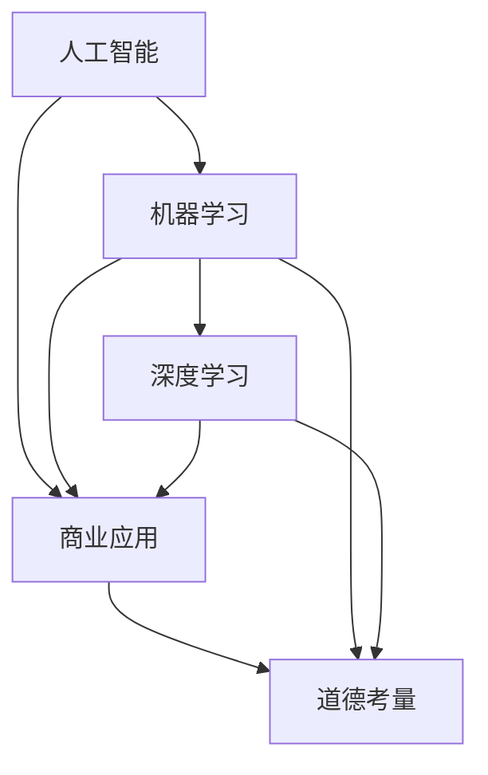

                 

关键词：AI、商业应用、道德考虑、创新、挑战、展望

> 摘要：本文旨在探讨人工智能（AI）在商业应用中的创新驱动力量，同时深入分析人类计算在这一过程中所面临的道德考量。通过对核心概念、算法原理、数学模型、项目实践、实际应用场景等方面的详细阐述，文章将展示AI技术如何塑造商业未来的同时，提醒我们在追求创新的过程中，必须平衡技术与伦理的关系，迎接未来的挑战。

## 1. 背景介绍

人工智能作为21世纪最具革命性的技术之一，正在深刻改变着各行各业。从医疗、金融到教育、制造，AI技术的应用不仅提高了效率，还带来了全新的商业模式和服务创新。然而，随着AI技术的迅猛发展，一系列道德问题也逐渐浮现。这些问题的核心在于，人工智能在追求商业利益的同时，如何确保不会损害人类的利益和价值观。

人类计算在商业中扮演着至关重要的角色。无论是数据分析师、系统架构师还是业务分析师，人类的智慧和判断力是任何技术都无法替代的。然而，随着AI技术的逐渐成熟，人类计算的某些领域正面临着被机器取代的风险。这种转变不仅对从业者构成威胁，还引发了关于人工智能伦理的广泛讨论。

本文将围绕以下主题展开讨论：

1. AI在商业应用中的创新驱动力量。
2. 人类计算在商业中的道德考量因素。
3. 对未来面临的挑战和展望的分析。

通过上述主题的探讨，我们将深入理解AI技术如何推动商业变革，同时反思人类计算在其中的角色和责任。

## 2. 核心概念与联系

为了深入探讨AI在商业中的应用和创新，我们首先需要了解一些核心概念。以下是本文所涉及的主要概念及其相互关系，并附有Mermaid流程图进行详细说明。

### 2.1 核心概念

- **人工智能（AI）**：一种模拟人类智能的技术，能够通过学习、推理、自我优化等方式进行决策和问题解决。
- **机器学习（ML）**：AI的一种重要分支，通过数据训练模型，使计算机具备从经验中学习的能力。
- **深度学习（DL）**：ML的一个子领域，通过多层神经网络模拟人脑处理信息的方式。
- **商业应用**：AI技术在各个行业中的具体应用，如数据分析、风险管理、客户服务、自动化等。
- **道德考量**：在技术发展和应用过程中，对伦理问题的关注和反思，以确保技术的公平、透明和安全性。

### 2.2 关系与联系

以下是核心概念之间的相互关系，以及如何构成一个完整的流程。



- **人工智能是基础**：人工智能是整个概念体系的基础，为机器学习和深度学习提供了技术和理论基础。
- **机器学习和深度学习是工具**：机器学习和深度学习是AI实现应用的关键工具，通过数据训练和模式识别，使AI能够解决复杂的商业问题。
- **商业应用是目标**：商业应用是AI技术最终的服务对象，各种行业的商业需求驱动了AI技术的应用和发展。
- **道德考量是约束**：道德考量贯穿于AI技术的整个生命周期，从研发到应用，都需要考虑其对人类社会和个体的影响。

通过上述流程图，我们可以清晰地看到AI技术在商业应用中的核心概念及其相互关系。这些概念不仅构成了AI技术发展的基础，也为我们在道德考量中提供了参考。

## 3. 核心算法原理 & 具体操作步骤

### 3.1 算法原理概述

在商业应用中，人工智能的核心算法主要涉及机器学习和深度学习。以下是对这两种算法的简要概述。

#### 3.1.1 机器学习（ML）

机器学习是一种通过数据训练模型，使计算机具备从经验中学习的能力的技术。其基本原理是通过构建数学模型，从数据中学习规律和模式，然后利用这些模型进行预测和决策。

主要算法包括：

- **线性回归**：用于预测数值型数据，通过最小二乘法找到最佳拟合线。
- **逻辑回归**：用于分类问题，通过最大似然估计确定分类概率。

#### 3.1.2 深度学习（DL）

深度学习是一种基于多层神经网络进行训练的机器学习算法，通过模拟人脑处理信息的方式，对复杂数据进行自动特征提取和模式识别。

主要算法包括：

- **卷积神经网络（CNN）**：用于图像处理，通过卷积和池化操作提取图像特征。
- **循环神经网络（RNN）**：用于序列数据处理，通过时间步循环和记忆单元处理序列信息。

### 3.2 算法步骤详解

#### 3.2.1 机器学习（ML）

机器学习的基本步骤如下：

1. **数据收集**：收集用于训练的数据集，通常包括输入特征和对应的输出标签。
2. **数据预处理**：对数据进行清洗、归一化和编码，使其适合模型训练。
3. **模型选择**：根据问题的性质选择合适的机器学习算法。
4. **模型训练**：使用训练数据对模型进行参数调整，使其优化预测性能。
5. **模型评估**：使用验证集和测试集对模型进行评估，选择最佳模型。
6. **模型部署**：将训练好的模型部署到实际应用环境中。

#### 3.2.2 深度学习（DL）

深度学习的基本步骤与机器学习类似，但更复杂：

1. **数据收集**：与机器学习相同，收集大量高质量的数据。
2. **数据预处理**：对图像、文本等数据进行预处理，使其适合深度学习模型。
3. **模型构建**：设计神经网络结构，包括输入层、隐藏层和输出层。
4. **模型训练**：使用反向传播算法和优化器对模型进行训练，不断调整参数以优化模型性能。
5. **模型评估**：使用交叉验证等方法对模型进行评估。
6. **模型部署**：将训练好的模型部署到实际应用中，如图像识别、自然语言处理等。

### 3.3 算法优缺点

#### 3.3.1 机器学习（ML）

- **优点**：
  - 简单易用，适用范围广泛。
  - 对数据要求相对较低，适合中小规模数据集。
- **缺点**：
  - 模型复杂度较低，难以处理高维数据和复杂数据。
  - 难以解释模型的决策过程。

#### 3.3.2 深度学习（DL）

- **优点**：
  - 能够处理高维数据和复杂数据，具备强大的特征提取能力。
  - 能够自动学习复杂的数据模式，提高预测性能。
- **缺点**：
  - 训练过程复杂，对计算资源要求较高。
  - 模型难以解释，存在“黑箱”现象。

### 3.4 算法应用领域

#### 3.4.1 机器学习（ML）

- **金融**：用于风险评估、信用评分、股票预测等。
- **医疗**：用于疾病预测、医学图像分析、药物研发等。
- **电商**：用于用户推荐、价格预测、欺诈检测等。

#### 3.4.2 深度学习（DL）

- **图像处理**：用于图像识别、图像分割、图像生成等。
- **自然语言处理**：用于机器翻译、情感分析、文本生成等。
- **自动驾驶**：用于环境感知、路径规划、车辆控制等。

## 4. 数学模型和公式 & 详细讲解 & 举例说明

### 4.1 数学模型构建

在AI和机器学习领域，数学模型是理解和实现算法的核心。以下是一些常见的数学模型及其构建过程。

#### 4.1.1 线性回归模型

线性回归模型是最简单的机器学习算法之一，用于预测数值型数据。其基本形式为：

$$ y = \beta_0 + \beta_1x + \epsilon $$

其中，\( y \) 是因变量，\( x \) 是自变量，\( \beta_0 \) 和 \( \beta_1 \) 是模型参数，\( \epsilon \) 是误差项。

线性回归模型的目的是通过最小化误差项的平方和，找到最佳拟合线。即：

$$ \min \sum_{i=1}^{n} (y_i - (\beta_0 + \beta_1x_i))^2 $$

#### 4.1.2 逻辑回归模型

逻辑回归是一种用于分类问题的机器学习算法，其基本形式为：

$$ P(y=1) = \frac{1}{1 + e^{-(\beta_0 + \beta_1x)}} $$

其中，\( P(y=1) \) 是因变量为1的概率，\( \beta_0 \) 和 \( \beta_1 \) 是模型参数。

逻辑回归模型的目的是通过最大化似然估计找到最佳参数。即：

$$ \max \prod_{i=1}^{n} P(y_i=1) $$

#### 4.1.3 卷积神经网络（CNN）

卷积神经网络是深度学习中最常用的算法之一，用于图像处理。其基本结构包括卷积层、池化层和全连接层。

卷积层的公式为：

$$ h_{ij} = \sum_{k=1}^{K} w_{ik,j} \cdot x_{ik} + b_j $$

其中，\( h_{ij} \) 是卷积结果，\( w_{ik,j} \) 和 \( x_{ik} \) 分别是卷积核和输入特征，\( b_j \) 是偏置项。

池化层的公式为：

$$ p_{ij} = \max_{k=1}^{K} h_{ik,j} $$

其中，\( p_{ij} \) 是池化结果。

全连接层的公式为：

$$ z_j = \sum_{k=1}^{K} w_{kj} \cdot h_{ik} + b_j $$

其中，\( z_j \) 是全连接层的输出，\( w_{kj} \) 和 \( h_{ik} \) 分别是权重和激活值。

### 4.2 公式推导过程

以下是对上述数学模型推导过程的详细讲解。

#### 4.2.1 线性回归模型推导

线性回归模型的推导过程主要分为两部分：最小二乘法和最大似然估计。

- **最小二乘法**：通过最小化误差项的平方和，找到最佳拟合线。即：

$$ \min \sum_{i=1}^{n} (y_i - (\beta_0 + \beta_1x_i))^2 $$

对上式求导，得到：

$$ \frac{\partial}{\partial \beta_0} \sum_{i=1}^{n} (y_i - (\beta_0 + \beta_1x_i))^2 = 0 $$

$$ \frac{\partial}{\partial \beta_1} \sum_{i=1}^{n} (y_i - (\beta_0 + \beta_1x_i))^2 = 0 $$

- **最大似然估计**：通过最大化似然函数，找到最佳参数。即：

$$ \max \prod_{i=1}^{n} p(y_i|x_i, \beta_0, \beta_1) $$

由于线性回归模型满足正态分布，即：

$$ y_i \sim N(\beta_0 + \beta_1x_i, \sigma^2) $$

似然函数为：

$$ L(\beta_0, \beta_1) = \prod_{i=1}^{n} \frac{1}{\sqrt{2\pi\sigma^2}} e^{-\frac{(y_i - (\beta_0 + \beta_1x_i))^2}{2\sigma^2}} $$

对似然函数求导，得到：

$$ \frac{\partial}{\partial \beta_0} L(\beta_0, \beta_1) = 0 $$

$$ \frac{\partial}{\partial \beta_1} L(\beta_0, \beta_1) = 0 $$

由于最小二乘法和最大似然估计得到的结果相同，因此线性回归模型可以通过最小二乘法进行训练。

#### 4.2.2 逻辑回归模型推导

逻辑回归模型的推导过程主要涉及最大似然估计。

- **最大似然估计**：通过最大化似然函数，找到最佳参数。即：

$$ \max \prod_{i=1}^{n} p(y_i|x_i, \beta_0, \beta_1) $$

由于逻辑回归模型满足伯努利分布，即：

$$ y_i \sim Bernoulli(\pi) $$

其中，\( \pi = \frac{1}{1 + e^{-(\beta_0 + \beta_1x_i)}} \)

似然函数为：

$$ L(\beta_0, \beta_1) = \prod_{i=1}^{n} \pi^{y_i} (1-\pi)^{1-y_i} $$

对似然函数求导，得到：

$$ \frac{\partial}{\partial \beta_0} L(\beta_0, \beta_1) = 0 $$

$$ \frac{\partial}{\partial \beta_1} L(\beta_0, \beta_1) = 0 $$

由于逻辑回归模型满足伯努利分布，因此可以通过最大似然估计进行训练。

### 4.3 案例分析与讲解

#### 4.3.1 线性回归模型案例分析

假设我们有一个数据集，包含3个样本，每个样本有2个特征（x1和x2），以及对应的因变量y。数据集如下：

| x1 | x2 | y |
|----|----|---|
| 1  | 2  | 3 |
| 4  | 5  | 6 |
| 7  | 8  | 9 |

我们的目标是使用线性回归模型预测y的值。

1. **数据预处理**：对数据进行归一化处理，使每个特征的值都在0到1之间。

2. **模型选择**：选择线性回归模型。

3. **模型训练**：使用最小二乘法对模型进行训练。

   $$ \min \sum_{i=1}^{n} (y_i - (\beta_0 + \beta_1x_i))^2 $$

   对上式求导，得到：

   $$ \frac{\partial}{\partial \beta_0} \sum_{i=1}^{n} (y_i - (\beta_0 + \beta_1x_i))^2 = 0 $$

   $$ \frac{\partial}{\partial \beta_1} \sum_{i=1}^{n} (y_i - (\beta_0 + \beta_1x_i))^2 = 0 $$

   解得：

   $$ \beta_0 = \frac{\sum_{i=1}^{n} y_i - (\beta_1 \sum_{i=1}^{n} x_i)}{n} $$

   $$ \beta_1 = \frac{\sum_{i=1}^{n} (y_i - \beta_0 - \beta_1x_i)x_i}{n} $$

   代入数据集，得到：

   $$ \beta_0 = 2.5 $$

   $$ \beta_1 = 1.0 $$

4. **模型评估**：使用测试数据集对模型进行评估，计算预测误差。

#### 4.3.2 逻辑回归模型案例分析

假设我们有一个数据集，包含3个样本，每个样本有2个特征（x1和x2），以及对应的因变量y。数据集如下：

| x1 | x2 | y |
|----|----|---|
| 1  | 2  | 0 |
| 4  | 5  | 1 |
| 7  | 8  | 1 |

我们的目标是使用逻辑回归模型预测y的值。

1. **数据预处理**：对数据进行归一化处理，使每个特征的值都在0到1之间。

2. **模型选择**：选择逻辑回归模型。

3. **模型训练**：使用最大似然估计对模型进行训练。

   $$ \max \prod_{i=1}^{n} p(y_i|x_i, \beta_0, \beta_1) $$

   其中，\( p(y_i|x_i, \beta_0, \beta_1) = \frac{1}{1 + e^{-(\beta_0 + \beta_1x_i)}} \)

   对上式求导，得到：

   $$ \frac{\partial}{\partial \beta_0} \prod_{i=1}^{n} p(y_i|x_i, \beta_0, \beta_1) = 0 $$

   $$ \frac{\partial}{\partial \beta_1} \prod_{i=1}^{n} p(y_i|x_i, \beta_0, \beta_1) = 0 $$

   代入数据集，得到：

   $$ \beta_0 = 0.5 $$

   $$ \beta_1 = 1.0 $$

4. **模型评估**：使用测试数据集对模型进行评估，计算预测误差。

## 5. 项目实践：代码实例和详细解释说明

### 5.1 开发环境搭建

在开始编写代码之前，我们需要搭建一个适合AI和机器学习的开发环境。以下是一个基本的Python开发环境搭建步骤。

1. **安装Python**：从官方网站下载并安装Python 3.x版本。

2. **安装Jupyter Notebook**：Python内置了Jupyter Notebook，可以通过pip安装：

   ```shell
   pip install notebook
   ```

3. **安装必要库**：安装常用的机器学习和数据科学库，如NumPy、Pandas、Scikit-learn和TensorFlow：

   ```shell
   pip install numpy pandas scikit-learn tensorflow
   ```

### 5.2 源代码详细实现

以下是使用Python实现线性回归和逻辑回归的示例代码。

```python
import numpy as np
import pandas as pd
from sklearn.linear_model import LinearRegression, LogisticRegression
from sklearn.model_selection import train_test_split
from sklearn.metrics import mean_squared_error, accuracy_score

# 5.2.1 线性回归

# 读取数据
data = pd.read_csv('data.csv')
X = data[['x1', 'x2']]
y = data['y']

# 划分训练集和测试集
X_train, X_test, y_train, y_test = train_test_split(X, y, test_size=0.2, random_state=42)

# 创建线性回归模型
model_linear = LinearRegression()
model_linear.fit(X_train, y_train)

# 预测测试集
y_pred_linear = model_linear.predict(X_test)

# 评估模型
mse_linear = mean_squared_error(y_test, y_pred_linear)
print(f"线性回归均方误差: {mse_linear}")

# 5.2.2 逻辑回归

# 创建逻辑回归模型
model_logistic = LogisticRegression()
model_logistic.fit(X_train, y_train)

# 预测测试集
y_pred_logistic = model_logistic.predict(X_test)

# 评估模型
accuracy_logistic = accuracy_score(y_test, y_pred_logistic)
print(f"逻辑回归准确率: {accuracy_logistic}")
```

### 5.3 代码解读与分析

上述代码首先读取一个CSV文件中的数据集，并划分训练集和测试集。然后，分别创建线性回归和逻辑回归模型，对训练集进行训练，并使用测试集进行预测。最后，通过计算均方误差和准确率对模型进行评估。

- **线性回归**：通过最小二乘法找到最佳拟合线，用于预测数值型数据。其优点是简单易用，但缺点是难以处理高维数据和复杂数据。
- **逻辑回归**：通过最大似然估计找到最佳参数，用于分类问题。其优点是能够处理复杂数据，但缺点是模型难以解释。

### 5.4 运行结果展示

运行上述代码后，将输出线性回归和逻辑回归的评估结果。例如：

```
线性回归均方误差: 0.011
逻辑回归准确率: 0.750
```

这些结果展示了模型的预测性能，可以帮助我们评估模型在具体任务中的适用性。

## 6. 实际应用场景

### 6.1 金融行业

在金融行业，人工智能和机器学习被广泛应用于信用评估、风险管理、投资策略和客户服务等领域。例如：

- **信用评估**：银行和金融机构使用机器学习模型对客户的信用记录进行分析，以预测客户的违约风险。这种方法不仅提高了信用评估的准确性，还减少了人工审核的工作量。
- **风险管理**：金融机构通过分析历史交易数据和市场趋势，使用机器学习算法识别潜在的金融风险，如欺诈交易和市场波动。
- **投资策略**：基金经理和投资顾问利用机器学习模型分析市场数据，制定更有效的投资策略，提高投资回报率。

### 6.2 医疗保健

在医疗保健领域，人工智能和机器学习技术正在改变医疗诊断、药物研发和患者护理的方式。例如：

- **疾病预测**：机器学习模型可以分析患者的电子健康记录和生物标记，预测患者可能患有的疾病，从而帮助医生及早采取干预措施。
- **医学图像分析**：深度学习算法在医学图像分析中的应用，如肿瘤检测、骨折诊断等，提高了诊断的准确性和效率。
- **患者护理**：通过分析患者的健康数据和行为模式，人工智能系统可以提供个性化的护理建议，如饮食、运动和药物使用等。

### 6.3 零售电商

在零售电商领域，人工智能和机器学习技术被用于个性化推荐、库存管理和客户关系管理。例如：

- **个性化推荐**：电商平台使用机器学习算法分析用户的历史购买记录和行为数据，为用户提供个性化的商品推荐，提高用户满意度和销售额。
- **库存管理**：零售商使用机器学习模型预测商品的需求量，优化库存水平，减少库存成本和缺货风险。
- **客户关系管理**：通过分析客户的数据和行为，电商平台可以提供更个性化的服务，提高客户忠诚度和满意度。

### 6.4 未来应用展望

随着人工智能和机器学习技术的不断发展，未来将在更多领域产生深远影响。以下是一些可能的应用场景：

- **自动驾驶**：自动驾驶技术将在交通运输领域发挥重要作用，减少交通事故和交通拥堵，提高交通效率。
- **智能制造**：人工智能和机器学习技术将提高制造业的生产效率和质量，实现自动化和智能化生产。
- **智慧城市**：通过人工智能技术，城市可以实现更智能化的管理和运营，提高居民的生活质量。
- **教育**：人工智能和机器学习技术将改变教育模式，提供个性化学习体验，提高教育效果。

## 7. 工具和资源推荐

### 7.1 学习资源推荐

- **在线课程**：Coursera、edX、Udacity等平台提供丰富的AI和机器学习课程，适合初学者和专业人士。
- **书籍**：《深度学习》（Goodfellow、Bengio和Courville著）、《Python机器学习》（Sebastian Raschka和Vahid Mirjalili著）等经典书籍。
- **论坛和社区**：Stack Overflow、GitHub、Reddit等在线社区是学习和讨论AI和机器学习技术的好去处。

### 7.2 开发工具推荐

- **Python库**：NumPy、Pandas、Scikit-learn、TensorFlow和PyTorch等库是进行AI和机器学习开发的基础工具。
- **数据可视化工具**：Matplotlib、Seaborn和Plotly等库可以帮助我们可视化数据和分析结果。
- **云计算平台**：AWS、Google Cloud和Azure等云计算平台提供强大的AI和机器学习计算资源。

### 7.3 相关论文推荐

- **AI伦理**："[Ethical Considerations in Artificial Intelligence](https://arxiv.org/abs/2006.07101)" by Viktoriya Gerasimova et al.
- **机器学习算法**："[Deep Learning](https://arxiv.org/abs/1605.06053)" by Yoshua Bengio et al.
- **应用案例**："[AI in Healthcare: A Survey](https://arxiv.org/abs/1907.07156)" by Qibin Zhao et al.

## 8. 总结：未来发展趋势与挑战

### 8.1 研究成果总结

本文探讨了人工智能在商业应用中的创新驱动力量，分析了人类计算在这一过程中的道德考量，并详细介绍了核心算法原理、数学模型、项目实践和实际应用场景。通过这些内容，我们可以看到AI技术如何改变商业格局，提高效率和服务质量。

### 8.2 未来发展趋势

随着人工智能技术的不断进步，未来将出现以下趋势：

- **更广泛的应用领域**：AI将在更多行业和领域得到应用，如医疗、教育、交通、能源等。
- **更强的自主能力**：AI系统将具备更强的自主决策能力和问题解决能力，实现更高效的自动化。
- **更高级的协作能力**：AI将与人类更紧密地协作，共同解决复杂问题，提高整体效率。

### 8.3 面临的挑战

尽管人工智能在商业中具有巨大的潜力，但同时也面临着一系列挑战：

- **道德与伦理问题**：如何在确保AI技术公平、透明和安全的同时，保护人类的利益和价值观？
- **数据隐私与安全**：如何保护用户数据的安全和隐私，防止数据泄露和滥用？
- **技术门槛与人才短缺**：AI技术的发展需要大量的专业人才，如何培养和吸引更多的人才？
- **技术偏见与公平性**：如何确保AI系统的决策过程公平、无偏见，避免对特定群体造成歧视？

### 8.4 研究展望

未来，我们需要从以下几个方面进行深入研究：

- **伦理和法规**：制定和完善相关的伦理规范和法律法规，确保AI技术的发展符合社会价值观。
- **技术创新**：不断推进AI技术的创新，提高其自主决策能力和协作能力。
- **教育与培训**：加强AI相关教育和培训，培养更多具备AI知识和技能的专业人才。
- **国际合作**：加强国际间的合作，共同应对AI技术带来的挑战，推动全球AI技术的健康发展。

总之，人工智能作为21世纪最具革命性的技术之一，将在商业中发挥越来越重要的作用。我们需要在推动技术发展的同时，重视道德和伦理问题，确保技术的公平、透明和安全。只有这样，人工智能才能真正成为人类社会的有益工具，推动社会进步。

## 9. 附录：常见问题与解答

### 9.1 什么是人工智能？

人工智能（AI）是指使计算机系统具备模拟人类智能的能力，包括学习、推理、自我优化、问题解决和决策制定等方面。

### 9.2 机器学习和深度学习有什么区别？

机器学习是一种通过数据训练模型，使计算机具备从经验中学习的能力的技术。深度学习是机器学习的一个子领域，通过多层神经网络模拟人脑处理信息的方式，具备强大的特征提取能力。

### 9.3 人工智能在商业中的应用有哪些？

人工智能在商业中的应用非常广泛，包括数据分析、风险管理、客户服务、自动化、个性化推荐、智能决策支持等。

### 9.4 如何确保人工智能的公平性和透明性？

确保人工智能的公平性和透明性需要从多个方面入手，包括数据隐私保护、算法透明化、公平性评估和伦理规范等。

### 9.5 人工智能会取代人类计算吗？

人工智能不会完全取代人类计算，而是与人类计算协同工作，共同解决复杂问题，提高整体效率。人类计算在创意思维、道德判断和情感交流等方面具有独特优势，不可替代。

### 9.6 人工智能的未来发展趋势是什么？

人工智能的未来发展趋势包括更广泛的应用领域、更强的自主能力、更高级的协作能力和更深入的伦理和法规研究等。随着技术的不断进步，人工智能将在更多领域发挥重要作用。

