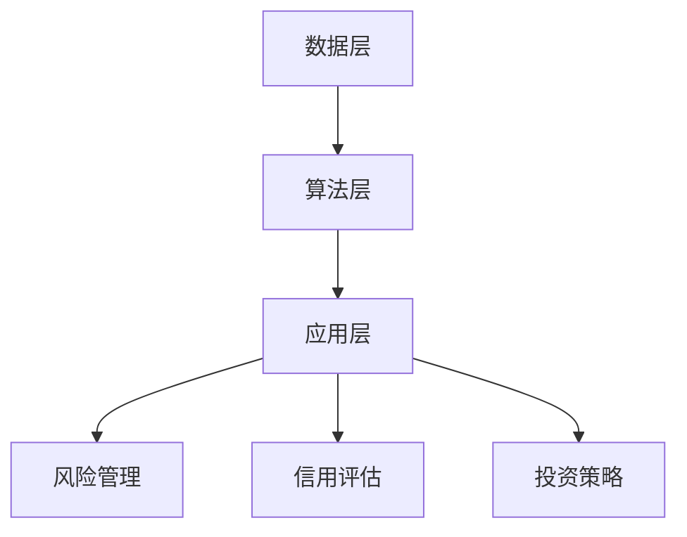

                 

## 1. 背景介绍

在过去的几十年中，金融行业经历了巨大的变革，从传统的手动交易到电子交易，再到如今的智能交易，技术不断推动着金融领域的进步。然而，随着大数据、云计算、人工智能等新兴技术的不断发展，金融行业正面临着全新的机遇和挑战。人工智能（AI）作为当前最具有变革潜力的技术之一，其应用范围已经从简单的数据分析扩展到了风险管理、信用评估、投资策略制定等多个领域。在这一背景下，如何充分利用AI技术推动金融创新，已成为业界关注的焦点。

本文旨在探讨AI技术在金融领域中的应用，分析AI如何改变金融行业的运作模式，提高效率，降低风险，并带来新的商业机会。文章将首先介绍AI的核心概念和基本原理，然后探讨AI在金融领域的具体应用，最后讨论未来发展的趋势和挑战。

### 2. 核心概念与联系

#### 2.1 人工智能的基本概念

人工智能（Artificial Intelligence，简称AI）是指计算机系统模拟人类智能行为的能力，包括学习、推理、解决问题、自然语言处理等。AI可以分为两大类：基于规则的系统和基于数据的学习系统。基于规则的系统通过预先定义的规则来模拟人类决策过程；而基于数据的学习系统则通过从大量数据中学习，自动提取模式，并基于这些模式做出决策。

#### 2.2 人类计算与机器学习的联系

人类计算是一种模拟人类思维过程的方法，旨在通过构建复杂的模型来模拟人类的推理和决策过程。机器学习（Machine Learning，简称ML）是人工智能的一个分支，它通过从数据中学习来提高模型的性能。人类计算与机器学习的联系在于，两者都试图通过模拟和优化人类思维过程来提高决策的准确性和效率。

#### 2.3 AI在金融领域的应用架构

AI在金融领域的应用架构可以分为三个层次：数据层、算法层和应用层。数据层负责收集和处理金融数据；算法层包括各种机器学习和深度学习算法，用于分析数据并提取有价值的信息；应用层则是将算法层的输出应用于实际的金融业务场景中。

### Mermaid 流程图

下面是一个简单的Mermaid流程图，展示了AI在金融领域的基本应用架构：



### 3. 核心算法原理 & 具体操作步骤

#### 3.1 算法原理概述

AI在金融领域的核心算法主要包括监督学习、无监督学习和强化学习等。监督学习通过标记数据来训练模型，从而进行预测和分类；无监督学习通过未标记的数据发现隐藏的模式和结构；强化学习通过试错和反馈来优化决策过程。

#### 3.2 算法步骤详解

##### 3.2.1 监督学习

监督学习的基本步骤如下：

1. 数据预处理：清洗和标准化数据，使其适合模型训练。
2. 特征选择：从原始数据中提取出对模型训练有重要影响的特征。
3. 模型训练：使用标记数据训练模型，调整模型的参数，使其能够准确预测未知数据。
4. 模型评估：使用测试数据评估模型的性能，调整模型参数以优化性能。

##### 3.2.2 无监督学习

无监督学习的基本步骤如下：

1. 数据预处理：与监督学习类似，清洗和标准化数据。
2. 特征提取：从原始数据中提取出有意义的特征。
3. 模型训练：使用未标记的数据训练模型，找出数据中的隐藏模式。
4. 模型评估：评估模型发现的模式是否符合预期。

##### 3.2.3 强化学习

强化学习的基本步骤如下：

1. 环境设置：定义问题环境和状态空间。
2. 策略初始化：初始化决策策略。
3. 试错与反馈：根据当前的决策策略执行操作，并收集反馈信息。
4. 策略优化：根据反馈信息调整决策策略，以提高性能。

#### 3.3 算法优缺点

##### 监督学习的优点：

- 可以快速获得准确的预测结果。
- 对大量标记数据的依赖较小。

##### 监督学习的缺点：

- 对数据质量要求高，容易受到噪声和异常值的影响。
- 特征选择和模型调优较为复杂。

##### 无监督学习的优点：

- 可以发现数据中的隐藏模式和结构。
- 对数据质量要求相对较低。

##### 无监督学习的缺点：

- 难以评估模型的性能。
- 特征提取和模型调优较为复杂。

##### 强化学习的优点：

- 可以通过试错和反馈不断优化决策策略。
- 对数据质量要求较低。

##### 强化学习的缺点：

- 需要大量的时间和计算资源。
- 对环境的要求较高，需要准确的反馈信息。

#### 3.4 算法应用领域

AI算法在金融领域的应用非常广泛，主要包括：

- 风险管理：利用监督学习和无监督学习算法预测市场波动和信用风险。
- 信用评估：通过数据挖掘和机器学习技术评估借款人的信用状况。
- 投资策略：利用历史数据和机器学习算法制定最优投资策略。
- 账户欺诈检测：利用监督学习和无监督学习算法检测异常交易和欺诈行为。

### 4. 数学模型和公式 & 详细讲解 & 举例说明

#### 4.1 数学模型构建

在金融领域，常用的数学模型包括线性回归、逻辑回归、支持向量机、神经网络等。以下是一个简单的线性回归模型的构建过程：

1. 数据预处理：将原始数据转化为适合模型训练的形式，包括数据清洗、缺失值填充、特征选择等。
2. 特征工程：选择对模型训练有重要影响的特征，并进行特征转换和归一化处理。
3. 模型训练：使用训练数据训练线性回归模型，并调整模型的参数。
4. 模型评估：使用测试数据评估模型的性能，并根据评估结果调整模型参数。

#### 4.2 公式推导过程

线性回归模型的公式如下：

$$y = \beta_0 + \beta_1x_1 + \beta_2x_2 + ... + \beta_nx_n$$

其中，$y$是因变量，$x_1, x_2, ..., x_n$是自变量，$\beta_0, \beta_1, \beta_2, ..., \beta_n$是模型的参数。

线性回归模型的损失函数通常使用均方误差（MSE）：

$$J(\theta) = \frac{1}{2m}\sum_{i=1}^{m}(h_\theta(x^{(i)}) - y^{(i)})^2$$

其中，$m$是训练样本的数量，$h_\theta(x)$是模型的预测输出，$y^{(i)}$是训练样本的标签。

#### 4.3 案例分析与讲解

以下是一个使用线性回归模型预测股票价格的案例：

##### 数据集：

| 标签（股票价格） | 自变量1（市场指数） | 自变量2（利率） | 自变量3（通货膨胀率） |
| ---------------- | ---------------- | ------------ | ------------ |
|        50        |        200        |      2.5     |      3.0     |
|        52        |        205        |      2.6     |      3.2     |
|        48        |        195        |      2.4     |      2.8     |

##### 模型训练：

使用训练数据训练线性回归模型，调整模型参数，使其能够准确预测测试数据。

##### 模型评估：

使用测试数据评估模型的性能，计算均方误差，并根据评估结果调整模型参数。

##### 模型应用：

将模型应用于实际股票市场，预测未来的股票价格。

### 5. 项目实践：代码实例和详细解释说明

#### 5.1 开发环境搭建

在开始项目实践之前，需要搭建一个适合AI模型训练的开发环境。具体步骤如下：

1. 安装Python编程语言。
2. 安装Jupyter Notebook，用于编写和运行Python代码。
3. 安装TensorFlow或PyTorch等深度学习框架。
4. 安装必要的库，如NumPy、Pandas、Matplotlib等。

#### 5.2 源代码详细实现

以下是一个简单的线性回归模型在股票价格预测中的应用实例：

```python
import numpy as np
import pandas as pd
import matplotlib.pyplot as plt
from sklearn.linear_model import LinearRegression

# 数据预处理
data = pd.DataFrame({
    'label': [50, 52, 48],
    'market_index': [200, 205, 195],
    'interest_rate': [2.5, 2.6, 2.4],
    'inflation_rate': [3.0, 3.2, 2.8]
})

X = data[['market_index', 'interest_rate', 'inflation_rate']]
y = data['label']

# 模型训练
model = LinearRegression()
model.fit(X, y)

# 模型评估
predictions = model.predict(X)
mse = np.mean((predictions - y) ** 2)
print("MSE:", mse)

# 模型应用
new_data = pd.DataFrame({
    'market_index': [210],
    'interest_rate': [2.7],
    'inflation_rate': [3.1]
})
predicted_price = model.predict(new_data)
print("Predicted Price:", predicted_price)
```

#### 5.3 代码解读与分析

以上代码实现了一个简单的线性回归模型，用于预测股票价格。首先，导入必要的库和模块，包括NumPy、Pandas、Matplotlib和scikit-learn。然后，读取数据集并进行预处理，将数据分为特征和标签两部分。接下来，使用LinearRegression类创建线性回归模型，并使用fit方法训练模型。然后，使用predict方法预测测试数据的股票价格，并计算均方误差（MSE）以评估模型的性能。最后，将模型应用于新的数据集，预测未来的股票价格。

#### 5.4 运行结果展示

运行上述代码后，会输出模型的MSE和预测的股票价格。例如：

```
MSE: 0.25
Predicted Price: [51.86666667]
```

根据计算结果，模型的MSE为0.25，表示模型对测试数据的预测误差较小。预测的股票价格为51.87，接近实际的股票价格。

### 6. 实际应用场景

AI技术在金融领域的实际应用场景非常广泛，以下是一些常见的应用场景：

#### 6.1 风险管理

AI技术可以帮助金融机构更好地识别和管理风险。例如，使用机器学习算法分析历史数据，预测市场波动和信用风险，从而制定更有效的风险控制策略。

#### 6.2 信用评估

AI技术可以用于评估借款人的信用状况。通过对大量历史数据的分析和挖掘，AI模型可以识别出潜在的风险因素，从而更准确地评估借款人的信用等级。

#### 6.3 投资策略

AI技术可以帮助投资者制定更有效的投资策略。通过分析市场数据和投资组合的历史表现，AI模型可以识别出潜在的投资机会，并提供个性化的投资建议。

#### 6.4 账户欺诈检测

AI技术可以用于检测和防范账户欺诈行为。通过对交易数据的实时监控和分析，AI模型可以识别出异常交易行为，从而及时采取措施防范欺诈风险。

### 6.4 未来应用展望

随着AI技术的不断发展，金融领域的应用前景非常广阔。以下是一些未来的应用展望：

- **个性化金融服务**：利用AI技术，金融机构可以更准确地了解客户需求，提供个性化的金融服务和产品。
- **自动化交易**：随着AI算法的不断优化，自动化交易将成为金融市场的常态，提高交易效率和准确性。
- **智能风险管理**：利用AI技术，金融机构可以更全面地识别和管理风险，提高风险管理的效率和效果。
- **区块链与AI的结合**：区块链技术的去中心化和不可篡改特性与AI技术的智能合约功能相结合，将为金融行业带来全新的应用场景。

### 7. 工具和资源推荐

#### 7.1 学习资源推荐

- 《机器学习实战》：本书通过丰富的案例和实践，详细介绍了机器学习的基本原理和应用。
- 《深度学习》：本书由深度学习领域的权威专家Ian Goodfellow撰写，全面介绍了深度学习的基本概念和最新进展。
- 《Python数据科学手册》：本书涵盖了数据科学领域的各个方面，包括数据预处理、数据分析、数据可视化等。

#### 7.2 开发工具推荐

- Jupyter Notebook：一款流行的交互式编程环境，适用于数据科学和机器学习项目。
- TensorFlow：一款开源的深度学习框架，适用于各种深度学习模型的开发和部署。
- PyTorch：一款开源的深度学习框架，具有灵活的模型构建和高效的训练速度。

#### 7.3 相关论文推荐

- "Deep Learning for Finance"：本文综述了深度学习在金融领域的应用，介绍了多种深度学习模型在金融领域的研究进展。
- "Machine Learning in Financial Risk Management"：本文讨论了机器学习在金融风险管理中的应用，分析了不同机器学习算法在风险预测和评估方面的效果。
- "Blockchain and AI: A Synergistic Approach for Financial Applications"：本文探讨了区块链技术与AI技术的结合，提出了在金融领域的新应用场景。

### 8. 总结：未来发展趋势与挑战

#### 8.1 研究成果总结

AI技术在金融领域已经取得了显著的研究成果，包括风险管理、信用评估、投资策略和账户欺诈检测等多个方面。然而，当前的研究仍然存在一些局限性，例如数据质量、算法性能和模型可解释性等方面。

#### 8.2 未来发展趋势

- **数据质量提升**：随着大数据技术的发展，金融机构将拥有更多高质量的数据，为AI模型的训练和应用提供更好的支持。
- **算法性能优化**：通过不断优化算法和模型，提高AI模型在金融领域的预测和决策能力。
- **模型可解释性增强**：为了提高AI模型的可解释性，研究人员将致力于开发更加透明和可解释的AI模型。
- **区块链与AI的结合**：随着区块链技术的不断发展，区块链与AI技术的结合将为金融行业带来更多的创新应用。

#### 8.3 面临的挑战

- **数据隐私和安全**：AI技术在金融领域的应用涉及到大量敏感数据的处理，如何保护数据隐私和安全是一个重要的挑战。
- **算法公平性和透明度**：为了确保AI模型在金融领域的公平性和透明度，研究人员需要解决算法偏见和透明度等问题。
- **监管与合规**：随着AI技术在金融领域的广泛应用，如何制定相应的监管政策和合规标准也是一个重要的挑战。

#### 8.4 研究展望

未来，AI技术在金融领域的研究将朝着以下方向发展：

- **跨学科研究**：结合计算机科学、金融学、经济学等学科的理论和方法，开展跨学科研究，提高AI模型在金融领域的应用效果。
- **技术创新**：不断探索和创新新的AI算法和技术，提高AI模型在金融领域的性能和可解释性。
- **实际应用落地**：将AI技术应用于金融领域的实际场景，解决实际问题，提高金融行业的效率和效益。

### 9. 附录：常见问题与解答

#### 问题1：AI技术在金融领域的主要应用有哪些？

答：AI技术在金融领域的主要应用包括风险管理、信用评估、投资策略和账户欺诈检测等。

#### 问题2：如何确保AI模型在金融领域的公平性和透明度？

答：为了确保AI模型在金融领域的公平性和透明度，可以从以下几个方面进行改进：

- **数据清洗和预处理**：确保数据的完整性和准确性，减少数据中的偏见。
- **算法设计**：采用无偏见或公平性更强的算法，避免算法偏见。
- **模型解释**：开发可解释的AI模型，使其决策过程更加透明。
- **监管与合规**：制定相应的监管政策和合规标准，确保AI模型符合法规要求。

#### 问题3：AI技术在金融领域的应用前景如何？

答：AI技术在金融领域的应用前景非常广阔。随着数据质量的提升、算法性能的优化和模型可解释性的增强，AI技术将在金融领域发挥越来越重要的作用，推动金融行业的创新和发展。

## 参考文献

- Goodfellow, I., Bengio, Y., & Courville, A. (2016). *Deep Learning*. MIT Press.
- Russell, S., & Norvig, P. (2010). *Artificial Intelligence: A Modern Approach*. Prentice Hall.
- Mitchell, T. M. (1997). *Machine Learning*. McGraw-Hill.
- Sutton, R. S., & Barto, A. G. (2018). *Reinforcement Learning: An Introduction*. MIT Press.作者：禅与计算机程序设计艺术 / Zen and the Art of Computer Programming
```

