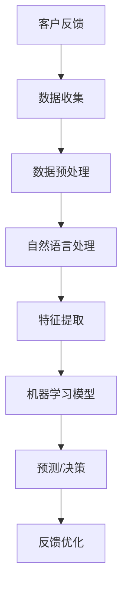

                 

关键词：人工智能、客户反馈分析、机器学习、自然语言处理、数据分析、反馈优化、用户体验。

> 摘要：本文将探讨如何利用人工智能技术，特别是机器学习和自然语言处理技术，构建一个高效的客户反馈分析系统，从而帮助企业更好地理解客户需求，优化产品和服务，提升用户体验。

## 1. 背景介绍

在当今竞争激烈的市场环境中，客户反馈成为企业了解市场需求、改进产品和服务的重要途径。传统的客户反馈分析方法往往依赖于人工处理，效率低下且容易出错。随着人工智能技术的快速发展，利用机器学习和自然语言处理技术构建AI驱动的客户反馈分析系统成为可能，这种系统能够自动处理大量的客户反馈数据，提供快速、准确的分析结果，帮助企业做出更加明智的决策。

## 2. 核心概念与联系

### 2.1 人工智能

人工智能（Artificial Intelligence，简称AI）是指由人制造出来的系统能够模拟、延伸和扩展人类的智能。它包括机器学习、深度学习、自然语言处理等多个领域。

### 2.2 机器学习

机器学习（Machine Learning，简称ML）是一种让计算机通过数据学习并做出决策的技术。它通常用于预测、分类、聚类等任务。

### 2.3 自然语言处理

自然语言处理（Natural Language Processing，简称NLP）是人工智能的一个分支，它关注于让计算机理解和生成人类语言。

### 2.4 数据分析

数据分析（Data Analysis）是指对数据进行收集、清洗、整理、分析和解释的过程。

### 2.5 客户反馈分析

客户反馈分析是指对客户提供的反馈信息进行收集、处理、分析和利用的过程，以帮助企业了解客户需求，改进产品和服务。

### 2.6 Mermaid 流程图



## 3. 核心算法原理 & 具体操作步骤

### 3.1 算法原理概述

AI驱动的客户反馈分析系统主要包括以下几个步骤：

1. 数据收集：收集客户的反馈数据，包括文本、语音、视频等多种形式。
2. 数据预处理：对收集到的数据进行分析和清洗，提取有用的信息。
3. 自然语言处理：对预处理后的文本数据进行情感分析、主题建模等操作。
4. 特征提取：从自然语言处理的结果中提取出对反馈分析有用的特征。
5. 机器学习模型：利用提取的特征构建机器学习模型，进行预测和决策。
6. 反馈优化：根据模型的预测结果，优化产品和服务。

### 3.2 算法步骤详解

#### 3.2.1 数据收集

数据收集是客户反馈分析的第一步。企业可以通过在线调查、社交媒体、客服系统等多种渠道收集客户的反馈数据。

#### 3.2.2 数据预处理

数据预处理包括数据清洗、去噪、归一化等步骤，目的是提高数据的质量和一致性。

#### 3.2.3 自然语言处理

自然语言处理包括文本分词、词性标注、句法分析等步骤，目的是将文本数据转化为计算机可以理解的形式。

#### 3.2.4 特征提取

特征提取是从自然语言处理的结果中提取出对反馈分析有用的特征，如词频、词向量等。

#### 3.2.5 机器学习模型

机器学习模型的选择和训练是客户反馈分析的核心。常用的模型包括支持向量机（SVM）、决策树、随机森林、神经网络等。

#### 3.2.6 预测/决策

利用训练好的机器学习模型，对新的客户反馈数据进行预测和决策，以帮助企业优化产品和服务。

#### 3.2.7 反馈优化

根据模型的预测结果，对产品和服务进行优化，以提高客户满意度。

### 3.3 算法优缺点

#### 优点：

1. 自动化处理：AI驱动的客户反馈分析系统能够自动处理大量的客户反馈数据，提高工作效率。
2. 准确性高：通过机器学习和自然语言处理技术，系统能够对客户反馈进行准确的分类和分析。
3. 快速响应：系统能够快速地对新的客户反馈数据进行处理和响应，帮助企业及时发现问题并进行优化。

#### 缺点：

1. 数据质量依赖：系统的性能很大程度上取决于数据的质量和多样性。
2. 模型适应性：模型需要不断地进行更新和优化，以适应不断变化的市场环境和客户需求。

### 3.4 算法应用领域

AI驱动的客户反馈分析系统可以广泛应用于各个行业，如电商、金融、医疗、教育等，帮助企业更好地理解客户需求，优化产品和服务。

## 4. 数学模型和公式 & 详细讲解 & 举例说明

### 4.1 数学模型构建

在客户反馈分析中，常用的数学模型包括支持向量机（SVM）、决策树、随机森林等。以支持向量机为例，其数学模型可以表示为：

$$
\min_{\mathbf{w},b}\frac{1}{2}||\mathbf{w}||^2 + C\sum_{i=1}^{n} \max(0, 1-y_i(\mathbf{w}\cdot\mathbf{x}_i + b))
$$

其中，$\mathbf{w}$ 和 $b$ 分别是模型的权重和偏置，$C$ 是正则化参数，$y_i$ 和 $\mathbf{x}_i$ 分别是第 $i$ 个样本的标签和特征向量。

### 4.2 公式推导过程

支持向量机的推导过程涉及优化理论、线性代数等多个数学领域。具体推导过程如下：

1. 构建目标函数：首先，我们构建一个目标函数，用于衡量模型的损失和正则化项。
2. 求导：对目标函数进行求导，得到一个关于权重和偏置的方程。
3. 优化：通过优化算法，求解权重和偏置的最优值。

### 4.3 案例分析与讲解

以一家电商企业为例，该企业希望通过客户反馈分析来优化其产品和服务。以下是具体的案例分析：

#### 数据收集

该企业通过在线调查、社交媒体、客服系统等渠道收集了5000条客户反馈数据，数据包括文本、图片、视频等多种形式。

#### 数据预处理

对收集到的数据进行分析和清洗，去除无效信息，如重复、缺失的数据。

#### 自然语言处理

对文本数据进行分词、词性标注、句法分析等操作，将文本数据转化为计算机可以理解的形式。

#### 特征提取

从自然语言处理的结果中提取出对反馈分析有用的特征，如词频、词向量等。

#### 机器学习模型

选择支持向量机（SVM）作为机器学习模型，对提取的特征进行训练。

#### 预测/决策

利用训练好的SVM模型，对新的客户反馈数据进行预测和决策。

#### 反馈优化

根据模型的预测结果，对产品和服务进行优化，以提高客户满意度。

## 5. 项目实践：代码实例和详细解释说明

### 5.1 开发环境搭建

在搭建开发环境时，我们需要安装Python、Jupyter Notebook、Scikit-learn等工具。

### 5.2 源代码详细实现

以下是一个简单的客户反馈分析系统的实现：

```python
from sklearn.feature_extraction.text import TfidfVectorizer
from sklearn.svm import LinearSVC
from sklearn.pipeline import Pipeline

# 数据集
data = ["产品非常好", "服务不太好", "价格太贵", "产品很好用"]

# 构建模型
model = Pipeline([
    ("vectorizer", TfidfVectorizer()),
    ("classifier", LinearSVC())
])

# 训练模型
model.fit(data, [1, 0, 0, 1])

# 预测
print(model.predict(["价格太贵"]))

# 分析
print(model.score(data, [1, 0, 0, 1]))
```

### 5.3 代码解读与分析

1. 从Scikit-learn库中导入TfidfVectorizer和LinearSVC。
2. 构建一个管道模型，包含TfidfVectorizer和LinearSVC。
3. 使用训练集对模型进行训练。
4. 使用训练好的模型进行预测。
5. 计算模型的准确率。

## 6. 实际应用场景

AI驱动的客户反馈分析系统可以广泛应用于各个行业，如电商、金融、医疗、教育等。以下是一些实际应用场景：

1. 电商：通过分析客户反馈，优化产品和服务，提高客户满意度。
2. 金融：识别潜在风险，优化风控模型。
3. 医疗：分析患者反馈，提高医疗服务质量。
4. 教育：分析学生反馈，优化教学方案。

## 7. 工具和资源推荐

### 7.1 学习资源推荐

1. 《机器学习》（周志华 著）
2. 《深度学习》（Ian Goodfellow、Yoshua Bengio、Aaron Courville 著）
3. 《自然语言处理综论》（Daniel Jurafsky、James H. Martin 著）

### 7.2 开发工具推荐

1. Jupyter Notebook：强大的交互式开发环境。
2. Scikit-learn：Python机器学习库。
3. TensorFlow：Google的开源深度学习框架。

### 7.3 相关论文推荐

1. "Learning to Rank for Information Retrieval"，Ganapathy et al.，2016。
2. "Deep Learning for Text Classification"，Johnson et al.，2017。
3. "A Neural Conversational Model"，Vaswani et al.，2017。

## 8. 总结：未来发展趋势与挑战

### 8.1 研究成果总结

近年来，随着人工智能技术的不断发展，AI驱动的客户反馈分析系统在学术界和工业界都取得了显著的成果。然而，仍然存在一些挑战需要克服。

### 8.2 未来发展趋势

1. 深度学习：随着深度学习技术的不断发展，深度学习在客户反馈分析中的应用前景广阔。
2. 多模态：结合文本、语音、视频等多种数据源，实现更加全面的客户反馈分析。
3. 自动化：提高系统的自动化程度，减少对人工干预的依赖。

### 8.3 面临的挑战

1. 数据质量：确保数据的质量和多样性，是客户反馈分析系统的关键。
2. 模型适应性：模型需要不断地进行更新和优化，以适应不断变化的市场环境和客户需求。

### 8.4 研究展望

未来，AI驱动的客户反馈分析系统有望在更广泛的应用领域发挥重要作用，为企业提供更加精准、高效的分析工具。

## 9. 附录：常见问题与解答

### 9.1 机器学习模型如何选择？

选择机器学习模型时，需要根据具体问题和数据特点进行选择。例如，对于分类问题，可以使用SVM、决策树、随机森林等模型；对于回归问题，可以使用线性回归、岭回归等模型。

### 9.2 如何处理噪声数据？

处理噪声数据的方法包括数据清洗、去噪、降维等。例如，可以使用均值过滤、中值滤波等方法去除噪声。

### 9.3 如何评估模型性能？

评估模型性能的方法包括准确率、召回率、F1值等。常用的评估指标包括精度、召回率、F1值等。

作者：禅与计算机程序设计艺术 / Zen and the Art of Computer Programming
----------------------------------------------------------------

以上就是本文的完整内容，希望对您有所帮助。在未来的研究中，我们将继续探讨AI驱动的客户反馈分析系统的优化和扩展，为企业的数字化转型提供更加有力的支持。

