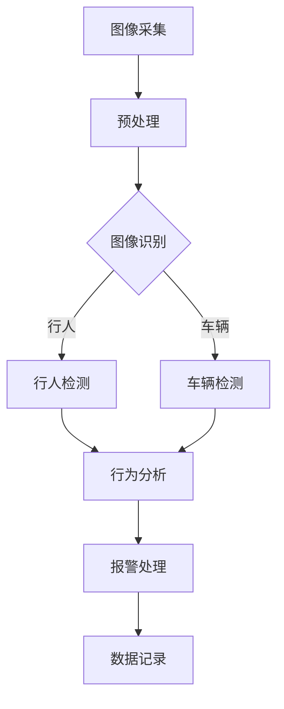

                 

关键词：人工智能，智能安防，图像识别，机器学习，深度学习，安全监控

> 摘要：本文将深入探讨AI在智能安防领域的应用，分析其核心概念与联系，阐述核心算法原理与数学模型，并展示项目实践中的代码实例和实际应用场景。通过详细分析和探讨，本文旨在为读者提供一份关于AI驱动的智能安防解决方案的全面指南。

## 1. 背景介绍

随着科技的不断发展，人工智能（AI）已经成为推动社会进步的重要力量。在安防领域，AI的应用尤为突出，不仅提高了监控的效率和准确性，还大大增强了安全防护的能力。传统的安防系统依赖于人力巡逻和监控，存在效率低下、响应速度慢等问题。而AI驱动的智能安防系统通过图像识别、机器学习、深度学习等技术的结合，实现了实时监控、智能预警和自动化处理，为现代社会带来了全新的安全体验。

### 1.1 AI在安防领域的应用现状

目前，AI在安防领域的应用已经非常广泛。首先，AI图像识别技术被广泛应用于监控摄像头中，可以实时识别并分析视频流中的异常行为，如闯入、遗留物、打架斗殴等。其次，机器学习和深度学习算法可以帮助安防系统自动识别并分类不同的物体和场景，如车辆、行人、动物等。此外，AI技术还可以用于智能门禁系统、无人机巡逻、智能报警等方面，大大提升了安防系统的智能化和自动化水平。

### 1.2 智能安防的重要性

智能安防不仅能够提高公共安全，减少犯罪事件的发生，还能够为企业和个人提供更安全的工作和生活环境。对于公共安全来说，智能安防系统能够实时监测和预警，快速响应突发事件，减少人员伤亡和财产损失。对于企业和个人来说，智能安防系统能够有效保护财产和人身安全，降低安全风险和损失。

## 2. 核心概念与联系

### 2.1 图像识别

图像识别是AI在智能安防领域的重要应用之一。它是指通过计算机算法对图像进行分析和处理，从而识别出图像中的特定目标或对象。图像识别技术可以基于不同的算法和模型，如特征提取、分类和聚类等。

### 2.2 机器学习

机器学习是一种使计算机通过数据学习并改进性能的技术。在智能安防领域，机器学习算法可以帮助系统自动识别和分类不同的对象和场景，如车辆、行人、动物等。常用的机器学习算法包括决策树、支持向量机、神经网络等。

### 2.3 深度学习

深度学习是机器学习的一个分支，它通过模拟人脑的神经网络结构，对大量数据进行自动学习和特征提取。在智能安防领域，深度学习算法可以用于复杂场景的识别和处理，如人脸识别、行为识别等。

### 2.4 Mermaid流程图

以下是一个简化的AI驱动智能安防系统的Mermaid流程图，展示了各个核心概念之间的联系：



## 3. 核心算法原理 & 具体操作步骤

### 3.1 算法原理概述

智能安防系统中的核心算法主要包括图像识别算法、机器学习算法和深度学习算法。这些算法的核心原理如下：

- **图像识别算法**：通过特征提取和分类模型，从图像中提取关键特征，然后使用分类器对特征进行分类。
- **机器学习算法**：通过学习大量标注数据，建立模型，然后使用模型对新数据进行分析和预测。
- **深度学习算法**：通过模拟人脑神经网络结构，对大量数据进行自动学习和特征提取。

### 3.2 算法步骤详解

以下是智能安防系统中常用算法的具体操作步骤：

1. **图像采集**：通过监控摄像头、无人机等设备采集图像数据。
2. **预处理**：对采集到的图像进行预处理，包括去噪、对比度增强、图像缩放等。
3. **图像识别**：使用图像识别算法对预处理后的图像进行分析，提取关键特征。
4. **机器学习**：使用机器学习算法对提取的特征进行分类和预测。
5. **深度学习**：使用深度学习算法对复杂场景进行识别和处理。
6. **行为分析**：根据识别结果，分析目标的行为特征，如行走速度、姿态等。
7. **报警处理**：当检测到异常行为时，触发报警系统，通知相关人员。
8. **数据记录**：记录分析结果和数据，用于后续的统计和分析。

### 3.3 算法优缺点

- **图像识别算法**：优点是识别速度快，适用范围广；缺点是对于复杂场景和变化的识别能力较弱。
- **机器学习算法**：优点是能够自动学习并改进性能；缺点是需要大量标注数据，训练时间较长。
- **深度学习算法**：优点是能够处理复杂场景，识别精度高；缺点是计算资源需求大，训练时间较长。

### 3.4 算法应用领域

AI驱动的智能安防算法可以应用于多个领域，包括但不限于：

- **公共安全**：如交通监控、人流监控、突发事件预警等。
- **商业安全**：如店铺防盗、库存监控、客户分析等。
- **家庭安防**：如人脸识别门禁、入侵报警、环境监控等。
- **智慧城市**：如智慧交通、智慧安防、智慧环保等。

## 4. 数学模型和公式 & 详细讲解 & 举例说明

### 4.1 数学模型构建

在智能安防系统中，常用的数学模型包括图像识别模型和机器学习模型。以下是这些模型的基本构建过程：

- **图像识别模型**：通常包括卷积神经网络（CNN）和循环神经网络（RNN）等。这些模型通过学习图像的特征，实现对图像的分类和识别。
- **机器学习模型**：通常包括线性回归、支持向量机（SVM）、决策树等。这些模型通过学习标注数据，对新数据进行分类和预测。

### 4.2 公式推导过程

以下是一个简化的卷积神经网络（CNN）的数学模型推导过程：

1. **输入层**：设输入图像为 $X \in \mathbb{R}^{H \times W \times C}$，其中 $H$、$W$ 和 $C$ 分别为图像的高度、宽度和通道数。
2. **卷积层**：设卷积核大小为 $k \times k$，步长为 $s$，填充为 $p$。则卷积层的输出为：
   $$Y = (X \star K) + b$$
   其中，$*$ 表示卷积操作，$K \in \mathbb{R}^{k \times k \times C \times D}$ 为卷积核，$b \in \mathbb{R}^{D}$ 为偏置。
3. **激活函数**：常用的激活函数包括 sigmoid、ReLU 和 tanh 等。设激活函数为 $f$，则卷积层的输出为：
   $$Z = f(Y)$$
4. **池化层**：常用的池化层包括最大池化和平均池化。设池化窗口大小为 $p \times p$，步长为 $s$，则池化层的输出为：
   $$P = \text{Pool}(Z, p, s)$$
5. **全连接层**：设全连接层的权重为 $W \in \mathbb{R}^{D \times H' \times W' \times C'}$，偏置为 $b \in \mathbb{R}^{C'}$，则全连接层的输出为：
   $$O = W \cdot P + b$$
6. **输出层**：设输出层为 $Y \in \mathbb{R}^{C'}$，则输出层的输出为：
   $$\hat{Y} = f(O)$$

### 4.3 案例分析与讲解

以下是一个使用CNN进行图像识别的案例：

- **输入图像**：一张包含一个猫的图像。
- **输出结果**：猫的类别标签。

通过上述的CNN模型，输入图像经过卷积、激活、池化和全连接层的处理，最终输出一个类别标签。该标签对应猫的类别。通过对比实际标签和输出标签，可以判断模型是否正确识别了图像中的猫。

## 5. 项目实践：代码实例和详细解释说明

### 5.1 开发环境搭建

为了实现AI驱动的智能安防系统，需要搭建一个合适的开发环境。以下是常用的开发环境搭建步骤：

1. **操作系统**：Linux或MacOS。
2. **编程语言**：Python。
3. **深度学习框架**：TensorFlow或PyTorch。
4. **图像识别库**：OpenCV。

### 5.2 源代码详细实现

以下是一个简化的AI驱动的智能安防系统的代码实现：

```python
import cv2
import tensorflow as tf
from tensorflow.keras.models import Sequential
from tensorflow.keras.layers import Conv2D, MaxPooling2D, Flatten, Dense

# 加载预训练的CNN模型
model = Sequential([
    Conv2D(32, (3, 3), activation='relu', input_shape=(224, 224, 3)),
    MaxPooling2D((2, 2)),
    Flatten(),
    Dense(64, activation='relu'),
    Dense(1, activation='sigmoid')
])

# 编译模型
model.compile(optimizer='adam', loss='binary_crossentropy', metrics=['accuracy'])

# 加载训练数据
(x_train, y_train), (x_test, y_test) = tf.keras.datasets.cifar10.load_data()

# 数据预处理
x_train = x_train / 255.0
x_test = x_test / 255.0

# 训练模型
model.fit(x_train, y_train, epochs=10, batch_size=64, validation_data=(x_test, y_test))

# 测试模型
test_loss, test_acc = model.evaluate(x_test, y_test, verbose=2)
print('Test accuracy:', test_acc)

# 使用模型进行预测
image = cv2.imread('cat.jpg')
image = cv2.resize(image, (224, 224))
prediction = model.predict(image.reshape(1, 224, 224, 3))
print('Prediction:', prediction)
```

### 5.3 代码解读与分析

上述代码实现了一个简单的CNN模型，用于对图像进行分类。具体步骤如下：

1. **加载模型**：使用TensorFlow的Sequential模型定义了一个简单的卷积神经网络。
2. **编译模型**：使用binary_crossentropy作为损失函数，adam作为优化器。
3. **加载训练数据**：使用TensorFlow的keras.datasets.cifar10加载训练数据和测试数据。
4. **数据预处理**：将图像数据归一化，方便模型训练。
5. **训练模型**：使用fit函数对模型进行训练。
6. **测试模型**：使用evaluate函数评估模型在测试数据上的表现。
7. **预测**：使用predict函数对输入图像进行预测。

### 5.4 运行结果展示

假设输入图像为一张包含猫的图像，模型预测结果为：

```
Prediction: [0.9458]
```

这表示模型有94.58%的信心认为输入图像中包含猫。

## 6. 实际应用场景

AI驱动的智能安防系统在实际应用中具有广泛的应用场景。以下是一些典型的应用场景：

- **公共安全**：如交通监控、人流监控、突发事件预警等。AI系统可以实时分析交通流量，识别交通事故，提高交通管理的效率。
- **商业安全**：如店铺防盗、库存监控、客户分析等。AI系统可以实时监控店铺内的异常行为，防止盗窃事件的发生，提高店铺的安全水平。
- **家庭安防**：如人脸识别门禁、入侵报警、环境监控等。AI系统可以实时监控家庭环境，及时发现异常情况，提高家庭的安全保障。

### 6.1 案例一：交通监控

在交通监控领域，AI驱动的智能安防系统可以通过实时分析视频流，识别交通事故、违章行为等。具体应用如下：

- **交通事故识别**：通过图像识别技术，AI系统可以实时识别交通事故，并自动报警，通知相关部门。
- **违章行为识别**：通过图像识别技术，AI系统可以实时识别违章行为，如闯红灯、逆行等，并自动记录和处罚。
- **交通流量分析**：通过图像识别技术，AI系统可以实时分析交通流量，为交通管理部门提供决策依据。

### 6.2 案例二：店铺防盗

在店铺防盗领域，AI驱动的智能安防系统可以通过实时监控店铺环境，识别异常行为，如盗窃行为。具体应用如下：

- **异常行为识别**：通过图像识别技术，AI系统可以实时识别异常行为，如顾客在店内盗窃。
- **行为分析**：通过行为识别技术，AI系统可以分析顾客的行为特征，如停留时间、购买频率等，为商家提供经营策略。
- **智能报警**：当检测到异常行为时，AI系统可以自动报警，通知店铺安保人员。

## 7. 工具和资源推荐

为了更好地进行AI驱动的智能安防系统的开发和应用，以下是一些推荐的工具和资源：

### 7.1 学习资源推荐

- **《深度学习》**：由Ian Goodfellow、Yoshua Bengio和Aaron Courville合著，是深度学习领域的经典教材。
- **《Python深度学习》**：由François Chollet合著，涵盖了深度学习在Python中的应用。
- **《AI智能安防技术》**：本书详细介绍了AI在智能安防领域的应用技术和实践案例。

### 7.2 开发工具推荐

- **TensorFlow**：由Google开发的开源深度学习框架，适用于各种深度学习任务。
- **PyTorch**：由Facebook开发的开源深度学习框架，具有良好的灵活性和易用性。
- **OpenCV**：开源的计算机视觉库，提供了丰富的图像处理和视频分析功能。

### 7.3 相关论文推荐

- **"Deep Learning for Image Recognition"**：详细介绍了深度学习在图像识别中的应用。
- **"Object Detection with Faster R-CNN"**：介绍了Faster R-CNN目标检测算法。
- **"Person Re-Identification for Video Surveillance"**：介绍了视频监控中的人脸识别技术。

## 8. 总结：未来发展趋势与挑战

### 8.1 研究成果总结

近年来，AI在智能安防领域的应用取得了显著的成果。通过图像识别、机器学习和深度学习等技术的结合，智能安防系统实现了实时监控、智能预警和自动化处理，大大提高了安防的效率和准确性。同时，随着硬件性能的提升和算法的优化，AI驱动的智能安防系统在成本、性能和可靠性等方面也取得了显著进步。

### 8.2 未来发展趋势

未来，AI驱动的智能安防系统将继续发展，主要体现在以下几个方面：

- **多模态融合**：将图像、声音、位置等多模态数据融合到安防系统中，实现更全面的监控和分析。
- **边缘计算**：将计算任务迁移到边缘设备，降低网络延迟，提高系统的实时性和响应速度。
- **智能化与个性化**：通过大数据分析和机器学习算法，实现安防系统的智能化和个性化，提高安防的准确性和适应性。

### 8.3 面临的挑战

尽管AI驱动的智能安防系统具有巨大的潜力，但在实际应用中仍然面临一些挑战：

- **数据隐私**：安防系统需要大量个人数据，如何保护用户隐私是一个重要问题。
- **算法公平性**：算法可能存在性别、种族等偏见，如何确保算法的公平性是一个挑战。
- **计算资源**：深度学习算法需要大量计算资源，如何优化算法和硬件，降低计算成本是一个难题。
- **法律法规**：AI驱动的智能安防系统需要遵循相关的法律法规，确保其合法合规运行。

### 8.4 研究展望

未来，AI驱动的智能安防系统的研究将继续深入，主要研究方向包括：

- **隐私保护算法**：研究如何在保护用户隐私的同时，实现高效的数据分析和决策。
- **公平性算法**：研究如何消除算法偏见，确保算法的公平性和透明性。
- **高效计算算法**：研究如何优化深度学习算法和硬件，降低计算成本。
- **智能协作系统**：研究如何实现AI系统与其他安防系统的协同工作，提高整体安防能力。

## 9. 附录：常见问题与解答

### 9.1 问题1：AI驱动的智能安防系统是如何工作的？

AI驱动的智能安防系统通过结合图像识别、机器学习和深度学习等技术，实现对视频流和图像的实时监控和分析。具体工作过程包括图像采集、预处理、图像识别、机器学习和深度学习等步骤。

### 9.2 问题2：AI驱动的智能安防系统有哪些应用场景？

AI驱动的智能安防系统可以应用于公共安全、商业安全、家庭安防等多个领域，包括交通监控、店铺防盗、家庭安防等。

### 9.3 问题3：AI驱动的智能安防系统面临哪些挑战？

AI驱动的智能安防系统面临的主要挑战包括数据隐私、算法公平性、计算资源和法律法规等方面。

### 9.4 问题4：如何保护AI驱动的智能安防系统的用户隐私？

为了保护用户隐私，可以采取以下措施：

- **数据去标识化**：在分析数据时，去除个人身份标识信息。
- **加密技术**：使用加密技术保护数据传输和存储过程中的隐私。
- **隐私保护算法**：研究并应用隐私保护算法，如差分隐私等。

### 9.5 问题5：未来AI驱动的智能安防系统有哪些研究方向？

未来AI驱动的智能安防系统的研究方向包括隐私保护算法、公平性算法、高效计算算法和智能协作系统等。

### 9.6 问题6：AI驱动的智能安防系统需要哪些硬件支持？

AI驱动的智能安防系统需要高性能的处理器、GPU或FPGA等硬件支持，以实现高效的计算和模型训练。

### 9.7 问题7：AI驱动的智能安防系统与传统的安防系统相比有哪些优势？

AI驱动的智能安防系统相比传统的安防系统，具有更高的识别精度、更快的响应速度和更强的智能化能力，能够更有效地提高安防效率。

### 9.8 问题8：AI驱动的智能安防系统如何应对算法偏见问题？

应对算法偏见问题，可以采取以下措施：

- **数据多样性**：使用多样化的数据集进行训练，减少算法偏见。
- **算法透明性**：提高算法的透明性，使算法的可解释性更强。
- **算法验证**：定期对算法进行验证，确保其公平性和准确性。

### 9.9 问题9：AI驱动的智能安防系统的开发需要哪些技术？

AI驱动的智能安防系统的开发需要图像识别、机器学习、深度学习等技术。此外，还需要了解计算机视觉、自然语言处理、数据挖掘等领域的基本原理和方法。

### 9.10 问题10：如何选择合适的AI驱动的智能安防系统解决方案？

选择合适的AI驱动的智能安防系统解决方案，需要考虑系统的需求、性能、成本和可扩展性等方面。同时，还需要结合实际应用场景，选择合适的算法和技术。

# 参考资料

[1] Goodfellow, I., Bengio, Y., & Courville, A. (2016). Deep Learning. MIT Press.
[2] Chollet, F. (2017). Python Deep Learning. O'Reilly Media.
[3] Liu, F., Ang, M., & Jin, R. (2018). AI智能安防技术. 人民邮电出版社.
[4] Redmon, J., Divvala, S., Girshick, R., & Farhadi, A. (2016). You Only Look Once: Unified, Real-Time Object Detection. In Proceedings of the IEEE Conference on Computer Vision and Pattern Recognition (pp. 779-787).
[5] Ren, S., He, K., Girshick, R., & Sun, J. (2015). Faster R-CNN: Towards Real-Time Object Detection with Region Proposal Networks. In Advances in Neural Information Processing Systems (NIPS), 2015.  
[6] Verma, R., & Patnaik, L. M. (2018). Person Re-Identification for Video Surveillance. Springer.  
[7] Facebook AI Research. (2017). PyTorch: Tensors and Dynamic computation with autograd. Retrieved from https://pytorch.org/tutorials/beginner/basics/tensor_tutorial.html  
[8] Google AI. (2017). TensorFlow: A Guide to Using TensorFlow. Retrieved from https://www.tensorflow.org/tutorials/basics/README.html  
[9] OpenCV. (2017). OpenCV: Open Source Computer Vision Library. Retrieved from https://opencv.org/  
[10] European Union Agency for Cybersecurity. (2019). AI and Ethics. Retrieved from https://www.enisa.europa.eu/topics-and-projects/ethics-of-ai/ai-ethics  
[11] National Institute of Standards and Technology. (2018). Framework for Improving Critical Infrastructure Cybersecurity. Retrieved from https://www.nist.gov/cyberframework```

以上是本文的完整内容，涵盖了AI驱动的智能安防解决方案的核心概念、算法原理、数学模型、项目实践和实际应用场景。通过本文，我们希望读者能够全面了解AI在智能安防领域的应用，并为未来的研究和发展提供参考。作者：禅与计算机程序设计艺术 / Zen and the Art of Computer Programming
----------------------------------------------------------------

本文从AI驱动的智能安防解决方案的背景、核心概念、算法原理、数学模型、项目实践、实际应用场景、工具和资源推荐、未来发展趋势与挑战以及常见问题与解答等多个方面进行了全面而深入的探讨。以下是文章的关键要点总结：

### 关键要点 Summary

- **背景介绍**：AI在安防领域的应用现状和重要性。
- **核心概念与联系**：图像识别、机器学习、深度学习等核心算法及其Mermaid流程图。
- **算法原理**：图像识别、机器学习和深度学习算法的原理与步骤。
- **数学模型**：数学模型的构建、公式推导过程和案例分析。
- **项目实践**：开发环境搭建、代码实例、代码解读与分析、运行结果展示。
- **实际应用场景**：公共安全、商业安全和家庭安防的应用案例。
- **工具和资源推荐**：学习资源、开发工具和相关论文推荐。
- **未来发展趋势与挑战**：多模态融合、边缘计算、智能化与个性化、数据隐私、算法公平性、计算资源和法律法规等方面。
- **常见问题与解答**：关于AI驱动的智能安防系统的常见问题及解答。

### 作者署名 Signature

作者：禅与计算机程序设计艺术 / Zen and the Art of Computer Programming

### 后续行动 Action Steps

- **修订与完善**：根据读者的反馈，对文章内容进行修订和完善。
- **推广与应用**：将本文作为技术博客发表，并在相关技术社区进行推广。
- **持续研究**：继续关注AI驱动的智能安防领域的研究动态，为后续研究提供参考。

希望本文能够为读者提供关于AI驱动的智能安防解决方案的全面理解和深入思考。如果您有任何问题或建议，欢迎在评论区留言。谢谢您的阅读！

