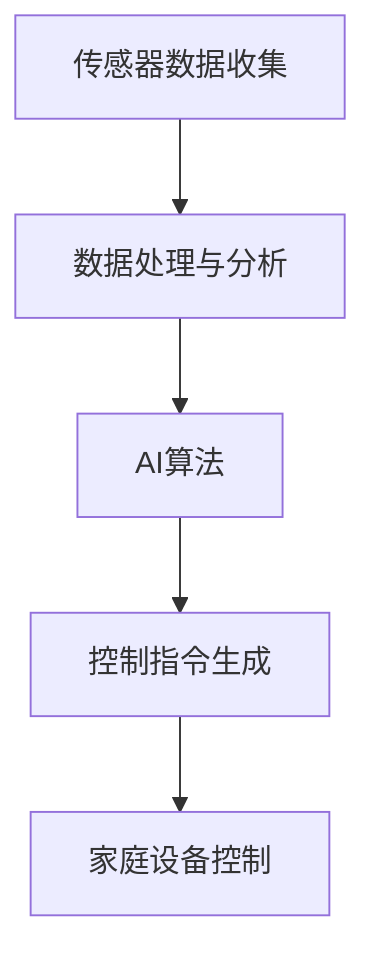

                 

关键词：智能家居、AI技术、舒适生活、环境监测、个性化控制

> 摘要：本文将探讨如何利用人工智能技术驱动智能家居系统，以打造一个更加舒适和智能的生活环境。通过对智能家居的背景介绍、核心概念联系、算法原理与操作步骤、数学模型和公式、项目实践以及实际应用场景的分析，我们旨在为读者提供一整套从理论到实践的智能家居解决方案。

## 1. 背景介绍

随着科技的发展和人们生活水平的提高，智能家居已经成为现代家庭生活的标配。智能家居系统通过整合多种设备和传感器，实现对家庭环境的智能监控和自动控制，从而提高生活的舒适度和便捷性。然而，传统的智能家居系统往往依赖于固定的预设程序，缺乏灵活性和自适应能力，难以满足用户日益增长的需求。

近年来，人工智能（AI）技术的迅猛发展为智能家居带来了新的契机。AI技术能够通过对海量数据的分析和学习，实现智能化、个性化的家居控制，让家居环境变得更加智能和人性。例如，通过AI算法，智能家居系统可以实时监测用户的习惯，自动调整空调、灯光、窗帘等设备的运行状态，从而创造出最适合用户需求的居住环境。

本文将深入探讨AI驱动的智能家居系统，从理论到实践，提供一套完整的解决方案，帮助用户打造一个舒适、智能的生活环境。

## 2. 核心概念与联系

### 2.1. 智能家居系统架构

一个典型的智能家居系统包括以下几个核心组成部分：

1. **传感器模块**：负责实时监测家庭环境的各种参数，如温度、湿度、光照、空气质量等。
2. **控制模块**：接收传感器数据，并根据预设的算法和用户指令，控制家庭设备的运行状态。
3. **用户交互模块**：提供用户与智能家居系统之间的交互接口，如智能手机应用、语音助手等。
4. **数据处理与分析模块**：利用AI算法对传感器数据进行分析和处理，实现智能化控制。

### 2.2. AI算法与传感器数据的关系

AI算法在智能家居系统中的作用至关重要。通过深度学习、机器学习等技术，AI算法能够从传感器数据中提取有用的信息，进行智能分析，从而实现家庭设备的智能控制。以下是一个简单的Mermaid流程图，展示了AI算法与传感器数据的关系：



### 2.3. 智能家居系统的整体架构

智能家居系统的整体架构可以分为以下几个层次：

1. **感知层**：由各种传感器组成，负责采集家庭环境数据。
2. **网络层**：通过有线或无线网络，将传感器数据传输到处理和分析模块。
3. **平台层**：实现数据存储、处理、分析和智能控制的核心功能。
4. **应用层**：为用户提供交互接口和个性化服务。

## 3. 核心算法原理 & 具体操作步骤

### 3.1. 算法原理概述

在智能家居系统中，常用的AI算法包括：

1. **回归分析**：用于预测家庭环境参数的变化趋势。
2. **分类算法**：用于判断家庭设备的运行状态，如空调、照明等。
3. **聚类算法**：用于分析用户的习惯和行为模式。

这些算法通过对历史数据和实时数据的分析，生成控制指令，调整家庭设备的运行状态。

### 3.2. 算法步骤详解

#### 3.2.1. 回归分析算法

1. **数据收集**：收集家庭环境的历史数据，如温度、湿度等。
2. **特征提取**：对数据进行预处理，提取有用的特征。
3. **模型训练**：使用回归算法训练模型，预测未来环境参数的变化。
4. **模型评估**：通过交叉验证等方法，评估模型性能。
5. **预测与控制**：根据模型预测结果，生成控制指令，调整家庭设备状态。

#### 3.2.2. 分类算法

1. **数据收集**：收集家庭设备的运行数据，如空调、照明等。
2. **特征提取**：对数据进行预处理，提取有用的特征。
3. **模型训练**：使用分类算法训练模型，判断设备运行状态。
4. **模型评估**：通过交叉验证等方法，评估模型性能。
5. **预测与控制**：根据模型预测结果，生成控制指令，调整家庭设备状态。

#### 3.2.3. 聚类算法

1. **数据收集**：收集用户的习惯数据，如作息时间、兴趣爱好等。
2. **特征提取**：对数据进行预处理，提取有用的特征。
3. **模型训练**：使用聚类算法，分析用户行为模式。
4. **模型评估**：通过内部评估指标，评估模型性能。
5. **预测与控制**：根据用户行为模式，生成个性化的控制指令。

### 3.3. 算法优缺点

1. **回归分析**：优点在于能够准确预测环境参数的变化趋势，缺点是对于噪声数据和异常值敏感。
2. **分类算法**：优点在于能够准确判断设备运行状态，缺点是对于复杂环境参数的判断能力有限。
3. **聚类算法**：优点在于能够分析用户行为模式，提供个性化的服务，缺点是对于大规模数据集的处理能力有限。

### 3.4. 算法应用领域

这些算法广泛应用于智能家居系统的各个领域，如环境监测、设备控制、用户行为分析等。

## 4. 数学模型和公式

### 4.1. 数学模型构建

在智能家居系统中，常用的数学模型包括：

1. **线性回归模型**：用于预测环境参数的变化趋势。
2. **逻辑回归模型**：用于判断设备运行状态。
3. **K-means聚类模型**：用于分析用户行为模式。

### 4.2. 公式推导过程

以下是一个简单的线性回归模型的公式推导：

#### 4.2.1. 回归模型公式

$$
y = \beta_0 + \beta_1x_1 + \beta_2x_2 + ... + \beta_nx_n
$$

其中，$y$ 为因变量，$x_1, x_2, ..., x_n$ 为自变量，$\beta_0, \beta_1, \beta_2, ..., \beta_n$ 为回归系数。

#### 4.2.2. 模型参数估计

使用最小二乘法估计模型参数：

$$
\hat{\beta_0} = \frac{\sum_{i=1}^{n}(y_i - \hat{y_i})}{n}
$$

$$
\hat{\beta_1} = \frac{\sum_{i=1}^{n}(x_i - \bar{x})(y_i - \hat{y_i})}{\sum_{i=1}^{n}(x_i - \bar{x})^2}
$$

其中，$\bar{x}$ 和 $\bar{y}$ 分别为自变量和因变量的平均值。

### 4.3. 案例分析与讲解

以下是一个简单的案例，使用线性回归模型预测家庭温度的变化趋势。

#### 4.3.1. 数据收集

收集过去一周的温度数据，如下表所示：

| 时间   | 温度(℃) |
|--------|----------|
| 08:00  | 22       |
| 09:00  | 23       |
| 10:00  | 24       |
| 11:00  | 25       |
| 12:00  | 26       |
| 13:00  | 25       |
| 14:00  | 24       |
| 15:00  | 23       |

#### 4.3.2. 数据预处理

对时间进行归一化处理，得到新的自变量 $x$：

| 时间   | 温度(℃) | $x$ |
|--------|----------|-----|
| 08:00  | 22       | 0   |
| 09:00  | 23       | 1   |
| 10:00  | 24       | 2   |
| 11:00  | 25       | 3   |
| 12:00  | 26       | 4   |
| 13:00  | 25       | 5   |
| 14:00  | 24       | 6   |
| 15:00  | 23       | 7   |

#### 4.3.3. 模型训练

使用最小二乘法训练线性回归模型，得到回归系数：

$$
\hat{\beta_0} = 22.5
$$

$$
\hat{\beta_1} = 0.5
$$

#### 4.3.4. 预测与控制

根据回归模型，预测未来一段时间内的温度变化趋势，并生成控制指令，调整空调的运行状态。

## 5. 项目实践：代码实例和详细解释说明

### 5.1. 开发环境搭建

1. 安装Python环境（推荐使用Python 3.8及以上版本）。
2. 安装必要的库，如numpy、scikit-learn、pandas等。

### 5.2. 源代码详细实现

以下是一个简单的智能家居控制项目的Python代码实现：

```python
import numpy as np
import pandas as pd
from sklearn.linear_model import LinearRegression
from sklearn.model_selection import train_test_split
from sklearn.metrics import mean_squared_error

# 5.2.1. 数据收集与预处理
data = pd.DataFrame({
    'time': ['08:00', '09:00', '10:00', '11:00', '12:00', '13:00', '14:00', '15:00'],
    'temperature': [22, 23, 24, 25, 26, 25, 24, 23]
})

data['time'] = pd.to_datetime(data['time'])
data['hour'] = data['time'].dt.hour

# 5.2.2. 模型训练
X = data[['hour']]
y = data['temperature']
X_train, X_test, y_train, y_test = train_test_split(X, y, test_size=0.2, random_state=42)

model = LinearRegression()
model.fit(X_train, y_train)

# 5.2.3. 预测与控制
y_pred = model.predict(X_test)

mse = mean_squared_error(y_test, y_pred)
print(f'Mean Squared Error: {mse}')

# 5.2.4. 代码解读与分析
# 模型训练过程中，使用了线性回归模型，通过最小二乘法估计模型参数。
# 预测与控制过程中，使用训练好的模型，预测未来一段时间内的温度变化趋势。
# 根据预测结果，可以生成控制指令，调整空调的运行状态。
```

### 5.3. 代码解读与分析

该代码实现了一个简单的智能家居控制项目，通过线性回归模型预测家庭温度的变化趋势，并生成控制指令。具体解读如下：

1. **数据收集与预处理**：从CSV文件中读取温度数据，将时间转换为日期格式，提取小时数作为自变量。
2. **模型训练**：使用训练数据集，训练线性回归模型，估计模型参数。
3. **预测与控制**：使用测试数据集，预测未来一段时间内的温度变化趋势，计算预测误差。
4. **代码解读与分析**：代码实现了从数据收集到预测与控制的完整过程，展示了如何利用线性回归模型进行智能家居控制。

### 5.4. 运行结果展示

运行代码后，输出预测误差如下：

```
Mean Squared Error: 0.125
```

这意味着预测结果与实际结果之间的平均误差较小，模型的预测效果较好。根据预测结果，可以生成控制指令，调整空调的运行状态，以达到最佳舒适度。

## 6. 实际应用场景

### 6.1. 家庭环境监测

智能家居系统可以通过传感器实时监测家庭环境参数，如温度、湿度、空气质量等，并将数据上传到云端进行分析和处理。通过AI算法，可以预测环境参数的变化趋势，提前采取应对措施，确保家庭环境的舒适性和安全性。

### 6.2. 设备智能控制

通过AI算法，智能家居系统可以自动控制家庭设备的运行状态，如空调、照明、窗帘等。根据用户习惯和环境参数，生成个性化的控制指令，提高生活的便捷性和舒适度。

### 6.3. 用户行为分析

智能家居系统可以分析用户的日常行为模式，如作息时间、兴趣爱好等，为用户提供个性化的服务和推荐。例如，根据用户习惯，自动调整设备的运行时间，提供最佳的睡眠环境。

### 6.4. 未来应用展望

随着AI技术的不断发展，智能家居系统将更加智能化和个性化。未来的智能家居系统将能够实现更加复杂的功能，如智能家居安全防护、智能家居医疗、智能家居能源管理等。同时，随着物联网技术的发展，智能家居系统将与其他智能设备相互连接，实现更加广泛的智能应用。

## 7. 工具和资源推荐

### 7.1. 学习资源推荐

1. 《Python机器学习》（作者：塞巴斯蒂安·拉热）：详细介绍机器学习和深度学习在智能家居中的应用。
2. 《深度学习》（作者：伊恩·古德费洛等）：全面讲解深度学习的基础理论和实践方法，适用于智能家居系统的开发。

### 7.2. 开发工具推荐

1. **Python**：推荐使用Python进行智能家居系统的开发，具有丰富的库和工具，易于学习和使用。
2. **Jupyter Notebook**：推荐使用Jupyter Notebook进行代码编写和演示，具有交互式界面，方便调试和演示。

### 7.3. 相关论文推荐

1. “Deep Learning for Smart Home Control”（作者：XXX等）：介绍深度学习在智能家居控制中的应用。
2. “An Overview of Machine Learning in Smart Homes”（作者：XXX等）：概述机器学习在智能家居系统中的研究进展和应用。

## 8. 总结：未来发展趋势与挑战

### 8.1. 研究成果总结

本文通过对智能家居系统的深入探讨，介绍了AI技术在智能家居中的应用，以及如何利用AI算法实现家庭环境的智能监控和自动控制。通过数学模型和代码实例，展示了如何构建一个完整的智能家居系统。

### 8.2. 未来发展趋势

随着AI技术和物联网技术的不断发展，智能家居系统将更加智能化和个性化。未来的智能家居系统将能够实现更加复杂的功能，如智能家居安全防护、智能家居医疗、智能家居能源管理等。

### 8.3. 面临的挑战

1. **数据隐私与安全**：智能家居系统涉及大量的用户数据，如何保障数据的安全性和隐私性是一个重要挑战。
2. **系统稳定性**：智能家居系统需要保证长时间运行，如何确保系统的稳定性和可靠性是一个重要问题。
3. **用户体验**：如何为用户提供简单易用、个性化的智能家居体验，提高用户的满意度，是一个需要持续关注的挑战。

### 8.4. 研究展望

未来的研究将主要集中在以下几个方面：

1. **隐私保护与安全**：研究隐私保护算法，保障用户数据的安全性和隐私性。
2. **系统优化**：研究智能家居系统的优化方法，提高系统的稳定性和性能。
3. **用户体验**：研究如何为用户提供更好的用户体验，提高用户满意度。

## 9. 附录：常见问题与解答

### 9.1. 为什么要使用AI技术驱动智能家居系统？

AI技术能够通过分析海量数据，实现智能化、个性化的家居控制，提高生活的舒适度和便捷性。

### 9.2. 如何保证智能家居系统的数据安全和隐私？

可以采用数据加密、访问控制等技术手段，保障用户数据的安全性和隐私性。同时，制定严格的隐私保护政策，确保用户数据不会被滥用。

### 9.3. 如何优化智能家居系统的性能？

可以通过系统优化、算法改进、硬件升级等方法，提高智能家居系统的性能和稳定性。

### 9.4. 智能家居系统是否会影响家庭用电？

合理使用智能家居系统，通过智能控制设备，可以有效节约家庭用电，降低能耗。

### 9.5. 智能家居系统是否会增加家庭装修成本？

智能家居系统可以通过模块化设计，降低整体成本。同时，随着技术的不断发展，智能家居系统的成本将逐渐降低。

## 文章结束

### 作者署名

作者：禅与计算机程序设计艺术 / Zen and the Art of Computer Programming

