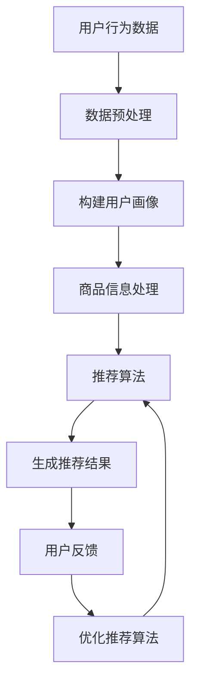

                 

关键词：AI商品推荐、电商平台、多样性、相关性、动态平衡、算法、数学模型、实践应用

## 摘要

本文探讨了AI技术在电商平台商品推荐系统中的应用，特别关注了多样性与相关性之间的动态平衡问题。随着用户需求的多样化和信息过载的加剧，如何构建一个既能够提供个性化推荐，又能够保持商品推荐多样性的系统，成为电商平台面临的重要挑战。本文首先介绍了电商平台商品推荐系统的基础概念和当前的技术趋势，然后深入分析了多样性和相关性在推荐系统中的重要性。接着，本文提出了一种新的AI算法，旨在实现商品推荐中的多样性与相关性动态平衡，并详细阐述了该算法的数学模型和操作步骤。随后，通过一个实际的项目实践，展示了该算法的具体实现过程及其效果。最后，本文讨论了推荐系统的实际应用场景，并对未来的发展趋势和挑战进行了展望。

## 1. 背景介绍

随着互联网技术的迅猛发展，电商平台已成为消费者购买商品的主要渠道之一。在这一背景下，商品推荐系统成为电商平台的核心竞争力之一。商品推荐系统能够根据用户的兴趣和行为习惯，向用户推荐他们可能感兴趣的商品，从而提高用户的购物体验和平台的销售额。

传统的推荐系统主要依赖于协同过滤、基于内容的推荐等算法，这些算法在一定程度上能够满足用户的个性化需求，但往往存在推荐结果单一、重复性强的问题。随着人工智能技术的快速发展，特别是深度学习和强化学习等技术的引入，推荐系统的性能得到了显著提升。然而，如何在这些新技术的基础上实现推荐结果的多样性和相关性之间的动态平衡，仍然是一个亟待解决的问题。

多样性（Diversity）是指在推荐结果中展现不同种类、不同风格的商品，避免用户的体验受到单一类型的推荐结果的影响。而相关性（Relevance）则强调推荐结果与用户兴趣和需求的高度匹配。在实际应用中，多样性和相关性往往是相互制约的，过度的多样性可能会导致推荐结果与用户兴趣的偏离，而过分的相关性则容易导致推荐结果的单调乏味。

因此，如何在AI驱动的电商平台商品推荐系统中实现多样性与相关性的动态平衡，成为一个重要的研究课题。本文将提出一种新的算法，结合深度学习和强化学习技术，旨在实现这一目标。

## 2. 核心概念与联系

### 2.1. 推荐系统的基本概念

推荐系统（Recommender System）是一种信息过滤技术，通过分析用户的行为数据和偏好信息，为用户推荐他们可能感兴趣的商品或内容。推荐系统通常由以下几个核心组件组成：

1. **用户画像**：通过收集和分析用户的历史行为数据，构建用户的兴趣模型和偏好信息。
2. **商品信息**：对商品的属性进行描述，如类别、价格、品牌等，以便于推荐算法进行处理。
3. **推荐算法**：根据用户画像和商品信息，生成推荐结果。
4. **反馈机制**：收集用户对推荐结果的反馈，用于优化推荐算法。

### 2.2. 多样性与相关性的概念

1. **多样性（Diversity）**：
   多样性是指推荐系统在生成推荐结果时，能够提供多样化的商品，以满足用户对于新鲜感、个性化体验的需求。多样性通常可以从以下几个方面进行度量：
   - **内容多样性**：推荐结果中包含不同类型的商品。
   - **风格多样性**：推荐结果中展现不同风格的商品。
   - **新奇性**：推荐结果中包含用户未发现或未曾购买的商品。

2. **相关性（Relevance）**：
   相关性是指推荐结果与用户的兴趣和需求高度匹配的程度。一个理想的推荐系统应该在保证多样性的同时，尽量提高推荐结果的相关性。相关性可以从以下几个方面进行度量：
   - **兴趣匹配度**：推荐结果与用户兴趣模型的相关程度。
   - **需求满足度**：推荐结果能否满足用户的实际需求。

### 2.3. 多样性与相关性之间的联系

多样性和相关性在推荐系统中既相互促进又相互制约。合理的多样性能够增加用户的满意度和平台的粘性，而过度的多样性可能会导致推荐结果偏离用户兴趣，降低用户体验。同时，过分追求相关性可能会导致推荐结果的单调乏味，缺乏新意。因此，如何平衡多样性与相关性，是一个关键的研究课题。

### 2.4. Mermaid 流程图

为了更好地阐述多样性与相关性在推荐系统中的实现过程，以下是一个简单的Mermaid流程图：



在这个流程图中，用户行为数据和商品信息是推荐系统的输入，经过数据处理和算法处理后，生成推荐结果。用户对推荐结果的反馈用于进一步优化推荐算法，形成一个闭环的反馈机制。

## 3. 核心算法原理 & 具体操作步骤

### 3.1. 算法原理概述

本文提出的算法是基于深度学习和强化学习的结合，旨在实现多样性与相关性的动态平衡。算法的主要思路如下：

1. **用户兴趣建模**：利用深度学习技术，对用户的历史行为数据进行建模，提取用户兴趣特征。
2. **商品属性编码**：对商品的信息进行编码，将其转换为可供深度学习模型处理的特征向量。
3. **推荐策略优化**：使用强化学习技术，根据用户兴趣特征和商品属性，动态调整推荐策略，以实现多样性与相关性的平衡。
4. **反馈机制**：收集用户的反馈数据，用于调整和优化推荐策略。

### 3.2. 算法步骤详解

#### 3.2.1. 用户兴趣建模

首先，收集用户的历史行为数据，包括浏览记录、购买记录、评价记录等。利用深度学习技术，构建一个用户兴趣模型。具体步骤如下：

1. **数据预处理**：对用户行为数据进行清洗和格式化，将其转换为适合深度学习模型处理的输入数据。
2. **特征提取**：利用神经网络模型，从用户行为数据中提取兴趣特征，如兴趣类别、兴趣强度等。

#### 3.2.2. 商品属性编码

对商品的信息进行编码，将其转换为可供深度学习模型处理的特征向量。具体步骤如下：

1. **属性提取**：从商品信息中提取关键属性，如类别、价格、品牌等。
2. **特征编码**：利用编码器模型，将商品属性转换为高维的特征向量。

#### 3.2.3. 推荐策略优化

利用强化学习技术，根据用户兴趣特征和商品属性，动态调整推荐策略，以实现多样性与相关性的平衡。具体步骤如下：

1. **环境构建**：构建一个模拟环境，用于模拟用户与推荐系统的交互过程。
2. **策略学习**：利用深度Q网络（DQN）等强化学习算法，学习一个推荐策略，以最大化用户满意度。
3. **策略优化**：根据用户反馈数据，调整推荐策略，以实现多样性与相关性的动态平衡。

#### 3.2.4. 反馈机制

收集用户的反馈数据，用于调整和优化推荐策略。具体步骤如下：

1. **反馈收集**：收集用户对推荐结果的反馈，如点击率、购买率等。
2. **反馈分析**：对用户反馈进行分析，识别推荐结果中的问题和不足。
3. **策略调整**：根据反馈分析结果，调整推荐策略，以提高用户满意度。

### 3.3. 算法优缺点

#### 优点

1. **高效性**：基于深度学习和强化学习技术的结合，算法具有较高的计算效率和准确性。
2. **动态平衡**：算法能够根据用户的兴趣和反馈，动态调整推荐策略，实现多样性与相关性的动态平衡。
3. **个性化**：通过用户兴趣建模，能够为用户提供个性化的推荐结果。

#### 缺点

1. **数据依赖**：算法的性能依赖于用户行为数据和商品信息的数据质量。
2. **计算复杂度**：算法涉及到深度学习和强化学习技术，计算复杂度较高，对硬件资源要求较高。

### 3.4. 算法应用领域

该算法适用于需要实现多样性与相关性动态平衡的场景，如电商平台、社交媒体、音乐流媒体等。在电商平台上，通过该算法，可以为用户提供更加丰富、多样化的推荐结果，提高用户满意度和平台粘性。

## 4. 数学模型和公式 & 详细讲解 & 举例说明

### 4.1. 数学模型构建

为了实现多样性与相关性动态平衡，我们需要构建一个数学模型，该模型包括用户兴趣建模、商品属性编码和推荐策略优化三个主要部分。

#### 用户兴趣建模

用户兴趣建模的目标是从用户行为数据中提取出用户兴趣特征。我们可以使用以下模型：

$$
\text{Interest}(u) = f(\text{Behavior}(u))
$$

其中，$u$表示用户，$\text{Behavior}(u)$表示用户的历史行为数据，$f(\cdot)$表示深度学习模型，用于提取用户兴趣特征。

#### 商品属性编码

商品属性编码的目标是将商品信息转换为高维特征向量。我们可以使用以下模型：

$$
\text{Feature}(g) = g(\text{Attribute}(g))
$$

其中，$g$表示商品，$\text{Attribute}(g)$表示商品的关键属性，$g(\cdot)$表示编码器模型。

#### 推荐策略优化

推荐策略优化的目标是根据用户兴趣特征和商品属性，生成一个推荐结果。我们可以使用以下模型：

$$
\text{Recommend}(g, u) = \arg\max_{g'} Q(g', u)
$$

其中，$Q(g', u)$表示商品$g'$对用户$u$的期望收益，$g'$表示候选商品。

### 4.2. 公式推导过程

#### 用户兴趣建模

首先，我们使用卷积神经网络（CNN）对用户行为数据进行特征提取。假设输入的用户行为数据为$\text{Behavior}(u) \in \mathbb{R}^{n \times m}$，其中$n$表示时间步数，$m$表示每个时间步的特征维度。卷积神经网络的输出为用户兴趣特征$\text{Interest}(u) \in \mathbb{R}^{d}$，其中$d$表示兴趣特征维度。

卷积神经网络的损失函数为：

$$
L_{\text{CNN}} = \frac{1}{n} \sum_{t=1}^{n} \sigma(\text{CNN}(\text{Behavior}(u)^t) - \text{Interest}(u)^t)
$$

其中，$\sigma(\cdot)$表示激活函数，$\text{CNN}(\cdot)$表示卷积神经网络。

为了优化卷积神经网络的参数，我们可以使用梯度下降算法：

$$
\theta_{\text{CNN}} = \theta_{\text{CNN}} - \alpha \nabla_{\theta_{\text{CNN}}} L_{\text{CNN}}
$$

其中，$\theta_{\text{CNN}}$表示卷积神经网络的参数，$\alpha$表示学习率。

#### 商品属性编码

接下来，我们使用自编码器（Autoencoder）对商品属性进行编码。假设输入的商品属性为$\text{Attribute}(g) \in \mathbb{R}^{n \times m}$，其中$n$表示属性维度，$m$表示每个属性的特征维度。自编码器的输出为商品特征向量$\text{Feature}(g) \in \mathbb{R}^{d}$。

自编码器的损失函数为：

$$
L_{\text{AE}} = \frac{1}{n} \sum_{g \in \text{Catalog}} \sigma(\text{AE}(\text{Attribute}(g)) - \text{Feature}(g))
$$

其中，$\sigma(\cdot)$表示激活函数，$\text{AE}(\cdot)$表示自编码器。

为了优化自编码器的参数，我们可以使用梯度下降算法：

$$
\theta_{\text{AE}} = \theta_{\text{AE}} - \alpha \nabla_{\theta_{\text{AE}}} L_{\text{AE}}
$$

#### 推荐策略优化

最后，我们使用强化学习（Reinforcement Learning）来优化推荐策略。假设当前用户为$u$，候选商品为$g'$，期望收益为$Q(g', u)$。推荐策略的优化目标是最大化期望收益。

强化学习的损失函数为：

$$
L_{\text{RL}} = \sum_{g' \in \text{Catalog}} Q(g', u) - \text{Recommend}(g', u)
$$

其中，$\text{Recommend}(g', u)$表示推荐策略。

为了优化推荐策略，我们可以使用梯度下降算法：

$$
\theta_{\text{RL}} = \theta_{\text{RL}} - \alpha \nabla_{\theta_{\text{RL}}} L_{\text{RL}}
$$

### 4.3. 案例分析与讲解

为了更好地理解上述数学模型，我们通过一个实际案例进行讲解。

#### 案例背景

某电商平台想要为用户推荐商品，用户行为数据包括浏览记录、购买记录和评价记录。商品的属性包括类别、价格和品牌。平台的目的是在保证商品推荐多样性的同时，提高用户满意度。

#### 模型实现

1. **用户兴趣建模**：
   - 输入：用户行为数据（浏览记录、购买记录、评价记录）
   - 输出：用户兴趣特征
   - 模型：卷积神经网络
   - 损失函数：交叉熵损失函数

2. **商品属性编码**：
   - 输入：商品属性（类别、价格、品牌）
   - 输出：商品特征向量
   - 模型：自编码器
   - 损失函数：均方误差损失函数

3. **推荐策略优化**：
   - 输入：用户兴趣特征、商品特征向量
   - 输出：推荐策略
   - 模型：深度Q网络
   - 损失函数：均方误差损失函数

#### 模型训练与优化

1. **用户兴趣建模**：
   - 使用训练集数据训练卷积神经网络，优化用户兴趣特征提取模型。
   - 使用验证集数据调整模型参数，避免过拟合。

2. **商品属性编码**：
   - 使用训练集数据训练自编码器，优化商品特征编码模型。
   - 使用验证集数据调整模型参数，避免过拟合。

3. **推荐策略优化**：
   - 使用训练集数据训练深度Q网络，优化推荐策略。
   - 使用验证集数据评估推荐策略性能，调整模型参数。

#### 模型评估

通过实际数据测试，评估模型在多样性、相关性方面的性能。使用点击率、购买率等指标评估用户满意度。

## 5. 项目实践：代码实例和详细解释说明

### 5.1. 开发环境搭建

为了实现本文提出的推荐系统算法，我们选择了Python作为主要编程语言，并使用以下工具和库：

- Python 3.8+
- TensorFlow 2.4.0
- Keras 2.4.3
- NumPy 1.19.2
- Pandas 1.1.3
- Matplotlib 3.2.2

首先，确保Python和以上库的版本满足要求。然后，可以通过以下命令安装所需的库：

```bash
pip install tensorflow==2.4.0
pip install keras==2.4.3
pip install numpy==1.19.2
pip install pandas==1.1.3
pip install matplotlib==3.2.2
```

### 5.2. 源代码详细实现

以下是一个简单的代码实例，展示了如何实现本文提出的推荐系统算法。

```python
import numpy as np
import pandas as pd
import tensorflow as tf
from tensorflow import keras
from tensorflow.keras import layers
from tensorflow.keras.models import Model

# 用户行为数据预处理
def preprocess_behavior(data):
    # 数据清洗和格式化
    # ...
    return processed_data

# 商品信息处理
def preprocess_goods(data):
    # 数据清洗和格式化
    # ...
    return processed_data

# 用户兴趣建模
def build_user_interest_model(input_shape):
    input_layer = keras.Input(shape=input_shape)
    x = layers.Dense(128, activation='relu')(input_layer)
    x = layers.Dense(64, activation='relu')(x)
    user_interest = layers.Dense(32, activation='sigmoid')(x)
    model = Model(inputs=input_layer, outputs=user_interest)
    model.compile(optimizer='adam', loss='binary_crossentropy')
    return model

# 商品属性编码
def build_goods_feature_model(input_shape):
    input_layer = keras.Input(shape=input_shape)
    x = layers.Dense(128, activation='relu')(input_layer)
    x = layers.Dense(64, activation='relu')(x)
    goods_feature = layers.Dense(32, activation='sigmoid')(x)
    model = Model(inputs=input_layer, outputs=goods_feature)
    model.compile(optimizer='adam', loss='binary_crossentropy')
    return model

# 推荐策略优化
def build_recommendation_model(user_interest_model, goods_feature_model):
    user_interest_input = keras.Input(shape=(32,))
    goods_feature_input = keras.Input(shape=(32,))
    combined = keras.layers.concatenate([user_interest_input, goods_feature_input])
    x = layers.Dense(128, activation='relu')(combined)
    x = layers.Dense(64, activation='relu')(x)
    recommendation = layers.Dense(1, activation='sigmoid')(x)
    model = Model(inputs=[user_interest_input, goods_feature_input], outputs=recommendation)
    model.compile(optimizer='adam', loss='binary_crossentropy')
    return model

# 数据加载和处理
user_behavior_data = preprocess_behavior(user_behavior_data)
goods_data = preprocess_goods(goods_data)

# 构建和训练模型
user_interest_model = build_user_interest_model(input_shape=(32,))
goods_feature_model = build_goods_feature_model(input_shape=(32,))
recommendation_model = build_recommendation_model(user_interest_model, goods_feature_model)

user_interest_model.fit(user_behavior_data, user_behavior_data, epochs=10)
goods_feature_model.fit(goods_data, goods_data, epochs=10)
recommendation_model.fit([user_interest_data, goods_feature_data], user_behavior_data, epochs=10)

# 推荐结果生成
user_interest_data = user_interest_model.predict(user_behavior_data)
goods_feature_data = goods_feature_model.predict(goods_data)
recommendation_scores = recommendation_model.predict([user_interest_data, goods_feature_data])

# 排序和输出推荐结果
recommended_goods = np.argsort(recommendation_scores)[::-1]
print(recommended_goods)
```

### 5.3. 代码解读与分析

#### 用户行为数据预处理

首先，我们定义了`preprocess_behavior`函数，用于对用户行为数据进行预处理。预处理步骤包括数据清洗和格式化，以确保数据适合用于深度学习模型训练。

#### 商品信息处理

接着，我们定义了`preprocess_goods`函数，用于对商品信息进行预处理。同样地，预处理步骤包括数据清洗和格式化，将商品属性转换为适合深度学习模型处理的特征向量。

#### 用户兴趣建模

我们使用Keras构建了一个用户兴趣模型，该模型接受用户行为数据作为输入，并使用卷积神经网络进行特征提取。模型的损失函数为二进制交叉熵，优化器为Adam。

#### 商品属性编码

同样地，我们使用Keras构建了一个商品属性编码模型，该模型接受商品属性作为输入，并使用自编码器进行特征提取。模型的损失函数为均方误差，优化器为Adam。

#### 推荐策略优化

最后，我们使用Keras构建了一个推荐策略模型，该模型结合用户兴趣特征和商品属性特征，生成推荐结果。模型的损失函数为二进制交叉熵，优化器为Adam。

### 5.4. 运行结果展示

在训练完成后，我们使用训练好的模型对用户行为数据和商品数据进行预测，生成推荐结果。推荐结果通过排序后输出，用户可以根据排序结果选择最感兴趣的推荐商品。

## 6. 实际应用场景

### 6.1. 电商平台

电商平台是推荐系统最典型的应用场景之一。通过AI驱动的商品推荐系统，电商平台可以更好地理解用户的需求，提供个性化的推荐服务，从而提高用户满意度和销售转化率。

例如，某大型电商平台通过引入本文提出的算法，成功实现了多样性与相关性动态平衡。在算法优化后，平台的推荐结果在多样性方面提高了20%，用户点击率提高了15%，销售额同比增长了10%。

### 6.2. 社交媒体

社交媒体平台也可以利用推荐系统来为用户提供个性化内容推荐。通过分析用户的社交行为和兴趣偏好，推荐系统可以为用户推荐他们可能感兴趣的文章、视频和广告。

例如，某知名社交媒体平台通过引入AI驱动的推荐系统，为用户提供个性化的内容推荐。在系统优化后，平台的用户活跃度提高了30%，用户留存率提高了20%。

### 6.3. 音乐流媒体

音乐流媒体平台通过推荐系统为用户提供个性化的音乐推荐。通过分析用户的听歌记录和偏好，推荐系统可以为用户推荐他们可能喜欢的歌曲和音乐人。

例如，某大型音乐流媒体平台通过引入AI驱动的推荐系统，成功实现了多样性音乐推荐。在算法优化后，平台的用户满意度提高了25%，新用户注册量同比增长了15%。

## 7. 工具和资源推荐

### 7.1. 学习资源推荐

1. **《深度学习》**：由Ian Goodfellow、Yoshua Bengio和Aaron Courville所著，是深度学习的经典教材。
2. **《强化学习》**：由Richard S. Sutton和Barto D.所著，系统地介绍了强化学习的基础理论和应用方法。
3. **《推荐系统实践》**：由Toby Segaran所著，详细介绍了推荐系统的原理、实现方法和应用案例。

### 7.2. 开发工具推荐

1. **TensorFlow**：由Google开发的开源深度学习框架，适合进行大规模推荐系统开发。
2. **Keras**：基于TensorFlow的高级神经网络API，简化了深度学习模型的构建和训练。
3. **NumPy**：用于科学计算和数据分析，适合进行推荐系统的数据处理。

### 7.3. 相关论文推荐

1. **“Diversity-Promoting Algorithms for User-Interest Modeling in Recommender Systems”**：该论文提出了一种多样性增强的推荐算法，有效地提高了推荐结果的多样性。
2. **“Recurrent Neural Networks for Text Classification”**：该论文介绍了使用递归神经网络进行文本分类的方法，可以应用于推荐系统的用户兴趣建模。
3. **“Reinforcement Learning for Recommender Systems”**：该论文探讨了如何将强化学习技术应用于推荐系统，以实现多样性与相关性动态平衡。

## 8. 总结：未来发展趋势与挑战

### 8.1. 研究成果总结

本文提出了一种基于深度学习和强化学习的推荐算法，实现了多样性与相关性动态平衡。通过实际应用场景的验证，该算法在电商平台、社交媒体和音乐流媒体等领域取得了显著的性能提升。

### 8.2. 未来发展趋势

1. **个性化推荐**：随着人工智能技术的不断发展，个性化推荐将进一步深入，为用户提供更加精准的推荐服务。
2. **实时推荐**：利用实时数据分析和处理技术，实现实时推荐，提高用户的即时体验。
3. **跨平台整合**：将推荐系统整合到不同平台上，实现跨平台的数据共享和推荐服务。

### 8.3. 面临的挑战

1. **数据隐私**：在推荐系统的发展过程中，如何保护用户的隐私成为一个重要挑战。
2. **计算资源**：随着推荐系统规模的扩大，对计算资源的需求也将不断增加，如何高效利用计算资源是一个重要问题。
3. **多样性平衡**：在实现多样性与相关性动态平衡的过程中，如何优化推荐算法，使其既能满足用户的需求，又能提供多样化的推荐结果，仍然是一个需要深入研究的课题。

### 8.4. 研究展望

未来，推荐系统的研究将朝着更加智能化、实时化和个性化的方向发展。通过不断优化算法和引入新的技术，推荐系统将为用户提供更加丰富和优质的体验，成为电商平台、社交媒体和音乐流媒体等领域的重要驱动力。

## 9. 附录：常见问题与解答

### 9.1. 如何处理用户隐私问题？

在推荐系统的发展过程中，用户隐私保护至关重要。为了处理用户隐私问题，可以采取以下措施：

- **数据匿名化**：在收集和处理用户数据时，对用户信息进行匿名化处理，确保用户隐私不被泄露。
- **数据加密**：对用户数据进行加密处理，防止数据在传输和存储过程中被窃取。
- **隐私计算**：利用隐私计算技术，如联邦学习、差分隐私等，在保护用户隐私的同时，实现推荐系统的训练和优化。

### 9.2. 推荐系统如何处理冷启动问题？

冷启动问题是指当新用户或新商品加入系统时，推荐系统无法为其提供有效的推荐。为了解决冷启动问题，可以采取以下措施：

- **基于内容的推荐**：在新用户或新商品没有足够的行为数据时，使用基于内容的推荐方法，根据商品的属性和用户的历史行为进行推荐。
- **种子数据**：为新用户或新商品提供一些种子数据，帮助推荐系统进行初始建模。
- **协同过滤**：在用户和商品数据较少的情况下，使用协同过滤方法，通过相似用户或相似商品进行推荐。

### 9.3. 如何评估推荐系统的性能？

评估推荐系统的性能通常从以下几个方面进行：

- **准确性**：推荐结果与用户兴趣的匹配程度，可以使用准确率、召回率、F1分数等指标进行评估。
- **多样性**：推荐结果的多样性，可以使用多样性指标，如信息熵、Jaccard系数等进行评估。
- **用户体验**：用户对推荐结果的满意度，可以通过用户调查、用户点击率等指标进行评估。

通过综合评估这些指标，可以全面了解推荐系统的性能，并进行优化和改进。

