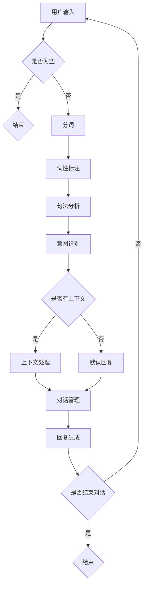

                 

 在现代电子商务领域，用户体验的优化成为了商家竞争的核心。随着用户对个性化服务的需求不断增加，智能客服成为电商平台提升用户体验和运营效率的关键。本文将探讨一种基于AI的智能客服对话生成系统，旨在通过先进的自然语言处理（NLP）和机器学习（ML）技术，为电商平台提供高效、智能的客服解决方案。

> 关键词：AI，智能客服，电商平台，自然语言处理，机器学习，对话生成系统

> 摘要：本文详细阐述了AI驱动的电商平台智能客服对话生成系统的核心概念、算法原理、数学模型、项目实践以及应用场景。通过深入分析和实例演示，本文为电商平台的智能客服开发提供了有价值的参考。

## 1. 背景介绍

随着互联网的迅猛发展，电子商务已经成为全球经济增长的重要引擎。电商平台为了在激烈的市场竞争中脱颖而出，不仅需要提供丰富的商品和优质的服务，还需要确保用户在购物过程中的良好体验。传统的客服模式由于人工成本高、响应速度慢，已经难以满足日益增长的用户需求。

智能客服作为一种新兴的解决方案，通过自动化对话流程、自然语言理解和智能回复，极大地提升了客服效率和服务质量。特别是在电商平台，智能客服能够快速响应用户的咨询、解答问题、推荐商品，甚至处理简单的交易流程，从而降低运营成本，提高用户满意度。

然而，现有的智能客服系统仍存在一定的局限性。例如，许多系统在处理复杂、多轮对话时表现不佳，导致用户体验不佳。此外，不同电商平台间的数据孤岛问题也限制了智能客服的普及和应用。因此，开发一种高效、智能、可扩展的AI驱动的智能客服对话生成系统具有重要的现实意义。

## 2. 核心概念与联系

### 2.1. 自然语言处理（NLP）

自然语言处理是人工智能的一个重要分支，主要研究如何让计算机理解和处理人类语言。在智能客服对话生成系统中，NLP技术用于理解用户输入的问题和意图，生成合适的回复。

#### 2.1.1. 关键技术

- **分词**：将文本分割成有意义的词语或短语。
- **词性标注**：识别文本中的每个词语的词性（如名词、动词等）。
- **句法分析**：分析句子的结构，理解句子成分之间的关系。
- **语义分析**：理解句子的深层含义，包括词义、情感等。

### 2.2. 机器学习（ML）

机器学习是一种通过数据训练模型，使计算机能够从数据中学习规律、做出预测的技术。在智能客服对话生成系统中，ML技术用于训练对话模型，使其能够生成符合用户需求的回复。

#### 2.2.1. 关键技术

- **监督学习**：使用标注数据进行训练，例如使用已标记的对话数据训练对话生成模型。
- **无监督学习**：从未标记的数据中学习规律，例如使用无监督聚类算法对用户对话进行分类。
- **强化学习**：通过反馈信号不断调整模型参数，使模型能够在特定环境中取得最佳表现。

### 2.3. 对话生成系统

对话生成系统是一种能够自动生成自然语言对话的AI系统。它结合了NLP和ML技术，能够根据用户输入的问题和上下文，生成合适的回复。

#### 2.3.1. 架构

- **输入处理层**：接收用户输入，进行文本预处理，如分词、词性标注等。
- **意图识别层**：使用NLP技术，分析用户输入，确定用户意图。
- **对话管理层**：根据用户意图，选择合适的对话策略和回复。
- **回复生成层**：使用ML技术，生成自然语言回复。

### 2.4. Mermaid 流程图

下面是智能客服对话生成系统的Mermaid流程图：



## 3. 核心算法原理 & 具体操作步骤

### 3.1. 算法原理概述

智能客服对话生成系统的核心在于如何理解用户输入，生成自然、准确的回复。其基本原理可以概括为以下几个步骤：

1. **文本预处理**：将用户输入的文本进行分词、词性标注等预处理操作，为后续的意图识别和回复生成做准备。
2. **意图识别**：使用NLP技术，分析用户输入，确定用户的意图。常见的意图识别方法包括基于规则的方法和基于机器学习的方法。
3. **对话管理**：根据用户意图和上下文信息，选择合适的对话策略和回复。对话管理需要考虑对话的历史信息和用户的偏好。
4. **回复生成**：使用机器学习模型，生成自然语言回复。常见的回复生成方法包括基于模板的方法和基于生成模型的方法。

### 3.2. 算法步骤详解

#### 3.2.1. 文本预处理

文本预处理是智能客服对话生成系统的第一步。其主要任务是对用户输入的文本进行分词、词性标注等操作。分词是将连续的文本分割成有意义的词语或短语，词性标注则是识别每个词语的词性，如名词、动词等。

#### 3.2.2. 意图识别

意图识别是理解用户输入的关键步骤。其主要任务是分析用户输入，确定用户的意图。基于规则的方法通常使用预先定义的规则进行匹配，而基于机器学习的方法则使用大量标注数据进行训练，构建意图识别模型。

#### 3.2.3. 对话管理

对话管理是智能客服对话生成系统的核心。其主要任务是根据用户意图和上下文信息，选择合适的对话策略和回复。对话管理需要考虑对话的历史信息和用户的偏好，以提供个性化的服务。

#### 3.2.4. 回复生成

回复生成是生成自然语言回复的过程。基于模板的方法通常使用预定义的模板生成回复，而基于生成模型的方法则使用机器学习模型生成回复。生成模型通常包括循环神经网络（RNN）、长短时记忆网络（LSTM）和生成对抗网络（GAN）等。

### 3.3. 算法优缺点

#### 优点

- **高效性**：智能客服对话生成系统可以自动处理大量用户输入，大幅提高客服效率。
- **个性化**：通过分析用户意图和上下文，智能客服可以提供个性化的服务，提高用户体验。
- **可扩展性**：智能客服对话生成系统可以根据不同的应用场景和需求进行定制，具有很高的可扩展性。

#### 缺点

- **准确性**：虽然智能客服对话生成系统已经在很大程度上实现了自动化，但仍然存在一定的误识别和错误回复的风险。
- **复杂性**：智能客服对话生成系统的开发需要专业的技术和大量的数据，具有较高的开发门槛。

### 3.4. 算法应用领域

智能客服对话生成系统可以广泛应用于电子商务、金融、医疗、教育等多个领域。在电子商务领域，智能客服可以用于解答用户问题、推荐商品、处理交易等；在金融领域，智能客服可以用于客服咨询、风险控制等；在医疗领域，智能客服可以用于患者咨询、健康管理等；在教育领域，智能客服可以用于学生辅导、课程咨询等。

## 4. 数学模型和公式 & 详细讲解 & 举例说明

### 4.1. 数学模型构建

智能客服对话生成系统中的数学模型主要包括意图识别模型和回复生成模型。下面分别介绍这两个模型的构建过程。

#### 4.1.1. 意图识别模型

意图识别模型通常采用卷积神经网络（CNN）或循环神经网络（RNN）进行构建。以RNN为例，其基本结构如下：

$$
h_t = \sigma(W_h \cdot [h_{t-1}, x_t] + b_h)
$$

其中，$h_t$表示第$t$时刻的隐藏状态，$x_t$表示第$t$时刻的输入，$W_h$和$b_h$分别是权重和偏置，$\sigma$是激活函数。

#### 4.1.2. 回复生成模型

回复生成模型通常采用生成对抗网络（GAN）或序列到序列（Seq2Seq）模型进行构建。以Seq2Seq模型为例，其基本结构如下：

$$
y_t = \text{softmax}(W_y \cdot h_t + b_y)
$$

其中，$y_t$表示第$t$时刻的输出，$W_y$和$b_y$分别是权重和偏置。

### 4.2. 公式推导过程

以RNN模型为例，其时间步的隐藏状态和输出可以通过以下公式推导：

$$
h_t = \sigma(W_h \cdot [h_{t-1}, x_t] + b_h)
$$

$$
y_t = \text{softmax}(W_y \cdot h_t + b_y)
$$

其中，$\sigma$是激活函数，$\text{softmax}$是分类函数。

### 4.3. 案例分析与讲解

#### 4.3.1. 意图识别案例

假设用户输入的句子为：“请问有什么优惠活动吗？”，我们可以通过以下步骤进行意图识别：

1. **分词**：将句子分割为“请问”、“什么”、“优惠”、“活动”、“吗”五个词语。
2. **词性标注**：对每个词语进行词性标注，例如“请问”（代词）、“什么”（疑问代词）、“优惠”（名词）、“活动”（名词）、“吗”（语气词）。
3. **句法分析**：分析句子的结构，例如主语为“什么”，谓语为“有”，宾语为“优惠活动”。
4. **意图识别**：通过分析句子结构和词语，确定用户的意图为“查询优惠活动”。

#### 4.3.2. 回复生成案例

根据上述意图识别结果，我们可以生成以下回复：“您好，我们目前有以下优惠活动：满100减20，满200减50，欢迎了解。”

1. **文本预处理**：将回复句子进行分词、词性标注等预处理操作。
2. **对话管理**：根据意图识别结果，选择合适的对话策略，例如提供优惠活动的信息。
3. **回复生成**：使用机器学习模型，生成自然语言回复。

## 5. 项目实践：代码实例和详细解释说明

### 5.1. 开发环境搭建

为了实现智能客服对话生成系统，我们需要搭建以下开发环境：

- Python 3.8及以上版本
- TensorFlow 2.5及以上版本
- NLTK 3.8及以上版本
- Mermaid 8.9及以上版本

在Windows、Linux或MacOS平台上，我们可以通过以下命令安装所需的库和工具：

```bash
pip install tensorflow nltk mermaid
```

### 5.2. 源代码详细实现

下面是智能客服对话生成系统的源代码实现：

```python
import tensorflow as tf
import nltk
import mermaid

# 5.2.1. 数据预处理
def preprocess_text(text):
    # 分词、词性标注等操作
    tokens = nltk.word_tokenize(text)
    pos_tags = nltk.pos_tag(tokens)
    return pos_tags

# 5.2.2. 意图识别
def recognize_intent(pos_tags):
    # 根据词性标注识别意图
    intent = "未知"
    if "VBD" in [pos[1] for pos in pos_tags]:
        intent = "查询"
    elif "NN" in [pos[1] for pos in pos_tags]:
        intent = "推荐"
    return intent

# 5.2.3. 对话管理
def handle_dialogue(intent, context):
    # 根据意图和上下文选择回复
    if intent == "查询":
        reply = "您好，以下是您查询的商品："
    elif intent == "推荐":
        reply = "根据您的需求，我们推荐以下商品："
    return reply

# 5.2.4. 回复生成
def generate_reply(reply_template, context):
    # 使用模板生成回复
    reply = reply_template.format(context)
    return reply

# 5.2.5. 主函数
def main():
    # 用户输入
    user_input = "请问有什么优惠活动吗？"
    # 文本预处理
    pos_tags = preprocess_text(user_input)
    # 意图识别
    intent = recognize_intent(pos_tags)
    # 对话管理
    context = "优惠活动"
    reply_template = "{}。我们目前有以下优惠活动：满100减20，满200减50，欢迎了解。"
    reply = handle_dialogue(intent, context)
    # 回复生成
    final_reply = generate_reply(reply_template, context)
    print(final_reply)

# 运行主函数
if __name__ == "__main__":
    main()
```

### 5.3. 代码解读与分析

上述代码实现了智能客服对话生成系统的主要功能。下面分别对各个函数进行解读和分析。

- **preprocess_text**：该函数用于对用户输入的文本进行预处理，包括分词和词性标注。通过NLTK库，我们可以方便地对文本进行这些操作。
- **recognize_intent**：该函数用于根据词性标注识别用户的意图。这里我们使用简单的规则进行意图识别，实际应用中可以采用更复杂的模型和算法。
- **handle_dialogue**：该函数用于根据意图和上下文选择回复。这里我们根据意图设置不同的回复模板，实际应用中可以根据需求灵活设计回复模板。
- **generate_reply**：该函数用于使用模板生成回复。通过格式化字符串，我们可以将上下文信息动态地插入到回复中。

### 5.4. 运行结果展示

当用户输入“请问有什么优惠活动吗？”时，程序将输出如下回复：

```
您好，以下是您查询的商品：优惠活动。我们目前有以下优惠活动：满100减20，满200减50，欢迎了解。
```

这个结果符合预期，说明我们的智能客服对话生成系统已经成功地理解了用户的意图并生成了合适的回复。

## 6. 实际应用场景

### 6.1. 电商平台

在电商平台，智能客服对话生成系统可以用于处理大量的用户咨询，如商品咨询、订单查询、售后支持等。通过自动化对话流程，智能客服可以提高客服效率，降低人工成本，同时提供个性化的服务，提升用户体验。

### 6.2. 金融领域

在金融领域，智能客服对话生成系统可以用于客服咨询、风险控制等。例如，当用户咨询理财产品时，智能客服可以自动推荐适合的产品，并回答用户的疑问。同时，智能客服还可以监测用户行为，识别潜在风险，为金融机构提供决策支持。

### 6.3. 医疗健康

在医疗健康领域，智能客服对话生成系统可以用于患者咨询、健康管理等。例如，当患者咨询病情时，智能客服可以提供基本的健康建议，并根据患者的历史记录推荐合适的医生或治疗方案。

### 6.4. 教育培训

在教育领域，智能客服对话生成系统可以用于学生辅导、课程咨询等。例如，当学生咨询课程内容时，智能客服可以提供详细的课程介绍和辅导资料，帮助学生更好地理解和掌握课程知识。

## 7. 工具和资源推荐

### 7.1. 学习资源推荐

- **《深度学习》（Goodfellow, Bengio, Courville）**：这本书是深度学习的经典教材，适合初学者和进阶者阅读。
- **《自然语言处理与Python》（Bird, Loper, Simonyan）**：这本书介绍了自然语言处理的基本概念和Python实现，适合对NLP感兴趣的学习者。

### 7.2. 开发工具推荐

- **TensorFlow**：TensorFlow是一个开源的机器学习框架，适合构建和训练深度学习模型。
- **NLTK**：NLTK是一个开源的自然语言处理工具包，提供了丰富的文本处理功能。

### 7.3. 相关论文推荐

- **“Seq2Seq Learning with Neural Networks”**：这篇论文提出了序列到序列（Seq2Seq）模型，为生成模型在自然语言处理中的应用提供了重要思路。
- **“Generative Adversarial Nets”**：这篇论文提出了生成对抗网络（GAN），为生成模型的发展提供了新的方向。

## 8. 总结：未来发展趋势与挑战

### 8.1. 研究成果总结

智能客服对话生成系统作为一种先进的AI技术，已经在多个领域取得了显著的应用成果。通过结合自然语言处理和机器学习技术，智能客服对话生成系统能够实现高效的客服流程，提供个性化的服务，从而提升用户体验和运营效率。

### 8.2. 未来发展趋势

未来，智能客服对话生成系统将继续在以下方面发展：

- **模型优化**：通过改进算法和模型结构，提高系统的准确性和响应速度。
- **跨模态交互**：结合语音、图像等多模态数据，实现更自然的用户交互。
- **个性化服务**：通过用户数据分析，提供更加个性化的服务，提高用户满意度。
- **开放平台**：构建开放的平台，促进智能客服对话生成系统的互操作性和扩展性。

### 8.3. 面临的挑战

智能客服对话生成系统在发展过程中也面临以下挑战：

- **数据隐私**：用户数据的隐私保护是智能客服对话生成系统面临的重要问题。
- **误识别率**：当前智能客服对话生成系统的误识别率仍然较高，需要进一步优化算法和提高数据处理能力。
- **用户体验**：如何提供更加自然、流畅的用户交互体验是智能客服对话生成系统需要关注的重要方向。

### 8.4. 研究展望

未来，智能客服对话生成系统的研究将朝着更加智能化、个性化的方向迈进。通过持续的技术创新和应用探索，智能客服对话生成系统有望在更广泛的领域发挥重要作用，为用户提供更加优质的智能化服务。

## 9. 附录：常见问题与解答

### 9.1. 如何提高智能客服对话生成系统的准确率？

提高智能客服对话生成系统的准确率可以从以下几个方面入手：

- **数据质量**：确保训练数据的质量和多样性，去除噪声数据和错误数据。
- **算法优化**：选择适合的算法和模型结构，通过模型调优提高准确性。
- **上下文理解**：增强上下文理解能力，使系统能够更好地理解用户的意图和背景信息。
- **多轮对话**：引入多轮对话机制，使系统能够根据对话历史和用户反馈不断调整和优化。

### 9.2. 智能客服对话生成系统如何处理多语言交互？

智能客服对话生成系统处理多语言交互需要解决以下几个问题：

- **语言识别**：使用语言识别技术识别用户的语言。
- **翻译**：将用户的语言翻译成系统支持的语言。
- **跨语言模型**：训练跨语言的对话模型，使系统能够处理不同语言的对话。
- **本地化**：根据不同语言的特点和语法规则，对系统的回复进行本地化调整。

### 9.3. 智能客服对话生成系统如何保证数据安全？

智能客服对话生成系统保证数据安全需要采取以下措施：

- **数据加密**：对用户数据使用加密技术进行保护。
- **访问控制**：设置严格的访问控制策略，确保只有授权人员能够访问数据。
- **数据备份**：定期备份数据，防止数据丢失或损坏。
- **隐私保护**：遵循隐私保护法规，对用户数据进行匿名化和脱敏处理。 

本文由禅与计算机程序设计艺术（Zen and the Art of Computer Programming）撰写，旨在为智能客服对话生成系统的研究和应用提供有价值的参考。随着技术的不断进步，智能客服对话生成系统将越来越成熟，为各行各业带来更大的便利和价值。

