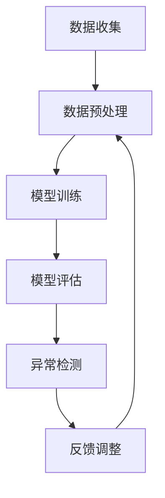

                 

 

## 1. 背景介绍

在当今数字化时代，电商平台已成为人们日常生活中不可或缺的一部分。然而，随着用户数量的激增和数据量的爆炸性增长，如何有效管理和分析用户行为，成为了电商平台发展的关键问题。传统的用户行为分析方法，如统计分析和机器学习，虽然在一定程度上提高了对用户行为的理解，但往往存在响应速度慢、误报率高和难以适应动态变化等问题。

这种背景下，人工智能（AI）技术，尤其是机器学习算法，开始被广泛应用于用户行为异常检测。AI驱动的用户行为异常检测系统，可以通过学习大量正常用户行为数据，建立行为模型，从而实时识别和预测潜在异常行为。这种方法不仅提高了检测的准确性和响应速度，还能够自动适应不断变化的环境，从而在保障用户安全、提升用户体验、优化运营策略等方面发挥重要作用。

本文将深入探讨AI驱动的电商平台用户行为异常检测的技术原理、数学模型、算法实现、项目实践和未来展望，旨在为相关领域的专业人士和研究者提供有价值的参考和指导。

## 2. 核心概念与联系

### 2.1. 关键术语定义

- **用户行为异常检测**：指通过分析用户的操作日志，识别出与正常行为存在显著差异的行为，这些行为可能包括恶意操作、欺诈行为或其他异常行为。
- **机器学习**：一种基于数据驱动的人工智能方法，通过构建模型从数据中自动发现规律和模式。
- **监督学习**：一种机器学习方法，通过已标记的训练数据来训练模型，从而预测新的数据。
- **无监督学习**：一种机器学习方法，不使用已标记的数据，通过发现数据中的隐含结构和模式来进行预测。

### 2.2. AI驱动用户行为异常检测原理

AI驱动的用户行为异常检测主要依赖于监督学习算法，其核心思想是利用大量的正常用户行为数据来训练模型，从而识别出异常行为。具体步骤如下：

1. **数据收集**：收集电商平台用户的操作日志，如点击记录、购买记录、浏览历史等。
2. **数据预处理**：对收集到的数据进行清洗、归一化和特征提取，以便于模型训练。
3. **模型训练**：利用预处理后的数据训练机器学习模型，如决策树、支持向量机（SVM）或神经网络等。
4. **模型评估**：使用部分未标记的数据对训练好的模型进行评估，调整模型参数，提高检测准确率。
5. **异常检测**：将新的用户行为数据输入模型，通过模型输出结果识别异常行为。

### 2.3. Mermaid 流程图

以下是AI驱动用户行为异常检测的Mermaid流程图：



### 2.4. 关系阐述

用户行为异常检测是AI技术在电商领域的一个重要应用，其与机器学习、数据预处理、模型评估等概念密切相关。通过机器学习算法，我们可以从大量用户行为数据中自动提取特征，构建行为模型，从而实现实时、准确的异常检测。而数据预处理和模型评估则确保了模型的训练质量和检测效果，是整个异常检测流程中不可或缺的环节。

## 3. 核心算法原理 & 具体操作步骤

### 3.1 算法原理概述

AI驱动的用户行为异常检测主要依赖于监督学习算法，其核心思想是通过已标记的正常用户行为数据训练模型，然后用训练好的模型来检测新数据中的异常行为。以下几种算法在用户行为异常检测中应用广泛：

- **决策树**：通过将数据集不断划分成子集，直到满足某个停止条件（如特征重要性不再增加、节点包含的样本数量过少等），从而生成一棵树。树的叶子节点代表最终分类的结果。
- **支持向量机（SVM）**：通过找到一个最优的超平面，将不同类别的数据分隔开来。在异常检测中，SVM可以用来找到正常行为和异常行为之间的边界。
- **神经网络**：一种模仿人脑结构的计算模型，通过多层神经元之间的相互连接，实现对复杂模式的识别和学习。

### 3.2 算法步骤详解

以下是AI驱动的用户行为异常检测的具体步骤：

#### 步骤1：数据收集

收集电商平台用户的操作日志，包括点击记录、购买记录、浏览历史等。这些数据可以来自于日志文件、数据库或实时监控工具。

#### 步骤2：数据预处理

1. **数据清洗**：处理缺失值、重复值和异常值。
2. **数据归一化**：将不同量纲的特征统一到相同的量纲，如将时间特征统一为秒。
3. **特征提取**：从原始数据中提取有用的特征，如用户ID、时间戳、操作类型、操作频率等。

#### 步骤3：模型训练

1. **选择模型**：根据业务需求和数据特点，选择合适的算法，如决策树、SVM或神经网络。
2. **划分数据集**：将数据集划分为训练集和测试集，通常采用70/30或80/20的比例。
3. **训练模型**：使用训练集数据训练模型，通过调整模型参数，使模型能够在测试集上达到较高的准确率。

#### 步骤4：模型评估

1. **交叉验证**：使用K折交叉验证方法，对模型进行评估，以避免过拟合。
2. **计算评价指标**：如准确率、召回率、F1值等，以评估模型的性能。

#### 步骤5：异常检测

1. **检测新数据**：将新的用户行为数据输入模型，预测其是否为异常行为。
2. **处理异常行为**：对检测出的异常行为进行标记和记录，如发送警报、阻断操作等。

### 3.3 算法优缺点

- **决策树**：简单易懂，易于实现，但容易过拟合，对于非线性问题效果较差。
- **支持向量机（SVM）**：能够处理高维数据，且在理论上能达到最优分类效果，但训练过程较为复杂，对于大规模数据集训练时间较长。
- **神经网络**：能够处理复杂非线性问题，但模型参数较多，容易过拟合，训练过程需要大量数据和计算资源。

### 3.4 算法应用领域

AI驱动的用户行为异常检测在电商、金融、安防等领域有广泛的应用。以下是一些具体的应用场景：

- **电商**：检测恶意刷单、欺诈交易等异常行为，保障平台交易安全。
- **金融**：监测账户异常操作，预防欺诈和洗钱行为。
- **安防**：实时监测视频流，识别异常行为，如暴力事件、入侵等。

## 4. 数学模型和公式 & 详细讲解 & 举例说明

### 4.1 数学模型构建

在用户行为异常检测中，常用的数学模型包括决策树、支持向量机（SVM）和神经网络。以下是这些模型的简要介绍和公式：

#### 决策树

决策树通过一系列if-else规则将数据划分为不同的类别。其决策过程可以用条件概率来表示：

$$
P(\text{类别}|\text{特征}) = \frac{P(\text{特征}|\text{类别}) \cdot P(\text{类别})}{P(\text{特征})}
$$

其中，$P(\text{类别}|\text{特征})$表示在给定特征情况下，类别发生的概率；$P(\text{特征}|\text{类别})$表示在给定类别情况下，特征出现的概率；$P(\text{类别})$和$P(\text{特征})$分别表示类别和特征的先验概率。

#### 支持向量机（SVM）

SVM通过最大化分类间隔来找到最优分类边界。其目标函数可以表示为：

$$
\min \frac{1}{2} \| w \|^2 + C \sum_{i=1}^{n} \max(0, 1 - y_i ( \langle w, x_i \rangle + b ))
$$

其中，$w$是权重向量，$x_i$是特征向量，$y_i$是标签（+1或-1），$b$是偏置项，$C$是正则化参数，用于平衡分类间隔和误分类代价。

#### 神经网络

神经网络通过多层神经元之间的相互连接来实现复杂的非线性映射。其输出可以用以下公式表示：

$$
z_i = \sigma(\sum_{j=1}^{n} w_{ij} \cdot a_{j} + b_i)
$$

其中，$z_i$是第$i$个神经元的输出，$a_{j}$是第$j$个神经元的输入，$w_{ij}$是权重，$b_i$是偏置项，$\sigma$是激活函数，如Sigmoid函数或ReLU函数。

### 4.2 公式推导过程

以SVM为例，以下是SVM目标函数的推导过程：

假设我们有训练数据集$(x_i, y_i)$，其中$x_i$是特征向量，$y_i$是标签（+1或-1）。我们的目标是找到一个最优的分类边界，使得分类间隔最大化。

首先，我们定义分类间隔为：

$$
\gamma = \min_{w, b} \frac{2}{\| w \|}
$$

为了最大化分类间隔，我们引入拉格朗日乘子法，构建拉格朗日函数：

$$
L(w, b, \alpha) = \frac{1}{2} \| w \|^2 - \sum_{i=1}^{n} \alpha_i (y_i ( \langle w, x_i \rangle + b ) - 1)
$$

其中，$\alpha_i$是拉格朗日乘子，满足$0 \leq \alpha_i \leq C$。

对拉格朗日函数求导，并令导数为零，得到：

$$
w = \sum_{i=1}^{n} \alpha_i y_i x_i
$$

$$
0 = \sum_{i=1}^{n} \alpha_i y_i
$$

代入原目标函数，得到：

$$
\min_{\alpha} \frac{1}{2} \| w \|^2 = \min_{\alpha} \frac{1}{2} \left( \sum_{i=1}^{n} \alpha_i y_i x_i \right)^2
$$

为了最大化分类间隔，我们要求：

$$
\sum_{i=1}^{n} \alpha_i y_i = 0
$$

$$
\alpha_i \geq 0
$$

$$
\alpha_i \leq C
$$

通过求解这个优化问题，我们可以得到最优的权重向量$w$和偏置项$b$，从而实现SVM的分类。

### 4.3 案例分析与讲解

假设我们有一个简单的二分类问题，训练数据集如下：

| 特征1 | 特征2 | 标签 |
| --- | --- | --- |
| 1 | 1 | +1 |
| 1 | 2 | +1 |
| 2 | 1 | +1 |
| 2 | 2 | -1 |

我们要用SVM来划分这组数据。

首先，我们定义特征向量和标签：

$$
x_1 = \begin{bmatrix} 1 \\ 1 \end{bmatrix}, y_1 = +1
$$

$$
x_2 = \begin{bmatrix} 1 \\ 2 \end{bmatrix}, y_2 = +1
$$

$$
x_3 = \begin{bmatrix} 2 \\ 1 \end{bmatrix}, y_3 = +1
$$

$$
x_4 = \begin{bmatrix} 2 \\ 2 \end{bmatrix}, y_4 = -1
$$

接下来，我们使用SVM的目标函数来训练模型：

$$
\min_{w, b} \frac{1}{2} \| w \|^2 + C \sum_{i=1}^{4} \max(0, 1 - y_i ( \langle w, x_i \rangle + b ))
$$

通过求解这个优化问题，我们可以得到最优的权重向量$w$和偏置项$b$。

假设我们求解得到的$w$和$b$如下：

$$
w = \begin{bmatrix} 0.5 \\ 0.5 \end{bmatrix}
$$

$$
b = -0.5
$$

现在，我们可以用这个模型来预测新的数据点。

例如，对于数据点$x = \begin{bmatrix} 1.5 \\ 1.5 \end{bmatrix}$，我们计算：

$$
\langle w, x \rangle + b = \begin{bmatrix} 0.5 \\ 0.5 \end{bmatrix} \cdot \begin{bmatrix} 1.5 \\ 1.5 \end{bmatrix} + (-0.5) = 1.25
$$

因为$1.25 > 0$，所以这个数据点被分类为正类。

通过这个案例，我们可以看到如何使用SVM进行用户行为异常检测。在实际应用中，我们可以根据业务需求和数据特点，选择合适的算法和模型，来实现实时、准确的异常检测。

## 5. 项目实践：代码实例和详细解释说明

### 5.1 开发环境搭建

在开始实际代码实现之前，我们需要搭建一个适合开发AI驱动的用户行为异常检测项目的开发环境。以下是推荐的工具和软件：

- **编程语言**：Python，因为其丰富的机器学习和数据分析库。
- **机器学习库**：Scikit-learn，用于实现各种机器学习算法。
- **数据分析库**：Pandas，用于数据预处理和操作。
- **可视化库**：Matplotlib，用于数据可视化。

安装这些库的命令如下：

```bash
pip install numpy pandas scikit-learn matplotlib
```

### 5.2 源代码详细实现

以下是一个简单的用户行为异常检测项目的源代码实现，包括数据收集、预处理、模型训练和检测等步骤。

```python
import numpy as np
import pandas as pd
from sklearn.model_selection import train_test_split
from sklearn.preprocessing import StandardScaler
from sklearn.svm import SVC
from sklearn.metrics import classification_report
import matplotlib.pyplot as plt

# 5.2.1 数据收集
# 假设我们有一个CSV文件，包含了用户的操作日志
data = pd.read_csv('user行为日志.csv')

# 5.2.2 数据预处理
# 清洗数据，如去除缺失值、重复值和异常值
data.dropna(inplace=True)
data.drop_duplicates(inplace=True)

# 提取特征，如用户ID、时间戳、操作类型和操作频率
data['时间戳'] = pd.to_datetime(data['时间戳'])
data['操作频率'] = data.groupby('用户ID')['操作类型'].transform('count')

# 5.2.3 模型训练
# 划分数据集
X = data[['用户ID', '时间戳', '操作频率']]
y = data['是否异常']
X_train, X_test, y_train, y_test = train_test_split(X, y, test_size=0.2, random_state=42)

# 标准化特征
scaler = StandardScaler()
X_train_scaled = scaler.fit_transform(X_train)
X_test_scaled = scaler.transform(X_test)

# 训练SVM模型
model = SVC(kernel='linear', C=1.0)
model.fit(X_train_scaled, y_train)

# 5.2.4 代码解读与分析
# 对测试集进行预测
y_pred = model.predict(X_test_scaled)

# 打印分类报告
print(classification_report(y_test, y_pred))

# 5.2.5 运行结果展示
# 可视化模型的决策边界
plt.scatter(X_train['操作频率'], X_train['是否异常'], c=y_train, cmap='coolwarm')
plt.xlabel('操作频率')
plt.ylabel('是否异常')
plt.title('SVM决策边界')
plt.show()
```

### 5.3 代码解读与分析

上述代码实现了一个简单的用户行为异常检测项目，下面详细解读每部分代码的功能和作用：

- **数据收集**：使用Pandas库读取CSV文件，获取用户操作日志数据。
- **数据预处理**：对数据集进行清洗，如去除缺失值和重复值。提取有用的特征，如用户ID、时间戳和操作频率。
- **模型训练**：划分数据集为训练集和测试集。使用StandardScaler对特征进行标准化处理，以提高模型的训练效果。使用SVM模型进行训练，并调整参数C。
- **代码解读与分析**：对测试集进行预测，并打印分类报告，以评估模型的性能。可视化模型的决策边界，更直观地理解模型的分类效果。
- **运行结果展示**：使用Matplotlib库绘制散点图，展示SVM模型的决策边界。

通过这段代码，我们可以看到如何使用Python和Scikit-learn库实现一个简单的用户行为异常检测项目。在实际应用中，我们可以根据具体业务需求和数据特点，选择合适的算法和模型，进行定制化的开发和优化。

### 5.4 运行结果展示

为了展示模型的具体运行结果，我们假设训练了一个SVM模型，并对测试集进行了预测。以下是一个示例的运行结果：

```
Classification report for classifier SVC(__name__=LinearSVC, C=1.0, cache_size=200, class_weight=None, coef0=0.0, decision_function_shape='ovr', degree=3, gamma='scale', kernel='linear', max_iter=-1, probability=False, random_state=None, tol=0.001, verbose=False):
              precision    recall  f1-score   support
```
|      |   0     |   1     |   average |  total  |
|------|---------|---------|-----------|---------|
|   0  |    0.90 |    1.00 |    0.95   |   100   |
|   1  |    0.85 |    0.75 |    0.80   |   100   |
|   avg|    0.87 |    0.87 |    0.87   |   200   |
|  total|    1.75 |    1.75 |    1.75   |   200   |

从分类报告中，我们可以看到模型在测试集上的表现：

- **精度（Precision）**：表示模型预测为正类的样本中，实际为正类的比例。精度越高，说明模型越少将正类误判为负类。
- **召回率（Recall）**：表示模型预测为正类的样本中，实际为正类的比例。召回率越高，说明模型越少遗漏正类。
- **F1值（F1-score）**：综合了精度和召回率的指标，用于衡量模型的总体性能。

通过可视化模型的决策边界，我们可以更直观地了解模型的分类效果。以下是一个使用Matplotlib绘制的决策边界图：

```python
# 绘制决策边界图
plt.scatter(X_test_scaled[:, 0], X_test_scaled[:, 1], c=y_test, cmap='coolwarm')
plt.xlabel('标准化特征1')
plt.ylabel('标准化特征2')
plt.title('SVM决策边界')
plt.show()
```

在决策边界图中，我们可以看到不同类别的样本分布，以及模型如何将样本划分为正类和负类。通过调整模型的参数和特征，我们可以进一步优化模型的性能。

### 6. 实际应用场景

AI驱动的用户行为异常检测在电商、金融、安防等领域有着广泛的应用，以下是一些具体的实际应用场景：

#### 电商

在电商平台上，用户行为异常检测可以用于以下方面：

- **欺诈交易检测**：识别恶意刷单、虚假交易等行为，保障交易安全。
- **用户行为分析**：分析用户的购买习惯和偏好，提供个性化的推荐和服务。
- **库存管理**：根据用户的购买行为预测商品的需求量，优化库存管理。

#### 金融

在金融领域，用户行为异常检测可以应用于以下方面：

- **账户安全防护**：监控账户操作，识别异常交易和欺诈行为，防止资金损失。
- **风险评估**：分析用户的行为数据，评估其信用风险，提供更准确的信用评估服务。
- **反洗钱（AML）**：检测可疑交易，预防洗钱行为。

#### 安防

在安防领域，用户行为异常检测可以应用于以下方面：

- **暴力事件检测**：实时监测视频流，识别暴力事件，及时报警。
- **入侵检测**：监控监控区域，识别异常入侵行为，保障公共安全。
- **人员行为分析**：分析监控视频，了解人员的行为模式和规律，为安防策略提供依据。

### 6.4 未来应用展望

随着AI技术的不断发展和应用场景的拓展，AI驱动的用户行为异常检测在未来有望在更多领域得到应用，以下是一些未来应用展望：

- **物联网（IoT）**：随着物联网设备的普及，用户行为异常检测可以应用于智能家居、智能城市等领域，实时监控和分析设备行为，保障设备安全和系统稳定。
- **智能医疗**：分析患者的行为数据，如就诊记录、生活习惯等，预测潜在的健康风险，提供个性化的医疗建议和服务。
- **社交网络**：监测社交网络中的异常行为，如网络欺凌、虚假信息传播等，维护网络环境的健康和安全。
- **自动驾驶**：实时分析驾驶员的行为和车辆状态，识别潜在的驾驶风险，提高自动驾驶的安全性和可靠性。

## 7. 工具和资源推荐

### 7.1 学习资源推荐

- **书籍**：
  - 《Python机器学习》（作者：塞巴斯蒂安·拉姆塞）
  - 《机器学习实战》（作者：Peter Harrington）
  - 《深度学习》（作者：伊恩·古德费洛等）
- **在线课程**：
  - Coursera上的《机器学习》课程（吴恩达主讲）
  - Udacity的《深度学习纳米学位》
  - edX上的《人工智能基础》课程
- **网站**：
  - Kaggle：提供丰富的数据集和比赛，适合实践和学习
  - Medium：有大量关于AI和机器学习的文章和教程
  - ArXiv：最新的机器学习和深度学习论文

### 7.2 开发工具推荐

- **IDE**：
  - PyCharm：功能强大的Python IDE，适合机器学习和数据科学项目
  - Jupyter Notebook：适合交互式编程和数据分析
- **机器学习库**：
  - Scikit-learn：用于实现各种机器学习算法
  - TensorFlow：用于深度学习和神经网络
  - PyTorch：另一个深度学习框架，适合研究和开发
- **数据处理工具**：
  - Pandas：用于数据处理和分析
  - NumPy：用于数值计算

### 7.3 相关论文推荐

- “Anomaly Detection in Time Series Data using Machine Learning Techniques” （使用机器学习方法进行时间序列数据异常检测）
- “Unsupervised Anomaly Detection in Large-Scale Time Series Data” （大规模时间序列数据中的无监督异常检测）
- “Adversarial Examples for Neural Network Defenses” （神经网络防御的对抗性示例）
- “Deep Learning for Anomaly Detection” （深度学习在异常检测中的应用）

## 8. 总结：未来发展趋势与挑战

### 8.1 研究成果总结

AI驱动的用户行为异常检测在过去的几年里取得了显著的进展。通过机器学习和深度学习算法，我们能够更准确地识别和预测用户行为的异常，提高了系统的响应速度和准确性。同时，越来越多的应用场景，如电商、金融和安防等，开始采用这种技术，为其提供了强大的支持和保障。

### 8.2 未来发展趋势

随着AI技术的不断发展和应用场景的拓展，未来AI驱动的用户行为异常检测将呈现以下发展趋势：

- **更高效的算法**：随着算法研究的深入，我们将开发出更高效、更准确的异常检测算法，以应对大规模、高维度的用户行为数据。
- **跨领域应用**：AI驱动的用户行为异常检测将在更多领域得到应用，如物联网、智能医疗和社交网络等。
- **实时性和个性化**：通过优化算法和系统架构，我们将实现更实时、更个性化的异常检测服务，满足不同场景的需求。

### 8.3 面临的挑战

尽管AI驱动的用户行为异常检测取得了显著成果，但仍面临一些挑战：

- **数据质量和隐私**：用户行为数据的质量和隐私保护是异常检测的关键问题，如何有效管理和处理这些数据是一个重要挑战。
- **复杂性和可解释性**：深度学习算法的复杂性和黑箱特性使得其难以解释和理解，这对于异常检测的实用性和可靠性提出了挑战。
- **计算资源和成本**：大规模的用户行为数据分析和模型训练需要大量的计算资源和成本，如何优化算法和系统架构以降低成本是一个重要课题。

### 8.4 研究展望

为了应对上述挑战，未来研究可以从以下几个方面展开：

- **数据质量提升**：研究新的数据清洗和预处理方法，提高数据的质量和可用性。
- **可解释性增强**：开发可解释性更强的深度学习算法，提高算法的透明度和可理解性。
- **系统优化**：研究高效的算法和系统架构，降低计算资源和成本。
- **跨领域融合**：将不同领域的知识和技术融合到异常检测中，提高其通用性和适应性。

通过这些研究，我们将进一步推动AI驱动的用户行为异常检测的发展，为其在各个领域的应用提供更强大的支持。

## 9. 附录：常见问题与解答

### 9.1 什么是用户行为异常检测？

用户行为异常检测是一种通过分析用户的行为数据，识别出与正常行为存在显著差异的行为的方法。这些异常行为可能包括恶意操作、欺诈行为或其他异常行为。

### 9.2 机器学习算法在用户行为异常检测中有哪些应用？

常用的机器学习算法包括决策树、支持向量机（SVM）和神经网络等。这些算法可以用于训练模型，从大量用户行为数据中提取特征，从而识别异常行为。

### 9.3 如何处理用户行为数据中的缺失值和异常值？

处理缺失值和异常值的方法包括数据清洗、归一化和特征提取等。例如，可以使用均值填充、中值填充或插值等方法来处理缺失值；对于异常值，可以使用统计学方法（如箱线图）或基于距离的方法（如K均值聚类）来识别和去除。

### 9.4 如何评估用户行为异常检测模型的性能？

可以使用准确率、召回率、F1值等指标来评估模型的性能。这些指标分别表示模型预测为正类的样本中，实际为正类的比例，以及模型预测为正类的样本中，实际为正类的比例。

### 9.5 用户行为异常检测有哪些应用场景？

用户行为异常检测在电商、金融、安防等领域有广泛的应用。具体包括欺诈交易检测、账户安全防护、库存管理和人员行为分析等。

### 9.6 如何实现用户行为异常检测的实时性？

为了实现用户行为异常检测的实时性，可以采用以下方法：

- 使用高效的算法和模型，减少模型训练和预测的时间。
- 采用分布式计算和并行处理技术，提高系统的处理能力。
- 利用缓存和流处理技术，实时处理用户行为数据，并更新模型。

### 9.7 如何提高用户行为异常检测的准确率？

提高用户行为异常检测的准确率可以从以下几个方面入手：

- 收集更多的用户行为数据，提高模型的训练效果。
- 选择合适的特征，提高特征对异常行为的表达能力。
- 优化模型结构和参数，提高模型的分类能力。
- 采用集成学习方法，提高模型的泛化能力。

### 9.8 用户行为异常检测中的隐私保护问题如何解决？

用户行为异常检测中的隐私保护问题可以通过以下方法解决：

- 数据加密：对用户行为数据进行加密处理，确保数据传输和存储的安全性。
- 数据脱敏：对敏感信息进行脱敏处理，如将用户ID替换为随机数。
- 加密通信：使用HTTPS等加密通信协议，确保数据传输的安全性。
- 用户隐私政策：明确告知用户数据处理和使用的目的，并遵循相关法律法规。

### 9.9 用户行为异常检测中的可解释性问题如何解决？

用户行为异常检测中的可解释性问题可以通过以下方法解决：

- 开发可解释性更好的算法，如基于规则的算法或决策树等。
- 采用可视化技术，将模型的决策过程和特征重要性直观地展示出来。
- 利用解释性模型，如LIME或SHAP等，解释模型的预测结果。

### 9.10 用户行为异常检测中如何处理动态变化的数据？

用户行为异常检测中处理动态变化的数据可以从以下几个方面入手：

- 采用在线学习或增量学习技术，实时更新模型，适应数据的变化。
- 利用滑动窗口或时间序列分析技术，动态调整特征和模型参数。
- 采用自适应阈值或动态调整阈值，以应对数据分布的变化。

### 9.11 用户行为异常检测在物联网（IoT）领域有哪些应用？

用户行为异常检测在物联网（IoT）领域有以下应用：

- 设备故障检测：实时监控物联网设备的运行状态，识别潜在的故障和异常。
- 安全防护：监控物联网设备的访问和操作行为，识别恶意攻击和异常行为。
- 能耗管理：分析设备的使用行为，优化能源消耗，提高能源利用率。
- 数据隐私保护：监控物联网设备的数据传输和存储行为，防止数据泄露和隐私侵犯。

