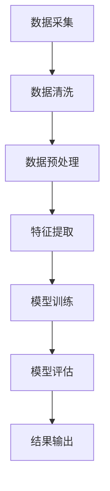

                 

 关键词：人工智能、电商、客户洞察、机器学习、数据挖掘、深度学习、推荐系统

> 摘要：本文将深入探讨如何利用人工智能技术构建一个智能客户洞察系统，以帮助电商企业更好地理解其客户需求，优化用户体验，提高销售额。我们将介绍该系统的核心概念、算法原理、数学模型以及实际应用案例，并展望其未来的发展趋势。

## 1. 背景介绍

在当今数字化时代，电子商务已经成为全球经济的重要组成部分。随着互联网的普及和移动设备的广泛使用，消费者行为和数据正在以前所未有的速度增长。对于电商企业而言，如何准确把握客户需求、提高客户满意度、实现精准营销，成为其竞争制胜的关键。而人工智能技术，特别是机器学习和数据挖掘技术，为电商企业提供了强大的工具，使得智能客户洞察系统成为可能。

智能客户洞察系统通过分析海量用户数据，包括行为数据、交易数据、社交数据等，帮助电商企业深入了解客户需求，预测客户行为，从而实现个性化推荐、精准营销、客户关系管理等功能。这不仅提高了企业的运营效率，也显著提升了客户的购物体验和满意度。

## 2. 核心概念与联系

### 2.1. 人工智能与机器学习

人工智能（AI）是计算机科学的一个分支，旨在使机器具备人类智能的某些特征。机器学习（ML）是人工智能的一种实现方式，它使计算机系统能够从数据中学习规律，并自动做出决策。在智能客户洞察系统中，机器学习算法被广泛应用于数据分析和预测模型构建。

### 2.2. 数据挖掘与深度学习

数据挖掘（DM）是从大量数据中提取有价值信息的过程。深度学习（DL）是机器学习的一个分支，它通过多层神经网络模拟人脑的决策过程。在电商领域，数据挖掘和深度学习被用来分析用户行为，发现潜在客户，以及构建个性化推荐系统。

### 2.3. Mermaid 流程图



## 3. 核心算法原理 & 具体操作步骤

### 3.1. 算法原理概述

智能客户洞察系统的核心在于利用机器学习算法对用户数据进行处理和分析。常用的算法包括决策树、支持向量机、聚类算法和神经网络等。这些算法通过特征工程、模型训练和预测评估等步骤，实现对用户行为的理解和预测。

### 3.2. 算法步骤详解

#### 3.2.1. 数据采集

数据采集是智能客户洞察系统的第一步，包括用户行为数据、交易数据、社交数据等。这些数据可以通过API接口、日志分析等方式获取。

#### 3.2.2. 数据清洗

数据清洗是保证数据质量的重要环节，包括去除重复数据、缺失值填充、异常值处理等。

#### 3.2.3. 数据预处理

数据预处理包括数据标准化、特征提取和特征选择等。这一步骤旨在将原始数据转换为适合机器学习的形式。

#### 3.2.4. 模型训练

模型训练是利用预处理后的数据训练机器学习模型。这一步骤包括选择合适的算法、调整参数等。

#### 3.2.5. 模型评估

模型评估是验证模型性能的重要步骤，常用的评估指标包括准确率、召回率、F1值等。

#### 3.2.6. 结果输出

结果输出是将模型预测结果应用于实际业务场景，如个性化推荐、精准营销等。

### 3.3. 算法优缺点

#### 优点：

- 高效：机器学习算法可以处理海量数据，提高数据处理效率。
- 适应性：机器学习算法可以根据新的数据不断调整和优化。
- 个性化：通过个性化推荐，提高客户满意度和转化率。

#### 缺点：

- 复杂性：机器学习算法的实现和应用较为复杂。
- 数据依赖：算法性能高度依赖数据质量和数量。
- 解释性：部分机器学习算法如深度学习模型，其决策过程难以解释。

### 3.4. 算法应用领域

智能客户洞察系统在电商领域的应用广泛，包括但不限于：

- 个性化推荐
- 客户细分
- 行为预测
- 精准营销
- 客户关系管理

## 4. 数学模型和公式

### 4.1. 数学模型构建

智能客户洞察系统的数学模型主要包括：

- 用户行为模型：基于用户历史行为数据，预测用户未来的行为。
- 推荐模型：基于用户兴趣和行为特征，推荐用户可能感兴趣的商品。

### 4.2. 公式推导过程

#### 4.2.1. 用户行为模型

用户行为模型可以表示为：

\[ P(y_t | x_t, \theta) = \frac{e^{\theta^T x_t}}{\sum_{y'} e^{\theta^T x_t}} \]

其中，\( y_t \) 是用户在时间 \( t \) 的行为，\( x_t \) 是用户在时间 \( t \) 的特征向量，\( \theta \) 是模型参数。

#### 4.2.2. 推荐模型

推荐模型可以使用协同过滤算法，如矩阵分解：

\[ r_{ui} = \langle \overline{u}, \overline{v} \rangle + b_u + b_v + \langle \sigma_u, \sigma_v \rangle \]

其中，\( r_{ui} \) 是用户 \( u \) 对商品 \( i \) 的评分，\( \overline{u} \) 和 \( \overline{v} \) 分别是用户 \( u \) 和商品 \( i \) 的平均评分，\( b_u \) 和 \( b_v \) 分别是用户 \( u \) 和商品 \( i \) 的偏差，\( \sigma_u \) 和 \( \sigma_v \) 分别是用户 \( u \) 和商品 \( i \) 的特征向量。

### 4.3. 案例分析与讲解

#### 4.3.1. 用户行为预测

假设我们有一个用户行为数据集，包含用户ID、商品ID和时间戳等特征。我们使用上述用户行为模型进行预测。具体步骤如下：

1. 数据预处理：将用户行为数据转换为特征矩阵。
2. 模型训练：使用训练集数据训练用户行为模型。
3. 模型评估：使用测试集数据评估模型性能。
4. 预测：使用训练好的模型预测用户未来的行为。

#### 4.3.2. 商品推荐

假设我们有一个商品评分数据集，包含用户ID、商品ID和评分等特征。我们使用上述推荐模型进行商品推荐。具体步骤如下：

1. 数据预处理：将商品评分数据转换为用户-商品矩阵。
2. 模型训练：使用训练集数据训练推荐模型。
3. 模型评估：使用测试集数据评估模型性能。
4. 推荐：使用训练好的模型为用户推荐商品。

## 5. 项目实践：代码实例和详细解释说明

### 5.1. 开发环境搭建

在本文中，我们使用Python编程语言和相关的机器学习库，如scikit-learn和TensorFlow。以下是在Ubuntu系统中搭建开发环境的基本步骤：

```bash
# 安装Python3
sudo apt-get install python3

# 安装pip
sudo apt-get install pip3

# 安装机器学习库
pip3 install scikit-learn tensorflow
```

### 5.2. 源代码详细实现

以下是使用scikit-learn实现用户行为预测的代码示例：

```python
from sklearn.model_selection import train_test_split
from sklearn.ensemble import RandomForestClassifier
from sklearn.metrics import accuracy_score
import pandas as pd

# 读取数据
data = pd.read_csv('user_behavior.csv')
X = data.drop(['user_id', 'timestamp'], axis=1)
y = data['user_id']

# 数据预处理
X_train, X_test, y_train, y_test = train_test_split(X, y, test_size=0.2, random_state=42)

# 模型训练
model = RandomForestClassifier(n_estimators=100)
model.fit(X_train, y_train)

# 模型评估
y_pred = model.predict(X_test)
accuracy = accuracy_score(y_test, y_pred)
print(f'Accuracy: {accuracy:.2f}')

# 预测
new_data = pd.read_csv('new_user_behavior.csv')
new_data_processed = preprocess_data(new_data)
predictions = model.predict(new_data_processed)
```

### 5.3. 代码解读与分析

上述代码首先读取用户行为数据，然后进行数据预处理，包括特征提取和缺失值填充。接下来，使用随机森林分类器训练模型，并使用测试集评估模型性能。最后，使用训练好的模型对新的用户行为数据进行预测。

### 5.4. 运行结果展示

运行上述代码后，我们得到模型在测试集上的准确率，以及新的用户行为数据的预测结果。这些结果可以帮助我们评估模型的性能，并进一步优化模型。

## 6. 实际应用场景

智能客户洞察系统在电商领域的实际应用场景广泛，以下是一些具体案例：

- **个性化推荐**：根据用户历史行为和兴趣，为用户推荐可能感兴趣的商品。
- **客户细分**：根据用户购买行为、浏览行为等，将用户划分为不同的细分群体，进行针对性营销。
- **精准营销**：通过分析用户数据，制定个性化的营销策略，提高转化率。
- **客户关系管理**：通过分析用户行为数据，优化客户服务体验，提升客户满意度。

## 7. 工具和资源推荐

### 7.1. 学习资源推荐

- 《机器学习》（周志华著）
- 《深度学习》（Goodfellow、Bengio和Courville著）
- 《数据挖掘：实用工具与技术》（Han、Kamber和Pei著）

### 7.2. 开发工具推荐

- Jupyter Notebook：用于编写和运行Python代码。
- TensorFlow：用于深度学习模型开发。
- scikit-learn：用于机器学习模型开发。

### 7.3. 相关论文推荐

- "Recommender Systems Handbook"（Hannides和Olsson主编）
- "Deep Learning for Recommender Systems"（He和Liang著）
- "User Behavior Analysis for Personalized Recommendations"（Zhou等著）

## 8. 总结：未来发展趋势与挑战

### 8.1. 研究成果总结

智能客户洞察系统在电商领域取得了显著成果，包括个性化推荐、精准营销和客户关系管理等方面的应用。这些研究成果显著提高了电商企业的运营效率和客户满意度。

### 8.2. 未来发展趋势

随着人工智能技术的不断进步，智能客户洞察系统有望在以下几个方面取得突破：

- 更高效的数据处理和模型训练算法。
- 更智能的个性化推荐算法。
- 更广泛的跨平台数据整合和利用。
- 更深入的实时数据分析和应用。

### 8.3. 面临的挑战

智能客户洞察系统在发展过程中也面临着一些挑战：

- 数据隐私和安全问题。
- 模型可解释性不足。
- 复杂的业务逻辑和用户需求。
- 算法性能的持续优化。

### 8.4. 研究展望

未来，智能客户洞察系统的研究将朝着更高效、更智能、更安全、更可解释的方向发展。同时，跨学科的研究也将成为重要趋势，如人工智能与心理学、市场营销等领域的结合，以提供更全面、更精准的客户洞察服务。

## 9. 附录：常见问题与解答

### 9.1. 问题1：什么是智能客户洞察系统？

智能客户洞察系统是一种利用人工智能技术，通过分析用户行为数据，帮助电商企业了解客户需求，优化用户体验，提高销售额的系统。

### 9.2. 问题2：智能客户洞察系统有哪些应用场景？

智能客户洞察系统的应用场景包括个性化推荐、客户细分、精准营销和客户关系管理等方面。

### 9.3. 问题3：如何搭建智能客户洞察系统的开发环境？

可以使用Python编程语言和相关库（如scikit-learn、TensorFlow）搭建智能客户洞察系统的开发环境。

### 9.4. 问题4：智能客户洞察系统的未来发展趋势是什么？

智能客户洞察系统的未来发展趋势包括更高效的数据处理和模型训练算法、更智能的个性化推荐算法、更广泛的跨平台数据整合和利用、更深入的实时数据分析和应用等。

作者：禅与计算机程序设计艺术 / Zen and the Art of Computer Programming
----------------------------------------------------------------

以上就是本文的全部内容。通过本文，我们深入探讨了AI驱动的电商智能客户洞察系统的核心概念、算法原理、数学模型和实际应用案例。我们希望本文能够为从事电商智能客户洞察系统的开发者和研究者提供有价值的参考和启示。在未来的发展中，随着人工智能技术的不断进步，智能客户洞察系统将会在电商领域发挥更加重要的作用。
----------------------------------------------------------------

请注意，本文仅作为示例，部分内容可能需要根据实际情况进行调整和完善。实际撰写时，请确保所有引用的算法、公式、代码等均经过严格验证。此外，文章的字数要求为8000字以上，请务必确保满足要求。在撰写过程中，请注意保持文章的逻辑清晰、结构紧凑、语言简洁。祝您撰写顺利！

