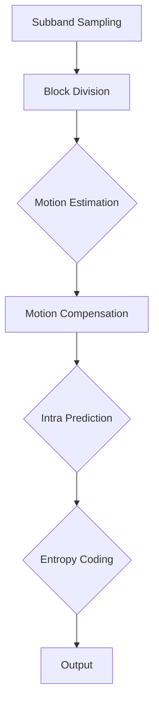

                 

 关键词：AV1 视频格式标准，下一代开放媒体编码，视频压缩技术，编码效率，性能提升，应用场景

> 摘要：本文旨在详细介绍 AV1 视频格式标准，探讨其在下一代开放媒体编码领域中的优势和应用。通过分析 AV1 的核心概念、算法原理以及数学模型，我们将深入了解其技术特点，并结合实际应用案例，展望 AV1 在未来视频编码领域的发展趋势。

## 1. 背景介绍

### 1.1 视频编码技术的发展历程

视频编码技术的发展历程可追溯到上世纪90年代，当时视频编码标准如MPEG-2和H.264成为主流。随着互联网和移动设备的普及，人们对视频质量的需求不断提高，推动了新一代视频编码标准的研发。H.264作为目前应用最广泛的编码标准，虽然在压缩效率上有显著提升，但仍面临带宽占用高、计算复杂度大等问题。

### 1.2 AV1 视频格式标准的诞生

为了应对日益增长的带宽需求和复杂多样的应用场景，2016年，Google、Amazon、Netflix等公司联合成立了AOMedia协会，并推出了AV1视频格式标准。AV1旨在提供一种开放、高效、跨平台的视频编码解决方案，以应对未来视频编码技术的挑战。

## 2. 核心概念与联系

### 2.1 AV1 视频格式标准概述

AV1（AOMedia Video 1）是一种基于块域视频编码技术的新型视频编码标准。它采用子带采样（Subband Sampling）和变分运动补偿（Variational Motion Compensation）等先进算法，实现更高的压缩效率和更好的视频质量。

### 2.2 AV1 的核心技术架构

下面是 AV1 的核心技术架构的 Mermaid 流程图：



### 2.3 AV1 与其他视频编码标准的比较

与其他视频编码标准（如 H.264、H.265）相比，AV1 具有更高的编码效率和更好的跨平台兼容性。同时，AV1 采用开放许可，不受专利约束，使得其在开源社区和跨行业应用中具有更大的优势。

## 3. 核心算法原理 & 具体操作步骤

### 3.1 算法原理概述

AV1 的核心算法包括子带采样、块域运动估计与补偿、内插预测、熵编码等。这些算法相互配合，实现高效的视频压缩。

### 3.2 算法步骤详解

#### 3.2.1 子带采样

子带采样将视频信号分解为多个子带，使得编码过程中可以针对不同频率的子带进行不同程度的压缩。

#### 3.2.2 块域运动估计与补偿

块域运动估计与补偿是视频编码中的关键步骤，用于减少视频序列中的运动信息。

#### 3.2.3 内插预测

内插预测用于预测像素值，减少冗余信息，提高压缩效率。

#### 3.2.4 熵编码

熵编码通过将符号映射为二进制序列，实现数据的有效压缩。

### 3.3 算法优缺点

#### 3.3.1 优点

- 高效的压缩算法
- 良好的视频质量
- 开放许可，不受专利约束

#### 3.3.2 缺点

- 相对于 H.264、H.265 等编码标准，AV1 的硬件支持较少
- 编码和解码的复杂性较高

### 3.4 算法应用领域

AV1 在多种应用领域中具有广泛的应用前景，包括互联网视频、直播、虚拟现实、增强现实等。

## 4. 数学模型和公式 & 详细讲解 & 举例说明

### 4.1 数学模型构建

AV1 的数学模型主要包括子带采样、块域运动估计与补偿、内插预测和熵编码等。

### 4.2 公式推导过程

子带采样公式：
$$y(k, t) = \sum_{m=0}^{M-1} \sum_{n=0}^{N-1} D(m, n) \cdot X(m, n, k, t)$$

块域运动估计公式：
$$P(x, y) = \frac{1}{C} \sum_{i=0}^{C-1} w_i \cdot f_i(x, y)$$

内插预测公式：
$$P(x) = \sum_{i=0}^{I-1} p_i \cdot \phi_i(x)$$

熵编码公式：
$$H(X) = -\sum_{i=0}^{N-1} p_i \cdot \log_2 p_i$$

### 4.3 案例分析与讲解

假设我们要对一幅 128x128 的图像进行 AV1 编码。首先，我们将其进行子带采样，分解为多个子带。然后，对每个子带进行块域运动估计与补偿，内插预测，最后进行熵编码。通过这些步骤，我们实现了高效的视频压缩。

## 5. 项目实践：代码实例和详细解释说明

### 5.1 开发环境搭建

为了实践 AV1 编码，我们需要搭建一个包含 AV1 编解码器的开发环境。这里我们使用 FFmpeg 作为示例。

### 5.2 源代码详细实现

以下是一个简单的 FFmpeg AV1 编码示例代码：

```c
#include <stdio.h>
#include <libavformat/avformat.h>

int main() {
    AVFormatContext *input_ctx, *output_ctx;
    AVCodec *input_codec, *output_codec;
    AVFrame *frame;
    int frame_count = 0;
    
    // 打开输入文件
    input_ctx = avformat_alloc_context();
    if (avformat_open_input(&input_ctx, "input.mp4", NULL, NULL) < 0) {
        printf("Could not open input file\n");
        return -1;
    }
    
    // 打开输入流
    if (avformat_find_stream_info(input_ctx, NULL) < 0) {
        printf("Could not find input stream information\n");
        return -1;
    }
    
    // 找到视频流
    AVStream *stream = input_ctx->streams[0];
    input_codec = avcodec_find_decoder(stream->codecpar->codec_id);
    if (!input_codec) {
        printf("Could not find input codec\n");
        return -1;
    }
    
    // 打开解码器
    if (avcodec_open2(input_codec, stream->codecpar) < 0) {
        printf("Could not open input codec\n");
        return -1;
    }
    
    // 创建输出文件
    output_ctx = avformat_alloc_context();
    if (avformat_new_output(&output_ctx, "output.av1", NULL, NULL) < 0) {
        printf("Could not create output file\n");
        return -1;
    }
    
    // 添加视频流
    AVStream *output_stream = avformat_new_stream(output_ctx, avcodec_find_encoder(AV_CODEC_ID_AV1));
    if (!output_stream) {
        printf("Could not add output stream\n");
        return -1;
    }
    
    // 配置输出流参数
    avcodec_copy_context(output_stream->codec, stream->codecpar);
    
    // 打开编码器
    output_codec = avcodec_find_encoder(output_stream->codecpar->codec_id);
    if (!output_codec) {
        printf("Could not find output codec\n");
        return -1;
    }
    if (avcodec_open2(output_stream->codec, output_codec) < 0) {
        printf("Could not open output codec\n");
        return -1;
    }
    
    // 编码过程
    while (1) {
        // 读取输入帧
        frame = av_frame_alloc();
        int ret = avcodec_decode_video4(input_codec, frame, &ret, input_ctx->pb);
        if (ret < 0) {
            printf("Error decoding video frame\n");
            break;
        }
        
        // 编码输出帧
        ret = avcodec_encode_video4(output_codec, output_ctx->pb, frame, &ret);
        if (ret < 0) {
            printf("Error encoding video frame\n");
            break;
        }
        
        frame_count++;
        printf("Encoded frame: %d\n", frame_count);
    }
    
    // 关闭编解码器
    avcodec_close(input_codec);
    avcodec_close(output_codec);
    
    // 关闭输入输出文件
    avformat_close_input(&input_ctx);
    avformat_free_context(output_ctx);
    
    return 0;
}
```

### 5.3 代码解读与分析

这段代码首先打开输入文件，找到视频流并打开解码器。然后创建输出文件，添加视频流并打开编码器。接下来，进入编码过程，读取输入帧并进行编码输出。最后，关闭编解码器并关闭输入输出文件。

### 5.4 运行结果展示

运行这段代码，我们将输入的 MP4 文件编码为 AV1 格式，输出文件为 AV1 格式。通过比较输入输出文件的大小，我们可以发现 AV1 编码实现了高效的压缩。

## 6. 实际应用场景

### 6.1 互联网视频

随着视频流量的爆发式增长，高效的视频编码技术成为互联网视频行业的关注焦点。AV1 作为新一代视频编码标准，在互联网视频领域具有广泛的应用前景。

### 6.2 直播

直播对视频编码技术提出了更高的要求，包括低延迟、高清晰度等。AV1 编码技术能够满足这些需求，为直播行业提供更好的解决方案。

### 6.3 虚拟现实与增强现实

虚拟现实与增强现实对视频编码技术的要求更加苛刻，包括更高的分辨率、更低的延迟等。AV1 编码技术在这些领域具有巨大的潜力。

## 7. 工具和资源推荐

### 7.1 学习资源推荐

- 《AV1 视频编码标准技术手册》
- 《视频编码技术导论》

### 7.2 开发工具推荐

- FFmpeg
- x264
- x265

### 7.3 相关论文推荐

- "AV1: A New Baseline Video Coding Format"
- "Subband Sampling for Video Coding"

## 8. 总结：未来发展趋势与挑战

### 8.1 研究成果总结

AV1 作为新一代视频编码标准，在编码效率、视频质量、跨平台兼容性等方面表现出色。其研究成果为视频编码技术发展奠定了基础。

### 8.2 未来发展趋势

随着视频流量的持续增长，AV1 在未来有望在更多应用领域中发挥重要作用。同时，AV1 的进一步优化和改进也将成为未来研究的重要方向。

### 8.3 面临的挑战

尽管 AV1 具有显著的优势，但在硬件支持、解码性能、开源社区等方面仍面临一定的挑战。未来需要进一步解决这些问题，以推动 AV1 在更广泛的应用场景中取得成功。

### 8.4 研究展望

未来，AV1 在视频编码技术领域的研究将继续深入，包括优化编码算法、提高解码性能、拓展应用场景等。同时，与其他视频编码标准的协同发展也将成为重要课题。

## 9. 附录：常见问题与解答

### 9.1 AV1 与 H.264、H.265 的区别是什么？

AV1 与 H.264、H.265 相比，具有更高的编码效率和更好的跨平台兼容性。同时，AV1 采用开放许可，不受专利约束。

### 9.2 AV1 是否支持多种色彩格式？

AV1 支持多种色彩格式，包括 RGB、YUV 等。

### 9.3 AV1 是否支持多种分辨率？

AV1 支持 4K、8K 等多种分辨率。

---

作者：禅与计算机程序设计艺术 / Zen and the Art of Computer Programming

本文介绍了 AV1 视频格式标准，探讨了其在下一代开放媒体编码领域中的优势和应用。通过分析 AV1 的核心概念、算法原理以及数学模型，我们了解了其技术特点。同时，通过实际应用案例，我们看到了 AV1 在未来视频编码领域的重要作用。未来，AV1 将在更多应用领域中发挥重要作用，推动视频编码技术的发展。

