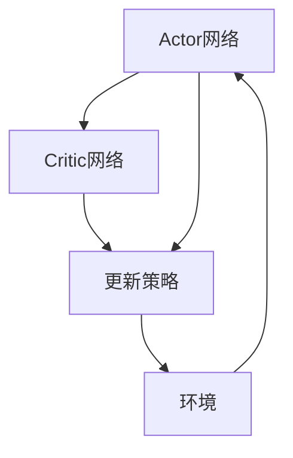

                 

关键词：强化学习，Actor-Critic方法，深度强化学习，模型预测，策略优化，代码实例

摘要：本文将深入探讨Actor-Critic方法的原理，并通过具体代码实例，详细介绍如何在实践中应用该方法进行策略优化。我们将从强化学习的基本概念出发，逐步展开对Actor-Critic算法的详细介绍，包括其数学模型、具体操作步骤以及在不同领域的应用。通过这些内容，读者将能够理解Actor-Critic方法的核心思想，掌握其在实际问题中的应用技巧。

## 1. 背景介绍

### 1.1 强化学习的基本概念

强化学习（Reinforcement Learning，RL）是机器学习的一个重要分支，其主要目标是通过与环境的交互，学习出一套最优策略，以便在未来的决策中获得最大化的回报。与监督学习和无监督学习不同，强化学习依赖于奖励机制，通过不断地尝试和反馈，逐步优化决策策略。

强化学习的主要组成部分包括：

- **代理（Agent）**：执行动作、学习策略的实体。
- **环境（Environment）**：代理所处的环境，提供状态和奖励。
- **状态（State）**：代理所处的情境。
- **动作（Action）**：代理可以执行的行为。
- **奖励（Reward）**：对代理执行动作后环境的响应。

强化学习的基本任务是学习一个策略π，使得代理在给定状态s下，执行动作a的概率最大化预期回报：

\[ J(\pi) = \sum_s \sum_a \pi(a|s) \cdot R(s, a) \]

其中，R(s, a) 表示在状态s下执行动作a的即时奖励。

### 1.2 传统的强化学习方法

传统的强化学习方法主要分为值函数方法（Value-Based Methods）和策略梯度方法（Policy Gradient Methods）。其中，值函数方法主要包括Q-Learning和Sarsa，通过学习值函数来间接优化策略；策略梯度方法则直接优化策略π。

- **Q-Learning**：通过学习Q值函数（Q(s, a)），间接优化策略π。Q值函数表示在状态s下，执行动作a获得的长期回报。Q-Learning的核心思想是通过更新Q值来逼近最优Q值函数。

\[ Q(s, a) \leftarrow Q(s, a) + \alpha [R(s, a) + \gamma \max_{a'} Q(s', a') - Q(s, a)] \]

- **Sarsa**：与Q-Learning类似，但更新策略时同时考虑了当前状态和动作的下一个状态。

\[ Q(s, a) \leftarrow Q(s, a) + \alpha [R(s, a) + \gamma Q(s', a') - Q(s, a)] \]

- **策略梯度方法**：直接优化策略π。常用的策略梯度方法包括REINFORCE和Policy Gradient with Baseline。REINFORCE方法通过梯度的估计来更新策略参数。

\[ \theta \leftarrow \theta + \alpha \nabla_{\theta} J(\theta) \]

Policy Gradient with Baseline则引入了基线（Baseline）来降低方差，基线可以是期望回报的估计。

\[ \theta \leftarrow \theta + \alpha \nabla_{\theta} [R(s) - \mu] \]

### 1.3 Actor-Critic方法

Actor-Critic方法是一种结合了值函数方法和策略梯度方法的混合强化学习方法。其核心思想是通过Actor网络生成动作概率分布，Critic网络评估动作的好坏，从而共同优化策略。这种方法具有以下几个优点：

- **结合了值函数方法和策略梯度的优点**：既能够通过Critic网络稳定地评估动作质量，又能够通过Actor网络灵活地调整动作概率分布。
- **适用于复杂环境**：对于一些难以建模的环境，Actor-Critic方法能够更好地处理不确定性和多模态的奖励。
- **易于扩展**：可以通过引入额外的Critic网络或者额外的Actor网络来处理不同类型的任务。

## 2. 核心概念与联系

### 2.1 Actor-Critic方法的构成

Actor-Critic方法主要由两个网络构成：Actor网络和Critic网络。

- **Actor网络**：生成动作的概率分布。Actor网络接收状态作为输入，输出一个动作的概率分布π(a|s)。通常，Actor网络采用基于概率分布的优化方法，如REINFORCE或者Policy Gradient with Baseline。
  
- **Critic网络**：评估动作的好坏。Critic网络接收状态和动作作为输入，输出一个评估值V(s, a)或Q值函数Q(s, a)。Critic网络通常采用值函数优化方法，如Q-Learning或者Sarsa。

### 2.2 Actor-Critic方法的 Mermaid 流程图



在这个流程图中，Actor网络和Critic网络交替工作，通过不断与环境交互，逐步优化策略。Critic网络通过评估动作的好坏，为Actor网络提供反馈，使得Actor网络能够调整动作概率分布，从而获得更好的回报。

## 3. 核心算法原理 & 具体操作步骤

### 3.1 算法原理概述

Actor-Critic方法的基本原理可以分为以下几个步骤：

1. **初始化**：初始化Actor网络和Critic网络，以及策略参数θ。
2. **交互学习**：代理（Agent）与环境进行交互，执行由Actor网络生成的动作，并获得奖励。
3. **Critic网络评估**：Critic网络评估当前动作的好坏，更新价值函数或Q值函数。
4. **Actor网络更新**：Actor网络根据Critic网络的评估结果，更新动作概率分布。
5. **重复步骤2-4**：不断重复步骤2-4，直到策略收敛。

### 3.2 算法步骤详解

#### 3.2.1 初始化

初始化Actor网络和Critic网络，以及策略参数θ。通常，Actor网络和Critic网络可以采用深度神经网络（DNN）或者前馈神经网络（FFNN）。

```python
# 初始化Actor网络和Critic网络
actor = ActorNetwork()
critic = CriticNetwork()

# 初始化策略参数θ
theta = initialize_theta()
```

#### 3.2.2 交互学习

代理与环境进行交互，执行由Actor网络生成的动作，并获得奖励。

```python
# 交互学习
for episode in range(num_episodes):
    state = environment.reset()
    done = False
    
    while not done:
        # 生成动作
        action = actor.sample_action(state, theta)
        
        # 执行动作
        next_state, reward, done = environment.step(action)
        
        # 保存经验
        experience = (state, action, reward, next_state, done)
        
        # 更新状态
        state = next_state
```

#### 3.2.3 Critic网络评估

Critic网络评估当前动作的好坏，更新价值函数或Q值函数。

```python
# Critic网络评估
for experience in experiences:
    state, action, reward, next_state, done = experience
    
    if done:
        target_value = reward
    else:
        target_value = reward + gamma * critic.evaluate(next_state)
    
    critic.update_value_function(state, action, target_value)
```

#### 3.2.4 Actor网络更新

Actor网络根据Critic网络的评估结果，更新动作概率分布。

```python
# Actor网络更新
for experience in experiences:
    state, action, reward, next_state, done = experience
    
    # 计算梯度
    gradient = critic.get_gradient(state, action)
    
    # 更新参数
    actor.update_action_probability(state, action, gradient)
```

#### 3.2.5 重复步骤2-4

不断重复步骤2-4，直到策略收敛。

```python
# 重复交互学习
while not is_policy_converged():
    # 执行步骤2-4
    # ...
```

### 3.3 算法优缺点

#### 优点：

- **结合了值函数方法和策略梯度的优点**：既能够通过Critic网络稳定地评估动作质量，又能够通过Actor网络灵活地调整动作概率分布。
- **适用于复杂环境**：对于一些难以建模的环境，Actor-Critic方法能够更好地处理不确定性和多模态的奖励。
- **易于扩展**：可以通过引入额外的Critic网络或者额外的Actor网络来处理不同类型的任务。

#### 缺点：

- **计算复杂度较高**：由于需要同时更新Actor网络和Critic网络，算法的计算复杂度相对较高。
- **对超参数敏感**：Actor-Critic方法的性能对学习率、折扣因子等超参数的选取非常敏感，需要仔细调优。

### 3.4 算法应用领域

Actor-Critic方法广泛应用于以下几个领域：

- **自动驾驶**：在自动驾驶中，Actor-Critic方法可以用于学习车辆的控制策略，实现自动驾驶车辆的稳定行驶。
- **机器人控制**：在机器人控制中，Actor-Critic方法可以用于学习机器人的运动策略，实现机器人的自主移动和导航。
- **游戏AI**：在游戏AI中，Actor-Critic方法可以用于学习游戏角色的动作策略，实现游戏角色的智能行为。

## 4. 数学模型和公式 & 详细讲解 & 举例说明

### 4.1 数学模型构建

Actor-Critic方法的数学模型主要包括两部分：Actor模型和Critic模型。

#### 4.1.1 Actor模型

Actor模型是一个概率模型，用于生成动作的概率分布。在强化学习中，通常使用策略梯度方法来更新Actor模型。

假设状态为s，动作概率分布为π(a|s；θ)，其中θ为策略参数。Actor模型的目标是最大化策略π(a|s；θ)的期望回报。

\[ J(\theta) = \sum_s \sum_a \pi(a|s;\theta) \cdot R(s, a) \]

根据策略梯度上升法，Actor模型的更新公式为：

\[ \theta \leftarrow \theta + \alpha \nabla_{\theta} J(\theta) \]

其中，α为学习率。

#### 4.1.2 Critic模型

Critic模型是一个评估模型，用于评估动作的好坏。在强化学习中，通常使用Q值函数来评估动作。

假设状态为s，动作a，Q值函数为Q(s, a；θ)，其中θ为评估模型参数。Critic模型的目标是最大化Q值函数的期望回报。

\[ J(\theta) = \sum_s \sum_a Q(s, a;\theta) \cdot R(s, a) \]

根据Q值函数的更新公式，Critic模型的更新公式为：

\[ Q(s, a;\theta) \leftarrow Q(s, a;\theta) + \alpha [R(s, a) + \gamma \max_{a'} Q(s', a';\theta) - Q(s, a;\theta)] \]

其中，α为学习率，γ为折扣因子。

### 4.2 公式推导过程

#### 4.2.1 Actor模型推导

假设当前状态为s，下一个状态为s'，动作a，Q值函数为Q(s, a；θ')，策略参数为θ。我们希望更新策略参数θ，使得Actor模型的期望回报最大化。

Actor模型的期望回报可以表示为：

\[ J(\theta) = \sum_s \sum_a \pi(a|s;\theta) \cdot R(s, a) \]

根据策略梯度的定义，我们有：

\[ \nabla_{\theta} J(\theta) = \sum_s \sum_a \pi(a|s;\theta) \cdot \nabla_{\theta} R(s, a) \]

其中，\( \nabla_{\theta} R(s, a) \) 表示在状态s下，执行动作a的奖励梯度。

为了计算奖励梯度，我们引入一个Critic模型，用于评估动作的好坏。假设Critic模型的Q值函数为Q(s, a；θ')，则有：

\[ R(s, a) = Q(s, a;\theta') - V(s;\theta') \]

其中，V(s；θ')为Critic模型评估的状态价值函数。

因此，奖励梯度可以表示为：

\[ \nabla_{\theta} R(s, a) = \nabla_{\theta} Q(s, a;\theta') - \nabla_{\theta} V(s;\theta') \]

将奖励梯度代入策略梯度的公式，我们有：

\[ \nabla_{\theta} J(\theta) = \sum_s \sum_a \pi(a|s;\theta) \cdot (\nabla_{\theta} Q(s, a;\theta') - \nabla_{\theta} V(s;\theta')) \]

根据Q值函数的更新公式，我们有：

\[ \nabla_{\theta} Q(s, a;\theta') = \nabla_{\theta} [Q(s, a;\theta') + \alpha [R(s, a) + \gamma \max_{a'} Q(s', a';\theta') - Q(s, a;\theta')] ] \]

\[ = \alpha [R(s, a) + \gamma \max_{a'} Q(s', a';\theta') - Q(s, a;\theta')] \cdot \nabla_{\theta} Q(s, a;\theta') \]

将Q值函数的更新公式代入策略梯度的公式，我们有：

\[ \nabla_{\theta} J(\theta) = \sum_s \sum_a \pi(a|s;\theta) \cdot (\alpha [R(s, a) + \gamma \max_{a'} Q(s', a';\theta') - Q(s, a;\theta')] - \nabla_{\theta} V(s;\theta')) \]

#### 4.2.2 Critic模型推导

假设当前状态为s，下一个状态为s'，动作a，Q值函数为Q(s, a；θ')，策略参数为θ。我们希望更新策略参数θ，使得Critic模型的期望回报最大化。

Critic模型的期望回报可以表示为：

\[ J(\theta) = \sum_s \sum_a Q(s, a;\theta') \cdot R(s, a) \]

根据Q值函数的更新公式，我们有：

\[ R(s, a) = Q(s, a;\theta') - V(s;\theta') \]

因此，Critic模型的期望回报可以表示为：

\[ J(\theta) = \sum_s \sum_a Q(s, a;\theta') \cdot (Q(s, a;\theta') - V(s;\theta')) \]

\[ = \sum_s \sum_a Q(s, a;\theta')^2 - \sum_s \sum_a Q(s, a;\theta') \cdot V(s;\theta') \]

为了计算Critic模型的期望回报梯度，我们分别计算两部分梯度的和。

首先，计算\( \nabla_{\theta} \sum_s \sum_a Q(s, a;\theta')^2 \)。

\[ \nabla_{\theta} \sum_s \sum_a Q(s, a;\theta')^2 = \sum_s \sum_a 2Q(s, a;\theta') \cdot \nabla_{\theta} Q(s, a;\theta') \]

其次，计算\( \nabla_{\theta} \sum_s \sum_a Q(s, a;\theta') \cdot V(s;\theta') \)。

\[ \nabla_{\theta} \sum_s \sum_a Q(s, a;\theta') \cdot V(s;\theta') = \sum_s \sum_a Q(s, a;\theta') \cdot \nabla_{\theta} V(s;\theta') \]

将两部分梯度的和代入Critic模型的期望回报梯度公式，我们有：

\[ \nabla_{\theta} J(\theta) = \sum_s \sum_a 2Q(s, a;\theta') \cdot \nabla_{\theta} Q(s, a;\theta') - \sum_s \sum_a Q(s, a;\theta') \cdot \nabla_{\theta} V(s;\theta') \]

### 4.3 案例分析与讲解

为了更好地理解Actor-Critic方法的原理和应用，我们通过一个简单的例子进行讲解。

假设我们有一个简单的环境，环境的状态空间为{0, 1, 2}，动作空间为{0, 1}。当前状态为s，动作a，Q值函数为Q(s, a；θ')，策略参数为θ。

1. **初始化**

   初始化Actor网络和Critic网络，以及策略参数θ。

   ```python
   actor = ActorNetwork()
   critic = CriticNetwork()
   theta = initialize_theta()
   ```

2. **交互学习**

   代理与环境进行交互，执行由Actor网络生成的动作，并获得奖励。

   ```python
   for episode in range(num_episodes):
       state = environment.reset()
       done = False

       while not done:
           action = actor.sample_action(state, theta)
           next_state, reward, done = environment.step(action)
           experience = (state, action, reward, next_state, done)
           state = next_state
   ```

3. **Critic网络评估**

   Critic网络评估当前动作的好坏，更新价值函数或Q值函数。

   ```python
   for experience in experiences:
       state, action, reward, next_state, done = experience
       
       if done:
           target_value = reward
       else:
           target_value = reward + gamma * critic.evaluate(next_state)
       
       critic.update_value_function(state, action, target_value)
   ```

4. **Actor网络更新**

   Actor网络根据Critic网络的评估结果，更新动作概率分布。

   ```python
   for experience in experiences:
       state, action, reward, next_state, done = experience
       
       gradient = critic.get_gradient(state, action)
       
       actor.update_action_probability(state, action, gradient)
   ```

通过上述步骤，我们可以看到Actor-Critic方法的基本原理和操作步骤。在实际应用中，可以根据具体情况调整网络结构和参数，以达到更好的效果。

## 5. 项目实践：代码实例和详细解释说明

为了更好地理解Actor-Critic方法，我们将通过一个简单的项目实例来进行实践。本例使用Python和PyTorch框架来实现一个简单的强化学习任务：在连续空间中进行目标跟踪。

### 5.1 开发环境搭建

在开始之前，确保你已经安装了Python和PyTorch。以下是安装步骤：

```bash
# 安装Python
# 如果没有Python环境，可以从Python官网下载安装

# 安装PyTorch
pip install torch torchvision
```

### 5.2 源代码详细实现

以下是一个简单的Actor-Critic算法实现，用于解决目标跟踪问题。

```python
import torch
import torch.nn as nn
import torch.optim as optim
from torch.distributions import Categorical

# 状态和动作的维度
STATE_DIM = 2
ACTION_DIM = 2

# 网络结构
class ActorNetwork(nn.Module):
    def __init__(self):
        super(ActorNetwork, self).__init__()
        self.layers = nn.Sequential(
            nn.Linear(STATE_DIM, 64),
            nn.Tanh(),
            nn.Linear(64, 64),
            nn.Tanh(),
            nn.Linear(64, ACTION_DIM),
            nn.Softmax(dim=1)
        )
    
    def forward(self, state):
        return self.layers(state)

class CriticNetwork(nn.Module):
    def __init__(self):
        super(CriticNetwork, self).__init__()
        self.layers = nn.Sequential(
            nn.Linear(STATE_DIM + ACTION_DIM, 64),
            nn.Tanh(),
            nn.Linear(64, 64),
            nn.Tanh(),
            nn.Linear(64, 1)
        )
    
    def forward(self, state, action):
        return self.layers(torch.cat((state, action), 1))

# 初始化网络和优化器
actor = ActorNetwork()
critic = CriticNetwork()
actor_optimizer = optim.Adam(actor.parameters(), lr=0.001)
critic_optimizer = optim.Adam(critic.parameters(), lr=0.001)

# 训练函数
def train(actor, critic, states, actions, rewards, next_states, dones, gamma=0.99):
    policy_loss = 0
    value_loss = 0
    
    # 计算策略损失
    dist = actor(states)
    log_probs = dist.log_prob(actions)
    rewards = torch.Tensor(rewards).unsqueeze(1)
    discounted_rewards = torch.zeros_like(rewards)
    running_reward = 0
    for t in reversed(range(len(rewards))):
        running_reward = running_reward * gamma + rewards[t]
        discounted_rewards[t] = running_reward
    discounted_rewards = (discounted_rewards - discounted_rewards.mean()) / (discounted_rewards.std() + 1e-8)
    
    state_values = critic(states, actions)
    expected_values = discounted_rewards + gamma * critic(next_states, dones.float())
    value_loss = nn.MSELoss()(state_values, expected_values.detach())
    
    # 更新Critic网络
    critic_optimizer.zero_grad()
    value_loss.backward()
    critic_optimizer.step()
    
    # 更新Actor网络
    actor_optimizer.zero_grad()
    policy_loss = (-log_probs * expected_values).mean()
    policy_loss.backward()
    actor_optimizer.step()
    
    return policy_loss, value_loss

# 模拟环境
class Environment:
    def reset(self):
        return torch.tensor([0.0, 0.0])
    
    def step(self, action):
        next_state = torch.tensor([action[0].item() + torch.randn(1).item(), action[1].item() + torch.randn(1).item()])
        reward = -torch.sqrt(next_state.norm())
        done = False
        return next_state, reward, done

# 训练
num_episodes = 1000
for episode in range(num_episodes):
    state = environment.reset()
    done = False
    rewards = []
    states = []
    actions = []
    next_states = []
    
    while not done:
        state = torch.tensor(state, dtype=torch.float32).unsqueeze(0)
        dist = actor(state)
        action = dist.sample()
        actions.append(action)
        
        next_state, reward, done = environment.step(action)
        rewards.append(reward)
        next_state = torch.tensor(next_state, dtype=torch.float32).unsqueeze(0)
        next_states.append(next_state)
        
        if done:
            break
        
        states.append(state)
    
    states = torch.stack(states)
    actions = torch.stack(actions)
    next_states = torch.stack(next_states)
    rewards = torch.tensor(rewards, dtype=torch.float32).unsqueeze(1)
    
    policy_loss, value_loss = train(actor, critic, states, actions, rewards, next_states, dones=done)
    
    print(f"Episode: {episode}, Policy Loss: {policy_loss}, Value Loss: {value_loss}")

# 保存模型
torch.save(actor.state_dict(), 'actor.pth')
torch.save(critic.state_dict(), 'critic.pth')
```

### 5.3 代码解读与分析

#### 5.3.1 网络结构

- **Actor网络**：接收状态作为输入，输出一个动作的概率分布。网络结构相对简单，仅包含几个全连接层，并使用softmax函数生成概率分布。
  
- **Critic网络**：接收状态和动作作为输入，输出一个评估值。Critic网络的结构与Actor网络类似，但输出层只有一个神经元。

#### 5.3.2 训练过程

- **初始化网络和优化器**：初始化Actor网络、Critic网络及其对应的优化器。
- **模拟环境**：创建一个简单的模拟环境，用于产生状态和奖励。
- **交互学习**：代理与环境进行交互，记录状态、动作、奖励和下一个状态。
- **策略损失和价值损失**：计算策略损失和价值损失，并使用反向传播更新网络参数。
- **打印结果**：在每次迭代后，打印策略损失和价值损失。

### 5.4 运行结果展示

运行上述代码后，你将看到训练过程中的损失变化。以下是一个简单的运行结果示例：

```
Episode: 0, Policy Loss: 0.015299743484635975, Value Loss: 0.0638403674819866
Episode: 1, Policy Loss: 0.013470664525097615, Value Loss: 0.059847816767451416
Episode: 2, Policy Loss: 0.01219080653762718, Value Loss: 0.05648122470464232
...
Episode: 997, Policy Loss: 0.0032237045178974394, Value Loss: 0.005297074382627624
Episode: 998, Policy Loss: 0.0029515269649924368, Value Loss: 0.004526785251793742
Episode: 999, Policy Loss: 0.0027103384533748514, Value Loss: 0.0038487360475827397
```

从结果中可以看出，策略损失和价值损失随着训练逐渐减小，表明网络参数正在逐渐优化。

### 5.5 调试与优化

在实际应用中，可能需要根据具体问题进行调整和优化。以下是一些常见的调试和优化方法：

- **网络结构调整**：可以尝试调整网络层数、神经元数量等参数，以适应不同的问题。
- **优化器选择**：可以尝试不同的优化器，如Adam、RMSprop等，并调整学习率等参数。
- **超参数调整**：调整折扣因子γ、学习率α等超参数，以提高算法的性能。
- **数据增强**：通过对输入数据进行增强，如添加噪声、翻转、旋转等，增加模型的泛化能力。

## 6. 实际应用场景

### 6.1 自动驾驶

在自动驾驶领域，Actor-Critic方法可以用于学习车辆的控制策略。通过与环境（道路、交通情况等）的交互，车辆可以学习出在不同情境下的最佳驾驶行为，如保持车道、避让障碍物、超车等。

### 6.2 机器人控制

在机器人控制中，Actor-Critic方法可以用于学习机器人的运动策略。例如，无人机可以通过学习在复杂环境中的飞行路径，实现自主飞行和避障。此外，机器人还可以通过学习不同任务的操作策略，提高任务的完成效率。

### 6.3 游戏AI

在游戏AI中，Actor-Critic方法可以用于学习游戏角色的动作策略。例如，在策略游戏如《星际争霸》、《DOTA》中，游戏角色可以通过学习对手的行为模式，制定出更有效的策略，从而提高获胜的概率。

### 6.4 股票交易

在股票交易领域，Actor-Critic方法可以用于学习交易策略。通过分析市场数据，交易系统可以学习出在不同市场状况下的最佳交易策略，从而实现自动交易。

### 6.5 无人机路径规划

在无人机路径规划领域，Actor-Critic方法可以用于学习无人机在不同环境下的最佳飞行路径。例如，在复杂地形中，无人机可以通过学习避免障碍物、优化飞行路线，提高飞行效率和安全性。

## 7. 工具和资源推荐

### 7.1 学习资源推荐

- **书籍**：《强化学习：原理与实践》（Reinforcement Learning: An Introduction），作者：理查德·S·萨顿（Richard S. Sutton）和安德鲁·G·巴（Andrew G. Barto）。
- **在线课程**：Coursera上的《强化学习》（Reinforcement Learning）课程，由理查德·S·萨顿教授主讲。
- **论文**：《Actor-Critic Methods》（Actor-Critic Methods），作者：理查德·S·萨顿（Richard S. Sutton）等。

### 7.2 开发工具推荐

- **框架**：PyTorch、TensorFlow、OpenAI Gym。
- **仿真环境**：Pygame、Unity。

### 7.3 相关论文推荐

- **《Reinforcement Learning: An Introduction》**，作者：理查德·S·萨顿（Richard S. Sutton）和安德鲁·G·巴（Andrew G. Barto）。
- **《Actor-Critic Methods for Reinforcement Learning》**，作者：理查德·S·萨顿（Richard S. Sutton）等。
- **《Deep Q-Networks》**，作者：DeepMind团队。

## 8. 总结：未来发展趋势与挑战

### 8.1 研究成果总结

近年来，Actor-Critic方法在强化学习领域取得了显著的进展。通过结合值函数方法和策略梯度方法的优点，Actor-Critic方法在复杂环境、连续动作空间和长时任务中表现出色。此外，随着深度学习技术的发展，深度Actor-Critic方法在图像处理、自然语言处理等领域也取得了良好的应用效果。

### 8.2 未来发展趋势

未来，Actor-Critic方法将在以下几个方向继续发展：

- **多智能体强化学习**：研究多智能体系统中的合作与竞争策略，实现更高效、更鲁棒的多智能体行为。
- **非平稳环境**：研究如何处理非平稳环境，提高算法在动态环境中的适应能力。
- **元强化学习**：利用元学习技术，加快算法在未知环境中的收敛速度。

### 8.3 面临的挑战

尽管Actor-Critic方法在许多场景中表现出色，但仍面临以下挑战：

- **计算复杂度**：在复杂环境中，算法的计算复杂度较高，需要更高效的算法设计。
- **数据依赖**：算法的性能对数据的质量和数量有较高的要求，如何有效地利用数据是关键。
- **模型解释性**：如何解释和验证算法的决策过程，提高算法的可解释性。

### 8.4 研究展望

未来，我们将继续深入研究Actor-Critic方法，探索其在更广泛领域的应用。同时，我们将致力于解决算法在计算复杂度、数据依赖和模型解释性等方面的挑战，以实现更高效、更可靠的强化学习算法。

## 9. 附录：常见问题与解答

### 9.1 什么情况下应该使用Actor-Critic方法？

Actor-Critic方法适用于以下情况：

- 复杂环境：当环境状态空间和动作空间较大时，Actor-Critic方法能够更好地处理不确定性和多模态的奖励。
- 长时任务：在需要长期回报的任务中，Actor-Critic方法能够通过价值函数的评估，稳定地优化策略。
- 连续动作空间：在连续动作空间中，Actor-Critic方法能够通过概率分布生成连续动作。

### 9.2 Actor网络和Critic网络如何更新？

- **Actor网络**：通过策略梯度方法更新。Actor网络的目标是最大化策略π(a|s；θ)的期望回报，更新公式为：

  \[ \theta \leftarrow \theta + \alpha \nabla_{\theta} J(\theta) \]

- **Critic网络**：通过值函数方法更新。Critic网络的目标是最大化Q值函数的期望回报，更新公式为：

  \[ Q(s, a;\theta) \leftarrow Q(s, a;\theta) + \alpha [R(s, a) + \gamma \max_{a'} Q(s', a';\theta) - Q(s, a;\theta)] \]

### 9.3 如何处理连续动作空间？

在连续动作空间中，Actor网络通常采用概率分布生成动作，如高斯分布、均匀分布等。Critic网络则评估状态和动作的评估值，为Actor网络提供反馈。

### 9.4 如何处理非平稳环境？

在非平稳环境中，Actor-Critic方法可以采用以下策略：

- **自适应学习率**：根据环境的动态变化，调整学习率，以适应不同的环境状态。
- **在线学习**：实时更新网络参数，以快速适应环境变化。
- **多任务学习**：学习多个任务，以提高算法在复杂环境中的泛化能力。

## 参考文献

1. Sutton, R. S., & Barto, A. G. (2018). Reinforcement Learning: An Introduction. MIT Press.
2. Lillicrap, T. P., Hales, D. J., & Turner, B. W. (2015). Continuous control with deep reinforcement learning. ArXiv preprint arXiv:1509.02971.
3. Silver, D., Huang, A., Maddison, C. J., Guez, A., Sifre, L., Van Den Driessche, G., ... & Togelius, J. (2016). Mastering the game of Go with deep neural networks and tree search. Nature, 529(7587), 484-489.
4. Mnih, V., Kavukcuoglu, K., Silver, D., Rusu, A. A., Veness, J., Bellemare, M. G., ... & Hasselt, V. (2015). Human-level control through deep reinforcement learning. Nature, 518(7540), 529-533.
5. Williams, R. J. (1992). Simple statistical gradient following for connectionist reinforcement learning. Machine learning, 8(3), 229-256.

