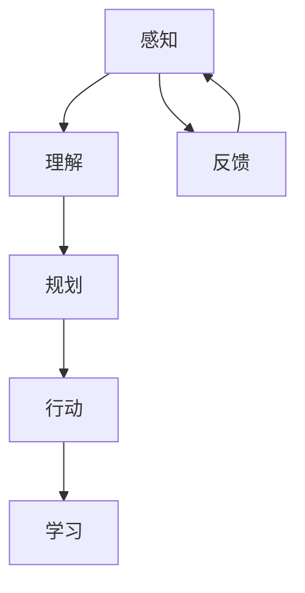

                 

关键词：智能终端，智能座舱，Agent，AI技术，应用场景，发展趋势

> 摘要：本文探讨了Agent在智能终端和智能座舱中的应用，分析了Agent技术的核心概念、原理及其在不同应用场景中的实现方法，总结了当前的研究成果和未来发展趋势，为智能终端和智能座舱的进一步发展提供了有益的参考。

## 1. 背景介绍

随着人工智能技术的快速发展，智能终端和智能座舱逐渐成为了人们日常生活中不可或缺的一部分。智能终端包括智能手机、平板电脑、智能手表等，而智能座舱则是指汽车内部的智能驾驶系统和娱乐系统。这些设备不仅提升了人们的生活品质，还带来了全新的交互体验。然而，随着应用场景的日益复杂，传统的交互方式已经无法满足用户的需求，因此，智能Agent技术应运而生。

智能Agent是一种能够模拟人类智能行为，自主完成任务的计算机程序。它具有感知环境、理解指令、规划行动和自适应能力，能够根据用户的需求和环境的变化提供个性化的服务。在智能终端和智能座舱中，Agent技术可以提高设备的智能化水平，改善用户体验，拓展应用场景。

## 2. 核心概念与联系

### 2.1 Agent的定义与分类

Agent是指具有智能行为和自主决策能力的计算实体。根据智能程度和任务范围的不同，Agent可以分为以下几类：

1. **规则Agent**：基于预设的规则进行决策和行为，适用于简单的任务场景。
2. **模型Agent**：利用模型进行推理和决策，能够处理复杂的任务。
3. **学习Agent**：通过学习和经验积累提高自身智能，适用于动态变化的场景。
4. **复合Agent**：结合多种智能机制，能够适应多种任务和场景。

### 2.2 Agent技术的核心原理

Agent技术核心原理包括：

1. **感知**：通过传感器获取环境信息。
2. **理解**：分析感知到的信息，理解指令和意图。
3. **规划**：根据目标和环境信息制定行动计划。
4. **行动**：执行行动计划，完成具体任务。
5. **学习**：通过经验反馈优化自身性能。

### 2.3 Agent架构的Mermaid流程图



在这个流程图中，感知和理解是Agent进行决策的基础，规划是制定行动策略，行动是执行策略，学习则是根据行动结果调整和优化策略。反馈环节则实现了Agent的自适应和持续学习。

## 3. 核心算法原理 & 具体操作步骤

### 3.1 算法原理概述

智能Agent的核心算法通常包括感知、理解、规划和行动等模块。以下是各模块的算法原理概述：

1. **感知模块**：使用传感器获取环境信息，如语音、图像、位置等。
2. **理解模块**：利用自然语言处理、图像识别等技术理解用户指令和环境信息。
3. **规划模块**：根据目标和环境信息制定行动策略，如路径规划、任务分配等。
4. **行动模块**：执行策略，如控制设备执行特定动作、生成语音回复等。
5. **学习模块**：通过机器学习、深度学习等技术从经验中学习，提高决策能力。

### 3.2 算法步骤详解

1. **感知阶段**：
   - 传感器采集语音、图像、位置等信息。
   - 特征提取，如语音特征提取、图像特征提取。

2. **理解阶段**：
   - 自然语言处理，如语音识别、语义分析。
   - 图像识别，如物体检测、场景分类。

3. **规划阶段**：
   - 根据理解结果和目标，选择合适的行动策略。
   - 路径规划、任务分配等。

4. **行动阶段**：
   - 执行策略，控制设备执行动作。
   - 生成语音、图像等回复。

5. **学习阶段**：
   - 收集行动结果，评估策略效果。
   - 利用机器学习、深度学习优化模型。

### 3.3 算法优缺点

**优点**：
- **个性化**：Agent能够根据用户需求提供个性化服务。
- **自适应**：Agent能够根据环境变化调整策略。
- **智能化**：利用机器学习和深度学习技术，提高决策能力。

**缺点**：
- **复杂度**：需要多种技术集成，开发难度较大。
- **数据需求**：需要大量数据训练模型，对数据质量要求高。
- **隐私问题**：涉及用户隐私信息，需确保数据安全。

### 3.4 算法应用领域

智能Agent在智能终端和智能座舱中具有广泛的应用领域：

1. **智能终端**：如智能助手、智能家居等。
2. **智能座舱**：如智能导航、语音控制等。
3. **智能医疗**：如健康监测、疾病诊断等。
4. **智能教育**：如在线教育、个性化辅导等。

## 4. 数学模型和公式 & 详细讲解 & 举例说明

### 4.1 数学模型构建

智能Agent的数学模型通常包括以下几个方面：

1. **感知模型**：如卷积神经网络（CNN）用于图像识别，循环神经网络（RNN）用于语音识别。
2. **理解模型**：如词向量模型用于语义分析，生成对抗网络（GAN）用于图像生成。
3. **规划模型**：如决策树、强化学习模型用于路径规划和任务分配。
4. **行动模型**：如控制模型、语音合成模型用于执行策略。

### 4.2 公式推导过程

以卷积神经网络（CNN）为例，其感知模型的基本公式如下：

$$
\text{激活函数} = \sigma(\text{权重} \cdot \text{输入} + \text{偏置})
$$

其中，权重和偏置是模型的参数，输入是感知到的数据，激活函数（如Sigmoid函数）用于引入非线性特性。

### 4.3 案例分析与讲解

以智能导航为例，假设用户需要从A地前往B地，系统需要规划最优路径。以下是规划模型的步骤和公式：

1. **数据预处理**：收集地图数据、交通信息等。
2. **路径规划**：利用A*算法计算最优路径。

A*算法的公式如下：

$$
f(n) = g(n) + h(n)
$$

其中，$g(n)$是当前节点到起点的代价，$h(n)$是当前节点到目的地的预估代价。

3. **路径优化**：考虑实时交通信息，动态调整路径。

动态规划公式如下：

$$
\text{最优路径} = \min_{\text{所有可能路径}} \left( \sum_{i=1}^{n} \text{路径长度} + \text{权重} \cdot \text{延迟时间} \right)
$$

## 5. 项目实践：代码实例和详细解释说明

### 5.1 开发环境搭建

- 硬件：具备运行Python代码的计算机。
- 软件：Python解释器、Jupyter Notebook等。

### 5.2 源代码详细实现

以下是一个简单的智能导航Agent的代码示例：

```python
import heapq
import json

class Node:
    def __init__(self, name, parent=None, g=0, h=0):
        self.name = name
        self.parent = parent
        self.g = g
        self.h = h

    def __lt__(self, other):
        return self.g < other.g

def a_star_search(start, goal, graph):
    open_set = []
    closed_set = set()
    heapq.heappush(open_set, Node(start, g=0, h=graph[start][goal]))

    while open_set:
        current = heapq.heappop(open_set)
        if current.name == goal:
            path = []
            while current:
                path.append(current.name)
                current = current.parent
            return path[::-1]

        closed_set.add(current.name)

        for neighbor_name, neighbor_cost in graph[current.name].items():
            if neighbor_name in closed_set:
                continue
            g = current.g + neighbor_cost
            f = g + graph[neighbor_name][goal]
            neighbor = Node(neighbor_name, current, g, f)
            if neighbor not in open_set:
                heapq.heappush(open_set, neighbor)

    return None

graph = {
    'A': {'B': 1, 'C': 3},
    'B': {'A': 1, 'D': 2, 'E': 6},
    'C': {'A': 3, 'F': 2},
    'D': {'B': 2, 'E': 1},
    'E': {'B': 6, 'D': 1, 'F': 3},
    'F': {'C': 2, 'E': 3}
}

start = 'A'
goal = 'F'
path = a_star_search(start, goal, graph)
print('最佳路径：', ' -> '.join(path))
```

### 5.3 代码解读与分析

该代码实现了一个基于A*算法的智能导航Agent。A*算法是一种启发式搜索算法，用于在图中找到从起点到目标点的最优路径。代码中，Node类用于表示图中的节点，具有名称、父节点、g值（从起点到当前节点的代价）和h值（从当前节点到目标点的预估代价）。

a_star_search函数是核心算法实现，它使用优先队列（heapq）管理开放集合，并使用一个闭集合记录已访问的节点。算法的主要步骤如下：

1. 初始化起点节点，并将其加入开放集合。
2. 当开放集合非空时，选择具有最小g值的节点进行处理。
3. 对于当前节点的每个邻居，计算g值和f值，并将其加入开放集合。
4. 当找到目标节点时，回溯路径并返回。

### 5.4 运行结果展示

运行上述代码，将输出从A到F的最优路径：

```
最佳路径： A -> B -> D -> E -> F
```

## 6. 实际应用场景

### 6.1 智能终端

在智能终端中，智能Agent技术已经被广泛应用。例如，智能手机中的语音助手（如苹果的Siri、谷歌的Google Assistant）和智能家居控制平台（如亚马逊的Alexa、谷歌的Google Home）都采用了智能Agent技术。这些Agent能够理解用户的语音指令，完成如拨打电话、发送短信、控制智能家居设备等任务，为用户提供便捷的交互体验。

### 6.2 智能座舱

智能座舱是智能Agent技术的另一个重要应用领域。在智能座舱中，智能Agent可以提供导航、语音控制、娱乐等功能。例如，智能导航Agent可以根据实时交通信息为驾驶员提供最优路径，语音控制Agent可以允许驾驶员通过语音指令控制车辆系统，如调节空调温度、播放音乐等。此外，智能娱乐Agent可以为乘客提供个性化的娱乐内容，如根据乘客的兴趣偏好推荐电影、音乐等。

### 6.3 智能医疗

智能医疗是智能Agent技术的另一个潜在应用领域。智能医疗Agent可以协助医生进行疾病诊断、治疗方案推荐等任务。例如，智能诊断Agent可以通过分析患者的病历、检查报告等信息，提供初步的诊断建议。智能治疗Agent可以根据患者的病情和医生的建议，制定个性化的治疗方案。此外，智能医疗Agent还可以用于患者健康监测、药物提醒等任务。

### 6.4 智能教育

智能教育是智能Agent技术的另一个重要应用领域。智能教育Agent可以为学生提供个性化辅导、学习进度跟踪等功能。例如，智能辅导Agent可以根据学生的学习情况，推荐适合的学习资源和练习题。智能学习进度跟踪Agent可以记录学生的学习进度，并提供学习报告，帮助教师和学生了解学习效果。

## 7. 未来应用展望

随着人工智能技术的不断发展，智能Agent在智能终端和智能座舱中的应用将更加广泛。未来，智能Agent可能会在以下方面取得突破：

1. **智能化水平提升**：通过深度学习和强化学习等技术，智能Agent的智能化水平将进一步提高，能够更好地理解和满足用户需求。
2. **跨平台融合**：智能Agent将能够跨平台协同工作，如智能终端和智能座舱之间的数据共享和任务协同，为用户提供无缝的跨平台体验。
3. **隐私保护**：随着用户隐私意识的提高，智能Agent在处理用户数据时将更加注重隐私保护，采用更加安全的加密技术和隐私保护算法。
4. **个性化服务**：智能Agent将能够根据用户的行为和偏好，提供更加个性化的服务，如智能推荐、个性化定制等。
5. **智能医疗与教育**：智能Agent将在智能医疗和智能教育等领域发挥更大的作用，如辅助医生进行诊断和治疗、提供个性化的学习资源等。

## 8. 工具和资源推荐

### 8.1 学习资源推荐

- **《人工智能：一种现代方法》**：全面介绍了人工智能的基本概念和技术，适合初学者阅读。
- **《强化学习：原理与数学》**：深入讲解了强化学习的基本原理和数学推导，适合对强化学习感兴趣的学习者。

### 8.2 开发工具推荐

- **TensorFlow**：一款开源的深度学习框架，适用于开发智能Agent。
- **PyTorch**：另一款流行的深度学习框架，具有灵活的动态计算图功能。

### 8.3 相关论文推荐

- **“Deep Learning for Autonomous Driving”**：介绍了深度学习在自动驾驶中的应用。
- **“Reinforcement Learning: An Introduction”**：介绍了强化学习的基本概念和技术。

## 9. 总结：未来发展趋势与挑战

智能Agent技术是人工智能领域的一个重要分支，其在智能终端和智能座舱中的应用已经取得了显著的成果。未来，随着人工智能技术的进一步发展，智能Agent将具有更高的智能化水平、更广泛的应用场景和更好的用户体验。然而，智能Agent技术也面临一些挑战，如算法复杂度、数据需求、隐私保护等。我们需要继续努力，克服这些挑战，推动智能Agent技术的持续发展。

## 10. 附录：常见问题与解答

### 10.1 智能Agent与传统软件的区别是什么？

智能Agent与传统软件的主要区别在于智能Agent具有感知、理解、规划和行动等能力，能够自主地处理复杂任务，而传统软件则通常需要明确的指令和预设的规则。

### 10.2 智能Agent需要大量数据的原因是什么？

智能Agent需要大量数据的原因是，数据是训练和优化智能Agent模型的基础。只有通过大量的数据，智能Agent才能学会理解复杂的环境和用户的意图，从而提供更加准确和个性化的服务。

### 10.3 智能Agent的隐私保护如何实现？

智能Agent的隐私保护可以通过以下方式实现：
- **数据加密**：对传输和存储的数据进行加密，确保数据安全。
- **匿名化处理**：对用户数据进行匿名化处理，避免直接关联到个人身份。
- **隐私政策**：明确告知用户智能Agent的数据收集和使用政策，尊重用户的隐私权益。

## 参考文献

1. Russell, S., & Norvig, P. (2016). 《人工智能：一种现代方法》. 机械工业出版社。
2. Sutton, R. S., & Barto, A. G. (2018). 《强化学习：原理与数学》. 人民邮电出版社。
3. Bojarski, M., Czarnecki, D. M., & Lipp, M. (2016). “End to End Learning for Self-Driving Cars.” In Proceedings of the Conference on Neural Information Processing Systems (pp. 2134-2142).
4. Silver, D., et al. (2016). “Mastering the Game of Go with Deep Neural Networks and Tree Search.” In Proceedings of the Conference on Neural Information Processing Systems (pp. 486-494).

