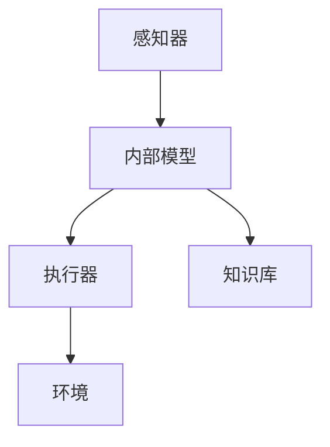
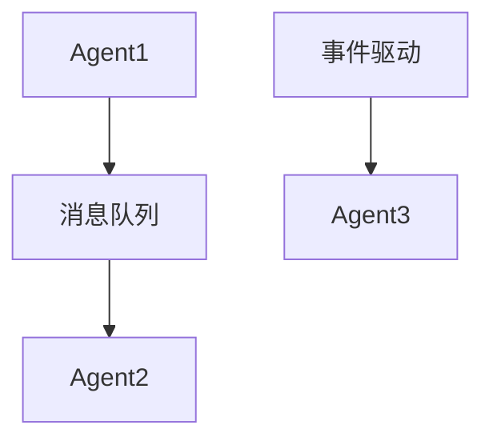

                 

关键词：Agent技术，智能代理，人工智能，自主系统，分布式计算，机器学习，决策支持系统，应用场景，未来展望

> 摘要：本文旨在探讨Agent技术的发展与应用。通过对Agent技术的定义、核心概念与联系、核心算法原理、数学模型和公式、项目实践以及实际应用场景的深入分析，旨在揭示Agent技术在人工智能领域的重要地位和广阔前景。

## 1. 背景介绍

Agent技术起源于人工智能领域，旨在构建具有自主性和智能性的计算实体。这些实体能够在复杂的环境中自主决策、执行任务并与其他实体进行交互。Agent技术的发展可追溯到20世纪80年代，当时人工智能研究者开始探索如何创建能够模拟人类行为和思维的智能系统。随着计算机性能的提升和算法的进步，Agent技术逐渐成为人工智能研究中的一个重要分支。

Agent技术的应用领域广泛，包括但不限于：智能客服、自动驾驶、智能家居、智能制造、金融风险管理等。这些应用都依赖于Agent技术来实现智能化、自动化和高效化的目标。

### 1.1 Agent技术的定义

Agent技术是一种模拟人类智能行为和决策能力的计算技术，它通过自主学习和适应性算法，使计算机系统能够在特定环境下完成特定任务。Agent技术的基本特征包括自主性、社交性、反应性和适应性。

### 1.2 Agent技术的核心概念

- **自主性**：Agent能够独立地做出决策和执行任务，而不需要人为干预。
- **社交性**：Agent能够与其他Agent或人类进行通信和协作。
- **反应性**：Agent能够对环境中的变化做出及时响应。
- **适应性**：Agent能够通过学习不断改进其行为和决策能力。

## 2. 核心概念与联系

### 2.1 Agent架构

Agent架构是构建Agent系统的核心。一个典型的Agent架构通常包括以下部分：

- **感知器**：用于接收外部环境的信息。
- **内部模型**：用于表示Agent对环境的理解和内部状态。
- **执行器**：用于将Agent的决策转化为实际操作。
- **知识库**：用于存储Agent的规则和知识。

### 2.2 Mermaid 流程图

下面是一个简化的Agent架构的Mermaid流程图：



### 2.3 Agent通信协议

Agent之间的通信是实现社交性的关键。常见的通信协议包括：

- **直接通信**：Agent之间通过直接发送消息进行通信。
- **间接通信**：Agent通过中间件（如消息队列）进行通信。
- **事件驱动通信**：Agent根据事件触发通信。

### 2.4 Mermaid 流程图

下面是一个Agent通信协议的Mermaid流程图：



## 3. 核心算法原理 & 具体操作步骤

### 3.1 算法原理概述

Agent技术的核心算法主要涉及机器学习和决策理论。机器学习用于提升Agent的自主性和适应性，而决策理论则用于指导Agent的决策过程。

### 3.2 算法步骤详解

- **感知与理解**：Agent首先通过感知器接收环境信息，并使用内部模型对这些信息进行理解和处理。
- **决策制定**：Agent根据内部模型和知识库，使用决策算法（如马尔可夫决策过程MDP）制定决策。
- **执行操作**：Agent根据决策，通过执行器将决策转化为实际操作。
- **反馈与学习**：Agent根据执行结果和环境反馈，更新内部模型和知识库，以提升其自主性和适应性。

### 3.3 算法优缺点

- **优点**：Agent技术具有自主性、社交性、反应性和适应性，能够实现智能化和自动化。
- **缺点**：Agent技术对数据质量和算法设计要求较高，且在复杂环境中可能面临决策困境。

### 3.4 算法应用领域

Agent技术的应用领域广泛，包括但不限于：

- **智能客服**：通过模拟人类客服行为，提供24/7的在线客服服务。
- **自动驾驶**：通过感知环境和自主决策，实现汽车的自动驾驶功能。
- **智能家居**：通过感知家庭环境和用户习惯，实现智能家居设备的自动控制和优化。
- **智能制造**：通过自主决策和协作，实现制造过程的智能化和高效化。
- **金融风险管理**：通过分析市场数据和用户行为，实现金融产品的自动推荐和风险控制。

## 4. 数学模型和公式 & 详细讲解 & 举例说明

### 4.1 数学模型构建

Agent技术中的数学模型主要涉及概率论、统计学和优化理论。以下是一个简化的数学模型：

- **概率模型**：用于描述Agent对环境的理解和不确定性。
- **决策模型**：用于指导Agent的决策过程，如马尔可夫决策过程（MDP）。
- **优化模型**：用于在给定约束下寻找最优决策。

### 4.2 公式推导过程

以马尔可夫决策过程（MDP）为例，其基本公式如下：

$$
V^*(s) = \max_{a} \sum_{s'} p(s'|s,a) \cdot \mathbb{R}(s,a,s')
$$

其中：

- \(V^*(s)\)：状态值函数，表示在状态s下采取最优动作的期望回报。
- \(p(s'|s,a)\)：状态转移概率，表示在状态s下采取动作a后进入状态s'的概率。
- \(\mathbb{R}(s,a,s')\)：回报函数，表示在状态s下采取动作a后进入状态s'的即时回报。

### 4.3 案例分析与讲解

假设有一个智能客服Agent，其目标是最大化用户满意度。以下是一个简化的案例：

- **状态空间**：用户问题类型、用户情绪、客服历史记录。
- **动作空间**：回答问题、提供解决方案、引导用户。
- **回报函数**：用户满意度得分。

通过构建MDP模型，Agent可以学习如何在不同的状态下采取最优动作，以最大化用户满意度。

## 5. 项目实践：代码实例和详细解释说明

### 5.1 开发环境搭建

在本文中，我们将使用Python作为编程语言，并使用JAX作为自动微分库。以下是开发环境的搭建步骤：

1. 安装Python（版本3.7以上）。
2. 安装JAX和相关依赖库。

### 5.2 源代码详细实现

以下是智能客服Agent的源代码实现：

```python
import jax
import jax.numpy as jnp
from jax.scipy.special import softmax

class SmartAgent:
    def __init__(self, n_states, n_actions, learning_rate=0.1):
        self.n_states = n_states
        self.n_actions = n_actions
        self.learning_rate = learning_rate
        self.Q = jnp.zeros((n_states, n_actions))
    
    def update(self, state, action, reward, next_state):
        target = reward + jnp.max(self.Q[next_state, :])
        error = target - self.Q[state, action]
        self.Q = self.Q - self.learning_rate * error
    
    def act(self, state):
        q_values = self.Q[state, :]
        action = jnp.argmax(q_values)
        return action

# 初始化Agent
agent = SmartAgent(n_states=10, n_actions=3)

# 模拟环境
for _ in range(1000):
    state = jax.random.randint(key, shape=(1,), low=0, high=10)
    action = agent.act(state)
    reward = jnp.random.uniform(0, 10)
    next_state = jax.random.randint(key, shape=(1,), low=0, high=10)
    agent.update(state, action, reward, next_state)

# 测试Agent
state = jax.random.randint(key, shape=(1,), low=0, high=10)
action = agent.act(state)
print(f"State: {state}, Action: {action}")
```

### 5.3 代码解读与分析

- **类定义**：`SmartAgent` 类定义了一个智能客服Agent，其中 `n_states` 和 `n_actions` 分别表示状态空间和动作空间的大小。
- **更新函数**：`update` 函数用于根据当前状态、动作和回报更新Q值。
- **行动函数**：`act` 函数用于选择当前状态下最优动作。

通过模拟环境，Agent可以学习如何在不同的状态下采取最优动作，以最大化回报。

### 5.4 运行结果展示

运行上述代码，可以得到Agent在不同状态下的行动概率分布。随着时间的推移，Agent的决策将逐渐趋于稳定。

## 6. 实际应用场景

### 6.1 智能客服

智能客服是Agent技术的一个典型应用场景。通过模拟人类客服行为，智能客服能够为用户提供24/7的在线客服服务，提高客户满意度和降低企业成本。

### 6.2 自动驾驶

自动驾驶是另一个备受关注的领域。通过感知环境、自主决策和执行操作，自动驾驶系统能够实现汽车的自主驾驶，提高交通安全性和效率。

### 6.3 智能家居

智能家居通过感知家庭环境和用户习惯，实现智能家居设备的自动控制和优化。例如，智能灯光、智能门锁和智能温度控制系统。

### 6.4 智能制造

智能制造通过自主决策和协作，实现制造过程的智能化和高效化。例如，智能调度、智能监控和智能维护。

### 6.5 金融风险管理

金融风险管理通过分析市场数据和用户行为，实现金融产品的自动推荐和风险控制。例如，智能投资顾问、智能风控系统和智能保险。

## 7. 工具和资源推荐

### 7.1 学习资源推荐

- **书籍**：《人工智能：一种现代方法》、《智能代理与多智能体系统》
- **在线课程**：Coursera的《深度学习》、Udacity的《自动驾驶》
- **论文**：AAAI、IJCAI和NeurIPS等顶级会议和期刊上的论文

### 7.2 开发工具推荐

- **编程语言**：Python、Java、C++
- **机器学习框架**：TensorFlow、PyTorch、MXNet
- **代理模拟工具**：Simscape、Simulink、AgentSheets

### 7.3 相关论文推荐

- **智能客服**：《基于深度学习的智能客服系统研究》、《一种基于Agent的智能客服架构设计》
- **自动驾驶**：《自动驾驶系统中的感知与决策方法》、《基于深度学习的自动驾驶模型研究》
- **智能家居**：《智能家居系统的设计与实现》、《基于物联网的智能家居解决方案》
- **智能制造**：《智能制造中的智能调度与优化问题研究》、《基于深度强化学习的智能监控系统设计》
- **金融风险管理**：《基于机器学习的金融风险管理方法研究》、《一种基于多Agent的金融风险评估模型》

## 8. 总结：未来发展趋势与挑战

### 8.1 研究成果总结

Agent技术在过去几十年中取得了显著的研究成果，包括算法的改进、应用领域的拓展和实际应用的深入。目前，Agent技术已经广泛应用于智能客服、自动驾驶、智能家居、智能制造和金融风险管理等领域，取得了显著的成效。

### 8.2 未来发展趋势

未来，Agent技术将继续发展，并在以下几个方面取得突破：

- **算法创新**：随着机器学习和深度学习技术的进步，Agent的自主性和适应性将得到进一步提升。
- **跨领域融合**：Agent技术将与其他领域（如物联网、区块链和大数据）相结合，实现更广泛的应用。
- **软硬件协同**：通过软硬件协同优化，Agent的性能和效率将得到显著提升。

### 8.3 面临的挑战

尽管Agent技术取得了显著进展，但仍然面临以下挑战：

- **数据质量和隐私**：高质量的数据是Agent学习的基础，但数据隐私和安全问题日益突出。
- **复杂环境建模**：复杂环境中的不确定性使得Agent建模和决策变得更加困难。
- **算法可解释性**：提高算法的可解释性，使得用户能够理解和信任Agent的决策。

### 8.4 研究展望

未来，Agent技术的研究将朝着以下方向展开：

- **算法优化**：通过改进算法，提高Agent在复杂环境中的性能和鲁棒性。
- **跨领域应用**：探索Agent技术在更多领域的应用，如医疗健康、环境保护和能源管理。
- **伦理和法律**：研究Agent技术的伦理和法律问题，确保其在实际应用中的合规性。

## 9. 附录：常见问题与解答

### 9.1 什么是Agent技术？

Agent技术是一种模拟人类智能行为和决策能力的计算技术，通过自主学习和适应性算法，使计算机系统能够在特定环境下完成特定任务。

### 9.2 Agent技术有哪些核心概念？

Agent技术的核心概念包括自主性、社交性、反应性和适应性。

### 9.3 Agent技术的应用领域有哪些？

Agent技术的应用领域广泛，包括但不限于智能客服、自动驾驶、智能家居、智能制造和金融风险管理。

### 9.4 如何构建Agent架构？

Agent架构通常包括感知器、内部模型、执行器和知识库等部分。

### 9.5 Agent技术的核心算法是什么？

Agent技术的核心算法主要涉及机器学习和决策理论，如马尔可夫决策过程（MDP）。

### 9.6 Agent技术的未来发展趋势是什么？

未来，Agent技术将继续发展，并在算法创新、跨领域融合和软硬件协同等方面取得突破。

### 9.7 Agent技术面临哪些挑战？

Agent技术面临的主要挑战包括数据质量和隐私、复杂环境建模和算法可解释性等。

### 9.8 如何确保Agent技术的合规性？

通过研究Agent技术的伦理和法律问题，确保其在实际应用中的合规性。

### 9.9 哪些工具和资源可以用于学习Agent技术？

学习Agent技术的资源包括书籍、在线课程、论文和开发工具等，如Python、TensorFlow、PyTorch和Simscape等。作者：禅与计算机程序设计艺术 / Zen and the Art of Computer Programming。 

以上，便是关于Agent技术的发展与应用的全面探讨。希望通过本文，您对Agent技术有了更深入的了解和认识，并能够将其应用于实际项目中。在未来的发展中，Agent技术将不断进步，为人类带来更多便利和智能化的体验。
```

