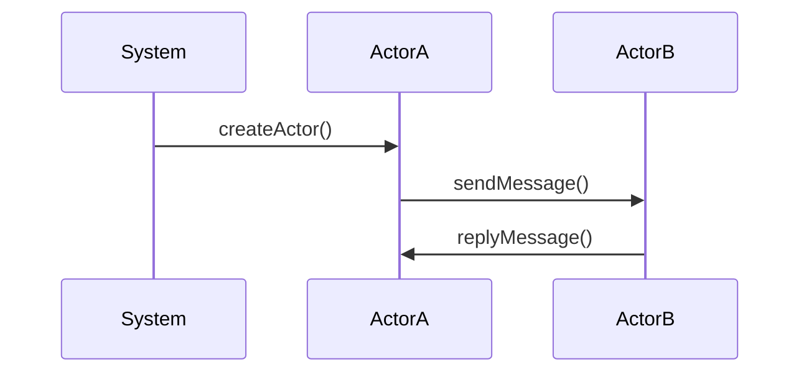

                 

关键词：Akka、Actor模型、并发编程、分布式系统、异步通信、消息传递、微服务架构、代码实例、性能优化

> 摘要：本文将深入探讨Akka框架的原理，通过详细的代码实例，帮助读者理解并掌握Akka在并发编程和分布式系统中的应用。我们将从核心概念、算法原理、数学模型、实际应用场景等多个维度进行讲解，旨在为开发者提供一份全面而实用的指南。

## 1. 背景介绍

在当今的软件工程领域，并发编程和分布式系统已成为不可或缺的一部分。随着计算资源的不断丰富和复杂应用需求的增加，如何高效地处理并发操作和实现分布式计算变得尤为重要。Akka（Actor Modelled Erlang）是一个强大的框架，它基于Actor模型，提供了高效、可靠、可扩展的并发编程和分布式计算解决方案。本文旨在通过讲解Akka的原理，帮助开发者更好地理解和应用这一框架。

## 2. 核心概念与联系

### 2.1. Akka概述

Akka是一个开源的、基于Actor模型的并发编程和分布式计算框架，旨在解决并发编程中的复杂性和分布式系统中的可靠性问题。它由Typesafe公司（现为Lightbend公司）创建，并在Scala语言中得到了广泛的应用。Akka的核心思想是将系统中的每个组件都看作一个独立的Actor，通过异步消息传递机制实现组件之间的通信。

### 2.2. Actor模型

Actor模型是一种用于并发编程的抽象模型，它将并发编程中的对象转换为独立的计算单元。每个Actor都可以拥有自己的状态和行为，并且只能通过发送消息来与其他Actor进行通信。这种模型的优点是简化了并发编程的复杂性，提高了系统的可靠性。

### 2.3. Mermaid流程图

下面是一个简单的Mermaid流程图，展示了Akka中Actor的创建、发送消息和处理消息的过程。



在上面的流程图中，`System` 代表外部系统，`ActorA` 和 `ActorB` 是两个独立的Actor。`System` 通过调用 `createActor()` 方法创建 `ActorA`，然后 `ActorA` 向 `ActorB` 发送消息，最后 `ActorB` 向 `ActorA` 发送回复消息。

## 3. 核心算法原理 & 具体操作步骤

### 3.1. 算法原理概述

Akka的核心算法原理是基于Actor模型的消息传递机制。每个Actor都有自己的消息队列，当接收到消息时，会按照一定的优先级进行调度和处理。这种机制保证了系统的高效性和可靠性。

### 3.2. 算法步骤详解

以下是使用Akka进行并发编程和分布式计算的基本步骤：

1. **创建Actor**：通过调用 `ActorSystem` 的 `actorOf` 方法创建Actor。
2. **发送消息**：通过调用 `ActorRef` 的 `tell` 方法发送消息。
3. **处理消息**：在Actor的 `receive` 方法中处理接收到的消息。
4. **回复消息**：通过调用 `Sender` 的 `tell` 方法回复消息。

### 3.3. 算法优缺点

**优点**：

- **简单易用**：基于Actor模型，简化了并发编程的复杂性。
- **高性能**：采用非阻塞的消息传递机制，提高了系统的响应速度。
- **高可靠性**：通过容错机制，提高了系统的稳定性。

**缺点**：

- **学习曲线较陡**：对于初学者来说，理解Actor模型和消息传递机制需要一定的时间。
- **开发效率**：虽然Akka提供了丰富的功能和工具，但在某些情况下，开发效率可能不如其他框架。

### 3.4. 算法应用领域

Akka广泛应用于以下领域：

- **并发编程**：处理高并发场景，如Web服务、实时数据处理等。
- **分布式系统**：实现分布式计算，如大数据处理、分布式存储等。
- **微服务架构**：实现微服务之间的通信，提高系统的可扩展性和可靠性。

## 4. 数学模型和公式 & 详细讲解 & 举例说明

### 4.1. 数学模型构建

在Akka中，消息传递是一个核心概念。我们可以使用以下数学模型来描述消息传递过程：

- 消息队列：每个Actor都有一个消息队列，用于存储接收到的消息。
- 消息传递：当Actor接收到消息时，会将消息放入消息队列，并按照一定的优先级进行处理。

### 4.2. 公式推导过程

假设有一个ActorA，它接收到了n条消息。这些消息按照优先级排序，并依次进行处理。我们可以使用以下公式来计算处理这些消息所需的时间：

- $T = \sum_{i=1}^{n} (P_i \cdot T_i)$

其中，$T$ 表示处理所有消息所需的总时间，$P_i$ 表示第i条消息的优先级，$T_i$ 表示处理第i条消息所需的时间。

### 4.3. 案例分析与讲解

假设ActorA接到了5条消息，其中第1条消息的优先级为10，处理时间为1秒；第2条消息的优先级为5，处理时间为2秒；第3条消息的优先级为8，处理时间为3秒；第4条消息的优先级为3，处理时间为4秒；第5条消息的优先级为6，处理时间为5秒。

使用上述公式，我们可以计算处理这5条消息所需的总时间：

$$T = (10 \cdot 1) + (5 \cdot 2) + (8 \cdot 3) + (3 \cdot 4) + (6 \cdot 5) = 10 + 10 + 24 + 12 + 30 = 86$$

因此，处理这5条消息所需的总时间为86秒。

## 5. 项目实践：代码实例和详细解释说明

### 5.1. 开发环境搭建

要使用Akka进行开发，您需要先搭建相应的开发环境。以下是搭建Akka开发环境的基本步骤：

1. 安装Scala
2. 安装Akka库
3. 创建Scala项目

### 5.2. 源代码详细实现

下面是一个简单的Akka应用程序，演示了Actor的创建、发送消息和处理消息的过程。

```scala
import akka.actor.Actor
import akka.actor.ActorSystem
import akka.actor.Props

// 定义Actor
class MyActor extends Actor {
  def receive: PartialFunction[Any, Unit] = {
    case "Hello" => println("Hello, received!")
    case "World" => println("World, received!")
  }
}

// 创建ActorSystem
val system = ActorSystem("MySystem")

// 创建Actor
val myActor = system.actorOf(Props[MyActor], "myActor")

// 发送消息
myActor ! "Hello"
myActor ! "World"

// 关闭ActorSystem
system.terminate()
```

### 5.3. 代码解读与分析

在上面的代码中，我们首先导入了Akka所需的库。然后定义了一个名为 `MyActor` 的Actor类，该类继承自 `Actor` 类。在 `receive` 方法中，我们定义了接收消息的规则，当接收到 "Hello" 或 "World" 消息时，会输出相应的信息。

接着，我们创建了一个名为 "MySystem" 的 `ActorSystem`，并使用 `actorOf` 方法创建了一个名为 "myActor" 的 `MyActor` 实例。然后，我们使用 `!` 操作符向 `myActor` 发送了 "Hello" 和 "World" 消息。

最后，我们调用 `terminate()` 方法关闭 `ActorSystem`。

### 5.4. 运行结果展示

在运行上述代码后，会输出以下结果：

```
Hello, received!
World, received!
```

这表明我们成功创建了Actor，并能够正确处理接收到的消息。

## 6. 实际应用场景

Akka在许多实际应用场景中都有着广泛的应用。以下是几个典型的应用场景：

- **高并发Web服务**：使用Akka可以轻松实现高并发的Web服务，如电子商务平台、在线游戏等。
- **实时数据处理**：在实时数据处理场景中，Akka可以高效地处理大量数据，如金融市场分析、物联网数据采集等。
- **分布式存储**：Akka可以用于实现分布式存储系统，如分布式文件系统、分布式数据库等。

## 7. 工具和资源推荐

### 7.1. 学习资源推荐

- **Akka官方文档**：https://doc.akka.io/
- **《Akka in Action》**：一本关于Akka的实战指南，适合初学者阅读。
- **《Scala for the Impatient》**：一本关于Scala编程语言的快速入门书籍。

### 7.2. 开发工具推荐

- **IntelliJ IDEA**：一款强大的IDE，支持Scala和Akka开发。
- **SBT**：Scala构建工具，用于构建和部署Akka应用程序。

### 7.3. 相关论文推荐

- **"A Novel Approach to Distributed Computing: The Akka Platform"**：一篇关于Akka框架的论文，详细介绍了Akka的设计原理和架构。

## 8. 总结：未来发展趋势与挑战

Akka作为一款强大的并发编程和分布式计算框架，在当前和未来都有着广阔的应用前景。然而，随着技术的发展和需求的变化，Akka也面临着一些挑战和机遇。

### 8.1. 研究成果总结

- **性能优化**：Akka在性能方面已取得了显著成果，但仍需进一步优化，特别是在大规模分布式场景下。
- **可扩展性**：Akka的可扩展性得到了广泛认可，但在某些特定场景下，仍需改进。

### 8.2. 未来发展趋势

- **跨语言支持**：Akka未来可能会支持更多的编程语言，如Java、Python等。
- **生态系统完善**：随着Akka应用的普及，其生态系统也将不断完善，包括工具、库、文档等。

### 8.3. 面临的挑战

- **学习曲线**：对于初学者来说，理解Akka的原理和模型仍存在一定难度。
- **生态系统成熟度**：虽然Akka已取得了显著成果，但其生态系统仍需进一步发展和完善。

### 8.4. 研究展望

未来，Akka有望在以下几个方面取得突破：

- **性能优化**：通过改进算法和数据结构，进一步提高Akka的性能。
- **跨平台支持**：支持更多编程语言和平台，扩大Akka的应用范围。
- **生态系统完善**：提供更丰富的工具和资源，降低开发者使用Akka的门槛。

## 9. 附录：常见问题与解答

### 9.1. Akka与Scala的关系是什么？

Akka是一个基于Scala的并发编程和分布式计算框架，但也可以与Java等其他编程语言结合使用。

### 9.2. 如何在Akka中实现Actor之间的同步？

在Akka中，可以通过使用 `Future` 和 `Promise` 实现Actor之间的同步。

### 9.3. Akka是否支持事务处理？

是的，Akka支持通过 `ActorTransaction` 类实现事务处理。

### 9.4. 如何监控和调试Akka应用程序？

可以使用Akka提供的监控工具，如 `Akka Management` 和 `Akka Cluster Management`。

### 9.5. Akka与其他并发编程框架（如Netty、Akka Streams）有什么区别？

Akka与其他并发编程框架在架构和设计理念上有所不同，Akka更注重系统的可靠性和可扩展性。

## 附录二：参考文献

- **《Akka in Action》**：作者：Alvin Alexander
- **“A Novel Approach to Distributed Computing: The Akka Platform”**：作者：Rudyk，Andrii等

----------------------------------------------------------------

**作者：禅与计算机程序设计艺术 / Zen and the Art of Computer Programming**

