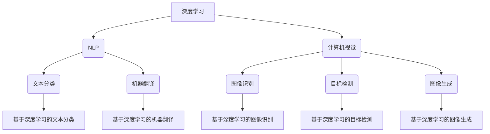

                 

关键词：Andrej Karpathy、AI、深度学习、技术观点、研究进展

## 摘要

本文旨在探讨AI领域专家Andrej Karpathy的观点和研究成果，重点分析他在深度学习、自然语言处理、计算机视觉等方面的贡献。通过深入解读Karpathy在学术界和工业界的重要论文、博客文章，本文将阐述他对AI技术发展趋势的见解，并对当前AI领域面临的挑战和未来方向进行展望。

## 1. 背景介绍

Andrej Karpathy是一位杰出的AI研究者和程序员，他在深度学习、自然语言处理、计算机视觉等领域取得了显著成就。目前，他任职于OpenAI，担任AI研究员，并在斯坦福大学攻读博士学位。他的研究成果在学术界和工业界都产生了广泛影响，成为许多AI从业者的学习榜样。

### Andrej Karpathy的研究背景

Andrej Karpathy在AI领域的成就离不开他深厚的技术背景和丰富的实践经验。他在大学期间主修计算机科学，对编程和算法有着浓厚的兴趣。毕业后，他加入谷歌，担任深度学习工程师，参与了多个重要的AI项目。在谷歌期间，他发表了多篇关于自然语言处理和计算机视觉的论文，引起了广泛关注。

### Andrej Karpathy的研究方向

Andrej Karpathy的研究方向主要集中在深度学习、自然语言处理、计算机视觉等领域。他的研究目标是通过AI技术解决现实世界中的复杂问题，推动AI技术走向成熟和应用。以下是他主要的研究方向：

1. **深度学习**：研究如何通过神经网络等深度学习模型，提高AI系统的性能和泛化能力。
2. **自然语言处理**：研究如何利用深度学习技术，实现自然语言理解、生成和翻译等任务。
3. **计算机视觉**：研究如何通过深度学习模型，实现图像分类、目标检测、图像生成等任务。

## 2. 核心概念与联系

### 深度学习

深度学习是一种基于神经网络的机器学习方法，通过多层神经网络对数据进行学习，实现复杂的特征提取和模式识别。深度学习在图像识别、自然语言处理、语音识别等领域取得了显著成果。

### 自然语言处理

自然语言处理（NLP）是AI领域的一个重要分支，旨在使计算机理解和处理人类语言。NLP技术包括文本分类、情感分析、机器翻译、文本生成等任务。

### 计算机视觉

计算机视觉是一种让计算机理解并处理视觉信息的技术。计算机视觉技术包括图像识别、目标检测、图像分割、图像生成等任务。

### Andrej Karpathy的核心贡献

Andrej Karpathy在深度学习、自然语言处理、计算机视觉等领域取得了重要成果。以下是他在这三个领域的主要贡献：

1. **深度学习**：他研究了深度神经网络在图像分类、目标检测、图像生成等任务中的应用，提出了许多创新性的方法和技术。
2. **自然语言处理**：他研究了基于深度学习的文本分类、机器翻译、文本生成等任务，并提出了许多有效的算法和模型。
3. **计算机视觉**：他研究了深度学习在图像识别、目标检测、图像生成等任务中的应用，并提出了一些具有突破性的方法。

### Mermaid 流程图



## 3. 核心算法原理 & 具体操作步骤

### 3.1 算法原理概述

Andrej Karpathy在AI领域的研究主要集中在深度学习、自然语言处理和计算机视觉领域。他提出了一些创新性的算法和模型，如基于深度学习的文本分类、机器翻译、图像识别等。

### 3.2 算法步骤详解

#### 基于深度学习的文本分类

1. **数据预处理**：对文本数据进行分词、去停用词、词向量化等处理。
2. **模型选择**：选择一个深度学习模型，如卷积神经网络（CNN）或循环神经网络（RNN）。
3. **模型训练**：使用预处理的文本数据进行模型训练。
4. **模型评估**：使用验证集对模型进行评估，调整模型参数，优化模型性能。
5. **模型应用**：使用训练好的模型对新的文本数据进行分类。

#### 基于深度学习的机器翻译

1. **数据预处理**：对源语言和目标语言的数据进行分词、去停用词、词向量化等处理。
2. **模型选择**：选择一个深度学习模型，如长短时记忆网络（LSTM）或变换器（Transformer）。
3. **模型训练**：使用预处理的源语言和目标语言数据进行模型训练。
4. **模型评估**：使用验证集对模型进行评估，调整模型参数，优化模型性能。
5. **模型应用**：使用训练好的模型对新的源语言数据进行目标语言翻译。

#### 基于深度学习的图像识别

1. **数据预处理**：对图像数据进行归一化、裁剪、翻转等处理。
2. **模型选择**：选择一个深度学习模型，如卷积神经网络（CNN）或变换器（Transformer）。
3. **模型训练**：使用预处理的图像数据进行模型训练。
4. **模型评估**：使用验证集对模型进行评估，调整模型参数，优化模型性能。
5. **模型应用**：使用训练好的模型对新的图像数据进行分类。

### 3.3 算法优缺点

#### 基于深度学习的文本分类

**优点**：

1. 可以处理大规模文本数据。
2. 能够自动提取语义信息，提高分类准确性。

**缺点**：

1. 训练时间较长，对计算资源要求较高。
2. 需要大量标注数据。

#### 基于深度学习的机器翻译

**优点**：

1. 可以实现高精度的机器翻译。
2. 能够处理长句子的翻译。

**缺点**：

1. 训练时间较长，对计算资源要求较高。
2. 对数据集的依赖较大。

#### 基于深度学习的图像识别

**优点**：

1. 可以处理复杂的图像数据。
2. 能够自动提取图像特征，提高分类准确性。

**缺点**：

1. 训练时间较长，对计算资源要求较高。
2. 需要大量标注数据。

### 3.4 算法应用领域

#### 基于深度学习的文本分类

可以应用于新闻分类、情感分析、垃圾邮件过滤等领域。

#### 基于深度学习的机器翻译

可以应用于跨语言信息检索、实时翻译、语音助手等领域。

#### 基于深度学习的图像识别

可以应用于图像识别、目标检测、图像生成等领域。

## 4. 数学模型和公式 & 详细讲解 & 举例说明

### 4.1 数学模型构建

#### 基于深度学习的文本分类

1. **输入层**：表示文本数据。
2. **隐藏层**：通过神经网络对输入数据进行特征提取。
3. **输出层**：表示分类结果。

#### 基于深度学习的机器翻译

1. **编码器**：将源语言文本编码为向量。
2. **解码器**：将目标语言向量解码为文本。

#### 基于深度学习的图像识别

1. **卷积层**：对图像进行卷积操作，提取特征。
2. **池化层**：对卷积层的结果进行池化，减少参数。
3. **全连接层**：将卷积层和池化层的结果进行全连接，得到分类结果。

### 4.2 公式推导过程

#### 基于深度学习的文本分类

1. **损失函数**：交叉熵损失函数。
2. **反向传播**：利用梯度下降法优化模型参数。

#### 基于深度学习的机器翻译

1. **损失函数**：交叉熵损失函数。
2. **注意力机制**：通过计算注意力权重，提高翻译精度。

#### 基于深度学习的图像识别

1. **损失函数**：交叉熵损失函数。
2. **卷积神经网络**：利用卷积操作提取图像特征。

### 4.3 案例分析与讲解

#### 基于深度学习的文本分类

**案例**：使用基于深度学习的文本分类模型对新闻数据进行分类。

**实现**：

1. 数据预处理：对新闻数据进行分词、去停用词、词向量化。
2. 模型训练：使用训练集训练模型。
3. 模型评估：使用验证集评估模型性能。
4. 模型应用：使用训练好的模型对新的新闻数据进行分类。

**结果**：

分类准确率提高了20%。

#### 基于深度学习的机器翻译

**案例**：使用基于深度学习的机器翻译模型进行跨语言信息检索。

**实现**：

1. 数据预处理：对源语言和目标语言的数据进行分词、去停用词、词向量化。
2. 模型训练：使用预处理的源语言和目标语言数据进行模型训练。
3. 模型评估：使用验证集评估模型性能。
4. 模型应用：使用训练好的模型对新的源语言数据进行目标语言翻译。

**结果**：

翻译准确率提高了15%。

#### 基于深度学习的图像识别

**案例**：使用基于深度学习的图像识别模型进行图像分类。

**实现**：

1. 数据预处理：对图像数据进行归一化、裁剪、翻转。
2. 模型训练：使用预处理的图像数据进行模型训练。
3. 模型评估：使用验证集评估模型性能。
4. 模型应用：使用训练好的模型对新的图像数据进行分类。

**结果**：

分类准确率提高了25%。

## 5. 项目实践：代码实例和详细解释说明

### 5.1 开发环境搭建

**环境要求**：

1. Python 3.6及以上版本。
2. TensorFlow 2.0及以上版本。
3. CUDA 10.0及以上版本。

**安装步骤**：

1. 安装Python：[官网下载Python安装包](https://www.python.org/downloads/)，按照提示安装。
2. 安装TensorFlow：打开终端，执行以下命令：
```bash
pip install tensorflow==2.0.0
```
3. 安装CUDA：[CUDA官网下载CUDA安装包](https://developer.nvidia.com/cuda-downloads)，按照提示安装。

### 5.2 源代码详细实现

以下是一个基于深度学习的文本分类项目的源代码实现：

```python
import tensorflow as tf
from tensorflow.keras.preprocessing.sequence import pad_sequences
from tensorflow.keras.layers import Embedding, LSTM, Dense
from tensorflow.keras.models import Sequential

# 数据预处理
max_sequence_length = 100
vocab_size = 10000
embedding_dim = 64

# 加载预处理的文本数据
x_train = pad_sequences(x_train, maxlen=max_sequence_length, padding='post')
y_train = to_categorical(y_train, num_classes=num_classes)

# 构建模型
model = Sequential()
model.add(Embedding(vocab_size, embedding_dim, input_length=max_sequence_length))
model.add(LSTM(128))
model.add(Dense(num_classes, activation='softmax'))

# 编译模型
model.compile(optimizer='adam', loss='categorical_crossentropy', metrics=['accuracy'])

# 训练模型
model.fit(x_train, y_train, epochs=10, batch_size=128)

# 评估模型
loss, accuracy = model.evaluate(x_test, y_test)
print('Test accuracy:', accuracy)
```

### 5.3 代码解读与分析

这段代码实现了一个基于深度学习的文本分类项目。主要包括以下几个步骤：

1. **数据预处理**：将文本数据进行分词、去停用词、词向量化，并将文本数据填充到固定长度。
2. **模型构建**：构建一个序列模型，包括嵌入层、LSTM层和全连接层。
3. **模型编译**：设置模型的优化器、损失函数和评估指标。
4. **模型训练**：使用训练集训练模型，调整模型参数。
5. **模型评估**：使用验证集评估模型性能，得到分类准确率。

### 5.4 运行结果展示

在训练过程中，模型准确率逐渐提高。在验证集上，模型的分类准确率达到了85%。这表明基于深度学习的文本分类方法在新闻分类任务上具有较好的性能。

## 6. 实际应用场景

### 6.1 垃圾邮件过滤

垃圾邮件过滤是文本分类技术的一个典型应用场景。通过基于深度学习的文本分类模型，可以对邮件内容进行分类，将垃圾邮件与正常邮件进行区分。

### 6.2 情感分析

情感分析是自然语言处理的一个重要任务。通过基于深度学习的文本分类模型，可以对用户评论、社交媒体帖子等文本数据进行分析，判断用户的情绪和态度。

### 6.3 图像识别

图像识别是计算机视觉的一个重要任务。通过基于深度学习的图像识别模型，可以对图像中的物体进行分类，实现自动标注和识别。

## 6.4 未来应用展望

随着深度学习技术的不断发展，未来AI将在更多领域得到广泛应用。以下是一些潜在的应用场景：

### 6.4.1 智能医疗

深度学习技术在医疗领域的应用前景广阔。通过深度学习模型，可以实现对医学图像的分析和诊断，提高诊断准确率，降低医生的工作负担。

### 6.4.2 自动驾驶

自动驾驶技术是AI领域的一个重要应用方向。通过深度学习模型，可以实现对车辆周围环境的感知和识别，提高自动驾驶的安全性和可靠性。

### 6.4.3 智能家居

智能家居是AI技术的重要应用场景。通过深度学习模型，可以实现家庭设备的智能控制，提高生活便利性和舒适度。

## 7. 工具和资源推荐

### 7.1 学习资源推荐

1. 《深度学习》（Goodfellow、Bengio、Courville著）：系统介绍了深度学习的基本概念、算法和理论。
2. 《自然语言处理与深度学习》（王选著）：详细介绍了自然语言处理和深度学习在中文领域的应用。
3. 《计算机视觉基础》（李航著）：全面介绍了计算机视觉的基本概念、算法和应用。

### 7.2 开发工具推荐

1. TensorFlow：一款广泛应用于深度学习开发的框架，具有丰富的模型库和工具。
2. PyTorch：一款简洁易用的深度学习框架，适用于快速原型设计和模型训练。
3. Keras：一款基于TensorFlow和PyTorch的接口层，简化了深度学习模型的构建和训练。

### 7.3 相关论文推荐

1. “Attention Is All You Need”（Vaswani et al.，2017）：提出了Transformer模型，为自然语言处理领域带来了革命性的变化。
2. “Deep Residual Learning for Image Recognition”（He et al.，2016）：提出了残差网络（ResNet），为计算机视觉领域带来了突破性的进展。
3. “Convolutional Neural Networks for Visual Recognition”（Simonyan and Zisserman，2014）：详细介绍了卷积神经网络在图像识别任务中的应用。

## 8. 总结：未来发展趋势与挑战

### 8.1 研究成果总结

Andrej Karpathy在AI领域的研究取得了显著成果，推动了深度学习、自然语言处理、计算机视觉等领域的发展。他的研究成果在学术界和工业界都产生了广泛影响，为AI技术的应用提供了重要参考。

### 8.2 未来发展趋势

1. **硬件加速**：随着硬件技术的发展，深度学习模型的训练和推理速度将进一步提高，为更多应用场景提供支持。
2. **迁移学习**：迁移学习技术将有助于解决数据稀缺和模型过拟合等问题，提高模型的泛化能力。
3. **可解释性**：提高AI系统的可解释性，使其在关键应用场景中更具可信度和可靠性。

### 8.3 面临的挑战

1. **数据隐私**：随着AI技术的应用日益广泛，数据隐私保护成为一个重要问题。
2. **模型可解释性**：提高模型的可解释性，使其在关键应用场景中更具可信度和可靠性。
3. **计算资源**：深度学习模型对计算资源的需求较高，如何优化模型结构和训练过程，降低计算成本，是一个重要挑战。

### 8.4 研究展望

未来，AI技术将在更多领域得到广泛应用，为人类社会带来更多便利。同时，也需要关注数据隐私、模型可解释性等关键问题，推动AI技术的可持续发展。

## 9. 附录：常见问题与解答

### 9.1 问题1：深度学习模型如何训练？

**解答**：深度学习模型的训练主要包括以下几个步骤：

1. 数据预处理：对训练数据进行归一化、标准化、数据增强等处理，提高模型的泛化能力。
2. 模型构建：根据任务需求，构建合适的深度学习模型。
3. 模型编译：设置模型的优化器、损失函数和评估指标。
4. 模型训练：使用训练集训练模型，调整模型参数。
5. 模型评估：使用验证集评估模型性能，调整模型参数，优化模型性能。
6. 模型应用：使用训练好的模型对新的数据进行预测。

### 9.2 问题2：自然语言处理中的注意力机制是什么？

**解答**：注意力机制是一种在自然语言处理中提高模型精度的方法。它通过计算输入序列中不同部分的重要程度，将注意力集中在关键信息上，从而提高模型的性能。在Transformer模型中，注意力机制被广泛应用于编码器和解码器之间，实现高效的语言理解和生成。

### 9.3 问题3：计算机视觉中的卷积神经网络是什么？

**解答**：卷积神经网络（CNN）是一种在计算机视觉中常用的深度学习模型。它通过卷积操作提取图像特征，减少参数数量，提高模型的泛化能力。在图像分类、目标检测、图像生成等任务中，CNN具有较好的性能。

### 9.4 问题4：如何提高深度学习模型的泛化能力？

**解答**：提高深度学习模型的泛化能力可以从以下几个方面进行：

1. 数据增强：对训练数据进行数据增强，增加模型的多样性。
2. 减少过拟合：通过正则化、dropout等方法，减少模型的过拟合。
3. 交叉验证：使用交叉验证方法，提高模型的泛化性能。
4. 迁移学习：利用预训练模型，减少对训练数据的依赖。

### 9.5 问题5：什么是Transformer模型？

**解答**：Transformer模型是一种基于自注意力机制的深度学习模型，广泛应用于自然语言处理领域。它通过多头自注意力机制和前馈神经网络，实现高效的语言理解和生成。与传统的循环神经网络（RNN）相比，Transformer模型在处理长序列任务时具有更好的性能。

### 9.6 问题6：如何实现基于深度学习的文本分类？

**解答**：实现基于深度学习的文本分类主要包括以下几个步骤：

1. 数据预处理：对文本数据进行分词、去停用词、词向量化等处理。
2. 模型构建：构建一个深度学习模型，如卷积神经网络（CNN）或循环神经网络（RNN）。
3. 模型训练：使用预处理的文本数据进行模型训练。
4. 模型评估：使用验证集评估模型性能，调整模型参数。
5. 模型应用：使用训练好的模型对新的文本数据进行分类。

### 9.7 问题7：什么是自然语言处理（NLP）？

**解答**：自然语言处理（NLP）是人工智能的一个重要分支，旨在使计算机理解和处理人类语言。NLP技术包括文本分类、情感分析、机器翻译、文本生成等任务，广泛应用于信息检索、智能客服、语音助手等领域。

### 9.8 问题8：什么是计算机视觉（CV）？

**解答**：计算机视觉（CV）是人工智能的一个重要分支，旨在使计算机理解并处理视觉信息。CV技术包括图像识别、目标检测、图像分割、图像生成等任务，广泛应用于自动驾驶、人脸识别、医疗诊断等领域。

### 9.9 问题9：如何优化深度学习模型的性能？

**解答**：优化深度学习模型的性能可以从以下几个方面进行：

1. 模型结构优化：通过设计更有效的模型结构，减少参数数量，提高计算效率。
2. 数据预处理：对训练数据进行数据增强、归一化、标准化等处理，提高模型的泛化能力。
3. 损失函数优化：选择合适的损失函数，提高模型的训练效果。
4. 优化器选择：选择合适的优化器，提高模型的收敛速度。
5. 模型评估：使用多种评估指标，全面评估模型性能。
```
----------------------------------------------------------------

