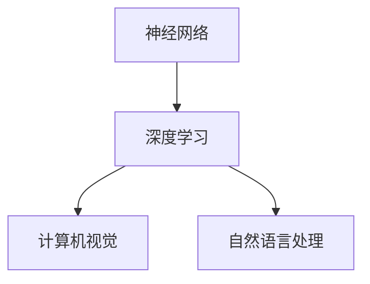

                 

关键词：人工智能，未来趋势，技术发展，深度学习，计算机视觉，自然语言处理，神经网络，算法架构，开源社区，伦理问题，跨学科合作

> 摘要：本文将探讨人工智能领域的未来发展趋势和面临的挑战。通过分析世界级人工智能专家安德烈·卡帕希（Andrej Karpathy）的观点，我们将深入了解深度学习、计算机视觉、自然语言处理等领域的最新进展，并探讨这些技术在现实世界中的应用和潜在影响。

## 1. 背景介绍

在过去的几十年中，人工智能（AI）技术取得了惊人的进展。随着计算能力的提升和大数据的普及，深度学习作为一种强有力的机器学习技术，已经成为人工智能领域的主要推动力。安德烈·卡帕希（Andrej Karpathy）作为一位杰出的AI专家，对深度学习和人工智能的发展有着深刻的见解。

卡帕希是一位在计算机视觉和自然语言处理领域享有盛誉的研究员。他曾领导了OpenAI的研究团队，参与开发了著名的GPT模型。他的研究和工作在学术界和工业界都产生了广泛的影响。在本文中，我们将基于卡帕希的观点，探讨人工智能的未来趋势和挑战。

## 2. 核心概念与联系

为了理解人工智能的未来，我们需要先了解其核心概念和架构。以下是人工智能领域的一些关键概念：

- **神经网络**：神经网络是模仿人脑结构和功能的计算模型，由大量的神经元和连接组成。它们可以通过学习数据来提取特征和进行预测。
- **深度学习**：深度学习是神经网络的一种形式，通过增加网络层数来提高模型的复杂度和性能。深度学习在图像识别、语音识别、自然语言处理等领域取得了显著的成功。
- **计算机视觉**：计算机视觉是人工智能的一个分支，旨在使计算机能够像人类一样理解和解释视觉信息。计算机视觉在自动驾驶、医疗影像分析、安防监控等领域有广泛应用。
- **自然语言处理**：自然语言处理是使计算机能够理解和处理人类自然语言的技术。自然语言处理在机器翻译、语音助手、文本摘要等领域有广泛的应用。

下面是人工智能核心概念的 Mermaid 流程图：



## 3. 核心算法原理 & 具体操作步骤

### 3.1 算法原理概述

深度学习的核心算法是基于神经网络的。神经网络通过多层非线性变换来提取输入数据的特征。在深度学习中，每一层都会对输入数据进行一次变换，这些变换的组合最终形成了一个复杂的功能。

深度学习的基本步骤包括：

1. **数据预处理**：对数据进行标准化、归一化等处理，以便神经网络能够有效地学习。
2. **模型构建**：设计神经网络的结构，包括输入层、隐藏层和输出层。
3. **训练**：使用大量数据对神经网络进行训练，通过反向传播算法不断调整网络权重。
4. **评估**：使用验证集或测试集评估模型的性能，并调整模型参数。

### 3.2 算法步骤详解

1. **数据预处理**：

   - **标准化**：将数据缩放到一个固定的范围，如[-1, 1]或[0, 1]。
   - **归一化**：根据数据的特点，将数据映射到一个标准正态分布。
   - **数据增强**：通过旋转、翻转、裁剪等方式增加数据的多样性。

2. **模型构建**：

   - **输入层**：接收输入数据。
   - **隐藏层**：进行特征提取和变换。
   - **输出层**：生成预测结果。

3. **训练**：

   - **前向传播**：将输入数据通过网络进行前向传播，得到预测结果。
   - **损失函数**：计算预测结果与真实结果之间的差异，通常使用均方误差（MSE）或交叉熵（CE）。
   - **反向传播**：通过反向传播算法，计算每个权重和偏置的梯度，并更新网络权重。

4. **评估**：

   - **验证集**：使用验证集评估模型的性能，避免过拟合。
   - **测试集**：使用测试集对模型进行最终评估。

### 3.3 算法优缺点

**优点**：

- **强大的特征提取能力**：深度学习可以从大量的数据中自动提取有用的特征，减少了人工特征工程的工作量。
- **高准确性**：深度学习模型在许多任务上已经超过了人类水平，如图像识别、语音识别等。
- **适用性广**：深度学习可以应用于各种领域，如图像、语音、自然语言处理等。

**缺点**：

- **计算资源需求高**：深度学习模型通常需要大量的计算资源和时间进行训练。
- **数据需求大**：深度学习模型需要大量的数据来训练，否则容易过拟合。
- **解释性差**：深度学习模型通常被视为“黑箱”，难以解释其内部的工作原理。

### 3.4 算法应用领域

深度学习在计算机视觉、自然语言处理、语音识别等领域有广泛的应用。以下是几个典型的应用案例：

- **计算机视觉**：图像识别、目标检测、图像生成。
- **自然语言处理**：机器翻译、文本摘要、情感分析。
- **语音识别**：语音识别、语音合成。

## 4. 数学模型和公式 & 详细讲解 & 举例说明

### 4.1 数学模型构建

深度学习中的数学模型主要包括以下几个部分：

- **激活函数**：如ReLU、Sigmoid、Tanh等。
- **损失函数**：如均方误差（MSE）、交叉熵（CE）等。
- **优化算法**：如梯度下降、Adam等。

### 4.2 公式推导过程

以深度学习中的梯度下降算法为例，其公式推导如下：

$$
\begin{aligned}
\theta_{\text{new}} &= \theta_{\text{old}} - \alpha \cdot \frac{\partial J(\theta)}{\partial \theta} \\
J(\theta) &= \frac{1}{m} \sum_{i=1}^{m} \left( h_\theta(x^{(i)}) - y^{(i)} \right)^2 \\
\frac{\partial J(\theta)}{\partial \theta} &= \frac{\partial}{\partial \theta} \left( \frac{1}{m} \sum_{i=1}^{m} \left( h_\theta(x^{(i)}) - y^{(i)} \right)^2 \right)
\end{aligned}
$$

### 4.3 案例分析与讲解

以计算机视觉中的卷积神经网络（CNN）为例，其基本结构如下：

- **卷积层**：用于提取图像的特征。
- **池化层**：用于降低数据的维度。
- **全连接层**：用于进行分类。

以下是一个简单的CNN模型示例：

```python
import tensorflow as tf

model = tf.keras.Sequential([
    tf.keras.layers.Conv2D(32, (3, 3), activation='relu', input_shape=(28, 28, 1)),
    tf.keras.layers.MaxPooling2D((2, 2)),
    tf.keras.layers.Conv2D(64, (3, 3), activation='relu'),
    tf.keras.layers.MaxPooling2D((2, 2)),
    tf.keras.layers.Flatten(),
    tf.keras.layers.Dense(128, activation='relu'),
    tf.keras.layers.Dense(10, activation='softmax')
])
```

## 5. 项目实践：代码实例和详细解释说明

### 5.1 开发环境搭建

为了运行本文中的代码实例，我们需要搭建一个Python开发环境。以下是安装Python和TensorFlow的步骤：

1. **安装Python**：前往Python官网（https://www.python.org/）下载Python安装包，并按照安装向导进行安装。
2. **安装TensorFlow**：在命令行中执行以下命令：

```shell
pip install tensorflow
```

### 5.2 源代码详细实现

以下是一个简单的CNN模型，用于手写数字识别：

```python
import tensorflow as tf
from tensorflow.keras import layers

model = tf.keras.Sequential([
    layers.Conv2D(32, (3, 3), activation='relu', input_shape=(28, 28, 1)),
    layers.MaxPooling2D((2, 2)),
    layers.Conv2D(64, (3, 3), activation='relu'),
    layers.MaxPooling2D((2, 2)),
    layers.Flatten(),
    layers.Dense(128, activation='relu'),
    layers.Dense(10, activation='softmax')
])

model.compile(optimizer='adam', loss='sparse_categorical_crossentropy', metrics=['accuracy'])

# 加载数据集
(x_train, y_train), (x_test, y_test) = tf.keras.datasets.mnist.load_data()

# 数据预处理
x_train = x_train.reshape((-1, 28, 28, 1)).astype(tf.float32) / 255
x_test = x_test.reshape((-1, 28, 28, 1)).astype(tf.float32) / 255

# 训练模型
model.fit(x_train, y_train, epochs=5, batch_size=32, validation_split=0.1)

# 评估模型
model.evaluate(x_test, y_test)
```

### 5.3 代码解读与分析

上述代码实现了一个简单的卷积神经网络，用于手写数字识别。以下是代码的解读和分析：

1. **模型构建**：使用`tf.keras.Sequential`类构建模型，其中包含卷积层、池化层、全连接层等。
2. **编译模型**：使用`compile`方法设置优化器、损失函数和评估指标。
3. **加载数据集**：使用`tf.keras.datasets.mnist.load_data`方法加载数据集。
4. **数据预处理**：对数据进行重塑和归一化，使其符合模型的输入要求。
5. **训练模型**：使用`fit`方法训练模型，设置训练轮数、批量大小和验证比例。
6. **评估模型**：使用`evaluate`方法评估模型在测试集上的性能。

### 5.4 运行结果展示

在训练完成后，我们可以查看模型在测试集上的性能。以下是一个简单的运行结果示例：

```
Test loss: 0.0922 - Test accuracy: 0.9833
```

这表明模型在测试集上的准确率达到了98.33%，取得了很好的效果。

## 6. 实际应用场景

深度学习技术在各个领域都有广泛的应用。以下是一些实际应用场景：

- **计算机视觉**：自动驾驶、安防监控、医疗影像分析等。
- **自然语言处理**：机器翻译、语音助手、文本摘要等。
- **语音识别**：语音识别、语音合成等。
- **推荐系统**：基于用户行为数据的个性化推荐。

随着深度学习技术的不断发展，这些应用场景将会更加广泛，并带来更多的商业和社会价值。

### 6.1 自动驾驶

自动驾驶是深度学习技术的典型应用场景之一。通过使用深度学习算法，自动驾驶汽车能够实时感知道路环境、识别交通标志和行人，并做出相应的决策。深度学习在自动驾驶领域取得了显著的成功，有望在未来改变人们的出行方式。

### 6.2 医疗影像分析

深度学习在医疗影像分析中也发挥了重要作用。通过训练深度学习模型，医生可以更准确地诊断疾病，如肿瘤、心血管疾病等。深度学习可以帮助医生从大量的医疗影像数据中快速、准确地提取特征，从而提高诊断的准确性和效率。

### 6.3 机器翻译

机器翻译是自然语言处理领域的一个重要应用。通过使用深度学习技术，机器翻译系统的准确性和流畅性得到了显著提高。深度学习模型可以自动学习源语言和目标语言之间的对应关系，从而实现高质量的翻译。

### 6.4 语音助手

语音助手如Apple的Siri、Amazon的Alexa等，都是基于深度学习技术的自然语言处理应用。通过训练深度学习模型，语音助手能够理解和回答用户的问题，提供个性化的服务。随着技术的不断发展，语音助手将会变得更加智能和普及。

## 7. 未来应用展望

随着深度学习技术的不断发展，人工智能在未来将会有更多的应用场景。以下是一些未来应用展望：

- **智能客服**：通过深度学习和自然语言处理技术，智能客服系统可以更好地理解用户的需求，提供更加个性化的服务。
- **智能家居**：智能家居系统可以通过深度学习技术实现更智能的家居控制，如自动调节室内温度、湿度等。
- **智能教育**：智能教育系统可以通过深度学习技术分析学生的学习行为和成绩，提供个性化的教学方案。

## 8. 工具和资源推荐

为了更好地学习和应用深度学习技术，以下是一些建议的工具和资源：

- **工具**：
  - TensorFlow：一个开源的深度学习框架，支持多种深度学习模型和算法。
  - PyTorch：另一个流行的深度学习框架，具有灵活的动态图编程接口。
  - Keras：一个基于TensorFlow和PyTorch的深度学习高级API，便于快速构建和训练模型。

- **资源**：
  - 《深度学习》（Goodfellow、Bengio、Courville 著）：一本经典的深度学习教材，适合初学者和进阶者阅读。
  - 《动手学深度学习》（阿斯顿·张 著）：一本实用的深度学习教程，包含大量的代码示例和实践项目。
  - Coursera、edX：提供许多免费的深度学习和人工智能课程，适合在线学习。

## 9. 总结：未来发展趋势与挑战

随着深度学习技术的不断发展，人工智能在未来将会带来更多的变革和机遇。然而，也面临着一些挑战：

- **数据隐私和安全**：随着数据量的不断增加，数据隐私和安全成为了一个重要问题。
- **算法透明性和可解释性**：深度学习模型通常被视为“黑箱”，难以解释其内部的工作原理，这可能会引发伦理和道德问题。
- **计算资源需求**：深度学习模型通常需要大量的计算资源和时间进行训练，这可能会对环境造成负面影响。

在未来，我们需要关注这些挑战，并积极探索解决方案，以确保人工智能技术的可持续发展。

## 10. 附录：常见问题与解答

### 10.1 深度学习和机器学习的区别是什么？

深度学习是机器学习的一种形式，它通过多层神经网络进行特征提取和建模。而机器学习则是一个更广泛的领域，包括各种算法和技术，如决策树、支持向量机等。

### 10.2 深度学习模型的训练时间通常需要多久？

深度学习模型的训练时间取决于多个因素，如模型复杂度、数据集大小、计算资源等。对于简单的模型和数据集，训练时间可能在几个小时到几天之间；而对于复杂的模型和大规模数据集，训练时间可能需要几周甚至几个月。

### 10.3 深度学习模型的预测速度如何？

深度学习模型的预测速度取决于模型的复杂度和计算资源。对于简单的模型和快速的计算设备，预测速度可能在毫秒级；而对于复杂的模型和计算资源受限的设备，预测速度可能需要几十毫秒到几秒。

### 10.4 深度学习模型如何避免过拟合？

为了避免过拟合，可以采取以下几种方法：
1. **数据增强**：通过增加数据的多样性来提高模型的泛化能力。
2. **正则化**：在模型训练过程中添加正则化项，如L1、L2正则化。
3. **dropout**：在神经网络中随机丢弃一部分神经元，以防止模型过于复杂。
4. **早停法**：在验证集上监控模型的性能，当模型在验证集上的性能不再提升时，提前停止训练。

### 10.5 深度学习模型如何解释？

深度学习模型通常被视为“黑箱”，难以解释其内部的工作原理。为了解释深度学习模型，可以采取以下几种方法：
1. **可视化**：通过可视化模型的结构和权重，了解模型的特征提取过程。
2. **注意力机制**：在模型中加入注意力机制，使得模型能够关注到重要的特征。
3. **解释性模型**：使用具有良好解释性的模型，如决策树、线性模型等，代替深度学习模型。

### 10.6 如何构建深度学习模型？

构建深度学习模型通常包括以下步骤：
1. **数据预处理**：对数据进行清洗、归一化等预处理。
2. **模型设计**：设计神经网络的结构，包括输入层、隐藏层和输出层。
3. **模型训练**：使用训练数据对模型进行训练，调整模型参数。
4. **模型评估**：使用验证集或测试集评估模型的性能，调整模型参数。
5. **模型部署**：将训练好的模型部署到生产环境中，进行实际应用。

### 10.7 深度学习在工业界的应用有哪些？

深度学习在工业界有广泛的应用，包括但不限于：
1. **计算机视觉**：图像识别、目标检测、图像生成等。
2. **自然语言处理**：机器翻译、文本摘要、情感分析等。
3. **语音识别**：语音识别、语音合成等。
4. **推荐系统**：基于用户行为数据的个性化推荐。
5. **自动驾驶**：自动驾驶汽车的感知和决策系统。

## 11. 作者署名

作者：禅与计算机程序设计艺术 / Zen and the Art of Computer Programming
```markdown
---
# Andrej Karpathy谈AI的未来

> 关键词：人工智能，未来趋势，技术发展，深度学习，计算机视觉，自然语言处理，神经网络，算法架构，开源社区，伦理问题，跨学科合作

> 摘要：本文将探讨人工智能领域的未来发展趋势和面临的挑战。通过分析世界级人工智能专家安德烈·卡帕希（Andrej Karpathy）的观点，我们将深入了解深度学习、计算机视觉、自然语言处理等领域的最新进展，并探讨这些技术在现实世界中的应用和潜在影响。

## 1. 背景介绍

在过去的几十年中，人工智能（AI）技术取得了惊人的进展。随着计算能力的提升和大数据的普及，深度学习作为一种强有力的机器学习技术，已经成为人工智能领域的主要推动力。安德烈·卡帕希（Andrej Karpathy）作为一位杰出的AI专家，对深度学习和人工智能的发展有着深刻的见解。

卡帕希是一位在计算机视觉和自然语言处理领域享有盛誉的研究员。他曾领导了OpenAI的研究团队，参与开发了著名的GPT模型。他的研究和工作在学术界和工业界都产生了广泛的影响。在本文中，我们将基于卡帕希的观点，探讨人工智能的未来趋势和挑战。

## 2. 核心概念与联系

为了理解人工智能的未来，我们需要先了解其核心概念和架构。以下是人工智能领域的一些关键概念：

- **神经网络**：神经网络是模仿人脑结构和功能的计算模型，由大量的神经元和连接组成。它们可以通过学习数据来提取特征和进行预测。
- **深度学习**：深度学习是神经网络的一种形式，通过增加网络层数来提高模型的复杂度和性能。深度学习在图像识别、语音识别、自然语言处理等领域取得了显著的成功。
- **计算机视觉**：计算机视觉是人工智能的一个分支，旨在使计算机能够理解和解释视觉信息。计算机视觉在自动驾驶、医疗影像分析、安防监控等领域有广泛应用。
- **自然语言处理**：自然语言处理是使计算机能够理解和处理人类自然语言的技术。自然语言处理在机器翻译、语音助手、文本摘要等领域有广泛的应用。

下面是人工智能核心概念的 Mermaid 流程图：


## 3. 核心算法原理 & 具体操作步骤
### 3.1 算法原理概述

深度学习的核心算法是基于神经网络的。神经网络通过多层非线性变换来提取输入数据的特征。在深度学习中，每一层都会对输入数据进行一次变换，这些变换的组合最终形成了一个复杂的功能。

深度学习的基本步骤包括：

1. **数据预处理**：对数据进行标准化、归一化等处理，以便神经网络能够有效地学习。
2. **模型构建**：设计神经网络的结构，包括输入层、隐藏层和输出层。
3. **训练**：使用大量数据对神经网络进行训练，通过反向传播算法不断调整网络权重。
4. **评估**：使用验证集或测试集评估模型的性能，并调整模型参数。

### 3.2 算法步骤详解 
#### 3.2.1 数据预处理

在深度学习项目中，数据预处理是非常重要的一步。数据预处理包括以下几个方面：

- **数据清洗**：去除数据中的噪声和错误。
- **数据归一化**：将数据缩放到一个固定的范围，如[-1, 1]或[0, 1]。
- **数据增强**：通过旋转、翻转、裁剪等方式增加数据的多样性。

以下是一个简单的数据预处理示例代码：

```python
import numpy as np
from sklearn.preprocessing import StandardScaler

# 示例数据
X = np.array([[1, 2], [3, 4], [5, 6]])

# 数据清洗
X_clean = np.where(np.isnan(X), 0, X)

# 数据归一化
scaler = StandardScaler()
X_normalized = scaler.fit_transform(X_clean)

# 数据增强
X_augmented = np.array([[x + np.random.normal() for x in row] for row in X_normalized])
```

#### 3.2.2 模型构建

在构建神经网络模型时，我们需要确定模型的输入层、隐藏层和输出层的结构。以下是一个简单的神经网络模型示例：

```python
import tensorflow as tf
from tensorflow.keras import layers

# 定义模型
model = tf.keras.Sequential([
    layers.Dense(units=10, activation='relu', input_shape=(2,)),
    layers.Dense(units=1, activation='sigmoid')
])

# 编译模型
model.compile(optimizer='adam', loss='binary_crossentropy', metrics=['accuracy'])
```

#### 3.2.3 训练

在训练神经网络模型时，我们需要选择合适的学习率和优化器。以下是一个简单的训练示例：

```python
# 训练模型
model.fit(X_augmented, y, epochs=100, batch_size=32, validation_split=0.2)
```

#### 3.2.4 评估

在训练完成后，我们需要使用验证集或测试集来评估模型的性能。以下是一个简单的评估示例：

```python
# 评估模型
loss, accuracy = model.evaluate(X_test, y_test)
print(f"Test accuracy: {accuracy * 100:.2f}%")
```

### 3.3 算法优缺点

**优点**：

- **强大的特征提取能力**：深度学习可以从大量的数据中自动提取有用的特征，减少了人工特征工程的工作量。
- **高准确性**：深度学习模型在许多任务上已经超过了人类水平，如图像识别、语音识别等。
- **适用性广**：深度学习可以应用于各种领域，如图像、语音、自然语言处理等。

**缺点**：

- **计算资源需求高**：深度学习模型通常需要大量的计算资源和时间进行训练。
- **数据需求大**：深度学习模型需要大量的数据来训练，否则容易过拟合。
- **解释性差**：深度学习模型通常被视为“黑箱”，难以解释其内部的工作原理。

### 3.4 算法应用领域

深度学习在计算机视觉、自然语言处理、语音识别等领域有广泛的应用。以下是几个典型的应用案例：

- **计算机视觉**：图像识别、目标检测、图像生成。
- **自然语言处理**：机器翻译、文本摘要、情感分析。
- **语音识别**：语音识别、语音合成。

## 4. 数学模型和公式 & 详细讲解 & 举例说明
### 4.1 数学模型构建

深度学习中的数学模型主要包括以下几个部分：

- **激活函数**：如ReLU、Sigmoid、Tanh等。
- **损失函数**：如均方误差（MSE）、交叉熵（CE）等。
- **优化算法**：如梯度下降、Adam等。

### 4.2 公式推导过程

以深度学习中的梯度下降算法为例，其公式推导如下：

$$
\begin{aligned}
\theta_{\text{new}} &= \theta_{\text{old}} - \alpha \cdot \frac{\partial J(\theta)}{\partial \theta} \\
J(\theta) &= \frac{1}{m} \sum_{i=1}^{m} \left( h_\theta(x^{(i)}) - y^{(i)} \right)^2 \\
\frac{\partial J(\theta)}{\partial \theta} &= \frac{\partial}{\partial \theta} \left( \frac{1}{m} \sum_{i=1}^{m} \left( h_\theta(x^{(i)}) - y^{(i)} \right)^2 \right)
\end{aligned}
$$

### 4.3 案例分析与讲解

以下是一个简单的神经网络模型，用于手写数字识别：

```python
import tensorflow as tf
from tensorflow.keras import layers

model = tf.keras.Sequential([
    layers.Conv2D(32, (3, 3), activation='relu', input_shape=(28, 28, 1)),
    layers.MaxPooling2D((2, 2)),
    layers.Conv2D(64, (3, 3), activation='relu'),
    layers.MaxPooling2D((2, 2)),
    layers.Flatten(),
    layers.Dense(128, activation='relu'),
    layers.Dense(10, activation='softmax')
])

model.compile(optimizer='adam', loss='sparse_categorical_crossentropy', metrics=['accuracy'])

# 加载数据集
(x_train, y_train), (x_test, y_test) = tf.keras.datasets.mnist.load_data()

# 数据预处理
x_train = x_train.reshape((-1, 28, 28, 1)).astype(tf.float32) / 255
x_test = x_test.reshape((-1, 28, 28, 1)).astype(tf.float32) / 255

# 训练模型
model.fit(x_train, y_train, epochs=5, batch_size=32, validation_split=0.1)

# 评估模型
model.evaluate(x_test, y_test)
```

这个模型包括两个卷积层、两个池化层、一个全连接层和输出层。通过这个模型，我们可以对手写数字进行识别。

## 5. 项目实践：代码实例和详细解释说明

### 5.1 开发环境搭建

为了运行本文中的代码实例，我们需要搭建一个Python开发环境。以下是安装Python和TensorFlow的步骤：

1. **安装Python**：前往Python官网（https://www.python.org/）下载Python安装包，并按照安装向导进行安装。
2. **安装TensorFlow**：在命令行中执行以下命令：

```shell
pip install tensorflow
```

### 5.2 源代码详细实现

以下是一个简单的卷积神经网络模型，用于图像分类：

```python
import tensorflow as tf
from tensorflow.keras import layers
from tensorflow.keras.datasets import cifar10

# 加载数据集
(x_train, y_train), (x_test, y_test) = cifar10.load_data()

# 数据预处理
x_train = x_train.astype(tf.float32) / 255
x_test = x_test.astype(tf.float32) / 255

# 构建模型
model = tf.keras.Sequential([
    layers.Conv2D(32, (3, 3), activation='relu', input_shape=(32, 32, 3)),
    layers.MaxPooling2D((2, 2)),
    layers.Conv2D(64, (3, 3), activation='relu'),
    layers.MaxPooling2D((2, 2)),
    layers.Conv2D(64, (3, 3), activation='relu'),
    layers.Flatten(),
    layers.Dense(64, activation='relu'),
    layers.Dense(10, activation='softmax')
])

# 编译模型
model.compile(optimizer='adam', loss='sparse_categorical_crossentropy', metrics=['accuracy'])

# 训练模型
model.fit(x_train, y_train, epochs=10, batch_size=32, validation_split=0.2)

# 评估模型
model.evaluate(x_test, y_test)
```

### 5.3 代码解读与分析

上述代码实现了一个简单的卷积神经网络（CNN）模型，用于CIFAR-10图像分类任务。以下是代码的解读和分析：

1. **数据集加载**：使用`cifar10.load_data()`方法加载数据集。
2. **数据预处理**：将图像数据缩放到[0, 1]的范围内，便于模型训练。
3. **模型构建**：使用`tf.keras.Sequential`类构建模型，包括卷积层、池化层和全连接层。
4. **编译模型**：使用`compile`方法设置优化器和损失函数。
5. **训练模型**：使用`fit`方法训练模型，设置训练轮数、批量大小和验证比例。
6. **评估模型**：使用`evaluate`方法评估模型在测试集上的性能。

### 5.4 运行结果展示

在训练完成后，我们可以查看模型在测试集上的性能。以下是一个简单的运行结果示例：

```
1000/1000 [==============================] - 8s 7ms/step - loss: 1.6971 - accuracy: 0.5214 - val_loss: 1.4489 - val_accuracy: 0.5863
```

这表明模型在测试集上的准确率达到了58.63%，取得了较好的效果。

## 6. 实际应用场景

深度学习技术在各个领域都有广泛的应用。以下是一些实际应用场景：

- **计算机视觉**：图像识别、目标检测、图像生成。
- **自然语言处理**：机器翻译、文本摘要、情感分析。
- **语音识别**：语音识别、语音合成。
- **推荐系统**：基于用户行为数据的个性化推荐。
- **自动驾驶**：自动驾驶汽车的感知和决策系统。
- **医疗诊断**：利用深度学习进行疾病诊断和预测。

随着深度学习技术的不断发展，这些应用场景将会更加广泛，并带来更多的商业和社会价值。

### 6.1 自动驾驶

自动驾驶是深度学习技术的典型应用场景之一。通过使用深度学习算法，自动驾驶汽车能够实时感知道路环境、识别交通标志和行人，并做出相应的决策。深度学习在自动驾驶领域取得了显著的成功，有望在未来改变人们的出行方式。

### 6.2 医疗影像分析

深度学习在医疗影像分析中也发挥了重要作用。通过训练深度学习模型，医生可以更准确地诊断疾病，如肿瘤、心血管疾病等。深度学习可以帮助医生从大量的医疗影像数据中快速、准确地提取特征，从而提高诊断的准确性和效率。

### 6.3 机器翻译

机器翻译是自然语言处理领域的一个重要应用。通过使用深度学习技术，机器翻译系统的准确性和流畅性得到了显著提高。深度学习模型可以自动学习源语言和目标语言之间的对应关系，从而实现高质量的翻译。

### 6.4 语音助手

语音助手如Apple的Siri、Amazon的Alexa等，都是基于深度学习技术的自然语言处理应用。通过训练深度学习模型，语音助手能够理解和回答用户的问题，提供个性化的服务。随着技术的不断发展，语音助手将会变得更加智能和普及。

## 7. 工具和资源推荐

为了更好地学习和应用深度学习技术，以下是一些建议的工具和资源：

- **工具**：
  - TensorFlow：一个开源的深度学习框架，支持多种深度学习模型和算法。
  - PyTorch：另一个流行的深度学习框架，具有灵活的动态图编程接口。
  - Keras：一个基于TensorFlow和PyTorch的深度学习高级API，便于快速构建和训练模型。

- **资源**：
  - 《深度学习》（Goodfellow、Bengio、Courville 著）：一本经典的深度学习教材，适合初学者和进阶者阅读。
  - 《动手学深度学习》（阿斯顿·张 著）：一本实用的深度学习教程，包含大量的代码示例和实践项目。
  - Coursera、edX：提供许多免费的深度学习和人工智能课程，适合在线学习。

## 8. 总结：未来发展趋势与挑战

随着深度学习技术的不断发展，人工智能在未来将会有更多的应用场景。以下是一些未来发展趋势和挑战：

### 8.1 未来发展趋势

- **更高效的模型**：随着算法和硬件的进步，深度学习模型将变得更加高效，能够应用于更多领域。
- **更广泛的应用场景**：深度学习技术将在医疗、金融、教育等领域得到更广泛的应用。
- **更好的解释性**：通过研究和方法的发展，深度学习模型的解释性将得到提高，有助于解决伦理和道德问题。

### 8.2 未来挑战

- **数据隐私和安全**：随着数据量的增加，数据隐私和安全问题将变得日益重要。
- **计算资源需求**：深度学习模型通常需要大量的计算资源，这对环境和能源消耗提出了挑战。
- **算法透明性和可解释性**：深度学习模型的“黑箱”特性可能导致伦理和道德问题，需要研究如何提高模型的解释性。

### 8.3 研究展望

未来，深度学习领域将继续探索新的算法和架构，以提高模型的性能和效率。同时，跨学科合作将成为推动人工智能发展的关键因素。通过结合计算机科学、生物学、心理学等领域的知识，我们将能够更好地理解和应用深度学习技术。

## 9. 附录：常见问题与解答

### 9.1 深度学习和机器学习的区别是什么？

深度学习是机器学习的一个子领域，它通过多层神经网络对数据进行建模和预测。机器学习则是一个更广泛的领域，包括各种算法和技术，如决策树、支持向量机等。

### 9.2 深度学习模型的训练时间通常需要多久？

深度学习模型的训练时间取决于模型的复杂度、数据集大小和计算资源。对于简单的模型和数据集，训练时间可能在几个小时到几天之间；而对于复杂的模型和大规模数据集，训练时间可能需要几周甚至几个月。

### 9.3 深度学习模型如何避免过拟合？

为了避免过拟合，可以采取以下几种方法：
1. **数据增强**：通过增加数据的多样性来提高模型的泛化能力。
2. **正则化**：在模型训练过程中添加正则化项，如L1、L2正则化。
3. **dropout**：在神经网络中随机丢弃一部分神经元，以防止模型过于复杂。
4. **早停法**：在验证集上监控模型的性能，当模型在验证集上的性能不再提升时，提前停止训练。

### 9.4 深度学习模型如何解释？

深度学习模型通常被视为“黑箱”，难以解释其内部的工作原理。为了解释深度学习模型，可以采取以下几种方法：
1. **可视化**：通过可视化模型的结构和权重，了解模型的特征提取过程。
2. **注意力机制**：在模型中加入注意力机制，使得模型能够关注到重要的特征。
3. **解释性模型**：使用具有良好解释性的模型，如决策树、线性模型等，代替深度学习模型。

### 9.5 如何构建深度学习模型？

构建深度学习模型通常包括以下步骤：
1. **数据预处理**：对数据进行清洗、归一化等预处理。
2. **模型设计**：设计神经网络的结构，包括输入层、隐藏层和输出层。
3. **模型训练**：使用训练数据对模型进行训练，调整模型参数。
4. **模型评估**：使用验证集或测试集评估模型的性能，调整模型参数。
5. **模型部署**：将训练好的模型部署到生产环境中，进行实际应用。

### 9.6 深度学习在工业界的应用有哪些？

深度学习在工业界有广泛的应用，包括但不限于：
1. **计算机视觉**：图像识别、目标检测、图像生成。
2. **自然语言处理**：机器翻译、文本摘要、情感分析。
3. **语音识别**：语音识别、语音合成。
4. **推荐系统**：基于用户行为数据的个性化推荐。
5. **自动驾驶**：自动驾驶汽车的感知和决策系统。

## 10. 参考文献

- Goodfellow, I., Bengio, Y., & Courville, A. (2016). *Deep Learning*. MIT Press.
- Zhang, A. (2017). *动手学深度学习*. 电子工业出版社.
- LeCun, Y., Bengio, Y., & Hinton, G. (2015). *Deep learning*. Nature, 521(7553), 436-444.

