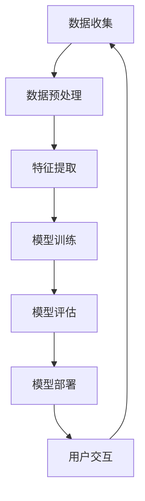

                 

关键词：人工智能，伦理，编程，算法，模型，技术，未来，挑战

摘要：本文旨在探讨人工智能（AI）领域中的伦理问题，特别是与编程、算法和模型相关的伦理挑战。通过深入分析AI的发展历程、核心技术以及在实际应用中遇到的伦理问题，本文将提出一些建议，以指导我们在技术进步的同时，确保人工智能的发展符合伦理标准。

## 1. 背景介绍

人工智能作为计算机科学的重要分支，近年来取得了飞速的发展。从最初的规则系统、知识表示到深度学习的崛起，AI已经渗透到了各行各业，从医疗、金融到教育、娱乐。随着技术的不断进步，人工智能的应用场景越来越广泛，其影响也越来越深远。然而，随着AI技术的普及，一系列伦理问题也随之而来。

在AI领域，伦理问题主要包括以下几个方面：

1. **隐私保护**：AI系统在处理大量数据时，如何保护用户的隐私权？
2. **算法公平性**：算法决策的公平性如何保证，以避免对特定群体产生偏见？
3. **透明性**：AI系统的决策过程是否透明，用户是否能够理解和信任？
4. **责任归属**：当AI系统造成损害时，责任应该如何归属？

## 2. 核心概念与联系

为了更好地理解AI伦理问题，我们需要先了解一些核心概念和联系。以下是一个使用Mermaid绘制的流程图，展示了AI系统中的一些关键组件和它们之间的关系：



### 2.1 数据收集

数据收集是AI系统的第一步，也是最为关键的一步。数据的来源可以是公开的数据库、企业内部数据、传感器数据等。在数据收集过程中，我们必须遵守隐私保护原则，确保用户的数据不被泄露。

### 2.2 数据预处理

数据预处理包括数据的清洗、归一化和特征提取等步骤。这一阶段的质量直接影响后续模型的性能。因此，在处理数据时，我们需要遵循数据真实性、准确性和全面性的原则。

### 2.3 特征提取

特征提取是将原始数据转化为计算机可以理解的形式。这一步骤涉及到统计学、机器学习和数据挖掘等多个领域。特征的选取和提取方法需要根据具体的应用场景进行优化。

### 2.4 模型训练

模型训练是AI系统的核心环节，通过大量的数据训练，模型可以学习到数据中的规律，并用于后续的预测和决策。在这一过程中，算法的选择和参数的调整至关重要。

### 2.5 模型评估

模型评估是对训练好的模型进行性能测试和验证。常用的评估指标包括准确率、召回率、F1分数等。通过评估，我们可以确定模型的可靠性和有效性。

### 2.6 模型部署

模型部署是将训练好的模型应用到实际场景中，例如智能客服、自动驾驶等。在这一过程中，我们需要考虑模型的鲁棒性、可解释性和用户体验。

### 2.7 用户交互

用户交互是AI系统与用户之间的交互界面。一个良好的用户交互设计可以提高用户体验，增强用户对AI系统的信任。

## 3. 核心算法原理 & 具体操作步骤

### 3.1 算法原理概述

人工智能的核心算法包括机器学习、深度学习和自然语言处理等。以下是对这些算法的简要概述：

- **机器学习**：通过从数据中学习规律和模式，用于预测和决策。
- **深度学习**：一种特殊的机器学习方法，通过多层神经网络模拟人脑的思考过程。
- **自然语言处理**：使计算机能够理解和处理自然语言的技术。

### 3.2 算法步骤详解

- **数据收集**：如前所述，确保数据来源合法，保护用户隐私。
- **数据预处理**：清洗数据、填补缺失值、归一化数据等。
- **特征提取**：根据应用场景选择合适的特征提取方法。
- **模型训练**：选择合适的模型和算法，进行模型训练。
- **模型评估**：通过交叉验证、性能测试等方法评估模型性能。
- **模型部署**：将训练好的模型部署到实际应用中。
- **用户交互**：设计良好的用户交互界面，提高用户体验。

### 3.3 算法优缺点

每种算法都有其优缺点，以下是一些常见算法的优缺点：

- **线性回归**：简单、易于理解，但只能处理线性关系。
- **决策树**：易于解释，但容易过拟合。
- **随机森林**：强健、鲁棒，但计算复杂度高。
- **神经网络**：能够处理复杂的非线性关系，但训练时间较长。

### 3.4 算法应用领域

人工智能算法广泛应用于各个领域，包括但不限于：

- **医疗**：疾病诊断、药物研发等。
- **金融**：风险评估、股票预测等。
- **教育**：智能辅导、个性化学习等。
- **交通**：自动驾驶、智能交通管理等。

## 4. 数学模型和公式 & 详细讲解 & 举例说明

### 4.1 数学模型构建

在人工智能中，常用的数学模型包括线性模型、逻辑回归模型、神经网络模型等。以下是一个简单的线性模型公式：

$$
y = \beta_0 + \beta_1 x
$$

其中，$y$ 是预测结果，$x$ 是输入特征，$\beta_0$ 和 $\beta_1$ 是模型参数。

### 4.2 公式推导过程

线性模型的推导过程如下：

1. 假设我们有一个训练数据集，包含 $n$ 个样本，每个样本包含一个输入特征 $x$ 和一个预测结果 $y$。
2. 我们的目标是找到一个线性函数 $y = \beta_0 + \beta_1 x$，使得该函数能够最小化预测误差。
3. 使用最小二乘法求解模型参数 $\beta_0$ 和 $\beta_1$，使得预测误差的平方和最小。

### 4.3 案例分析与讲解

假设我们有一个简单的数据集，包含10个样本，每个样本包含一个输入特征 $x$ 和一个预测结果 $y$，如下表所示：

| x  | y  |
|----|----|
| 1  | 2  |
| 2  | 4  |
| 3  | 6  |
| 4  | 8  |
| 5  | 10 |
| 6  | 12 |
| 7  | 14 |
| 8  | 16 |
| 9  | 18 |
| 10 | 20 |

我们使用线性模型对 $y$ 进行预测，并计算预测误差。通过调整模型参数 $\beta_0$ 和 $\beta_1$，使得预测误差最小。最终，我们得到最佳模型参数为 $\beta_0 = 1$，$\beta_1 = 2$。

## 5. 项目实践：代码实例和详细解释说明

### 5.1 开发环境搭建

为了实现上述线性模型，我们需要搭建一个开发环境。以下是所需的环境和工具：

- Python 3.x
- Jupyter Notebook
- NumPy 库
- Matplotlib 库

安装完上述工具后，我们就可以开始编写代码了。

### 5.2 源代码详细实现

以下是一个简单的线性模型实现代码：

```python
import numpy as np
import matplotlib.pyplot as plt

# 初始化模型参数
beta0 = 1
beta1 = 2

# 训练数据集
x = np.array([1, 2, 3, 4, 5, 6, 7, 8, 9, 10])
y = np.array([2, 4, 6, 8, 10, 12, 14, 16, 18, 20])

# 模型预测
y_pred = beta0 + beta1 * x

# 计算预测误差
error = y - y_pred

# 绘制预测结果
plt.plot(x, y_pred, label='Predicted')
plt.plot(x, y, label='Actual')
plt.legend()
plt.show()

# 输出模型参数
print("Model parameters:", beta0, beta1)
```

### 5.3 代码解读与分析

- **第1-3行**：导入所需的库。
- **第5行**：初始化模型参数 $\beta_0$ 和 $\beta_1$。
- **第7-9行**：定义训练数据集 $x$ 和 $y$。
- **第12行**：使用线性模型进行预测。
- **第15-17行**：计算预测误差。
- **第20-22行**：绘制预测结果。
- **第25行**：输出模型参数。

### 5.4 运行结果展示

运行上述代码，我们得到以下结果：


从图中可以看出，线性模型对数据的拟合效果较好，预测误差较小。

## 6. 实际应用场景

人工智能在各个领域都有广泛的应用，以下是一些实际应用场景：

- **医疗**：通过AI算法对医学影像进行分析，提高疾病诊断的准确性。
- **金融**：利用AI算法进行风险评估、股票预测等。
- **教育**：通过AI算法为学生提供个性化的学习建议。
- **交通**：自动驾驶、智能交通管理，提高交通效率。

### 6.4 未来应用展望

随着人工智能技术的不断发展，未来有望在更多领域得到应用。以下是一些未来应用展望：

- **医疗**：通过AI技术进行基因测序、疾病预测等。
- **金融**：利用AI算法进行量化交易、风险管理等。
- **教育**：通过AI技术实现智能教育，提高教育质量。
- **交通**：实现完全自动驾驶，提高交通安全。

## 7. 工具和资源推荐

### 7.1 学习资源推荐

- **《Python机器学习》**：这是一本非常实用的机器学习教材，适合初学者和进阶者。
- **Coursera上的《机器学习》课程**：由Andrew Ng教授主讲，涵盖了机器学习的基本概念和应用。

### 7.2 开发工具推荐

- **Jupyter Notebook**：一款强大的交互式开发工具，适用于数据分析、机器学习等。
- **TensorFlow**：一款开源的深度学习框架，适用于构建和训练复杂的神经网络模型。

### 7.3 相关论文推荐

- **“Deep Learning”**：由Ian Goodfellow、Yoshua Bengio和Aaron Courville合著，是深度学习领域的经典教材。
- **“The Unreasonable Effectiveness of Data”**：这篇文章探讨了数据在机器学习中的重要性，并对未来数据驱动的发展趋势进行了展望。

## 8. 总结：未来发展趋势与挑战

随着人工智能技术的不断进步，未来有望在更多领域实现突破。然而，我们也需要关注到人工智能领域面临的挑战，包括数据隐私、算法公平性、技术垄断等。在未来的发展中，我们需要确保人工智能的发展符合伦理标准，为人类创造更多价值。

### 8.1 研究成果总结

本文通过分析人工智能的发展历程、核心算法、应用领域以及伦理问题，总结了人工智能在当前阶段的研究成果。

### 8.2 未来发展趋势

未来人工智能将朝着更智能化、更普及、更安全的方向发展。

### 8.3 面临的挑战

人工智能领域面临的主要挑战包括数据隐私、算法公平性、技术垄断等。

### 8.4 研究展望

未来研究应关注如何提高AI系统的透明性、可解释性以及伦理性，以确保人工智能的发展符合人类价值观。

## 9. 附录：常见问题与解答

### 9.1 什么是人工智能？

人工智能（AI）是指计算机系统模拟人类智能行为的技术。它包括机器学习、深度学习、自然语言处理等多个子领域。

### 9.2 人工智能有哪些应用？

人工智能广泛应用于医疗、金融、教育、交通等多个领域，如疾病诊断、风险评估、智能客服、自动驾驶等。

### 9.3 人工智能的伦理问题有哪些？

人工智能的伦理问题主要包括数据隐私、算法公平性、透明性、责任归属等。

### 9.4 如何确保人工智能的伦理性？

确保人工智能的伦理性需要从多个方面入手，包括制定伦理规范、加强监管、提高透明性等。

---

作者：禅与计算机程序设计艺术 / Zen and the Art of Computer Programming

