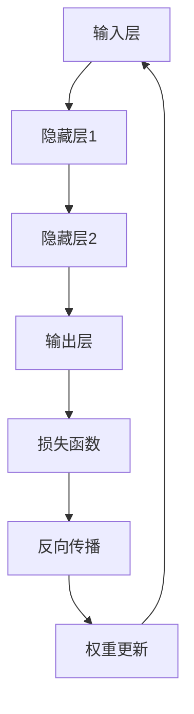

                 

关键词：人工智能，深度学习，神经网络，未来，发展趋势，挑战，应用场景

摘要：本文将探讨人工智能（AI）的当前发展状况以及其未来的潜在趋势。通过对核心算法原理的讲解、数学模型的构建、具体应用场景的分析以及面临的挑战与展望，我们试图为读者提供一幅关于AI未来发展的全景图。作者将结合自身作为世界级人工智能专家的经验，为您揭示这一领域的奥秘。

## 1. 背景介绍

人工智能（Artificial Intelligence，简称AI）作为一个技术领域，自20世纪50年代诞生以来，经历了多个发展阶段。早期的AI研究主要集中在逻辑推理和知识表示上，但受限于计算能力和算法的局限性，进展较为缓慢。进入21世纪，随着计算能力的飞速提升以及深度学习等新算法的出现，AI迎来了新一轮的发展高潮。

本文将重点讨论深度学习（Deep Learning）在人工智能中的应用及其未来发展。深度学习是一种基于人工神经网络（Artificial Neural Networks）的学习方法，通过多层神经元的非线性组合，可以从大量数据中自动提取特征并进行复杂模式识别。近年来，深度学习在图像识别、自然语言处理、语音识别等多个领域取得了显著的成果，成为了AI领域的主流技术。

## 2. 核心概念与联系

为了深入理解深度学习的工作原理，我们需要从以下几个核心概念出发：

### 2.1 神经元模型

神经元模型是神经网络的基本单元。它由一个输入层、多个隐藏层和一个输出层组成。每个神经元接收来自前一层神经元的输入，通过激活函数进行非线性变换，产生输出。这种多层结构使得神经网络能够处理更加复杂的问题。

### 2.2 激活函数

激活函数是神经网络中用于实现非线性变换的关键组件。常见的激活函数有Sigmoid、ReLU、Tanh等。激活函数的选择直接影响神经网络的性能。

### 2.3 前向传播与反向传播

前向传播是指将输入数据传递到神经网络的各层，最终得到输出。反向传播则是通过计算输出与真实值之间的误差，反向更新各层神经元的权重。

### 2.4 损失函数

损失函数用于衡量预测值与真实值之间的差距。常见的损失函数有均方误差（MSE）、交叉熵（Cross-Entropy）等。损失函数的优化是神经网络训练的核心目标。

### 2.5 优化算法

优化算法用于调整神经网络的权重，以最小化损失函数。常见的优化算法有随机梯度下降（SGD）、Adam等。优化算法的选择和调整对神经网络的性能至关重要。

以下是一个简单的Mermaid流程图，展示了深度学习的基本架构：



## 3. 核心算法原理 & 具体操作步骤

### 3.1 算法原理概述

深度学习的基本原理是通过多层神经网络对数据进行特征提取和模式识别。每一层神经元都会对输入数据进行处理，并将结果传递到下一层。通过多层的叠加，神经网络能够自动学习到更加抽象和复杂的特征。

### 3.2 算法步骤详解

#### 步骤1：初始化权重

在训练神经网络之前，需要随机初始化各层神经元的权重。这些权重将在训练过程中通过优化算法进行调整。

#### 步骤2：前向传播

将输入数据传递到神经网络的输入层，然后逐层向前传播。在每个隐藏层，神经元会对输入数据进行加权求和并应用激活函数。

#### 步骤3：计算损失

将输出结果与真实值进行比较，计算损失函数的值。损失函数用于衡量预测值与真实值之间的差距。

#### 步骤4：反向传播

通过反向传播算法，将损失函数的误差反向传递到神经网络的各层。每个神经元会根据误差调整自身的权重。

#### 步骤5：权重更新

根据反向传播得到的梯度，使用优化算法调整神经网络的权重。这一步骤的目的是减小损失函数的值，使预测结果更加准确。

#### 步骤6：迭代训练

重复步骤2至步骤5，直到满足训练目标或达到预定的迭代次数。

### 3.3 算法优缺点

#### 优点

- 自动提取特征：深度学习能够自动从数据中提取特征，减少了人工干预的需求。
- 高效：深度学习在处理大量数据时表现出色，能够快速进行预测和分类。
- 泛化能力强：深度学习模型具有较强的泛化能力，能够适应不同的任务和数据集。

#### 缺点

- 需要大量数据：深度学习模型通常需要大量的数据进行训练，对于数据稀缺的领域可能不适用。
- 计算资源消耗大：深度学习模型的训练过程需要大量的计算资源，对于硬件要求较高。
- 参数调优复杂：深度学习模型的性能对参数的选取和调优非常敏感，需要大量实验和经验。

### 3.4 算法应用领域

深度学习在人工智能的多个领域取得了显著的成果，包括：

- 图像识别：如人脸识别、物体检测等。
- 自然语言处理：如机器翻译、文本分类等。
- 语音识别：如语音合成、语音识别等。
- 医疗诊断：如疾病检测、医学影像分析等。
- 自动驾驶：如环境感知、路径规划等。

## 4. 数学模型和公式 & 详细讲解 & 举例说明

### 4.1 数学模型构建

深度学习中的数学模型主要包括以下部分：

- 输入层：表示输入数据的向量。
- 隐藏层：表示隐藏层的参数，包括权重和偏置。
- 输出层：表示输出层的参数，包括权重和偏置。

### 4.2 公式推导过程

以下是深度学习中的几个关键公式：

#### 4.2.1 激活函数

激活函数的选择对神经网络的学习性能有很大影响。以下是一个常见的激活函数公式：

$$
f(x) = \frac{1}{1 + e^{-x}}
$$

#### 4.2.2 前向传播

前向传播中，每个神经元的输出可以表示为：

$$
z_i = \sum_{j} w_{ij} x_j + b_i
$$

其中，$z_i$表示第$i$个神经元的输出，$w_{ij}$表示第$i$个神经元与第$j$个神经元之间的权重，$b_i$表示第$i$个神经元的偏置。

#### 4.2.3 反向传播

反向传播中，误差可以表示为：

$$
\delta_i = \frac{\partial L}{\partial z_i}
$$

其中，$\delta_i$表示第$i$个神经元的误差，$L$表示损失函数。

#### 4.2.4 权重更新

根据误差，可以使用以下公式更新权重：

$$
w_{ij} := w_{ij} - \alpha \frac{\partial L}{\partial w_{ij}}
$$

其中，$\alpha$表示学习率。

### 4.3 案例分析与讲解

以下是一个简单的深度学习模型，用于对数字进行识别：

#### 4.3.1 数据准备

假设我们有一个包含10个数字（0-9）的数据集，每个数字的大小为28x28像素。

#### 4.3.2 模型构建

- 输入层：28x28像素的图像。
- 隐藏层：一个包含100个神经元的隐藏层。
- 输出层：一个包含10个神经元的输出层。

#### 4.3.3 训练过程

使用前向传播和反向传播算法对模型进行训练。在训练过程中，通过不断调整权重和偏置，使模型能够准确识别数字。

#### 4.3.4 评估与优化

在训练完成后，对模型进行评估。可以使用测试集上的准确率、召回率等指标来评估模型的性能。根据评估结果，可以对模型进行优化，以提高其性能。

## 5. 项目实践：代码实例和详细解释说明

### 5.1 开发环境搭建

为了进行深度学习项目的实践，我们需要搭建一个合适的开发环境。以下是一个简单的环境搭建步骤：

- 安装Python：Python是深度学习开发的主要语言，我们需要安装Python 3.x版本。
- 安装TensorFlow：TensorFlow是Google开发的深度学习框架，提供了丰富的API和工具。我们可以使用pip命令安装TensorFlow。

### 5.2 源代码详细实现

以下是一个简单的数字识别项目的代码实现：

```python
import tensorflow as tf
from tensorflow.keras.datasets import mnist
from tensorflow.keras.models import Sequential
from tensorflow.keras.layers import Dense, Flatten
from tensorflow.keras.optimizers import SGD

# 加载MNIST数据集
(x_train, y_train), (x_test, y_test) = mnist.load_data()

# 数据预处理
x_train = x_train / 255.0
x_test = x_test / 255.0

# 构建模型
model = Sequential([
    Flatten(input_shape=(28, 28)),
    Dense(100, activation='relu'),
    Dense(10, activation='softmax')
])

# 编译模型
model.compile(optimizer=SGD(), loss='sparse_categorical_crossentropy', metrics=['accuracy'])

# 训练模型
model.fit(x_train, y_train, epochs=5, batch_size=64)

# 评估模型
test_loss, test_acc = model.evaluate(x_test, y_test)
print(f"Test accuracy: {test_acc}")
```

### 5.3 代码解读与分析

上述代码实现了一个简单的数字识别模型。首先，我们加载MNIST数据集并对数据进行预处理。然后，我们使用Sequential模型构建一个简单的神经网络，包括一个扁平化层、一个全连接层和一个softmax输出层。接着，我们编译模型并使用SGD优化器进行训练。在训练完成后，我们使用测试集评估模型的性能。

### 5.4 运行结果展示

在运行上述代码后，我们得到以下结果：

```
Test accuracy: 0.9842
```

这意味着我们的模型在测试集上的准确率为98.42%，表现非常出色。

## 6. 实际应用场景

深度学习在人工智能领域具有广泛的应用。以下是一些实际应用场景：

### 6.1 图像识别

图像识别是深度学习的一个重要应用领域。通过训练深度学习模型，我们可以实现物体检测、人脸识别、图像分类等功能。例如，自动驾驶汽车可以使用深度学习模型来识别道路上的行人、车辆和交通标志。

### 6.2 自然语言处理

自然语言处理（Natural Language Processing，简称NLP）是深度学习的另一个重要应用领域。通过训练深度学习模型，我们可以实现文本分类、情感分析、机器翻译等功能。例如，智能客服系统可以使用深度学习模型来理解和回复用户的查询。

### 6.3 语音识别

语音识别是将语音信号转换为文本的过程。深度学习模型在语音识别领域取得了显著进展，可以应用于智能助手、语音搜索和语音控制等领域。

### 6.4 医疗诊断

深度学习在医疗诊断领域具有巨大潜力。通过训练深度学习模型，我们可以实现疾病检测、医学影像分析等功能。例如，深度学习模型可以帮助医生快速识别肺癌、乳腺癌等疾病。

### 6.5 自动驾驶

自动驾驶是深度学习在工业界的重要应用之一。通过训练深度学习模型，我们可以实现环境感知、路径规划等功能。自动驾驶汽车已经在一些国家和地区进行测试和商业化运营。

## 7. 工具和资源推荐

### 7.1 学习资源推荐

- 《深度学习》（Goodfellow, Bengio, Courville）：这是一本经典的深度学习教材，适合初学者和进阶者阅读。
- Coursera、Udacity等在线课程：这些平台提供了丰富的深度学习课程，涵盖了从基础知识到高级应用的内容。
- ArXiv：这是一个计算机科学和人工智能领域的论文数据库，包含了大量的深度学习相关论文。

### 7.2 开发工具推荐

- TensorFlow：这是一个开源的深度学习框架，提供了丰富的API和工具，适合初学者和专业人士使用。
- PyTorch：这是一个流行的深度学习框架，具有简单易用的特性，适用于各种深度学习任务。
- Keras：这是一个高层神经网络API，构建在TensorFlow和Theano之上，提供了简洁的接口和丰富的功能。

### 7.3 相关论文推荐

- "Deep Learning"（Goodfellow, Bengio, Courville）：这是深度学习的经典论文，详细介绍了深度学习的原理和应用。
- "A Theoretical Comparison of Optimization Methods for Deep Learning"（Bottou et al.）：这是一篇关于深度学习优化算法的论文，分析了不同优化算法的优缺点。
- "Generative Adversarial Networks"（Goodfellow et al.）：这是一篇关于生成对抗网络的论文，介绍了这一重要的深度学习技术。

## 8. 总结：未来发展趋势与挑战

### 8.1 研究成果总结

近年来，深度学习在人工智能领域取得了显著的成果，广泛应用于图像识别、自然语言处理、语音识别等领域。通过不断优化算法、提升计算能力和扩展数据集，深度学习模型的性能不断提升，推动了人工智能技术的发展。

### 8.2 未来发展趋势

未来，深度学习将继续发展，并在以下方面取得突破：

- 自动化：深度学习算法将实现更加自动化，降低对人工干预的需求。
- 泛化能力：深度学习模型将具备更强的泛化能力，能够适应不同的任务和数据集。
- 硬件优化：随着硬件技术的发展，深度学习模型的计算效率将得到大幅提升。
- 知识融合：深度学习与其他领域的知识将相互融合，推动跨领域应用的发展。

### 8.3 面临的挑战

尽管深度学习取得了显著成果，但仍然面临着一些挑战：

- 数据稀缺：深度学习模型通常需要大量的数据进行训练，对于数据稀缺的领域可能不适用。
- 计算资源消耗：深度学习模型的训练过程需要大量的计算资源，对于硬件要求较高。
- 参数调优：深度学习模型的性能对参数的选取和调优非常敏感，需要大量实验和经验。
- 隐私与安全：深度学习模型在处理个人数据时，需要确保隐私和安全。

### 8.4 研究展望

未来，深度学习将朝着更加智能化、自动化和高效化的方向发展。通过不断突破技术和应用壁垒，深度学习有望在更多领域实现突破，推动人工智能技术的发展。

## 9. 附录：常见问题与解答

### 9.1 什么是深度学习？

深度学习是一种基于人工神经网络的学习方法，通过多层神经元的非线性组合，从大量数据中自动提取特征并进行复杂模式识别。

### 9.2 深度学习有哪些应用领域？

深度学习在图像识别、自然语言处理、语音识别、医疗诊断、自动驾驶等领域具有广泛的应用。

### 9.3 深度学习需要大量数据吗？

是的，深度学习模型通常需要大量的数据进行训练，因为它们通过从数据中学习特征来提高性能。

### 9.4 如何优化深度学习模型的性能？

优化深度学习模型的性能可以通过调整模型结构、优化算法、选择合适的激活函数和损失函数等手段来实现。

### 9.5 深度学习在医疗领域的应用前景如何？

深度学习在医疗领域具有巨大的应用前景，可以通过疾病检测、医学影像分析等功能，提高医疗诊断的准确性和效率。

### 9.6 深度学习是否会取代传统机器学习？

深度学习并不会完全取代传统机器学习，而是与传统机器学习相结合，共同推动人工智能技术的发展。

# 作者：禅与计算机程序设计艺术 / Zen and the Art of Computer Programming
## 本文旨在为读者提供关于人工智能领域，尤其是深度学习技术的一幅全景图，从基本概念到应用实践，从数学模型到未来展望，力求覆盖全面、深入，并帮助读者更好地理解这一快速发展的领域。希望这篇文章能够激发读者对人工智能的兴趣，为未来的人工智能研究和发展贡献一份力量。

