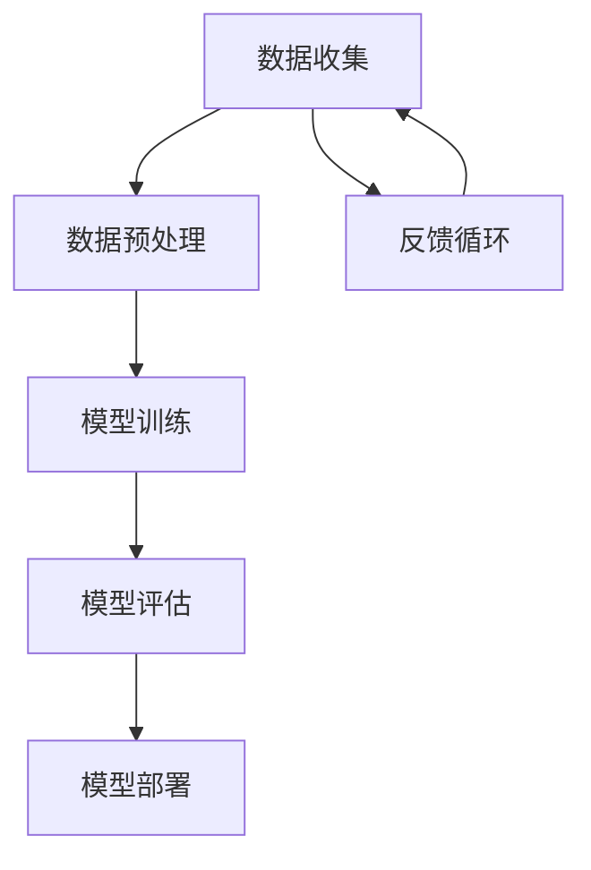

                 

关键词：人工智能，未来前景，发展，趋势，挑战，技术，应用

> 摘要：本文将深入探讨人工智能领域专家Andrej Karpathy对未来人工智能发展的见解，从技术、应用、挑战等多个角度分析人工智能的潜在影响和前景。

## 1. 背景介绍

人工智能（AI）作为计算机科学的一个重要分支，近年来取得了飞速的发展。特别是深度学习技术的崛起，让计算机在图像识别、自然语言处理、游戏智能等领域取得了显著的突破。Andrej Karpathy，作为世界顶级人工智能专家之一，他在神经网络的开发和应用方面做出了杰出的贡献。本文旨在通过对Karpathy的研究和观点进行梳理，探讨人工智能的未来发展前景。

## 2. 核心概念与联系

为了更好地理解人工智能的发展前景，我们首先需要了解其核心概念和架构。以下是人工智能的核心概念及其相互联系的一个简化的Mermaid流程图：



### 2.1 数据收集

数据收集是人工智能的基础，高质量的训练数据可以帮助模型更好地学习。数据源可以是公开数据集、用户生成数据等。

### 2.2 数据预处理

数据预处理包括数据清洗、归一化、特征提取等步骤，目的是将原始数据转化为适合模型训练的格式。

### 2.3 模型训练

模型训练是人工智能的核心环节，通过大量数据训练模型，使其能够对未知数据进行预测或分类。

### 2.4 模型评估

模型评估是评估模型性能的重要步骤，常用的评估指标包括准确率、召回率、F1分数等。

### 2.5 模型部署

模型部署是将训练好的模型应用到实际场景中的过程，可以是实时应用、批处理等。

### 2.6 反馈循环

反馈循环是不断优化模型的重要手段，通过实际应用中的反馈，不断调整模型，提高其性能。

## 3. 核心算法原理 & 具体操作步骤

### 3.1 算法原理概述

人工智能的核心在于算法，而深度学习是当前最为流行的人工智能算法。以下是深度学习算法的原理概述：

深度学习是一种模拟人脑神经网络的学习方法，通过多层神经网络对数据进行处理和预测。每一层网络都会对输入数据进行变换，最终得到输出结果。

### 3.2 算法步骤详解

深度学习算法的主要步骤包括：

1. **数据收集与预处理**：收集大量数据，并进行清洗、归一化等预处理。
2. **模型设计**：根据任务需求设计神经网络模型，包括输入层、隐藏层和输出层。
3. **模型训练**：使用预处理后的数据训练模型，通过反向传播算法不断调整模型参数。
4. **模型评估**：使用验证集对模型进行评估，调整模型参数，优化模型性能。
5. **模型部署**：将训练好的模型应用到实际场景中，进行实时预测或分类。

### 3.3 算法优缺点

**优点**：

- **强大的表现**：深度学习模型在许多任务上取得了比传统算法更好的表现。
- **自动特征提取**：深度学习模型能够自动从数据中提取特征，减轻了人工设计的负担。
- **适用范围广**：深度学习模型可以应用于图像识别、自然语言处理、语音识别等多个领域。

**缺点**：

- **数据需求大**：深度学习模型需要大量的训练数据，数据收集和预处理工作量大。
- **计算资源消耗高**：训练深度学习模型需要大量的计算资源，对硬件要求较高。
- **模型解释性差**：深度学习模型通常难以解释，缺乏透明性和可解释性。

### 3.4 算法应用领域

深度学习算法已经广泛应用于图像识别、自然语言处理、语音识别、推荐系统等多个领域。例如：

- **图像识别**：深度学习模型可以在医疗影像诊断、自动驾驶、安防监控等领域发挥重要作用。
- **自然语言处理**：深度学习模型可以应用于机器翻译、文本分类、智能客服等领域。
- **语音识别**：深度学习模型可以应用于语音助手、智能音箱、语音搜索等领域。

## 4. 数学模型和公式 & 详细讲解 & 举例说明

### 4.1 数学模型构建

深度学习模型的构建主要基于以下几个数学模型：

1. **线性回归**：用于预测一个连续的输出值。
2. **逻辑回归**：用于预测一个二分类的结果。
3. **神经网络**：由多个神经元组成的层次结构，用于复杂函数的建模。

### 4.2 公式推导过程

以神经网络为例，其基本公式如下：

$$
z^{(l)} = \sigma(W^{(l)} \cdot a^{(l-1)} + b^{(l)})
$$

$$
a^{(l)} = \sigma(z^{(l)})
$$

其中，$z^{(l)}$ 表示第 $l$ 层的输入，$a^{(l)}$ 表示第 $l$ 层的输出，$W^{(l)}$ 和 $b^{(l)}$ 分别表示第 $l$ 层的权重和偏置，$\sigma$ 表示激活函数。

### 4.3 案例分析与讲解

以下是一个简单的神经网络案例，用于对 Iris 数据集进行分类。

```python
import numpy as np

# 初始化权重和偏置
W1 = np.random.randn(4, 3)
b1 = np.random.randn(4)
W2 = np.random.randn(3, 1)
b2 = np.random.randn(3)

# 定义激活函数
def sigmoid(x):
    return 1 / (1 + np.exp(-x))

# 定义损失函数
def cross_entropy(y_pred, y_true):
    return -np.sum(y_true * np.log(y_pred) + (1 - y_true) * np.log(1 - y_pred))

# 训练模型
for epoch in range(1000):
    # 前向传播
    z1 = np.dot(X, W1) + b1
    a1 = sigmoid(z1)
    z2 = np.dot(a1, W2) + b2
    a2 = sigmoid(z2)
    
    # 反向传播
    dZ2 = a2 - y
    dW2 = np.dot(a1.T, dZ2)
    db2 = np.sum(dZ2, axis=0)
    
    dZ1 = np.dot(dZ2, W2.T) * sigmoid(z1) * (1 - sigmoid(z1))
    dW1 = np.dot(X.T, dZ1)
    db1 = np.sum(dZ1, axis=0)
    
    # 更新权重和偏置
    W1 += learning_rate * dW1
    b1 += learning_rate * db1
    W2 += learning_rate * dW2
    b2 += learning_rate * db2
    
    # 计算损失
    loss = cross_entropy(a2, y)
    if epoch % 100 == 0:
        print(f"Epoch {epoch}: Loss = {loss}")

```

## 5. 项目实践：代码实例和详细解释说明

### 5.1 开发环境搭建

首先，我们需要搭建一个适合开发人工智能项目的环境。以下是常用的开发工具和框架：

- **Python**：作为人工智能的主流编程语言，Python具有丰富的库和框架。
- **TensorFlow**：Google 开发的一款深度学习框架，广泛应用于人工智能项目。
- **PyTorch**：Facebook 开发的一款深度学习框架，具有动态计算图和简洁的API。

### 5.2 源代码详细实现

以下是一个使用 PyTorch 实现的简单神经网络，用于对 Iris 数据集进行分类：

```python
import torch
import torch.nn as nn
import torch.optim as optim
from torchvision import datasets, transforms
from torch.utils.data import DataLoader

# 定义模型
class SimpleNN(nn.Module):
    def __init__(self):
        super(SimpleNN, self).__init__()
        self.fc1 = nn.Linear(4, 10)
        self.fc2 = nn.Linear(10, 3)
    
    def forward(self, x):
        x = torch.relu(self.fc1(x))
        x = self.fc2(x)
        return x

# 加载数据
transform = transforms.Compose([transforms.ToTensor()])
train_data = datasets.Iris(root='./data', train=True, transform=transform)
train_loader = DataLoader(train_data, batch_size=16, shuffle=True)

# 初始化模型、优化器和损失函数
model = SimpleNN()
optimizer = optim.Adam(model.parameters(), lr=0.001)
criterion = nn.CrossEntropyLoss()

# 训练模型
for epoch in range(1000):
    for batch_idx, (X, y) in enumerate(train_loader):
        # 前向传播
        y_pred = model(X)
        loss = criterion(y_pred, y)
        
        # 反向传播
        optimizer.zero_grad()
        loss.backward()
        optimizer.step()
        
        if batch_idx % 100 == 0:
            print(f"Epoch {epoch}, Batch {batch_idx}: Loss = {loss.item()}")

# 测试模型
test_data = datasets.Iris(root='./data', train=False, transform=transform)
test_loader = DataLoader(test_data, batch_size=16, shuffle=False)

with torch.no_grad():
    correct = 0
    total = 0
    for X, y in test_loader:
        y_pred = model(X)
        _, predicted = torch.max(y_pred.data, 1)
        total += y.size(0)
        correct += (predicted == y).sum().item()

print(f"Test Accuracy: {100 * correct / total}%")
```

### 5.3 代码解读与分析

上述代码首先定义了一个简单的神经网络，包括一个输入层、一个隐藏层和一个输出层。接着，我们加载数据，并使用 DataLoader 对数据进行批处理。在训练过程中，我们使用交叉熵损失函数和 Adam 优化器，通过梯度下降法不断更新模型参数。最后，我们对测试数据进行预测，计算模型的准确率。

## 6. 实际应用场景

### 6.1 人工智能在医疗领域的应用

人工智能在医疗领域的应用前景广阔。通过深度学习技术，我们可以实现医疗影像的自动诊断、疾病预测和个性化治疗。例如，深度学习模型可以用于肺癌的早期诊断，通过分析 CT 扫描图像，识别出潜在的风险。

### 6.2 人工智能在自动驾驶领域的应用

自动驾驶是人工智能的重要应用领域之一。通过深度学习技术，自动驾驶车辆可以实时感知环境，做出智能决策。例如，自动驾驶车辆可以通过深度学习模型识别道路标志、行人和其他车辆，确保行车安全。

### 6.3 人工智能在金融领域的应用

人工智能在金融领域的应用也越来越广泛。通过深度学习技术，金融机构可以实现对交易数据的实时分析和预测，提高风险管理能力。例如，机器学习模型可以用于股票市场预测、信用卡欺诈检测和风险管理。

## 7. 未来应用展望

### 7.1 人工智能在日常生活中的应用

随着人工智能技术的不断进步，我们期待人工智能将在日常生活中发挥更大的作用。例如，智能助手可以更好地理解我们的需求，提供个性化的服务；智能家居系统可以实现对家庭环境的智能调控，提高生活质量。

### 7.2 人工智能在教育领域的应用

人工智能在教育领域的应用也将带来革命性的变革。通过个性化学习系统，学生可以根据自己的需求和进度进行学习；智能评阅系统可以高效地评估学生的学习成果。

### 7.3 人工智能在环境保护中的应用

人工智能在环境保护中的应用前景广阔。例如，通过深度学习技术，我们可以实现对环境数据的实时监测和分析，及时发现环境污染问题，制定有效的环境保护措施。

## 8. 总结：未来发展趋势与挑战

### 8.1 研究成果总结

人工智能在过去几十年取得了显著的进展，无论是在理论研究还是实际应用方面，都取得了丰硕的成果。深度学习技术的崛起，使得计算机在许多领域达到了或超过了人类的水平。

### 8.2 未来发展趋势

人工智能在未来将继续向以下几个方向发展：

- **算法创新**：随着计算能力的提升，我们可以探索更复杂的算法，解决更复杂的任务。
- **跨界融合**：人工智能与其他领域的融合，如生物技术、能源等，将推动各行各业的创新。
- **人机协同**：人工智能与人类的协同工作，将提高生产力和生活质量。

### 8.3 面临的挑战

尽管人工智能发展迅速，但仍面临以下挑战：

- **数据隐私**：如何确保人工智能系统的数据安全和隐私保护。
- **算法公平性**：如何避免算法偏见，确保算法的公平性。
- **计算资源消耗**：如何优化算法，降低计算资源的消耗。

### 8.4 研究展望

在未来，人工智能研究将继续深入，探索更多未知的领域。我们期待人工智能能够为人类社会带来更多福祉，推动科技进步和社会发展。

## 9. 附录：常见问题与解答

### 9.1 人工智能是什么？

人工智能是一种模拟人类智能的技术，通过计算机程序实现智能行为，如学习、推理、感知等。

### 9.2 人工智能有哪些应用？

人工智能的应用领域广泛，包括医疗、金融、教育、自动驾驶、智能家居等。

### 9.3 深度学习如何工作？

深度学习是一种基于多层神经网络的学习方法，通过大量数据训练模型，使其能够对未知数据进行预测或分类。

### 9.4 人工智能的挑战有哪些？

人工智能的挑战包括数据隐私、算法公平性、计算资源消耗等。

---

作者：禅与计算机程序设计艺术 / Zen and the Art of Computer Programming


