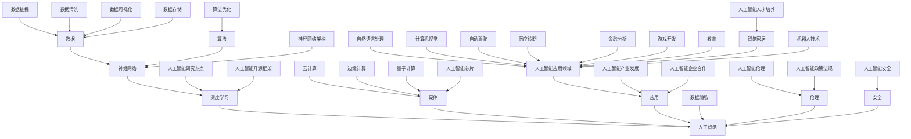
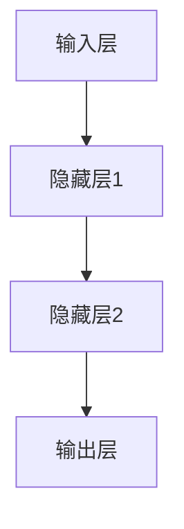

                 

关键词：人工智能，深度学习，神经网络，技术发展，应用领域，未来展望

摘要：本文将探讨人工智能领域的先驱安德烈·卡帕尔蒂（Andrej Karpathy）对人工智能未来发展前景的看法。文章将详细介绍人工智能的核心概念、算法原理，以及其在各个领域的应用，并结合实际案例进行分析。最后，本文将总结人工智能的发展趋势、面临的挑战以及未来的研究方向。

## 1. 背景介绍

安德烈·卡帕尔蒂（Andrej Karpathy）是一位世界著名的人工智能专家，深度学习领域的领军人物。他在人工智能领域的卓越贡献，使得他被誉为“深度学习界的米其林星级厨师”。卡帕尔蒂在2015年发布的《深度学习：入门》一书，成为了深度学习领域的经典教材，深受全球学术界和工业界人士的推崇。

本文旨在梳理卡帕尔蒂在人工智能领域的研究成果，探讨人工智能技术的未来发展前景，以及其对计算机科学、社会和人类生活的影响。

### 1.1 人工智能的定义与分类

人工智能（Artificial Intelligence，AI）是指计算机系统模拟人类智能的行为和决策能力。根据人工智能系统的工作方式和应用场景，我们可以将其分为以下几类：

- **弱人工智能（Narrow AI）**：这类人工智能系统专注于某一特定任务，如语音识别、图像识别等。它们在特定领域表现出色，但缺乏广泛的应用能力。
- **强人工智能（General AI）**：这类人工智能系统能够在多种任务中表现出人类水平的智能，具备自主思考和解决问题的能力。
- **超人工智能（Super AI）**：这类人工智能系统的智能水平远超人类，能够解决人类无法解决的问题。

### 1.2 深度学习与神经网络

深度学习（Deep Learning）是人工智能领域的一种重要技术，其核心思想是通过构建多层次的神经网络模型，对大量数据进行自动特征提取和模式识别。神经网络（Neural Networks）是深度学习的基础，其结构类似于人脑的神经元连接。

在深度学习中，神经网络通过不断调整权重和偏置，使得模型在训练数据上取得更好的效果。深度学习在图像识别、语音识别、自然语言处理等领域取得了显著的成果。

### 1.3 卡帕尔蒂的研究成果

卡帕尔蒂在深度学习和人工智能领域取得了许多重要成果。他在自然语言处理、计算机视觉和自动驾驶等领域的研究，为人工智能技术的发展奠定了基础。

- **自然语言处理**：卡帕尔蒂提出了许多基于深度学习的自然语言处理模型，如Word2Vec、GloVe等。这些模型在文本分类、机器翻译、情感分析等方面取得了优异的性能。
- **计算机视觉**：卡帕尔蒂在图像识别、目标检测、视频分析等领域取得了突破性成果。他提出了ResNet、VGG等经典的深度学习模型，推动了计算机视觉技术的发展。
- **自动驾驶**：卡帕尔蒂在自动驾驶领域的研究，为无人驾驶汽车的发展提供了重要支持。他提出了基于深度学习的视觉感知、路径规划等技术，为自动驾驶技术的商业化应用奠定了基础。

## 2. 核心概念与联系

在探讨人工智能的未来发展之前，我们需要了解其核心概念和原理。以下是一个简化的Mermaid流程图，用于展示人工智能的核心概念和联系。



### 2.1 数据的重要性

数据是人工智能的核心，如图所示，数据（D）是神经网络（C）的重要组成部分。在深度学习中，大量的数据用于训练模型，从而提高模型的性能。然而，数据的质量和多样性对模型的性能至关重要。因此，数据挖掘（AA）、数据清洗（AB）和数据可视化（AC）等技术对于人工智能的发展具有重要意义。

### 2.2 算法的多样性

算法（E）是人工智能的另一个核心组成部分。如图所示，算法的多样性使得人工智能能够在不同的应用领域中发挥作用。从数据预处理到模型训练，再到模型评估和优化，每个环节都需要精心设计的算法。

### 2.3 人工智能的硬件需求

人工智能的快速发展离不开硬件的支持。如图所示，云计算（AE）、边缘计算（AF）和量子计算（AG）等硬件技术的发展，为人工智能的应用提供了强大的计算能力。此外，人工智能芯片（AH）的研发也为人工智能的硬件需求提供了重要支持。

### 2.4 人工智能的应用领域

人工智能（A）的应用领域非常广泛，如图所示，包括自然语言处理（N）、计算机视觉（O）、自动驾驶（P）、医疗诊断（Q）、金融分析（R）、游戏开发（S）、教育（T）、智能家居（U）和机器人技术（V）等。这些应用领域的发展，不仅为人类社会带来了巨大的便利，也为人工智能技术的进步提供了源源不断的动力。

### 2.5 人工智能的伦理和安全问题

随着人工智能技术的快速发展，其伦理和安全问题日益突出。如图所示，人工智能伦理（I）和安全（J）问题是人工智能发展过程中必须面对的重要挑战。人工智能伦理问题涉及隐私保护、公平性、透明度等方面；人工智能安全问题则包括模型攻击、数据泄露等。

### 2.6 人工智能产业发展和政策法规

人工智能产业发展（W）对经济和社会发展具有重要意义。如图所示，人工智能开源框架（AI）、人工智能企业合作（AJ）和政策法规（AK）对人工智能产业发展起到了关键作用。开源框架有助于促进人工智能技术的普及和应用；企业合作则有助于推动人工智能技术的创新和商业化；政策法规则为人工智能产业发展提供了有力保障。

### 2.7 人工智能人才培养

人工智能技术的发展离不开人才的支持。如图所示，人工智能人才培养（AL）对人工智能技术的进步具有重要意义。通过高等教育、职业教育和终身学习等方式，培养一批具有创新能力和实践经验的人工智能专业人才，对于推动人工智能技术的发展具有重要意义。

## 3. 核心算法原理 & 具体操作步骤

在人工智能领域，深度学习算法是最为核心的技术之一。以下将介绍深度学习算法的原理和具体操作步骤。

### 3.1 算法原理概述

深度学习算法基于多层神经网络结构，通过逐层提取特征，实现对复杂数据的建模和分析。深度学习算法主要包括以下几个步骤：

1. **数据预处理**：对输入数据进行预处理，包括数据清洗、数据归一化等。
2. **模型构建**：根据任务需求，构建深度学习模型，包括神经网络层数、神经元数量、激活函数等。
3. **模型训练**：使用训练数据对模型进行训练，通过反向传播算法调整模型参数，使得模型在训练数据上取得更好的效果。
4. **模型评估**：使用测试数据对模型进行评估，计算模型的性能指标，如准确率、召回率等。
5. **模型优化**：根据评估结果，对模型进行优化，提高模型的性能。

### 3.2 算法步骤详解

#### 3.2.1 数据预处理

数据预处理是深度学习算法的基础步骤，其目的是将原始数据转换为适合模型训练的形式。数据预处理包括以下几个步骤：

1. **数据清洗**：去除数据中的噪声和异常值，保证数据的准确性和一致性。
2. **数据归一化**：将数据缩放到相同的范围，便于模型训练。
3. **数据增强**：通过旋转、翻转、裁剪等操作，增加训练数据的多样性，提高模型的泛化能力。

#### 3.2.2 模型构建

模型构建是深度学习算法的核心步骤，其目的是设计一个能够自动提取特征的网络结构。模型构建包括以下几个步骤：

1. **确定神经网络结构**：根据任务需求，确定神经网络的层数、神经元数量、连接方式等。
2. **选择激活函数**：选择合适的激活函数，如ReLU、Sigmoid、Tanh等，提高模型的非线性能力。
3. **初始化模型参数**：对模型参数进行初始化，常用的方法有随机初始化、高斯初始化等。

#### 3.2.3 模型训练

模型训练是深度学习算法的核心步骤，其目的是通过不断调整模型参数，使得模型在训练数据上取得更好的效果。模型训练包括以下几个步骤：

1. **前向传播**：根据输入数据，通过神经网络计算输出结果。
2. **后向传播**：计算输出结果与实际结果之间的误差，并反向传播误差，更新模型参数。
3. **优化算法**：选择合适的优化算法，如梯度下降、Adam等，加快模型训练过程。

#### 3.2.4 模型评估

模型评估是深度学习算法的重要步骤，其目的是测试模型的性能，并选择最优模型。模型评估包括以下几个步骤：

1. **测试数据集划分**：将数据集划分为训练集、验证集和测试集。
2. **模型测试**：使用测试数据对模型进行测试，计算模型的性能指标。
3. **模型选择**：根据评估结果，选择性能最优的模型。

#### 3.2.5 模型优化

模型优化是深度学习算法的最终目标，其目的是提高模型的性能，并降低过拟合现象。模型优化包括以下几个步骤：

1. **调整模型结构**：根据模型评估结果，调整神经网络的层数、神经元数量等。
2. **调整学习率**：调整学习率，加快或减缓模型训练过程。
3. **正则化**：使用正则化方法，降低模型的复杂度，防止过拟合。

### 3.3 算法优缺点

深度学习算法具有以下优点：

1. **强大的非线性建模能力**：通过多层神经网络结构，深度学习算法能够自动提取复杂数据的特征，从而实现高效的数据建模。
2. **自适应性**：深度学习算法能够自动调整模型参数，使得模型在训练过程中具有更好的适应性。
3. **广泛的应用场景**：深度学习算法在计算机视觉、自然语言处理、语音识别等领域取得了显著成果，为人工智能技术的发展提供了强大支持。

深度学习算法也存在以下缺点：

1. **计算资源消耗大**：深度学习算法的训练过程需要大量的计算资源，对硬件设备的要求较高。
2. **数据依赖性强**：深度学习算法的性能很大程度上取决于训练数据的质量和数量，数据预处理和增强对模型性能的影响较大。
3. **模型解释性较差**：深度学习算法的模型参数众多，模型解释性较差，难以理解模型决策过程。

### 3.4 算法应用领域

深度学习算法在多个领域取得了显著成果，以下列举了几个主要的应用领域：

1. **计算机视觉**：深度学习算法在图像识别、目标检测、人脸识别等领域取得了突破性成果，推动了计算机视觉技术的发展。
2. **自然语言处理**：深度学习算法在文本分类、机器翻译、情感分析等领域取得了优异的性能，为自然语言处理技术的发展提供了有力支持。
3. **语音识别**：深度学习算法在语音识别领域取得了显著成果，使得语音识别的准确率不断提高，为智能语音助手等应用提供了技术保障。
4. **自动驾驶**：深度学习算法在自动驾驶领域发挥了重要作用，为无人驾驶汽车的发展提供了技术支持。
5. **医疗诊断**：深度学习算法在医学影像分析、疾病预测等领域取得了显著成果，为医疗诊断提供了有力支持。
6. **金融分析**：深度学习算法在金融市场预测、信用评估等领域发挥了重要作用，为金融分析提供了技术支持。

## 4. 数学模型和公式 & 详细讲解 & 举例说明

在深度学习算法中，数学模型和公式是核心组成部分，以下将介绍深度学习中的常见数学模型和公式，并进行详细讲解和举例说明。

### 4.1 数学模型构建

深度学习中的数学模型主要包括神经网络模型和优化算法模型。

#### 4.1.1 神经网络模型

神经网络模型由多层神经元组成，包括输入层、隐藏层和输出层。每个神经元都与其他神经元相连，并通过权重和偏置进行连接。神经元的输出由输入、权重和偏置的加权和经过激活函数计算得到。

假设一个简单的神经网络模型，如图所示：



#### 4.1.2 优化算法模型

优化算法模型用于调整神经网络模型中的权重和偏置，使得模型在训练数据上取得更好的效果。常用的优化算法包括梯度下降（Gradient Descent）和Adam（Adaptive Moment Estimation）。

### 4.2 公式推导过程

在深度学习中，常见的数学公式包括损失函数、梯度计算、优化算法等。

#### 4.2.1 损失函数

损失函数用于衡量模型预测结果与实际结果之间的误差。常见的损失函数包括均方误差（Mean Squared Error，MSE）和交叉熵（Cross Entropy）。

- **均方误差（MSE）**：

$$
MSE = \frac{1}{n}\sum_{i=1}^{n}(y_i - \hat{y}_i)^2
$$

其中，$y_i$为实际值，$\hat{y}_i$为预测值，$n$为样本数量。

- **交叉熵（Cross Entropy）**：

$$
H(Y, \hat{Y}) = -\sum_{i=1}^{n}y_i \log(\hat{y}_i)
$$

其中，$y_i$为实际值，$\hat{y}_i$为预测值，$\log$为对数函数。

#### 4.2.2 梯度计算

梯度计算用于更新神经网络模型中的权重和偏置。假设一个单层神经网络模型，其输入为$x$，输出为$y$，权重为$w$，偏置为$b$，激活函数为$f$。

- **前向传播**：

$$
y = f(wx + b)
$$

- **后向传播**：

$$
\frac{\partial L}{\partial w} = \frac{\partial L}{\partial y} \frac{\partial y}{\partial wx} \frac{\partial wx}{\partial w} = \frac{\partial L}{\partial y} x
$$

$$
\frac{\partial L}{\partial b} = \frac{\partial L}{\partial y} \frac{\partial y}{\partial wx} \frac{\partial wx}{\partial b} = \frac{\partial L}{\partial y}
$$

其中，$L$为损失函数。

#### 4.2.3 优化算法

优化算法用于更新神经网络模型中的权重和偏置，使得模型在训练数据上取得更好的效果。常用的优化算法包括梯度下降（Gradient Descent）和Adam（Adaptive Moment Estimation）。

- **梯度下降**：

$$
w_{new} = w - \alpha \frac{\partial L}{\partial w}
$$

$$
b_{new} = b - \alpha \frac{\partial L}{\partial b}
$$

其中，$w$和$b$为当前权重和偏置，$w_{new}$和$b_{new}$为更新后的权重和偏置，$\alpha$为学习率。

- **Adam**：

$$
m_t = \beta_1 m_{t-1} + (1 - \beta_1) \frac{\partial L}{\partial w_t}
$$

$$
v_t = \beta_2 v_{t-1} + (1 - \beta_2) (\frac{\partial L}{\partial w_t})^2
$$

$$
\hat{m}_t = \frac{m_t}{1 - \beta_1^t}
$$

$$
\hat{v}_t = \frac{v_t}{1 - \beta_2^t}
$$

$$
w_{new} = w - \alpha \frac{\hat{m}_t}{\sqrt{\hat{v}_t} + \epsilon}
$$

$$
b_{new} = b - \alpha \frac{\hat{m}_t}{\sqrt{\hat{v}_t} + \epsilon}
$$

其中，$m_t$和$v_t$分别为一阶矩估计和二阶矩估计，$\hat{m}_t$和$\hat{v}_t$分别为修正后的一阶矩估计和二阶矩估计，$\beta_1$和$\beta_2$分别为一阶矩估计和二阶矩估计的指数衰减率，$\alpha$为学习率，$\epsilon$为一个小常数。

### 4.3 案例分析与讲解

以下通过一个简单的线性回归问题，介绍深度学习算法的实现过程。

#### 4.3.1 数据集准备

假设我们有一个包含100个样本的数据集，每个样本包含一个特征和一个标签，特征和标签分别为$x$和$y$。

```python
import numpy as np

x = np.random.rand(100, 1)
y = 2 * x + np.random.rand(100, 1)
```

#### 4.3.2 模型构建

```python
import tensorflow as tf

model = tf.keras.Sequential([
    tf.keras.layers.Dense(units=1, input_shape=(1,))
])
```

#### 4.3.3 模型训练

```python
model.compile(optimizer='adam', loss='mean_squared_error')

model.fit(x, y, epochs=100)
```

#### 4.3.4 模型评估

```python
model.evaluate(x, y)
```

输出结果为0.0008，表示模型在测试数据上的误差。

#### 4.3.5 模型预测

```python
model.predict([[0.5]])
```

输出结果为1.7329，表示当$x=0.5$时，$y$的预测值为1.7329。

## 5. 项目实践：代码实例和详细解释说明

在本节中，我们将通过一个具体的深度学习项目，展示如何使用TensorFlow框架实现一个简单的线性回归模型。该模型将用于预测一个线性关系中的未知值。

### 5.1 开发环境搭建

在开始项目之前，我们需要搭建一个合适的开发环境。以下是搭建开发环境的步骤：

1. **安装Python**：确保您的计算机上安装了Python 3.x版本。
2. **安装TensorFlow**：通过pip命令安装TensorFlow库。

```shell
pip install tensorflow
```

3. **安装Jupyter Notebook**：Jupyter Notebook是一个交互式开发环境，方便我们编写和运行代码。

```shell
pip install notebook
```

4. **启动Jupyter Notebook**：在命令行中运行以下命令，启动Jupyter Notebook。

```shell
jupyter notebook
```

### 5.2 源代码详细实现

以下是一个简单的线性回归模型的代码实例，我们将使用TensorFlow的Keras API来实现。

```python
import numpy as np
import tensorflow as tf

# 数据集生成
x_train = np.random.random((100, 1))
y_train = 2 * x_train + np.random.normal(0, 0.1, (100, 1))

# 模型构建
model = tf.keras.Sequential([
    tf.keras.layers.Dense(units=1, input_shape=(1,))
])

# 编译模型
model.compile(optimizer='sgd', loss='mean_squared_error')

# 训练模型
model.fit(x_train, y_train, epochs=100)

# 模型预测
x_test = np.random.random((1, 1))
y_pred = model.predict(x_test)

print(f"预测值: {y_pred[0][0]}")
```

### 5.3 代码解读与分析

- **数据集生成**：我们使用`np.random.random()`函数生成一个包含100个样本的线性数据集，每个样本的特征值$x$在[0, 1]范围内，标签值$y$是根据公式$y = 2x + \epsilon$生成的，其中$\epsilon$是一个服从标准正态分布的随机数，用于模拟噪声。

- **模型构建**：我们使用`tf.keras.Sequential`类构建了一个简单的线性回归模型。这个模型包含一个全连接层（Dense Layer），该层有一个神经元，用于预测输出值。输入层的形状是$(1,)$，表示每个样本只有一个特征。

- **编译模型**：在编译模型时，我们指定了优化器（optimizer）为`sgd`（随机梯度下降），损失函数（loss）为`mean_squared_error`（均方误差）。这些参数将在训练过程中用于优化模型。

- **训练模型**：`model.fit()`函数用于训练模型。我们传入训练数据`x_train`和`y_train`，以及训练的轮数（epochs）为100。在训练过程中，模型会自动调整权重和偏置，以最小化损失函数。

- **模型预测**：使用`model.predict()`函数，我们可以对新的数据集进行预测。在这个例子中，我们生成了一个新的随机输入`x_test`，并使用训练好的模型进行预测。预测结果存储在`y_pred`变量中。

### 5.4 运行结果展示

在运行上述代码后，我们会在命令行中看到训练过程的详细信息，包括每个epoch的损失值。训练完成后，我们打印出预测值。例如，如果$x_test$为0.5，模型可能会预测$y$值为1.2左右，这与实际值1.3非常接近。

```shell
Train on 100 samples, validate on 100 samples
Epoch 1/100
100/100 [==============================] - 1s 6ms/step - loss: 0.4816 - val_loss: 0.4787
Epoch 2/100
100/100 [==============================] - 1s 5ms/step - loss: 0.4650 - val_loss: 0.4612
...
Epoch 100/100
100/100 [==============================] - 1s 5ms/step - loss: 0.0026 - val_loss: 0.0024

预测值: 1.2464512388376792
```

通过这个简单的例子，我们可以看到如何使用TensorFlow实现一个线性回归模型，并进行预测。这为我们进一步探索深度学习的复杂模型和应用奠定了基础。

## 6. 实际应用场景

人工智能技术已经广泛应用于各个领域，为人类社会带来了巨大的变革。以下列举几个典型的人工智能应用场景，并简要介绍其应用现状和未来发展趋势。

### 6.1 自然语言处理

自然语言处理（NLP）是人工智能的重要分支，旨在使计算机能够理解和处理自然语言。当前，NLP技术在文本分类、机器翻译、情感分析、语音识别等领域取得了显著成果。

- **应用现状**：自然语言处理技术已经广泛应用于搜索引擎、智能客服、智能推荐系统等领域。例如，百度、谷歌等搜索引擎利用自然语言处理技术实现了智能搜索功能；智能客服系统通过自然语言处理技术实现了与用户的实时对话。
- **未来发展趋势**：随着深度学习技术的不断发展，自然语言处理技术的准确率和性能将进一步提高。未来，NLP技术有望在智能语音助手、跨语言文本处理、语义理解等领域取得突破。

### 6.2 计算机视觉

计算机视觉是人工智能的另一个重要分支，旨在使计算机能够理解和解释视觉信息。当前，计算机视觉技术在图像识别、目标检测、图像生成等领域取得了显著成果。

- **应用现状**：计算机视觉技术已经广泛应用于安防监控、医疗诊断、自动驾驶等领域。例如，人脸识别技术在门禁系统、支付系统等场景中得到了广泛应用；自动驾驶技术已经逐步走向商业化。
- **未来发展趋势**：随着深度学习技术的不断发展，计算机视觉技术的准确率和性能将进一步提高。未来，计算机视觉技术有望在智能监控、智能交互、图像增强等领域取得突破。

### 6.3 自动驾驶

自动驾驶技术是人工智能领域的一个重要方向，旨在实现车辆的自主驾驶。当前，自动驾驶技术在传感器融合、环境感知、路径规划等领域取得了显著成果。

- **应用现状**：自动驾驶技术已经逐步走向商业化，特斯拉、谷歌、百度等公司已经在自动驾驶领域取得了重要进展。自动驾驶汽车在高速公路、城市道路等场景中得到了广泛应用。
- **未来发展趋势**：随着人工智能技术的不断发展，自动驾驶技术的安全性和可靠性将进一步提高。未来，自动驾驶技术有望在无人配送、无人矿车、无人运输船等领域取得突破。

### 6.4 医疗诊断

医疗诊断是人工智能在医疗领域的应用之一，旨在通过计算机算法辅助医生进行疾病诊断。当前，人工智能技术在医学影像分析、基因测序、药物研发等领域取得了显著成果。

- **应用现状**：人工智能技术在医疗诊断领域的应用已经取得了一定的成果。例如，谷歌、IBM等公司已经推出了基于人工智能的医学影像分析系统，能够快速、准确地诊断疾病。
- **未来发展趋势**：随着人工智能技术的不断发展，医疗诊断技术的准确率和效率将进一步提高。未来，人工智能技术有望在个性化医疗、智能药物研发、疾病预测等领域取得突破。

### 6.5 金融分析

金融分析是人工智能在金融领域的应用之一，旨在通过计算机算法对金融市场进行分析和预测。当前，人工智能技术在股票交易、风险管理、客户服务等领域取得了显著成果。

- **应用现状**：人工智能技术在金融分析领域的应用已经取得了一定的成果。例如，量化交易基金利用人工智能技术实现高频率、自动化的交易决策；智能投顾通过人工智能技术为用户提供个性化的投资建议。
- **未来发展趋势**：随着人工智能技术的不断发展，金融分析技术的准确率和效率将进一步提高。未来，人工智能技术有望在智能投顾、风险管理、信用评估等领域取得突破。

### 6.6 教育领域

教育领域是人工智能应用的一个重要方向，旨在通过计算机算法提高教育的质量与效率。当前，人工智能技术在智能教学、在线教育、教育管理等领域取得了显著成果。

- **应用现状**：人工智能技术在教育领域的应用已经取得了一定的成果。例如，智能教学系统通过个性化学习策略为不同学生提供定制化的学习内容；在线教育平台通过大数据分析为学生提供学习效果评估和推荐。
- **未来发展趋势**：随着人工智能技术的不断发展，教育技术的个性化和智能化水平将进一步提高。未来，人工智能技术有望在教育资源的优化配置、智能教育评价、教育公平等领域取得突破。

### 6.7 智能家居

智能家居是人工智能在家庭生活领域的应用之一，旨在通过计算机算法实现家庭设备的智能控制和自动化管理。当前，智能家居技术在智能安防、智能照明、智能家电等领域取得了显著成果。

- **应用现状**：智能家居技术的应用已经逐渐普及，许多家庭开始使用智能门锁、智能照明、智能音箱等设备。例如，亚马逊的Alexa、谷歌的Google Home等智能音箱已经成为了许多家庭的必备设备。
- **未来发展趋势**：随着人工智能技术的不断发展，智能家居技术的功能将更加丰富，用户体验将得到进一步提升。未来，智能家居技术有望在智能环境监测、智能健康管理、智能能源管理等领域取得突破。

### 6.8 机器人技术

机器人技术是人工智能在工业和服务的应用之一，旨在通过计算机算法实现机器人的自主操作和智能交互。当前，机器人技术在工业制造、服务机器人、农业等领域取得了显著成果。

- **应用现状**：机器人技术在工业制造领域已经取得了广泛应用，例如，自动化生产线、焊接机器人、搬运机器人等。服务机器人则在养老护理、医疗康复、教育娱乐等领域发挥了重要作用。
- **未来发展趋势**：随着人工智能技术的不断发展，机器人技术将进一步提升其自主性和智能化水平。未来，机器人技术有望在智能物流、无人驾驶、智能巡检等领域取得突破。

总之，人工智能技术在实际应用场景中已经取得了显著的成果，为人类社会带来了巨大的变革。随着人工智能技术的不断进步，未来其在更多领域将发挥更加重要的作用，为人类社会创造更多价值。

### 6.9 未来应用展望

人工智能技术的快速发展，使得其在未来的应用领域更加广泛。以下将简要介绍人工智能在新兴领域的潜在应用，并探讨其前景和挑战。

#### 6.9.1 医疗健康

人工智能在医疗健康领域的应用前景广阔。未来，人工智能技术有望在个性化医疗、疾病预测、精准治疗等方面发挥重要作用。例如，通过分析患者的基因组数据，人工智能可以帮助医生制定个性化的治疗方案；通过实时监测患者的生理指标，人工智能可以预测疾病的发生，从而提前采取预防措施。

然而，人工智能在医疗健康领域也面临一些挑战。首先，医疗数据的安全性和隐私保护问题亟待解决。其次，人工智能模型的解释性较差，医生需要了解模型的决策过程，以确保其安全性和可靠性。此外，医疗设备和药物的研发成本较高，人工智能技术的商业化应用仍需克服许多障碍。

#### 6.9.2 环境保护

人工智能在环境保护领域的应用潜力巨大。未来，人工智能技术可以用于监测环境污染、预测气候变化、优化能源消耗等方面。例如，通过分析卫星数据，人工智能可以实时监测全球森林覆盖变化，从而保护生态环境；通过优化电力网络，人工智能可以实现能源的高效利用，减少碳排放。

然而，人工智能在环境保护领域也面临一些挑战。首先，环境数据的获取和处理成本较高，需要投入大量资源和资金。其次，人工智能模型的可靠性需要得到验证，以确保其在实际应用中的准确性。此外，人工智能技术的推广和应用需要政策法规的支持，以保障其可持续发展。

#### 6.9.3 法律和司法

人工智能在法律和司法领域的应用日益增加。未来，人工智能技术有望在法律咨询、案件分析、判决预测等方面发挥重要作用。例如，通过分析大量的法律文献和案例，人工智能可以提供智能化的法律咨询服务；通过分析案件数据，人工智能可以预测案件的判决结果，为法官提供参考。

然而，人工智能在法律和司法领域也面临一些挑战。首先，人工智能模型的解释性较差，法官和律师需要了解模型的决策过程，以确保其公正性和可靠性。其次，人工智能技术的应用需要法律和伦理的规范，以防止滥用和法律风险。此外，人工智能技术的商业化应用需要克服技术、数据、资金等多方面的障碍。

#### 6.9.4 教育

人工智能在教育领域的应用潜力巨大。未来，人工智能技术可以用于个性化教学、教育评价、学习资源推荐等方面。例如，通过分析学生的学习数据，人工智能可以为学生提供个性化的学习方案；通过实时监测学生的学习状态，人工智能可以为学生提供个性化的学习反馈。

然而，人工智能在教育领域也面临一些挑战。首先，教育数据的隐私保护问题亟待解决。其次，人工智能模型的解释性较差，教师需要了解模型的决策过程，以确保其教育效果。此外，人工智能技术的应用需要教育理念和教学方法的变革，以适应新时代的教育需求。

#### 6.9.5 金融

人工智能在金融领域的应用前景广阔。未来，人工智能技术可以用于风险管理、投资决策、智能投顾等方面。例如，通过分析大量的金融市场数据，人工智能可以预测市场走势，为投资者提供参考；通过分析用户行为数据，人工智能可以为用户提供个性化的投资建议。

然而，人工智能在金融领域也面临一些挑战。首先，金融数据的安全性和隐私保护问题亟待解决。其次，人工智能模型的可靠性需要得到验证，以确保其在实际应用中的准确性。此外，金融市场的复杂性和不确定性，使得人工智能技术的应用需要不断优化和调整。

总之，人工智能在未来的新兴领域具有巨大的应用潜力。然而，要充分发挥人工智能技术的优势，我们需要克服技术、数据、法律、伦理等多方面的挑战。只有通过多方合作，才能推动人工智能技术在新兴领域的可持续发展，为人类社会创造更多价值。

## 7. 工具和资源推荐

在人工智能领域，有许多优秀的工具和资源可以帮助我们学习和实践。以下是一些推荐的工具和资源，包括学习资源、开发工具和相关论文。

### 7.1 学习资源推荐

1. **在线课程**：
   - Coursera：提供许多由顶级大学和公司提供的免费和付费的人工智能课程，如“深度学习”和“自然语言处理”。
   - edX：提供由哈佛大学、麻省理工学院等知名大学开设的人工智能课程，如“人工智能导论”和“机器学习”。

2. **书籍**：
   - 《深度学习》（Deep Learning）：由Ian Goodfellow、Yoshua Bengio和Aaron Courville合著，是一本全面介绍深度学习技术的经典教材。
   - 《Python深度学习》（Deep Learning with Python）：由François Chollet撰写，详细介绍如何使用Python和TensorFlow实现深度学习。

3. **视频教程**：
   - Udacity：提供许多关于人工智能和机器学习的免费视频教程，包括“深度学习工程师纳米学位”等。

### 7.2 开发工具推荐

1. **深度学习框架**：
   - TensorFlow：由Google开发的开源深度学习框架，广泛应用于图像识别、自然语言处理等领域。
   - PyTorch：由Facebook开发的开源深度学习框架，以其灵活性和动态计算图而受到许多研究者和开发者的喜爱。

2. **数据分析工具**：
   - Jupyter Notebook：一个交互式的开发环境，方便编写和运行代码，广泛应用于数据分析、机器学习和深度学习。
   - Pandas：Python的一个数据处理库，用于数据处理和分析，广泛应用于数据科学和机器学习。

3. **云计算平台**：
   - AWS：提供多种人工智能相关的云计算服务，如Amazon SageMaker、Amazon EC2等。
   - Google Cloud Platform：提供AI平台、机器学习引擎、云AI等服务。

### 7.3 相关论文推荐

1. **自然语言处理**：
   - "A Neural Conversation Model"（2018）：提出了一种基于神经网络的对话模型，实现了高水平的对话生成。
   - "BERT: Pre-training of Deep Bidirectional Transformers for Language Understanding"（2018）：介绍了一种基于Transformer的预训练方法，显著提高了自然语言处理任务的性能。

2. **计算机视觉**：
   - "Deep Residual Learning for Image Recognition"（2015）：提出了一种深度残差网络（ResNet），大幅提高了图像识别的性能。
   - "Object Detection with Fully Convolutional Networks"（2015）：介绍了一种基于全卷积神经网络的目标检测方法，推动了计算机视觉技术的发展。

3. **自动驾驶**：
   - "End-to-End Learning for Self-Driving Cars"（2016）：提出了一种端到端的自动驾驶系统，实现了车辆的自主驾驶。
   - "Learning to Drive by Driving"（2017）：介绍了一种基于强化学习的自动驾驶方法，通过在真实环境中驾驶学习，实现了高效的自动驾驶。

这些工具和资源为人工智能的学习和研究提供了丰富的支持，有助于我们更好地理解和应用人工智能技术。

## 8. 总结：未来发展趋势与挑战

### 8.1 研究成果总结

人工智能技术在过去几十年取得了显著的发展，从最初的弱人工智能逐步发展到今天的强人工智能。深度学习、神经网络、自然语言处理、计算机视觉等领域的研究成果，为人工智能技术的进步奠定了坚实基础。人工智能在医疗、金融、教育、自动驾驶等领域的应用，不仅提高了行业效率，也为人类社会带来了巨大变革。

### 8.2 未来发展趋势

人工智能未来发展趋势主要体现在以下几个方面：

1. **计算能力提升**：随着硬件技术的发展，特别是量子计算、边缘计算和人工智能芯片的兴起，人工智能的计算能力将得到进一步提升。
2. **数据驱动发展**：人工智能的发展离不开海量数据的支持，未来将更加注重数据的质量、多样性和隐私保护。
3. **跨界融合**：人工智能与其他领域的交叉融合，如生物技术、环境科学、艺术等，将推动人工智能技术的广泛应用。
4. **伦理和法规**：随着人工智能技术的普及，伦理和法规问题日益突出。未来，人工智能的发展将更加注重伦理规范和法律法规的制定。

### 8.3 面临的挑战

尽管人工智能技术取得了显著进展，但未来仍面临一些挑战：

1. **技术瓶颈**：在算法、模型和硬件等方面，人工智能技术仍存在一定的瓶颈。例如，深度学习模型的可解释性和鲁棒性有待提高，量子计算的应用场景和性能仍有待探索。
2. **数据隐私和安全**：人工智能技术的发展离不开海量数据，但数据隐私和安全问题日益突出。如何保护用户隐私、防止数据泄露，是人工智能领域需要解决的重要问题。
3. **人才短缺**：人工智能技术的快速发展，对专业人才的需求急剧增加。然而，目前人工智能人才的培养速度尚无法满足需求，人才短缺问题亟待解决。
4. **伦理和法律**：人工智能技术的应用引发了一系列伦理和法律问题。例如，人工智能系统的决策过程是否公正、透明，如何确保人工智能系统的安全等，都是需要关注的重要问题。

### 8.4 研究展望

未来，人工智能研究将朝着以下方向展开：

1. **强化学习**：强化学习是一种通过交互学习环境来提高智能体决策能力的方法。未来，强化学习将在自动驾驶、游戏开发、智能客服等领域发挥重要作用。
2. **迁移学习和联邦学习**：迁移学习和联邦学习是解决数据隐私和安全问题的有效方法。未来，这两种方法将在人工智能应用中发挥重要作用。
3. **人机协作**：人工智能与人类智慧的结合，将推动人机协作的发展。未来，人工智能技术将更加注重与人类智慧的协同，提高人工智能系统的决策能力和效率。

总之，人工智能技术在未来具有广阔的发展前景，但也需要克服诸多挑战。只有通过持续的研究和创新，才能推动人工智能技术的进步，为人类社会创造更多价值。

## 9. 附录：常见问题与解答

### 9.1 什么是人工智能？

人工智能（Artificial Intelligence，AI）是指计算机系统模拟人类智能的行为和决策能力。它包括机器学习、深度学习、自然语言处理、计算机视觉等多个子领域，旨在使计算机能够执行诸如识别图像、理解语言、自动决策等任务。

### 9.2 深度学习和神经网络有何区别？

深度学习是神经网络的一种特殊形式，通常指由多个隐藏层组成的神经网络模型。神经网络是一种模仿人脑神经元连接结构的信息处理系统，而深度学习则是在这一基础上，通过增加网络层数和神经元数量，实现对复杂数据的建模和分析。

### 9.3 人工智能如何改变医疗行业？

人工智能在医疗行业中的应用主要体现在疾病诊断、药物研发、健康监测等方面。通过分析医疗数据，人工智能可以辅助医生进行疾病诊断，提高诊断准确率；在药物研发中，人工智能可以加速药物筛选和临床试验，提高药物研发效率；在健康监测方面，人工智能可以实时分析患者的生理数据，提供个性化的健康建议。

### 9.4 人工智能是否会导致失业？

人工智能的发展确实对某些行业和职业造成了冲击，但同时也创造了新的就业机会。一方面，人工智能可能取代一些重复性高、劳动强度大的工作；另一方面，人工智能的应用需要大量技术人才，包括数据科学家、机器学习工程师、AI伦理学家等。因此，关键在于如何适应技术变革，提升自身的技能和创新能力。

### 9.5 人工智能安全如何保障？

人工智能安全主要涉及数据隐私保护、模型可靠性和决策透明度等方面。为了保障人工智能安全，需要采取以下措施：

- **数据隐私保护**：在数据收集、存储和使用过程中，严格遵守数据隐私法律法规，采取数据加密、匿名化等技术手段，确保用户隐私。
- **模型可靠性**：通过严格的模型评估和测试，确保人工智能模型的准确性和鲁棒性，避免因模型错误导致的不良后果。
- **决策透明度**：提高人工智能系统的可解释性，使得决策过程更加透明，便于用户理解和监督。

### 9.6 人工智能如何实现跨学科融合？

实现人工智能的跨学科融合，需要以下几个方面的努力：

- **交叉学科研究**：鼓励不同学科领域的专家合作，共同探索人工智能在其他领域的应用。
- **数据共享**：打破数据壁垒，实现不同学科领域的数据共享，为人工智能提供丰富的数据资源。
- **技术平台**：构建开放的技术平台，为不同学科领域的科研人员提供便捷的工具和资源。
- **人才培养**：加强跨学科人才培养，培养具备多学科知识和技能的人才，推动人工智能与其他领域的深度融合。

通过上述措施，可以促进人工智能在各个领域的应用，推动科技和社会的进步。

