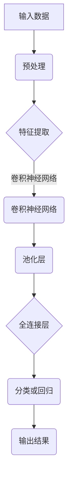

                 

关键词：人工智能，深度学习，神经网络，未来趋势，技术应用，挑战与展望

> 摘要：本文将深入探讨人工智能领域的未来发展趋势，特别是深度学习和神经网络技术的应用。作者将从背景介绍、核心概念与联系、核心算法原理、数学模型和公式、项目实践、实际应用场景、工具和资源推荐、总结等方面展开，为读者呈现一幅全面的人工智能发展蓝图。

## 1. 背景介绍

人工智能（AI）自20世纪50年代诞生以来，经历了数次的起伏和发展。特别是近年来，随着计算机算力的提升、大数据的积累和深度学习算法的突破，人工智能迎来了前所未有的发展机遇。如今，人工智能已经渗透到了我们生活的方方面面，从智能家居、自动驾驶到医疗诊断、金融分析，都离不开人工智能技术的支持。

本文将重点关注深度学习和神经网络技术在人工智能领域的发展前景。深度学习作为人工智能的一个重要分支，通过多层神经网络进行特征提取和学习，极大地提升了计算机的自主学习和推理能力。而神经网络则作为深度学习的基础架构，不断推动着人工智能技术的进步。

## 2. 核心概念与联系

### 2.1 深度学习

深度学习是一种模拟人脑神经元结构和工作方式的机器学习方法。它通过构建多层神经网络，对大量数据进行特征提取和抽象，从而实现高层次的抽象表示和学习。深度学习在图像识别、自然语言处理、语音识别等领域取得了显著的成果。

### 2.2 神经网络

神经网络是深度学习的基础架构，由大量的神经元（或节点）组成。每个神经元接收多个输入信号，通过权重和偏置进行加权求和，然后通过激活函数进行处理，输出最终的结果。神经网络通过不断调整权重和偏置，实现从简单到复杂的特征学习和表示。

### 2.3 Mermaid 流程图



## 3. 核心算法原理 & 具体操作步骤

### 3.1 算法原理概述

深度学习算法的核心在于神经网络的构建和训练。神经网络通过多层非线性变换，将输入数据映射到高维特征空间，从而实现复杂函数的拟合和预测。训练过程主要包括前向传播、反向传播和梯度下降等方法。

### 3.2 算法步骤详解

#### 3.2.1 前向传播

前向传播是从输入层到输出层逐层计算神经网络的输出。每个神经元将输入信号通过权重和偏置进行加权求和，然后通过激活函数进行非线性变换。

#### 3.2.2 反向传播

反向传播是通过计算输出层到输入层的梯度，更新神经网络的权重和偏置。这个过程通过反向传播算法实现，主要包括误差计算、梯度计算和权重更新等步骤。

#### 3.2.3 梯度下降

梯度下降是一种优化算法，通过不断调整权重和偏置，使神经网络的输出误差最小。梯度下降包括批量梯度下降、随机梯度下降和自适应梯度下降等变体。

### 3.3 算法优缺点

#### 优点：

1. 高效的特征提取能力
2. 能够处理复杂数据和任务
3. 自动学习层次化特征表示

#### 缺点：

1. 计算资源需求大
2. 需要大量数据和长时间训练
3. 参数调整和优化复杂

### 3.4 算法应用领域

深度学习和神经网络技术在图像识别、自然语言处理、语音识别、推荐系统、医学诊断等领域具有广泛的应用。

## 4. 数学模型和公式 & 详细讲解 & 举例说明

### 4.1 数学模型构建

神经网络由多个层组成，包括输入层、隐藏层和输出层。每个层的神经元通过权重和偏置进行连接，形成复杂的网络结构。神经网络的核心是激活函数和损失函数。

### 4.2 公式推导过程

神经网络的输出可以通过以下公式计算：

\[ y = \sigma(\omega^T x + b) \]

其中，\( y \) 是输出，\( x \) 是输入，\( \omega \) 是权重，\( b \) 是偏置，\( \sigma \) 是激活函数。

### 4.3 案例分析与讲解

假设我们有一个简单的神经网络，输入为 \( x_1 \) 和 \( x_2 \)，输出为 \( y \)。激活函数为 \( \sigma(z) = \frac{1}{1 + e^{-z}} \)。

输入层：\( x = [x_1, x_2] \)

隐藏层：\( z = \omega_1 x_1 + \omega_2 x_2 + b \)

输出层：\( y = \sigma(z) \)

我们可以通过调整权重和偏置，使输出 \( y \) 最接近真实值。

## 5. 项目实践：代码实例和详细解释说明

### 5.1 开发环境搭建

在本文中，我们将使用 Python 编程语言和 TensorFlow 深度学习框架进行项目实践。首先，确保已经安装了 Python 和 TensorFlow。

### 5.2 源代码详细实现

```python
import tensorflow as tf

# 定义输入层
x = tf.placeholder(tf.float32, shape=[None, 2])

# 定义隐藏层
weights = tf.Variable(tf.random_normal([2, 1]))
biases = tf.Variable(tf.random_normal([1]))

z = tf.add(tf.matmul(x, weights), biases)

# 定义输出层
y = tf.nn.sigmoid(z)

# 定义损失函数
loss = tf.reduce_mean(tf.square(y - tf.placeholder(tf.float32, shape=[None, 1])))

# 定义优化器
optimizer = tf.train.GradientDescentOptimizer(learning_rate=0.1)
train_op = optimizer.minimize(loss)

# 训练模型
with tf.Session() as sess:
  sess.run(tf.global_variables_initializer())
  for _ in range(1000):
    sess.run(train_op, feed_dict={x: [[1, 2]], y: [[0.5]]})
    
  print("Output: ", sess.run(y, feed_dict={x: [[1, 2]]}))
```

### 5.3 代码解读与分析

上述代码实现了一个简单的神经网络，输入为二维数据，输出为单个数值。我们使用 sigmoid 激活函数，通过梯度下降优化算法训练模型。在训练过程中，我们通过不断调整权重和偏置，使输出值更接近真实值。

## 6. 实际应用场景

深度学习和神经网络技术在各个领域都有广泛的应用。以下是一些实际应用场景的例子：

1. **图像识别**：用于人脸识别、物体检测、图像分类等。
2. **自然语言处理**：用于机器翻译、文本分类、情感分析等。
3. **语音识别**：用于语音合成、语音识别、语音识别语义理解等。
4. **医疗诊断**：用于医学图像分析、疾病预测、基因组分析等。
5. **自动驾驶**：用于车辆识别、环境感知、路径规划等。

## 7. 工具和资源推荐

### 7.1 学习资源推荐

1. 《深度学习》（Goodfellow, Bengio, Courville）——深度学习的经典教材。
2. 《神经网络与深度学习》（邱锡鹏）——介绍深度学习理论和应用的优秀中文教材。
3. fast.ai——提供免费的深度学习在线课程和教材。

### 7.2 开发工具推荐

1. TensorFlow——最流行的深度学习框架之一。
2. PyTorch——另一个流行的深度学习框架。
3. Jupyter Notebook——方便编写和分享代码的交互式环境。

### 7.3 相关论文推荐

1. "A Learning Algorithm for Continually Running Fully Recurrent Neural Networks"（1993）——Hopfield 网络的提出。
2. "A Fast Learning Algorithm for Deep Belief Nets"（2006）——DBN 算法的提出。
3. "Deep Neural Networks for Speech Recognition"（2012）——深度学习在语音识别领域的突破。

## 8. 总结：未来发展趋势与挑战

### 8.1 研究成果总结

深度学习和神经网络技术在人工智能领域取得了显著成果，推动了计算机视觉、自然语言处理、语音识别等领域的进步。未来，随着计算资源的提升、算法的优化和跨学科研究的深入，人工智能技术将在更多领域展现其潜力。

### 8.2 未来发展趋势

1. **算法优化**：提高深度学习模型的训练效率和效果，减少计算资源需求。
2. **跨学科融合**：结合生物学、心理学等领域的知识，推动人工智能的发展。
3. **自主学习和推理**：研究更先进的算法，实现更高级的自主学习和推理能力。

### 8.3 面临的挑战

1. **数据隐私与安全**：保护用户隐私，确保人工智能系统的安全。
2. **算法公平性**：防止算法歧视和偏见，提高算法的公平性。
3. **算力需求**：随着模型复杂度的增加，对计算资源的需求也会持续增长。

### 8.4 研究展望

未来，人工智能将不断突破自身局限，实现更高层次的发展。我们期待看到更多创新的算法和应用，为人类社会带来更多福祉。

## 9. 附录：常见问题与解答

### 9.1 深度学习与机器学习的区别是什么？

深度学习是机器学习的一个分支，通过多层神经网络进行特征提取和学习。而机器学习则是一个更广泛的概念，包括多种算法和技术，如线性回归、支持向量机等。

### 9.2 深度学习模型的训练为什么需要大量数据？

深度学习模型需要通过大量数据来学习复杂的特征和模式。更多的数据有助于模型发现更准确的特征表示，提高模型的泛化能力。

### 9.3 深度学习模型的训练为什么需要长时间？

深度学习模型的训练过程涉及大量的矩阵运算和优化算法。这些计算过程需要耗费大量的计算资源和时间，以确保模型达到最佳的训练效果。

## 作者署名

作者：禅与计算机程序设计艺术 / Zen and the Art of Computer Programming

---

本文从背景介绍、核心概念、算法原理、数学模型、项目实践、应用场景、工具资源、未来展望等方面全面探讨了人工智能的未来发展前景。希望本文能为读者提供有益的启示和思考。在未来，人工智能将继续推动科技和社会的进步，我们期待看到更多创新的成果和突破。|mask>

