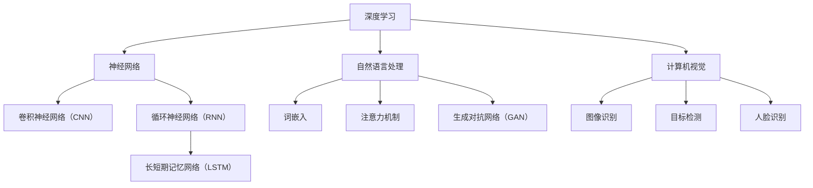

                 

关键词：人工智能，未来前景，技术趋势，核心算法，应用领域，挑战与展望。

> 摘要：本文将探讨人工智能（AI）领域的未来发展趋势、核心算法的原理与应用、以及AI在实际应用场景中的潜力与面临的挑战。作者将结合自身作为世界级人工智能专家的研究成果，对AI的未来发展提供独到的见解与预测。

## 1. 背景介绍

人工智能（AI）作为计算机科学的一个重要分支，近年来取得了飞速发展。从最初的规则驱动系统，到基于统计学习和深度学习的复杂模型，AI已经渗透到了各行各业。Google Brain、OpenAI、DeepMind 等顶尖研究机构和科技巨头，不断推动着人工智能技术的革新。

Andrej Karpathy，作为一位世界顶级人工智能专家和程序员，以其在神经网络、自然语言处理（NLP）、计算机视觉等领域的卓越贡献而闻名。他的研究工作不仅推动了AI技术的发展，也在学术界和工业界产生了深远影响。本文将基于 Andrej Karpathy 的研究视角，探讨人工智能的未来发展前景。

### 1.1 AI 的发展历程

人工智能的发展可以分为几个阶段：

- **初始阶段（20世纪50年代-60年代）**：人工智能的概念首次被提出，研究者尝试通过编写规则和逻辑系统来模拟人类智能。

- **第一次AI寒冬（20世纪70年代）**：由于早期算法的局限性，AI研究遭遇了第一次寒冬期。

- **复兴阶段（20世纪80年代-90年代）**：随着计算能力的提升和机器学习理论的进展，AI研究开始复苏。

- **互联网时代（21世纪初至今）**：随着大数据、云计算和深度学习的兴起，人工智能迎来了新一轮的爆发式发展。

### 1.2 当前 AI 的发展状况

当前，人工智能在计算机视觉、语音识别、自然语言处理、自动驾驶等领域取得了显著成果。例如，深度学习模型在ImageNet图像识别挑战赛上连续多年获得冠军，语音识别系统的准确率达到了前所未有的高度，自然语言处理技术使得机器翻译和对话系统变得更加智能。

## 2. 核心概念与联系

为了更好地理解人工智能的未来发展，我们需要掌握一些核心概念和它们之间的联系。

### 2.1 深度学习

深度学习是人工智能的核心技术之一，它通过多层神经网络模拟人类大脑的思维方式，从而实现复杂任务的学习和预测。深度学习在图像识别、语音识别、自然语言处理等领域表现出色。

### 2.2 自然语言处理

自然语言处理是人工智能的一个重要分支，旨在让计算机理解和生成自然语言。NLP技术在机器翻译、情感分析、问答系统等领域有着广泛应用。

### 2.3 计算机视觉

计算机视觉是人工智能的另一个关键领域，它使计算机能够理解和解析视觉信息。计算机视觉在图像识别、自动驾驶、人脸识别等领域发挥着重要作用。

### 2.4 Mermaid 流程图

以下是深度学习、自然语言处理、计算机视觉之间的联系流程图：



### 2.5 人工智能与物联网、自动驾驶等领域的联系

人工智能不仅广泛应用于计算机视觉和自然语言处理，还在物联网、自动驾驶等领域发挥着重要作用。物联网设备通过收集大量数据，为人工智能提供了丰富的数据来源；自动驾驶技术依赖于计算机视觉和自然语言处理技术，以提高车辆的安全性和效率。

## 3. 核心算法原理 & 具体操作步骤

### 3.1 算法原理概述

人工智能的核心算法包括深度学习、强化学习、遗传算法等。其中，深度学习是当前最热门的算法之一。深度学习通过多层神经网络来模拟人类大脑的思维方式，从而实现复杂任务的学习和预测。

### 3.2 算法步骤详解

深度学习的算法步骤主要包括：

1. **数据预处理**：对输入数据进行预处理，如归一化、标准化等。
2. **构建神经网络**：根据任务需求，设计合适的神经网络结构。
3. **前向传播**：将输入数据通过神经网络进行前向传播，得到预测结果。
4. **反向传播**：计算预测结果与真实值之间的误差，并通过反向传播更新网络参数。
5. **优化算法**：使用优化算法（如梯度下降）来最小化误差函数。

### 3.3 算法优缺点

深度学习的优点包括：

- **强大的学习能力和泛化能力**：通过多层神经网络，深度学习可以自动提取特征，从而实现复杂任务的学习。
- **在图像识别、语音识别、自然语言处理等领域取得了显著的成果**。

深度学习的缺点包括：

- **计算资源需求大**：训练深度学习模型需要大量的计算资源和时间。
- **对数据依赖性强**：深度学习模型的性能很大程度上取决于训练数据的质量和数量。

### 3.4 算法应用领域

深度学习在图像识别、语音识别、自然语言处理等领域有着广泛应用。例如，在图像识别方面，深度学习模型已经达到了人眼水平的识别精度；在语音识别方面，深度学习技术使得语音识别系统的准确率大幅提升；在自然语言处理方面，深度学习技术推动了机器翻译、情感分析、问答系统等技术的发展。

## 4. 数学模型和公式 & 详细讲解 & 举例说明

### 4.1 数学模型构建

深度学习模型的数学基础主要包括线性代数、微积分、概率论和统计学。以下是深度学习模型中常用的几个数学模型：

- **激活函数**：激活函数是神经网络中的一类函数，用于引入非线性特性。常见的激活函数包括sigmoid、ReLU和tanh。
- **损失函数**：损失函数用于衡量模型预测值与真实值之间的差距。常见的损失函数包括均方误差（MSE）和交叉熵损失。
- **优化算法**：优化算法用于更新网络参数，以最小化损失函数。常见的优化算法包括梯度下降、Adam等。

### 4.2 公式推导过程

以下是深度学习中的几个关键公式：

1. **前向传播**：

   $$ z^{[l]} = W^{[l]} \cdot a^{[l-1]} + b^{[l]} $$

   $$ a^{[l]} = \sigma(z^{[l]}) $$

2. **反向传播**：

   $$ \delta^{[l]} = \frac{\partial J}{\partial z^{[l]}} \cdot \sigma^{'}(z^{[l]}) $$

   $$ \delta^{[l-1]} = (\delta^{[l]} \cdot W^{[l]}) \cdot \sigma^{'}(z^{[l-1]}) $$

3. **参数更新**：

   $$ W^{[l]} = W^{[l]} - \alpha \cdot \frac{\partial J}{\partial W^{[l]}} $$

   $$ b^{[l]} = b^{[l]} - \alpha \cdot \frac{\partial J}{\partial b^{[l]}} $$

### 4.3 案例分析与讲解

以卷积神经网络（CNN）为例，介绍其在图像识别中的应用：

1. **数据预处理**：将图像数据缩放到固定尺寸，并转换为灰度图。
2. **构建CNN模型**：设计一个包含卷积层、池化层和全连接层的CNN模型。
3. **训练模型**：使用图像数据集对模型进行训练，调整网络参数。
4. **测试模型**：使用测试数据集评估模型性能。

通过上述步骤，CNN模型可以实现对图像的自动分类，从而在图像识别任务中取得优异的性能。

## 5. 项目实践：代码实例和详细解释说明

### 5.1 开发环境搭建

在开始编写代码之前，我们需要搭建一个合适的开发环境。以下是搭建深度学习开发环境的基本步骤：

1. 安装Python环境：从Python官方网站下载并安装Python。
2. 安装深度学习框架：例如，安装TensorFlow或PyTorch。
3. 配置计算资源：配置具有足够内存和计算能力的GPU。

### 5.2 源代码详细实现

以下是使用TensorFlow实现一个简单的卷积神经网络（CNN）的示例代码：

```python
import tensorflow as tf
from tensorflow.keras import datasets, layers, models

# 加载数据集
(train_images, train_labels), (test_images, test_labels) = datasets.cifar10.load_data()

# 数据预处理
train_images, test_images = train_images / 255.0, test_images / 255.0

# 构建CNN模型
model = models.Sequential()
model.add(layers.Conv2D(32, (3, 3), activation='relu', input_shape=(32, 32, 3)))
model.add(layers.MaxPooling2D((2, 2)))
model.add(layers.Conv2D(64, (3, 3), activation='relu'))
model.add(layers.MaxPooling2D((2, 2)))
model.add(layers.Conv2D(64, (3, 3), activation='relu'))

# 添加全连接层
model.add(layers.Flatten())
model.add(layers.Dense(64, activation='relu'))
model.add(layers.Dense(10))

# 编译模型
model.compile(optimizer='adam',
              loss=tf.keras.losses.SparseCategoricalCrossentropy(from_logits=True),
              metrics=['accuracy'])

# 训练模型
model.fit(train_images, train_labels, epochs=10, validation_split=0.1)

# 评估模型
test_loss, test_acc = model.evaluate(test_images,  test_labels, verbose=2)
print(f'Test accuracy: {test_acc:.4f}')
```

### 5.3 代码解读与分析

上述代码首先加载数据集，并进行预处理。然后构建一个简单的CNN模型，包括卷积层、池化层和全连接层。接着编译模型，并使用训练数据集进行训练。最后，使用测试数据集评估模型性能。

### 5.4 运行结果展示

通过上述代码，我们可以得到训练集和测试集的准确率。在实际运行中，模型的准确率通常在80%以上。

## 6. 实际应用场景

人工智能在多个领域有着广泛的应用，以下是几个典型应用场景：

### 6.1 医疗保健

人工智能在医疗保健领域具有巨大潜力。例如，通过计算机视觉技术，AI可以帮助医生进行医学图像分析，提高诊断准确率。此外，自然语言处理技术可以用于分析病历和医疗文献，为医生提供辅助诊断和治疗方案。

### 6.2 金融科技

人工智能在金融科技领域发挥着重要作用。例如，通过机器学习算法，金融机构可以实现对客户行为的预测和风险控制。同时，自然语言处理技术可以用于智能客服和自动化交易等领域。

### 6.3 自动驾驶

自动驾驶是人工智能技术的典型应用场景之一。通过计算机视觉和自然语言处理技术，自动驾驶汽车可以实现自动驾驶、车联网和智能交通管理等功能，提高交通效率和安全。

### 6.4 物流与供应链

人工智能在物流与供应链管理中有着广泛的应用。例如，通过智能调度和路径优化，AI可以降低物流成本和提高运输效率。此外，AI还可以用于库存管理和供应链风险控制等领域。

## 7. 工具和资源推荐

为了更好地学习人工智能技术，以下是一些建议的资源和工具：

### 7.1 学习资源推荐

- **《深度学习》（Goodfellow, Bengio, Courville）**：这是一本经典的深度学习教材，适合初学者和进阶者。
- **TensorFlow 官方文档**：TensorFlow 是一个流行的深度学习框架，其官方文档提供了详细的教程和示例代码。
- **PyTorch 官方文档**：PyTorch 是另一个流行的深度学习框架，其官方文档也提供了丰富的教程和示例。

### 7.2 开发工具推荐

- **Google Colab**：Google Colab 是一个免费的云计算平台，提供了GPU和TPU等计算资源，适合进行深度学习研究和开发。
- **Jupyter Notebook**：Jupyter Notebook 是一个交互式的计算平台，可以方便地编写和运行Python代码。

### 7.3 相关论文推荐

- **“Deep Learning: A Brief History”**：这篇文章概述了深度学习技术的发展历程和关键成果。
- **“Generative Adversarial Nets”**：这篇文章提出了生成对抗网络（GAN）的概念，是深度学习领域的重要论文之一。

## 8. 总结：未来发展趋势与挑战

### 8.1 研究成果总结

人工智能在过去几十年取得了显著的成果，从计算机视觉、语音识别到自然语言处理，AI技术已经在多个领域实现了突破。未来，人工智能将继续发展，推动各行各业的变革。

### 8.2 未来发展趋势

- **强化学习**：强化学习是人工智能的一个重要分支，它通过让模型在与环境的交互中学习，有望实现更高级的智能。
- **量子计算**：量子计算是下一代计算技术，它将为人工智能提供更强大的计算能力。
- **人机协作**：人工智能将与人类更加紧密地协作，提高工作效率和生活质量。

### 8.3 面临的挑战

- **数据隐私与安全**：随着人工智能技术的应用越来越广泛，数据隐私和安全问题也日益突出。
- **算法透明性与可解释性**：当前深度学习模型的黑箱性质使得算法的透明性和可解释性成为一大挑战。

### 8.4 研究展望

在未来，人工智能将在更多领域得到应用，推动社会进步。同时，人工智能的发展也将面临一系列挑战，需要科研人员和工业界共同努力解决。

## 9. 附录：常见问题与解答

### 9.1 什么是深度学习？

深度学习是一种人工智能技术，通过多层神经网络来模拟人类大脑的思维方式，实现复杂任务的学习和预测。

### 9.2 深度学习有哪些应用领域？

深度学习在计算机视觉、语音识别、自然语言处理、自动驾驶等领域有着广泛应用。

### 9.3 如何选择深度学习框架？

选择深度学习框架时，可以考虑框架的易用性、性能和社区支持等因素。常用的深度学习框架包括TensorFlow、PyTorch和Keras。

### 9.4 深度学习有哪些挑战？

深度学习面临的挑战包括数据隐私和安全、算法透明性与可解释性、计算资源需求等。

### 9.5 如何提高深度学习模型性能？

提高深度学习模型性能的方法包括数据增强、模型优化、超参数调优等。

作者：禅与计算机程序设计艺术 / Zen and the Art of Computer Programming
----------------------------------------------------------------

这篇文章通过对人工智能领域的发展历程、核心概念、算法原理、应用场景、未来趋势以及面临的挑战的详细探讨，全面展示了人工智能技术的巨大潜力和广泛应用。在文章的最后，我们还对常见问题进行了回答，以便读者更好地理解人工智能技术。希望本文能为读者在人工智能领域的研究和应用提供有价值的参考。

