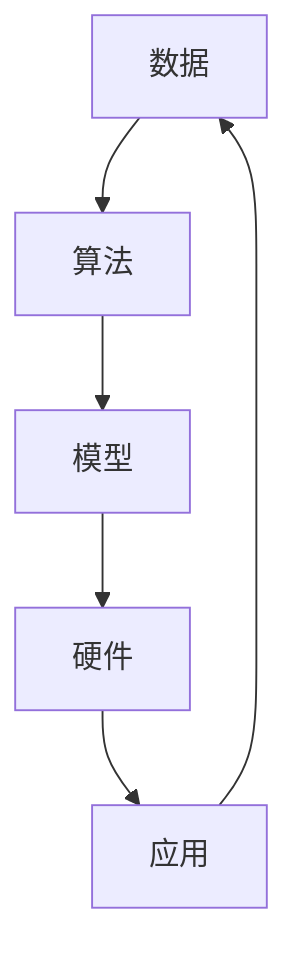

                 

关键词：人工智能、深度学习、未来趋势、技术发展、算法原理、应用场景、挑战与展望

## 摘要

本文将探讨人工智能领域杰出研究者Andrej Karpathy对未来人工智能发展方向的见解。通过分析其核心概念与联系，本文将深入探讨人工智能核心算法原理、数学模型、项目实践以及实际应用场景。同时，本文还将针对人工智能未来面临的挑战提出解决方案，并对人工智能的未来发展趋势与挑战进行总结。

## 1. 背景介绍

Andrej Karpathy是一位世界著名的人工智能研究者和程序员。他以其在深度学习领域的卓越成就而闻名，并在多个知名学术期刊和会议上发表过多篇论文。Andrej Karpathy在人工智能领域的贡献不仅体现在理论方面，还涵盖了实际应用。他对人工智能未来发展的见解具有很高的参考价值。

## 2. 核心概念与联系

在人工智能领域，核心概念与联系对于理解技术的发展至关重要。以下是一个简化的 Mermaid 流程图，用于描述人工智能的核心概念与联系：



### 2.1 数据

数据是人工智能发展的基石。随着大数据时代的到来，数据量的激增为人工智能提供了丰富的训练资源。

### 2.2 算法

算法是人工智能的核心。深度学习算法，特别是神经网络，已经成为人工智能领域的核心技术。

### 2.3 模型

模型是算法的具体实现。神经网络模型在图像识别、自然语言处理等领域取得了显著成果。

### 2.4 硬件

硬件是支持算法和模型运行的硬件设备。随着计算能力的提升，人工智能在实时应用场景中的表现也得到显著改善。

### 2.5 应用

应用是人工智能技术的最终目标。人工智能在医疗、金融、自动驾驶等领域展现了广阔的应用前景。

## 3. 核心算法原理 & 具体操作步骤

### 3.1 算法原理概述

深度学习是一种基于神经网络的算法，通过多层神经网络进行特征提取和学习。深度学习算法主要包括以下步骤：

1. 数据预处理：对数据进行清洗、归一化等处理。
2. 神经网络构建：定义神经网络结构，包括输入层、隐藏层和输出层。
3. 模型训练：通过反向传播算法更新网络权重，使模型达到预期效果。
4. 模型评估：使用测试数据评估模型性能，调整模型参数。
5. 模型部署：将训练好的模型应用于实际场景。

### 3.2 算法步骤详解

#### 3.2.1 数据预处理

数据预处理是深度学习模型训练的关键步骤。常见的预处理方法包括：

- 数据清洗：去除噪声和异常值。
- 数据归一化：将数据缩放到统一的范围，如[0, 1]。
- 数据增强：通过旋转、翻转、缩放等操作增加数据多样性。

#### 3.2.2 神经网络构建

神经网络构建包括以下步骤：

- 输入层：接收外部输入数据。
- 隐藏层：对输入数据进行特征提取和转换。
- 输出层：产生最终输出结果。

#### 3.2.3 模型训练

模型训练采用反向传播算法。具体步骤如下：

- 前向传播：将输入数据传递到神经网络，计算输出结果。
- 计算误差：计算实际输出与预期输出之间的误差。
- 反向传播：根据误差信息更新网络权重。
- 重复迭代：不断重复前向传播和反向传播，直到模型达到预期效果。

#### 3.2.4 模型评估

模型评估采用测试数据。常见评估指标包括：

- 准确率：模型正确预测的样本数占总样本数的比例。
- 召回率：模型召回的样本数与实际为正类的样本数之比。
- F1 分数：准确率和召回率的调和平均值。

#### 3.2.5 模型部署

模型部署包括以下步骤：

- 模型压缩：减少模型大小，提高运行效率。
- 模型优化：调整模型参数，提高模型性能。
- 部署到设备：将训练好的模型部署到实际设备上，如手机、服务器等。

### 3.3 算法优缺点

#### 优点

- 强大的特征提取能力：深度学习算法可以自动提取高层次的抽象特征。
- 广泛的应用场景：深度学习算法在图像识别、自然语言处理、语音识别等领域取得了显著成果。
- 高效的模型训练：反向传播算法使模型训练过程高效。

#### 缺点

- 数据需求大：深度学习算法需要大量训练数据。
- 计算资源消耗大：深度学习算法对计算资源要求较高。
- 参数调整复杂：深度学习算法的参数调整过程较为复杂。

### 3.4 算法应用领域

深度学习算法在以下领域具有广泛应用：

- 图像识别：如人脸识别、物体检测等。
- 自然语言处理：如机器翻译、文本分类等。
- 语音识别：如语音识别、语音合成等。
- 自动驾驶：如车辆检测、环境感知等。

## 4. 数学模型和公式 & 详细讲解 & 举例说明

### 4.1 数学模型构建

深度学习算法的核心是多层神经网络。以下是多层神经网络的数学模型构建：

$$
Z^{(l)} = \sigma(W^{(l)} \cdot A^{(l-1)} + b^{(l)})
$$

其中，$Z^{(l)}$ 表示第 $l$ 层的输出，$A^{(l-1)}$ 表示第 $l-1$ 层的输出，$W^{(l)}$ 和 $b^{(l)}$ 分别表示第 $l$ 层的权重和偏置，$\sigma$ 表示激活函数。

### 4.2 公式推导过程

以多层神经网络为例，以下是一个简化的公式推导过程：

- 前向传播：

$$
Z^{(l)} = \sigma(W^{(l)} \cdot A^{(l-1)} + b^{(l)})
$$

$$
A^{(l)} = \sigma(Z^{(l)})
$$

- 反向传播：

$$
\delta^{(l)} = \frac{\partial J}{\partial Z^{(l)}}
$$

$$
\delta^{(l-1)} = \delta^{(l)} \cdot \frac{\partial \sigma(Z^{(l-1)})}{\partial Z^{(l-1})}
$$

$$
\frac{\partial J}{\partial W^{(l)}} = A^{(l-1)} \cdot \delta^{(l)}
$$

$$
\frac{\partial J}{\partial b^{(l)}} = \delta^{(l)}
$$

- 更新权重和偏置：

$$
W^{(l)} = W^{(l)} - \alpha \cdot \frac{\partial J}{\partial W^{(l)}}
$$

$$
b^{(l)} = b^{(l)} - \alpha \cdot \frac{\partial J}{\partial b^{(l)}}
$$

### 4.3 案例分析与讲解

以一个简单的图像识别任务为例，假设我们有一个包含 1000 个样本的图像数据集，每个样本是一个 28x28 的灰度图像。我们使用一个包含 3 个隐藏层的多层神经网络进行图像识别。

- 数据预处理：

将图像数据缩放到 [0, 1] 范围，并对图像进行随机旋转、翻转和缩放等增强操作。

- 神经网络构建：

输入层：28x28 的像素值。
隐藏层 1：100 个神经元。
隐藏层 2：50 个神经元。
隐藏层 3：10 个神经元。
输出层：10 个神经元，对应 10 个类别。

- 模型训练：

使用反向传播算法对模型进行训练，损失函数为交叉熵损失函数，优化器为 Adam 优化器。

- 模型评估：

使用测试数据集对模型进行评估，计算准确率、召回率和 F1 分数。

## 5. 项目实践：代码实例和详细解释说明

### 5.1 开发环境搭建

- 安装 Python 3.7 及以上版本。
- 安装 TensorFlow 2.x 版本。
- 安装 Keras 2.x 版本。

### 5.2 源代码详细实现

以下是一个简单的图像识别项目的代码实现：

```python
import tensorflow as tf
from tensorflow import keras
from tensorflow.keras import layers

# 数据预处理
def preprocess_data(x):
    x = tf.cast(x, tf.float32) / 255.0
    x = tf.image.resize(x, (28, 28))
    return x

# 构建模型
model = keras.Sequential([
    layers.Flatten(input_shape=(28, 28)),
    layers.Dense(128, activation='relu'),
    layers.Dense(10, activation='softmax')
])

# 模型训练
model.compile(optimizer='adam',
              loss='sparse_categorical_crossentropy',
              metrics=['accuracy'])

# 加载和预处理数据
(x_train, y_train), (x_test, y_test) = keras.datasets.mnist.load_data()
x_train = preprocess_data(x_train)
x_test = preprocess_data(x_test)

# 训练模型
model.fit(x_train, y_train, epochs=5, validation_split=0.2)

# 模型评估
model.evaluate(x_test, y_test)
```

### 5.3 代码解读与分析

- 第 1-4 行：导入 TensorFlow 和 Keras 相关模块。
- 第 5-6 行：定义数据预处理函数。
- 第 8-11 行：构建模型，包括输入层、隐藏层和输出层。
- 第 14-16 行：编译模型，指定优化器、损失函数和评估指标。
- 第 19-20 行：加载和预处理数据。
- 第 23-24 行：训练模型，指定训练轮次和验证比例。
- 第 27-28 行：评估模型，计算测试数据的准确率。

## 6. 实际应用场景

### 6.1 医疗

人工智能在医疗领域的应用主要包括图像诊断、疾病预测和个性化治疗。例如，深度学习算法可以用于肺癌、乳腺癌等疾病的早期诊断，提高诊断准确率。

### 6.2 金融

人工智能在金融领域的应用主要包括风险控制、投资组合优化和客户服务。例如，深度学习算法可以用于信用评分、股票市场预测等，提高金融服务的准确性和效率。

### 6.3 自动驾驶

人工智能在自动驾驶领域的应用主要包括车辆检测、环境感知和路径规划。例如，深度学习算法可以用于车辆检测和行人检测，提高自动驾驶系统的安全性和可靠性。

### 6.4 未来应用展望

随着人工智能技术的不断发展，未来将在更多领域展现其强大的应用潜力。例如，人工智能将有望在智慧城市、智能制造、智能教育等领域发挥重要作用。

## 7. 工具和资源推荐

### 7.1 学习资源推荐

- 《深度学习》（Ian Goodfellow、Yoshua Bengio 和 Aaron Courville 著）：一本全面介绍深度学习理论和实践的权威教材。
- 《Python 深度学习》（François Chollet 著）：一本适合初学者入门的深度学习教材，涵盖了 Keras 深度学习框架的使用。

### 7.2 开发工具推荐

- TensorFlow：一款开源的深度学习框架，适用于构建和训练深度学习模型。
- Keras：一款基于 TensorFlow 的深度学习高级 API，简化了深度学习模型的构建和训练过程。

### 7.3 相关论文推荐

- "Deep Learning"（Ian Goodfellow）：一篇介绍深度学习基本概念的综述性论文。
- "A Theoretical Framework for Back-Propagation"（David E. Rumelhart、Geoffrey E. Hinton 和 Ronald J. Williams）：一篇介绍反向传播算法的论文。

## 8. 总结：未来发展趋势与挑战

### 8.1 研究成果总结

人工智能在过去几十年取得了显著的进展，深度学习算法在多个领域取得了突破性成果。然而，人工智能技术仍面临许多挑战，如算法复杂度、计算资源需求、数据隐私和安全等问题。

### 8.2 未来发展趋势

随着计算能力的提升和数据量的增加，人工智能将在更多领域展现其强大的应用潜力。未来，人工智能将朝着更高效、更智能、更安全的发展方向迈进。

### 8.3 面临的挑战

人工智能面临的挑战主要包括：

- 算法复杂性：深度学习算法对计算资源要求较高，算法复杂性高。
- 数据隐私和安全：人工智能应用过程中涉及大量敏感数据，数据隐私和安全问题亟待解决。
- 人工智能伦理：人工智能技术的快速发展引发了一系列伦理问题，如人工智能歧视、自动化失业等。

### 8.4 研究展望

未来，人工智能研究将朝着更智能、更高效、更安全的方向发展。研究者需要解决算法复杂性、数据隐私和安全等问题，推动人工智能技术的应用与发展。

## 9. 附录：常见问题与解答

### 9.1 深度学习算法如何训练？

深度学习算法通过多层神经网络进行特征提取和学习。训练过程主要包括以下步骤：

- 数据预处理：对数据进行清洗、归一化等处理。
- 神经网络构建：定义神经网络结构，包括输入层、隐藏层和输出层。
- 模型训练：使用反向传播算法更新网络权重，使模型达到预期效果。
- 模型评估：使用测试数据评估模型性能，调整模型参数。
- 模型部署：将训练好的模型应用于实际场景。

### 9.2 深度学习算法有哪些优缺点？

深度学习算法的优点包括：

- 强大的特征提取能力：可以自动提取高层次的抽象特征。
- 广泛的应用场景：在图像识别、自然语言处理、语音识别等领域取得了显著成果。
- 高效的模型训练：反向传播算法使模型训练过程高效。

深度学习算法的缺点包括：

- 数据需求大：需要大量训练数据。
- 计算资源消耗大：对计算资源要求较高。
- 参数调整复杂：参数调整过程较为复杂。

### 9.3 深度学习算法在哪些领域有广泛应用？

深度学习算法在以下领域有广泛应用：

- 图像识别：如人脸识别、物体检测等。
- 自然语言处理：如机器翻译、文本分类等。
- 语音识别：如语音识别、语音合成等。
- 自动驾驶：如车辆检测、环境感知等。

### 9.4 深度学习算法的未来发展趋势是什么？

未来，深度学习算法将朝着更高效、更智能、更安全的方向发展。发展趋势包括：

- 算法优化：提高算法效率，降低计算资源需求。
- 模型压缩：减少模型大小，提高部署效率。
- 多模态学习：整合不同模态的数据进行学习。
- 安全和伦理：解决数据隐私和安全问题，制定人工智能伦理规范。

----------------------------------------------------------------

以上是关于《Andrej Karpathy：人工智能的未来发展方向》的文章。希望这篇文章能够帮助读者更好地了解人工智能的未来发展趋势和挑战。如果您有任何问题或建议，请随时提出。作者：禅与计算机程序设计艺术 / Zen and the Art of Computer Programming。

